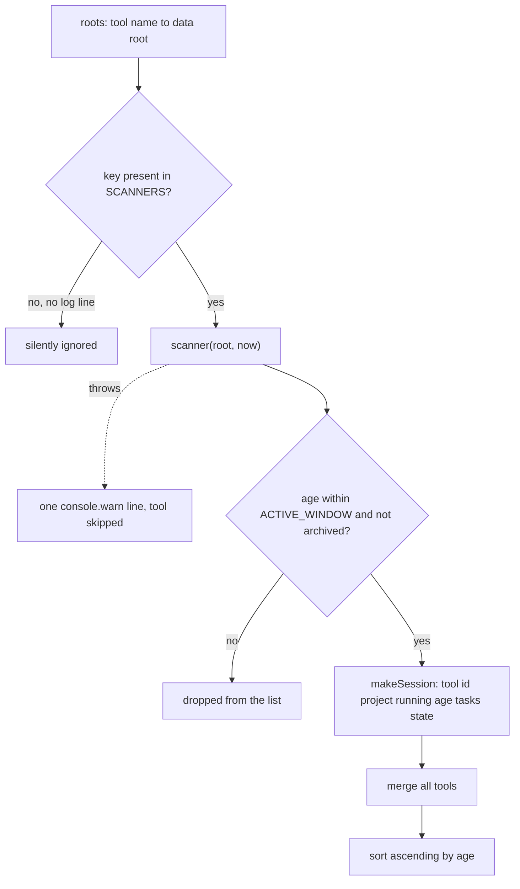
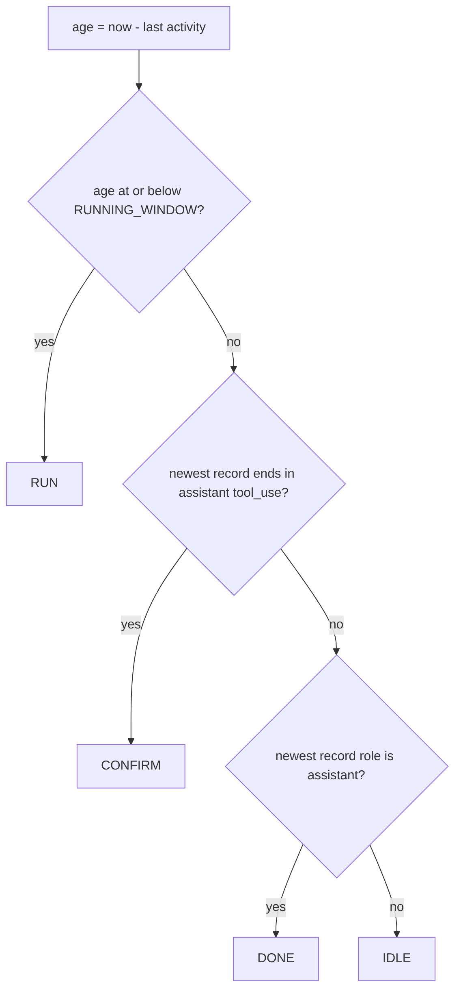
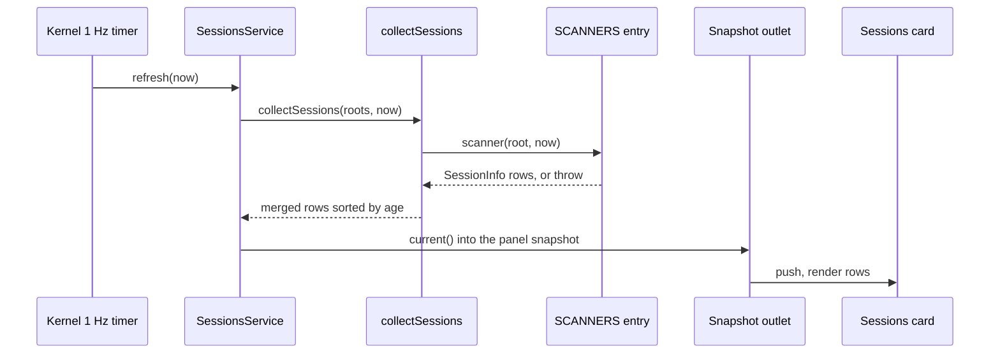

# Multi-tool session collection and the unified four-state model

<!-- openwiki: broken internal link [/repo://docs/adr/0003-multi-tool-unified-session-model.md#L3-L3] file "/repo://docs/adr/0003-multi-tool-unified-session-model.md" does not exist. Fix the href or restore the target, then delete this comment. -->
`app/src/main/scanners/` is the only component that turns other programs' session state into the `sessions` array of the panel snapshot. Five AI tools keep session state in five incompatible, private and version-dependent local formats — a JSONL event stream (qoder), two unrelated SQLite schemas (hermes, zcode), a per-session directory tree holding a `state.json` plus an append-only `agents/main/wire.jsonl` (kimi code), and two flat JSON maps whose conversation bodies stay in upstream private storage (kimi work). Rather than change an upstream format or introduce an intermediate store, the module gives each tool one strictly read-only scanner and normalizes all of them into the single session record the panel front end already understood: the four-state vocabulary `RUN` / `CONFIRM` / `DONE` / `IDLE` plus one pair of activity windows ([ADR-0003](/repo://docs/adr/0003-multi-tool-unified-session-model.md#L3-L3)).

<!-- openwiki: broken internal link [/repo://app/src/main/scanners/types.ts#L1-L5] file "/repo://app/src/main/scanners/types.ts" does not exist. Fix the href or restore the target, then delete this comment. -->
<!-- openwiki: broken internal link [/repo://docs/adr/0004-electron-cordis-standalone-panel.md#L8-L8] file "/repo://docs/adr/0004-electron-cordis-standalone-panel.md" does not exist. Fix the href or restore the target, then delete this comment. -->
The module is pure logic: direct file-system and SQLite reads with no API or IPC in between, which is what makes the whole read path testable offline ([types.ts](/repo://app/src/main/scanners/types.ts#L1-L5)). Its wording still carries the origin of the semantics: the scanners are a field-by-field port of the retired Python `agent_sessions.py`, which went away with the Python data service on 2026-09-29 ([ADR-0004](/repo://docs/adr/0004-electron-cordis-standalone-panel.md#L8-L8)).

Two things must be preserved when changing anything here: the signature and record shape of the seam, and each scanner's interpretation of what "this session is alive" means.

## The seam: `collectSessions(roots, now)`

```ts
export function collectSessions(roots: SessionRoots, now: number): SessionInfo[]
```

- `roots` is a plain `{tool name: data root path}` mapping supplied by the caller (`SessionRoots = Record<string, string>`); production gets it from `defaultSessionRoots()`, tests get it from fixture builders. Nothing in a scanner resolves a real user path by itself.
- `now` is an injected wall-clock time in seconds. No scanner reads the clock itself, so window boundaries are assertable without sleeping.
- Dispatch is one lookup in the module-level `SCANNERS` record (`qoder`, `hermes`, `zcode`, `kimicode`, `kimiwork`). A key that is not in `SCANNERS` is skipped with no log line at all — a typo in a root mapping therefore drops a tool invisibly, unlike a store failure, which always logs.
- Each scanner call sits in its own `try`/`catch`; a throwing scanner contributes nothing and the tools after it still scan.
- The merged list is sorted ascending by `age`, so the most recently active session of any tool is first. `Array.prototype.sort` is stable, so equal ages keep the `roots` insertion order.



One seam fans out to five scanners; only records that survive each scanner's own window and archive filters reach the merged, age-sorted list, and a scanner that throws leaves exactly one warning line as its trace.

The public surface is deliberately one function. The module also re-exports its helpers (`scanQoder`, `taskStats`, `projectName`, `sessionLast`, `sessionState`, `ZCODE_SUBAGENT_PREFIX`, `dirName`, the window constants, `SCANNERS`) so tests and service code can reach them without importing scanner internals.

## The normalized record

Every record is built by `makeSession(tool, sid, project, age, state, options)` in `scanners/types.ts`, and the resulting shape is exactly the shared `SessionInfo` interface from the panel contract (re-exported by `scanners/types.ts`, so scanners and renderer cannot drift structurally):

| Field | Meaning and edge cases |
|---|---|
| `tool` | Source tool: `qoder`, `hermes`, `zcode`, `kimicode`, `kimiwork`. |
| `id` | Tool-local session id: jsonl stem, SQLite row id, session directory name, or the last colon-separated segment of a kimi work map key. |
| `project` | Display project: for qoder the basename of the last `cwd` in the jsonl tail, otherwise the last path segment of a stored directory; the empty string for kimi work. |
| `running` | Boolean liveness. Defaults to `age <= RUNNING_WINDOW`, but hermes can pass `true` with a much older `age` when a lease exists — consumers must not recompute it from `age`. |
| `age` | Seconds since last activity, rounded to an integer. |
| `tasks_done` / `tasks_total` | Numbers for qoder (from `tasks/`) and zcode (from `todo`); `null` for the other three tools, which the card renders as an empty cell. `null` means "this tool has no progress concept", a real `0/0` means "no tasks yet"; zcode can even emit `null` done with a positive total, because its `SUM` over an all-`NULL` group is `NULL`. |
| `state` | One of `RUN`, `CONFIRM`, `DONE`, `IDLE` (`SessionState` in the contract keeps the literal hints without locking out an unknown state). |

<!-- openwiki: broken internal link [/repo://docs/adr/0003-multi-tool-unified-session-model.md#L17-L17] file "/repo://docs/adr/0003-multi-tool-unified-session-model.md" does not exist. Fix the href or restore the target, then delete this comment. -->
`tool` + `id` is the session identity. ADR-0003 records it as a hard consequence of the design: the unique key must carry the tool prefix, because two tools' local ids can collide and would otherwise overwrite each other's row ([ADR-0003](/repo://docs/adr/0003-multi-tool-unified-session-model.md#L17-L17)). The `tool` field is also the routing key of a session row: the card maps it to a two-letter tag and sends it to `session/focus`.

## Activity windows and the four-state model

Two constants in `scanners/types.ts` define every window decision, and they are the single definition in the codebase:

- `RUNNING_WINDOW = 90.0` — a session whose last activity is at most 90 s old counts as running.
- `ACTIVE_WINDOW = 600.0` — a session strictly older than 600 s leaves the list entirely.

Both boundaries are inclusive on the "kept" side: exactly 600 s old is still listed, 601 s is not; exactly 90 s old is still `RUN`. Window and state decisions run on the **unrounded** age; rounding happens only inside `makeSession`, for display.

The four-state vocabulary is shared by all tools, but the derivation is not:



<!-- openwiki: broken internal link [/repo://docs/adr/0003-multi-tool-unified-session-model.md#L14-L14] file "/repo://docs/adr/0003-multi-tool-unified-session-model.md" does not exist. Fix the href or restore the target, then delete this comment. -->
That ladder is `sessionState(age, role, kind)` in `scanners/qoder.ts`, and it is reachable only from the qoder scanner. `CONFIRM` means "the agent's last action was a tool call the user has not answered yet", which requires reading the session's own event stream; no other tool exposes an equivalent signal, so non-qoder rows never show `CONFIRM` — an accepted distortion recorded in [ADR-0003](/repo://docs/adr/0003-multi-tool-unified-session-model.md#L14-L14). The other scanners produce at most three states:

| Tool | States it can emit | Why |
|---|---|---|
| `qoder` | `RUN`, `CONFIRM`, `DONE`, `IDLE` | mtime for age plus the jsonl tail for the answered/unanswered tool call split. |
| `hermes` | `RUN`, `DONE`, `IDLE` | Lease or open `end_reason` for liveness, explicit end reason for `DONE`; no message stream to read. |
| `zcode` | `RUN`, `DONE` | An explicit timestamp has no richer tail signal. |
| `kimicode` | `RUN`, `DONE` | Pure file mtime, and the `wire.jsonl` tail carries config events with no role field. |
| `kimiwork` | `RUN`, `DONE`, `IDLE` | An explicit status map, but only `completed` is verified; any other value falls back to `IDLE`. |

The vocabulary is therefore five tools sharing one visual language, while precision varies per tool by construction. ADR-0003 accepts that tiering explicitly and fixes the remedy for a tool that flickers because of sparse writes: widen that tool's own window rather than change the unified model.

## Per-tool scanners and signal strength

| Tool | Where it reads | Liveness / state signal | `project` | `tasks` | Accuracy tier |
|---|---|---|---|---|---|
| `qoder` | `projects/*/*.jsonl` mtime, the jsonl tail, and `tasks/<session id>/*.json` | mtime for age; newest `assistant`/`user` record for `CONFIRM`/`DONE`/`IDLE` | last `cwd` in the last 64 KB, else the jsonl's parent directory name | from `tasks/`: `done` = `status == "completed"`, `total` = files that parse | heuristic, but the only source of `CONFIRM` |
| `hermes` | `state.db` (`sessions`) + `runtime/active_sessions.json` | session id present in the lease file, or `end_reason` is `null` and activity ≤ 90 s | last segment of the `cwd` column (`title` is never selected) | `null` | strongest: lease cross-checked with an explicit end reason |
| `zcode` | `cli/db/db.sqlite` (`session`, `todo`) | explicit millisecond `time_updated`, converted as `now - upd / 1000`; `time_archived` and `sess_subagent_` ids are excluded | last segment of the `directory` column | `SUM(status = 'completed')` / `COUNT(*)` grouped by `session_id`, `(0, 0)` when a session has no todos | strong: explicit timestamps plus an archive flag |
| `kimicode` | `sessions/<workspace>/<session>/state.json` and `agents/main/wire.jsonl` | the newer of the two file mtimes; `state.json` supplies `workDir` | last segment of `workDir` (empty when the key is absent) | `null` | coarsest: pure file mtime |
| `kimiwork` | `conversation-statuses.json` + `conversation-context-usage.json` | per-conversation `updatedAt` from the usage map; `completed` → `DONE`, unknown value → `IDLE` | always `""` (`title` is unavailable) | `null` | explicit status but coarse timing, and deliberately title-less |

Four entries need emphasis:

- **Nothing is read twice where a tail suffices.** qoder's session jsonl is an unbounded append log, so `readTail` reads at most 131072 bytes for the tail classification and at most 65536 bytes for `cwd`; `sessionLast` scans those lines downwards for `"type"`, skips lines that fail to parse, and returns the newest `assistant`/`user` record — a `user` record gives kind `user`, an assistant record whose content list ends in a `tool_use` block gives kind `tool`, anything else gives `text`. A file with no recognizable record (or an unreadable one) yields `(null, null)`, which lands on `IDLE` outside the running window while the session is still listed from its mtime with a fallback project name.
- **zcode's subagent filter.** `ZCODE_SUBAGENT_PREFIX = "sess_subagent_"` exists because real zcode data produced subagent sessions in numbers that swamped the list (acceptance decision, `.scratch/agent-deck-multi-sessions/spec.md`); the prefix test happens inside the scanner, so the noise never reaches the seam.
- **hermes reads its lease file before the database** and treats any failure to parse it as "no leases" — sessions are still returned, just without lease-based `RUN` promotion. No log line is emitted for that case.
- **kimi work's degraded row.** The conversation text and titles live in upstream private storage, so the record carries no project and no tasks and the card falls back to "tool tag + state". A conversation appears only if it has both a status entry and a usage entry with a non-empty `updatedAt`.

## Failure semantics and the read-only guarantee

The module's availability rule is explicit: one tool's store being missing, locked or corrupt must never break the panel. Consequences visible in the code:

- **Per-tool isolation.** Each scanner call is wrapped in `try`/`catch`; a failure prints one warning line (`agent-sessions: <tool> 扫描失败，跳过：…`) through `console.warn` and the tool contributes nothing, while the tools after it still scan. `tests/scanners/collect.spec.ts` registers a deliberately throwing scanner through `SCANNERS` to hold that property.
- **Whole-tool versus per-item degradation.** A missing or corrupt source skips the whole tool for hermes, zcode and kimi work; for qoder and kimi code a missing directory simply yields no sessions. kimi code is finer grained: a `state.json` that cannot be read or parsed skips that one session while its siblings still appear. But a *thrown* error — hermes activity that is not a number, zcode `time_updated` that is not a number, a kimi code `state.json` that parses into a non-object, kimi work's unparseable JSON or invalid ISO `updatedAt` — escapes the row loop and skips the whole tool. The distinction is deliberate: caught read/parse failures degrade one item, thrown type violations degrade the tool.
- **A failed round yields an empty table.** `SessionsService.refresh(now)` wraps the whole seam call; if the round fails unexpectedly it logs `deck-sessions: 本轮扫描意外失败，给空表：…` and stores an empty list instead of keeping the previous one, so the panel never shows stale rows as zombies.
- **Strictly read-only, by mechanism rather than by convention.** JSON stores are read with `readFileSync` and an `openSync`/`readSync` tail read; no write path exists anywhere in the module. SQLite goes through the shared `openReadOnly` helper, which opens `DatabaseSync` with `{ readOnly: true }` (the `node:sqlite` equivalent of the Python `file:…?mode=ro` URI that ADR-0003 names) and then sets `PRAGMA busy_timeout = 500`; if that pragma fails it closes the handle and throws. The short busy timeout is what makes a database held exclusively by its own writer fail fast into the silent-skip path instead of stalling the 1 Hz sampling round, while the read-only open guarantees the panel can never write to a tool's store.
- **Metadata-only projections.** Neither database's `title` column is selected: hermes reads `id, cwd, last_activity_at, started_at, end_reason, archived`, zcode reads `id, directory, time_updated, time_archived` plus the grouped todo counts. No message body, todo text or conversation text ever reaches a session record.

Because the stores are private and version-dependent, the scanners are brittle by design against upstream format changes; the mitigation is structural rather than defensive parsing — a format change surfaces as one skipped tool plus a log line, never as a broken panel. ADR-0003 records that trade as availability over fault visibility, the consumer then being the wallpaper rather than today's standalone panel.

## Who drives the seam, and where the roots come from

`SessionsService` is the only caller. It resolves its roots once at construction (`options.roots ?? defaultSessionRoots()`), exposes `refresh(now)` for one sampling round and `current()` for the last result. The kernel option `sessionRoots` is the injection seam: tests pass fixture roots, while the production data-plane kernel passes nothing and therefore uses the real defaults.

`defaultSessionRoots(home = os.homedir())` is the single place the five production paths are spelled out, and it mirrors the retired Python `SESSION_ROOTS`:

| Tool | Production root |
|---|---|
| `qoder` | `~/.qoder-cn` |
| `hermes` | `~/AppData/Local/hermes` |
| `zcode` | `~/.zcode` |
| `kimicode` | `~/.kimi-code` |
| `kimiwork` | `~/AppData/Roaming/kimi-desktop/kimi-agent` |

These roots are not configurable through `config.json` (that file only carries the `tools` launch mapping used by session-row click-through). Overriding them means passing `sessionRoots` into the kernel or `roots` into the service.

The sampling cadence is 1 Hz, driven outside the module:



Two assemblies exist behind that shape. In the in-process kernel the 1 Hz timer calls `bridge.tick()`, which calls `panelData.refresh()` and then pushes `panel/changed`; in the production data-plane kernel the timer calls `sessions.refresh()` directly in the utility process and posts a snapshot to the panel process, which pushes it on to the renderer. Either way the collection itself never leaves the process that owns the sampling timer.

Downstream, the sessions card turns each record into one row: `tool` becomes a two-letter tag (unknown tool → `??`), `state` becomes its lowercase CSS class, `project` becomes the name, and `tasks_done`/`tasks_total` become `NNN/NNN` only when both are non-null. The header count is the full list length while the visible list is capped at nine rows, and a row with no sessions shows the standby text rather than an empty box. Clicking a row invokes `session/focus` with the tool name, which the focus service resolves through its own tool-to-executable map.

## History: the retired Qoder status block

The scanners module once also produced a Qoder status snapshot — a separate "most recently active qoder session" projection consumed by a dedicated Qoder status card. That card, the `qoderStatus` helper, the `QoderStatus` type, the `qoder` snapshot section and the `qoder` plugin capability were all removed in ticket 03, while the Qoder **session row** and the shared helpers behind it were explicitly kept: the QD tag, the inline task progress and the click-through are five-tool common capability, not status-block features (`.scratch/generic-deck-fixes/issues/03-qoder-status-retire.md`). The panel's visible Qoder information therefore comes from `collectSessions` alone, and the only visible effect of the retirement inside this module is that `taskStats(...).current` — the subject of the first `in_progress` task — is computed and returned but no longer has a consumer; `scanQoder` still uses the same helper for the `done`/`total` counts, and `qoderJsonlRows` remains the single qoder row source. Any older reference to a Qoder status snapshot, `/performance` or a server-side qoder scan describes the retired Python data service, not this code.

## Invariants to preserve when changing this module

- `collectSessions(roots, now)` stays the only entry point, keeps taking injected roots and an injected time, stays free of APIs and IPC, and keeps returning a merged list sorted by `age` ascending.
- Adding a tool means: write a scanner returning `makeSession(...)` records, register it in `SCANNERS`, add its default root to `defaultSessionRoots()`, and add a fixture plus a spec. Windows, sorting, failure isolation and record shape then apply for free.
- Never let a scanner write to a tool's store, and never let a single source's failure propagate out of a scanner — the round-level empty table is the last resort, not the expected path.
- Keep the record shape identical to the shared `SessionInfo` contract: the renderer decides the tasks cell and the state class from it. `running` stays as each scanner computed it, including hermes's lease override; `tasks_*` stays `null` for tools with no progress concept, which is not the same as `0/0`.
- `CONFIRM` is qoder-only by construction — do not extend it to a tool that has no real confirmation signal.
- Window decisions are inclusive at both boundaries and always run on the unrounded age.

## Focused tests

The seam is the test boundary: every assertion starts from fixture roots on disk plus a fixed `now`, and no test touches a real user directory.

- `tests/scanners/collect.spec.ts` holds the seam contract for qoder: field mapping and project fallback, the four-state judgment including "recent wins over tail kind", both window boundaries (the boundary instants are derived from the fixture file's own mtime plus `RUNNING_WINDOW` / `ACTIVE_WINDOW`), the `(0, 0)` default and completed/in_progress/pending counting, ordering by age, an unknown tool key being ignored, a raising scanner not affecting the other tools, and a garbage jsonl still yielding a session with the directory-name project.
- `tests/scanners/fixtures.ts` builds the data roots and is the executable statement of each store layout: `QoderFx` (jsonl plus `tasks/<sid>/*.json`, mtimes set through `fs.utimesSync` relative to the fixture clock), `HermesFx` (a real `node:sqlite` `sessions` table plus a lease file), `ZcodeFx` (`session` + `todo` tables with millisecond timestamps), `KimiCodeFx` (workspace/session directories with independently aged `state.json` and `wire.jsonl`), and `KimiWorkFx` (both JSON maps with the `agent:main:main:conversation:<uuid>` key shape).
- `tests/scanners/hermes.spec.ts` covers the lease cross-check: a lease keeps an old unended session `RUN`, an old unended session without a lease is `IDLE`, an ended session is `DONE` even when recent, archived rows are excluded, tasks are `null`, a missing database skips the tool, and a corrupt lease file still scans.
- `tests/scanners/zcode.spec.ts` covers run/done mapping, todo counts and the `0/0` default, archived exclusion, `sess_subagent_` exclusion, missing and corrupt database files skipping the tool, and ordering.
- `tests/scanners/kimicode.spec.ts` covers the directory-tree layout: a newer `wire.jsonl` than `state.json` drives `age`, old sessions fall to `DONE`, tasks are `null`, one broken `state.json` skips a single session while its sibling still appears, and a missing `sessions` directory yields an empty list.
- `tests/scanners/kimiwork.spec.ts` covers the two-map contract: `completed` → `DONE`, unknown status → `IDLE`, the recent case → degraded `RUN` with an empty project, exclusion when either map lacks the conversation, window expiry, and a broken usage file skipping the whole tool.
- Service-level checks sit outside the scanner suite: `tests/services.spec.ts` drives `SessionsService.refresh` against a fixture root (asserting the Qoder row with its inline task progress) and asserts that the panel snapshot no longer carries a qoder section, and `tests/dataplane-kernel.spec.ts` asserts that the data-plane snapshot outlet carries the scanned sessions.

Related reading: [domain model](/openwiki/concepts/domain-model.md) for the project vocabulary, [agent-tool-stores](/openwiki/integrations/agent-tool-stores.md) for the per-tool store reference on the other side of this boundary, and [system overview](/openwiki/architecture/overview.md) for where the panel snapshot is consumed.
