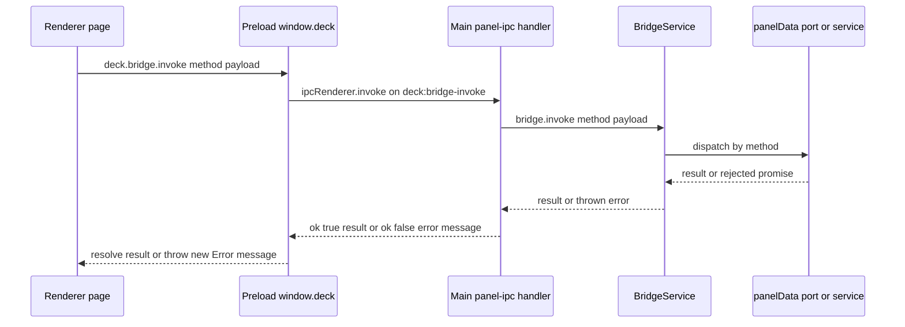
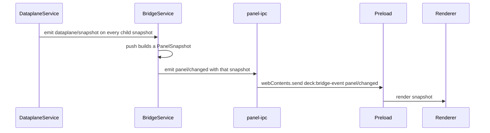

# Bridge contract and IPC transport

The panel is two processes with very different privileges: a main process that owns windows, Win32 calls, the disk, the plugin host and the collection services, and a sandboxed renderer that draws the cards. Everything that crosses that line — the 1 Hz snapshot, every user action, every pushed update — crosses it through exactly one API shape, declared in `app/src/shared/contract.ts`.

<!-- openwiki: broken internal link [/repo://app/src/shared/contract.ts#L1-L7] file "/repo://app/src/shared/contract.ts" does not exist. Fix the href or restore the target, then delete this comment. -->
The file's own header states the discipline that keeps this from rotting: later work extends the `methods` / `events` maps, never opens another channel ([contract.ts](/repo://app/src/shared/contract.ts#L1-L7)). That is the invariant this page documents, together with the transport that carries those maps, the reason the transport uses an envelope instead of throwing raw errors, and the one intentionally separate namespace (`window.deck.host`) that sits next to the contract without being part of it.

## The contract surface

`contract.ts` declares four things that matter to the seam:

| Declaration | What it fixes |
|---|---|
| `PanelSnapshot` | The one snapshot shape: eight sections, shared by the `panel/snapshot` response and the `panel/changed` payload |
| `BridgeMethods` | Method → `{ request, response }`: the complete callable vocabulary (11 methods) |
| `BridgeEvents` | Event → payload: the complete pushed vocabulary (5 events) |
| `HotzoneRect` | The only type shared with the window-host namespace: an interaction rectangle in CSS px relative to the window client area |

<!-- openwiki: broken internal link [/repo://app/src/shared/contract.ts#L270-L271] file "/repo://app/src/shared/contract.ts" does not exist. Fix the href or restore the target, then delete this comment. -->
`BridgeMethod` and `BridgeEventName` are derived from the two maps (`keyof … & string`), so the maps are not documentation — they are the type that dispatch, the preload-facing page typings and the tests are all checked against ([contract.ts](/repo://app/src/shared/contract.ts#L270-L271)).

### `PanelSnapshot` sections and who fills them

<!-- openwiki: broken internal link [/repo://app/src/main/services/bridge.ts#L37-L48] file "/repo://app/src/main/services/bridge.ts" does not exist. Fix the href or restore the target, then delete this comment. -->
`BridgeService.snapshot()` is the single assembly point; there is no second place that builds a snapshot ([bridge.ts](/repo://app/src/main/services/bridge.ts#L37-L48)).

| Section | Owner | Notes |
|---|---|---|
| `clock`, `sessions`, `hardware`, `desktop` | the `panelData` port | In production these arrive from the data-plane child process on every tick; the in-process assembly reads the collection services directly |
| `weather` | `BridgeService` constructor option | From `config.weather`; frozen at kernel construction, not re-read per tick |
| `layout` | `BridgeService` constructor option | From `config.desktop`; same lifecycle |
| `settings` | `SettingsService.state()` | Card opacity |
| `plugins` | `PluginHostService.info()` | Plugin listing with resolved `deck-plugin://` entry URLs; empty array when no roots are configured |

The split explains a user-visible behaviour: weather coordinates and desktop layout geometry are read once at boot, so editing those `config.json` sections takes a panel restart, while settings travel live because they are read from a service on every snapshot.

<!-- openwiki: broken internal link [/repo://app/src/shared/contract.ts#L137-L148] file "/repo://app/src/shared/contract.ts" does not exist. Fix the href or restore the target, then delete this comment. -->
<!-- openwiki: broken internal link [/repo://app/src/renderer/plugins.ts#L87-L95] file "/repo://app/src/renderer/plugins.ts" does not exist. Fix the href or restore the target, then delete this comment. -->
`PluginCapability` is deliberately one-to-one with the snapshot section names (`clock`, `sessions`, `hardware`, `weather`, `desktop`, `layout`, `settings`), and `PLUGIN_CAPABILITIES` is described as the single place where the renderer's trimming vocabulary is implemented ([contract.ts](/repo://app/src/shared/contract.ts#L137-L148)). A plugin's capabilities are not a kernel-side filter: the host hands the whole snapshot to the page and the page trims it per plugin ([plugins.ts](/repo://app/src/renderer/plugins.ts#L87-L95)).

### `BridgeMethods` — the callable vocabulary

| Method | Request | Response | Dispatched to |
|---|---|---|---|
| `panel/snapshot` | `null` | `PanelSnapshot` | `BridgeService.snapshot()` |
| `desktop/icon` | `{ key }` | `{ dataUrl: string \| null }` | `panelData.icon` |
| `desktop/launch` | `{ path }` | `{ ok, error? }` | `panelData.launch` |
| `desktop/move` | `{ name, zone, beforeName }` | `{ ok, error? }` | `panelData.move` |
| `desktop/reset-layout` | `null` | `{ ok, cleared }` | `panelData.resetLayout` |
| `search/activate` | `null` | `{ state }` | `SearchService.activate` |
| `search/query` | `{ query }` | `{ accepted }` | `SearchService.setQuery` |
| `search/deactivate` | `null` | `{ state }` | `SearchService.deactivate` |
| `search/action` | `{ path, reveal }` | `{ ok, error? }` | `SearchService.action` |
| `settings/set-card-opacity` | `{ opacity }` | `SettingsState` | `SettingsService.setCardOpacity` |
| `session/focus` | `{ tool }` | `{ ok, action, error?, hwnd? }` | `FocusService.focusTool` |

<!-- openwiki: broken internal link [/repo://app/src/shared/contract.ts#L217-L252] file "/repo://app/src/shared/contract.ts" does not exist. Fix the href or restore the target, then delete this comment. -->
The map is the whole vocabulary: five snapshot/desktop methods, four search methods, one settings method, one session method ([contract.ts](/repo://app/src/shared/contract.ts#L217-L252)). Read-and-write asymmetry is visible in the types — `panel/snapshot` is the read; every other payload is an identifier or a primitive (`key`, `name`, `path`, `tool`, a query string, an opacity number), never a resolved target the kernel would have to trust.

### `BridgeEvents` — the pushed vocabulary

| Event | Payload | Emitted by | Emission discipline |
|---|---|---|---|
| `panel/changed` | `PanelSnapshot` | `BridgeService.push()` | Once per data-plane snapshot (production: 1 Hz) |
| `search/state` | `{ state }` | `SearchService.pushState()` | Only when the derived state actually changes |
| `search/results` | `{ total, items }` | `SearchService` on a successful engine response | Every successful response, including empty results |
| `settings/changed` | `SettingsState` | `SettingsService.setCardOpacity` | Only when the clamped value differs from the current one |
| `plugins/changed` | `PluginInfo[]` | `PluginHostService.rescan()` | Only when the serialized listing changes |

<!-- openwiki: broken internal link [/repo://app/src/main/services/search.ts#L158-L163] file "/repo://app/src/main/services/search.ts" does not exist. Fix the href or restore the target, then delete this comment. -->
<!-- openwiki: broken internal link [/repo://app/src/main/services/settings.ts#L39-L52] file "/repo://app/src/main/services/settings.ts" does not exist. Fix the href or restore the target, then delete this comment. -->
<!-- openwiki: broken internal link [/repo://app/src/main/plugins/service.ts#L157-L164] file "/repo://app/src/main/plugins/service.ts" does not exist. Fix the href or restore the target, then delete this comment. -->
<!-- openwiki: broken internal link [/repo://app/src/main/cordis.d.ts#L14-L29] file "/repo://app/src/main/cordis.d.ts" does not exist. Fix the href or restore the target, then delete this comment. -->
Three of the five are deduplicated at the source, which is what allows the page to treat an event as "something changed" rather than "a poll happened" ([search.ts](/repo://app/src/main/services/search.ts#L158-L163), [settings.ts](/repo://app/src/main/services/settings.ts#L39-L52), [plugins/service.ts](/repo://app/src/main/plugins/service.ts#L157-L164)). `plugins/changed` explicitly exists so hot-plugging is visible without waiting for the next `panel/changed` tick. The main process has one more event of the same shape that is *not* in `BridgeEvents` — `dataplane/snapshot`, the child-process arrival signal — and it must stay internal: it is declared only in the cordis `Events` augmentation ([cordis.d.ts](/repo://app/src/main/cordis.d.ts#L14-L29)).

Both maps are two-sided declarations of the same names: cordis's `Events` interface types the emitter side (services calling `ctx.emit`) and `BridgeEvents` types the payload the page receives. Keeping the two literal names aligned is manual work — nothing in the type system ties them together.

<!-- openwiki: broken internal link [/repo://app/src/renderer/global.d.ts#L21-L40] file "/repo://app/src/renderer/global.d.ts" does not exist. Fix the href or restore the target, then delete this comment. -->
On the page side, `window.deck` is typed from the same maps in the renderer's ambient declaration, so page code that invokes an unknown method or reads a wrong payload field fails `npm run typecheck` ([global.d.ts](/repo://app/src/renderer/global.d.ts#L21-L40)). The preload itself is deliberately untyped against the contract (`method: string`, `payload?: unknown`): it is a transport, not a participant.

## One invoke, end to end



*A method call crosses renderer, preload, main handler, `BridgeService` dispatch and the data/service layer; only the last hop differs between the two kernel assemblies.*

The steps in order, with what each layer is responsible for:

<!-- openwiki: broken internal link [/repo://app/src/renderer/main.ts#L765-L768] file "/repo://app/src/renderer/main.ts" does not exist. Fix the href or restore the target, then delete this comment. -->
1. **Page.** `window.deck.bridge.invoke(method, payload)` — the only way out of the renderer. The initial render uses `panel/snapshot` exactly once and then relies on `panel/changed`; the page never polls ([main.ts](/repo://app/src/renderer/main.ts#L765-L768)).
<!-- openwiki: broken internal link [/repo://app/src/preload/index.ts#L8-L31] file "/repo://app/src/preload/index.ts" does not exist. Fix the href or restore the target, then delete this comment. -->
<!-- openwiki: broken internal link [/repo://app/src/main/panel-window.ts#L31-L36] file "/repo://app/src/main/panel-window.ts" does not exist. Fix the href or restore the target, then delete this comment. -->
<!-- openwiki: broken internal link [/repo://app/tests/contract.spec.ts#L529-L534] file "/repo://app/tests/contract.spec.ts" does not exist. Fix the href or restore the target, then delete this comment. -->
2. **Preload.** `contextBridge.exposeInMainWorld('deck', …)` publishes `bridge.invoke`, `bridge.on`, and the three host functions — nothing else. The page runs with `contextIsolation: true`, `sandbox: true`, `nodeIntegration: false`, and a source-level guard asserts the preload touches no filesystem API: the renderer's only privileged surface is a 1:1 IPC forwarder ([preload/index.ts](/repo://app/src/preload/index.ts#L8-L31), [panel-window.ts](/repo://app/src/main/panel-window.ts#L31-L36), [contract.spec.ts](/repo://app/tests/contract.spec.ts#L529-L534)).
<!-- openwiki: broken internal link [/repo://app/src/main/panel-ipc.ts#L38-L48] file "/repo://app/src/main/panel-ipc.ts" does not exist. Fix the href or restore the target, then delete this comment. -->
<!-- openwiki: broken internal link [/repo://app/src/main/index.ts#L113-L114] file "/repo://app/src/main/index.ts" does not exist. Fix the href or restore the target, then delete this comment. -->
3. **Main handler.** `wireBridgeIpc` registers `ipcMain.handle('deck:bridge-invoke', …)` once per process, at boot, before `win.loadURL(panelUrl())` — so the handler is in place before the page's first invoke ([panel-ipc.ts](/repo://app/src/main/panel-ipc.ts#L38-L48), [index.ts](/repo://app/src/main/index.ts#L113-L114)).
<!-- openwiki: broken internal link [/repo://app/src/main/services/bridge.ts#L50-L91] file "/repo://app/src/main/services/bridge.ts" does not exist. Fix the href or restore the target, then delete this comment. -->
4. **Dispatch.** `BridgeService.invoke` is a `switch` over the method name; every case reads its payload fields with an explicit cast, coerces where the wire is untrusted (`String(query ?? '')`, `String(tool ?? '')`, `Boolean(reveal)`), and delegates ([bridge.ts](/repo://app/src/main/services/bridge.ts#L50-L91)). The bridge validates no business rules itself — it is a pass-through switch.
<!-- openwiki: broken internal link [/repo://app/src/main/services/panel-data.ts#L10-L23] file "/repo://app/src/main/services/panel-data.ts" does not exist. Fix the href or restore the target, then delete this comment. -->
5. **Where the work lands.** Data sections and desktop actions go through the `panelData` port; everything else goes to a service. Which is a pure seam: `PanelDataPort` has two implementations with the same interface ([panel-data.ts](/repo://app/src/main/services/panel-data.ts#L10-L23)).

| Call | In-process assembly (`LocalPanelDataService`) | Production (`DataplaneService`) |
|---|---|---|
| `desktop/icon` | `DesktopService.icon` (icon cache in the main process) | Main-process `IconCache` — `app.getFileIcon` is only available there |
| `desktop/launch` | `DesktopService.launch` | Main-process `shellOpen`, validated against the main process's own copy of the latest item pool |
| `desktop/move`, `desktop/reset-layout` | `DesktopService.move` / `resetLayout` | RPC over `utilityProcess.postMessage` to the data-plane child (`DataplaneMethod` is exactly these two) |

<!-- openwiki: broken internal link [/repo://app/src/main/services/dataplane.ts#L161-L181] file "/repo://app/src/main/services/dataplane.ts" does not exist. Fix the href or restore the target, then delete this comment. -->
<!-- openwiki: broken internal link [/repo://app/src/main/dataplane-protocol.ts#L27-L38] file "/repo://app/src/main/dataplane-protocol.ts" does not exist. Fix the href or restore the target, then delete this comment. -->
That split is the `PanelDataPort` contract in practice: Electron main-process APIs stay in the main process, and only the two pure layout writes cross into the child ([dataplane.ts](/repo://app/src/main/services/dataplane.ts#L161-L181), [dataplane-protocol.ts](/repo://app/src/main/dataplane-protocol.ts#L27-L38)).

### Two outcome shapes, and why the difference is load-bearing

A page cannot learn everything from "did the promise reject?" because the kernel answers in two registers:

<!-- openwiki: broken internal link [/repo://app/src/main/services/desktop.ts#L150-L178] file "/repo://app/src/main/services/desktop.ts" does not exist. Fix the href or restore the target, then delete this comment. -->
<!-- openwiki: broken internal link [/repo://app/src/main/services/search.ts#L135-L146] file "/repo://app/src/main/services/search.ts" does not exist. Fix the href or restore the target, then delete this comment. -->
<!-- openwiki: broken internal link [/repo://app/src/main/services/focus.ts#L62-L90] file "/repo://app/src/main/services/focus.ts" does not exist. Fix the href or restore the target, then delete this comment. -->
- **In-band failure** — the call resolves with `ok: false` and, usually, an `error` string: `desktop/launch` for a path outside the current desktop item pool, `desktop/move` for an anchor item in the wrong zone or a pinned dock item, `search/action` for a path outside the most recent result set, `session/focus` for an unknown tool or a refused foreground activation (`{ ok: false, action: 'degraded' }`) ([desktop.ts](/repo://app/src/main/services/desktop.ts#L150-L178), [search.ts](/repo://app/src/main/services/search.ts#L135-L146), [focus.ts](/repo://app/src/main/services/focus.ts#L62-L90)).
- **Rejection** — the promise rejects and the preload turns it into a thrown `Error`: an unknown method, a contract-violating payload, or a data-plane child that is missing or has just exited.

The guardrails themselves (item-pool membership for `desktop/launch`, result-set membership for `search/action`, tool-name mapping for `session/focus`) live in the port implementations and services, never in `panel-ipc.ts` or in the `BridgeService` switch. The bridge is therefore not the security boundary; it is the only *transport* boundary, and it is deliberately dumb.

## How a pushed event travels



*`panel/changed` is the busy case: the data-plane arrival signal drives a fresh snapshot build, which is then forwarded name-tagged over the one event channel.*

<!-- openwiki: broken internal link [/repo://app/src/main/panel-ipc.ts#L49-L54] file "/repo://app/src/main/panel-ipc.ts" does not exist. Fix the href or restore the target, then delete this comment. -->
<!-- openwiki: broken internal link [/repo://app/src/preload/index.ts#L15-L21] file "/repo://app/src/preload/index.ts" does not exist. Fix the href or restore the target, then delete this comment. -->
- **One channel, name-tagged payloads.** All five events travel as `('deck:bridge-event', name, payload)`. There is no per-event Electron channel, and the preload filters by name inside the listener it registers per `on()` call, returning an unsubscribe closure ([panel-ipc.ts](/repo://app/src/main/panel-ipc.ts#L49-L54), [preload/index.ts](/repo://app/src/preload/index.ts#L15-L21)).
<!-- openwiki: broken internal link [/repo://app/src/main/panel-ipc.ts#L30-L36] file "/repo://app/src/main/panel-ipc.ts" does not exist. Fix the href or restore the target, then delete this comment. -->
<!-- openwiki: broken internal link [/repo://app/src/main/services/bridge.ts#L93-L96] file "/repo://app/src/main/services/bridge.ts" does not exist. Fix the href or restore the target, then delete this comment. -->
- **A whitelist, not a pass-through.** `FORWARDED_EVENTS` in `panel-ipc.ts` names all five events; `BridgeService.subscribe` itself is generic and will happily accept any name that exists on the cordis context ([panel-ipc.ts](/repo://app/src/main/panel-ipc.ts#L30-L36), [bridge.ts](/repo://app/src/main/services/bridge.ts#L93-L96)). This is the main place where "it is in `BridgeEvents`" and "the page receives it" can drift apart.
- **Per-window lifecycle.** The subscriptions are installed against one `BrowserWindow` and released on `closed`; the send is guarded by `!win.isDestroyed()`, so a page that is closing never sees a write into a dead `webContents`.
<!-- openwiki: broken internal link [/repo://app/src/main/services/dataplane.ts#L90-L100] file "/repo://app/src/main/services/dataplane.ts" does not exist. Fix the href or restore the target, then delete this comment. -->
<!-- openwiki: broken internal link [/repo://app/src/main/services/bridge.ts#L25-L35] file "/repo://app/src/main/services/bridge.ts" does not exist. Fix the href or restore the target, then delete this comment. -->
<!-- openwiki: broken internal link [/repo://app/src/main/kernel.ts#L85-L89] file "/repo://app/src/main/kernel.ts" does not exist. Fix the href or restore the target, then delete this comment. -->
<!-- openwiki: broken internal link [/repo://app/src/main/services/bridge.ts#L98-L107] file "/repo://app/src/main/services/bridge.ts" does not exist. Fix the href or restore the target, then delete this comment. -->
- **What drives the tick.** In production nothing calls `BridgeService.tick()`: each `dataplane/snapshot` from the child triggers `push()` on the same 1-second cadence as the child process ([dataplane.ts](/repo://app/src/main/services/dataplane.ts#L90-L100), [bridge.ts](/repo://app/src/main/services/bridge.ts#L25-L35)). In the in-process assembly used by the offline tests, no such event exists, so `createKernel` installs a 1-second timer that calls `tick()` — refresh the collection services, then push ([kernel.ts](/repo://app/src/main/kernel.ts#L85-L89), [bridge.ts](/repo://app/src/main/services/bridge.ts#L98-L107)).
<!-- openwiki: broken internal link [/repo://app/src/renderer/plugins.ts#L27-L39] file "/repo://app/src/renderer/plugins.ts" does not exist. Fix the href or restore the target, then delete this comment. -->
- **Plugins do not subscribe.** A plugin's host context exposes `notify` and `invoke` but no `on`, so third-party code cannot attach to the event stream; it only ever receives its trimmed snapshot view through `mount`/`update` ([plugins.ts](/repo://app/src/renderer/plugins.ts#L27-L39)).

## The ok/error envelope, and `BridgeError`

IPC does not serialize `Error` faithfully — an `Error` thrown in the main process arrives at the renderer stripped of its class, custom fields and stack. The transport therefore carries a *value* and lets the preload re-create the failure:

```ts
// main, inside ipcMain.handle('deck:bridge-invoke')
bridge.invoke(method, payload).then(
  (result) => ({ ok: true, result }),
  (err) => ({ ok: false, error: { message: err instanceof Error ? err.message : String(err) } }),
)
```

```ts
// preload
ipcRenderer.invoke('deck:bridge-invoke', { method, payload }).then((envelope) => {
  if (envelope && envelope.ok) return envelope.result
  throw new Error(envelope?.error?.message ?? 'bridge invoke failed')
})
```

<!-- openwiki: broken internal link [/repo://app/src/main/panel-ipc.ts#L39-L48] file "/repo://app/src/main/panel-ipc.ts" does not exist. Fix the href or restore the target, then delete this comment. -->
<!-- openwiki: broken internal link [/repo://app/src/preload/index.ts#L10-L14] file "/repo://app/src/preload/index.ts" does not exist. Fix the href or restore the target, then delete this comment. -->
([panel-ipc.ts](/repo://app/src/main/panel-ipc.ts#L39-L48), [preload/index.ts](/repo://app/src/preload/index.ts#L10-L14)).

Consequences worth knowing before debugging a bridge call:

<!-- openwiki: broken internal link [/repo://app/tests/contract.spec.ts#L100-L108] file "/repo://app/tests/contract.spec.ts" does not exist. Fix the href or restore the target, then delete this comment. -->
<!-- openwiki: broken internal link [/repo://app/tests/contract.spec.ts#L371-L383] file "/repo://app/tests/contract.spec.ts" does not exist. Fix the href or restore the target, then delete this comment. -->
- **The message string is the entire error taxonomy.** `name`, `stack`, custom fields and any structural discriminator are gone. The page cannot tell a contract violation from an I/O failure except by reading the text, and the text is Chinese in the source. The offline tests accept that constraint and assert on message fragments — `/未知桥接方法/` for an unknown method, `/cardOpacity/` for a non-numeric opacity ([contract.spec.ts](/repo://app/tests/contract.spec.ts#L100-L108), [contract.spec.ts](/repo://app/tests/contract.spec.ts#L371-L383)).
<!-- openwiki: broken internal link [/repo://app/src/main/services/bridge.ts#L8-L14] file "/repo://app/src/main/services/bridge.ts" does not exist. Fix the href or restore the target, then delete this comment. -->
<!-- openwiki: broken internal link [/repo://app/src/main/services/bridge.ts#L88-L90] file "/repo://app/src/main/services/bridge.ts" does not exist. Fix the href or restore the target, then delete this comment. -->
<!-- openwiki: broken internal link [/repo://app/src/main/services/settings.ts#L39-L43] file "/repo://app/src/main/services/settings.ts" does not exist. Fix the href or restore the target, then delete this comment. -->
- **`BridgeError` marks contract violations.** It is defined in `services/bridge.ts`, thrown by the `default:` branch of the dispatch switch for an unknown method, and imported by `SettingsService` for a payload that violates the contract ([bridge.ts](/repo://app/src/main/services/bridge.ts#L8-L14), [bridge.ts](/repo://app/src/main/services/bridge.ts#L88-L90), [settings.ts](/repo://app/src/main/services/settings.ts#L39-L43)). Reaching the page, it is indistinguishable from any other thrown error — the class exists to make the *kernel-side* intent explicit and to keep "reject rather than silently clamp" honest.
- **Malformed payloads reject rather than crash the main process.** The dispatch cases destructure the payload without validation, so `null` where an object is expected throws a `TypeError` inside the async method; that rejection travels the same envelope path as an intentional `BridgeError`. The `req ?? {}` guard means a completely empty request is reported as an unknown method instead of throwing in the handler.
- **The envelope is not the only failure surface.** If `ipcRenderer.invoke` itself rejects — no handler registered for the channel, or a synchronous throw inside the main handler before the promise chain exists — the page sees Electron's own error text rather than the envelope. A caller should treat that class as "could not reach the kernel", not as a kernel verdict.
<!-- openwiki: broken internal link [/repo://app/src/renderer/main.ts#L765-L767] file "/repo://app/src/renderer/main.ts" does not exist. Fix the href or restore the target, then delete this comment. -->
- **Error text is not user-facing.** The page's policy is silent degradation: rejections are ignored or turned into evidence records (`snapshot-error`, `settings-opacity-failed`, `desktop-launch-failed`) and never into dialogs, because a panel of cards must not fight the desktop for attention ([main.ts](/repo://app/src/renderer/main.ts#L765-L767)).

## The host channel: `window.deck.host`

The same `window.deck` namespace also carries a second group of channels that are *not* in `BridgeMethods` / `BridgeEvents` and never touch `BridgeService`:

| Preload function | Electron channel | Direction | Effect |
|---|---|---|---|
| `setHotZones(rects)` | `deck:host-set-hotzones` | `ipcRenderer.send` | `HotzoneTracker.setRects(rects)` plus an evidence-log record carrying the rectangles |
| `setKeyboardMode(on)` | `deck:host-keyboard-mode` | `ipcRenderer.send` | `on`: make the window focusable, focus it, pin it; `off`: restore non-focusable, pin it |
| `notify(type, payload)` | `deck:host-notify` | `ipcRenderer.send` | Evidence-log record only |

<!-- openwiki: broken internal link [/repo://app/src/preload/index.ts#L23-L30] file "/repo://app/src/preload/index.ts" does not exist. Fix the href or restore the target, then delete this comment. -->
<!-- openwiki: broken internal link [/repo://app/src/main/panel-ipc.ts#L57-L83] file "/repo://app/src/main/panel-ipc.ts" does not exist. Fix the href or restore the target, then delete this comment. -->
([preload/index.ts](/repo://app/src/preload/index.ts#L23-L30), [panel-ipc.ts](/repo://app/src/main/panel-ipc.ts#L57-L83))

Three properties distinguish this namespace from the kernel contract:

- **Fire-and-forget.** All three use `ipcRenderer.send` / `ipcMain.on`: no request, no response, no envelope, no rejection path. A page cannot learn whether a hotzone declaration was accepted.
<!-- openwiki: broken internal link [/repo://app/src/main/panel-window.ts#L42] file "/repo://app/src/main/panel-window.ts" does not exist. Fix the href or restore the target, then delete this comment. -->
<!-- openwiki: broken internal link [/repo://app/src/main/hotzone.ts#L20-L69] file "/repo://app/src/main/hotzone.ts" does not exist. Fix the href or restore the target, then delete this comment. -->
<!-- openwiki: broken internal link [/repo://app/src/main/index.ts#L127-L136] file "/repo://app/src/main/index.ts" does not exist. Fix the href or restore the target, then delete this comment. -->
<!-- openwiki: broken internal link [/repo://app/src/main/index.ts#L165-L169] file "/repo://app/src/main/index.ts" does not exist. Fix the href or restore the target, then delete this comment. -->
- **Window-host mechanics, not data.** Hotzones describe *this window's* interactivity; the panel is click-through by default (`setIgnoreMouseEvents(true)` at window creation) and becomes clickable only while the cursor is inside a declared rectangle, decided by a 25 ms `GetCursorPos` poll in the main process with a two-poll leave confirmation and a 500 ms re-pin throttle ([panel-window.ts](/repo://app/src/main/panel-window.ts#L42), [hotzone.ts](/repo://app/src/main/hotzone.ts#L20-L69), [index.ts](/repo://app/src/main/index.ts#L127-L136)). Keyboard mode exists because the panel is created non-focusable and never activates: scenes that need real keyboard input — the search input and the settings overlay — take focus temporarily, and releasing it deliberately leaves focus nowhere rather than restoring the previous window ([index.ts](/repo://app/src/main/index.ts#L165-L169)).
- **Untyped by design.** The preload signatures use `unknown`/`boolean`/`string`; only `HotzoneRect` is shared with the contract, because those rectangles are the one data structure both sides must agree on.

<!-- openwiki: broken internal link [/repo://app/src/renderer/main.ts#L595-L612] file "/repo://app/src/renderer/main.ts" does not exist. Fix the href or restore the target, then delete this comment. -->
<!-- openwiki: broken internal link [/repo://app/src/renderer/main.ts#L392-L417] file "/repo://app/src/renderer/main.ts" does not exist. Fix the href or restore the target, then delete this comment. -->
<!-- openwiki: broken internal link [/repo://app/src/main/panel-ipc.ts#L9-L24] file "/repo://app/src/main/panel-ipc.ts" does not exist. Fix the href or restore the target, then delete this comment. -->
<!-- openwiki: broken internal link [/repo://app/accept/battery.js#L500] file "/repo://app/accept/battery.js" does not exist. Fix the href or restore the target, then delete this comment. -->
<!-- openwiki: broken internal link [/repo://app/accept/battery.js#L1312-L1320] file "/repo://app/accept/battery.js" does not exist. Fix the href or restore the target, then delete this comment. -->
The two namespaces are coupled in practice, not in types. The renderer calls `setKeyboardMode(true)` immediately before the search and settings bridge flows that need a keyboard, and `setKeyboardMode(false)` when they close ([main.ts](/repo://app/src/renderer/main.ts#L595-L612), [main.ts](/repo://app/src/renderer/main.ts#L392-L417)) — so a broken host channel would not fail any `BridgeMethods` call, but the keyboard-dependent calls would become unreachable. The evidence log is the operational window into all of this: `DECK_EVENT_LOG` turns the main process into a JSONL recorder (`append({t, …event})`, best-effort on write failure), and the real-machine acceptance battery asserts on `hotzones`, `keyboard-mode-on` / `keyboard-mode-off` and the renderer's `notify` types to prove that hotzone declarations arrived and that focus was actually taken and released ([panel-ipc.ts](/repo://app/src/main/panel-ipc.ts#L9-L24), [battery.js](/repo://app/accept/battery.js#L500), [battery.js](/repo://app/accept/battery.js#L1312-L1320)).

## Extension discipline

Adding a capability is a fixed recipe, and the cost of skipping a step is silent — the type checker will pass while the feature never reaches the page.

1. **Extend a map in `contract.ts`.** A command adds an entry to `BridgeMethods` (`{ request, response }`); a notification adds an entry to `BridgeEvents` (payload type). Never add an Electron channel: `deck:bridge-invoke`, `deck:bridge-event` and the three host channels are the whole namespace.
2. **Add the dispatch case in `BridgeService.invoke`** and, if the payload is data that a sandboxed page must not be trusted with, put the actual rule in the owning service or `panelData` port rather than in the bridge.
<!-- openwiki: broken internal link [/repo://app/src/main/cordis.d.ts#L14-L29] file "/repo://app/src/main/cordis.d.ts" does not exist. Fix the href or restore the target, then delete this comment. -->
3. **For events, add the name to `FORWARDED_EVENTS` in `panel-ipc.ts`** and emit it from the owner via `ctx.emit`, declaring the payload in both the cordis `Events` augmentation and `BridgeEvents`. The two literal name strings must be kept identical by hand ([cordis.d.ts](/repo://app/src/main/cordis.d.ts#L14-L29)).
<!-- openwiki: broken internal link [/repo://app/src/shared/contract.ts#L134-L148] file "/repo://app/src/shared/contract.ts" does not exist. Fix the href or restore the target, then delete this comment. -->
<!-- openwiki: broken internal link [/repo://app/tests/contract.spec.ts#L546-L566] file "/repo://app/tests/contract.spec.ts" does not exist. Fix the href or restore the target, then delete this comment. -->
4. **When a snapshot section is added or removed, register it in `PLUGIN_CAPABILITIES`** so plugin manifests can declare it and the renderer's trimming has a vocabulary; the retirement of the `qoder` section is the precedent for narrowing it, with unknown capability strings dropped silently rather than invalidating a manifest ([contract.ts](/repo://app/src/shared/contract.ts#L134-L148), [contract.spec.ts](/repo://app/tests/contract.spec.ts#L546-L566)).
<!-- openwiki: broken internal link [/repo://app/src/renderer/plugins.ts#L97-L105] file "/repo://app/src/renderer/plugins.ts" does not exist. Fix the href or restore the target, then delete this comment. -->
5. **A new in-page consumer must go through the preload surface.** Renderer and plugin code never import `electron` or `http` to reach the kernel; the plugin host forwards `invoke`/`notify` from the same page-level functions ([plugins.ts](/repo://app/src/renderer/plugins.ts#L97-L105)).

The host namespace is the documented exception rather than a precedent: it exists for mechanics that are scoped to *this window's* lifetime and identity (hotzones, focus, evidence), not for kernel data. Extending it requires new host functions plus new `ipcMain.on` handlers and — unlike the kernel contract — no envelope, no typing and no event map.

## Failure modes and lifecycle

- **Window closed.** The event subscriptions are released; further emits go nowhere. The `ipcMain.handle` registration is not removed, so it stays for the process lifetime — the design assumes exactly one panel window wired once at boot.
<!-- openwiki: broken internal link [/repo://app/src/main/services/dataplane.ts#L78-L134] file "/repo://app/src/main/services/dataplane.ts" does not exist. Fix the href or restore the target, then delete this comment. -->
- **Data-plane child absent or exiting.** `desktop/move` and `desktop/reset-layout` reject (`数据面子进程不在场` / `数据面子进程退出，请求失败`), becoming `ok: false` envelopes at the page; pending RPCs are failed immediately on exit and the child is restarted with exponential backoff ([dataplane.ts](/repo://app/src/main/services/dataplane.ts#L78-L134)). `panel/snapshot` still answers using the last known snapshot with degradations (a synthesized clock, empty sessions, zeroed gauges, an empty desktop), while the pushed `panel/changed` stream simply stops until the child produces a snapshot again. That asymmetry — reads degrade, pushes freeze — is the thing to check first when a panel looks alive but stale.
<!-- openwiki: broken internal link [/repo://app/src/main/index.ts#L106-L110] file "/repo://app/src/main/index.ts" does not exist. Fix the href or restore the target, then delete this comment. -->
- **No data-plane ready signal.** The first snapshot is awaited before the window is created, with a timeout that lets the panel start with an empty data plane instead of blocking the desktop ([index.ts](/repo://app/src/main/index.ts#L106-L110)).
<!-- openwiki: broken internal link [/repo://app/src/renderer/main.ts#L446-L464] file "/repo://app/src/renderer/main.ts" does not exist. Fix the href or restore the target, then delete this comment. -->
- **Duplicate emits / duplicate delivery.** Because `panel/changed` carries the whole snapshot, a redundant push is harmless, and because `search/state`, `settings/changed` and `plugins/changed` are deduplicated at the source, the page can treat them as change notifications. `settings/set-card-opacity` deliberately answers on both channels — the invoke response *and* `settings/changed` — and the page's rendering is driven by the event ([main.ts](/repo://app/src/renderer/main.ts#L446-L464)).

## Focused tests

<!-- openwiki: broken internal link [/repo://app/tests/contract.spec.ts#L12] file "/repo://app/tests/contract.spec.ts" does not exist. Fix the href or restore the target, then delete this comment. -->
The offline suite has one file for this seam: `app/tests/contract.spec.ts`, described in its own header as the kernel contract seam — it drives a cordis kernel in process with `createKernel`, fake sources and timers disabled, and asserts the bridge API's request/response and change-push behaviour without Electron ([contract.spec.ts](/repo://app/tests/contract.spec.ts#L12)).

What it pins down, section by section:

<!-- openwiki: broken internal link [/repo://app/tests/contract.spec.ts#L68-L98] file "/repo://app/tests/contract.spec.ts" does not exist. Fix the href or restore the target, then delete this comment. -->
- Snapshot clock shape and monotonicity, `panel/changed` delivery, and that unsubscribing stops delivery ([contract.spec.ts](/repo://app/tests/contract.spec.ts#L68-L98)).
<!-- openwiki: broken internal link [/repo://app/tests/contract.spec.ts#L100-L108] file "/repo://app/tests/contract.spec.ts" does not exist. Fix the href or restore the target, then delete this comment. -->
- Unknown method rejection ([contract.spec.ts](/repo://app/tests/contract.spec.ts#L100-L108)).
<!-- openwiki: broken internal link [/repo://app/tests/contract.spec.ts#L111-L246] file "/repo://app/tests/contract.spec.ts" does not exist. Fix the href or restore the target, then delete this comment. -->
- Desktop: item pool and fingerprint in the snapshot, icon extraction by `iconKey`, `desktop/launch` refusing a path outside the pool, `desktop/move` placement plus cross-zone moves and invalid anchors, `desktop/reset-layout` clearing placements ([contract.spec.ts](/repo://app/tests/contract.spec.ts#L111-L246)).
<!-- openwiki: broken internal link [/repo://app/tests/contract.spec.ts#L248-L326] file "/repo://app/tests/contract.spec.ts" does not exist. Fix the href or restore the target, then delete this comment. -->
- Search: activation semantics, `accepted: false` outside the active state, debounce before the engine call, `search/state` / `search/results` push ordering, offline state push, and the result-set guardrail on `search/action` ([contract.spec.ts](/repo://app/tests/contract.spec.ts#L248-L326)).
<!-- openwiki: broken internal link [/repo://app/tests/contract.spec.ts#L328-L384] file "/repo://app/tests/contract.spec.ts" does not exist. Fix the href or restore the target, then delete this comment. -->
- Settings: clamping, `settings/changed` push, snapshot/disk consistency, and rejection of a non-finite opacity ([contract.spec.ts](/repo://app/tests/contract.spec.ts#L328-L384)).
<!-- openwiki: broken internal link [/repo://app/tests/contract.spec.ts#L386-L441] file "/repo://app/tests/contract.spec.ts" does not exist. Fix the href or restore the target, then delete this comment. -->
- Session focus: focused / launched / degraded outcomes, including that an unknown tool degrades instead of throwing ([contract.spec.ts](/repo://app/tests/contract.spec.ts#L386-L441)).
<!-- openwiki: broken internal link [/repo://app/tests/contract.spec.ts#L443-L535] file "/repo://app/tests/contract.spec.ts" does not exist. Fix the href or restore the target, then delete this comment. -->
- Plugins: empty `plugins` section when unconfigured, entries appearing and disappearing without a restart, `plugins/changed` firing immediately and stopping after unsubscribe, and broken plugins listed with `status: 'error'` ([contract.spec.ts](/repo://app/tests/contract.spec.ts#L443-L535)).
<!-- openwiki: broken internal link [/repo://app/tests/contract.spec.ts#L529-L534] file "/repo://app/tests/contract.spec.ts" does not exist. Fix the href or restore the target, then delete this comment. -->
- Source guards that protect the boundary itself: the preload must not touch the filesystem, and the renderer's plugin runtime must not import `node:fs` ([contract.spec.ts](/repo://app/tests/contract.spec.ts#L529-L534)).

Nothing in `vitest` loads `panel-ipc.ts`, the preload runtime, or `HotzoneTracker` — the envelope format, the preload unwrap, the event channel and the whole host namespace are covered by the real-machine acceptance battery instead, which launches the panel with `DECK_EVENT_LOG` set, drives real clicks and screenshots, and reads the evidence stream (`npm run accept`). A change to the transport that the offline suite passes anyway is exactly the class of change the battery exists to catch.

## Related pages

- [Cordis kernel and services](/openwiki/architecture/cordis-kernel-and-services.md) — the context, `inject` declarations and service lifecycle behind `BridgeService`.
- [Renderer panel](/openwiki/architecture/renderer-panel.md) — what the page does with the snapshot, and how hotzones are derived from DOM rectangles.
<!-- openwiki: broken internal link [/openwiki/workflows/snapshot-pipeline.md] file "/openwiki/workflows/snapshot-pipeline.md" does not exist. Fix the href or restore the target, then delete this comment. -->
- [Snapshot pipeline](/openwiki/workflows/snapshot-pipeline.md) — how a snapshot is produced, merged and delivered on the 1 Hz cadence.
- [Data service](/openwiki/architecture/data-service.md) — the data-plane host behind the `PanelDataPort` seam.
