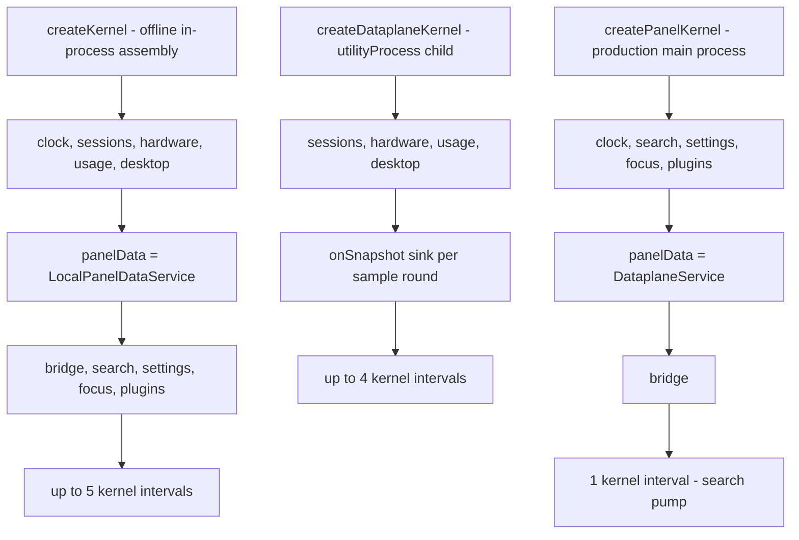
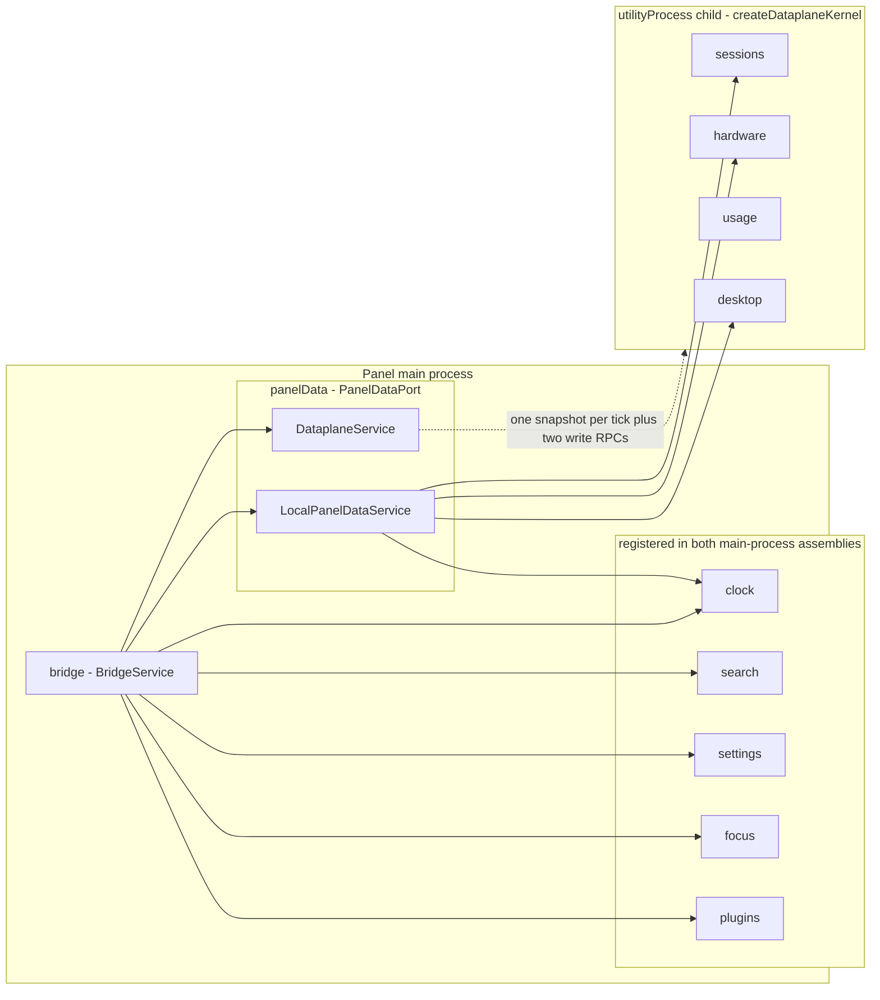
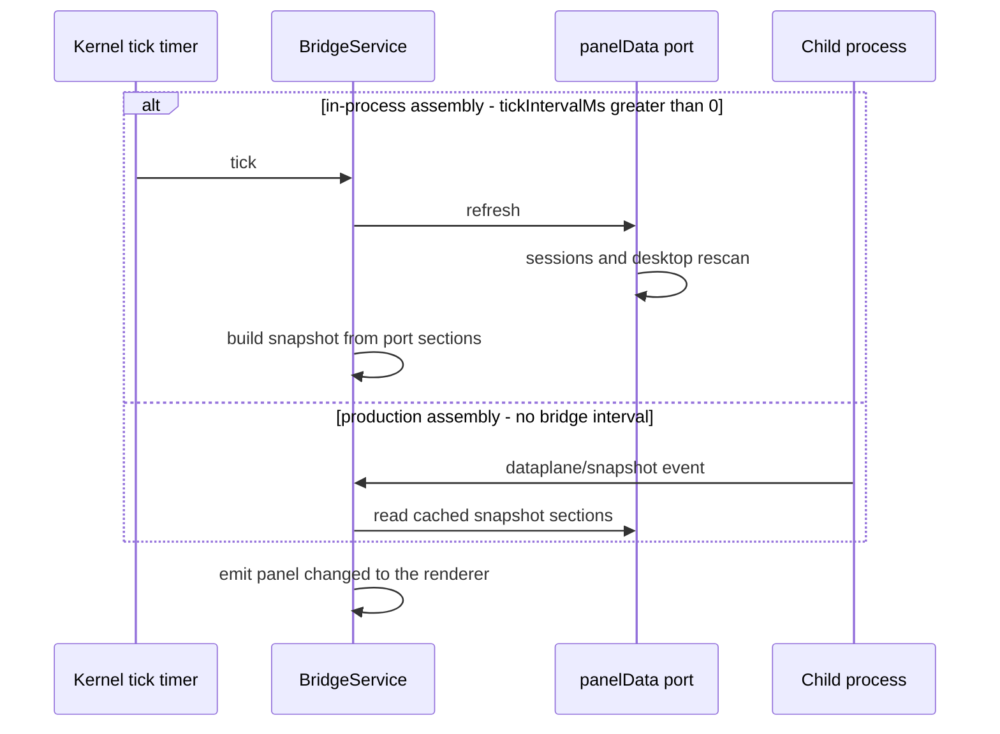

# cordis kernel: service assembly, seams and timers

<!-- openwiki: broken internal link [/repo://docs/adr/0004-electron-cordis-standalone-panel.md#L8-L24] file "/repo://docs/adr/0004-electron-cordis-standalone-panel.md" does not exist. Fix the href or restore the target, then delete this comment. -->
The panel's main process is not a pile of modules wired at startup; it is a cordis 3.x `Context` in which every capability is a `Service` plugin. [ADR-0004](/repo://docs/adr/0004-electron-cordis-standalone-panel.md#L8-L24) picks cordis as the plugin kernel and deliberately locks the 3.x line, using only its plugin lifecycle and dependency-injection subset. That subset is what this page documents: how a kernel gets built, in which order services land in it, who is allowed to see whom, which periodic work the kernel itself owns, and how the whole thing comes apart.

Two rules shape every design decision below:

<!-- openwiki: broken internal link [/repo://app/src/main/kernel.ts#L62-L110] file "/repo://app/src/main/kernel.ts" does not exist. Fix the href or restore the target, then delete this comment. -->
<!-- openwiki: broken internal link [/repo://app/src/main/panel-kernel.ts#L34-L52] file "/repo://app/src/main/panel-kernel.ts" does not exist. Fix the href or restore the target, then delete this comment. -->
- **Assembly is code, not configuration.** There is no loader, no plugin manifest and no declarative wiring for the kernel itself — each deployment is one function call in one file ([kernel.ts](/repo://app/src/main/kernel.ts#L62-L110), [panel-kernel.ts](/repo://app/src/main/panel-kernel.ts#L34-L52)). Everything the assembly passes in is an option object, which is exactly why offline tests can replace every real I/O source with a fake.
<!-- openwiki: broken internal link [/repo://app/src/main/panel-kernel.ts#L1-L3] file "/repo://app/src/main/panel-kernel.ts" does not exist. Fix the href or restore the target, then delete this comment. -->
- **The offline-testable core must not import Electron.** `kernel.ts` holds the two assemblies that pure-Node vitest can load; the Electron-only assembly lives in its own file so that importing it is a deliberate act ([panel-kernel.ts](/repo://app/src/main/panel-kernel.ts#L1-L3)).

## The three assembly functions

| Function | File | Used by | Services registered | Kernel intervals |
|---|---|---|---|---|
<!-- openwiki: broken internal link [/repo://app/src/main/kernel.ts#L62-L110] file "/repo://app/src/main/kernel.ts" does not exist. Fix the href or restore the target, then delete this comment. -->
| `createKernel(options)` | [kernel.ts](/repo://app/src/main/kernel.ts#L62-L110) | The offline kernel contract seam (`tests/contract.spec.ts`) — no production caller | All eleven: clock, sessions, hardware, usage, desktop, `panelData` = `LocalPanelDataService`, bridge, search, settings, focus, plugins | up to 5 |
<!-- openwiki: broken internal link [/repo://app/src/main/kernel.ts#L129-L165] file "/repo://app/src/main/kernel.ts" does not exist. Fix the href or restore the target, then delete this comment. -->
<!-- openwiki: broken internal link [/repo://app/src/main/dataplane.ts#L38-L59] file "/repo://app/src/main/dataplane.ts" does not exist. Fix the href or restore the target, then delete this comment. -->
| `createDataplaneKernel(options)` | [kernel.ts](/repo://app/src/main/kernel.ts#L129-L165) | The utilityProcess child entry [dataplane.ts](/repo://app/src/main/dataplane.ts#L38-L59) and `tests/dataplane-kernel.spec.ts` | The four collection services only: sessions, hardware, usage, desktop | up to 4 |
<!-- openwiki: broken internal link [/repo://app/src/main/panel-kernel.ts#L34-L52] file "/repo://app/src/main/panel-kernel.ts" does not exist. Fix the href or restore the target, then delete this comment. -->
<!-- openwiki: broken internal link [/repo://app/src/main/index.ts#L85-L106] file "/repo://app/src/main/index.ts" does not exist. Fix the href or restore the target, then delete this comment. -->
| `createPanelKernel(options)` | [panel-kernel.ts](/repo://app/src/main/panel-kernel.ts#L34-L52) | Production boot (`bootPanel` in [index.ts](/repo://app/src/main/index.ts#L85-L106)) | clock, search, settings, focus, plugins, `panelData` = `DataplaneService`, bridge | 1 (search pump) |

<!-- openwiki: broken internal link [/repo://app/src/main/index.ts#L106-L114] file "/repo://app/src/main/index.ts" does not exist. Fix the href or restore the target, then delete this comment. -->
All three return an **unstarted** `Context`; services do not exist on `ctx.<name>` until the caller awaits `ctx.start()`. Production boot therefore starts the kernel before it touches anything else — `await kernel.start()` → `await kernel.panelData.whenReady` → `wireBridgeIpc(win, kernel.bridge)` ([index.ts](/repo://app/src/main/index.ts#L106-L114)) — and the same `await ctx.start()` / `await ctx.stop()` pair brackets every kernel-level test.

<!-- openwiki: broken internal link [/repo://app/src/main/panel-kernel.ts#L15-L32] file "/repo://app/src/main/panel-kernel.ts" does not exist. Fix the href or restore the target, then delete this comment. -->
`createPanelKernel` is the only assembly that requires a data-plane host: its `options.dataplane` is non-optional and carries the child module path, the `DataplaneInit` bundle and the evidence logger ([panel-kernel.ts](/repo://app/src/main/panel-kernel.ts#L15-L32)).

*The assembly variants and their registration order: the port implementation always lands immediately before the bridge, and production registers no collection service at all.*

### The offline-testability rule

<!-- openwiki: broken internal link [/repo://app/src/main/kernel.ts#L167-L176] file "/repo://app/src/main/kernel.ts" does not exist. Fix the href or restore the target, then delete this comment. -->
`kernel.ts` imports only `cordis` and local modules; it never imports `electron`. Its own comment states the constraint — the data-plane snapshot builds its clock value inline because the file has to stay loadable by offline tests ([kernel.ts](/repo://app/src/main/kernel.ts#L167-L176)). The Electron coupling that does exist is quarantined:

<!-- openwiki: broken internal link [/repo://app/src/main/dataplane-protocol.ts#L15-L25] file "/repo://app/src/main/dataplane-protocol.ts" does not exist. Fix the href or restore the target, then delete this comment. -->
- The child entry `dataplane.ts` cannot use Electron APIs at all (`koffi`, `node:sqlite` and `fs` are pure Node), so paths and roots are resolved in the main process and shipped to the child as `DataplaneInit` ([dataplane-protocol.ts](/repo://app/src/main/dataplane-protocol.ts#L15-L25)).
<!-- openwiki: broken internal link [/repo://app/src/main/services/dataplane.ts#L1] file "/repo://app/src/main/services/dataplane.ts" does not exist. Fix the href or restore the target, then delete this comment. -->
- `services/dataplane.ts` imports `utilityProcess` from `electron` at module scope ([dataplane.ts](/repo://app/src/main/services/dataplane.ts#L1)), which is why the production assembly had to be a separate file rather than a flag on `createKernel`.
<!-- openwiki: broken internal link [/repo://app/src/main/paths.ts#L7-L14] file "/repo://app/src/main/paths.ts" does not exist. Fix the href or restore the target, then delete this comment. -->
<!-- openwiki: broken internal link [/repo://app/src/main/desktop/adapter.ts#L55-L96] file "/repo://app/src/main/desktop/adapter.ts" does not exist. Fix the href or restore the target, then delete this comment. -->
<!-- openwiki: broken internal link [/repo://app/src/main/focus/adapter.ts#L35-L123] file "/repo://app/src/main/focus/adapter.ts" does not exist. Fix the href or restore the target, then delete this comment. -->
- Electron and native modules are otherwise reached only through lazy `require()` calls inside functions that already have a non-Electron fallback: `userDataPath` falls back to `LOCALAPPDATA` ([paths.ts](/repo://app/src/main/paths.ts#L7-L14)), and the desktop/focus adapters wrap `require('electron')` and `require('koffi')` per call ([desktop/adapter.ts](/repo://app/src/main/desktop/adapter.ts#L55-L96), [focus/adapter.ts](/repo://app/src/main/focus/adapter.ts#L35-L123)).

<!-- openwiki: broken internal link [/repo://app/tests/dataplane-kernel.spec.ts#L1-L5] file "/repo://app/tests/dataplane-kernel.spec.ts" does not exist. Fix the href or restore the target, then delete this comment. -->
Consequences: `npm test` (vitest, plain Node) can exercise `createKernel` and `createDataplaneKernel`, but nothing that loads `panel-kernel.ts` or `services/dataplane.ts`; the utilityProcess glue and every Electron-only path are covered by the real-machine acceptance battery instead ([dataplane-kernel.spec.ts](/repo://app/tests/dataplane-kernel.spec.ts#L1-L5)).

## The service graph

*Service graph: `BridgeService` is the only service that talks to the renderer, and it reaches the data sections solely through the `panelData` port, whose two implementations differ in process topology rather than interface.*

<!-- openwiki: broken internal link [/repo://app/src/main/kernel.ts#L63-L108] file "/repo://app/src/main/kernel.ts" does not exist. Fix the href or restore the target, then delete this comment. -->
<!-- openwiki: broken internal link [/repo://app/src/main/panel-kernel.ts#L35-L50] file "/repo://app/src/main/panel-kernel.ts" does not exist. Fix the href or restore the target, then delete this comment. -->
`createKernel`'s registration order is: `ClockService`, `SessionsService`, `HardwareService`, `UsageService`, `DesktopService`, `LocalPanelDataService`, `BridgeService`, `SearchService`, `SettingsService`, `FocusService`, `PluginHostService`, then the timers ([kernel.ts](/repo://app/src/main/kernel.ts#L63-L108)). `createPanelKernel` registers `ClockService`, `SearchService`, `SettingsService`, `FocusService`, `PluginHostService`, `DataplaneService`, `BridgeService`, then the search pump ([panel-kernel.ts](/repo://app/src/main/panel-kernel.ts#L35-L50)). Two orderings are load-bearing and commented as such:

<!-- openwiki: broken internal link [/repo://app/src/main/kernel.ts#L77-L79] file "/repo://app/src/main/kernel.ts" does not exist. Fix the href or restore the target, then delete this comment. -->
<!-- openwiki: broken internal link [/repo://app/src/main/panel-kernel.ts#L42-L44] file "/repo://app/src/main/panel-kernel.ts" does not exist. Fix the href or restore the target, then delete this comment. -->
- **The `panelData` port is registered immediately before the bridge** in both main-process assemblies ("must be registered before the bridge layer"): [kernel.ts](/repo://app/src/main/kernel.ts#L77-L79) and [panel-kernel.ts](/repo://app/src/main/panel-kernel.ts#L42-L44).
<!-- openwiki: broken internal link [/repo://app/src/main/kernel.ts#L83-L84] file "/repo://app/src/main/kernel.ts" does not exist. Fix the href or restore the target, then delete this comment. -->
<!-- openwiki: broken internal link [/repo://app/src/main/panel-kernel.ts#L40-L41] file "/repo://app/src/main/panel-kernel.ts" does not exist. Fix the href or restore the target, then delete this comment. -->
<!-- openwiki: broken internal link [/repo://app/src/main/index.ts#L91-L92] file "/repo://app/src/main/index.ts" does not exist. Fix the href or restore the target, then delete this comment. -->
- **`PluginHostService` is registered with `roots: []` as the spread-in default** in both assemblies — last in `createKernel`, just before the port and bridge in `createPanelKernel` — so an offline kernel installs no plugins and creates no plugin directory; production overrides `roots` with the built-in cards folder plus the user plugin dir ([kernel.ts](/repo://app/src/main/kernel.ts#L83-L84), [panel-kernel.ts](/repo://app/src/main/panel-kernel.ts#L40-L41), [index.ts](/repo://app/src/main/index.ts#L91-L92)).

## Wiring: `inject` where it is a cycle, constructor options everywhere else

Only two services declare a cordis `static inject` list:

| Service | `inject` | Why |
|---|---|---|
<!-- openwiki: broken internal link [/repo://app/src/main/services/bridge.ts#L23] file "/repo://app/src/main/services/bridge.ts" does not exist. Fix the href or restore the target, then delete this comment. -->
| `BridgeService` | `['clock', 'panelData', 'search', 'settings', 'focus', 'plugins']` ([bridge.ts](/repo://app/src/main/services/bridge.ts#L23)) | The bridge dispatches every bridge method and builds every snapshot section, so it holds live references to six peers |
<!-- openwiki: broken internal link [/repo://app/src/main/services/panel-data.ts#L27] file "/repo://app/src/main/services/panel-data.ts" does not exist. Fix the href or restore the target, then delete this comment. -->
| `LocalPanelDataService` | `['clock', 'sessions', 'hardware', 'desktop']` ([panel-data.ts](/repo://app/src/main/services/panel-data.ts#L27)) | The in-process port is a thin forwarder over the four collection services |

<!-- openwiki: broken internal link [/repo://app/src/main/services/desktop.ts#L73-L85] file "/repo://app/src/main/services/desktop.ts" does not exist. Fix the href or restore the target, then delete this comment. -->
<!-- openwiki: broken internal link [/repo://app/tests/contract.spec.ts#L21-L51] file "/repo://app/tests/contract.spec.ts" does not exist. Fix the href or restore the target, then delete this comment. -->
Every other service receives its dependencies as **constructor options bundles**, not through the container: `HardwareSources`, `DesktopDeps`, `UsageDeps`, `SearchDeps` and `FocusDeps` are each a small interface whose real implementation is the default and whose individual members are overridable (`Partial<...>`). `DesktopService`, for instance, resolves `listDir`/`extractIcon`/`open`/`watch`/`readShortcutTarget`/`readStoreText`/`writeStoreText`/`iconScores` that way, with `extractIcon: null` as the documented "no Electron icon face" value ([desktop.ts](/repo://app/src/main/services/desktop.ts#L73-L85)). The assembly function is the single place where "real source" versus "test source" is decided — `tests/contract.spec.ts` overrides the same fields with in-memory stubs ([contract.spec.ts](/repo://app/tests/contract.spec.ts#L21-L51)).

Two cross-service edges are neither `inject` nor a bundle member, and both are worth knowing when you extend the kernel:

<!-- openwiki: broken internal link [/repo://app/src/main/kernel.ts#L68-L76] file "/repo://app/src/main/kernel.ts" does not exist. Fix the href or restore the target, then delete this comment. -->
<!-- openwiki: broken internal link [/repo://app/src/main/cordis.d.ts#L41-L43] file "/repo://app/src/main/cordis.d.ts" does not exist. Fix the href or restore the target, then delete this comment. -->
- **The recommendation-score edge is a closure built by the assembly.** `createKernel` and `createDataplaneKernel` hand `DesktopService` an `iconScores` implementation that calls `ctx.usage?.iconScores(...)` and returns an empty map when `usage` is absent, so a kernel without the usage service degrades to the stable name order instead of failing ([kernel.ts](/repo://app/src/main/kernel.ts#L68-L76)). `cordis.d.ts` types `ctx.usage` as optional for exactly this reason ([cordis.d.ts](/repo://app/src/main/cordis.d.ts#L41-L43)).
<!-- openwiki: broken internal link [/repo://app/src/main/services/dataplane.ts#L90-L100] file "/repo://app/src/main/services/dataplane.ts" does not exist. Fix the href or restore the target, then delete this comment. -->
<!-- openwiki: broken internal link [/repo://app/src/main/services/bridge.ts#L32-L35] file "/repo://app/src/main/services/bridge.ts" does not exist. Fix the href or restore the target, then delete this comment. -->
<!-- openwiki: broken internal link [/repo://app/src/main/cordis.d.ts#L14-L29] file "/repo://app/src/main/cordis.d.ts" does not exist. Fix the href or restore the target, then delete this comment. -->
- **The data-plane arrival signal is an event.** `DataplaneService` does not call `ctx.bridge.push()`; it emits `dataplane/snapshot` and `BridgeService` subscribes in its constructor, because `bridge` is not yet registered while the port implementation that `bridge` injects is being constructed — touching it directly would trip cordis's unregistered-property warning ([services/dataplane.ts](/repo://app/src/main/services/dataplane.ts#L90-L100), [bridge.ts](/repo://app/src/main/services/bridge.ts#L32-L35), [cordis.d.ts](/repo://app/src/main/cordis.d.ts#L14-L29)).

## The `PanelDataPort` seam

<!-- openwiki: broken internal link [/repo://app/src/main/services/panel-data.ts#L10-L23] file "/repo://app/src/main/services/panel-data.ts" does not exist. Fix the href or restore the target, then delete this comment. -->
<!-- openwiki: broken internal link [/repo://app/src/main/cordis.d.ts#L36-L40] file "/repo://app/src/main/cordis.d.ts" does not exist. Fix the href or restore the target, then delete this comment. -->
`PanelDataPort` is the interface that makes `BridgeService` topology-agnostic. It has ten members: four synchronous data readers (`clock()`, `sessions()`, `hardware()`, `desktop()`), `refresh()`, `whenReady`, and the desktop carrying actions `icon()`, `launch()`, `move()`, `resetLayout()` ([panel-data.ts](/repo://app/src/main/services/panel-data.ts#L10-L23)). Both implementations register under the same cordis service name `panelData`, and the ambient declaration types `ctx.panelData` as the port — not as either class ([cordis.d.ts](/repo://app/src/main/cordis.d.ts#L36-L40)).

| Behaviour | `LocalPanelDataService` (in-process) | `DataplaneService` (production) |
|---|---|---|
<!-- openwiki: broken internal link [/repo://app/src/main/services/panel-data.ts#L35-L50] file "/repo://app/src/main/services/panel-data.ts" does not exist. Fix the href or restore the target, then delete this comment. -->
<!-- openwiki: broken internal link [/repo://app/src/main/services/dataplane.ts#L138-L159] file "/repo://app/src/main/services/dataplane.ts" does not exist. Fix the href or restore the target, then delete this comment. -->
| Data sections | Direct calls into `clock`/`sessions`/`hardware`/`desktop` services ([panel-data.ts](/repo://app/src/main/services/panel-data.ts#L35-L50)) | Fields of the latest snapshot pushed by the child, with empty placeholders before the first one ([services/dataplane.ts](/repo://app/src/main/services/dataplane.ts#L138-L159)) |
<!-- openwiki: broken internal link [/repo://app/src/main/services/panel-data.ts#L51-L54] file "/repo://app/src/main/services/panel-data.ts" does not exist. Fix the href or restore the target, then delete this comment. -->
<!-- openwiki: broken internal link [/repo://app/src/main/services/dataplane.ts#L157-L159] file "/repo://app/src/main/services/dataplane.ts" does not exist. Fix the href or restore the target, then delete this comment. -->
| `refresh()` | `sessions.refresh()` + `desktop.refresh()` ([panel-data.ts](/repo://app/src/main/services/panel-data.ts#L51-L54)) | No-op — the child self-drives its sampling ([services/dataplane.ts](/repo://app/src/main/services/dataplane.ts#L157-L159)) |
<!-- openwiki: broken internal link [/repo://app/src/main/services/panel-data.ts#L29] file "/repo://app/src/main/services/panel-data.ts" does not exist. Fix the href or restore the target, then delete this comment. -->
<!-- openwiki: broken internal link [/repo://app/src/main/services/dataplane.ts#L12] file "/repo://app/src/main/services/dataplane.ts" does not exist. Fix the href or restore the target, then delete this comment. -->
<!-- openwiki: broken internal link [/repo://app/src/main/services/dataplane.ts#L56-L64] file "/repo://app/src/main/services/dataplane.ts" does not exist. Fix the href or restore the target, then delete this comment. -->
| `whenReady` | Already resolved ([panel-data.ts](/repo://app/src/main/services/panel-data.ts#L29)) | Resolves on the child's first `ready`/`snapshot` message, or after `DEFAULT_READY_TIMEOUT_MS` = 15000 ms, which logs `dataplane-ready-timeout` and lets the panel start with an empty data plane ([services/dataplane.ts](/repo://app/src/main/services/dataplane.ts#L12), [services/dataplane.ts](/repo://app/src/main/services/dataplane.ts#L56-L64)) |
<!-- openwiki: broken internal link [/repo://app/src/main/services/dataplane.ts#L161-L163] file "/repo://app/src/main/services/dataplane.ts" does not exist. Fix the href or restore the target, then delete this comment. -->
| `icon()` | `desktop.icon()` — the in-process icon cache | Main-process `IconCache`, because `app.getFileIcon` only exists there ([services/dataplane.ts](/repo://app/src/main/services/dataplane.ts#L161-L163)) |
<!-- openwiki: broken internal link [/repo://app/src/main/services/dataplane.ts#L165-L173] file "/repo://app/src/main/services/dataplane.ts" does not exist. Fix the href or restore the target, then delete this comment. -->
| `launch()` | `desktop.launch()` | Validated against the main process's own copy of the latest item pool, then `shell.openPath` ([services/dataplane.ts](/repo://app/src/main/services/dataplane.ts#L165-L173)) |
<!-- openwiki: broken internal link [/repo://app/src/main/services/dataplane.ts#L124-L134] file "/repo://app/src/main/services/dataplane.ts" does not exist. Fix the href or restore the target, then delete this comment. -->
<!-- openwiki: broken internal link [/repo://app/src/main/services/dataplane.ts#L175-L181] file "/repo://app/src/main/services/dataplane.ts" does not exist. Fix the href or restore the target, then delete this comment. -->
| `move()` / `resetLayout()` | Straight to `DesktopService` | RPC to the child: a sequence number plus a pending-request map, answered by `{ type: 'res', id }` and rejected when the child exits ([services/dataplane.ts](/repo://app/src/main/services/dataplane.ts#L124-L134), [services/dataplane.ts](/repo://app/src/main/services/dataplane.ts#L175-L181)) |

<!-- openwiki: broken internal link [/repo://app/src/main/services/bridge.ts#L37-L67] file "/repo://app/src/main/services/bridge.ts" does not exist. Fix the href or restore the target, then delete this comment. -->
The bridge only ever reads the port: `snapshot()` fills `clock`/`sessions`/`hardware`/`desktop` from it, and the `desktop/icon|launch|move|reset-layout` cases dispatch to port methods ([bridge.ts](/repo://app/src/main/services/bridge.ts#L37-L67)). Which process the pixels come from is therefore invisible to the bridge.

## Kernel-owned interval timers

The kernel installs plain Node `setInterval` timers and clears each one from a dispose handler registered next to it; it does not route periodic work through any service-level timer helper. Every timer exists only when its option is greater than zero, and each option documents `0` as "install nothing" so tests can own the clock.

| Constant | Default | Installed by | Callback |
|---|---|---|---|
<!-- openwiki: broken internal link [/repo://app/src/main/kernel.ts#L85-L89] file "/repo://app/src/main/kernel.ts" does not exist. Fix the href or restore the target, then delete this comment. -->
| `DEFAULT_TICK_MS` | `1000` | `createKernel` | `ctx.bridge?.tick()` — refresh the port, then push `panel/changed` ([kernel.ts](/repo://app/src/main/kernel.ts#L85-L89)) |
<!-- openwiki: broken internal link [/repo://app/src/main/kernel.ts#L143-L151] file "/repo://app/src/main/kernel.ts" does not exist. Fix the href or restore the target, then delete this comment. -->
| `DEFAULT_TICK_MS` | `1000` | `createDataplaneKernel` | One sample round: `ctx.sessions.refresh()`, `ctx.desktop.refresh()`, then `options.onSnapshot(dataplaneSnapshot(ctx))` ([kernel.ts](/repo://app/src/main/kernel.ts#L143-L151)) |
<!-- openwiki: broken internal link [/repo://app/src/main/kernel.ts#L90-L94] file "/repo://app/src/main/kernel.ts" does not exist. Fix the href or restore the target, then delete this comment. -->
<!-- openwiki: broken internal link [/repo://app/src/main/kernel.ts#L152-L156] file "/repo://app/src/main/kernel.ts" does not exist. Fix the href or restore the target, then delete this comment. -->
| `DEFAULT_HARDWARE_MS` | `1000` | both | `ctx.hardware?.sample()` ([kernel.ts](/repo://app/src/main/kernel.ts#L90-L94), [kernel.ts](/repo://app/src/main/kernel.ts#L152-L156)) |
<!-- openwiki: broken internal link [/repo://app/src/main/kernel.ts#L95-L98] file "/repo://app/src/main/kernel.ts" does not exist. Fix the href or restore the target, then delete this comment. -->
<!-- openwiki: broken internal link [/repo://app/src/main/services/usage.ts#L66-L83] file "/repo://app/src/main/services/usage.ts" does not exist. Fix the href or restore the target, then delete this comment. -->
| `DEFAULT_USAGE_MS` | `2000` | both | `ctx.usage?.collect()` — pid diff plus foreground switch ([kernel.ts](/repo://app/src/main/kernel.ts#L95-L98), [usage.ts](/repo://app/src/main/services/usage.ts#L66-L83)) |
<!-- openwiki: broken internal link [/repo://app/src/main/kernel.ts#L99-L101] file "/repo://app/src/main/kernel.ts" does not exist. Fix the href or restore the target, then delete this comment. -->
<!-- openwiki: broken internal link [/repo://app/src/main/services/usage.ts#L60-L63] file "/repo://app/src/main/services/usage.ts" does not exist. Fix the href or restore the target, then delete this comment. -->
| `USAGE_PRUNE_MS` | `3600_000` | both, nested inside the usage branch | `ctx.usage?.prune()` — the 90-day rolling cleanup, which a resident panel cannot converge on restarts alone ([kernel.ts](/repo://app/src/main/kernel.ts#L99-L101), [usage.ts](/repo://app/src/main/services/usage.ts#L60-L63)) |
<!-- openwiki: broken internal link [/repo://app/src/main/kernel.ts#L103-L108] file "/repo://app/src/main/kernel.ts" does not exist. Fix the href or restore the target, then delete this comment. -->
<!-- openwiki: broken internal link [/repo://app/src/main/panel-kernel.ts#L45-L50] file "/repo://app/src/main/panel-kernel.ts" does not exist. Fix the href or restore the target, then delete this comment. -->
<!-- openwiki: broken internal link [/repo://app/src/main/services/search.ts#L124-L133] file "/repo://app/src/main/services/search.ts" does not exist. Fix the href or restore the target, then delete this comment. -->
| `DEFAULT_SEARCH_INTERVAL_MS` | `50` | `createKernel` and `createPanelKernel` | `ctx.search?.tick()` — the engine-link pump that decides debounce expiry, rate-limit backoff and offline retry in one place ([kernel.ts](/repo://app/src/main/kernel.ts#L103-L108), [panel-kernel.ts](/repo://app/src/main/panel-kernel.ts#L45-L50), [search.ts](/repo://app/src/main/services/search.ts#L124-L133)) |

<!-- openwiki: broken internal link [/repo://app/src/main/kernel.ts#L55-L59] file "/repo://app/src/main/kernel.ts" does not exist. Fix the href or restore the target, then delete this comment. -->
The constants live at the top of `kernel.ts` and are the only exported timing defaults: `DEFAULT_TICK_MS`, `DEFAULT_HARDWARE_MS`, `DEFAULT_USAGE_MS`, `DEFAULT_SEARCH_INTERVAL_MS`, `USAGE_PRUNE_MS` ([kernel.ts](/repo://app/src/main/kernel.ts#L55-L59)).

Properties that matter when changing them:

<!-- openwiki: broken internal link [/repo://app/src/main/kernel.ts#L95-L102] file "/repo://app/src/main/kernel.ts" does not exist. Fix the href or restore the target, then delete this comment. -->
- **`0` is the test contract, and disabling usage disables two timers.** The guards are `if (ms > 0)`; the hourly prune timer is created inside the same branch as the usage collector, so `usageIntervalMs: 0` suppresses both ([kernel.ts](/repo://app/src/main/kernel.ts#L95-L102)).
<!-- openwiki: broken internal link [/repo://app/src/main/panel-kernel.ts#L45-L50] file "/repo://app/src/main/panel-kernel.ts" does not exist. Fix the href or restore the target, then delete this comment. -->
- **The production assembly installs no snapshot timer.** `createPanelKernel` always has exactly one interval — the search pump — because in production the child's 1 s tick drives reflection into the panel ([panel-kernel.ts](/repo://app/src/main/panel-kernel.ts#L45-L50)). That is also why `tickIntervalMs` appears in `KernelOptions` and `DataplaneKernelOptions` but not in `PanelKernelOptions`.
- **Timers reference services through optional chaining.** Services mount only after `ctx.start()`, and a timer armed at construction can fire before that, so `ctx.bridge?.tick()` is a no-op rather than a crash; `usage` is additionally an optional service.
<!-- openwiki: broken internal link [/repo://.scratch/standalone-app/issues/07-search-overlay.md#L50] file "/repo://.scratch/standalone-app/issues/07-search-overlay.md" does not exist. Fix the href or restore the target, then delete this comment. -->
- **Follow the naming family when adding one.** The search pump option was renamed `searchPumpMs` → `searchIntervalMs` precisely to match `tickIntervalMs`/`hardwareIntervalMs` ([.scratch/standalone-app/issues/07-search-overlay.md](/repo://.scratch/standalone-app/issues/07-search-overlay.md#L50)).

<!-- openwiki: broken internal link [/repo://app/src/main/hotzone.ts#L4] file "/repo://app/src/main/hotzone.ts" does not exist. Fix the href or restore the target, then delete this comment. -->
<!-- openwiki: broken internal link [/repo://app/src/main/wind-restore.ts#L8-L9] file "/repo://app/src/main/wind-restore.ts" does not exist. Fix the href or restore the target, then delete this comment. -->
<!-- openwiki: broken internal link [/repo://app/src/main/plugins/watch.ts#L17-L30] file "/repo://app/src/main/plugins/watch.ts" does not exist. Fix the href or restore the target, then delete this comment. -->
<!-- openwiki: broken internal link [/repo://app/src/main/services/dataplane.ts#L78-L88] file "/repo://app/src/main/services/dataplane.ts" does not exist. Fix the href or restore the target, then delete this comment. -->
Timers that are **not** kernel-owned, to avoid misattribution: the window host's `POLL_MS = 25` cursor poll for hotzones ([hotzone.ts](/repo://app/src/main/hotzone.ts#L4)), `WIN_D_POLL_MS = 250` / `WIN_D_DEBOUNCE_MS = 1500` in the Win+D restorer ([wind-restore.ts](/repo://app/src/main/wind-restore.ts#L8-L9)), the plugin watcher's 300 ms event-storm settle debounce, which exists only when roots are non-empty and watching is on ([watch.ts](/repo://app/src/main/plugins/watch.ts#L17-L30)), and `DataplaneService`'s one-shot 15 s readiness timeout and 1 s→30 s restart backoff (both `setTimeout`, not intervals) ([services/dataplane.ts](/repo://app/src/main/services/dataplane.ts#L78-L88)).

## What one tick does

*The two push paths converge on the same `push()`: in-process the kernel tick timer calls `bridge.tick()`, in production the child's tick timer arrives as the `dataplane/snapshot` event.*

<!-- openwiki: broken internal link [/repo://app/src/main/services/bridge.ts#L98-L107] file "/repo://app/src/main/services/bridge.ts" does not exist. Fix the href or restore the target, then delete this comment. -->
<!-- openwiki: broken internal link [/repo://app/src/main/dataplane.ts#L54] file "/repo://app/src/main/dataplane.ts" does not exist. Fix the href or restore the target, then delete this comment. -->
In the in-process path, `BridgeService.tick()` calls `panelData.refresh()` and then `push()`; `push()` emits `panel/changed` with a freshly assembled snapshot ([bridge.ts](/repo://app/src/main/services/bridge.ts#L98-L107)). In the production path, each child sample round is posted as `{ type: 'snapshot', data }` by the `onSnapshot` sink ([dataplane.ts](/repo://app/src/main/dataplane.ts#L54)), `DataplaneService` caches it, prewarms any icons the cache still needs, and emits `dataplane/snapshot`, which triggers the same `push()`.

## Lifecycle, dispose and failure semantics

<!-- openwiki: broken internal link [/repo://app/src/main/kernel.ts#L85-L108] file "/repo://app/src/main/kernel.ts" does not exist. Fix the href or restore the target, then delete this comment. -->
<!-- openwiki: broken internal link [/repo://app/tests/contract.spec.ts#L70-L78] file "/repo://app/tests/contract.spec.ts" does not exist. Fix the href or restore the target, then delete this comment. -->
- **Start then use.** Keeping a kernel alive means holding the `Context`: `ctx.start()` mounts every plugin and resolves `inject` lists, `ctx.stop()` disposes them ([kernel.ts](/repo://app/src/main/kernel.ts#L85-L108), [contract.spec.ts](/repo://app/tests/contract.spec.ts#L70-L78)).
<!-- openwiki: broken internal link [/repo://app/src/main/kernel.ts#L86-L108] file "/repo://app/src/main/kernel.ts" does not exist. Fix the href or restore the target, then delete this comment. -->
- **Every kernel timer is cleared on dispose**, one handler per timer, so stopping the context is sufficient to silence the kernel ([kernel.ts](/repo://app/src/main/kernel.ts#L86-L108)).
<!-- openwiki: broken internal link [/repo://app/src/main/services/desktop.ts#L88-L89] file "/repo://app/src/main/services/desktop.ts" does not exist. Fix the href or restore the target, then delete this comment. -->
<!-- openwiki: broken internal link [/repo://app/src/main/plugins/service.ts#L107-L111] file "/repo://app/src/main/plugins/service.ts" does not exist. Fix the href or restore the target, then delete this comment. -->
<!-- openwiki: broken internal link [/repo://app/src/main/plugins/service.ts#L263-L267] file "/repo://app/src/main/plugins/service.ts" does not exist. Fix the href or restore the target, then delete this comment. -->
<!-- openwiki: broken internal link [/repo://app/src/main/services/search.ts#L85-L87] file "/repo://app/src/main/services/search.ts" does not exist. Fix the href or restore the target, then delete this comment. -->
<!-- openwiki: broken internal link [/repo://app/src/main/services/dataplane.ts#L55] file "/repo://app/src/main/services/dataplane.ts" does not exist. Fix the href or restore the target, then delete this comment. -->
<!-- openwiki: broken internal link [/repo://app/src/main/services/dataplane.ts#L117-L122] file "/repo://app/src/main/services/dataplane.ts" does not exist. Fix the href or restore the target, then delete this comment. -->
- **Other services register their own dispose handlers**, so `ctx.stop()` is a full teardown: `DesktopService` stops its root watcher ([desktop.ts](/repo://app/src/main/services/desktop.ts#L88-L89)), `PluginHostService` stops the directory watcher and disposes every installed plugin instance exactly once ([plugins/service.ts](/repo://app/src/main/plugins/service.ts#L107-L111), [plugins/service.ts](/repo://app/src/main/plugins/service.ts#L263-L267)), `SearchService` bumps its generation counter so in-flight engine responses are ignored ([search.ts](/repo://app/src/main/services/search.ts#L85-L87)), and `DataplaneService` kills the child and clears the pending restart timer ([services/dataplane.ts](/repo://app/src/main/services/dataplane.ts#L55), [services/dataplane.ts](/repo://app/src/main/services/dataplane.ts#L117-L122)).
<!-- openwiki: broken internal link [/repo://app/src/main/services/dataplane.ts#L78-L95] file "/repo://app/src/main/services/dataplane.ts" does not exist. Fix the href or restore the target, then delete this comment. -->
<!-- openwiki: broken internal link [/repo://docs/adr/0005-no-input-hooks-dataplane-utility-process.md#L7-L23] file "/repo://docs/adr/0005-no-input-hooks-dataplane-utility-process.md" does not exist. Fix the href or restore the target, then delete this comment. -->
- **Child death is a degraded mode, not a crash.** The child exits → pending RPCs are rejected with "数据面子进程退出，请求失败" → a restart is scheduled with `min(30_000, 1000 * 2 ** attempt)` backoff, and the attempt counter resets when a message arrives ([services/dataplane.ts](/repo://app/src/main/services/dataplane.ts#L78-L95)). Layout placement and the usage log are on disk, so a restart converges; the hardware history ring resets ([ADR-0005](/repo://docs/adr/0005-no-input-hooks-dataplane-utility-process.md#L7-L23)).

## Focused tests

| Test | What it pins down |
|---|---|
<!-- openwiki: broken internal link [/repo://app/tests/contract.spec.ts#L48-L51] file "/repo://app/tests/contract.spec.ts" does not exist. Fix the href or restore the target, then delete this comment. -->
| [tests/contract.spec.ts](/repo://app/tests/contract.spec.ts#L48-L51) | The kernel contract seam: `createKernel` with all four interval options set to `0`, then manual `ctx.bridge.tick()` / `ctx.search.tick()` driving, asserting invoke responses, `panel/changed` push and unsubscribe, and per-feature slices (search, settings, focus, plugins) on the same in-process assembly |
<!-- openwiki: broken internal link [/repo://app/tests/services.spec.ts#L163-L221] file "/repo://app/tests/services.spec.ts" does not exist. Fix the href or restore the target, then delete this comment. -->
| [tests/services.spec.ts](/repo://app/tests/services.spec.ts#L163-L221) | Snapshot contract through `createKernel` with `tickIntervalMs`/`hardwareIntervalMs`/`usageIntervalMs` = 0 and fake sources, plus bare-`Context` unit tests for `HardwareService` and `SessionsService` |
<!-- openwiki: broken internal link [/repo://app/tests/dataplane-kernel.spec.ts#L45-L122] file "/repo://app/tests/dataplane-kernel.spec.ts" does not exist. Fix the href or restore the target, then delete this comment. -->
| [tests/dataplane-kernel.spec.ts](/repo://app/tests/dataplane-kernel.spec.ts#L45-L122) | `createDataplaneKernel` in-process with real short timers (`tickIntervalMs: 10`, `hardwareIntervalMs: 10`, `usageIntervalMs: 0`), asserting the snapshot sections the sink receives and that the desktop write path (`move`) lands in the next snapshot |

The pattern to copy when adding kernel coverage: fake every source through the option object, set the intervals you do not want to `0`, `await ctx.start()`, drive the tick you are testing by hand, and `await ctx.stop()` in a `finally`. The broader split between offline seams and the acceptance battery is covered in [testing strategy](/openwiki/testing/testing-strategy.md).

## Extension points

- **Adding a service** means adding it to whichever assemblies need it, adding its `ctx.<name>` declaration to `cordis.d.ts`, and adding it to `BridgeService.inject` only if the bridge holds a direct reference (the bridge's `snapshot()`/`invoke()` are the only consumers of most services).
- **Adding periodic work** means a new exported default constant, a new `options.<x>IntervalMs`, a `> 0` guard, a `ctx.on('dispose')` clear, and a manual driver path so `0` stays usable — the search pump is the smallest template.
<!-- openwiki: broken internal link [/repo://app/src/main/services/dataplane.ts#L24-L33] file "/repo://app/src/main/services/dataplane.ts" does not exist. Fix the href or restore the target, then delete this comment. -->
- **Moving work between processes** must keep `PanelDataPort` as the only seam and must keep Electron-only APIs (icon extraction, shortcut resolution, `shell.openPath`) in the implementing service, never in the child ([services/dataplane.ts](/repo://app/src/main/services/dataplane.ts#L24-L33)).

## Related pages

- [Bridge contract and IPC transport](/openwiki/architecture/bridge-contract-and-ipc.md) — the `BridgeMethods`/`BridgeEvents` vocabulary this kernel dispatches, and the ok/error envelope.
- [Data service: endpoints, sampling, caching and thread model](/openwiki/architecture/data-service.md) — the retired Python predecessor whose sampling and retention semantics the collection services reimplement.
- [System overview and boundaries](/openwiki/architecture/overview.md) — where the panel sits relative to the wallpapers and the retired service.
