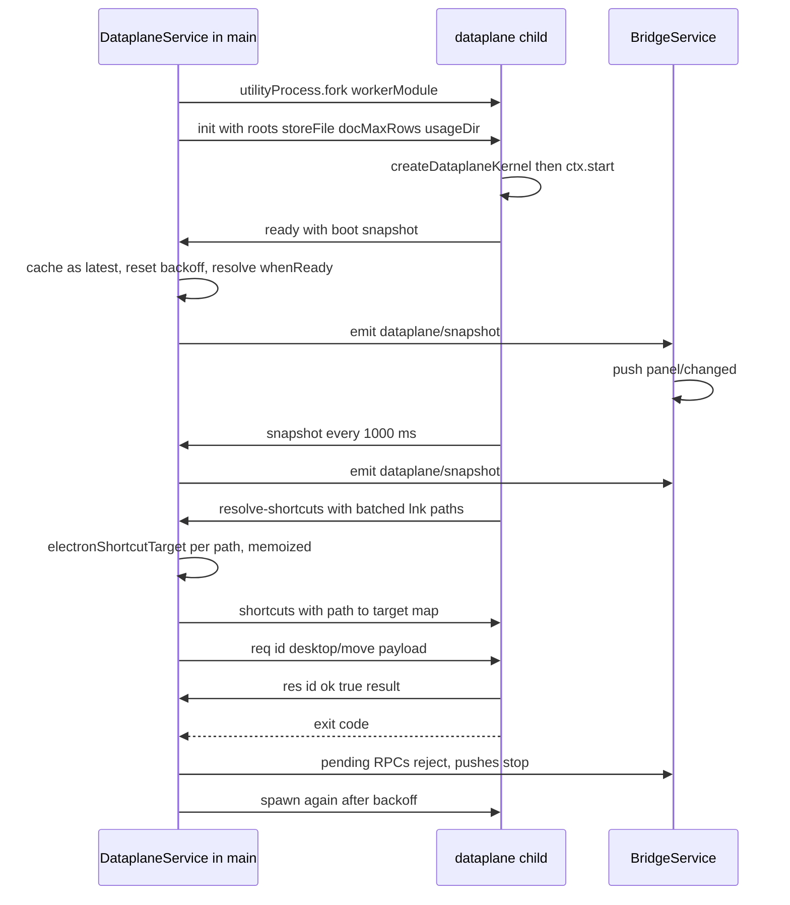

# Data plane subprocess: protocol, RPC and restart behaviour

The data plane is an Electron `utilityProcess` child that owns **all** periodic collection — the five-tool session scan, hardware sampling, the usage log and the desktop item/plan state — together with their timers. Once per second it posts one `DataplaneSnapshot` message back to the panel main process, which caches that snapshot and answers every bridge read from it. The main process keeps only what genuinely needs Electron APIs: the window host, the 25 ms hotzone cursor poll, the bridge and IPC layer, the plugin host, icon extraction, shortcut resolution and launching.

<!-- openwiki: broken internal link [/repo://app/src/main/dataplane-protocol.ts] file "/repo://app/src/main/dataplane-protocol.ts" does not exist. Fix the href or restore the target, then delete this comment. -->
<!-- openwiki: broken internal link [/repo://app/src/main/dataplane.ts] file "/repo://app/src/main/dataplane.ts" does not exist. Fix the href or restore the target, then delete this comment. -->
<!-- openwiki: broken internal link [/repo://app/src/main/kernel.ts#L112-L165] file "/repo://app/src/main/kernel.ts" does not exist. Fix the href or restore the target, then delete this comment. -->
<!-- openwiki: broken internal link [/repo://app/src/main/services/dataplane.ts] file "/repo://app/src/main/services/dataplane.ts" does not exist. Fix the href or restore the target, then delete this comment. -->
Two files define the boundary and two more implement its sides: [`dataplane-protocol.ts`](/repo://app/src/main/dataplane-protocol.ts) holds the message union and the child-side shortcut resolver, [`dataplane.ts`](/repo://app/src/main/dataplane.ts) is the child entry, [`kernel.ts`](/repo://app/src/main/kernel.ts#L112-L165) supplies `createDataplaneKernel` for the child's assembly, and [`services/dataplane.ts`](/repo://app/src/main/services/dataplane.ts) is the host that forks, supervises and forwards.

<!-- openwiki: broken internal link [/repo://CONTEXT.md#L119-L127] file "/repo://CONTEXT.md" does not exist. Fix the href or restore the target, then delete this comment. -->
The predecessor at this path — Python `server.py` with its loopback HTTP contract, watchdog and Wallpaper Engine deployment chain — was retired on 2026-09-29 (工单11) and survives only in the retired-terms list of [`CONTEXT.md`](/repo://CONTEXT.md#L119-L127); there is no HTTP service in the current system.

## Why the collection had to leave the main process

<!-- openwiki: broken internal link [/repo://docs/adr/0005-no-input-hooks-dataplane-utility-process.md#L7] file "/repo://docs/adr/0005-no-input-hooks-dataplane-utility-process.md" does not exist. Fix the href or restore the target, then delete this comment. -->
Real-machine use showed system-wide mouse stutter: intermittent, gone the moment the panel exited, obvious on a 143 Hz display. ADR-0005 records the root-cause chain ([ADR-0005](/repo://docs/adr/0005-no-input-hooks-dataplane-utility-process.md#L7)): restoring click-through with `setIgnoreMouseEvents(true, { forward: true })` made Electron install a global `WH_MOUSE_LL` low-level mouse hook on the main-process thread, so every mouse event in the system waited on that thread in series — while periodic collection on the same thread (1 Hz session scan with two synchronous SQLite queries, desktop rescan, and a 2 s whole-system process enumeration through FFI) blocked its event loop by roughly 300 ms per second.

<!-- openwiki: broken internal link [/repo://.scratch/mouse-lag/README.md#L11-L32] file "/repo://.scratch/mouse-lag/README.md" does not exist. Fix the href or restore the target, then delete this comment. -->
The measurement, kept in `.scratch/mouse-lag/`, is a 50 ms event-loop heartbeat probe injected with `--inspect` over 140 s ([README](/repo://.scratch/mouse-lag/README.md#L11-L32)):

| Metric | Before | After the move |
|---|---|---|
| Loop stalls ≥150 ms | 139 (timestamps in phase with the 1 Hz tick) | 0 |
| p99 / max gap | 367 / 2302 ms | 64 / 68 ms |
| Main-process CPU | 35.29% of one core | 1.82% |
| utility child CPU | — | 3.78% (the collection load now lives there) |

<!-- openwiki: broken internal link [/repo://docs/adr/0005-no-input-hooks-dataplane-utility-process.md#L9-L15] file "/repo://docs/adr/0005-no-input-hooks-dataplane-utility-process.md" does not exist. Fix the href or restore the target, then delete this comment. -->
Two structural red lines came out of that (ADR-0005 labels them explicitly): **the window-host thread must never hold a system-level input hook** (click-through is used without `forward`), and **periodic collection must not run on the main-process event loop**. This page documents the second one. `worker_threads` was considered and rejected precisely because a `SQLite busy_timeout` stall or a `koffi` crash would then kill the panel with the worker; a separate process dies alone and is restarted by backoff ([ADR-0005 options](/repo://docs/adr/0005-no-input-hooks-dataplane-utility-process.md#L9-L15)).

## Where the boundary runs

<!-- openwiki: broken internal link [/repo://app/src/main/services/panel-data.ts#L5-L23] file "/repo://app/src/main/services/panel-data.ts" does not exist. Fix the href or restore the target, then delete this comment. -->
<!-- openwiki: broken internal link [/repo://app/src/main/services/bridge.ts#L22-L23] file "/repo://app/src/main/services/bridge.ts" does not exist. Fix the href or restore the target, then delete this comment. -->
`PanelDataPort` ([`services/panel-data.ts`](/repo://app/src/main/services/panel-data.ts#L5-L23)) is the only interface the bridge layer knows. It has two implementations, and the bridge cannot tell which one it has ([`bridge.ts`](/repo://app/src/main/services/bridge.ts#L22-L23)):

| | In-process (`LocalPanelDataService`) | Production (`DataplaneService`) |
|---|---|---|
<!-- openwiki: broken internal link [/repo://app/src/main/panel-kernel.ts#L34-L51] file "/repo://app/src/main/panel-kernel.ts" does not exist. Fix the href or restore the target, then delete this comment. -->
| Assembly | `createKernel` with every service in the main process | `createPanelKernel`, which *requires* `options.dataplane` ([`panel-kernel.ts`](/repo://app/src/main/panel-kernel.ts#L34-L51)) |
| Used by | offline kernel/contract tests | the shipped panel |
| Reads | direct service calls | fields of the latest child snapshot |
<!-- openwiki: broken internal link [/repo://app/src/main/services/dataplane.ts#L157-L159] file "/repo://app/src/main/services/dataplane.ts" does not exist. Fix the href or restore the target, then delete this comment. -->
| `refresh()` | `sessions.refresh()` + `desktop.refresh()` | **no-op** — the child self-drives sampling ([`services/dataplane.ts`](/repo://app/src/main/services/dataplane.ts#L157-L159)) |

Because production `refresh()` is a no-op and every read is a plain field read of a cached object, no read path can block the main process's event loop; the only main-process work per tick is the icon prewarm pass described below.

<!-- openwiki: broken internal link [/repo://app/src/main/dataplane-protocol.ts#L15-L25] file "/repo://app/src/main/dataplane-protocol.ts" does not exist. Fix the href or restore the target, then delete this comment. -->
<!-- openwiki: broken internal link [/repo://app/src/main/index.ts#L85-L105] file "/repo://app/src/main/index.ts" does not exist. Fix the href or restore the target, then delete this comment. -->
The child is a plain Node process, so **no Electron API exists there**. Everything it would otherwise have to resolve itself arrives in the `DataplaneInit` bundle sent with `init` ([`dataplane-protocol.ts`](/repo://app/src/main/dataplane-protocol.ts#L15-L25), resolved in [`index.ts`](/repo://app/src/main/index.ts#L85-L105)):

| Field | Value and why the main process resolves it |
|---|---|
<!-- openwiki: broken internal link [/repo://app/src/main/desktop/adapter.ts#L51-L62] file "/repo://app/src/main/desktop/adapter.ts" does not exist. Fix the href or restore the target, then delete this comment. -->
| `roots` | `defaultDesktopRoots()` — user desktop from `app.getPath('desktop')` (the only way to see a OneDrive redirection) plus the public desktop from `PUBLIC` ([`adapter.ts`](/repo://app/src/main/desktop/adapter.ts#L51-L62)) |
| `storeFile` | `userData/layout.json` — the desktop layout store the child reads and rewrites |
| `docMaxRows` | `config.desktop.docMaxRows` — the document-group wrap rule |
<!-- openwiki: broken internal link [/repo://app/src/main/index.ts#L67-L83] file "/repo://app/src/main/index.ts" does not exist. Fix the href or restore the target, then delete this comment. -->
| `usageDir` | `userData/usage` — the usage-log directory the main process has just migrated into ([`index.ts`](/repo://app/src/main/index.ts#L67-L83)) |

The child's real sources are all pure Node: `fs` (plus `koffi` for `GetFileAttributesW` and Win32 enumerations), `node:sqlite` for the tool stores, `os` for CPU/memory, and `nvidia-smi` as an optional GPU probe. Tests replace them wholesale because the same service classes take injected sources in both assemblies.

## The wire protocol

<!-- openwiki: broken internal link [/repo://app/src/main/dataplane-protocol.ts#L27-L44] file "/repo://app/src/main/dataplane-protocol.ts" does not exist. Fix the href or restore the target, then delete this comment. -->
Both sides share one discriminated union, transported by `utilityProcess` `postMessage` and therefore by structured clone — plain values only, no class instances, no `Error` objects ([`dataplane-protocol.ts`](/repo://app/src/main/dataplane-protocol.ts#L27-L44)):

| Message | Direction | Payload |
|---|---|---|
| `init` | main → child | `DataplaneInit` bundle |
| `ready` | child → main | the boot `DataplaneSnapshot` |
| `snapshot` | child → main | a full `DataplaneSnapshot`, every tick |
| `resolve-shortcuts` | child → main | `paths: string[]`, a batch of `.lnk` paths |
| `shortcuts` | main → child | `targets: Record<string, string \| null>` |
| `req` | main → child | `id`, `method`, `payload` |
| `res` | child → main | `id`, `ok`, `result` or `error` |

<!-- openwiki: broken internal link [/repo://app/src/main/dataplane.ts#L15-L28] file "/repo://app/src/main/dataplane.ts" does not exist. Fix the href or restore the target, then delete this comment. -->
<!-- openwiki: broken internal link [/repo://app/src/main/dataplane.ts#L29-L59] file "/repo://app/src/main/dataplane.ts" does not exist. Fix the href or restore the target, then delete this comment. -->
The child entry reads `parentPort` off `process` and does nothing at all when it is absent, so loading the module outside a utilityProcess is inert ([`dataplane.ts`](/repo://app/src/main/dataplane.ts#L15-L28)). Inside a child it registers one message listener and treats `init` as idempotent (`if (ctx) return`), so a re-sent `init` can never double-register services or timers; only after `ctx.start()` resolves does it post `ready` ([`dataplane.ts`](/repo://app/src/main/dataplane.ts#L29-L59)).

### Snapshot content

<!-- openwiki: broken internal link [/repo://app/src/main/dataplane-protocol.ts#L7-L13] file "/repo://app/src/main/dataplane-protocol.ts" does not exist. Fix the href or restore the target, then delete this comment. -->
<!-- openwiki: broken internal link [/repo://app/src/main/services/bridge.ts#L37-L48] file "/repo://app/src/main/services/bridge.ts" does not exist. Fix the href or restore the target, then delete this comment. -->
<!-- openwiki: broken internal link [/repo://docs/adr/0005-no-input-hooks-dataplane-utility-process.md#L24] file "/repo://docs/adr/0005-no-input-hooks-dataplane-utility-process.md" does not exist. Fix the href or restore the target, then delete this comment. -->
`DataplaneSnapshot` deliberately carries **four** sections — `clock`, `sessions`, `hardware`, `desktop` — and not the whole panel snapshot. `weather`, `layout`, `settings` and `plugins` stay properties of the main process and are merged in `BridgeService.snapshot()` ([`dataplane-protocol.ts`](/repo://app/src/main/dataplane-protocol.ts#L7-L13), [`bridge.ts`](/repo://app/src/main/services/bridge.ts#L37-L48)). The hardware section includes the full 300-point history arrays, so a few KB of plain JSON cross the process boundary every second — a cost ADR-0005 explicitly accepts as negligible ([ADR-0005](/repo://docs/adr/0005-no-input-hooks-dataplane-utility-process.md#L24)).

### Cadence

<!-- openwiki: broken internal link [/repo://app/src/main/kernel.ts#L55-L59] file "/repo://app/src/main/kernel.ts" does not exist. Fix the href or restore the target, then delete this comment. -->
<!-- openwiki: broken internal link [/repo://app/src/main/kernel.ts#L143-L163] file "/repo://app/src/main/kernel.ts" does not exist. Fix the href or restore the target, then delete this comment. -->
Timers are installed by `createDataplaneKernel`, and every one of them has a "0 disables it" escape hatch so offline tests can drive the same services by hand ([`kernel.ts`](/repo://app/src/main/kernel.ts#L55-L59), [`kernel.ts`](/repo://app/src/main/kernel.ts#L143-L163)):

| Timer | Default | Round body |
|---|---|---|
| tick | 1000 ms | `sessions.refresh()` → `desktop.refresh()` → `onSnapshot(dataplaneSnapshot(ctx))` |
| hardware | 1000 ms | `hardware.sample()` — CPU times, memory, network deltas, GPU, then one point into each history ring |
| usage | 2000 ms | `usage.collect()` — pid diff for starts, foreground diff for focus switches, one JSONL append per event |
| usage prune | 3600 000 ms | `usage.prune()` — the 90-day retention pass, because a resident panel cannot rely on restarts to converge |

The tick timer is why the snapshot cadence is *one round per second* rather than a fixed schedule: the hardware ring is filled by its own separate 1 s timer, so the gauges and history inside a snapshot are the values as of that snapshot's read, not necessarily the same instant as the session/desktop rescan.

`ready` is not a tick: it is posted as soon as the child's cordis context has started, and it is assembled from freshly constructed services. In practice the boot snapshot already carries the desktop section (the desktop service scans from its constructor) while `sessions` is still empty and the hardware block is still the zeroed initial state, because the first tick and the first hardware sample are a second away. That is exactly the set of fields the panel's first paint needs, since the dock is placed from `desktop.plan`; the first tick then fills sessions and history.

## Lifecycle



*One child lifetime: `init` → `ready` → 1 Hz snapshots, with the shortcut-resolution and write-RPC side channels and the crash → backoff → respawn tail; after a respawn the whole sequence repeats against the same `init` bundle.*

### What the main process does with a snapshot

<!-- openwiki: broken internal link [/repo://app/src/main/services/dataplane.ts#L90-L100] file "/repo://app/src/main/services/dataplane.ts" does not exist. Fix the href or restore the target, then delete this comment. -->
`ready` and `snapshot` are handled identically ([`services/dataplane.ts`](/repo://app/src/main/services/dataplane.ts#L90-L100)). For each one the host:

1. stores it as `latest` — the single source for every `PanelDataPort` read;
2. resets `restartAttempt` to 0, so the backoff ladder restarts from 1 s after the next crash;
3. resolves `whenReady` (idempotent after the first time);
<!-- openwiki: broken internal link [/repo://app/src/main/desktop/icons.ts#L25-L72] file "/repo://app/src/main/desktop/icons.ts" does not exist. Fix the href or restore the target, then delete this comment. -->
4. prewarms icons: for every desktop item whose `iconKey` still needs work, `IconCache.fetch(key, item.path)` is fired; the cache dedupes concurrent same-key fetches and gives up after three failed attempts per key ([`icons.ts`](/repo://app/src/main/desktop/icons.ts#L25-L72));
5. emits the cordis event `dataplane/snapshot`.

<!-- openwiki: broken internal link [/repo://app/src/main/services/dataplane.ts#L98-L100] file "/repo://app/src/main/services/dataplane.ts" does not exist. Fix the href or restore the target, then delete this comment. -->
<!-- openwiki: broken internal link [/repo://app/src/main/services/bridge.ts#L32-L35] file "/repo://app/src/main/services/bridge.ts" does not exist. Fix the href or restore the target, then delete this comment. -->
<!-- openwiki: broken internal link [/repo://app/src/main/cordis.d.ts#L14-L29] file "/repo://app/src/main/cordis.d.ts" does not exist. Fix the href or restore the target, then delete this comment. -->
<!-- openwiki: broken internal link [/repo://app/src/main/panel-ipc.ts#L30-L36] file "/repo://app/src/main/panel-ipc.ts" does not exist. Fix the href or restore the target, then delete this comment. -->
Point 5 is a deliberate indirection: `DataplaneService` does not call `ctx.bridge.push()` directly, because `bridge` is not yet registered while the port implementation that `bridge` injects is being constructed. `BridgeService` subscribes in its own constructor and pushes `panel/changed` on each arrival ([`services/dataplane.ts`](/repo://app/src/main/services/dataplane.ts#L98-L100), [`bridge.ts`](/repo://app/src/main/services/bridge.ts#L32-L35)). That event is declared only in the cordis `Events` augmentation and is **not** part of `BridgeEvents`, so it can never be forwarded to the renderer ([`cordis.d.ts`](/repo://app/src/main/cordis.d.ts#L14-L29), [`panel-ipc.ts`](/repo://app/src/main/panel-ipc.ts#L30-L36)).

A consequence worth stating: in production nothing calls `BridgeService.tick()`. The *child's* 1 Hz tick is what drives the panel's push stream.

## Capabilities that stayed in the main process

Three things the child needs cannot be done there, and each has a different hand-off.

### Shortcut targets: the batched proxy resolver

<!-- openwiki: broken internal link [/repo://app/src/main/dataplane.ts#L44-L52] file "/repo://app/src/main/dataplane.ts" does not exist. Fix the href or restore the target, then delete this comment. -->
<!-- openwiki: broken internal link [/repo://app/src/main/dataplane-protocol.ts#L46-L87] file "/repo://app/src/main/dataplane-protocol.ts" does not exist. Fix the href or restore the target, then delete this comment. -->
`DesktopService` resolves `.lnk` targets while planning, and `shell.readShortcutLink` is an Electron main-process API. The child therefore injects a `readShortcutTarget` that goes through `ProxyShortcutResolver` ([`dataplane.ts`](/repo://app/src/main/dataplane.ts#L44-L52), [`dataplane-protocol.ts`](/repo://app/src/main/dataplane-protocol.ts#L46-L87)):

- `resolve()` is **synchronous and never blocks**: a cache hit returns immediately; a miss records the path as pending and returns `null` for this round.
- Pending paths are flushed as **one batch per tick** through `setImmediate`, so a 1 Hz rescan cannot turn into one message per item.
- An `inflight` set keeps an unanswered path from being re-registered, so in-flight de-duplication and same-round batching both hold.
- `deliver()` caches every answer, **including `null`** — a dead or unresolvable shortcut is remembered and never asked again.
<!-- openwiki: broken internal link [/repo://docs/adr/0005-no-input-hooks-dataplane-utility-process.md#L20] file "/repo://docs/adr/0005-no-input-hooks-dataplane-utility-process.md" does not exist. Fix the href or restore the target, then delete this comment. -->
- A missed round degrades to "no target", which only shifts the recommendation initial ordering; the next 1 Hz re-plan reads the cache and converges. This is the same "a late prior arrives a few hundred milliseconds later" semantics the cold-start path already had ([ADR-0005](/repo://docs/adr/0005-no-input-hooks-dataplane-utility-process.md#L20)).

<!-- openwiki: broken internal link [/repo://app/src/main/services/dataplane.ts#L101-L107] file "/repo://app/src/main/services/dataplane.ts" does not exist. Fix the href or restore the target, then delete this comment. -->
<!-- openwiki: broken internal link [/repo://app/src/main/desktop/adapter.ts#L93-L101] file "/repo://app/src/main/desktop/adapter.ts" does not exist. Fix the href or restore the target, then delete this comment. -->
<!-- openwiki: broken internal link [/repo://.scratch/mouse-lag/issues/01-mouse-lag-fix.md#L46] file "/repo://.scratch/mouse-lag/issues/01-mouse-lag-fix.md" does not exist. Fix the href or restore the target, then delete this comment. -->
The main process memoizes on its side too: a path already in its `shortcuts` map is answered from there, so `electronShortcutTarget` runs at most once per path for the process lifetime ([`services/dataplane.ts`](/repo://app/src/main/services/dataplane.ts#L101-L107), [`adapter.ts`](/repo://app/src/main/desktop/adapter.ts#L93-L101)). That memoization is also what removed the previously uncached `readShortcutLink` calls from the per-tick plan ([mouse-lag ticket](/repo://.scratch/mouse-lag/issues/01-mouse-lag-fix.md#L46)).

### Icons and launches

<!-- openwiki: broken internal link [/repo://app/src/main/dataplane.ts#L44-L52] file "/repo://app/src/main/dataplane.ts" does not exist. Fix the href or restore the target, then delete this comment. -->
<!-- openwiki: broken internal link [/repo://app/src/main/services/desktop.ts#L71-L86] file "/repo://app/src/main/services/desktop.ts" does not exist. Fix the href or restore the target, then delete this comment. -->
<!-- openwiki: broken internal link [/repo://app/src/main/desktop/scan.ts#L20-L28] file "/repo://app/src/main/desktop/scan.ts" does not exist. Fix the href or restore the target, then delete this comment. -->
The child's desktop deps disable both faces: `extractIcon: null` (so the desktop service scans and plans with no icon cache at all) and an `open` that throws with the message `desktop/launch 由面板主进程执行` ([`dataplane.ts`](/repo://app/src/main/dataplane.ts#L44-L52), [`desktop.ts`](/repo://app/src/main/services/desktop.ts#L71-L86)). Icon extraction then happens in the main process against the same snapshot items, and `desktop/icon` reads the resulting cache. Icon keys are `path|mtimeMs`, so a changed file re-extracts ([`scan.ts`](/repo://app/src/main/desktop/scan.ts#L20-L28)).

<!-- openwiki: broken internal link [/repo://app/src/main/services/dataplane.ts#L165-L173] file "/repo://app/src/main/services/dataplane.ts" does not exist. Fix the href or restore the target, then delete this comment. -->
`launch(path)` validates membership in the main process's own copy of the latest item pool before calling `shell.openPath`, preserving the "no arbitrary path execution" guard ([`services/dataplane.ts`](/repo://app/src/main/services/dataplane.ts#L165-L173)). Two consequences: `desktop/launch` is intentionally **not** a data-plane method, and an item that appeared on disk after the last snapshot is not launchable until the next snapshot refreshes the pool.

## The write RPC path

<!-- openwiki: broken internal link [/repo://app/src/main/dataplane-protocol.ts#L27-L28] file "/repo://app/src/main/dataplane-protocol.ts" does not exist. Fix the href or restore the target, then delete this comment. -->
`DataplaneMethod` is exactly two methods, and both are the desktop layout writes ([`dataplane-protocol.ts`](/repo://app/src/main/dataplane-protocol.ts#L27-L28)):

| Method | Payload | Result |
|---|---|---|
| `desktop/move` | `{ name, zone, beforeName }` | `{ ok: true }` or `{ ok: false, error }` |
| `desktop/reset-layout` | `null` | `{ ok: true, cleared }` |

<!-- openwiki: broken internal link [/repo://app/src/main/services/dataplane.ts#L124-L134] file "/repo://app/src/main/services/dataplane.ts" does not exist. Fix the href or restore the target, then delete this comment. -->
The host side is a small sequenced-request map ([`services/dataplane.ts`](/repo://app/src/main/services/dataplane.ts#L124-L134)):

```ts
private call(method: DataplaneMethod, payload: unknown): Promise<unknown> {
  return new Promise((resolve, reject) => {
    if (this.child === null) { reject(new Error('数据面子进程不在场')); return }
    const id = ++this.seq
    this.pending.set(id, { resolve, reject })
    this.child.postMessage({ type: 'req', id, method, payload })
  })
}
```

<!-- openwiki: broken internal link [/repo://app/src/main/dataplane.ts#L65-L88] file "/repo://app/src/main/dataplane.ts" does not exist. Fix the href or restore the target, then delete this comment. -->
<!-- openwiki: broken internal link [/repo://app/src/main/services/desktop.ts#L159-L187] file "/repo://app/src/main/services/desktop.ts" does not exist. Fix the href or restore the target, then delete this comment. -->
The child answers each `req` inside an async wrapper, so a synchronous throw becomes `{ type: 'res', ok: false, error }` instead of killing the process; an unknown method becomes `未知数据面方法: …`, and a `req` that arrives before `init` is answered with `数据面尚未初始化` ([`dataplane.ts`](/repo://app/src/main/dataplane.ts#L65-L88)). The two valid branches run the child's own `DesktopService.move` / `resetLayout`, i.e. item-pool and pinned/anchor validation, the tmp-file-plus-rename store write and an immediate re-plan, so the *next* snapshot already carries the new plan ([`desktop.ts`](/repo://app/src/main/services/desktop.ts#L159-L187)).

Two registers of failure coexist, and confusing them is easy:

- **Transport failure → rejection.** The child is absent at call time (`数据面子进程不在场`, "the data-plane child is not present"), the child exits while the request is pending (`数据面子进程退出，请求失败`), or the child returns `ok: false`. The page sees a thrown `Error` through the bridge envelope.
- **Business refusal → resolved result.** A move onto a name outside the pool, an anchor in another zone, or a pinned dock item comes back as `res { ok: true, result: { ok: false, error } }` — a resolved promise carrying an in-band failure, exactly as the in-process port would return.

There is **no per-request timeout**. A request can only settle through its matching `res` or through the child's exit; a child that is alive but wedged (for example blocked inside a synchronous store or database call) leaves the promise pending indefinitely.

## Crash, restart and degraded states

### Detection and backoff

<!-- openwiki: broken internal link [/repo://app/src/main/services/dataplane.ts#L78-L88] file "/repo://app/src/main/services/dataplane.ts" does not exist. Fix the href or restore the target, then delete this comment. -->
`onExit` is the whole crash policy ([`services/dataplane.ts`](/repo://app/src/main/services/dataplane.ts#L78-L88)):

1. return immediately if `stopped` (the cordis dispose path already took the service down);
2. drop the child reference, reject **every** pending RPC with `数据面子进程退出，请求失败`, and log `{ type: 'dataplane-exit', code }`;
3. schedule a respawn after `Math.min(30_000, 1000 * 2 ** restartAttempt)` — 1 s, 2 s, 4 s, 8 s, 16 s, then 30 s — incrementing the attempt counter.

<!-- openwiki: broken internal link [/repo://app/src/main/services/dataplane.ts#L117-L122] file "/repo://app/src/main/services/dataplane.ts" does not exist. Fix the href or restore the target, then delete this comment. -->
Any `ready` or `snapshot` message resets `restartAttempt` to 0, so a child that ran healthily for a while restarts from a one-second delay. `shutdown()`, wired to cordis `dispose`, sets `stopped`, clears a pending restart timer and kills the child ([`services/dataplane.ts`](/repo://app/src/main/services/dataplane.ts#L117-L122)).

<!-- openwiki: broken internal link [/repo://docs/adr/0005-no-input-hooks-dataplane-utility-process.md#L21] file "/repo://docs/adr/0005-no-input-hooks-dataplane-utility-process.md" does not exist. Fix the href or restore the target, then delete this comment. -->
A restart reuses the same `init` bundle; a new child re-scans the desktop, re-reads the on-disk layout store and re-reads the usage log, so those three converge. The hardware history ring lives in the child's memory, so it restarts empty and the 300-point series shows a discontinuity — accepted in ADR-0005 as a display-only curve ([ADR-0005](/repo://docs/adr/0005-no-input-hooks-dataplane-utility-process.md#L21)).

### What readers see

| Situation | Reads (`clock` / `sessions` / `hardware` / `desktop`) | Pushed `panel/changed` | `move` / `reset-layout` |
|---|---|---|---|
| Before the first snapshot | placeholders (below) | nothing yet | reject, `数据面子进程不在场` |
| Ready timeout fired (no child message within 15 s) | still placeholders; boot continues and the window opens on an empty data plane | nothing until the child finally speaks | reject while `child` is null |
| Child exited, waiting for respawn | the **last snapshot from before the crash** — stale, never cleared | stops until the new child's first snapshot | in-flight requests rejected; new ones rejected with `数据面子进程不在场` |

<!-- openwiki: broken internal link [/repo://app/src/main/services/dataplane.ts#L138-L159] file "/repo://app/src/main/services/dataplane.ts" does not exist. Fix the href or restore the target, then delete this comment. -->
The placeholders are ordinary degraded values, not errors ([`services/dataplane.ts`](/repo://app/src/main/services/dataplane.ts#L138-L159)):

- `clock()` is synthesized locally from `new Date()` — the one read that stays correct with no child at all, because the clock section never needed collection.
- `sessions()` is `[]`.
- `hardware()` is zeroed gauges with an empty history: `{ cpu: 0, memory: 0, memory_gb: '-- GB/-- GB' }` and `{ cpu: [], dl: [], up: [], gpu: [] }`.
- `desktop()` is `{ fingerprint: '', items: [], plan: { dock: [], docs: [] } }` — an empty item pool, which also means icon prewarm has nothing to do.

The asymmetry is the thing to remember while debugging: **before the first snapshot reads are empty, after a crash reads are stale, and in both cases the pushed stream is what tells you the difference** — a panel that looks alive but frozen is a stopped push, not a failing read.

The clock is also the reason a partially-ready snapshot is usable: `sessions` and `hardware` are arrays and gauges that a client can render as empty, while `desktop.plan` is what places the dock on first paint — which is the point of the readiness gate below. All of this lands in `BridgeService.snapshot()` and travels exactly like any other snapshot; no error path, envelope or user-visible state is added for a degraded data plane.

### The first-snapshot readiness gate

<!-- openwiki: broken internal link [/repo://app/src/main/index.ts#L106-L110] file "/repo://app/src/main/index.ts" does not exist. Fix the href or restore the target, then delete this comment. -->
<!-- openwiki: broken internal link [/repo://app/src/main/services/dataplane.ts#L11-L12] file "/repo://app/src/main/services/dataplane.ts" does not exist. Fix the href or restore the target, then delete this comment. -->
<!-- openwiki: broken internal link [/repo://app/src/main/services/dataplane.ts#L48-L65] file "/repo://app/src/main/services/dataplane.ts" does not exist. Fix the href or restore the target, then delete this comment. -->
`bootPanel()` awaits `kernel.panelData.whenReady` before creating the panel window, so the desktop items are in place for the first paint instead of appearing a second later ([`index.ts`](/repo://app/src/main/index.ts#L106-L110)). `whenReady` resolves on the child's first `ready` or `snapshot`, **or** `DEFAULT_READY_TIMEOUT_MS = 15_000` after the host was constructed, whichever comes first; the timeout branch logs `{ type: 'dataplane-ready-timeout', timeoutMs }` and resolves regardless, so a child that never boots delays the panel by at most 15 s and then degrades to an empty data plane ([`services/dataplane.ts`](/repo://app/src/main/services/dataplane.ts#L11-L12), [`services/dataplane.ts`](/repo://app/src/main/services/dataplane.ts#L48-L65)). Two properties follow: the timeout is one-shot (it exists to bound *boot*, not to guard the panel), and `whenReady` never re-arms after a crash — a restart is invisible to the boot path.

## Operational surface

<!-- openwiki: broken internal link [/repo://app/src/main/index.ts#L34-L36] file "/repo://app/src/main/index.ts" does not exist. Fix the href or restore the target, then delete this comment. -->
<!-- openwiki: broken internal link [/repo://app/src/main/panel-ipc.ts#L9-L24] file "/repo://app/src/main/panel-ipc.ts" does not exist. Fix the href or restore the target, then delete this comment. -->
<!-- openwiki: broken internal link [/repo://app/src/main/services/dataplane.ts#L67-L84] file "/repo://app/src/main/services/dataplane.ts" does not exist. Fix the href or restore the target, then delete this comment. -->
<!-- openwiki: broken internal link [/repo://.scratch/mouse-lag/events-after.jsonl#L3] file "/repo://.scratch/mouse-lag/events-after.jsonl" does not exist. Fix the href or restore the target, then delete this comment. -->
- **Evidence log.** The host takes an optional `log` callback; `bootPanel()` passes `fileEventLog(process.env.DECK_EVENT_LOG)` ([`index.ts`](/repo://app/src/main/index.ts#L34-L36), [`panel-ipc.ts`](/repo://app/src/main/panel-ipc.ts#L9-L24)). The data-plane events are `dataplane-spawn` (`{ pid, reason }`, where `reason` is `'boot'` or `'restart'`), `dataplane-exit` (`{ code }`) and `dataplane-ready-timeout` (`{ timeoutMs }`) ([`services/dataplane.ts`](/repo://app/src/main/services/dataplane.ts#L67-L84)). A recorded run shows exactly one spawn and no exit ([`events-after.jsonl`](/repo://.scratch/mouse-lag/events-after.jsonl#L3)).
<!-- openwiki: broken internal link [/repo://app/src/main/services/dataplane.ts#L67-L76] file "/repo://app/src/main/services/dataplane.ts" does not exist. Fix the href or restore the target, then delete this comment. -->
<!-- openwiki: broken internal link [/repo://app/src/main/services/sessions.ts#L21-L29] file "/repo://app/src/main/services/sessions.ts" does not exist. Fix the href or restore the target, then delete this comment. -->
<!-- openwiki: broken internal link [/repo://app/src/main/services/desktop.ts#L106-L110] file "/repo://app/src/main/services/desktop.ts" does not exist. Fix the href or restore the target, then delete this comment. -->
- **Child identity and stdio.** The fork passes `serviceName: 'deck-dataplane'` and `stdio: 'inherit'` ([`services/dataplane.ts`](/repo://app/src/main/services/dataplane.ts#L67-L76)), so the child is identifiable in process listings and the collection services' own warnings (`deck-sessions:`, `deck-desktop:`, `deck-usage:`) appear in the panel process's stream ([`sessions.ts`](/repo://app/src/main/services/sessions.ts#L21-L29), [`desktop.ts`](/repo://app/src/main/services/desktop.ts#L106-L110)).
- **No fallback path.** There is no in-process fallback in production: if the data plane never comes up, the panel runs on placeholders forever — the alternative (`worker_threads`, or keeping the scan in the main process) was rejected in ADR-0005 because it puts the blocking back on the input pipeline's thread.

## Invariants and change-safe rules

- **Collection never returns to the main-process event loop.** New periodic work belongs inside the child's assembly; the main process may only hold what needs Electron APIs, and its one polling loop (the 25 ms hotzone cursor poll) is deliberately microsecond-cheap.
- **The child stays Electron-free.** Anything requiring `app`, `shell` or `utilityProcess` gets a message type or a `DataplaneInit` field instead — that is the pattern behind `resolve-shortcuts`, the icon prewarm and `desktop/launch`.
- **Add a read as a snapshot section.** A new collected value goes into a service registered by `createDataplaneKernel` plus a field on `DataplaneSnapshot`; main-process-owned sections (weather, layout, settings, plugins) are merged in `BridgeService.snapshot()`, not shipped through the child.
- **Add a write as a `DataplaneMethod`** with a branch in the child's `req` handler, keeping Electron APIs out of the child and keeping the child's deps injectable so offline tests stay offline.
- **Keep `dataplane/snapshot` internal.** It belongs in the cordis `Events` augmentation, never in `BridgeEvents`, or an internal arrival signal becomes renderer API.
- **Keep structured-clone compatibility.** Snapshot and payload types must stay plain data; a class instance, function or handle in a snapshot breaks the transport silently at runtime rather than at compile time.
- **Watch the two-cache semantics.** `latest` is only ever overwritten, never cleared — clearing it on exit would change post-crash behaviour from "stale" to "empty" and is a deliberate decision, not an oversight.

## Verification

<!-- openwiki: broken internal link [/repo://app/tests/dataplane-kernel.spec.ts#L45-L122] file "/repo://app/tests/dataplane-kernel.spec.ts" does not exist. Fix the href or restore the target, then delete this comment. -->
- [`tests/dataplane-kernel.spec.ts`](/repo://app/tests/dataplane-kernel.spec.ts#L45-L122) assembles `createDataplaneKernel` **in-process** with fake hardware/usage/desktop sources and 10 ms timers, then asserts the four snapshot sections the sink receives (a positive `clock.epochMs`, the scanned session's project, `hardware.gauges.gpu_usage`, desktop items and dock plan, and the absence of the retired `qoder` section) and that `desktop/move` lands on disk and shows up in the next snapshot as a `placed` dock entry ahead of its anchor.
<!-- openwiki: broken internal link [/repo://app/tests/dataplane-protocol.spec.ts#L10-L52] file "/repo://app/tests/dataplane-protocol.spec.ts" does not exist. Fix the href or restore the target, then delete this comment. -->
- [`tests/dataplane-protocol.spec.ts`](/repo://app/tests/dataplane-protocol.spec.ts#L10-L52) pins `ProxyShortcutResolver` as pure logic: a miss returns `null` and unanswered paths are batched into one call per flush, a repeat miss inside the same round is not registered twice, deliver caches hits and `null` alike so neither is asked again, and an in-flight path is not re-asked while a new path still batches.
<!-- openwiki: broken internal link [/repo://.scratch/mouse-lag/issues/01-mouse-lag-fix.md#L11-L14] file "/repo://.scratch/mouse-lag/issues/01-mouse-lag-fix.md" does not exist. Fix the href or restore the target, then delete this comment. -->
- **Not unit-tested:** the child entry's `parentPort` glue and the Electron-only host (`services/dataplane.ts` imports `utilityProcess` at module scope, so `npm test` cannot load it). Those two files are covered by the real-machine acceptance battery and by the evidence log; the ticket records the offline suite green at 451/451 with the two new spec files ([mouse-lag ticket](/repo://.scratch/mouse-lag/issues/01-mouse-lag-fix.md#L11-L14)).

## Related pages

- [Bridge contract and IPC](/openwiki/architecture/bridge-contract-and-ipc.md) — how the snapshot becomes `panel/changed` and how the two write methods reach the page.
- [Cordis kernel and services](/openwiki/architecture/cordis-kernel-and-services.md) — the two kernel assemblies and the timer table, including `createDataplaneKernel`.
- [Desktop zones execution](/openwiki/architecture/desktop-zones-execution.md) — what the desktop service does with the item pool and the layout store the write RPC touches.
- [Recovery and diagnostics](/openwiki/operations/recovery-and-diagnostics.md) — where the spawn/exit/ready-timeout evidence events are read back.
