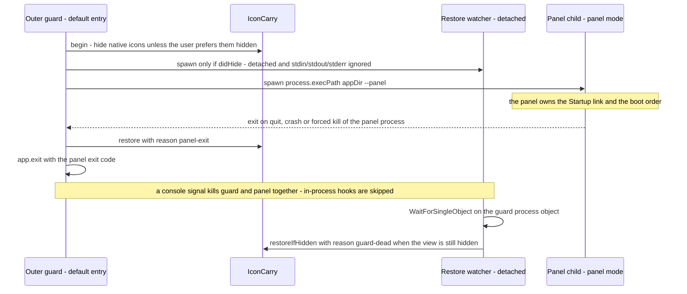
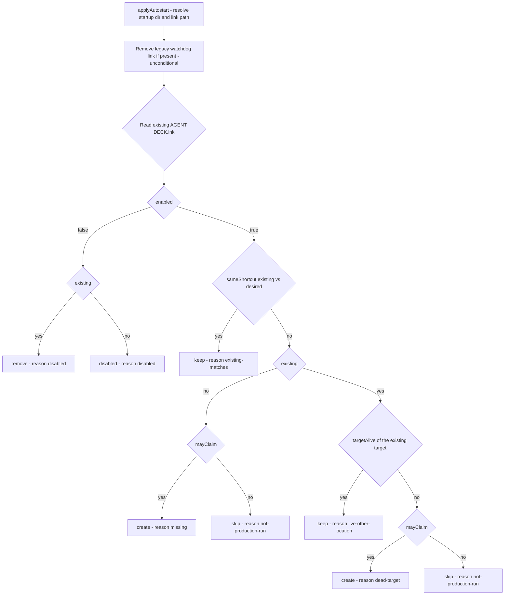

# Desktop icon carry and Startup autostart

The application performs exactly two machine-level duties around itself. Both are best-effort by design: neither is allowed to be the reason the panel fails to appear.

- **Icon carry** — hide explorer's native desktop icons before the panel is raised, then guarantee they are shown again. This is the physical precondition for the panel's self-drawn desktop: with the native `SysListView32` still visible the user sees two desktops at once.
- **Startup autostart** — keep the current user's Startup entry (`AGENT DECK.lnk`) pointed at the declared production install, and retire the legacy Python-watchdog link.

Ownership splits along process lines, and that split is the single most important thing to keep in mind when reading either module:

| Duty | Owner process | Code |
|---|---|---|
| Hide and restore native desktop icons | outer guard (default entry, no flags) | `src/main/icon-carry.ts`, `src/main/icon-restore-watch.cjs` |
| Maintain `AGENT DECK.lnk` | panel process (`--panel`), during boot | `src/main/autostart.ts`, `src/main/autostart.ps1` |
| One-off "make the icons visible" | a short-lived `--icon-restore` process | `forceShowIcons()` in `icon-carry.ts` |

<!-- openwiki: broken internal link [/repo://app/src/main/index.ts#L183-L234] file "/repo://app/src/main/index.ts" does not exist. Fix the href or restore the target, then delete this comment. -->
The panel never touches desktop icons; the guard never touches the Startup folder. The guard is the sole icon owner because it is the parent of the panel and therefore outlives it: `taskkill /T` only clears the downward subtree, so killing the panel (including a forced kill) cannot reach its parent guard, and the restore chain stays in place ([index.ts](/repo://app/src/main/index.ts#L183-L234)). The reverse does not hold, which is what the detached restore watcher exists for.

## Hiding the native icons

### The toggle command

Hiding is not a visibility flag written by this application. It is the same command explorer issues from **View → Show desktop icons**:

- Send `WM_COMMAND` (`0x0111`) with `0x7402` to the `SHELLDLL_DefView` host window.
- Explorer then writes the resulting state back into the `HideIcons` `REG_DWORD` under `HKCU\Software\Microsoft\Windows\CurrentVersion\Explorer\Advanced`.

<!-- openwiki: broken internal link [/repo://app/src/main/icon-carry.ts#L12-L25] file "/repo://app/src/main/icon-carry.ts" does not exist. Fix the href or restore the target, then delete this comment. -->
<!-- openwiki: broken internal link [/repo://app/src/main/icon-carry.ts#L73-L78] file "/repo://app/src/main/icon-carry.ts" does not exist. Fix the href or restore the target, then delete this comment. -->
The message goes out through `SendMessageTimeoutW` with `SMTO_ABORTIFHUNG` and a 3000 ms budget, so a hung explorer degrades to a logged failure instead of wedging the guard ([icon-carry.ts](/repo://app/src/main/icon-carry.ts#L12-L25), [icon-carry.ts](/repo://app/src/main/icon-carry.ts#L73-L78)).

<!-- openwiki: broken internal link [/repo://app/src/main/icon-carry.ts#L35-L52] file "/repo://app/src/main/icon-carry.ts" does not exist. Fix the href or restore the target, then delete this comment. -->
<!-- openwiki: broken internal link [/repo://app/src/main/icon-carry.ts#L54-L58] file "/repo://app/src/main/icon-carry.ts" does not exist. Fix the href or restore the target, then delete this comment. -->
`findDefView()` locates the host in two steps: the `SHELLDLL_DefView` child of `Progman` first, then a bounded (2048 iterations) enumeration of top-level windows looking for a `WorkerW` that owns a `SHELLDLL_DefView`. The second step is not defensive padding — a dynamic-wallpaper host such as Wallpaper Engine reparents `SHELLDLL_DefView` under `WorkerW`, and a single `Progman` lookup would then find nothing ([icon-carry.ts](/repo://app/src/main/icon-carry.ts#L35-L52)). The icon list itself is the `SysListView32` child of DefView ([icon-carry.ts](/repo://app/src/main/icon-carry.ts#L54-L58)).

### View fact versus registry preference

Two independent observations are kept apart, and mixing them up is the classic bug in this area:

| Predicate | Source | Role |
|---|---|---|
| `iconsVisible()` | `IsWindowVisible` on the desktop `SysListView32` | the **view fact** — the only authority for whether a toggle is needed |
| `prefHidden()` | `reg query` of `HideIcons` (`1` = the user's own persistent preference to hide) | the **preference** — decides whether this run may hide at all, and is only recorded afterwards |

<!-- openwiki: broken internal link [/repo://app/src/main/icon-carry.ts#L88-L100] file "/repo://app/src/main/icon-carry.ts" does not exist. Fix the href or restore the target, then delete this comment. -->
<!-- openwiki: broken internal link [/repo://app/src/main/icon-carry.ts#L96-L99] file "/repo://app/src/main/icon-carry.ts" does not exist. Fix the href or restore the target, then delete this comment. -->
`begin()` hides only when the user does not already prefer hidden icons, and records the outcome as one of three events — `icons-hidden`, `icons-already-hidden` (user preference respected, nothing touched) or `icons-hide-failed` ([icon-carry.ts](/repo://app/src/main/icon-carry.ts#L88-L100)). A hide failure is never fatal: the panel is raised anyway with a "two desktops" degradation that is visible in the evidence log, and a `console.error` line states it ([icon-carry.ts](/repo://app/src/main/icon-carry.ts#L96-L99)).

Because `prefHidden()` is consulted first, a user who hides desktop icons for their own reasons never has that preference overridden: there is no hiding to undo, so there is no restore obligation either — and, as a direct consequence, no restore watcher is spawned.

## Restoring, and never leaving an empty desktop

"Never leave an empty desktop" is the invariant that shapes every restore path. It has two faces: the icons must come back after the panel is gone, and a user who re-shows the icons while the panel is running must not have them hidden again. The second face is why the ownership marker is never the sole test.

<!-- openwiki: broken internal link [/repo://app/src/main/icon-carry.ts#L102-L116] file "/repo://app/src/main/icon-carry.ts" does not exist. Fix the href or restore the target, then delete this comment. -->
<!-- openwiki: broken internal link [/repo://app/src/main/icon-carry.ts#L124-L135] file "/repo://app/src/main/icon-carry.ts" does not exist. Fix the href or restore the target, then delete this comment. -->
`IconCarry.restore(reason)` is idempotent through a `settled` flag, and flips the state back only when **this run hid the icons and they are still hidden**; if the user re-showed them during the run, nothing is touched ([icon-carry.ts](/repo://app/src/main/icon-carry.ts#L102-L116)). `restoreIfHidden(log, reason)` deliberately drops the ownership test and decides on the view fact alone: the guard is dead by the time it runs, so "did I hide them" is unknowable, and a visible list view is never toggled ([icon-carry.ts](/repo://app/src/main/icon-carry.ts#L124-L135)).

Every path that ends a carry episode:

| Path / reason | Trigger | Test applied | Owner |
|---|---|---|---|
| `panel-exit` | the `--panel` child exits, for any reason — clean quit, crash, `taskkill /F` of the panel | ownership + still hidden | guard (`child.on('exit')`, before `app.exit(code)`) |
| `panel-spawn-failed` | the panel child could not be spawned at all | ownership + still hidden | guard (`child.on('error')`) |
| `outer-quit` | `app` `before-quit` in the guard | ownership + still hidden | guard |
| `guard-dead` | the restore watcher wakes up because the guard process object signalled | view fact only | `icon-restore-watch.cjs` |
| `force` | a human or a script runs `electron . --icon-restore` | registry preference | `--icon-restore` process |

<!-- openwiki: broken internal link [/repo://app/src/main/index.ts#L229-L233] file "/repo://app/src/main/index.ts" does not exist. Fix the href or restore the target, then delete this comment. -->
Note that `panel-exit` is restored explicitly *before* `app.exit(code)` is called; `app.exit` terminates without running the normal quit sequence, so relying on `before-quit` alone would lose the restore on the ordinary panel-exit path ([index.ts](/repo://app/src/main/index.ts#L229-L233)).

The control flow of a normal run, and of the console-signal death that bypasses the guard's own hooks:

Sequence diagram of the carry episode: the guard hides, spawns the watcher and the panel, and either the guard restores on panel exit or the watcher restores after the guard is killed by a console signal.

## The restore watcher

<!-- openwiki: broken internal link [/repo://app/src/main/index.ts#L200-L208] file "/repo://app/src/main/index.ts" does not exist. Fix the href or restore the target, then delete this comment. -->
<!-- openwiki: broken internal link [/repo://app/src/main/icon-restore-watch.cjs#L1-L9] file "/repo://app/src/main/icon-restore-watch.cjs" does not exist. Fix the href or restore the target, then delete this comment. -->
The watcher closes a gap that in-process hooks cannot: `Ctrl+C`, `Ctrl+Break` and closing the terminal window are delivered by conhost to both the guard and the panel at once, and the Electron main process on Windows does not run Node `SIGINT`/`SIGBREAK` handlers, so every restore hook inside the guard is bypassed and the icons stay hidden ([index.ts](/repo://app/src/main/index.ts#L200-L208), [icon-restore-watch.cjs](/repo://app/src/main/icon-restore-watch.cjs#L1-L9)).

Its properties, all of which matter:

<!-- openwiki: broken internal link [/repo://app/src/main/index.ts#L209-L218] file "/repo://app/src/main/index.ts" does not exist. Fix the href or restore the target, then delete this comment. -->
- **Birth**: spawned by the guard, *before* the panel child, only when `carry.didHide()` is true — a run that never hid anything has no restore obligation, so it gets no watcher. `detached: true` + `stdio: 'ignore'` gives it no console and takes it out of the Chromium job kill-on-close; `unref()` keeps it from holding the guard open ([index.ts](/repo://app/src/main/index.ts#L209-L218)).
<!-- openwiki: broken internal link [/repo://app/src/main/index.ts#L210-L214] file "/repo://app/src/main/index.ts" does not exist. Fix the href or restore the target, then delete this comment. -->
- **Runtime form**: `ELECTRON_RUN_AS_NODE=1` with `process.execPath`, i.e. the Electron binary acting as Node — no separate Node dependency on the machine ([index.ts](/repo://app/src/main/index.ts#L210-L214)).
<!-- openwiki: broken internal link [/repo://app/src/main/icon-restore-watch.cjs#L14-L30] file "/repo://app/src/main/icon-restore-watch.cjs" does not exist. Fix the href or restore the target, then delete this comment. -->
- **Wait**: it takes the guard's pid, opens the **process object** with `SYNCHRONIZE | PROCESS_QUERY_LIMITED_INFORMATION` and blocks in `WaitForSingleObject(handle, INFINITE)`. Waiting on the handle rather than polling the pid is what makes pid reuse harmless. A failure to open (guard already gone, or insufficient access) is treated as "guard is dead" and the restore judgement runs immediately ([icon-restore-watch.cjs](/repo://app/src/main/icon-restore-watch.cjs#L14-L30)).
<!-- openwiki: broken internal link [/repo://app/src/main/icon-restore-watch.cjs#L31-L38] file "/repo://app/src/main/icon-restore-watch.cjs" does not exist. Fix the href or restore the target, then delete this comment. -->
- **Act**: if the view fact says the icons are still hidden, call `restoreIfHidden(null, 'guard-dead')`. The `null` log is deliberate: the watcher holds no evidence log, so its restore is silent. On the normal path the guard has already restored, the view is visible, and the watcher exits without touching anything — zero perceived cost ([icon-restore-watch.cjs](/repo://app/src/main/icon-restore-watch.cjs#L31-L38)).
- **Exit**: always `process.exit(0)`, restore failure included — an orphaned watcher must not become a resident leftover.

## The `--icon-restore` self-rescue entry

<!-- openwiki: broken internal link [/repo://README.md#L120-L124] file "/repo://README.md" does not exist. Fix the href or restore the target, then delete this comment. -->
<!-- openwiki: broken internal link [/repo://app/src/main/index.ts#L176-L182] file "/repo://app/src/main/index.ts" does not exist. Fix the href or restore the target, then delete this comment. -->
`electron . --icon-restore` is the one-shot "make the icons visible" mode, used as cleanup between acceptance-battery rounds and as the user-facing self-rescue when a forced kill left the desktop empty ([README.md](/repo://README.md#L120-L124)). It runs in the `RESTORE_MODE` branch before any single-instance logic, so it does not take or need the lock and works while a panel is running; it logs `carry-boot` with `mode: 'restore'`, calls `forceShowIcons(log)` and exits with code 0 ([index.ts](/repo://app/src/main/index.ts#L176-L182)).

<!-- openwiki: broken internal link [/repo://app/src/main/icon-carry.ts#L137-L141] file "/repo://app/src/main/icon-carry.ts" does not exist. Fix the href or restore the target, then delete this comment. -->
`forceShowIcons` is keyed on the registry preference, not the view fact: it toggles only when `HideIcons` is `1`, otherwise it just records. That is the complement of the guard-side paths and matches the residual state the channel exists for (the carry path hides through explorer, so a dead run leaves `HideIcons=1`), but it does mean a view/preference mismatch is not repaired by this entry ([icon-carry.ts](/repo://app/src/main/icon-carry.ts#L137-L141)).

## Maintaining the Startup shortcut

### Location and target

<!-- openwiki: broken internal link [/repo://app/src/main/autostart.ts#L61-L74] file "/repo://app/src/main/autostart.ts" does not exist. Fix the href or restore the target, then delete this comment. -->
<!-- openwiki: broken internal link [/repo://app/src/main/index.ts#L54-L65] file "/repo://app/src/main/index.ts" does not exist. Fix the href or restore the target, then delete this comment. -->
The link lives at `%APPDATA%\Microsoft\Windows\Start Menu\Programs\Startup\AGENT DECK.lnk`; `startupDirFrom()` composes it and `startupDir()` reads `APPDATA` from the environment, throwing an explicit error when it is missing rather than guessing a path. That throw is caught by the caller and degrades to "no autostart handling this run" ([autostart.ts](/repo://app/src/main/autostart.ts#L61-L74), [index.ts](/repo://app/src/main/index.ts#L54-L65)).

<!-- openwiki: broken internal link [/repo://app/src/main/autostart.ts#L80-L86] file "/repo://app/src/main/autostart.ts" does not exist. Fix the href or restore the target, then delete this comment. -->
<!-- openwiki: broken internal link [/repo://app/src/main/index.ts#L55-L61] file "/repo://app/src/main/index.ts" does not exist. Fix the href or restore the target, then delete this comment. -->
The desired shortcut is *derived from the current run location*, never hardcoded: target `process.execPath` (the Electron binary), arguments `"<app dir>"` quoted because the path routinely contains spaces, working directory set to the app dir ([autostart.ts](/repo://app/src/main/autostart.ts#L80-L86), [index.ts](/repo://app/src/main/index.ts#L55-L61)). The arguments carry no mode flag, so the link boots the **default entry — the outer guard**, which is what makes a Startup boot produce the full chain: guard → hide icons → panel.

<!-- openwiki: broken internal link [/repo://app/src/main/autostart.ts#L1-L19] file "/repo://app/src/main/autostart.ts" does not exist. Fix the href or restore the target, then delete this comment. -->
The Startup folder is used instead of the `Run` registry key because it is the mechanism the previous stack already used and because the user recognizes the entry in both Task Manager → Startup and the Startup folder; the retirement moves the target, not the mechanism ([autostart.ts](/repo://app/src/main/autostart.ts#L1-L19)).

### Identity comparison

<!-- openwiki: broken internal link [/repo://app/src/main/autostart.ts#L36-L59] file "/repo://app/src/main/autostart.ts" does not exist. Fix the href or restore the target, then delete this comment. -->
<!-- openwiki: broken internal link [/repo://app/src/main/autostart.ts#L46-L50] file "/repo://app/src/main/autostart.ts" does not exist. Fix the href or restore the target, then delete this comment. -->
Whether the existing link already points where this run wants it is decided by `sameShortcut`, which compares **target and arguments only** (working directory is written but not compared) after normalizing: target is trimmed, forward slashes become backslashes, and lowercased; arguments are de-quoted on both sides. Fully normalized path comparison for the production check additionally drops a trailing separator, so the declared and running values may differ by one `\` and still be the same place ([autostart.ts](/repo://app/src/main/autostart.ts#L36-L59), [autostart.ts](/repo://app/src/main/autostart.ts#L46-L50)).

### The decision table

<!-- openwiki: broken internal link [/repo://app/src/main/autostart.ts#L95-L121] file "/repo://app/src/main/autostart.ts" does not exist. Fix the href or restore the target, then delete this comment. -->
`decideAutostart` is a pure function of `enabled`, `mayClaim`, the existing shortcut, the desired shortcut and an injected `targetAlive` predicate — no filesystem, no COM, which is what makes the decision seam offline-testable. `mayClaim` is `isProductionRun()`, true only when `config.autostart.appDir` is non-empty and normalizes to the running app directory ([autostart.ts](/repo://app/src/main/autostart.ts#L95-L121)).

| `enabled` | Existing link | Existing matches desired | Existing target alive | `mayClaim` | Action | Reason |
|---|---|---|---|---|---|---|
| `false` | yes | — | — | — | `remove` | `disabled` |
| `false` | no | — | — | — | `disabled` | `disabled` |
| `true` | yes | yes | — (not consulted) | — | `keep` | `existing-matches` |
| `true` | yes | no | yes | — | `keep` | `live-other-location` |
| `true` | yes | no | no | `true` | `create` | `dead-target` |
| `true` | yes | no | no | `false` | `skip` | `not-production-run` |
| `true` | no | — | — | `true` | `create` | `missing` |
| `true` | no | — | — | `false` | `skip` | `not-production-run` |

<!-- openwiki: broken internal link [/repo://app/src/main/autostart.ts#L114-L120] file "/repo://app/src/main/autostart.ts" does not exist. Fix the href or restore the target, then delete this comment. -->
Two details the table encodes: a match short-circuits before target aliveness is consulted, and only a **live** link is protected from being chased. A dead link is healed by re-pointing it at the current run — but only from the declared production location, since letting a development worktree claim a machine-level startup entry would leave the machine booting into a directory that is deleted when the worktree is torn down ([autostart.ts](/repo://app/src/main/autostart.ts#L114-L120)).

Flowchart of the autostart decision: legacy retirement happens before any decision, the decision itself never touches the filesystem, and `mayClaim` gates every write that would newly claim the machine-level entry.

### Applying the plan

`applyAutostart` is the impure wrapper, run once per panel boot. Its ordering and failure semantics are the operational contract:

<!-- openwiki: broken internal link [/repo://app/src/main/autostart.ts#L27-L28] file "/repo://app/src/main/autostart.ts" does not exist. Fix the href or restore the target, then delete this comment. -->
<!-- openwiki: broken internal link [/repo://app/src/main/autostart.ts#L202-L209] file "/repo://app/src/main/autostart.ts" does not exist. Fix the href or restore the target, then delete this comment. -->
- **Legacy retirement first, unconditionally.** Every name in `LEGACY_STARTUP_LINK_NAMES` present in the Startup folder is deleted before the main decision, and the removal is logged as `autostart-legacy-removed` with the names. It runs even when `autostart.enabled` is false and even in a development run — retiring the old Python watchdog link must not depend on the user remembering to delete it by hand ([autostart.ts](/repo://app/src/main/autostart.ts#L27-L28), [autostart.ts](/repo://app/src/main/autostart.ts#L202-L209)).
<!-- openwiki: broken internal link [/repo://app/src/main/autostart.ts#L148-L158] file "/repo://app/src/main/autostart.ts" does not exist. Fix the href or restore the target, then delete this comment. -->
- **Read failures are not "absent" at the module boundary.** `readShortcut()` throws when the PowerShell helper fails (COM unavailable, non-zero exit, unparseable output) so a real fault is never silently reported as "shortcut does not exist"; a link that genuinely does not exist reads as `null` ([autostart.ts](/repo://app/src/main/autostart.ts#L148-L158)).
<!-- openwiki: broken internal link [/repo://app/src/main/autostart.ts#L211-L216] file "/repo://app/src/main/autostart.ts" does not exist. Fix the href or restore the target, then delete this comment. -->
- **`applyAutostart` downgrades that throw.** It catches the read error, logs `autostart-read-failed` and proceeds with `existing = null` ([autostart.ts](/repo://app/src/main/autostart.ts#L211-L216)). Consequence worth knowing: in a production run, an unreadable-but-present link is treated as missing and gets **rewritten**.
<!-- openwiki: broken internal link [/repo://app/src/main/autostart.ts#L226-L241] file "/repo://app/src/main/autostart.ts" does not exist. Fix the href or restore the target, then delete this comment. -->
- **`applied` is not the action.** `keep`, `disabled` and `skip` are reported as `applied: true` because nothing needed writing; `create` and `remove` are `applied: true` only after the write succeeded, and a write throw downgrades to `applied: false` plus an `autostart-write-failed` event. Every run that gets past Startup-path resolution ends with one `autostart-applied` event carrying `action`, `reason` and `applied` ([autostart.ts](/repo://app/src/main/autostart.ts#L226-L241)).
<!-- openwiki: broken internal link [/repo://app/src/main/index.ts#L54-L65] file "/repo://app/src/main/index.ts" does not exist. Fix the href or restore the target, then delete this comment. -->
- **Nothing here blocks the boot.** `bootPanel` wraps the whole call in `try`/`catch` and only warns plus logs `autostart-failed` ([index.ts](/repo://app/src/main/index.ts#L54-L65)).

<!-- openwiki: broken internal link [/repo://app/src/main/config.ts#L33-L48] file "/repo://app/src/main/config.ts" does not exist. Fix the href or restore the target, then delete this comment. -->
<!-- openwiki: broken internal link [/repo://app/src/main/config.ts#L166-L189] file "/repo://app/src/main/config.ts" does not exist. Fix the href or restore the target, then delete this comment. -->
<!-- openwiki: broken internal link [/repo://app/config.json#L63-L66] file "/repo://app/config.json" does not exist. Fix the href or restore the target, then delete this comment. -->
`config.autostart` is read once per process start; there is no runtime toggle and no settings-IPC surface for it. Changing `enabled` or `appDir` takes effect on the next panel start ([config.ts](/repo://app/src/main/config.ts#L33-L48), [config.ts](/repo://app/src/main/config.ts#L166-L189)). The repository's own `app/config.json` declares `"appDir": "D:\\local_works\\agent-deck\\app"`, so a run from anywhere else — including an acceptance run — resolves to a non-production run and never claims the entry ([config.json](/repo://app/config.json#L63-L66)).

## The PowerShell helper and the ASCII invariant

<!-- openwiki: broken internal link [/repo://app/src/main/autostart.ts#L131-L146] file "/repo://app/src/main/autostart.ts" does not exist. Fix the href or restore the target, then delete this comment. -->
<!-- openwiki: broken internal link [/repo://app/src/main/autostart.ps1#L5-L8] file "/repo://app/src/main/autostart.ps1" does not exist. Fix the href or restore the target, then delete this comment. -->
Shortcut reading and writing go through `src/main/autostart.ps1`, invoked as a standalone script (`powershell.exe -NoProfile -NonInteractive -ExecutionPolicy Bypass -File …`) with explicit named parameters rather than an inline `-Command`: the app directory routinely contains spaces, and re-parsing those argument values through `cmd` is a well-known source of silent breakage ([autostart.ts](/repo://app/src/main/autostart.ts#L131-L146), [autostart.ps1](/repo://app/src/main/autostart.ps1#L5-L8)).

<!-- openwiki: broken internal link [/repo://app/src/main/autostart.ps1#L43-L58] file "/repo://app/src/main/autostart.ps1" does not exist. Fix the href or restore the target, then delete this comment. -->
- **Read mode** opens the link with `WScript.Shell` COM and prints one compressed JSON line (`exists`, `target`, `args`, `workDir`). Absence is reported **only** in read mode — the check sits after the write branch on purpose, so write mode can create a link that does not exist yet ([autostart.ps1](/repo://app/src/main/autostart.ps1#L43-L58)).
<!-- openwiki: broken internal link [/repo://app/src/main/autostart.ps1#L32-L41] file "/repo://app/src/main/autostart.ps1" does not exist. Fix the href or restore the target, then delete this comment. -->
- **Write mode** creates the `.lnk` via `CreateShortcut` and `Save()`, setting the working directory only when one was supplied ([autostart.ps1](/repo://app/src/main/autostart.ps1#L32-L41)).
<!-- openwiki: broken internal link [/repo://app/src/main/autostart.ts#L166-L172] file "/repo://app/src/main/autostart.ts" does not exist. Fix the href or restore the target, then delete this comment. -->
<!-- openwiki: broken internal link [/repo://app/src/main/autostart.ps1#L1-L3] file "/repo://app/src/main/autostart.ps1" does not exist. Fix the href or restore the target, then delete this comment. -->
- **Deletion is deliberately not in the script.** `removeShortcut()` deletes the file directly with `fs.rmSync(..., { force: true })` and swallows failures, because an unused COM delete branch is a shape that rots ([autostart.ts](/repo://app/src/main/autostart.ts#L166-L172), [autostart.ps1](/repo://app/src/main/autostart.ps1#L1-L3)).
<!-- openwiki: broken internal link [/repo://app/src/main/autostart.ps1#L24-L26] file "/repo://app/src/main/autostart.ps1" does not exist. Fix the href or restore the target, then delete this comment. -->
- **The parameter is `$LinkArgs`, not `$Args`** — `$args` is a PowerShell automatic variable and would silently swallow the bound value ([autostart.ps1](/repo://app/src/main/autostart.ps1#L24-L26)).
<!-- openwiki: broken internal link [/repo://app/src/main/autostart.ps1#L15-L17] file "/repo://app/src/main/autostart.ps1" does not exist. Fix the href or restore the target, then delete this comment. -->
<!-- openwiki: broken internal link [/repo://app/src/main/autostart.ts#L137-L145] file "/repo://app/src/main/autostart.ts" does not exist. Fix the href or restore the target, then delete this comment. -->
- **Non-zero exit means a real failure.** The helper exits non-zero on error so the Node caller reports a failure instead of treating it as "no shortcut"; the caller parses the *last* non-empty stdout line as JSON ([autostart.ps1](/repo://app/src/main/autostart.ps1#L15-L17), [autostart.ts](/repo://app/src/main/autostart.ts#L137-L145)).
<!-- openwiki: broken internal link [/repo://app/src/main/autostart.ts#L16-L19] file "/repo://app/src/main/autostart.ts" does not exist. Fix the href or restore the target, then delete this comment. -->
<!-- openwiki: broken internal link [/repo://app/src/main/autostart.ps1#L10-L13] file "/repo://app/src/main/autostart.ps1" does not exist. Fix the href or restore the target, then delete this comment. -->
<!-- openwiki: broken internal link [/repo://app/accept/lib/uia-focus.ps1#L1-L4] file "/repo://app/accept/lib/uia-focus.ps1" does not exist. Fix the href or restore the target, then delete this comment. -->
- **ASCII-only, and this is an invariant, not a style preference.** Windows PowerShell 5.1 reads a BOM-less script using the system ANSI code page, so UTF-8 comments become mojibake that breaks parsing outright. The same convention applies to the acceptance helpers `accept/lib/capture.ps1` and `accept/lib/uia-focus.ps1`. All rationale comments deliberately live in `autostart.ts` instead ([autostart.ts](/repo://app/src/main/autostart.ts#L16-L19), [autostart.ps1](/repo://app/src/main/autostart.ps1#L10-L13), [uia-focus.ps1](/repo://app/accept/lib/uia-focus.ps1#L1-L4)).

<!-- openwiki: broken internal link [/repo://app/scripts/copy-assets.mjs#L20-L28] file "/repo://app/scripts/copy-assets.mjs" does not exist. Fix the href or restore the target, then delete this comment. -->
Neither the script nor the watcher is compiled by `tsc`; `scripts/copy-assets.mjs` copies both into `dist/main` next to their compiled consumers, which reference them through `__dirname` ([copy-assets.mjs](/repo://app/scripts/copy-assets.mjs#L20-L28)).

## Boot order

<!-- openwiki: broken internal link [/repo://app/src/main/index.ts#L34-L109] file "/repo://app/src/main/index.ts" does not exist. Fix the href or restore the target, then delete this comment. -->
Both machine-level duties run inside `bootPanel()`, i.e. in the `--panel` child, and their order relative to config loading, usage-log migration and kernel start is fixed and load-bearing ([index.ts](/repo://app/src/main/index.ts#L34-L109)):

1. **Event log** — `fileEventLog(process.env.DECK_EVENT_LOG)`.
2. **Config load** — `loadConfig(CONFIG_FILE, fallback)` merges the user file over per-section defaults, returns warnings for illegal fields, and writes a default `config.json` if none exists. `config.autostart` is one of those sections.
3. **`applyAutostart`** — with `config.autostart.enabled`, `config.autostart.appDir`, `app.getAppPath()` as the running directory and the desired shortcut derived from `process.execPath`. Wrapped in `try`/`catch`.
4. **Legacy usage-log migration** — `migrateUsageLog` copies the Python-era `%LOCALAPPDATA%\qoder-deck\usage` day files into `userData/usage` before collection starts, so a same-day file cannot end up with its records interleaved out of order; it is idempotent and failure only means the history starts accumulating from zero.
5. **Kernel start** — `createPanelKernel(...)` then `await kernel.start()` and `await kernel.panelData.whenReady`, after which the protocol, window, tray and IPC wiring follow.

The ordering constraint is really between steps 4 and 5. Steps 2 and 3 are ordered only because autostart needs the config; both are failure-tolerant so that an unusable `config.json` or a Startup folder that cannot be written still yields a panel.

## Observability

<!-- openwiki: broken internal link [/repo://app/src/main/panel-ipc.ts#L9-L24] file "/repo://app/src/main/panel-ipc.ts" does not exist. Fix the href or restore the target, then delete this comment. -->
<!-- openwiki: broken internal link [/repo://app/package.json#L7-L14] file "/repo://app/package.json" does not exist. Fix the href or restore the target, then delete this comment. -->
All events in this area are written only when `DECK_EVENT_LOG` is set — `fileEventLog` returns `null` otherwise, and the normal `npm run dev` / `npm run dev:panel` scripts do not set it ([panel-ipc.ts](/repo://app/src/main/panel-ipc.ts#L9-L24), [package.json](/repo://app/package.json#L7-L14)). The acceptance battery launches `electron .` with `DECK_EVENT_LOG` pointing at `accept/evidence/*.jsonl`, which is why the carry and autostart story is only observable in a battery run or an equivalent hand-launched run.

| Event | Emitted by | Carries |
|---|---|---|
| `carry-boot` | guard / `--icon-restore` | `pid`, `mode: 'carry' \| 'restore'` |
| `icons-hidden` | `IconCarry.begin` | `prefHidden`, `viewVisible` (after the toggle) |
| `icons-already-hidden` | `IconCarry.begin` | user preference was already hidden; nothing touched |
| `icons-hide-failed` | `IconCarry.begin` | DefView unreachable; panel raised anyway |
| `icons-restored` / `icons-restore-failed` | `IconCarry.restore`, `restoreIfHidden`, `forceShowIcons` | `reason` (`panel-exit`, `panel-spawn-failed`, `outer-quit`, `guard-dead`, `force`), `prefHiddenAfter`, `viewVisibleAfter` |
| `carry-exit` | guard | panel `code` |
| `restore-watch-spawned` / `restore-watch-spawn-failed` | guard | watcher `pid` or the spawn error |
| `autostart-applied` | `applyAutostart` | `link`, `action`, `reason`, `applied` |
| `autostart-legacy-removed` | `applyAutostart` | `names` |
| `autostart-read-failed` / `autostart-write-failed` | `applyAutostart` | helper error text |
| `autostart-failed` | `bootPanel` catch | thrown message (e.g. `APPDATA` unset) |

The restore watcher is the one participant that emits nothing: it is handed a `null` log, so a `guard-dead` restore shows up only as the resulting view state, not as an event.

## Tests and acceptance coverage

`app/tests/autostart.spec.ts` is split along the same seam as the module, and this split is the thing to copy if the behaviour grows:

<!-- openwiki: broken internal link [/repo://app/tests/autostart.spec.ts#L49-L155] file "/repo://app/tests/autostart.spec.ts" does not exist. Fix the href or restore the target, then delete this comment. -->
- A **pure-logic seam** that touches neither the filesystem nor COM: Startup path derivation, `desiredShortcut` quoting, `sameShortcut` normalization, the full `decideAutostart` table, and `isProductionRun` including the case/trailing-separator tolerance ([autostart.spec.ts](/repo://app/tests/autostart.spec.ts#L49-L155)).
<!-- openwiki: broken internal link [/repo://app/tests/autostart.spec.ts#L42-L47] file "/repo://app/tests/autostart.spec.ts" does not exist. Fix the href or restore the target, then delete this comment. -->
<!-- openwiki: broken internal link [/repo://app/tests/autostart.spec.ts#L157-L245] file "/repo://app/tests/autostart.spec.ts" does not exist. Fix the href or restore the target, then delete this comment. -->
- An **adapter seam** guarded by `skipIf(!isWindows)`, using a temporary directory as the Startup folder and the real `WScript.Shell` COM round-trip through the helper. Targets are faked with prefix predicates for the pure parts, and the "live other location" cases use `process.execPath` so the link really points at an existing file. Because real COM is involved, the integration specs raise the timeout to 15 s ([autostart.spec.ts](/repo://app/tests/autostart.spec.ts#L42-L47), [autostart.spec.ts](/repo://app/tests/autostart.spec.ts#L157-L245)).

The tests pin the semantics that are easy to break by accident: legacy removal happens even when `appDir` is empty, a development run never hijacks a live production link, a development run does not adopt a dead link either, a second run is `keep`/`existing-matches` rather than a rewrite, and `enabled: false` removes an existing link without requiring production identity.

Icon carry has **no offline unit test** — it is Win32-dependent end to end — so its verification lives in the acceptance battery, which asserts the real window state rather than module behaviour:

<!-- openwiki: broken internal link [/repo://app/accept/battery.js#L844-L849] file "/repo://app/accept/battery.js" does not exist. Fix the href or restore the target, then delete this comment. -->
- While the panel runs, the desktop `SysListView32` must be invisible, with a full-screen screenshot as evidence ([battery.js](/repo://app/accept/battery.js#L844-L849)).
<!-- openwiki: broken internal link [/repo://app/accept/battery.js#L992-L1010] file "/repo://app/accept/battery.js" does not exist. Fix the href or restore the target, then delete this comment. -->
- A `taskkill /F` of the panel process must restore the icons and the guard must then exit, with `icons-restored` (reason `panel-exit`) as the recorded proof ([battery.js](/repo://app/accept/battery.js#L992-L1010)).
<!-- openwiki: broken internal link [/repo://app/accept/battery.js#L2220-L2234] file "/repo://app/accept/battery.js" does not exist. Fix the href or restore the target, then delete this comment. -->
- Battery teardown kills the whole tree, which the guard's own restore paths cannot survive, so it falls back to `--icon-restore` when it still finds the icons hidden, and notes the outcome either way ([battery.js](/repo://app/accept/battery.js#L2220-L2234)).

<!-- openwiki: broken internal link [/repo://app/accept/lib/win32.js#L63-L65] file "/repo://app/accept/lib/win32.js" does not exist. Fix the href or restore the target, then delete this comment. -->
<!-- openwiki: broken internal link [/repo://app/accept/lib/win32.js#L95-L118] file "/repo://app/accept/lib/win32.js" does not exist. Fix the href or restore the target, then delete this comment. -->
<!-- openwiki: broken internal link [/repo://README.md#L101-L105] file "/repo://README.md" does not exist. Fix the href or restore the target, then delete this comment. -->
<!-- openwiki: broken internal link [/repo://app/accept/evidence/03-runtime-events.jsonl#L5] file "/repo://app/accept/evidence/03-runtime-events.jsonl" does not exist. Fix the href or restore the target, then delete this comment. -->
The battery does not import production code for this: `accept/lib/win32.js` re-implements the DefView discovery and `SysListView32` visibility probe with a comment stating the deliberate duplication ([win32.js](/repo://app/accept/lib/win32.js#L63-L65), [win32.js](/repo://app/accept/lib/win32.js#L95-L118)). Autostart has no battery assertion at all; the README records that a genuine reboot check of the Startup entry is a manual verification step, and the recorded acceptance runs show the expected non-claiming outcome (`keep`, reason `live-other-location`) because they run from a working tree that does not match the declared `appDir` ([README.md](/repo://README.md#L101-L105), [03-runtime-events.jsonl](/repo://app/accept/evidence/03-runtime-events.jsonl#L5)).

## Changing this safely

- **Adding a restore path**: it must stay view-fact-gated or ownership-gated as appropriate, and it must be idempotent. A new unconditional toggle re-introduces the "user re-showed the icons, we hid them again" failure the `restore()` predicate exists to prevent.
- **Adding a mode flag to the Startup link**: don't. The link is intentionally flag-free so a Startup boot runs the default entry, the guard.
- **Adding a legacy link name**: extend `LEGACY_STARTUP_LINK_NAMES`; removal is by name, never by target path, and it is unconditional on every run.
- **Changing the decision table**: update `decideAutostart` and its spec together — the table is duplicated nowhere, but the consequences (never claim from a development run, never deviate from a live link) are the reason the module exists.
- **Editing `autostart.ps1`**: keep it ASCII-only, keep output to a single JSON line, and keep the read/write split — deletion belongs in Node.
- **Wanting watcher visibility in the evidence log**: that is a real gap (the watcher passes `null`), and fixing it means giving the watcher a log path, not changing the restore predicate.

## Related pages

- [Process lifecycle and windowing](/openwiki/architecture/process-lifecycle-and-windowing.md) — the four run modes, the single-instance lock handoff and the spawn chain this page assumes.
- [Windows shell and system APIs](/openwiki/integrations/windows-shell-and-system-apis.md) — the koffi/FFI surface the DefView probe and the watcher's process handle use.
<!-- openwiki: broken internal link [/openwiki/operations/configuration-reference.md] file "/openwiki/operations/configuration-reference.md" does not exist. Fix the href or restore the target, then delete this comment. -->
- [Configuration reference](/openwiki/operations/configuration-reference.md) — the full `config.autostart` section and its merge rules.
- [Recovery and diagnostics](/openwiki/operations/recovery-and-diagnostics.md) — the playbook for a missing or wrong startup entry and for a desktop left without icons.
