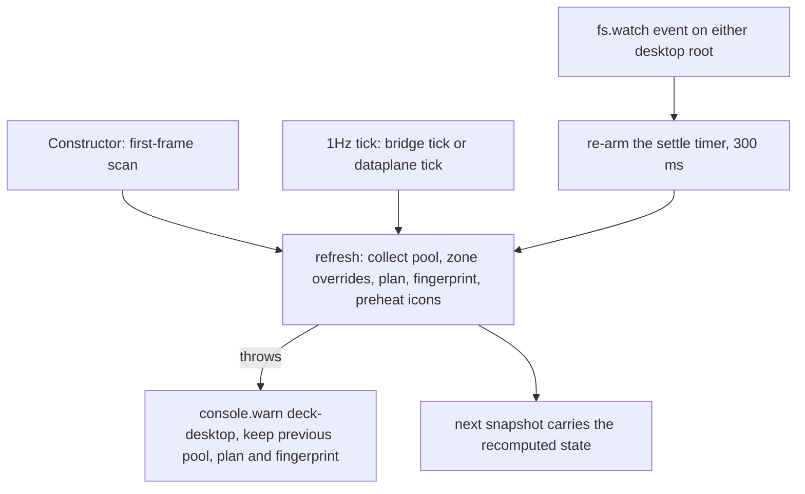
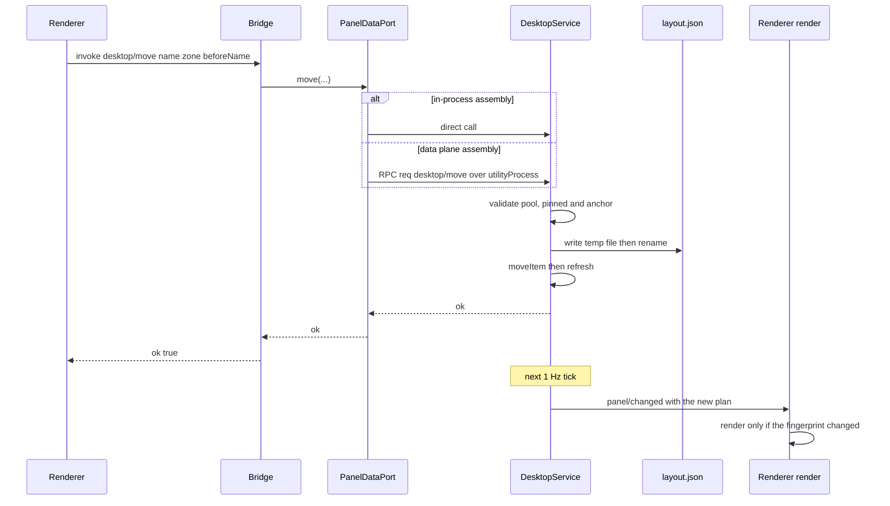

# Desktop carry runtime: refresh, placement writes, icons and launch

[Desktop zone planning](/openwiki/architecture/desktop-zones-planning.md) decides *what* goes where as a pure function over synthetic item records. This page documents the other half: how the panel learns which desktop items exist, how a drag becomes a durable placement, how icons are obtained, and how a double-click is turned into a process launch.

<!-- openwiki: broken internal link [/repo://README.md#L9] file "/repo://README.md" does not exist. Fix the href or restore the target, then delete this comment. -->
<!-- openwiki: broken internal link [/repo://CONTEXT.md#L119-L142] file "/repo://CONTEXT.md" does not exist. Fix the href or restore the target, then delete this comment. -->
> **Retirement pointer.** Earlier revisions of this page documented a Python/Win32 executor — `zones_orchestrate.py`, `desktop_layout.py`, `zones_watcher.py`, `desktop_icons.py` — which moved *real* explorer icons with `LVM_SETITEMPOSITION`, kept name-keyed layout snapshots and ran a drift watcher under an `mkdir` lock. That whole chain was retired with the Python data service; the README states the retirement and `CONTEXT.md` keeps the retired vocabulary (drift correction, layout snapshot) together with the reason they went: the panel draws the desktop itself ([README.md](/repo://README.md#L9), [CONTEXT.md](/repo://CONTEXT.md#L119-L142)). Nothing below describes that executor.

Three ownership rules shape everything here:

| Module | Ownership | Never does |
|---|---|---|
| `src/main/services/desktop.ts` (`DesktopService`) | The item pool, the plan, the fingerprint, the placement store, and the three actions `launch` / `move` / `resetLayout` | Touch Win32, koffi or Electron directly — it works through its dependency bundle |
| `src/main/desktop/scan.ts`, `plan.ts`, `layout-store.ts` | Pure set and ordering math: merge/filter/classify, dock and document placement, store parse/mutate | Touch the filesystem |
| `src/main/desktop/adapter.ts`, `icons.ts`, `watch.ts` | The real world: directory reads, Electron roots/icons/launch, shortcut resolution, atomic store I/O, `fs.watch` | Own the item pool or the plan |

<!-- openwiki: broken internal link [/repo://app/src/shared/contract.ts#L217-L231] file "/repo://app/src/shared/contract.ts" does not exist. Fix the href or restore the target, then delete this comment. -->
<!-- openwiki: broken internal link [/repo://app/src/main/services/bridge.ts#L50-L67] file "/repo://app/src/main/services/bridge.ts" does not exist. Fix the href or restore the target, then delete this comment. -->
<!-- openwiki: broken internal link [/repo://app/src/main/services/panel-data.ts#L10-L23] file "/repo://app/src/main/services/panel-data.ts" does not exist. Fix the href or restore the target, then delete this comment. -->
The write surface facing the renderer is exactly four kernel bridge methods — `desktop/icon`, `desktop/launch`, `desktop/move`, `desktop/reset-layout` — declared in the shared contract and dispatched by `BridgeService` to the `PanelDataPort`, so the renderer code is identical against either assembly ([contract.ts](/repo://app/src/shared/contract.ts#L217-L231), [bridge.ts](/repo://app/src/main/services/bridge.ts#L50-L67), [panel-data.ts](/repo://app/src/main/services/panel-data.ts#L10-L23)).

## The dependency bundle: injected seams versus real adapters

<!-- openwiki: broken internal link [/repo://app/src/main/services/desktop.ts#L15-L35] file "/repo://app/src/main/services/desktop.ts" does not exist. Fix the href or restore the target, then delete this comment. -->
<!-- openwiki: broken internal link [/repo://app/src/main/services/desktop.ts#L73-L86] file "/repo://app/src/main/services/desktop.ts" does not exist. Fix the href or restore the target, then delete this comment. -->
`DesktopService` never calls a real-world function directly. `DesktopDeps` is a bundle of nine seams whose defaults are the Electron/koffi adapters, and every test substitutes them wholesale; the two store text functions share one row below ([services/desktop.ts](/repo://app/src/main/services/desktop.ts#L15-L35), [services/desktop.ts](/repo://app/src/main/services/desktop.ts#L73-L86)).

| Seam | Real adapter | Test substitute | In the data-plane child |
|---|---|---|---|
| `listDir` | `defaultListDir` — `fs.readdirSync` + `statSync` + lazy koffi `GetFileAttributesW` | array of `DesktopDirEntry` | available (fs and koffi are pure Node) |
| `extractIcon` | `electronIconExtractor` — `app.getFileIcon` | `vi.fn()` returning a data URL | **`null`: the icon face is switched off** |
| `open` | `shellOpen` — `shell.openPath` | `vi.fn()` | throws `desktop/launch 由面板主进程执行` |
| `watch` | `defaultWatchDesktopRoots` → `watchDesktopRoots` (`fs.watch`) | captures callbacks for manual driving | available |
| `readShortcutTarget` | `electronShortcutTarget` — `shell.readShortcutLink` | fixture map | `ProxyShortcutResolver` (batched RPC to the main process) |
| `fileExists` | `fsFileExists` — `fs.statSync().isFile()` | predicate | available |
| `readStoreText` / `writeStoreText` | text-level `fs` read and atomic replace | in-memory string | available |
| `iconScores` | the usage service's `iconScores` | injected `Map` | the usage service, which also runs in that child |

Two details of this seam are load-bearing:

<!-- openwiki: broken internal link [/repo://app/src/main/services/desktop.ts#L71-L86] file "/repo://app/src/main/services/desktop.ts" does not exist. Fix the href or restore the target, then delete this comment. -->
<!-- openwiki: broken internal link [/repo://app/src/main/dataplane.ts#L44-L53] file "/repo://app/src/main/dataplane.ts" does not exist. Fix the href or restore the target, then delete this comment. -->
- **`extractIcon` is tri-state.** Leaving it `undefined` binds the Electron extractor; passing `null` disables icons entirely. The data-plane child passes `null`, which is how the same class serves a process that has no `app.getFileIcon` ([services/desktop.ts](/repo://app/src/main/services/desktop.ts#L71-L86), [dataplane.ts](/repo://app/src/main/dataplane.ts#L44-L53)).
<!-- openwiki: broken internal link [/repo://app/src/main/desktop/adapter.ts#L1-L4] file "/repo://app/src/main/desktop/adapter.ts" does not exist. Fix the href or restore the target, then delete this comment. -->
<!-- openwiki: broken internal link [/repo://app/src/main/desktop/adapter.ts#L16-L28] file "/repo://app/src/main/desktop/adapter.ts" does not exist. Fix the href or restore the target, then delete this comment. -->
<!-- openwiki: broken internal link [/repo://app/src/main/desktop/adapter.ts#L51-L62] file "/repo://app/src/main/desktop/adapter.ts" does not exist. Fix the href or restore the target, then delete this comment. -->
- **Every real source inside `adapter.ts` is resolved lazily, inside the function that needs it.** `koffi` is `require`d on the first attribute read and `electron` on each call, which is what allows the offline suite to run with a fully fake bundle and never load either. The module header records the corollary: `require('electron')` under plain Node returns a path string rather than the API, so those calls would raise `TypeError` and must stay unreachable behind injection or be contained by their caller ([adapter.ts](/repo://app/src/main/desktop/adapter.ts#L1-L4), [adapter.ts](/repo://app/src/main/desktop/adapter.ts#L16-L28), [adapter.ts](/repo://app/src/main/desktop/adapter.ts#L51-L62)).

<!-- openwiki: broken internal link [/repo://app/src/main/desktop/adapter.ts#L30-L49] file "/repo://app/src/main/desktop/adapter.ts" does not exist. Fix the href or restore the target, then delete this comment. -->
<!-- openwiki: broken internal link [/repo://app/tests/desktop/adapter.spec.ts#L24-L34] file "/repo://app/tests/desktop/adapter.spec.ts" does not exist. Fix the href or restore the target, then delete this comment. -->
The one real adapter that needs Windows rather than Electron is `defaultListDir`: it lists with `withFileTypes`, stats for `isDirectory`/`mtimeMs`, and asks koffi for the file attributes so that hidden and system entries can be marked. A file that vanishes between listing and `statSync` is skipped (the next round converges), and an attribute value of `INVALID_FILE_ATTRIBUTES` is treated as *visible* rather than as a reason to drop the entry ([adapter.ts](/repo://app/src/main/desktop/adapter.ts#L30-L49)). The real-file test creates a `desktop.ini`-like entry with `attrib +h +s` and asserts the flag ([adapter.spec.ts](/repo://app/tests/desktop/adapter.spec.ts#L24-L34)).

## Refresh: three triggers, one pipeline

<!-- openwiki: broken internal link [/repo://app/src/main/services/desktop.ts#L95-L110] file "/repo://app/src/main/services/desktop.ts" does not exist. Fix the href or restore the target, then delete this comment. -->
`refresh()` is the only place the pool, the plan and the fingerprint are recomputed, and it always runs the same five steps: collect and merge the two desktop directories, apply the store's explicit placements as zone overrides, plan, recompute the fingerprint, then preheat icons for new keys ([services/desktop.ts](/repo://app/src/main/services/desktop.ts#L95-L110)).

<!-- openwiki: broken internal link [/repo://app/src/main/services/desktop.ts#L88-L92] file "/repo://app/src/main/services/desktop.ts" does not exist. Fix the href or restore the target, then delete this comment. -->
<!-- openwiki: broken internal link [/repo://app/src/main/desktop/watch.ts#L13-L49] file "/repo://app/src/main/desktop/watch.ts" does not exist. Fix the href or restore the target, then delete this comment. -->
<!-- openwiki: broken internal link [/repo://app/src/main/services/panel-data.ts#L51-L54] file "/repo://app/src/main/services/panel-data.ts" does not exist. Fix the href or restore the target, then delete this comment. -->
<!-- openwiki: broken internal link [/repo://app/src/main/kernel.ts#L143-L151] file "/repo://app/src/main/kernel.ts" does not exist. Fix the href or restore the target, then delete this comment. -->
One pipeline, three triggers; a failed round keeps the arrangement the user last saw. The first-frame scan exists because the outer guard hides the native icons before the panel is raised — waiting for the first 1 Hz tick would show about a second of empty desktop — while the tick and the watcher exist so a new file appears sub-second and a stale one disappears with it ([services/desktop.ts](/repo://app/src/main/services/desktop.ts#L88-L92), [watch.ts](/repo://app/src/main/desktop/watch.ts#L13-L49), [panel-data.ts](/repo://app/src/main/services/panel-data.ts#L51-L54), [kernel.ts](/repo://app/src/main/kernel.ts#L143-L151)).

### The failure policy, and why it differs from sessions

<!-- openwiki: broken internal link [/repo://app/src/main/services/desktop.ts#L46-L52] file "/repo://app/src/main/services/desktop.ts" does not exist. Fix the href or restore the target, then delete this comment. -->
<!-- openwiki: broken internal link [/repo://app/src/main/services/desktop.ts#L95-L110] file "/repo://app/src/main/services/desktop.ts" does not exist. Fix the href or restore the target, then delete this comment. -->
<!-- openwiki: broken internal link [/repo://app/src/main/services/sessions.ts#L21-L29] file "/repo://app/src/main/services/sessions.ts" does not exist. Fix the href or restore the target, then delete this comment. -->
<!-- openwiki: broken internal link [/repo://app/tests/desktop/service.spec.ts#L95-L106] file "/repo://app/tests/desktop/service.spec.ts" does not exist. Fix the href or restore the target, then delete this comment. -->
An unexpected scan failure is contained by a `try`/`catch` around the whole round: the service logs `deck-desktop: 本轮扫描失败，沿用上一轮条目` and leaves the previous items, plan and fingerprint in place. The docstring states the reasoning — a transiently blank desktop hurts more than a briefly stale one — and the contrast with the sessions service is explicit: sessions replaces its list with an empty table on failure because stale there means *zombie sessions*, whereas stale desktop means *half a beat behind* ([services/desktop.ts](/repo://app/src/main/services/desktop.ts#L46-L52), [services/desktop.ts](/repo://app/src/main/services/desktop.ts#L95-L110), [sessions.ts](/repo://app/src/main/services/sessions.ts#L21-L29)). The offline test drives this with a `listDir` that throws and asserts the whole `state()` — items, plan and fingerprint — is byte-for-byte the previous round's ([service.spec.ts](/repo://app/tests/desktop/service.spec.ts#L95-L106)).

<!-- openwiki: broken internal link [/repo://app/src/main/services/desktop.ts#L96-L106] file "/repo://app/src/main/services/desktop.ts" does not exist. Fix the href or restore the target, then delete this comment. -->
The catch protects the round, not each individual assignment, and that granularity is worth knowing before editing `refresh`: `this.items` is replaced before `planDesktop` runs, so a throw inside planning leaves a *new* pool paired with the *previous* plan and an unchanged fingerprint. The renderer's fingerprint diff then keeps the previous DOM, so the mismatch is not visible — but the two fields in `state()` can be one step apart ([services/desktop.ts](/repo://app/src/main/services/desktop.ts#L96-L106)).

## Explicit placements: the store, the overrides and the write path

### The store

<!-- openwiki: broken internal link [/repo://app/src/main/desktop/layout-store.ts#L7-L15] file "/repo://app/src/main/desktop/layout-store.ts" does not exist. Fix the href or restore the target, then delete this comment. -->
<!-- openwiki: broken internal link [/repo://app/src/main/services/desktop.ts#L70] file "/repo://app/src/main/services/desktop.ts" does not exist. Fix the href or restore the target, then delete this comment. -->
<!-- openwiki: broken internal link [/repo://app/src/main/paths.ts#L6-L13] file "/repo://app/src/main/paths.ts" does not exist. Fix the href or restore the target, then delete this comment. -->
The store is a plain JSON document at `userData/layout.json` with three ordered string lists ([layout-store.ts](/repo://app/src/main/desktop/layout-store.ts#L7-L15), [services/desktop.ts](/repo://app/src/main/services/desktop.ts#L70), [paths.ts](/repo://app/src/main/paths.ts#L6-L13)):

- `pinned` — the hand-pinned app list; its order *is* the dock's leading order.
- `dock` — explicit app-zone placements, in order.
- `docs` — explicit document-zone placements, in order.

<!-- openwiki: broken internal link [/repo://app/src/main/desktop/layout-store.ts#L1-L6] file "/repo://app/src/main/desktop/layout-store.ts" does not exist. Fix the href or restore the target, then delete this comment. -->
Because the panel draws its own desktop there are no coordinates to persist: "dropped here" is recorded as "ordered before this name", and a name appears in at most one of the two placement lists ([layout-store.ts](/repo://app/src/main/desktop/layout-store.ts#L1-L6)). Two robustness properties follow from the loader and from `moveItem`:

<!-- openwiki: broken internal link [/repo://app/src/main/desktop/layout-store.ts#L19-L46] file "/repo://app/src/main/desktop/layout-store.ts" does not exist. Fix the href or restore the target, then delete this comment. -->
<!-- openwiki: broken internal link [/repo://app/tests/desktop/layout-store.spec.ts#L7-L23] file "/repo://app/tests/desktop/layout-store.spec.ts" does not exist. Fix the href or restore the target, then delete this comment. -->
<!-- openwiki: broken internal link [/repo://app/tests/desktop/service.spec.ts#L273-L282] file "/repo://app/tests/desktop/service.spec.ts" does not exist. Fix the href or restore the target, then delete this comment. -->
- `loadStore` is total: a missing file, malformed JSON, a non-object root and wrong-typed fields all resolve to the factory state `{version:1, pinned:[], dock:[], docs:[]}` instead of throwing, so a hand-edited store degrades to factory rather than breaking boot ([layout-store.ts](/repo://app/src/main/desktop/layout-store.ts#L19-L46), [layout-store.spec.ts](/repo://app/tests/desktop/layout-store.spec.ts#L7-L23), [service.spec.ts](/repo://app/tests/desktop/service.spec.ts#L273-L282)).
<!-- openwiki: broken internal link [/repo://app/src/main/desktop/layout-store.ts#L48-L71] file "/repo://app/src/main/desktop/layout-store.ts" does not exist. Fix the href or restore the target, then delete this comment. -->
<!-- openwiki: broken internal link [/repo://app/src/main/desktop/plan.ts#L98-L107] file "/repo://app/src/main/desktop/plan.ts" does not exist. Fix the href or restore the target, then delete this comment. -->
- Lists may hold names that are no longer on the desktop. They are preserved verbatim — `moveItem` will happily insert a name it has never seen — and simply filtered when the plan is built, so a deleted-and-restored file comes back to its recorded position ([layout-store.ts](/repo://app/src/main/desktop/layout-store.ts#L48-L71), [plan.ts](/repo://app/src/main/desktop/plan.ts#L98-L107)).

<!-- openwiki: broken internal link [/repo://app/src/main/desktop/adapter.ts#L112-L126] file "/repo://app/src/main/desktop/adapter.ts" does not exist. Fix the href or restore the target, then delete this comment. -->
<!-- openwiki: broken internal link [/repo://app/src/main/services/desktop.ts#L194-L200] file "/repo://app/src/main/services/desktop.ts" does not exist. Fix the href or restore the target, then delete this comment. -->
Writes go through an atomic replace: `writeStoreText` creates the parent directory, writes `<file>.tmp`, then renames it over the target, so a crash mid-write cannot truncate the previous layout; `readStoreText` returns `null` for a missing file ([adapter.ts](/repo://app/src/main/desktop/adapter.ts#L112-L126)). A persist failure is warned about and otherwise ignored — the in-memory arrangement produced by the same call stays live for the session, and only the durability is lost ([services/desktop.ts](/repo://app/src/main/services/desktop.ts#L194-L200)).

### Zone overrides before planning

<!-- openwiki: broken internal link [/repo://app/src/main/services/desktop.ts#L203-L210] file "/repo://app/src/main/services/desktop.ts" does not exist. Fix the href or restore the target, then delete this comment. -->
<!-- openwiki: broken internal link [/repo://app/src/main/desktop/plan.ts#L122-L137] file "/repo://app/src/main/desktop/plan.ts" does not exist. Fix the href or restore the target, then delete this comment. -->
Explicit placements are not a separate overlay applied to the finished plan; they rewrite each item's `zone` *before* planning runs: names in `dock` are forced to `zone: 'app'`, names in `docs` to `zone: 'doc'`. `planDesktop` then simply filters by zone, so a cross-zone drag changes which segment the item competes in, and the same overridden zone is what `move`'s anchor check sees. If a hand-edited store lists one name in both lists, `dock` wins because its set is tested first ([services/desktop.ts](/repo://app/src/main/services/desktop.ts#L203-L210), [plan.ts](/repo://app/src/main/desktop/plan.ts#L122-L137)).

### `move` and `resetLayout`: refusal instead of silent failure

<!-- openwiki: broken internal link [/repo://app/src/main/services/desktop.ts#L159-L178] file "/repo://app/src/main/services/desktop.ts" does not exist. Fix the href or restore the target, then delete this comment. -->
`move(name, zone, beforeName)` validates before touching anything, and each rejection is a distinct message rather than a dropped request ([services/desktop.ts](/repo://app/src/main/services/desktop.ts#L159-L178)):

| Check | Rejection | Why it exists |
|---|---|---|
| `name` must be in the current pool | `桌面项不在当前扫描池内` | The renderer can be one snapshot ahead of the service |
| Pinned name, target zone `app` | `手钉条目的应用区栏位由手钉清单决定（layout.json 的 pinned 列表）` | A pinned item's slot comes from the pinned list, so the drag would bounce back — an explicit refusal beats an inaudible no-op. Dragging a pinned item *out* of the app zone is still allowed: that is a deliberate "move it to the document zone". |
| `beforeName` not in the pool | `参照条目不在当前扫描池内` | Same staleness reason |
| `beforeName` in another zone | `参照条目不在目标分区` | The anchor must belong to the zone the item is being dropped into, compared against the *overridden* zone |
| `beforeName === name` | `不能以自身为参照` | No self-referential order |

<!-- openwiki: broken internal link [/repo://app/src/main/desktop/layout-store.ts#L48-L71] file "/repo://app/src/main/desktop/layout-store.ts" does not exist. Fix the href or restore the target, then delete this comment. -->
<!-- openwiki: broken internal link [/repo://app/src/main/services/desktop.ts#L174-L177] file "/repo://app/src/main/services/desktop.ts" does not exist. Fix the href or restore the target, then delete this comment. -->
<!-- openwiki: broken internal link [/repo://app/tests/desktop/service.spec.ts#L235-L246] file "/repo://app/tests/desktop/service.spec.ts" does not exist. Fix the href or restore the target, then delete this comment. -->
A passing call rewrites the store with `moveItem` (remove from both lists, insert before the anchor, or append for `beforeName === null`; `pinned` is never touched), persists, and refreshes — so the new order is already part of the state returned by the same call ([layout-store.ts](/repo://app/src/main/desktop/layout-store.ts#L48-L71), [services/desktop.ts](/repo://app/src/main/services/desktop.ts#L174-L177)). The tests pin the whole validation table and assert that a rejected move writes nothing ([service.spec.ts](/repo://app/tests/desktop/service.spec.ts#L235-L246)).

<!-- openwiki: broken internal link [/repo://app/src/main/services/desktop.ts#L180-L187] file "/repo://app/src/main/services/desktop.ts" does not exist. Fix the href or restore the target, then delete this comment. -->
<!-- openwiki: broken internal link [/repo://app/src/main/desktop/layout-store.ts#L73-L76] file "/repo://app/src/main/desktop/layout-store.ts" does not exist. Fix the href or restore the target, then delete this comment. -->
<!-- openwiki: broken internal link [/repo://app/tests/desktop/service.spec.ts#L248-L271] file "/repo://app/tests/desktop/service.spec.ts" does not exist. Fix the href or restore the target, then delete this comment. -->
`resetLayout()` is the undo path: it clears both explicit lists, returns `cleared = dock.length + docs.length`, keeps `pinned` because a pin is user intent rather than layout, persists, and re-plans ([services/desktop.ts](/repo://app/src/main/services/desktop.ts#L180-L187), [layout-store.ts](/repo://app/src/main/desktop/layout-store.ts#L73-L76), [service.spec.ts](/repo://app/tests/desktop/service.spec.ts#L248-L271)).

### The write path end to end

<!-- openwiki: broken internal link [/repo://app/src/main/services/bridge.ts#L98-L106] file "/repo://app/src/main/services/bridge.ts" does not exist. Fix the href or restore the target, then delete this comment. -->
<!-- openwiki: broken internal link [/repo://app/src/renderer/main.ts#L296-L300] file "/repo://app/src/renderer/main.ts" does not exist. Fix the href or restore the target, then delete this comment. -->
<!-- openwiki: broken internal link [/repo://app/src/renderer/main.ts#L765-L768] file "/repo://app/src/renderer/main.ts" does not exist. Fix the href or restore the target, then delete this comment. -->
The drag write path: validation, atomic store write, immediate re-plan, and a visible reorder that rides the next snapshot (up to about a second). The response returns as soon as the store is written and the plan recomputed; the renderer learns about the new order from the next `panel/changed` push, because the snapshot — not the RPC reply — is the channel that carries `DesktopState` ([bridge.ts](/repo://app/src/main/services/bridge.ts#L98-L106), [renderer main.ts](/repo://app/src/renderer/main.ts#L296-L300), [renderer main.ts](/repo://app/src/renderer/main.ts#L765-L768)).

## Where the recommendation scores come from

<!-- openwiki: broken internal link [/repo://app/src/main/services/desktop.ts#L112-L124] file "/repo://app/src/main/services/desktop.ts" does not exist. Fix the href or restore the target, then delete this comment. -->
<!-- openwiki: broken internal link [/repo://app/src/main/kernel.ts#L68-L76] file "/repo://app/src/main/kernel.ts" does not exist. Fix the href or restore the target, then delete this comment. -->
<!-- openwiki: broken internal link [/repo://app/src/main/desktop/plan.ts#L92-L120] file "/repo://app/src/main/desktop/plan.ts" does not exist. Fix the href or restore the target, then delete this comment. -->
Planning needs usage scores, and the service is the one that assembles their input. Every refresh builds `ScoreItem` records — `display`, `kind`, `path`, and for `kind === 'shortcut'` a resolved target — and asks the injected `iconScores` for a display-name-keyed map ([services/desktop.ts](/repo://app/src/main/services/desktop.ts#L112-L124)). The kernel wires that seam to the usage service and degrades to an empty map when usage is absent, which leaves the recommended segment in stable name order rather than failing ([kernel.ts](/repo://app/src/main/kernel.ts#L68-L76), [plan.ts](/repo://app/src/main/desktop/plan.ts#L92-L120)).

<!-- openwiki: broken internal link [/repo://app/src/main/services/desktop.ts#L60-L61] file "/repo://app/src/main/services/desktop.ts" does not exist. Fix the href or restore the target, then delete this comment. -->
<!-- openwiki: broken internal link [/repo://app/src/main/services/desktop.ts#L126-L137] file "/repo://app/src/main/services/desktop.ts" does not exist. Fix the href or restore the target, then delete this comment. -->
Target resolution is cached per `iconKey` and only attempted for shortcuts. Because the key contains the mtime, a rewritten `.lnk` is re-resolved on the next refresh while an untouched one is never asked again; every failure — including a thrown resolver — degrades to `null` instead of propagating, since the target is only an input to scoring ([services/desktop.ts](/repo://app/src/main/services/desktop.ts#L60-L61), [services/desktop.ts](/repo://app/src/main/services/desktop.ts#L126-L137)).

## Icons: the cache, the backoff and the `.lnk` detour

<!-- openwiki: broken internal link [/repo://app/src/main/desktop/icons.ts#L25-L72] file "/repo://app/src/main/desktop/icons.ts" does not exist. Fix the href or restore the target, then delete this comment. -->
`IconCache` is a small state machine in front of an injected extractor, and its whole purpose is to make a failing extraction cheap ([icons.ts](/repo://app/src/main/desktop/icons.ts#L25-L72)):

- Concurrent fetches for the same key share one in-flight `Promise`, so a preheat and a renderer lookup cannot double-extract.
- A resolved value — including `null` — is cached and served from then on; `peek()` exposes it and `needsWork()` reports whether there is anything left to try.
- A rejection increments a per-key attempt counter. Below the cap (default `maxAttempts = 3`) nothing is cached, so the next refresh retries — the file may still have been written. At the cap the key caches `null`, which is what stops a poison key from being re-extracted on every tick.
- A synchronous throw from the extractor is converted into a rejection inside the promise chain, so it is counted as a failure rather than escaping to the caller; a `null` returned by the extractor is a legitimate "no icon", not a failure.

<!-- openwiki: broken internal link [/repo://app/tests/desktop/icons.spec.ts#L5-L66] file "/repo://app/tests/desktop/icons.spec.ts" does not exist. Fix the href or restore the target, then delete this comment. -->
All four behaviours plus per-key independence are pinned by the icon tests ([icons.spec.ts](/repo://app/tests/desktop/icons.spec.ts#L5-L66)).

### The `.lnk` icon-source decision

<!-- openwiki: broken internal link [/repo://app/src/main/desktop/adapter.ts#L64-L85] file "/repo://app/src/main/desktop/adapter.ts" does not exist. Fix the href or restore the target, then delete this comment. -->
`electronIconExtractor` does not always extract the file it was given. For a `.lnk` it first reads the shortcut with `shell.readShortcutLink`, feeds `icon` and `target` to the pure `shortcutIconSource`, and extracts from whatever that decision returns; only when parsing fails or the decision yields nothing does it fall back to extracting the `.lnk` itself — the generic-icon appearance that dead links keep ([adapter.ts](/repo://app/src/main/desktop/adapter.ts#L64-L85)).

<!-- openwiki: broken internal link [/repo://app/src/main/desktop/icons.ts#L7-L23] file "/repo://app/src/main/desktop/icons.ts" does not exist. Fix the href or restore the target, then delete this comment. -->
<!-- openwiki: broken internal link [/repo://app/tests/desktop/icons.spec.ts#L70-L99] file "/repo://app/tests/desktop/icons.spec.ts" does not exist. Fix the href or restore the target, then delete this comment. -->
<!-- openwiki: broken internal link [/repo://app/src/main/desktop/adapter.ts#L64-L69] file "/repo://app/src/main/desktop/adapter.ts" does not exist. Fix the href or restore the target, then delete this comment. -->
<!-- openwiki: broken internal link [/repo://app/accept/battery.js#L920-L973] file "/repo://app/accept/battery.js" does not exist. Fix the href or restore the target, then delete this comment. -->
The decision itself has three branches and no path-shape guessing: the declared icon location if it exists, otherwise the resolved target executable if it exists, otherwise `null` ([icons.ts](/repo://app/src/main/desktop/icons.ts#L7-L23)). "Exists" is the injected `fsFileExists`, so the pure test injects a predicate and covers all four combinations offline, including a declared-but-missing icon and a directory-shaped source ([icons.spec.ts](/repo://app/tests/desktop/icons.spec.ts#L70-L99)). The reason for the detour is recorded at the call site: this Electron build returns a byte-identical generic icon for every `.lnk` while extracting the target works, so the acceptance battery creates two shortcuts to different executables and asserts their `dataUrl`s differ ([adapter.ts](/repo://app/src/main/desktop/adapter.ts#L64-L69), [battery.js](/repo://app/accept/battery.js#L920-L973)).

### Keys, preheat and lookups for stale keys

<!-- openwiki: broken internal link [/repo://app/src/main/desktop/scan.ts#L20-L28] file "/repo://app/src/main/desktop/scan.ts" does not exist. Fix the href or restore the target, then delete this comment. -->
<!-- openwiki: broken internal link [/repo://app/src/main/services/desktop.ts#L102-L106] file "/repo://app/src/main/services/desktop.ts" does not exist. Fix the href or restore the target, then delete this comment. -->
An icon key is `` `${filePath}|${mtimeMs}` `` — one shared format used on both sides of the bridge, safe because `|` is a reserved Windows filename character ([scan.ts](/repo://app/src/main/desktop/scan.ts#L20-L28)). Refresh preheats only keys where `needsWork()` is true, so a scan that changes nothing costs no extraction ([services/desktop.ts](/repo://app/src/main/services/desktop.ts#L102-L106)).

<!-- openwiki: broken internal link [/repo://app/src/main/services/desktop.ts#L143-L148] file "/repo://app/src/main/services/desktop.ts" does not exist. Fix the href or restore the target, then delete this comment. -->
<!-- openwiki: broken internal link [/repo://app/tests/desktop/service.spec.ts#L142-L152] file "/repo://app/tests/desktop/service.spec.ts" does not exist. Fix the href or restore the target, then delete this comment. -->
Lookups, by contrast, are forgiving: `DesktopService.icon(key)` reverse-splits the key with `pathOfIconKey` and extracts from that path, so a key minted by an earlier scan — the renderer holding a snapshot that is one mtime change old — still resolves instead of missing. When the icon face is absent (the data-plane child) the method conservatively returns `null`, and the bridge never asks it: `desktop/icon` is served by the main-process host ([services/desktop.ts](/repo://app/src/main/services/desktop.ts#L143-L148), [service.spec.ts](/repo://app/tests/desktop/service.spec.ts#L142-L152)).

## Launch is checked against the pool first

<!-- openwiki: broken internal link [/repo://app/src/main/services/desktop.ts#L150-L157] file "/repo://app/src/main/services/desktop.ts" does not exist. Fix the href or restore the target, then delete this comment. -->
<!-- openwiki: broken internal link [/repo://app/src/shared/contract.ts#L222-L223] file "/repo://app/src/shared/contract.ts" does not exist. Fix the href or restore the target, then delete this comment. -->
<!-- openwiki: broken internal link [/repo://app/tests/desktop/service.spec.ts#L122-L140] file "/repo://app/tests/desktop/service.spec.ts" does not exist. Fix the href or restore the target, then delete this comment. -->
`launch(path)` is the only way a desktop item is started, and it validates before acting: the path must appear in the current item pool. A path from outside — an arbitrary executable named by a compromised renderer — is rejected with `桌面项不在当前扫描池内` and never reaches the injected `open`. The string returned by `open` is surfaced as the error and `''` is success, matching `shell.openPath` semantics ([services/desktop.ts](/repo://app/src/main/services/desktop.ts#L150-L157), [contract.ts](/repo://app/src/shared/contract.ts#L222-L223), [service.spec.ts](/repo://app/tests/desktop/service.spec.ts#L122-L140)).

## The watcher: settle windows and a silent fallback

<!-- openwiki: broken internal link [/repo://app/src/main/desktop/watch.ts#L13-L49] file "/repo://app/src/main/desktop/watch.ts" does not exist. Fix the href or restore the target, then delete this comment. -->
`watchDesktopRoots` is the sub-second half of refresh ([watch.ts](/repo://app/src/main/desktop/watch.ts#L13-L49)):

- It installs a non-persistent `fs.watch` on both desktop roots and, on every event from either one, **re-arms a single settle timer** (`settleMs`, default 300 ms). The callback fires once, when the directories have been quiet for that long, so copying twenty files in becomes one refresh instead of twenty.
- It deliberately does not interpret the event. Creation, deletion and modification all just arm the timer, because the item-pool set arithmetic and the fingerprint that follow decide what actually changed.
- It is best-effort by construction: an absent or unwatchable directory (a desktop redirected to an unmounted drive, or an unreachable `PUBLIC` root) is skipped without throwing, and a watcher `error` ends listening silently. The 1 Hz tick is the documented backstop, so losing the watcher only costs latency.
<!-- openwiki: broken internal link [/repo://app/src/main/services/desktop.ts#L88-L89] file "/repo://app/src/main/services/desktop.ts" does not exist. Fix the href or restore the target, then delete this comment. -->
- It returns a stop function that clears the timer and closes both watchers, and the service registers it on the cordis context's dispose so a restarted kernel does not stack watchers ([services/desktop.ts](/repo://app/src/main/services/desktop.ts#L88-L89)).

<!-- openwiki: broken internal link [/repo://app/tests/desktop/watch.spec.ts#L29-L68] file "/repo://app/tests/desktop/watch.spec.ts" does not exist. Fix the href or restore the target, then delete this comment. -->
The integration test uses real temporary directories and a real clock, because `fs.watch` events travel libuv's async queue and fake timers cannot intercept them: it asserts no callback inside the settle window, exactly one after it, one callback for a delete plus two writes across two roots, no callback after `stop()`, and no throw for a nonexistent root ([watch.spec.ts](/repo://app/tests/desktop/watch.spec.ts#L29-L68)).

## Two assemblies, one service class

<!-- openwiki: broken internal link [/repo://app/src/main/services/panel-data.ts#L25-L70] file "/repo://app/src/main/services/panel-data.ts" does not exist. Fix the href or restore the target, then delete this comment. -->
<!-- openwiki: broken internal link [/repo://app/src/main/services/dataplane.ts#L24-L34] file "/repo://app/src/main/services/dataplane.ts" does not exist. Fix the href or restore the target, then delete this comment. -->
<!-- openwiki: broken internal link [/repo://docs/adr/0005-no-input-hooks-dataplane-utility-process.md] file "/repo://docs/adr/0005-no-input-hooks-dataplane-utility-process.md" does not exist. Fix the href or restore the target, then delete this comment. -->
Desktop carry is one of the services that moved into the utilityProcess data plane (ADR-0005). The same `DesktopService` runs on both sides; what changes is who owns the Electron-only operations and how the calls travel ([panel-data.ts](/repo://app/src/main/services/panel-data.ts#L25-L70), [services/dataplane.ts](/repo://app/src/main/services/dataplane.ts#L24-L34), [ADR-0005](/repo://docs/adr/0005-no-input-hooks-dataplane-utility-process.md)).

| Concern | In-process assembly (`createKernel`) | Production data-plane assembly (`createPanelKernel`) |
|---|---|---|
| Who owns the pool, plan and store | `DesktopService` in the panel process | `DesktopService` in the utilityProcess child |
| `panelData` implementation | `LocalPanelDataService` — direct calls into the cordis desktop service | `DataplaneService` — `move`/`resetLayout` become `desktop/move` / `desktop/reset-layout` RPC messages |
<!-- openwiki: broken internal link [/repo://app/src/main/services/dataplane.ts#L56-L64] file "/repo://app/src/main/services/dataplane.ts" does not exist. Fix the href or restore the target, then delete this comment. -->
<!-- openwiki: broken internal link [/repo://app/src/main/index.ts#L106-L113] file "/repo://app/src/main/index.ts" does not exist. Fix the href or restore the target, then delete this comment. -->
| `whenReady` | Already resolved; the window opens as soon as the kernel starts | Resolves on the child's first snapshot, or after a 15 s timeout that lets the panel start with an empty desktop segment ([services/dataplane.ts](/repo://app/src/main/services/dataplane.ts#L56-L64), [index.ts](/repo://app/src/main/index.ts#L106-L113)) |
| Icon extraction | The service's own `IconCache` over `electronIconExtractor` | The child has `extractIcon: null`; the host's own `IconCache` preheats from every snapshot the child sends |
| Shortcut resolution | Direct `electronShortcutTarget` per item | `ProxyShortcutResolver` in the child, answered in batches by the main process |
| Launch | `ctx.desktop.launch` — the pool it validates against is the one it just scanned | The child's `open` throws; `DataplaneService.launch` validates the path against its latest snapshot pool and calls `shell.openPath` itself |
| Failure mode | A throwing scan round keeps the previous pool | A killed child rejects pending requests and is respawned with 1 s→30 s backoff; placements and the usage log are on disk, so state converges after the restart |

<!-- openwiki: broken internal link [/repo://app/src/main/dataplane-protocol.ts#L15-L25] file "/repo://app/src/main/dataplane-protocol.ts" does not exist. Fix the href or restore the target, then delete this comment. -->
<!-- openwiki: broken internal link [/repo://app/src/main/index.ts#L95-L104] file "/repo://app/src/main/index.ts" does not exist. Fix the href or restore the target, then delete this comment. -->
<!-- openwiki: broken internal link [/repo://app/src/main/config.ts#L321-L324] file "/repo://app/src/main/config.ts" does not exist. Fix the href or restore the target, then delete this comment. -->
<!-- openwiki: broken internal link [/repo://app/src/main/desktop/adapter.ts#L51-L62] file "/repo://app/src/main/desktop/adapter.ts" does not exist. Fix the href or restore the target, then delete this comment. -->
Because the child has no Electron API, all Electron-resolved paths travel in the init message: the desktop roots (`app.getPath('desktop')`, which is what follows a OneDrive redirection, plus the `PUBLIC` desktop), the absolute `layout.json` path, `docMaxRows` from `config.desktop` (validated as an integer 1..32, default 8) and the usage directory ([dataplane-protocol.ts](/repo://app/src/main/dataplane-protocol.ts#L15-L25), [index.ts](/repo://app/src/main/index.ts#L95-L104), [config.ts](/repo://app/src/main/config.ts#L321-L324), [adapter.ts](/repo://app/src/main/desktop/adapter.ts#L51-L62)).

<!-- openwiki: broken internal link [/repo://app/src/main/dataplane-protocol.ts#L46-L87] file "/repo://app/src/main/dataplane-protocol.ts" does not exist. Fix the href or restore the target, then delete this comment. -->
<!-- openwiki: broken internal link [/repo://app/src/main/services/dataplane.ts#L101-L107] file "/repo://app/src/main/services/dataplane.ts" does not exist. Fix the href or restore the target, then delete this comment. -->
Shortcut resolution across that boundary is worth one paragraph because it is the only read path that degrades by design. `ProxyShortcutResolver.resolve(path)` answers immediately: a cached answer (including a cached `null`) is returned, and an unseen path is queued and answered `null` for this round. The queue is flushed on the next `setImmediate` with in-flight de-duplication, so a 1 Hz re-plan cannot multiply the requests; the main process answers from an `electronShortcutTarget` cache and the child caches the reply in both directions. A first-round `null` therefore means "scoring without a target for one tick", the same shape as a cold-start prior arriving late, and the next refresh converges ([dataplane-protocol.ts](/repo://app/src/main/dataplane-protocol.ts#L46-L87), [services/dataplane.ts](/repo://app/src/main/services/dataplane.ts#L101-L107)).

<!-- openwiki: broken internal link [/repo://app/src/main/services/dataplane.ts#L90-L100] file "/repo://app/src/main/services/dataplane.ts" does not exist. Fix the href or restore the target, then delete this comment. -->
<!-- openwiki: broken internal link [/repo://app/src/main/services/desktop.ts#L143-L148] file "/repo://app/src/main/services/desktop.ts" does not exist. Fix the href or restore the target, then delete this comment. -->
The host also preheats icons from every snapshot (fetch where `needsWork`), which is why the child can run with no icon face at all: the child's item pool is exactly the list of keys the main-process cache is asked about ([services/dataplane.ts](/repo://app/src/main/services/dataplane.ts#L90-L100), [services/desktop.ts](/repo://app/src/main/services/desktop.ts#L143-L148)).

## Tests

| Area | Coverage |
|---|---|
<!-- openwiki: broken internal link [/repo://app/tests/desktop/service.spec.ts#L73-L153] file "/repo://app/tests/desktop/service.spec.ts" does not exist. Fix the href or restore the target, then delete this comment. -->
| Service state machine | [service.spec.ts](/repo://app/tests/desktop/service.spec.ts#L73-L153) with a fully fake dependency bundle: merge and user-desktop shadowing, failure keeping the previous round, icon preheat and cache hits, pool-checked launch with error passthrough, and a stale icon key still resolving |
<!-- openwiki: broken internal link [/repo://app/tests/desktop/service.spec.ts#L155-L329] file "/repo://app/tests/desktop/service.spec.ts" does not exist. Fix the href or restore the target, then delete this comment. -->
| Placements and planning wiring | [service.spec.ts](/repo://app/tests/desktop/service.spec.ts#L155-L329): `move` plus rebuild-from-persisted-text (the mechanism behind "position survives a restart"), cross-zone reclassification, every refusal, `resetLayout`, corrupt-store self-heal, usage-score plumbing, the watcher callback driving a refresh, and fingerprint flipping on a reorder |
<!-- openwiki: broken internal link [/repo://app/tests/desktop/layout-store.spec.ts#L7-L70] file "/repo://app/tests/desktop/layout-store.spec.ts" does not exist. Fix the href or restore the target, then delete this comment. -->
<!-- openwiki: broken internal link [/repo://app/tests/desktop/adapter.spec.ts#L24-L34] file "/repo://app/tests/desktop/adapter.spec.ts" does not exist. Fix the href or restore the target, then delete this comment. -->
| Store and adapter | [layout-store.spec.ts](/repo://app/tests/desktop/layout-store.spec.ts#L7-L70) (factory state, corruption tolerance, round-trip, insert/append/cross-zone, pins untouched, stale names kept) and [adapter.spec.ts](/repo://app/tests/desktop/adapter.spec.ts#L24-L34) (real files plus `attrib +h +s` for the hidden/system flag) |
<!-- openwiki: broken internal link [/repo://app/tests/desktop/icons.spec.ts#L5-L99] file "/repo://app/tests/desktop/icons.spec.ts" does not exist. Fix the href or restore the target, then delete this comment. -->
<!-- openwiki: broken internal link [/repo://app/tests/desktop/watch.spec.ts#L29-L68] file "/repo://app/tests/desktop/watch.spec.ts" does not exist. Fix the href or restore the target, then delete this comment. -->
| Icons and watching | [icons.spec.ts](/repo://app/tests/desktop/icons.spec.ts#L5-L99) (cache, in-flight sharing, retry-then-backoff, null-versus-failure, sync throw, and the four `.lnk` decision branches) and [watch.spec.ts](/repo://app/tests/desktop/watch.spec.ts#L29-L68) (real `fs.watch`, settle merging, stop, missing root) |
<!-- openwiki: broken internal link [/repo://app/tests/contract.spec.ts#L111-L246] file "/repo://app/tests/contract.spec.ts" does not exist. Fix the href or restore the target, then delete this comment. -->
<!-- openwiki: broken internal link [/repo://app/tests/dataplane-kernel.spec.ts#L45-L122] file "/repo://app/tests/dataplane-kernel.spec.ts" does not exist. Fix the href or restore the target, then delete this comment. -->
| Bridge and data-plane contracts | [contract.spec.ts](/repo://app/tests/contract.spec.ts#L111-L246) exercises the same actions through `ctx.bridge.invoke`, and [dataplane-kernel.spec.ts](/repo://app/tests/dataplane-kernel.spec.ts#L45-L122) asserts the child assembly carries the desktop segment, works with `extractIcon: null`, and that a `move` in the child reaches the next snapshot's plan |
<!-- openwiki: broken internal link [/repo://app/accept/battery.js#L1066-L1127] file "/repo://app/accept/battery.js" does not exist. Fix the href or restore the target, then delete this comment. -->
<!-- openwiki: broken internal link [/repo://app/accept/battery.js#L920-L990] file "/repo://app/accept/battery.js" does not exist. Fix the href or restore the target, then delete this comment. -->
| Real machine | [battery.js](/repo://app/accept/battery.js#L1066-L1127) drives a real pointer drag (SendInput down-move-up) and asserts `desktop/move` passes, the dock order changes, and the order survives a panel restart; [battery.js](/repo://app/accept/battery.js#L920-L990) asserts two shortcut fixtures yield different icon data URLs, then that removing them makes the items disappear from the pool |

The split is deliberate: everything reachable through the injected bundle and the pure modules is unit-tested offline, while explorer-adjacent behaviour — real pointer input, real icon extraction, panel restart persistence — is left to the acceptance battery because it cannot be meaningfully mocked.

## Invariants worth preserving

- **`refresh()` is the only recompute point.** Anything that changes the pool, the store or the scoring inputs must end in a refresh; a second, ad-hoc plan path would immediately fork the fingerprint from the rendered state.
- **Every read goes through the dependency bundle.** A direct `fs`, `koffi` or `electron` call inside `DesktopService` breaks the offline seam and, in the data-plane child, breaks at runtime.
- **Placements are names and relative order, never indexes or coordinates.** That survives a reordered desktop, a changed screen geometry and a document-zone re-cascade.
- **Rejections are returned, not swallowed.** A `{ok:false, error}` from `move`/`launch` is the user-visible contract; the renderer turns it into an event and leaves the previous layout alone.
- **Non-atomic side effects stay out of `move`.** Validation, the store write and the re-plan are one synchronous sequence; only durability is best-effort.

## Related pages

- [Desktop zone planning](/openwiki/architecture/desktop-zones-planning.md) — classification, dock segments, document groups and folding: the pure core whose output this page feeds and executes.
- [Data plane subprocess](/openwiki/architecture/data-service.md) — the protocol, RPC and restart behaviour of the child process that hosts this service in production.
- [Renderer panel](/openwiki/architecture/renderer-panel.md) — how the snapshot, the fingerprint diff, icon lookups and drag interactions are consumed on the rendering side.
- [Desktop item drag to layout](/openwiki/workflows/desktop-item-drag-to-layout.md) — the operator-facing walkthrough of one drag, from pointer-down to the persisted order.
