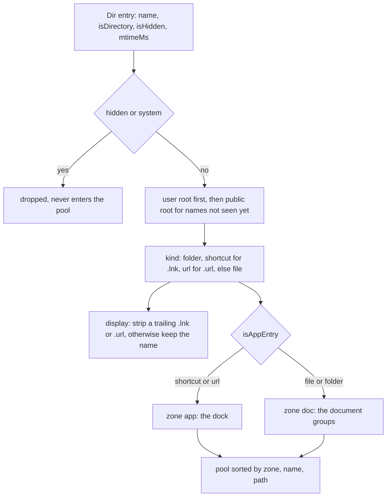
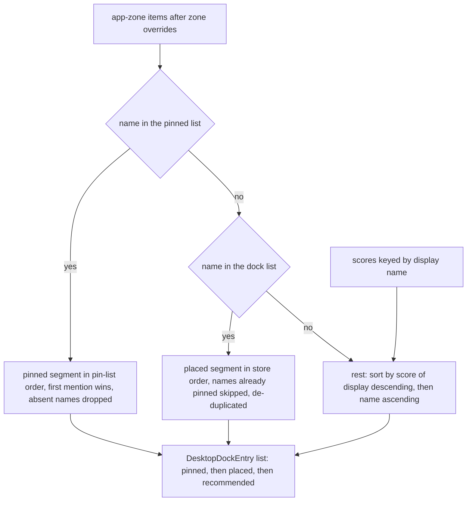

# Desktop zone planning: the pure item pool, dock order and document columns

The panel draws the desktop itself: it hides the native icons and renders its own two zones — a **dock** built from app-zone items and a **document zone** of grouped columns. Deciding *what goes where in what order* is the pure core documented here.

<!-- openwiki: broken internal link [/repo://README.md#L9] file "/repo://README.md" does not exist. Fix the href or restore the target, then delete this comment. -->
<!-- openwiki: broken internal link [/repo://app/src/main/desktop/plan.ts#L1-L6] file "/repo://app/src/main/desktop/plan.ts" does not exist. Fix the href or restore the target, then delete this comment. -->
> **Retirement pointer.** Earlier revisions of this page documented a Python planner (`zones_plan.py`, `zones_geometry.py`, `desktop_icons.py`, `zones_orchestrate.py`, `pinned.json`) that computed real screen coordinates and wrote them into explorer's `SysListView32` with `LVM_SETITEMPOSITION`, on a measured icon lattice with an `AVOID_X` right-column reservation and an overflow rule that refused a cell past it. That whole chain is retired — the README records the end of the Wallpaper Engine era and the retirement of the zones Win32 link ([README.md](/repo://README.md#L9)) — and with it the coordinate model: **there are no screen pixels, no lattice congruence and no placement refusal anywhere in the current planner.** `plan.ts` says so in its header — the plan is a *semantic* position: an ordered dock entry with a source, and a document entry's group plus its order inside that group ([plan.ts](/repo://app/src/main/desktop/plan.ts#L1-L6)). Nothing in `app/src` mentions the retired geometry or the Win32 position message any more.

Three pure modules own the whole decision, and none of them touches the filesystem, Win32, Electron or the registry:

| Module | Owns | Never does |
|---|---|---|
<!-- openwiki: broken internal link [/repo://app/src/main/desktop/scan.ts#L1-L13] file "/repo://app/src/main/desktop/scan.ts" does not exist. Fix the href or restore the target, then delete this comment. -->
| [scan.ts](/repo://app/src/main/desktop/scan.ts#L1-L13) | The item pool: merge two roots, drop hidden/system entries, de-duplicate by name, derive `kind`/`display`/`zone`, sort, and mint the FNV-1a fingerprints | Read a directory (the adapter hands it plain entries) |
<!-- openwiki: broken internal link [/repo://app/src/main/desktop/plan.ts#L1-L14] file "/repo://app/src/main/desktop/plan.ts" does not exist. Fix the href or restore the target, then delete this comment. -->
| [plan.ts](/repo://app/src/main/desktop/plan.ts#L1-L14) | Classification by zone, dock allocation as ordered names, document grouping, in-group order and column folding | Import anything but `node:path` and the shared contract types |
<!-- openwiki: broken internal link [/repo://app/src/main/desktop/layout-store.ts#L1-L5] file "/repo://app/src/main/desktop/layout-store.ts" does not exist. Fix the href or restore the target, then delete this comment. -->
| [layout-store.ts](/repo://app/src/main/desktop/layout-store.ts#L1-L5) | The persisted placement document: three ordered name lists plus the pure mutations on them | Validate names against a pool, know whether a file exists |

<!-- openwiki: broken internal link [/repo://app/src/main/desktop/plan.ts#L126-L137] file "/repo://app/src/main/desktop/plan.ts" does not exist. Fix the href or restore the target, then delete this comment. -->
Everything imperative — the 1 Hz recompute, directory reads, `fs.watch`, icon extraction, launch, the atomic store write — lives in [Desktop carry runtime](/openwiki/architecture/desktop-zones-execution.md), which owns `DesktopService` and the injected adapters. This page documents the seam: `planDesktop(items, pinned, placed, scores, opts)` ([plan.ts](/repo://app/src/main/desktop/plan.ts#L126-L137)).

<!-- openwiki: broken internal link [/repo://app/src/shared/contract.ts#L62-L110] file "/repo://app/src/shared/contract.ts" does not exist. Fix the href or restore the target, then delete this comment. -->
<!-- openwiki: broken internal link [/repo://app/src/main/desktop/plan.ts#L7-L14] file "/repo://app/src/main/desktop/plan.ts" does not exist. Fix the href or restore the target, then delete this comment. -->
The item shape and the plan shape are declared once in the shared contract and imported here rather than restated, precisely so the bridge contract, the service and the renderer cannot drift apart ([contract.ts](/repo://app/src/shared/contract.ts#L62-L110), [plan.ts](/repo://app/src/main/desktop/plan.ts#L7-L14)).

## The item pool: two roots, one list

<!-- openwiki: broken internal link [/repo://app/src/main/desktop/scan.ts#L7-L13] file "/repo://app/src/main/desktop/scan.ts" does not exist. Fix the href or restore the target, then delete this comment. -->
<!-- openwiki: broken internal link [/repo://app/src/main/desktop/scan.ts#L72-L90] file "/repo://app/src/main/desktop/scan.ts" does not exist. Fix the href or restore the target, then delete this comment. -->
`collectDesktopItems(roots, userEntries, commonEntries)` takes directory *entries* — `{name, isDirectory, isHidden, mtimeMs}`, produced by the adapter — and returns the pool ([scan.ts](/repo://app/src/main/desktop/scan.ts#L7-L13), [scan.ts](/repo://app/src/main/desktop/scan.ts#L72-L90)):

<!-- openwiki: broken internal link [/repo://app/src/main/desktop/adapter.ts#L12-L14] file "/repo://app/src/main/desktop/adapter.ts" does not exist. Fix the href or restore the target, then delete this comment. -->
<!-- openwiki: broken internal link [/repo://app/src/main/desktop/adapter.ts#L44-L46] file "/repo://app/src/main/desktop/adapter.ts" does not exist. Fix the href or restore the target, then delete this comment. -->
1. **Hidden and system entries never enter the pool.** An entry flagged `isHidden` is skipped, which is how `desktop.ini` and friends disappear. The flag is computed in the adapter as `FILE_ATTRIBUTE_HIDDEN | FILE_ATTRIBUTE_SYSTEM` on the real path, and a failed attribute read is treated as *visible* rather than as a reason to drop the item ([adapter.ts](/repo://app/src/main/desktop/adapter.ts#L12-L14), [adapter.ts](/repo://app/src/main/desktop/adapter.ts#L44-L46)). Empty names are skipped too.
<!-- openwiki: broken internal link [/repo://app/src/main/desktop/scan.ts#L77-L86] file "/repo://app/src/main/desktop/scan.ts" does not exist. Fix the href or restore the target, then delete this comment. -->
<!-- openwiki: broken internal link [/repo://app/tests/desktop/scan.spec.ts#L23-L32] file "/repo://app/tests/desktop/scan.spec.ts" does not exist. Fix the href or restore the target, then delete this comment. -->
2. **The user desktop shadows the public desktop.** Entries are keyed by file name in a map; the user root is inserted first and a same-named public entry is then ignored, which mirrors the shell namespace where the user's desktop masks the public default item. The surviving item's `path` and `iconKey` point at the user copy ([scan.ts](/repo://app/src/main/desktop/scan.ts#L77-L86), [scan.spec.ts](/repo://app/tests/desktop/scan.spec.ts#L23-L32)).
<!-- openwiki: broken internal link [/repo://app/src/main/desktop/scan.ts#L30-L36] file "/repo://app/src/main/desktop/scan.ts" does not exist. Fix the href or restore the target, then delete this comment. -->
3. **Kind comes from the directory flag and the extension**, checked in that order: a directory is `folder`, a `.lnk` is `shortcut`, a `.url` is `url`, and anything else is `file`; the suffix test is case-insensitive ([scan.ts](/repo://app/src/main/desktop/scan.ts#L30-L36)).
<!-- openwiki: broken internal link [/repo://app/src/main/desktop/scan.ts#L48-L51] file "/repo://app/src/main/desktop/scan.ts" does not exist. Fix the href or restore the target, then delete this comment. -->
<!-- openwiki: broken internal link [/repo://app/tests/desktop/scan.spec.ts#L55-L66] file "/repo://app/tests/desktop/scan.spec.ts" does not exist. Fix the href or restore the target, then delete this comment. -->
4. **The display name hides the shortcut extension.** `displayOf` strips a trailing `.lnk`/`.url` (case-insensitively) and leaves every other name untouched, because Explorer never shows those two extensions regardless of the "hide known extensions" setting — so `site.Url` displays as `site` while `readme.txt` keeps its suffix ([scan.ts](/repo://app/src/main/desktop/scan.ts#L48-L51), [scan.spec.ts](/repo://app/tests/desktop/scan.spec.ts#L55-L66)).
<!-- openwiki: broken internal link [/repo://app/src/main/desktop/scan.ts#L20-L28] file "/repo://app/src/main/desktop/scan.ts" does not exist. Fix the href or restore the target, then delete this comment. -->
<!-- openwiki: broken internal link [/repo://app/tests/desktop/scan.spec.ts#L68-L71] file "/repo://app/tests/desktop/scan.spec.ts" does not exist. Fix the href or restore the target, then delete this comment. -->
5. **`iconKey` is `` `${path}|${mtimeMs}` ``.** The pool carries it so the icon cache is keyed by content-age as well as path — a rewritten `.lnk` gets a fresh key and a re-extraction — and `pathOfIconKey` reverses the format by splitting at the last `|`, which is safe because `|` is a reserved Windows filename character ([scan.ts](/repo://app/src/main/desktop/scan.ts#L20-L28), [scan.spec.ts](/repo://app/tests/desktop/scan.spec.ts#L68-L71)).
<!-- openwiki: broken internal link [/repo://app/src/main/desktop/scan.ts#L87-L89] file "/repo://app/src/main/desktop/scan.ts" does not exist. Fix the href or restore the target, then delete this comment. -->
6. **The output is sorted by `(zone, name, path)`.** Zone first puts dock items ahead of documents, and the name-first tiebreak makes the enumeration order irrelevant: the same directory contents always produce the same list ([scan.ts](/repo://app/src/main/desktop/scan.ts#L87-L89)).

Two consequences are load-bearing later. File `name` is unique in the pool (it is the de-duplication key), which is why the plan and the store can address items by name at all. The **display** name is *not* unique — `a.lnk` and `a.url` both display as `a` — and that is why the two keys are used for different purposes: placement lists and plan entries use `name`, while usage scores are keyed by `display`.



Pool construction: hidden/system filtering, user-desktop precedence, and the kind, display-name and zone derivation that the planner consumes.

### Classification, and where it is overridden

<!-- openwiki: broken internal link [/repo://app/src/main/desktop/scan.ts#L38-L46] file "/repo://app/src/main/desktop/scan.ts" does not exist. Fix the href or restore the target, then delete this comment. -->
<!-- openwiki: broken internal link [/repo://app/src/main/services/desktop.ts#L203-L210] file "/repo://app/src/main/services/desktop.ts" does not exist. Fix the href or restore the target, then delete this comment. -->
<!-- openwiki: broken internal link [/repo://app/src/main/desktop/plan.ts#L133-L136] file "/repo://app/src/main/desktop/plan.ts" does not exist. Fix the href or restore the target, then delete this comment. -->
<!-- openwiki: broken internal link [/repo://app/tests/desktop/plan.spec.ts#L193-L201] file "/repo://app/tests/desktop/plan.spec.ts" does not exist. Fix the href or restore the target, then delete this comment. -->
Classification itself is a one-line rule at this stage: `isAppEntry(kind)` decides `zone`, so `shortcut`/`url` are app items and `file`/`folder` are documents ([scan.ts](/repo://app/src/main/desktop/scan.ts#L38-L46)). `zoneOf` is explicitly labelled the baseline before the full arrangement, because the *user's* drag decision outranks it: before planning, the service rewrites `zone` for every name listed in the layout store — names in `dock` become `app`, names in `docs` become `doc` ([services/desktop.ts](/repo://app/src/main/services/desktop.ts#L203-L210)). `planDesktop` then simply filters by the resulting `zone`, so a cross-zone drag changes which segment an item competes in rather than being treated as a separate overlay ([plan.ts](/repo://app/src/main/desktop/plan.ts#L133-L136), [plan.spec.ts](/repo://app/tests/desktop/plan.spec.ts#L193-L201)).

The planner therefore never classifies by itself; it trusts `item.zone` and only decides *order within* the two zones. Note what is absent compared with the retired model: there is no `recycle` cell, no `untouched` zone, no system-kind test and no UI-language-dependent recycle-bin name set. Hidden and system entries are already excluded at pool level, and the panel simply does not carry a recycle bin.

## The plan contract

<!-- openwiki: broken internal link [/repo://app/src/shared/contract.ts#L85-L110] file "/repo://app/src/shared/contract.ts" does not exist. Fix the href or restore the target, then delete this comment. -->
`planDesktop` returns a `DesktopPlan` with two arrays ([contract.ts](/repo://app/src/shared/contract.ts#L85-L110)):

| Field | Meaning |
|---|---|
| `dock: DesktopDockEntry[]` | Ordered dock items, each `{name, source}` with `source ∈ {pinned, placed, recommended}` |
| `docs: DesktopDocEntry[]` | Document items, each `{name, group, rank, col, row}` |

<!-- openwiki: broken internal link [/repo://app/src/renderer/main.ts#L296-L333] file "/repo://app/src/renderer/main.ts" does not exist. Fix the href or restore the target, then delete this comment. -->
There is no cross-array ordering to preserve and no `pos`/`slot` field that could be empty: the `dock` array *is* the slot order, every app-zone item the plan receives gets a dock entry, and every document item gets a `docs` entry. The renderer can therefore render the dock by iterating `dock` and the document zone by filtering `docs` per group in `rank` order ([renderer main.ts](/repo://app/src/renderer/main.ts#L296-L333)).

<!-- openwiki: broken internal link [/repo://app/src/main/desktop/layout-store.ts#L1-L6] file "/repo://app/src/main/desktop/layout-store.ts" does not exist. Fix the href or restore the target, then delete this comment. -->
<!-- openwiki: broken internal link [/repo://app/src/main/services/desktop.ts#L112-L124] file "/repo://app/src/main/services/desktop.ts" does not exist. Fix the href or restore the target, then delete this comment. -->
The plan is *derived state only*: it is recomputed on every scan round and never persisted. What is persisted is the input to it — the ordered name lists — which is what makes "dropped here" durable across restarts without storing a single coordinate ([layout-store.ts](/repo://app/src/main/desktop/layout-store.ts#L1-L6), [services/desktop.ts](/repo://app/src/main/services/desktop.ts#L112-L124)).

## The dock: pinned, placed, recommended

<!-- openwiki: broken internal link [/repo://app/src/main/desktop/plan.ts#L92-L120] file "/repo://app/src/main/desktop/plan.ts" does not exist. Fix the href or restore the target, then delete this comment. -->
Dock order is built by **concatenating three segments**, not by one composite sort key ([plan.ts](/repo://app/src/main/desktop/plan.ts#L92-L120)):

1. **`pinned`** — the hand-pin list, filtered to names that are actually present in the (app-zone) pool, de-duplicated with first mention winning, and kept in pin-list order. The pin list order *is* the leading dock order.
2. **`placed`** — names the user dragged into position, filtered the same way, minus everything already pinned, de-duplicated, and kept in store order. This segment sits after the pins and before everything else.
3. **`rest`** — every remaining app-zone item, sorted by `(-score(display), name)`: descending usage score, with `name.localeCompare` as the tiebreak.

<!-- openwiki: broken internal link [/repo://app/src/main/desktop/plan.ts#L109-L114] file "/repo://app/src/main/desktop/plan.ts" does not exist. Fix the href or restore the target, then delete this comment. -->
<!-- openwiki: broken internal link [/repo://app/tests/desktop/plan.spec.ts#L159-L167] file "/repo://app/tests/desktop/plan.spec.ts" does not exist. Fix the href or restore the target, then delete this comment. -->
The score lookup is `scores.get(item.display) ?? 0`, so a missing score is not a filter: an unscored shortcut still fills a dock position, at the end of the ranked group, in name order ([plan.ts](/repo://app/src/main/desktop/plan.ts#L109-L114), [plan.spec.ts](/repo://app/tests/desktop/plan.spec.ts#L159-L167)).



Dock allocation: the three segments and the filters applied to each, which is what makes "a recommendation never displaces a pin" structural rather than a sorting accident.

Because the segments are concatenated, the guarantees are structural:

<!-- openwiki: broken internal link [/repo://app/tests/desktop/plan.spec.ts#L138-L144] file "/repo://app/tests/desktop/plan.spec.ts" does not exist. Fix the href or restore the target, then delete this comment. -->
<!-- openwiki: broken internal link [/repo://app/tests/desktop/service.spec.ts#L176-L192] file "/repo://app/tests/desktop/service.spec.ts" does not exist. Fix the href or restore the target, then delete this comment. -->
- **A pin is never displaced by a recommendation.** The test pins this with a pinned item scoring `0.1` ordered ahead of an unpinned item scoring `99`, and with the pinned item keeping `source: 'pinned'` ([plan.spec.ts](/repo://app/tests/desktop/plan.spec.ts#L138-L144), [service.spec.ts](/repo://app/tests/desktop/service.spec.ts#L176-L192)).
<!-- openwiki: broken internal link [/repo://app/src/main/desktop/plan.ts#L98-L107] file "/repo://app/src/main/desktop/plan.ts" does not exist. Fix the href or restore the target, then delete this comment. -->
<!-- openwiki: broken internal link [/repo://app/tests/desktop/plan.spec.ts#L186-L190] file "/repo://app/tests/desktop/plan.spec.ts" does not exist. Fix the href or restore the target, then delete this comment. -->
- **A stale or duplicated name cannot corrupt the order.** A pinned name that is not in the pool reserves nothing, and a name listed twice reserves one position ([plan.ts](/repo://app/src/main/desktop/plan.ts#L98-L107), [plan.spec.ts](/repo://app/tests/desktop/plan.spec.ts#L186-L190)).
<!-- openwiki: broken internal link [/repo://app/src/main/desktop/layout-store.ts#L59-L65] file "/repo://app/src/main/desktop/layout-store.ts" does not exist. Fix the href or restore the target, then delete this comment. -->
<!-- openwiki: broken internal link [/repo://app/tests/desktop/plan.spec.ts#L180-L184] file "/repo://app/tests/desktop/plan.spec.ts" does not exist. Fix the href or restore the target, then delete this comment. -->
<!-- openwiki: broken internal link [/repo://app/src/main/services/desktop.ts#L159-L167] file "/repo://app/src/main/services/desktop.ts" does not exist. Fix the href or restore the target, then delete this comment. -->
- **A pin keeps its identity across drags.** `moveItem` never touches the `pinned` list, so a pinned item that the user reorders is still produced by the pinned segment; dragging it *out* of the app zone is a deliberate zone change, and while it sits in the document zone the pin has no effect because it is no longer in the app-zone item set ([layout-store.ts](/repo://app/src/main/desktop/layout-store.ts#L59-L65), [plan.spec.ts](/repo://app/tests/desktop/plan.spec.ts#L180-L184), [services/desktop.ts](/repo://app/src/main/services/desktop.ts#L159-L167)).
- **A pin naming a document can never pull it into the dock.** `planDock` only ever sees app-zone items, so the pin has no candidate to match.

<!-- openwiki: broken internal link [/repo://app/src/main/desktop/plan.ts#L86-L91] file "/repo://app/src/main/desktop/plan.ts" does not exist. Fix the href or restore the target, then delete this comment. -->
<!-- openwiki: broken internal link [/repo://app/tests/desktop/plan.spec.ts#L138-L167] file "/repo://app/tests/desktop/plan.spec.ts" does not exist. Fix the href or restore the target, then delete this comment. -->
<!-- openwiki: broken internal link [/repo://app/src/renderer/index.html#L274-L290] file "/repo://app/src/renderer/index.html" does not exist. Fix the href or restore the target, then delete this comment. -->
<!-- openwiki: broken internal link [/repo://app/src/renderer/main.ts#L283-L294] file "/repo://app/src/renderer/main.ts" does not exist. Fix the href or restore the target, then delete this comment. -->
<!-- openwiki: broken internal link [/repo://app/src/renderer/main.ts#L300-L313] file "/repo://app/src/renderer/main.ts" does not exist. Fix the href or restore the target, then delete this comment. -->
<!-- openwiki: broken internal link [/repo://CONTEXT.md#L43-L45] file "/repo://CONTEXT.md" does not exist. Fix the href or restore the target, then delete this comment. -->
**There is no dock capacity limit.** `planDock` has no slot count and emits one entry per app-zone item, and a long dock is absorbed visually instead — the renderer is a `flex-wrap` strip bounded by `layout.dockMaxWidth`, so it grows to a second and third row rather than truncating ([plan.ts](/repo://app/src/main/desktop/plan.ts#L86-L91), [plan.spec.ts](/repo://app/tests/desktop/plan.spec.ts#L138-L167), [index.html](/repo://app/src/renderer/index.html#L274-L290), [main.ts](/repo://app/src/renderer/main.ts#L283-L294)). The renderer additionally appends any app-zone item the plan did not name, as a belt-and-braces "carry every item" fallback; that branch is unreachable as long as `planDock` remains exhaustive ([main.ts](/repo://app/src/renderer/main.ts#L300-L313)). The glossary's 栏位 (slot) entry still describes a capped slot count ([CONTEXT.md](/repo://CONTEXT.md#L43-L45)); neither the contract nor the planner carries such a limit, so read that clause as historical.

## The document zone: six fixed groups

<!-- openwiki: broken internal link [/repo://app/src/main/desktop/plan.ts#L25-L34] file "/repo://app/src/main/desktop/plan.ts" does not exist. Fix the href or restore the target, then delete this comment. -->
`docGroupOf(item)` is a total, order-independent mapping into six group names ([plan.ts](/repo://app/src/main/desktop/plan.ts#L25-L34)):

| Group | Rule |
|---|---|
| `folders` | `item.kind === 'folder'` — tested first, so a directory is never typed by its name |
| `office` | `path.extname(name)` lowercased is in `{.doc .docx .xls .xlsx .ppt .pptx .odt .ods .odp .rtf .csv}` |
| `pdf` | suffix `.pdf` |
| `image` | suffix in `{.png .jpg .jpeg .gif .bmp .webp .svg .ico .tif .tiff}` |
| `archive` | suffix in `{.zip .rar .7z .tar .gz .bz2 .xz}` |
| `other` | every other suffix, including none — the only fallback, and the last test |

<!-- openwiki: broken internal link [/repo://app/src/main/desktop/plan.ts#L16-L23] file "/repo://app/src/main/desktop/plan.ts" does not exist. Fix the href or restore the target, then delete this comment. -->
<!-- openwiki: broken internal link [/repo://app/tests/desktop/plan.spec.ts#L62-L71] file "/repo://app/tests/desktop/plan.spec.ts" does not exist. Fix the href or restore the target, then delete this comment. -->
<!-- openwiki: broken internal link [/repo://app/tests/desktop/plan.spec.ts#L203-L207] file "/repo://app/tests/desktop/plan.spec.ts" does not exist. Fix the href or restore the target, then delete this comment. -->
Groups are emitted in the constant `GROUP_ORDER = ('folders', 'office', 'pdf', 'image', 'archive', 'other')` **regardless of group size**, which the comment records as the prerequisite for a zone that can be used from muscle memory: a type always sits in the same relative column ([plan.ts](/repo://app/src/main/desktop/plan.ts#L16-L23), [plan.spec.ts](/repo://app/tests/desktop/plan.spec.ts#L62-L71), [plan.spec.ts](/repo://app/tests/desktop/plan.spec.ts#L203-L207)). The test that pins it deliberately puts five archive members against one PDF, so a later "optimisation" that ordered groups by count would fail.

### Order inside a group: explicit first, then newest on top

<!-- openwiki: broken internal link [/repo://app/src/main/desktop/plan.ts#L63-L79] file "/repo://app/src/main/desktop/plan.ts" does not exist. Fix the href or restore the target, then delete this comment. -->
Each group's member list is assembled in two parts ([plan.ts](/repo://app/src/main/desktop/plan.ts#L63-L79)):

<!-- openwiki: broken internal link [/repo://app/tests/desktop/plan.spec.ts#L119-L127] file "/repo://app/tests/desktop/plan.spec.ts" does not exist. Fix the href or restore the target, then delete this comment. -->
1. **Explicitly placed members**, in the order their names appear in the store's `docs` list, and only those that really belong to this group. They lead the group; the relative order the user dragged them into is preserved even though their `mtime` would place them elsewhere ([plan.spec.ts](/repo://app/tests/desktop/plan.spec.ts#L119-L127)).
<!-- openwiki: broken internal link [/repo://app/src/main/desktop/plan.ts#L74-L77] file "/repo://app/src/main/desktop/plan.ts" does not exist. Fix the href or restore the target, then delete this comment. -->
<!-- openwiki: broken internal link [/repo://app/tests/desktop/plan.spec.ts#L79-L86] file "/repo://app/tests/desktop/plan.spec.ts" does not exist. Fix the href or restore the target, then delete this comment. -->
<!-- openwiki: broken internal link [/repo://app/tests/desktop/plan.spec.ts#L209-L215] file "/repo://app/tests/desktop/plan.spec.ts" does not exist. Fix the href or restore the target, then delete this comment. -->
2. **Everything else**, sorted by `b.mtimeMs - a.mtimeMs` with `name.localeCompare` as the tiebreak — newest on top, name-ascending for equal timestamps, so the same input always produces the same plan ([plan.ts](/repo://app/src/main/desktop/plan.ts#L74-L77), [plan.spec.ts](/repo://app/tests/desktop/plan.spec.ts#L79-L86), [plan.spec.ts](/repo://app/tests/desktop/plan.spec.ts#L209-L215)).

<!-- openwiki: broken internal link [/repo://app/src/shared/contract.ts#L80-L82] file "/repo://app/src/shared/contract.ts" does not exist. Fix the href or restore the target, then delete this comment. -->
<!-- openwiki: broken internal link [/repo://app/tests/desktop/plan.spec.ts#L209-L215] file "/repo://app/tests/desktop/plan.spec.ts" does not exist. Fix the href or restore the target, then delete this comment. -->
`mtimeMs` (epoch ms, from `stat`) is the whole recency input; the product test uses a real `Date.now()` to catch a unit drift into seconds ([contract.ts](/repo://app/src/shared/contract.ts#L80-L82), [plan.spec.ts](/repo://app/tests/desktop/plan.spec.ts#L209-L215)).

### Column arithmetic

<!-- openwiki: broken internal link [/repo://app/src/main/desktop/plan.ts#L66-L82] file "/repo://app/src/main/desktop/plan.ts" does not exist. Fix the href or restore the target, then delete this comment. -->
The document zone is laid out by walking `GROUP_ORDER` with a single global column cursor ([plan.ts](/repo://app/src/main/desktop/plan.ts#L66-L82)):

```text
for each group in GROUP_ORDER:
    if the group is empty:  skip it entirely, the cursor does not move
    width  = ceil(count / docMaxRows)          # columnsUsed
    entry k:  col = cursor + floor(k / docMaxRows)
              row = k % docMaxRows
    cursor = cursor + width + 1                # +1 is the spacer column between groups
```

Four properties follow, and the renderer's visual layout depends on all of them:

<!-- openwiki: broken internal link [/repo://app/tests/desktop/plan.spec.ts#L73-L77] file "/repo://app/tests/desktop/plan.spec.ts" does not exist. Fix the href or restore the target, then delete this comment. -->
- **The first non-empty group always starts at column 0.** An empty group consumes no column, which is why office-then-pdf places PDF at column 2 rather than leaving a gap where `folders` would have been ([plan.spec.ts](/repo://app/tests/desktop/plan.spec.ts#L73-L77)).
<!-- openwiki: broken internal link [/repo://app/src/main/desktop/plan.ts#L50-L52] file "/repo://app/src/main/desktop/plan.ts" does not exist. Fix the href or restore the target, then delete this comment. -->
<!-- openwiki: broken internal link [/repo://app/src/main/desktop/plan.ts#L78-L81] file "/repo://app/src/main/desktop/plan.ts" does not exist. Fix the href or restore the target, then delete this comment. -->
<!-- openwiki: broken internal link [/repo://app/tests/desktop/plan.spec.ts#L88-L103] file "/repo://app/tests/desktop/plan.spec.ts" does not exist. Fix the href or restore the target, then delete this comment. -->
- **A group occupies contiguous columns.** `ceil(count / docMaxRows)` of them, with no gaps inside the group; the ninth item folds into the column immediately to the right of the first eight (`rank 8` → `col 1, row 0`) instead of running downwards ([plan.ts](/repo://app/src/main/desktop/plan.ts#L50-L52), [plan.ts](/repo://app/src/main/desktop/plan.ts#L78-L81), [plan.spec.ts](/repo://app/tests/desktop/plan.spec.ts#L88-L103)).
<!-- openwiki: broken internal link [/repo://app/tests/desktop/plan.spec.ts#L97-L103] file "/repo://app/tests/desktop/plan.spec.ts" does not exist. Fix the href or restore the target, then delete this comment. -->
- **Groups are separated by exactly one spacer column**, and groups never interleave: office with 9 members occupies columns 0–1 and the next non-empty group starts at column 3 ([plan.spec.ts](/repo://app/tests/desktop/plan.spec.ts#L97-L103)).
- **`col` is zone-global, not group-local.** It is the coordinate the renderer would get if the whole document zone were one grid; the renderer instead builds one grid per group and lets CSS reproduce the same fold, so a group's local column equals `col` minus that group's start column.

<!-- openwiki: broken internal link [/repo://app/src/renderer/index.html#L254-L272] file "/repo://app/src/renderer/index.html" does not exist. Fix the href or restore the target, then delete this comment. -->
<!-- openwiki: broken internal link [/repo://app/src/renderer/main.ts#L314-L333] file "/repo://app/src/renderer/main.ts" does not exist. Fix the href or restore the target, then delete this comment. -->
<!-- openwiki: broken internal link [/repo://app/src/main/index.ts#L85-L104] file "/repo://app/src/main/index.ts" does not exist. Fix the href or restore the target, then delete this comment. -->
<!-- openwiki: broken internal link [/repo://app/src/main/config.ts#L145-L148] file "/repo://app/src/main/config.ts" does not exist. Fix the href or restore the target, then delete this comment. -->
The renderer reproduces the fold with `grid-auto-flow: column` plus `grid-template-rows: repeat(<layout.docMaxRows>, auto)` on each group grid, filling items in `rank` order ([index.html](/repo://app/src/renderer/index.html#L254-L272), [main.ts](/repo://app/src/renderer/main.ts#L314-L333)). That makes `docMaxRows` a value with **two synchronized copies**: the plan option handed to `planDesktop` and the `layout.docMaxRows` handed to CSS. Both come from the single `config.desktop` field — one object literal feeds the data-plane init and the snapshot's `layout` in the same call — and a change that moved only one of them would desync the plan's `col`/`row` from the rendered grid ([index.ts](/repo://app/src/main/index.ts#L85-L104), [config.ts](/repo://app/src/main/config.ts#L145-L148)).

### What happens to an overfull document zone

<!-- openwiki: broken internal link [/repo://app/src/renderer/index.html#L238-L254] file "/repo://app/src/renderer/index.html" does not exist. Fix the href or restore the target, then delete this comment. -->
<!-- openwiki: broken internal link [/repo://app/src/renderer/main.ts#L283-L294] file "/repo://app/src/renderer/main.ts" does not exist. Fix the href or restore the target, then delete this comment. -->
Nothing is refused and nothing is dropped. The plan emits an entry for every document item; the document container is what clips, via the config-driven `docZone.maxWidth` on `#doc-zone` and `overflow: hidden` on `#doc-groups`, with the CSS comment stating the intent explicitly: items past the visible cap are still in the item pool, so this is a *visible* limit, not a carrying limit ([index.html](/repo://app/src/renderer/index.html#L238-L254), [main.ts](/repo://app/src/renderer/main.ts#L283-L294)). This replaces the retired model's `AVOID_X` refusal, where an item whose cell crossed the reserved right column was emitted unplaced.

<!-- openwiki: broken internal link [/repo://app/src/shared/contract.ts#L119-L127] file "/repo://app/src/shared/contract.ts" does not exist. Fix the href or restore the target, then delete this comment. -->
<!-- openwiki: broken internal link [/repo://app/src/main/config.ts#L147] file "/repo://app/src/main/config.ts" does not exist. Fix the href or restore the target, then delete this comment. -->
<!-- openwiki: broken internal link [/repo://app/tests/config.spec.ts#L78-L85] file "/repo://app/tests/config.spec.ts" does not exist. Fix the href or restore the target, then delete this comment. -->
<!-- openwiki: broken internal link [/repo://app/src/main/desktop/plan.ts#L45-L48] file "/repo://app/src/main/desktop/plan.ts" does not exist. Fix the href or restore the target, then delete this comment. -->
<!-- openwiki: broken internal link [/repo://app/src/main/services/desktop.ts#L42-L43] file "/repo://app/src/main/services/desktop.ts" does not exist. Fix the href or restore the target, then delete this comment. -->
<!-- openwiki: broken internal link [/repo://app/src/main/services/desktop.ts#L66-L70] file "/repo://app/src/main/services/desktop.ts" does not exist. Fix the href or restore the target, then delete this comment. -->
Geometry is otherwise entirely a renderer/config concern now: `docZone {left, top, maxWidth}`, `docMaxRows` and `dockMaxWidth` are declared in the contract, defaulted and validated in config, shipped in the panel snapshot, and applied as CSS ([contract.ts](/repo://app/src/shared/contract.ts#L119-L127), [config.ts](/repo://app/src/main/config.ts#L147), [config.spec.ts](/repo://app/tests/config.spec.ts#L78-L85)). The only numeric input the *planner* takes is `docMaxRows`, and the service passes it with a default of 8 ([plan.ts](/repo://app/src/main/desktop/plan.ts#L45-L48), [services/desktop.ts](/repo://app/src/main/services/desktop.ts#L42-L43), [services/desktop.ts](/repo://app/src/main/services/desktop.ts#L66-L70)).

## The layout store: order instead of coordinates

<!-- openwiki: broken internal link [/repo://app/src/main/desktop/layout-store.ts#L7-L17] file "/repo://app/src/main/desktop/layout-store.ts" does not exist. Fix the href or restore the target, then delete this comment. -->
The store is a small JSON document under the Electron `userData` directory (`layout.json`) holding three ordered string lists ([layout-store.ts](/repo://app/src/main/desktop/layout-store.ts#L7-L17)):

| Field | Meaning |
|---|---|
| `pinned` | Hand-pinned names; its order is the leading dock order |
| `dock` | Explicit app-zone placements, in order (zone `app` is implied) |
| `docs` | Explicit document-zone placements, in order (zone `doc` is implied) |

<!-- openwiki: broken internal link [/repo://app/src/main/desktop/layout-store.ts#L7-L15] file "/repo://app/src/main/desktop/layout-store.ts" does not exist. Fix the href or restore the target, then delete this comment. -->
<!-- openwiki: broken internal link [/repo://app/src/main/desktop/plan.ts#L98-L112] file "/repo://app/src/main/desktop/plan.ts" does not exist. Fix the href or restore the target, then delete this comment. -->
<!-- openwiki: broken internal link [/repo://app/tests/desktop/plan.spec.ts#L186-L190] file "/repo://app/tests/desktop/plan.spec.ts" does not exist. Fix the href or restore the target, then delete this comment. -->
All three lists are matched against the item's file `name` (`item.name`), not against `item.display`: the dock and the document zone address items the same way the pool keys them, while usage scores are the one display-name-keyed input ([layout-store.ts](/repo://app/src/main/desktop/layout-store.ts#L7-L15), [plan.ts](/repo://app/src/main/desktop/plan.ts#L98-L112), [plan.spec.ts](/repo://app/tests/desktop/plan.spec.ts#L186-L190)).

`FACTORY_STORE` is `{version: 1, pinned: [], dock: [], docs: []}` — the factory arrangement is "no explicit placement at all", so a fresh install is pure classification plus frequency recommendation.

Two robustness rules make the store safe to hand-edit:

<!-- openwiki: broken internal link [/repo://app/src/main/desktop/layout-store.ts#L19-L38] file "/repo://app/src/main/desktop/layout-store.ts" does not exist. Fix the href or restore the target, then delete this comment. -->
<!-- openwiki: broken internal link [/repo://app/tests/desktop/layout-store.spec.ts#L7-L23] file "/repo://app/tests/desktop/layout-store.spec.ts" does not exist. Fix the href or restore the target, then delete this comment. -->
- **`loadStore` is total.** `null` (missing file), malformed JSON, a non-object root or a wrong-typed field all degrade to the factory state instead of throwing; a `pinned: 'x'` string and a `dock: [1, 2]` array of numbers both resolve to empty lists while the valid `docs` list survives ([layout-store.ts](/repo://app/src/main/desktop/layout-store.ts#L19-L38), [layout-store.spec.ts](/repo://app/tests/desktop/layout-store.spec.ts#L7-L23)).
<!-- openwiki: broken internal link [/repo://app/src/main/desktop/layout-store.ts#L48-L53] file "/repo://app/src/main/desktop/layout-store.ts" does not exist. Fix the href or restore the target, then delete this comment. -->
<!-- openwiki: broken internal link [/repo://app/tests/desktop/plan.spec.ts#L129-L132] file "/repo://app/tests/desktop/plan.spec.ts" does not exist. Fix the href or restore the target, then delete this comment. -->
- **Stale names are preserved verbatim.** A name whose file is gone stays in the list and is simply filtered out when the plan is built, so a deleted-and-restored file comes back to its recorded position. Nothing in `layout-store.ts` validates a name against a pool — that check belongs to the service's `move` ([layout-store.ts](/repo://app/src/main/desktop/layout-store.ts#L48-L53), [plan.spec.ts](/repo://app/tests/desktop/plan.spec.ts#L129-L132)).

<!-- openwiki: broken internal link [/repo://app/src/main/desktop/layout-store.ts#L53-L71] file "/repo://app/src/main/desktop/layout-store.ts" does not exist. Fix the href or restore the target, then delete this comment. -->
<!-- openwiki: broken internal link [/repo://app/tests/desktop/layout-store.spec.ts#L28-L59] file "/repo://app/tests/desktop/layout-store.spec.ts" does not exist. Fix the href or restore the target, then delete this comment. -->
<!-- openwiki: broken internal link [/repo://app/src/main/desktop/layout-store.ts#L73-L76] file "/repo://app/src/main/desktop/layout-store.ts" does not exist. Fix the href or restore the target, then delete this comment. -->
<!-- openwiki: broken internal link [/repo://app/tests/desktop/layout-store.spec.ts#L62-L69] file "/repo://app/tests/desktop/layout-store.spec.ts" does not exist. Fix the href or restore the target, then delete this comment. -->
`moveItem(store, name, zone, beforeName)` is the one placement mutation, and it reduces a drop to an order edit: remove the name from **both** lists, then insert it before `beforeName` (append when `null`, and appended defensively when the anchor is not in the target list). The `pinned` list is copied through untouched, so a pin is an identity rather than a position ([layout-store.ts](/repo://app/src/main/desktop/layout-store.ts#L53-L71), [layout-store.spec.ts](/repo://app/tests/desktop/layout-store.spec.ts#L28-L59)). `resetFactory` clears `dock` and `docs`, keeps `pinned`, and is idempotent on the factory state ([layout-store.ts](/repo://app/src/main/desktop/layout-store.ts#L73-L76), [layout-store.spec.ts](/repo://app/tests/desktop/layout-store.spec.ts#L62-L69)).

<!-- openwiki: broken internal link [/repo://app/src/main/desktop/layout-store.ts#L40-L46] file "/repo://app/src/main/desktop/layout-store.ts" does not exist. Fix the href or restore the target, then delete this comment. -->
<!-- openwiki: broken internal link [/repo://app/tests/desktop/layout-store.spec.ts#L18-L22] file "/repo://app/tests/desktop/layout-store.spec.ts" does not exist. Fix the href or restore the target, then delete this comment. -->
<!-- openwiki: broken internal link [/repo://app/src/main/desktop/adapter.ts#L112-L126] file "/repo://app/src/main/desktop/adapter.ts" does not exist. Fix the href or restore the target, then delete this comment. -->
<!-- openwiki: broken internal link [/repo://app/src/main/services/desktop.ts#L194-L200] file "/repo://app/src/main/services/desktop.ts" does not exist. Fix the href or restore the target, then delete this comment. -->
Serialization is `JSON.stringify(store, null, 1)` plus a trailing newline — pretty enough to hand-edit, canonical enough that a round trip is lossless ([layout-store.ts](/repo://app/src/main/desktop/layout-store.ts#L40-L46), [layout-store.spec.ts](/repo://app/tests/desktop/layout-store.spec.ts#L18-L22)). The service writes it through an atomic temp-file-plus-rename adapter and treats a failed write as a warning, because the in-memory arrangement is already live ([adapter.ts](/repo://app/src/main/desktop/adapter.ts#L112-L126), [services/desktop.ts](/repo://app/src/main/services/desktop.ts#L194-L200)).

One asymmetry between the two placement lists is worth knowing before hand-editing a store: the dock de-duplicates its inputs, but `planDocs` resolves each `docs` entry by name lookup, so a name listed twice there would be emitted twice. Only `moveItem` writes the file in practice, and it filters before inserting, so duplicates require a manual edit.

## Fingerprints: what makes the renderer re-render

<!-- openwiki: broken internal link [/repo://app/src/main/desktop/scan.ts#L92-L117] file "/repo://app/src/main/desktop/scan.ts" does not exist. Fix the href or restore the target, then delete this comment. -->
Both fingerprints live in `scan.ts` and are 8-character hex FNV-1a-32 hashes over tab-joined fields ([scan.ts](/repo://app/src/main/desktop/scan.ts#L92-L117)):

| Fingerprint | Hashes | Flips when |
|---|---|---|
<!-- openwiki: broken internal link [/repo://app/tests/desktop/scan.spec.ts#L74-L95] file "/repo://app/tests/desktop/scan.spec.ts" does not exist. Fix the href or restore the target, then delete this comment. -->
| `desktopFingerprint(items)` | `name`, `kind`, `zone`, `path`, `iconKey` per item | An item is added, removed or renamed, a kind or zone changes (a cross-zone drag), or the mtime inside `iconKey` changes ([scan.spec.ts](/repo://app/tests/desktop/scan.spec.ts#L74-L95)) |
<!-- openwiki: broken internal link [/repo://app/src/main/desktop/scan.ts#L111-L117] file "/repo://app/src/main/desktop/scan.ts" does not exist. Fix the href or restore the target, then delete this comment. -->
| `planFingerprint(plan)` | `name`+`source` per dock entry, then `||`, then `name`, `group`, `col`, `row` per document entry | Dock order or a source flips, or a document item changes group or cell ([scan.ts](/repo://app/src/main/desktop/scan.ts#L111-L117)) |

<!-- openwiki: broken internal link [/repo://app/src/main/services/desktop.ts#L101] file "/repo://app/src/main/services/desktop.ts" does not exist. Fix the href or restore the target, then delete this comment. -->
<!-- openwiki: broken internal link [/repo://app/src/renderer/main.ts#L296-L299] file "/repo://app/src/renderer/main.ts" does not exist. Fix the href or restore the target, then delete this comment. -->
The service concatenates them as `` `${desktopFingerprint(items)}-${planFingerprint(plan)}` `` into `DesktopState.fingerprint`, and the renderer returns early from `renderDesktop` while that string is unchanged ([services/desktop.ts](/repo://app/src/main/services/desktop.ts#L101), [main.ts](/repo://app/src/renderer/main.ts#L296-L299)).

<!-- openwiki: broken internal link [/repo://app/tests/desktop/scan.spec.ts#L77-L80] file "/repo://app/tests/desktop/scan.spec.ts" does not exist. Fix the href or restore the target, then delete this comment. -->
The split matters: an arrangement change that leaves zones alone (an in-zone reorder, a new high-frequency app, a new file that re-sorts a group) flips only the plan half, so the item half and therefore the icon cache keys stay untouched — nothing is re-extracted just because the dock was reordered. A cross-zone drag flips the item half as well, because `zone` is part of it. And because the pool is deterministically sorted, an unchanged set enumerated in a different directory order hashes identically ([scan.spec.ts](/repo://app/tests/desktop/scan.spec.ts#L77-L80)). `rank` is deliberately not hashed: it is already fully represented by `col`/`row`.

## How the plan is consumed

| Plan output | Consumer | Behaviour |
|---|---|---|
<!-- openwiki: broken internal link [/repo://app/src/renderer/main.ts#L300-L313] file "/repo://app/src/renderer/main.ts" does not exist. Fix the href or restore the target, then delete this comment. -->
<!-- openwiki: broken internal link [/repo://app/accept/battery.js#L1028-L1038] file "/repo://app/accept/battery.js" does not exist. Fix the href or restore the target, then delete this comment. -->
| `dock[i].name`, `.source` | Dock rendering | Items are appended in array order; `source` is not rendered but is captured in the acceptance evidence, which is how the pinned-first rule is verified on a real desktop ([main.ts](/repo://app/src/renderer/main.ts#L300-L313), [battery.js](/repo://app/accept/battery.js#L1028-L1038)) |
<!-- openwiki: broken internal link [/repo://app/src/renderer/main.ts#L314-L333] file "/repo://app/src/renderer/main.ts" does not exist. Fix the href or restore the target, then delete this comment. -->
| `docs[].group` | Document group block | One labelled flex block per non-empty group, always iterated in `GROUP_ORDER` ([main.ts](/repo://app/src/renderer/main.ts#L314-L333)) |
<!-- openwiki: broken internal link [/repo://app/src/renderer/main.ts#L327-L330] file "/repo://app/src/renderer/main.ts" does not exist. Fix the href or restore the target, then delete this comment. -->
| `docs[].rank` | In-group DOM order | Items are appended in `rank` order, which is what places them in the CSS grid ([main.ts](/repo://app/src/renderer/main.ts#L327-L330)) |
<!-- openwiki: broken internal link [/repo://app/src/renderer/main.ts#L338-L347] file "/repo://app/src/renderer/main.ts" does not exist. Fix the href or restore the target, then delete this comment. -->
| `docs[].col`, `.row` | Evidence and diffing | Reported in the `desktop-rendered` notification and hashed into the plan fingerprint; the visible columns come from the per-group grid ([main.ts](/repo://app/src/renderer/main.ts#L338-L347)) |
<!-- openwiki: broken internal link [/repo://app/src/renderer/main.ts#L181-L235] file "/repo://app/src/renderer/main.ts" does not exist. Fix the href or restore the target, then delete this comment. -->
<!-- openwiki: broken internal link [/repo://app/src/main/services/desktop.ts#L203-L210] file "/repo://app/src/main/services/desktop.ts" does not exist. Fix the href or restore the target, then delete this comment. -->
| `items[].zone` | Drag targeting | The drop path reads it to decide whether a move is a reorder or a zone change, and the service re-applies it as the override for the next round ([main.ts](/repo://app/src/renderer/main.ts#L181-L235), [services/desktop.ts](/repo://app/src/main/services/desktop.ts#L203-L210)) |
<!-- openwiki: broken internal link [/repo://app/src/shared/contract.ts#L112-L117] file "/repo://app/src/shared/contract.ts" does not exist. Fix the href or restore the target, then delete this comment. -->
<!-- openwiki: broken internal link [/repo://app/tests/contract.spec.ts#L136-L158] file "/repo://app/tests/contract.spec.ts" does not exist. Fix the href or restore the target, then delete this comment. -->
| the whole `DesktopState` | Bridge contract | Shipped in `PanelSnapshot.desktop` and checked by a kernel test that asserts a real `.lnk` lands in `dock` and a real `.docx` in `docs` as `office` ([contract.ts](/repo://app/src/shared/contract.ts#L112-L117), [contract.spec.ts](/repo://app/tests/contract.spec.ts#L136-L158)) |

## Invariants, failure semantics and extension points

What a change to this core must preserve:

<!-- openwiki: broken internal link [/repo://app/src/main/desktop/plan.ts#L7-L14] file "/repo://app/src/main/desktop/plan.ts" does not exist. Fix the href or restore the target, then delete this comment. -->
<!-- openwiki: broken internal link [/repo://app/src/main/desktop/scan.ts#L3-L4] file "/repo://app/src/main/desktop/scan.ts" does not exist. Fix the href or restore the target, then delete this comment. -->
<!-- openwiki: broken internal link [/repo://app/src/main/desktop/layout-store.ts#L5] file "/repo://app/src/main/desktop/layout-store.ts" does not exist. Fix the href or restore the target, then delete this comment. -->
- **Purity.** `scan.ts`, `plan.ts` and `layout-store.ts` import `node:path` and contract types only. The plan is recomputable from the pool plus the three name lists, which is what lets the service recompute it on every 1 Hz tick and on every `fs.watch` settle ([plan.ts](/repo://app/src/main/desktop/plan.ts#L7-L14), [scan.ts](/repo://app/src/main/desktop/scan.ts#L3-L4), [layout-store.ts](/repo://app/src/main/desktop/layout-store.ts#L5)).
- **No double placement by construction.** The three dock segments are disjoint: `pinned` wins, `placed` excludes pinned names, and the ranked remainder excludes both, so no item can appear twice in the dock. The document path is safe for the same reason only as long as the store's `docs` list holds distinct names (see the `docs` caveat above).
<!-- openwiki: broken internal link [/repo://app/src/main/services/desktop.ts#L203-L210] file "/repo://app/src/main/services/desktop.ts" does not exist. Fix the href or restore the target, then delete this comment. -->
<!-- openwiki: broken internal link [/repo://app/src/main/desktop/plan.ts#L122-L137] file "/repo://app/src/main/desktop/plan.ts" does not exist. Fix the href or restore the target, then delete this comment. -->
- **The zone override happens before the plan, never inside it.** `planDesktop` reads `item.zone` and does not classify. Moving classification back into the planner would bypass the drag override and break the cross-zone semantics ([services/desktop.ts](/repo://app/src/main/services/desktop.ts#L203-L210), [plan.ts](/repo://app/src/main/desktop/plan.ts#L122-L137)).
<!-- openwiki: broken internal link [/repo://app/tests/desktop/plan.spec.ts#L62-L77] file "/repo://app/tests/desktop/plan.spec.ts" does not exist. Fix the href or restore the target, then delete this comment. -->
- **The group order is fixed and empty groups vanish.** Both are asserted, because a column position that depends on group size would make the zone unusable without counting ([plan.spec.ts](/repo://app/tests/desktop/plan.spec.ts#L62-L77)).
<!-- openwiki: broken internal link [/repo://app/src/main/config.ts#L321-L325] file "/repo://app/src/main/config.ts" does not exist. Fix the href or restore the target, then delete this comment. -->
<!-- openwiki: broken internal link [/repo://app/tests/config.spec.ts#L105-L113] file "/repo://app/tests/config.spec.ts" does not exist. Fix the href or restore the target, then delete this comment. -->
- **`docMaxRows` is the only knob, and both copies must agree.** The service's option and `layout.docMaxRows` originate in one config field; `1..32` integers survive validation and anything else falls back to 8 with a warning ([config.ts](/repo://app/src/main/config.ts#L321-L325), [config.spec.ts](/repo://app/tests/config.spec.ts#L105-L113)).
- **Determinism.** Every ordering input is total and stable — `(zone, name, path)` for the pool, `(-score, name)` for the ranked dock segment, `(-mtime, name)` inside a group — so the same inputs always produce byte-identical plan output and an unchanged fingerprint.

<!-- openwiki: broken internal link [/repo://app/src/main/desktop/plan.ts#L98-L114] file "/repo://app/src/main/desktop/plan.ts" does not exist. Fix the href or restore the target, then delete this comment. -->
<!-- openwiki: broken internal link [/repo://app/tests/desktop/plan.spec.ts#L46-L48] file "/repo://app/tests/desktop/plan.spec.ts" does not exist. Fix the href or restore the target, then delete this comment. -->
<!-- openwiki: broken internal link [/repo://app/tests/desktop/plan.spec.ts#L114-L117] file "/repo://app/tests/desktop/plan.spec.ts" does not exist. Fix the href or restore the target, then delete this comment. -->
Failure semantics are "degrade, never throw". A missing score is `0`, a missing pinned name reserves nothing, an unknown extension is `other`, a corrupt store is the factory state, an item set enumerated in a different order hashes the same, an empty group consumes no column, and a desktop without documents yields `docs: []` ([plan.ts](/repo://app/src/main/desktop/plan.ts#L98-L114), [plan.spec.ts](/repo://app/tests/desktop/plan.spec.ts#L46-L48), [plan.spec.ts](/repo://app/tests/desktop/plan.spec.ts#L114-L117)). The one thing the core cannot fix is a container that clips: an overfull document zone loses its rightmost columns visually while the entries remain in the plan and in the pool.

Extension points, and the seams that are *not* safe to move:

<!-- openwiki: broken internal link [/repo://app/src/shared/contract.ts#L94-L95] file "/repo://app/src/shared/contract.ts" does not exist. Fix the href or restore the target, then delete this comment. -->
<!-- openwiki: broken internal link [/repo://app/src/main/desktop/plan.ts#L19-L23] file "/repo://app/src/main/desktop/plan.ts" does not exist. Fix the href or restore the target, then delete this comment. -->
- **A new document group** means a member on the `DesktopDocGroup` union in the contract, a slot in `GROUP_ORDER` and a suffix set — nothing else, since every group is rendered by the same grid loop ([contract.ts](/repo://app/src/shared/contract.ts#L94-L95), [plan.ts](/repo://app/src/main/desktop/plan.ts#L19-L23)).
- **A new file-type mapping** is a membership change in one of the three extension sets; a new *kind* is a `DesktopItemKind` member plus the `isAppEntry` branch that routes it, plus the adapter that recognises it.
<!-- openwiki: broken internal link [/repo://app/src/shared/contract.ts#L85-L92] file "/repo://app/src/shared/contract.ts" does not exist. Fix the href or restore the target, then delete this comment. -->
<!-- openwiki: broken internal link [/repo://app/accept/battery.js#L1028-L1038] file "/repo://app/accept/battery.js" does not exist. Fix the href or restore the target, then delete this comment. -->
- **A new dock source** is a `DesktopDockSource` member plus a segment in `planDock` — but note that the three sources are also an ordering contract that the acceptance battery asserts on, so the segments must stay concatenated rather than merged into one sort ([contract.ts](/repo://app/src/shared/contract.ts#L85-L92), [battery.js](/repo://app/accept/battery.js#L1028-L1038)).
- **Not safe to move:** the `name`-keyed store (a display-keyed one would merge `a.lnk` with `a.url`), the zone override's precedence over classification, the fixed group order, and the duplicated `docMaxRows` (if the planner and the renderer disagree, `col`/`row` silently stop describing what is on screen).

## Tests

The plan core is the largest offline surface of desktop carry. Every test drives the pure functions with synthetic records — a local `item()`/`entry()` factory — so no test in this group touches a real directory, Win32 or Electron.

| Suite | What it pins |
|---|---|
<!-- openwiki: broken internal link [/repo://app/tests/desktop/plan.spec.ts#L36-L49] file "/repo://app/tests/desktop/plan.spec.ts" does not exist. Fix the href or restore the target, then delete this comment. -->
| [plan.spec.ts](/repo://app/tests/desktop/plan.spec.ts#L36-L49) | `docGroupOf` for folders, every extension family with mixed case, and the `other` fallback |
<!-- openwiki: broken internal link [/repo://app/tests/desktop/plan.spec.ts#L51-L133] file "/repo://app/tests/desktop/plan.spec.ts" does not exist. Fix the href or restore the target, then delete this comment. -->
| [plan.spec.ts](/repo://app/tests/desktop/plan.spec.ts#L51-L133) | Document columns: one column per group, the spacer, fixed order against group size, folders first, empty groups consuming no column, newest-on-top with the name tiebreak, the 8-row fold, contiguous columns after a fold, configurable `docMaxRows`, explicit placement leading its group, stale names filtered, and zone override routing an item into the dock |
<!-- openwiki: broken internal link [/repo://app/tests/desktop/plan.spec.ts#L135-L207] file "/repo://app/tests/desktop/plan.spec.ts" does not exist. Fix the href or restore the target, then delete this comment. -->
| [plan.spec.ts](/repo://app/tests/desktop/plan.spec.ts#L135-L207) | Dock segments: pins first regardless of score, ranking by descending score, stable repeatable equal-score order, unscored shortcuts still filling positions, the placed segment between pins and recommendations, a dragged pin keeping `pinned`, absent and duplicated pin names, and the `GROUP_ORDER` contract |
<!-- openwiki: broken internal link [/repo://app/tests/desktop/scan.spec.ts#L12-L72] file "/repo://app/tests/desktop/scan.spec.ts" does not exist. Fix the href or restore the target, then delete this comment. -->
| [scan.spec.ts](/repo://app/tests/desktop/scan.spec.ts#L12-L72) | Merge and `(zone, name)` sort, user-desktop precedence with its path and `iconKey`, hidden entries dropped, kind and zone derivation, display-name rules, and `iconKey` round-tripping a path containing spaces |
<!-- openwiki: broken internal link [/repo://app/tests/desktop/scan.spec.ts#L74-L95] file "/repo://app/tests/desktop/scan.spec.ts" does not exist. Fix the href or restore the target, then delete this comment. -->
| [scan.spec.ts](/repo://app/tests/desktop/scan.spec.ts#L74-L95) | `desktopFingerprint` stability under enumeration order and its flip on add, remove, rename and mtime change |
<!-- openwiki: broken internal link [/repo://app/tests/desktop/layout-store.spec.ts#L7-L70] file "/repo://app/tests/desktop/layout-store.spec.ts" does not exist. Fix the href or restore the target, then delete this comment. -->
| [layout-store.spec.ts](/repo://app/tests/desktop/layout-store.spec.ts#L7-L70) | Factory on missing/corrupt/wrong-typed input, lossless round trip, in-zone insert, append, cross-zone move, defensive append for a foreign anchor, `pinned` untouched by drags, stale names kept, and factory reset keeping pins |
<!-- openwiki: broken internal link [/repo://app/tests/desktop/service.spec.ts#L155-L328] file "/repo://app/tests/desktop/service.spec.ts" does not exist. Fix the href or restore the target, then delete this comment. -->
| [service.spec.ts](/repo://app/tests/desktop/service.spec.ts#L155-L328) | The end-to-end round: factory arrangement from scores and mtimes, pins from an injected store, move → persist → re-plan → survive a rebuilt service, cross-zone move, the validation refusals, `resetFactory` semantics, corrupt-store self-healing, and the fingerprint flipping when only the arrangement changed |

## Related pages

- [Desktop carry runtime](/openwiki/architecture/desktop-zones-execution.md) — the service, adapters, icon cache, store write path and watcher that carry this plan to the screen.
- [Usage telemetry and recommendation](/openwiki/architecture/usage-telemetry-and-recommendation.md) — where the `scores` map comes from and why it is keyed by display name.
- [Domain model](/openwiki/concepts/domain-model.md) — 应用区, 文档区, 栏位, 手钉, 推荐位, 文档组, 归类 and the rest of the vocabulary this core implements.
- [Drag an item to a new layout position](/openwiki/workflows/desktop-item-drag-to-layout.md) — the operator-visible path from a pointer drag to a durable store edit and a re-plan.
