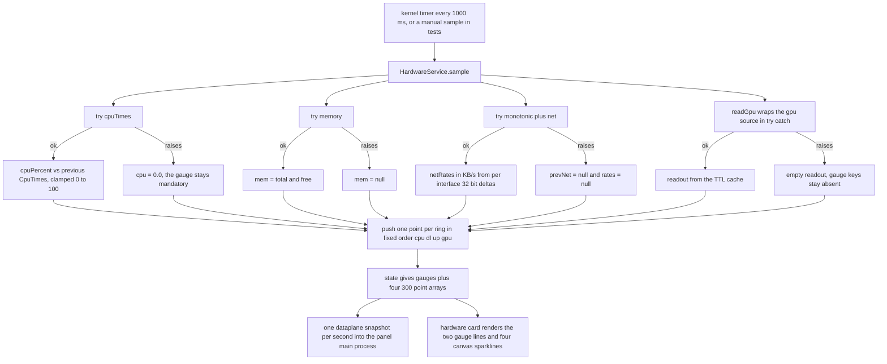
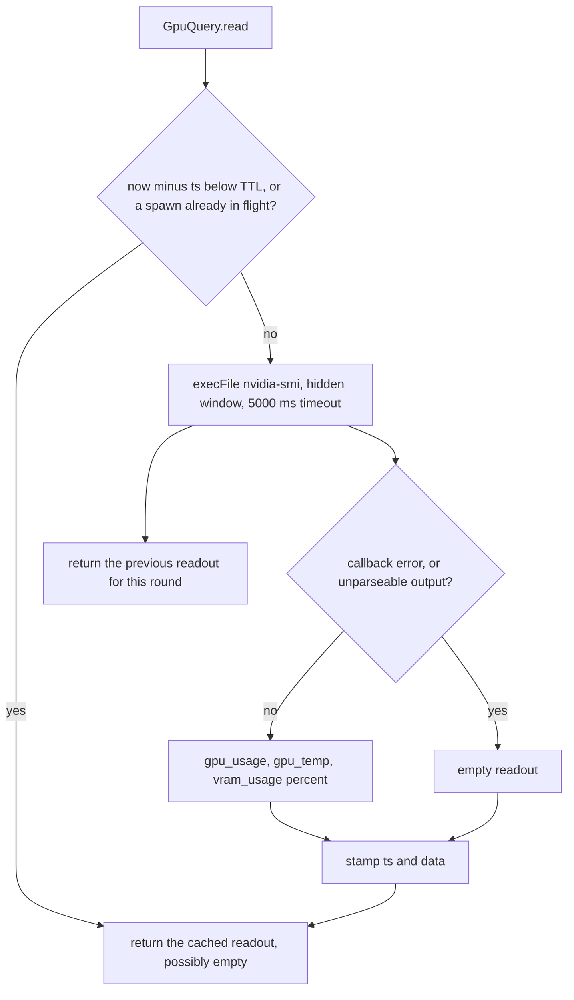

# Hardware telemetry: sources, sampling and history rings

One service owns every number on the HARDWARE card. `HardwareService` keeps two kinds of state — a small `gauges` object and four fixed-length history arrays — and produces both from a single `sample()` step that runs once per second. The arithmetic lives in three small pure modules so it can be unit-tested without a GPU, a NIC or Windows; the I/O edge lives in one module per real source.

| Module | Responsibility | Deliberately never does |
|---|---|---|
<!-- openwiki: broken internal link [/repo://app/src/main/services/hardware.ts#L44-L138] file "/repo://app/src/main/services/hardware.ts" does not exist. Fix the href or restore the target, then delete this comment. -->
| [`services/hardware.ts`](/repo://app/src/main/services/hardware.ts#L44-L138) | The sample state machine, per-source isolation, gauge formatting, history ownership, `state()` | Touch a native module, spawn a process, hold a baseline across restarts |
<!-- openwiki: broken internal link [/repo://app/src/main/hardware/rates.ts#L1-L68] file "/repo://app/src/main/hardware/rates.ts" does not exist. Fix the href or restore the target, then delete this comment. -->
| [`hardware/rates.ts`](/repo://app/src/main/hardware/rates.ts#L1-L68) | CPU time aggregation and differencing, 32-bit interface counter differencing, KB/s conversion | Read the clock, read the OS, keep previous state |
<!-- openwiki: broken internal link [/repo://app/src/main/hardware/history.ts#L1-L20] file "/repo://app/src/main/hardware/history.ts" does not exist. Fix the href or restore the target, then delete this comment. -->
| [`hardware/history.ts`](/repo://app/src/main/hardware/history.ts#L1-L20) | The fixed-capacity rolling ring and 1-decimal rounding | Know which series it holds |
<!-- openwiki: broken internal link [/repo://app/src/main/hardware/net-counters.ts#L1-L39] file "/repo://app/src/main/hardware/net-counters.ts" does not exist. Fix the href or restore the target, then delete this comment. -->
| [`hardware/net-counters.ts`](/repo://app/src/main/hardware/net-counters.ts#L1-L39) | Raw per-interface byte counters via koffi FFI into `iphlpapi.dll` | Compute rates, filter interfaces, cache anything |
<!-- openwiki: broken internal link [/repo://app/src/main/hardware/nvidia.ts#L9-L73] file "/repo://app/src/main/hardware/nvidia.ts" does not exist. Fix the href or restore the target, then delete this comment. -->
| [`hardware/nvidia.ts`](/repo://app/src/main/hardware/nvidia.ts#L9-L73) | `nvidia-smi` query, CSV parsing, TTL cache, async spawn | Block the sampler, invent values on failure |

<!-- openwiki: broken internal link [/repo://app/src/main/dataplane-protocol.ts#L8-L13] file "/repo://app/src/main/dataplane-protocol.ts" does not exist. Fix the href or restore the target, then delete this comment. -->
<!-- openwiki: broken internal link [/repo://app/src/shared/contract.ts#L143-L147] file "/repo://app/src/shared/contract.ts" does not exist. Fix the href or restore the target, then delete this comment. -->
<!-- openwiki: broken internal link [/repo://app/src/renderer/plugins.ts#L87-L95] file "/repo://app/src/renderer/plugins.ts" does not exist. Fix the href or restore the target, then delete this comment. -->
The card itself is one consumer among several: the same `HardwareState` is what the data-plane snapshot carries across the process boundary and what plugins receive when they declare the `hardware` capability ([dataplane-protocol.ts](/repo://app/src/main/dataplane-protocol.ts#L8-L13), [contract.ts](/repo://app/src/shared/contract.ts#L143-L147), [plugins.ts](/repo://app/src/renderer/plugins.ts#L87-L95)).

## The sampling loop and its isolation boundaries

*One sampling round: four independently guarded probes, a fixed push order into the rings, and two consumers reading the same `state()` result.*

<!-- openwiki: broken internal link [/repo://app/src/main/services/hardware.ts#L68-L108] file "/repo://app/src/main/services/hardware.ts" does not exist. Fix the href or restore the target, then delete this comment. -->
<!-- openwiki: broken internal link [/repo://app/tests/services.spec.ts#L108-L137] file "/repo://app/tests/services.spec.ts" does not exist. Fix the href or restore the target, then delete this comment. -->
<!-- openwiki: broken internal link [/repo://.scratch/standalone-app/issues/04-data-cards.md#L13] file "/repo://.scratch/standalone-app/issues/04-data-cards.md" does not exist. Fix the href or restore the target, then delete this comment. -->
Every probe is wrapped in its own `try`/`catch` — CPU, memory and (monotonic + network) inline in `sample()`, GPU through the dedicated `readGpu()` helper — so a source that throws only blanks its own fields and never aborts the round ([hardware.ts](/repo://app/src/main/services/hardware.ts#L68-L108)). This is the acceptance criterion recorded as "one data source failing does not affect the remaining scanning and hardware sampling" and pinned by `tests/services.spec.ts`: with `net` and `gpu` both throwing, the gauges still carry a fresh CPU percentage and memory string while `download_speed` and `gpu_usage` are simply absent and the `gpu`/`dl` history points are `null` ([services.spec.ts](/repo://app/tests/services.spec.ts#L108-L137), [04-data-cards.md](/repo://.scratch/standalone-app/issues/04-data-cards.md#L13)).

Two failure paths have consequences beyond the failing field:

<!-- openwiki: broken internal link [/repo://app/src/main/services/hardware.ts#L90-L93] file "/repo://app/src/main/services/hardware.ts" does not exist. Fix the href or restore the target, then delete this comment. -->
- A failed network read clears `prevNet` in the same catch ([hardware.ts](/repo://app/src/main/services/hardware.ts#L90-L93)). The counter snapshot from the failed round is therefore never used as a delta baseline, so the *next* round also has no rate (there is no previous snapshot to subtract), and the DL/UP gauges stay absent for one extra second instead of reporting a huge, partly-fabricated spike.
<!-- openwiki: broken internal link [/repo://app/src/main/services/hardware.ts#L98-L107] file "/repo://app/src/main/services/hardware.ts" does not exist. Fix the href or restore the target, then delete this comment. -->
- A failed GPU read is an empty object, which the history push reads as "no number" → `null` ([hardware.ts](/repo://app/src/main/services/hardware.ts#L98-L107)).

## The `HardwareSources` seam

<!-- openwiki: broken internal link [/repo://app/src/main/services/hardware.ts#L15-L38] file "/repo://app/src/main/services/hardware.ts" does not exist. Fix the href or restore the target, then delete this comment. -->
The state machine never imports a real source. It is constructed with a five-function bundle, which is the only thing the machine knows about the world ([hardware.ts](/repo://app/src/main/services/hardware.ts#L15-L38)):

| Source | Real provider in `systemHardwareSources()` | Unit |
|---|---|---|
| `cpuTimes()` | `aggregateCpuTimes(os.cpus())` | cumulative jiffies per category, aggregated |
| `memory()` | `{ total: os.totalmem(), free: os.freemem() }` | bytes |
| `net()` | `require('../hardware/net-counters').readNetCounters()` | per-interface byte counters |
| `gpu()` | one shared `GpuQuery` instance | utilisation %, °C, VRAM % |
| `monotonic()` | `performance.now() / 1000` | seconds, process-relative |

<!-- openwiki: broken internal link [/repo://app/src/main/services/hardware.ts#L36] file "/repo://app/src/main/services/hardware.ts" does not exist. Fix the href or restore the target, then delete this comment. -->
<!-- openwiki: broken internal link [/repo://app/tests/services.spec.ts#L50-L73] file "/repo://app/tests/services.spec.ts" does not exist. Fix the href or restore the target, then delete this comment. -->
`monotonic()` exists so that network rates use a clock that no wall-clock adjustment can move, and so tests can advance time by hand ([hardware.ts](/repo://app/src/main/services/hardware.ts#L36), [services.spec.ts](/repo://app/tests/services.spec.ts#L50-L73)).

### Why the real sources are required lazily

`systemHardwareSources()` is the production bundle, but the two native edges inside it are deferred:

<!-- openwiki: broken internal link [/repo://app/src/main/services/hardware.ts#L26-L38] file "/repo://app/src/main/services/hardware.ts" does not exist. Fix the href or restore the target, then delete this comment. -->
<!-- openwiki: broken internal link [/repo://app/src/main/hardware/net-counters.ts#L7-L17] file "/repo://app/src/main/hardware/net-counters.ts" does not exist. Fix the href or restore the target, then delete this comment. -->
- `net()` uses a `require()` *inside the closure*, because `net-counters.ts` calls `koffi.load('iphlpapi.dll')` and resolves `GetIfTable` at module scope ([hardware.ts](/repo://app/src/main/services/hardware.ts#L26-L38), [net-counters.ts](/repo://app/src/main/hardware/net-counters.ts#L7-L17)). Importing `services/hardware.ts` — which every offline kernel test does — must not load a native DLL.
<!-- openwiki: broken internal link [/repo://app/src/main/hardware/nvidia.ts#L6-L43] file "/repo://app/src/main/hardware/nvidia.ts" does not exist. Fix the href or restore the target, then delete this comment. -->
- The GPU read spawns `nvidia-smi` only when `GpuQuery.read()` decides the TTL has expired; `hardware/nvidia.ts` itself imports nothing but `node:child_process` and the pure modules, so it is safe to import eagerly while the subprocess stays lazy ([nvidia.ts](/repo://app/src/main/hardware/nvidia.ts#L6-L43)).

<!-- openwiki: broken internal link [/repo://app/src/main/desktop/adapter.ts#L1-L4] file "/repo://app/src/main/desktop/adapter.ts" does not exist. Fix the href or restore the target, then delete this comment. -->
The pattern is explicitly the house precedent for real-world edges: `desktop/adapter.ts` names the `hardware systemHardwareSources` case as its model when it defers `koffi` and `require('electron')` into the call sites that need them ([adapter.ts](/repo://app/src/main/desktop/adapter.ts#L1-L4)).

### Injection points

| Seam | How it is replaced |
|---|---|
<!-- openwiki: broken internal link [/repo://app/src/main/kernel.ts#L34] file "/repo://app/src/main/kernel.ts" does not exist. Fix the href or restore the target, then delete this comment. -->
<!-- openwiki: broken internal link [/repo://app/src/main/kernel.ts#L66] file "/repo://app/src/main/kernel.ts" does not exist. Fix the href or restore the target, then delete this comment. -->
<!-- openwiki: broken internal link [/repo://app/src/main/kernel.ts#L132] file "/repo://app/src/main/kernel.ts" does not exist. Fix the href or restore the target, then delete this comment. -->
| Whole bundle | `KernelOptions.hardwareSources` / `DataplaneKernelOptions.hardwareSources`, handed to `ctx.plugin(HardwareService, { sources })` ([kernel.ts](/repo://app/src/main/kernel.ts#L34), [kernel.ts](/repo://app/src/main/kernel.ts#L66), [kernel.ts](/repo://app/src/main/kernel.ts#L132)) |
<!-- openwiki: broken internal link [/repo://app/src/main/services/hardware.ts#L26-L30] file "/repo://app/src/main/services/hardware.ts" does not exist. Fix the href or restore the target, then delete this comment. -->
| GPU subprocess | `systemHardwareSources(gpuRunner)` — an alternative `GpuRunner` ([hardware.ts](/repo://app/src/main/services/hardware.ts#L26-L30)) |
<!-- openwiki: broken internal link [/repo://app/src/main/hardware/nvidia.ts#L51-L56] file "/repo://app/src/main/hardware/nvidia.ts" does not exist. Fix the href or restore the target, then delete this comment. -->
| GPU cache behaviour | `new GpuQuery(ttlMs, runner, now)` with injectable clock ([nvidia.ts](/repo://app/src/main/hardware/nvidia.ts#L51-L56)) |

## CPU occupancy

<!-- openwiki: broken internal link [/repo://app/src/main/hardware/rates.ts#L12-L21] file "/repo://app/src/main/hardware/rates.ts" does not exist. Fix the href or restore the target, then delete this comment. -->
`aggregateCpuTimes()` folds every core's `user + nice + sys + idle + irq` into one `total` and sums `idle` separately ([rates.ts](/repo://app/src/main/hardware/rates.ts#L12-L21)). `cpuPercent(prev, cur)` then differences the two snapshots:

- no previous sample → `0.0` (psutil semantics: the first reading after startup is defined as idle rather than a guess);
- `totalDelta <= 0` (cores offline, clock weirdness) → `0.0`;
<!-- openwiki: broken internal link [/repo://app/src/main/hardware/rates.ts#L23-L29] file "/repo://app/src/main/hardware/rates.ts" does not exist. Fix the href or restore the target, then delete this comment. -->
- otherwise `clamp(0, 100, (1 - idleDelta / totalDelta) * 100)` ([rates.ts](/repo://app/src/main/hardware/rates.ts#L23-L29)).

<!-- openwiki: broken internal link [/repo://app/src/main/services/hardware.ts#L69-L75] file "/repo://app/src/main/services/hardware.ts" does not exist. Fix the href or restore the target, then delete this comment. -->
<!-- openwiki: broken internal link [/repo://app/src/main/services/hardware.ts#L110-L115] file "/repo://app/src/main/services/hardware.ts" does not exist. Fix the href or restore the target, then delete this comment. -->
<!-- openwiki: broken internal link [/repo://app/src/renderer/format.ts#L17-L20] file "/repo://app/src/renderer/format.ts" does not exist. Fix the href or restore the target, then delete this comment. -->
Because `cpu` is a mandatory gauge and the catch branch sets `0.0`, a *broken* CPU probe is displayed exactly like an idle machine: the mandatory gauges degrade to a zero reading, whereas the optional GPU/network gauges degrade to absence. Only `memory_gb`'s `'-- GB/-- GB'` placeholder reveals a broken memory probe ([hardware.ts](/repo://app/src/main/services/hardware.ts#L69-L75), [hardware.ts](/repo://app/src/main/services/hardware.ts#L110-L115), [format.ts](/repo://app/src/renderer/format.ts#L17-L20)).

<!-- openwiki: broken internal link [/repo://app/src/main/services/hardware.ts#L40-L42] file "/repo://app/src/main/services/hardware.ts" does not exist. Fix the href or restore the target, then delete this comment. -->
<!-- openwiki: broken internal link [/repo://app/tests/services.spec.ts#L88-L93] file "/repo://app/tests/services.spec.ts" does not exist. Fix the href or restore the target, then delete this comment. -->
Memory is a snapshot, not a history: `gauges()` derives the percentage from `free / total` and the display string from the same numbers with `toFixed(2).padStart(5, '0')` — which is why the fixed-width form is `08.00 GB/16.00 GB` and not `8.00 GB/16.00 GB` ([hardware.ts](/repo://app/src/main/services/hardware.ts#L40-L42), [services.spec.ts](/repo://app/tests/services.spec.ts#L88-L93)).

## Network rates: koffi, 32-bit wrap and interface identity

<!-- openwiki: broken internal link [/repo://app/src/main/hardware/net-counters.ts#L10-L39] file "/repo://app/src/main/hardware/net-counters.ts" does not exist. Fix the href or restore the target, then delete this comment. -->
`readNetCounters()` is a direct FFI call into `iphlpapi.dll`'s `GetIfTable`, parsing the flat `MIB_IFROW` table with pinned offsets ([net-counters.ts](/repo://app/src/main/hardware/net-counters.ts#L10-L39)):

| Constant | Value | Meaning |
|---|---|---|
| `ROW_SIZE` | `860` | bytes per interface row |
| table start | offset `4` | first row follows the header's row-count DWORD |
| `OFF_INDEX` | `512` | `dwIndex`, the interface key in the returned `Map` |
| `OFF_IN_OCTETS` | `552` | received octets (32-bit) |
| `OFF_OUT_OCTETS` | `576` | sent octets (32-bit) |
| `ERROR_INSUFFICIENT_BUFFER` | `111` | retry once with the size the call reported |

<!-- openwiki: broken internal link [/repo://app/src/main/hardware/net-counters.ts#L1-L6] file "/repo://app/src/main/hardware/net-counters.ts" does not exist. Fix the href or restore the target, then delete this comment. -->
<!-- openwiki: broken internal link [/repo://app/src/main/hardware/net-counters.ts#L20-L39] file "/repo://app/src/main/hardware/net-counters.ts" does not exist. Fix the href or restore the target, then delete this comment. -->
The offsets were cross-validated on the real machine against `Get-NetAdapterStatistics` and are recorded as such in the module header, which is the safe-change note that matters here: the buffer is walked as raw bytes, so a "cleanup" of these magic numbers must be re-validated against the same reference, not reasoned about ([net-counters.ts](/repo://app/src/main/hardware/net-counters.ts#L1-L6), [net-counters.ts](/repo://app/src/main/hardware/net-counters.ts#L20-L39)). Any non-zero return code throws, which puts the failure on the sampler's isolation path rather than into the numbers.

<!-- openwiki: broken internal link [/repo://app/src/main/hardware/rates.ts#L47-L68] file "/repo://app/src/main/hardware/rates.ts" does not exist. Fix the href or restore the target, then delete this comment. -->
`netRates(prev, cur, dt)` inverts that into KB/s ([rates.ts](/repo://app/src/main/hardware/rates.ts#L47-L68)):

- `prev === null` or `dt <= 0` → `null` (the contract's "no rate yet" state, not a zero rate);
<!-- openwiki: broken internal link [/repo://app/src/main/hardware/rates.ts#L31-L35] file "/repo://app/src/main/hardware/rates.ts" does not exist. Fix the href or restore the target, then delete this comment. -->
- per interface, `counterDelta32(prev, cur)` computes the difference modulo 2³² and returns `0` for any difference above 2³¹ — the band the module calls implausible as a real delta (more than 2 GiB) and therefore a counter reset rather than a wrap ([rates.ts](/repo://app/src/main/hardware/rates.ts#L31-L35));
- interfaces missing from the previous snapshot are skipped, so a newly appeared adapter is not credited with its whole lifetime counter;
- the per-interface deltas are summed over every interface the table reports — the module header calls it an all-interface read — then divided by `dt` and by 1024, clamped non-negative and rounded to one decimal.

<!-- openwiki: broken internal link [/repo://.scratch/standalone-app/issues/04-data-cards.md#L43-L45] file "/repo://.scratch/standalone-app/issues/04-data-cards.md" does not exist. Fix the href or restore the target, then delete this comment. -->
`dt` comes from `monotonic()`, measured between rounds rather than assumed to be one second, so a delayed timer cannot scale the displayed speed. This is deliberately a step beyond the original Python service, whose `max(0, cur - prev)` lost a slice of real traffic at every wrap ([04-data-cards.md](/repo://.scratch/standalone-app/issues/04-data-cards.md#L43-L45)).

## The GPU readout behind a 5 s TTL query

<!-- openwiki: broken internal link [/repo://app/src/main/hardware/nvidia.ts#L15-L18] file "/repo://app/src/main/hardware/nvidia.ts" does not exist. Fix the href or restore the target, then delete this comment. -->
<!-- openwiki: broken internal link [/repo://app/src/main/hardware/nvidia.ts#L39-L43] file "/repo://app/src/main/hardware/nvidia.ts" does not exist. Fix the href or restore the target, then delete this comment. -->
`GpuQuery` runs `nvidia-smi --query-gpu=utilization.gpu,temperature.gpu,memory.used,memory.total --format=csv,noheader,nounits` through `execFile` with a 5000 ms timeout and `windowsHide: true`, so no console window flashes ([nvidia.ts](/repo://app/src/main/hardware/nvidia.ts#L15-L18), [nvidia.ts](/repo://app/src/main/hardware/nvidia.ts#L39-L43)).

<!-- openwiki: broken internal link [/repo://app/src/main/hardware/nvidia.ts#L21-L35] file "/repo://app/src/main/hardware/nvidia.ts" does not exist. Fix the href or restore the target, then delete this comment. -->
<!-- openwiki: broken internal link [/repo://app/tests/hardware.spec.ts#L90-L107] file "/repo://app/tests/hardware.spec.ts" does not exist. Fix the href or restore the target, then delete this comment. -->
`parseNvidiaSmi()` is pure and is the only place the wire format is interpreted: it takes the first line, requires four finite numbers, and returns `gpu_usage` (%), `gpu_temp` (°C) and `vram_usage = round1(memUsed / memTotal * 100)` — with `null` when the reported total is zero, and a thrown error for empty or unparseable output ([nvidia.ts](/repo://app/src/main/hardware/nvidia.ts#L21-L35), [hardware.spec.ts](/repo://app/tests/hardware.spec.ts#L90-L107)).

*The GPU cache lifecycle: a read either serves the cache or kicks off one asynchronous refresh; both success and failure stamp the TTL.*

Three properties of that lifecycle are worth stating explicitly:

<!-- openwiki: broken internal link [/repo://.scratch/standalone-app/issues/04-data-cards.md#L45] file "/repo://.scratch/standalone-app/issues/04-data-cards.md" does not exist. Fix the href or restore the target, then delete this comment. -->
<!-- openwiki: broken internal link [/repo://app/src/main/hardware/nvidia.ts#L57-L73] file "/repo://app/src/main/hardware/nvidia.ts" does not exist. Fix the href or restore the target, then delete this comment. -->
1. **Nothing blocks.** The refresh is asynchronous and `read()` never waits; the value returned on the round that starts the spawn is the previous one. That is why the GPU gauges can be absent for the first sampling rounds after a start — accepted as a retained trade-off, an unblocked sampler in exchange for one or two rounds without a GPU reading ([04-data-cards.md](/repo://.scratch/standalone-app/issues/04-data-cards.md#L45), [nvidia.ts](/repo://app/src/main/hardware/nvidia.ts#L57-L73)).
<!-- openwiki: broken internal link [/repo://app/src/main/hardware/nvidia.ts#L45-L73] file "/repo://app/src/main/hardware/nvidia.ts" does not exist. Fix the href or restore the target, then delete this comment. -->
<!-- openwiki: broken internal link [/repo://app/tests/hardware.spec.ts#L109-L132] file "/repo://app/tests/hardware.spec.ts" does not exist. Fix the href or restore the target, then delete this comment. -->
2. **A failure fills the whole TTL.** On spawn error or parse error the cached readout is set to `{}` *and* the timestamp is stamped, so a missing `nvidia-smi` costs one process spawn per TTL rather than one per second — the same "failure occupies the TTL" semantics as the original service ([nvidia.ts](/repo://app/src/main/hardware/nvidia.ts#L45-L73), [hardware.spec.ts](/repo://app/tests/hardware.spec.ts#L109-L132)).
3. **One spawn at a time.** The `inFlight` flag makes concurrent reads in the same window return the cache instead of queueing more subprocesses.

<!-- openwiki: broken internal link [/repo://app/src/main/services/hardware.ts#L26-L30] file "/repo://app/src/main/services/hardware.ts" does not exist. Fix the href or restore the target, then delete this comment. -->
<!-- openwiki: broken internal link [/repo://app/src/main/hardware/nvidia.ts#L51-L55] file "/repo://app/src/main/hardware/nvidia.ts" does not exist. Fix the href or restore the target, then delete this comment. -->
<!-- openwiki: broken internal link [/repo://docs/adr/0005-no-input-hooks-dataplane-utility-process.md#L7] file "/repo://docs/adr/0005-no-input-hooks-dataplane-utility-process.md" does not exist. Fix the href or restore the target, then delete this comment. -->
<!-- openwiki: broken internal link [/repo://app/src/main/services/hardware.ts#L28-L30] file "/repo://app/src/main/services/hardware.ts" does not exist. Fix the href or restore the target, then delete this comment. -->
The TTL production wiring is `new GpuQuery(5000, gpuRunner)` — five seconds, not the class default of 3000 ms ([hardware.ts](/repo://app/src/main/services/hardware.ts#L26-L30), [nvidia.ts](/repo://app/src/main/hardware/nvidia.ts#L51-L55)). The reason is recorded in ADR-0005: while moving collection into the data-plane child, the nvidia-smi TTL was lengthened from the Python-era 3 s to 5 s, halving the spawn cadence to about twelve per minute, because a purely decorative metric needs no per-second freshness and the periodic query was causing measurable micro-jitter on the GPU/DWM side ([ADR-0005](/repo://docs/adr/0005-no-input-hooks-dataplane-utility-process.md#L7), [hardware.ts](/repo://app/src/main/services/hardware.ts#L28-L30)). The module header comment in `nvidia.ts` still says "3 second cache"; the constructor argument passed by `systemHardwareSources()` is authoritative.

## The 300-point history rings

<!-- openwiki: broken internal link [/repo://app/src/main/hardware/history.ts#L1-L16] file "/repo://app/src/main/hardware/history.ts" does not exist. Fix the href or restore the target, then delete this comment. -->
`HistoryRing` is a `collections.deque(maxlen)` equivalent: a capacity-limited array that drops the oldest element at capacity, rounds every incoming number to one decimal (Python `round(x, 1)` semantics, with the documented .5-boundary difference from `Math.round`), passes `null` through untouched, and hands out a copy from `toArray()` so a reader cannot mutate the live window ([history.ts](/repo://app/src/main/hardware/history.ts#L1-L16)).

<!-- openwiki: broken internal link [/repo://app/src/main/services/hardware.ts#L15] file "/repo://app/src/main/services/hardware.ts" does not exist. Fix the href or restore the target, then delete this comment. -->
<!-- openwiki: broken internal link [/repo://app/src/main/services/hardware.ts#L55-L60] file "/repo://app/src/main/services/hardware.ts" does not exist. Fix the href or restore the target, then delete this comment. -->
`HardwareService` owns four of them, all `HISTORY_LEN = 300` ([hardware.ts](/repo://app/src/main/services/hardware.ts#L15), [hardware.ts](/repo://app/src/main/services/hardware.ts#L55-L60)). Three invariants follow:

<!-- openwiki: broken internal link [/repo://app/src/main/services/hardware.ts#L94-L99] file "/repo://app/src/main/services/hardware.ts" does not exist. Fix the href or restore the target, then delete this comment. -->
- **Exactly one point per ring per round**, pushed in the fixed order `cpu`, `dl`, `up`, `gpu` at the end of `sample()` ([hardware.ts](/repo://app/src/main/services/hardware.ts#L94-L99)). Index *i* therefore refers to the same sampling round in all four arrays, and the four arrays always have the same length — a failed probe still pushes a placeholder (`null`, or `0.0` for CPU) rather than shortening the series.
<!-- openwiki: broken internal link [/repo://app/src/renderer/cards/hardware/card.ts#L29-L32] file "/repo://app/src/renderer/cards/hardware/card.ts" does not exist. Fix the href or restore the target, then delete this comment. -->
- **300 points at 1 Hz is a five-minute window.** The sparklines are relative shapes: the card normalises each series by the maximum of its visible non-null points rather than by 100 % ([card.ts](/repo://app/src/renderer/cards/hardware/card.ts#L29-L32)).
<!-- openwiki: broken internal link [/repo://app/src/shared/contract.ts#L43-L49] file "/repo://app/src/shared/contract.ts" does not exist. Fix the href or restore the target, then delete this comment. -->
<!-- openwiki: broken internal link [/repo://app/src/main/services/hardware.ts#L127-L134] file "/repo://app/src/main/services/hardware.ts" does not exist. Fix the href or restore the target, then delete this comment. -->
<!-- openwiki: broken internal link [/repo://app/src/renderer/cards/hardware/card.ts#L72-L76] file "/repo://app/src/renderer/cards/hardware/card.ts" does not exist. Fix the href or restore the target, then delete this comment. -->
<!-- openwiki: broken internal link [/repo://app/accept/battery.js#L686-L689] file "/repo://app/accept/battery.js" does not exist. Fix the href or restore the target, then delete this comment. -->
- **`cpu` is `number[]`, the rest are `(number | null)[]`** in the shared contract, and `historySnapshot()` casts accordingly ([contract.ts](/repo://app/src/shared/contract.ts#L43-L49), [hardware.ts](/repo://app/src/main/services/hardware.ts#L127-L134)). The 300-point cap is what the panel's evidence battery asserts via the one-shot `history-live` event, which fires once the CPU ring has collected at least five points ([card.ts](/repo://app/src/renderer/cards/hardware/card.ts#L72-L76), [battery.js](/repo://app/accept/battery.js#L686-L689)).

## "Field absent" versus "field null"

<!-- openwiki: broken internal link [/repo://app/src/shared/contract.ts#L31-L49] file "/repo://app/src/shared/contract.ts" does not exist. Fix the href or restore the target, then delete this comment. -->
The contract encodes three distinguishable states, and the difference is meaningful enough that it is stated in the type comments themselves: optional gauges are absent when a source is unavailable, history points are `null` when a series is momentarily unavailable, and `vram_usage` is the one gauge that is legitimately `null` ([contract.ts](/repo://app/src/shared/contract.ts#L31-L49)).

| Surface | Unavailable reading | Produced by | Consumer effect |
|---|---|---|---|
| `gauges.gpu_usage`, `gauges.gpu_temp` | key omitted | `typeof x === 'number'` guard in `gauges()` | `pct()` renders `---`, never `0` |
| `gauges.vram_usage` | key omitted when the probe said nothing, explicit `null` when the GPU reports a zero VRAM total | `!== undefined` guard; `parseNvidiaSmi` | `null` is a real value in the payload — `pct()` still shows `---` |
| `gauges.download_speed`, `gauges.upload_speed` | key omitted | `if (this.rates)` block | `kbps()` renders `----` |
| `history.dl`, `history.up`, `history.gpu` | `null` element | push of `null` in `sample()` | the sparkline breaks its polyline at that index instead of plotting zero |
| `history.cpu` | never null — a failed probe is `0.0` | catch branch + `cpuPercent` | indistinguishable from an idle CPU |
| `gauges.memory`, `memory_gb` | `0` plus `-- GB/-- GB` | `this.mem ? … : 0` / placeholder | the placeholder string is the only visible hint |

<!-- openwiki: broken internal link [/repo://app/src/renderer/format.ts#L17-L20] file "/repo://app/src/renderer/format.ts" does not exist. Fix the href or restore the target, then delete this comment. -->
<!-- openwiki: broken internal link [/repo://app/src/renderer/cards/hardware/card.ts#L12-L14] file "/repo://app/src/renderer/cards/hardware/card.ts" does not exist. Fix the href or restore the target, then delete this comment. -->
<!-- openwiki: broken internal link [/repo://app/src/renderer/cards/hardware/card.ts#L54-L63] file "/repo://app/src/renderer/cards/hardware/card.ts" does not exist. Fix the href or restore the target, then delete this comment. -->
(`pct(0)` prints `000`, and `format.ts` documents the placeholder as "source unavailable shows `---`, not 0" — the mandatory/optional split above is precisely where that rule cannot be applied ([format.ts](/repo://app/src/renderer/format.ts#L17-L20), [card.ts](/repo://app/src/renderer/cards/hardware/card.ts#L12-L14), [card.ts](/repo://app/src/renderer/cards/hardware/card.ts#L54-L63)).)

<!-- openwiki: broken internal link [/repo://app/src/renderer/plugins.ts#L87-L95] file "/repo://app/src/renderer/plugins.ts" does not exist. Fix the href or restore the target, then delete this comment. -->
<!-- openwiki: broken internal link [/repo://app/src/renderer/plugins.ts#L169-L195] file "/repo://app/src/renderer/plugins.ts" does not exist. Fix the href or restore the target, then delete this comment. -->
<!-- openwiki: broken internal link [/repo://app/tests/services.spec.ts#L122-L133] file "/repo://app/tests/services.spec.ts" does not exist. Fix the href or restore the target, then delete this comment. -->
<!-- openwiki: broken internal link [/repo://.scratch/standalone-app/issues/04-data-cards.md#L43-L45] file "/repo://.scratch/standalone-app/issues/04-data-cards.md" does not exist. Fix the href or restore the target, then delete this comment. -->
The absent/null distinction also survives into the plugin plumbing, because the renderer keys plugin updates on `JSON.stringify(viewFor(info, snap))`: `JSON.stringify` drops absent keys but keeps `"vram_usage": null`, so an explicit null participates in the "did the view change" comparison that drives `PluginApi.update()` ([plugins.ts](/repo://app/src/renderer/plugins.ts#L87-L95), [plugins.ts](/repo://app/src/renderer/plugins.ts#L169-L195)). Collapsing null to absence (or to `0`) inside the service would therefore change both the payload shape and the plugin update cadence, which is why the rule is enforced at the source: `dl`/`up`/`gpu` history push `null` rather than a fake zero, deliberately symmetric with the GPU series ([services.spec.ts](/repo://app/tests/services.spec.ts#L122-L133), [04-data-cards.md](/repo://.scratch/standalone-app/issues/04-data-cards.md#L43-L45)).

## Lifecycle, cadence and the restart consequence

<!-- openwiki: broken internal link [/repo://app/src/main/kernel.ts#L56] file "/repo://app/src/main/kernel.ts" does not exist. Fix the href or restore the target, then delete this comment. -->
<!-- openwiki: broken internal link [/repo://app/src/main/kernel.ts#L90-L94] file "/repo://app/src/main/kernel.ts" does not exist. Fix the href or restore the target, then delete this comment. -->
<!-- openwiki: broken internal link [/repo://app/src/main/kernel.ts#L152-L156] file "/repo://app/src/main/kernel.ts" does not exist. Fix the href or restore the target, then delete this comment. -->
<!-- openwiki: broken internal link [/repo://app/src/main/panel-kernel.ts#L34-L44] file "/repo://app/src/main/panel-kernel.ts" does not exist. Fix the href or restore the target, then delete this comment. -->
<!-- openwiki: broken internal link [/repo://app/src/main/services/dataplane.ts#L146-L151] file "/repo://app/src/main/services/dataplane.ts" does not exist. Fix the href or restore the target, then delete this comment. -->
Sampling is not driven by the bridge tick. The kernel owns a dedicated timer per assembly: `DEFAULT_HARDWARE_MS = 1000`, installed as `setInterval(() => ctx.hardware?.sample(), hwMs)`, and `hardwareIntervalMs: 0` disables it so offline tests drive `sample()` by hand ([kernel.ts](/repo://app/src/main/kernel.ts#L56), [kernel.ts](/repo://app/src/main/kernel.ts#L90-L94), [kernel.ts](/repo://app/src/main/kernel.ts#L152-L156)). In production only `createDataplaneKernel` registers `HardwareService`, so the sampling state lives in the utilityProcess child; the panel main process holds no hardware state at all and answers every read from the last snapshot ([panel-kernel.ts](/repo://app/src/main/panel-kernel.ts#L34-L44), [dataplane.ts](/repo://app/src/main/services/dataplane.ts#L146-L151)).

<!-- openwiki: broken internal link [/repo://app/src/main/services/hardware.ts#L136-L138] file "/repo://app/src/main/services/hardware.ts" does not exist. Fix the href or restore the target, then delete this comment. -->
<!-- openwiki: broken internal link [/repo://app/src/main/dataplane-protocol.ts#L8-L13] file "/repo://app/src/main/dataplane-protocol.ts" does not exist. Fix the href or restore the target, then delete this comment. -->
<!-- openwiki: broken internal link [/repo://app/src/main/dataplane.ts#L19-L27] file "/repo://app/src/main/dataplane.ts" does not exist. Fix the href or restore the target, then delete this comment. -->
<!-- openwiki: broken internal link [/repo://app/src/main/services/bridge.ts#L37-L48] file "/repo://app/src/main/services/bridge.ts" does not exist. Fix the href or restore the target, then delete this comment. -->
<!-- openwiki: broken internal link [/repo://app/src/main/services/dataplane.ts#L146-L151] file "/repo://app/src/main/services/dataplane.ts" does not exist. Fix the href or restore the target, then delete this comment. -->
<!-- openwiki: broken internal link [/repo://docs/adr/0005-no-input-hooks-dataplane-utility-process.md#L24] file "/repo://docs/adr/0005-no-input-hooks-dataplane-utility-process.md" does not exist. Fix the href or restore the target, then delete this comment. -->
The read path is therefore: `sample()` fills the rings → `state()` returns `{ gauges, history }` ([hardware.ts](/repo://app/src/main/services/hardware.ts#L136-L138)) → the child posts it as `DataplaneSnapshot.hardware` ([dataplane-protocol.ts](/repo://app/src/main/dataplane-protocol.ts#L8-L13), [dataplane.ts](/repo://app/src/main/dataplane.ts#L19-L27)) → the main process caches it in `DataplaneService.latest` → `BridgeService.snapshot()` merges it into `panel/changed` ([bridge.ts](/repo://app/src/main/services/bridge.ts#L37-L48)) → the card reads `host.view.hardware`. Before the first snapshot arrives the port returns zeroed gauges with four empty histories, which the card renders as placeholders ([dataplane.ts](/repo://app/src/main/services/dataplane.ts#L146-L151)). The full 300-point arrays cross that boundary every second — a few KB of plain JSON that ADR-0005 accepts as negligible ([ADR-0005](/repo://docs/adr/0005-no-input-hooks-dataplane-utility-process.md#L24)).

Because all of it is in-memory and process-local, **a data-plane restart starts the curves over**:

- `prevCpu`, `prevNet` and the four rings are instance fields, and no module in `app/src/main/hardware/` or `services/hardware.ts` reads or writes a file, so there is nothing to restore from;
<!-- openwiki: broken internal link [/repo://app/src/main/services/hardware.ts#L50-L99] file "/repo://app/src/main/services/hardware.ts" does not exist. Fix the href or restore the target, then delete this comment. -->
- the first sample of the new child is a baseline round: CPU reports `0.0`, the network rate is `null`/absent but still pushes `null` points, and the GPU readout is empty until the first `nvidia-smi` callback lands ([hardware.ts](/repo://app/src/main/services/hardware.ts#L50-L99));
<!-- openwiki: broken internal link [/repo://app/src/main/services/hardware.ts#L36] file "/repo://app/src/main/services/hardware.ts" does not exist. Fix the href or restore the target, then delete this comment. -->
<!-- openwiki: broken internal link [/repo://app/src/main/hardware/rates.ts#L55-L56] file "/repo://app/src/main/hardware/rates.ts" does not exist. Fix the href or restore the target, then delete this comment. -->
- the process-relative `monotonic()` clock also restarts, so the new baseline cannot inherit a stale `dt` ([hardware.ts](/repo://app/src/main/services/hardware.ts#L36), [rates.ts](/repo://app/src/main/hardware/rates.ts#L55-L56)).

<!-- openwiki: broken internal link [/repo://app/src/main/services/dataplane.ts#L31-L33] file "/repo://app/src/main/services/dataplane.ts" does not exist. Fix the href or restore the target, then delete this comment. -->
<!-- openwiki: broken internal link [/repo://app/src/main/services/dataplane.ts#L78-L88] file "/repo://app/src/main/services/dataplane.ts" does not exist. Fix the href or restore the target, then delete this comment. -->
<!-- openwiki: broken internal link [/repo://docs/adr/0005-no-input-hooks-dataplane-utility-process.md#L21] file "/repo://docs/adr/0005-no-input-hooks-dataplane-utility-process.md" does not exist. Fix the href or restore the target, then delete this comment. -->
<!-- openwiki: broken internal link [/repo://app/src/renderer/cards/hardware/card.ts#L73-L76] file "/repo://app/src/renderer/cards/hardware/card.ts" does not exist. Fix the href or restore the target, then delete this comment. -->
The child's restart is handled by backoff in `DataplaneService` with up to 30 s between attempts, and both the code comment and ADR-0005 record the empty-history discontinuity as an accepted, display-only degradation: position state, the usage log and desktop items converge from disk, the sparklines simply have less to draw ([dataplane.ts](/repo://app/src/main/services/dataplane.ts#L31-L33), [dataplane.ts](/repo://app/src/main/services/dataplane.ts#L78-L88), [ADR-0005](/repo://docs/adr/0005-no-input-hooks-dataplane-utility-process.md#L21)). The consumer side reflects this automatically: the `history-live` evidence event in the renderer is one-shot per mount and fires again only after the ring has recollected five points ([card.ts](/repo://app/src/renderer/cards/hardware/card.ts#L73-L76)).

## Focused tests

| Test | What it pins |
|---|---|
<!-- openwiki: broken internal link [/repo://app/tests/hardware.spec.ts#L7-L29] file "/repo://app/tests/hardware.spec.ts" does not exist. Fix the href or restore the target, then delete this comment. -->
| [hardware.spec.ts](/repo://app/tests/hardware.spec.ts#L7-L29) | `HistoryRing` rolling discard, 1-decimal rounding, `null` points, and the 300-point cap (350 pushes leave points 50…349) |
<!-- openwiki: broken internal link [/repo://app/tests/hardware.spec.ts#L31-L50] file "/repo://app/tests/hardware.spec.ts" does not exist. Fix the href or restore the target, then delete this comment. -->
| [hardware.spec.ts](/repo://app/tests/hardware.spec.ts#L31-L50) | CPU: first sample `0`, interval delta percentages, per-core aggregation into `idle`/`total` |
<!-- openwiki: broken internal link [/repo://app/tests/hardware.spec.ts#L52-L88] file "/repo://app/tests/hardware.spec.ts" does not exist. Fix the href or restore the target, then delete this comment. -->
| [hardware.spec.ts](/repo://app/tests/hardware.spec.ts#L52-L88) | Network: `null` without a baseline, KB/s conversion with non-negative clamp, 32-bit wrap arithmetic, reset detection (`1000 → 999` and a >2³¹ jump both yield `0`), multi-interface summation with new interfaces ignored, `dt = 0` |
<!-- openwiki: broken internal link [/repo://app/tests/hardware.spec.ts#L90-L132] file "/repo://app/tests/hardware.spec.ts" does not exist. Fix the href or restore the target, then delete this comment. -->
| [hardware.spec.ts](/repo://app/tests/hardware.spec.ts#L90-L132) | `nvidia-smi` CSV parsing (four values, `vram_usage` ratio, zero-total `null`, empty/unparseable throws) and the TTL cache (one spawn per window, failure occupying the window) |
<!-- openwiki: broken internal link [/repo://app/tests/services.spec.ts#L75-L106] file "/repo://app/tests/services.spec.ts" does not exist. Fix the href or restore the target, then delete this comment. -->
| [services.spec.ts](/repo://app/tests/services.spec.ts#L75-L106) | The sampling state machine against a fake source: first-round `0`/absent, then 50 % CPU, the `08.00 GB/16.00 GB` string, 2 KB/s / 1 KB/s, and rings `[0, 50]` / `[null, 2]` growing to 7 points |
<!-- openwiki: broken internal link [/repo://app/tests/services.spec.ts#L108-L137] file "/repo://app/tests/services.spec.ts" does not exist. Fix the href or restore the target, then delete this comment. -->
| [services.spec.ts](/repo://app/tests/services.spec.ts#L108-L137) | Per-source isolation (acceptance item 5): `net` and `gpu` throwing leaves CPU/memory intact while GPU/network gauges are absent and their history points are `null` |
<!-- openwiki: broken internal link [/repo://app/tests/dataplane-kernel.spec.ts#L45-L88] file "/repo://app/tests/dataplane-kernel.spec.ts" does not exist. Fix the href or restore the target, then delete this comment. -->
| [dataplane-kernel.spec.ts](/repo://app/tests/dataplane-kernel.spec.ts#L45-L88) | The child assembly with 10 ms timers: `hardware.gauges.gpu_usage` reaches the snapshot sink, proving the sampled state crosses the process boundary |

<!-- openwiki: broken internal link [/repo://app/accept/battery.js#L676-L690] file "/repo://app/accept/battery.js" does not exist. Fix the href or restore the target, then delete this comment. -->
The window between unit coverage and real hardware is closed by the acceptance battery, which asserts live 1 Hz rendering (`hardware-rendered` at least twice) and accumulating history (`history-live` at five points) on a real machine ([battery.js](/repo://app/accept/battery.js#L676-L690)).

## Related pages

- [cordis kernel: service assembly, seams and timers](/openwiki/architecture/cordis-kernel-and-services.md) — where the 1 Hz timer and the injectable `HardwareSources` option live.
- [Data plane subprocess: protocol, RPC and restart behaviour](/openwiki/architecture/data-service.md) — the utilityProcess that owns sampling in production, its snapshot cadence and restart behaviour.
- [Bridge contract and IPC transport](/openwiki/architecture/bridge-contract-and-ipc.md) — how `HardwareState` travels to the renderer.
- [Plugin host](/openwiki/architecture/plugin-host.md) — the `hardware` capability and the `PluginView` diffing that makes absent-versus-null visible.
- [Windows shell and system APIs](/openwiki/integrations/windows-shell-and-system-apis.md) — the koffi/`iphlpapi` and subprocess conventions this page's sources rely on.
 and subprocess conventions this page's sources rely on.
ubprocess conventions this page's sources rely on.
