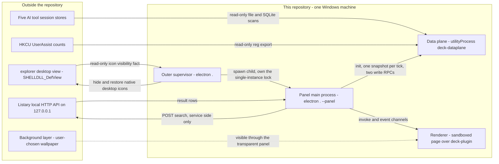
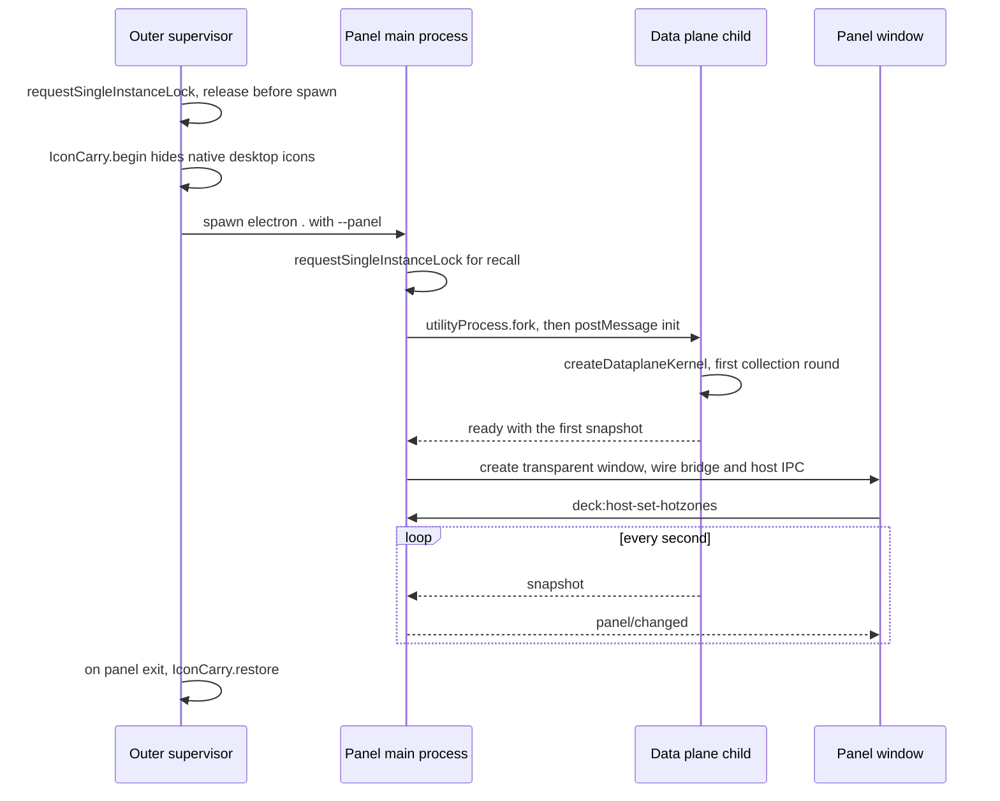

# System overview: process topology, runtime domains and boundaries

<!-- openwiki: broken internal link [/repo://README.md#L11-L19] file "/repo://README.md" does not exist. Fix the href or restore the target, then delete this comment. -->
This repository builds **AGENT DECK**: a resident desktop operations panel for one Windows machine. One Electron application draws a transparent, frameless window on top of whatever wallpaper the user has chosen (system wallpaper or a Wallpaper Engine mount — both are just a background layer now), shows a card grid plus a bottom dock with the session lists of five AI tools (Qoder, kimi code, kimi work, zcode, hermes) and hardware gauges, and hosts the desktop items itself instead of letting explorer's icon list view do it. It is run from a checkout — there is no installer, no packaging step and no console entry point other than `electron .` ([README](/repo://README.md#L11-L19)).

Two ADRs fix the structural boundaries, and everything else in this page follows from them:

<!-- openwiki: broken internal link [/repo://docs/adr/0004-electron-cordis-standalone-panel.md#L6-L24] file "/repo://docs/adr/0004-electron-cordis-standalone-panel.md" does not exist. Fix the href or restore the target, then delete this comment. -->
- [ADR-0004](/repo://docs/adr/0004-electron-cordis-standalone-panel.md#L6-L24) fixes the **host and kernel**: Electron is the window host (transparent window, click-through plus hotzones, tray, Win32 reach), cordis 3.x is the main-process plugin kernel, and the retired Python data service's capabilities are ported to TypeScript services. Stacking order is background layer < panel < ordinary windows; explorer and the taskbar are left alone except for the desktop-icon hosting duty.
<!-- openwiki: broken internal link [/repo://docs/adr/0005-no-input-hooks-dataplane-utility-process.md#L5-L7] file "/repo://docs/adr/0005-no-input-hooks-dataplane-utility-process.md" does not exist. Fix the href or restore the target, then delete this comment. -->
- [ADR-0005](/repo://docs/adr/0005-no-input-hooks-dataplane-utility-process.md#L5-L7) fixes the **process split**: the window-host thread must hold no system-level input hook, and periodic collection must not run on the panel main process's event loop. Both were reactions to a measured machine-wide mouse stall; the split is now the reason there are three processes rather than one.

## Context and domains

*Context diagram: the panel sits between external read-only sources and the user's own desktop; the only things it changes outside its own data are explorer's desktop-icon visibility and the Startup shortcut.*

<!-- openwiki: broken internal link [/repo://app/src/main/index.ts#L183-L234] file "/repo://app/src/main/index.ts" does not exist. Fix the href or restore the target, then delete this comment. -->
The launch chain has an ordering that is easy to get wrong, and both orders are load-bearing (they are set in [index.ts](/repo://app/src/main/index.ts#L183-L234)):

*Launch sequence: the supervisor releases its lock before spawning so a still-shutting-down previous instance cannot be mistaken for a second launch, and the window is only created after the data plane's first snapshot (with a 15 s timeout that lets the panel start empty rather than not at all).*

## Runtime domains

| Domain | Process and entry point | Owns | Detail |
|---|---|---|---|
<!-- openwiki: broken internal link [/repo://app/src/main/index.ts#L183-L234] file "/repo://app/src/main/index.ts" does not exist. Fix the href or restore the target, then delete this comment. -->
| Outer supervisor | `electron .` — the default entry, no window ([index.ts](/repo://app/src/main/index.ts#L183-L234)) | Single-instance admission for the machine, the native desktop icon hide/restore duty, the panel child's lifetime, the detached restore watcher | [process lifecycle and windowing](/openwiki/architecture/process-lifecycle-and-windowing.md), [icon carry and Startup autostart](/openwiki/architecture/desktop-icon-carry-and-autostart.md) |
<!-- openwiki: broken internal link [/repo://app/src/main/index.ts#L34-L174] file "/repo://app/src/main/index.ts" does not exist. Fix the href or restore the target, then delete this comment. -->
| Panel main process | `electron . --panel`, spawned as a child ([bootPanel](/repo://app/src/main/index.ts#L34-L174)) | Panel window, 25 ms hotzone poll and z-order pinning, tray, bridge and window-host IPC, plugin host and the `deck-plugin://` asset protocol, the search pump, settings, focus-to-tool | [bridge contract and IPC](/openwiki/architecture/bridge-contract-and-ipc.md), [cordis kernel and services](/openwiki/architecture/cordis-kernel-and-services.md) |
<!-- openwiki: broken internal link [/repo://app/src/main/dataplane.ts#L29-L89] file "/repo://app/src/main/dataplane.ts" does not exist. Fix the href or restore the target, then delete this comment. -->
| Data plane | Electron `utilityProcess.fork(dist/main/dataplane.js)`, service name `deck-dataplane` ([dataplane.ts](/repo://app/src/main/dataplane.ts#L29-L89)) | All four collection services and their timers — sessions, hardware, usage log, desktop items/plan — plus the placement store and the usage JSONL | [data plane subprocess](/openwiki/architecture/data-service.md), [agent session collection](/openwiki/architecture/agent-session-collection.md), [hardware telemetry](/openwiki/architecture/hardware-telemetry.md) |
| Renderer | Sandboxed page loaded from `deck-plugin://app/index.html` in the panel window | The card grid, dock, document zone, search overlay and mounting of the plugin cards | [bridge contract and IPC](/openwiki/architecture/bridge-contract-and-ipc.md) |
<!-- openwiki: broken internal link [/repo://app/src/main/icon-restore-watch.cjs#L1-L38] file "/repo://app/src/main/icon-restore-watch.cjs" does not exist. Fix the href or restore the target, then delete this comment. -->
| Restore watcher | Detached `icon-restore-watch.cjs`, the Electron binary with `ELECTRON_RUN_AS_NODE=1` ([icon-restore-watch.cjs](/repo://app/src/main/icon-restore-watch.cjs#L1-L38)) | Nothing but the boot-time fence: it waits on the supervisor's process handle and, if the supervisor died without restoring icons, restores them and exits | [icon carry and Startup autostart](/openwiki/architecture/desktop-icon-carry-and-autostart.md) |
<!-- openwiki: broken internal link [/repo://app/src/main/index.ts#L239-L247] file "/repo://app/src/main/index.ts" does not exist. Fix the href or restore the target, then delete this comment. -->
<!-- openwiki: broken internal link [/repo://app/accept/battery.js#L1-L8] file "/repo://app/accept/battery.js" does not exist. Fix the href or restore the target, then delete this comment. -->
| Acceptance battery | `electron . --accept` ([index.ts](/repo://app/src/main/index.ts#L239-L247)) | Not production: a controller that spawns the panel, drives Win32 and UI probes, and writes evidence screenshots and an event log | [battery.js](/repo://app/accept/battery.js#L1-L8) |

<!-- openwiki: broken internal link [/repo://app/src/main/index.ts#L176-L182] file "/repo://app/src/main/index.ts" does not exist. Fix the href or restore the target, then delete this comment. -->
One-shot mode: `--icon-restore` boots the same binary, calls `forceShowIcons` and exits without taking the single-instance lock, so it works while a panel is running ([index.ts](/repo://app/src/main/index.ts#L176-L182)).

## The two organising seams

Everything else is a subsystem of one of these two seams. Neither is repeated here.

<!-- openwiki: broken internal link [/repo://app/src/main/kernel.ts#L61-L110] file "/repo://app/src/main/kernel.ts" does not exist. Fix the href or restore the target, then delete this comment. -->
<!-- openwiki: broken internal link [/repo://app/src/main/panel-kernel.ts#L34-L52] file "/repo://app/src/main/panel-kernel.ts" does not exist. Fix the href or restore the target, then delete this comment. -->
<!-- openwiki: broken internal link [/repo://app/src/main/services/panel-data.ts#L5-L33] file "/repo://app/src/main/services/panel-data.ts" does not exist. Fix the href or restore the target, then delete this comment. -->
**cordis services.** Capabilities are cordis `Service` plugins assembled by code, not by configuration. `kernel.ts` holds the offline-testable assemblies — `createKernel` (all services in-process, used by the kernel contract tests) and `createDataplaneKernel` (the four collection services, used by the child entry) — while `panel-kernel.ts` holds the Electron production assembly ([kernel.ts](/repo://app/src/main/kernel.ts#L61-L110), [panel-kernel.ts](/repo://app/src/main/panel-kernel.ts#L34-L52)). The bridge reaches the data sections only through the `panelData` port, whose two implementations are the very thing the process split depends on: `LocalPanelDataService` forwards in-process, `DataplaneService` forwards into the utilityProcess child ([panel-data.ts](/repo://app/src/main/services/panel-data.ts#L5-L33)). Service graph, registration order, timers and the inject-versus-options-bundle split are documented in [cordis kernel and services](/openwiki/architecture/cordis-kernel-and-services.md).

<!-- openwiki: broken internal link [/repo://app/src/shared/contract.ts#L1-L7] file "/repo://app/src/shared/contract.ts" does not exist. Fix the href or restore the target, then delete this comment. -->
<!-- openwiki: broken internal link [/repo://app/src/main/panel-ipc.ts#L30-L82] file "/repo://app/src/main/panel-ipc.ts" does not exist. Fix the href or restore the target, then delete this comment. -->
<!-- openwiki: broken internal link [/repo://app/src/main/panel-window.ts#L31-L36] file "/repo://app/src/main/panel-window.ts" does not exist. Fix the href or restore the target, then delete this comment. -->
**The bridge contract.** `app/src/shared/contract.ts` is the only API shape between kernel and renderer: the `PanelSnapshot` sections, the `BridgeMethods` request/response map and the `BridgeEvents` push map. Later work extends those maps and never opens another channel ([contract.ts](/repo://app/src/shared/contract.ts#L1-L7)). The contract travels over exactly two IPC channels — `deck:bridge-invoke` (with an `ok`/`error` envelope, because IPC cannot serialize `Error` faithfully) and `deck:bridge-event` — while hotzones, keyboard mode and evidence notify ride a separate window-host channel under the same `window.deck` namespace ([panel-ipc.ts](/repo://app/src/main/panel-ipc.ts#L30-L82)). Node access is disabled in the window and the preload is a transport, not a participant ([panel-window.ts](/repo://app/src/main/panel-window.ts#L31-L36)); details are in [bridge contract and IPC](/openwiki/architecture/bridge-contract-and-ipc.md).

## External read-only sources

| Source | How it is read | Behaviour when it is unavailable |
|---|---|---|
<!-- openwiki: broken internal link [/repo://app/src/main/scanners/index.ts#L30-L39] file "/repo://app/src/main/scanners/index.ts" does not exist. Fix the href or restore the target, then delete this comment. -->
<!-- openwiki: broken internal link [/repo://app/src/main/scanners/sqlite.ts#L1-L16] file "/repo://app/src/main/scanners/sqlite.ts" does not exist. Fix the href or restore the target, then delete this comment. -->
<!-- openwiki: broken internal link [/repo://app/src/main/services/sessions.ts#L6-L29] file "/repo://app/src/main/services/sessions.ts" does not exist. Fix the href or restore the target, then delete this comment. -->
| Five AI tool stores — `.qoder-cn`, `AppData/Local/hermes`, `.zcode`, `.kimi-code`, `AppData/Roaming/kimi-desktop/kimi-agent` ([scanners/index.ts](/repo://app/src/main/scanners/index.ts#L30-L39)) | One strictly read-only scanner per tool behind the single `collectSessions(roots, now)` seam; SQLite is opened with `readOnly: true` and `PRAGMA busy_timeout = 500` ([sqlite.ts](/repo://app/src/main/scanners/sqlite.ts#L1-L16)) | A failing tool is skipped with a log line and the others still report; a whole-round failure yields an empty list rather than stale sessions ([sessions.ts](/repo://app/src/main/services/sessions.ts#L6-L29)) |
<!-- openwiki: broken internal link [/repo://app/src/main/usage/userassist.ts#L1-L11] file "/repo://app/src/main/usage/userassist.ts" does not exist. Fix the href or restore the target, then delete this comment. -->
| `UserAssist` counts — `HKCU\Software\Microsoft\Windows\CurrentVersion\Explorer\UserAssist` ([userassist.ts](/repo://app/src/main/usage/userassist.ts#L1-L11)) | `reg.exe export` into a temp file, parsed as UTF-16LE text; async so it cannot block boot | Empty map: frequency scoring simply has no cold-start prior |
<!-- openwiki: broken internal link [/repo://app/src/main/search/engine.ts#L10-L21] file "/repo://app/src/main/search/engine.ts" does not exist. Fix the href or restore the target, then delete this comment. -->
<!-- openwiki: broken internal link [/repo://app/src/main/search/client.ts#L1-L5] file "/repo://app/src/main/search/client.ts" does not exist. Fix the href or restore the target, then delete this comment. -->
| Listary local HTTP API — `127.0.0.1`, port `config.search.port`, default 38431 ([engine.ts](/repo://app/src/main/search/engine.ts#L10-L21)) | `POST /api/v1/search` from the panel main process only, new connection per request, 3 s timeout; the renderer never talks to it ([client.ts](/repo://app/src/main/search/client.ts#L1-L5)) | The search overlay shows the engine-offline state and retries every 3 s; nothing else on the panel is affected |
<!-- openwiki: broken internal link [/repo://app/src/main/icon-carry.ts#L35-L71] file "/repo://app/src/main/icon-carry.ts" does not exist. Fix the href or restore the target, then delete this comment. -->
| explorer's desktop view — `SHELLDLL_DefView` / `SysListView32`, plus the `HideIcons` registry preference ([icon-carry.ts](/repo://app/src/main/icon-carry.ts#L35-L71)) | Visibility of the icon list view is the *fact*, the registry value is the *user preference*; both are recorded in the evidence log | The panel still starts and logs a dual-desktop degradation ("hide failed"); restore is then a no-op |
<!-- openwiki: broken internal link [/repo://app/src/main/usage/native.ts#L55-L80] file "/repo://app/src/main/usage/native.ts" does not exist. Fix the href or restore the target, then delete this comment. -->
<!-- openwiki: broken internal link [/repo://app/src/main/focus/adapter.ts#L76-L103] file "/repo://app/src/main/focus/adapter.ts" does not exist. Fix the href or restore the target, then delete this comment. -->
| OS process and window lists ([native.ts](/repo://app/src/main/usage/native.ts#L55-L80), [focus/adapter.ts](/repo://app/src/main/focus/adapter.ts#L76-L103)) | `EnumProcesses` + `QueryFullProcessImageNameW` for the usage log, a top-window chain walk for session-row focus; only executable paths, never window titles | Usage logging degrades to "no events this round"; session-row focus degrades to a launch attempt or a silent `degraded` result |
<!-- openwiki: broken internal link [/repo://app/src/main/desktop/adapter.ts#L51-L62] file "/repo://app/src/main/desktop/adapter.ts" does not exist. Fix the href or restore the target, then delete this comment. -->
| Shell known folders | `app.getPath('desktop')` (resolves OneDrive redirection) and `%PUBLIC%\Desktop` for the two desktop roots ([desktop/adapter.ts](/repo://app/src/main/desktop/adapter.ts#L51-L62)) | Falls back to `%USERPROFILE%\Desktop` outside Electron; missing directories are simply not watched and the 1 Hz rescan covers them |

## Write surfaces

The list is deliberately short, and every entry except the first is inside the application's own configuration or application-data subtree.

| Surface | Written by | Notes |
|---|---|---|
<!-- openwiki: broken internal link [/repo://app/src/main/icon-carry.ts#L73-L142] file "/repo://app/src/main/icon-carry.ts" does not exist. Fix the href or restore the target, then delete this comment. -->
| explorer's desktop-icon visibility | `IconCarry` in the supervisor, the restore watcher, `--icon-restore` ([icon-carry.ts](/repo://app/src/main/icon-carry.ts#L73-L142)) | One `WM_COMMAND 0x7402` message to the DefView — the same command as explorer's "show desktop icons". explorer itself persists the `HideIcons` preference. Restore fires only if this run hid the icons *and* the view still reports them hidden, so a user who re-shows icons by hand is never overridden |
<!-- openwiki: broken internal link [/repo://app/src/main/autostart.ts#L1-L28] file "/repo://app/src/main/autostart.ts" does not exist. Fix the href or restore the target, then delete this comment. -->
| `%APPDATA%\Microsoft\Windows\Start Menu\Programs\Startup\AGENT DECK.lnk` | Panel boot via the helper `autostart.ps1` ([autostart.ts](/repo://app/src/main/autostart.ts#L1-L28)) | Only a run whose app directory matches the declared `config.autostart.appDir` may create or take over; a live chain pointing elsewhere is never retargeted; the retired `qoder-deck-server-watchdog.lnk` is deleted unconditionally; `enabled=false` removes the link |
<!-- openwiki: broken internal link [/repo://app/src/main/config.ts#L106-L111] file "/repo://app/src/main/config.ts" does not exist. Fix the href or restore the target, then delete this comment. -->
<!-- openwiki: broken internal link [/repo://app/src/main/services/settings.ts#L36-L52] file "/repo://app/src/main/services/settings.ts" does not exist. Fix the href or restore the target, then delete this comment. -->
<!-- openwiki: broken internal link [/repo://app/src/main/config.ts#L113-L138] file "/repo://app/src/main/config.ts" does not exist. Fix the href or restore the target, then delete this comment. -->
| `app/config.json` | First boot (defaults derived from the primary display) and the settings opacity slider ([config.ts](/repo://app/src/main/config.ts#L106-L111), [settings.ts](/repo://app/src/main/services/settings.ts#L36-L52)) | Whole-file rewrite. Invalid fields fall back to defaults *with a warning*, never silently ([config.ts](/repo://app/src/main/config.ts#L113-L138)). `panel`, `weather` and `desktop` are read once at boot; settings travel live |
<!-- openwiki: broken internal link [/repo://app/src/main/desktop/layout-store.ts#L1-L15] file "/repo://app/src/main/desktop/layout-store.ts" does not exist. Fix the href or restore the target, then delete this comment. -->
| `userData/layout.json` | Data-plane `DesktopService` ([layout-store.ts](/repo://app/src/main/desktop/layout-store.ts#L1-L15)) | Placement is stored as ordered name lists — pinned, dock order, docs order — not coordinates, because the panel draws the items itself. Written by atomic replace (`tmp` + `rename`), corrupt content self-heals to the factory state |
<!-- openwiki: broken internal link [/repo://app/src/main/services/usage.ts#L23-L83] file "/repo://app/src/main/services/usage.ts" does not exist. Fix the href or restore the target, then delete this comment. -->
<!-- openwiki: broken internal link [/repo://app/src/main/index.ts#L67-L83] file "/repo://app/src/main/index.ts" does not exist. Fix the href or restore the target, then delete this comment. -->
| `userData/usage/*.jsonl` | Data-plane `UsageService` ([usage.ts](/repo://app/src/main/services/usage.ts#L23-L83)) | One `{ts, exe}`-only line per start/focus event, by day, 90-day rolling prune. The legacy Python-era directory `%LOCALAPPDATA%\qoder-deck\usage\` is *copied* in once, idempotently, at boot ([index.ts](/repo://app/src/main/index.ts#L67-L83)) |
<!-- openwiki: broken internal link [/repo://app/src/main/win32.ts#L20-L25] file "/repo://app/src/main/win32.ts" does not exist. Fix the href or restore the target, then delete this comment. -->
| The panel window's own z-order | Main process `pinToBottom` ([win32.ts](/repo://app/src/main/win32.ts#L20-L25)) | `SetWindowPos(HWND_BOTTOM)` via FFI — Electron has no native bottom-pinning level. This mutates the panel's own window, not external state |
<!-- openwiki: broken internal link [/repo://app/src/main/desktop/adapter.ts#L87-L101] file "/repo://app/src/main/desktop/adapter.ts" does not exist. Fix the href or restore the target, then delete this comment. -->
<!-- openwiki: broken internal link [/repo://app/src/main/focus/adapter.ts#L105-L124] file "/repo://app/src/main/focus/adapter.ts" does not exist. Fix the href or restore the target, then delete this comment. -->
<!-- openwiki: broken internal link [/repo://app/src/main/services/search.ts#L30-L39] file "/repo://app/src/main/services/search.ts" does not exist. Fix the href or restore the target, then delete this comment. -->
| Launch, focus and reveal effects | `shell.openPath`, `SetForegroundWindow` / `BringWindowToTop`, `explorer /select,` ([desktop/adapter.ts](/repo://app/src/main/desktop/adapter.ts#L87-L101), [focus/adapter.ts](/repo://app/src/main/focus/adapter.ts#L105-L124), [search.ts](/repo://app/src/main/services/search.ts#L30-L39)) | Targets are never invented by the renderer: `desktop/launch` is checked against the current desktop item pool, `search/action` against the last result set, and `session/focus` maps a tool name through `config.tools` |
<!-- openwiki: broken internal link [/repo://app/src/main/hardware/nvidia.ts#L37-L73] file "/repo://app/src/main/hardware/nvidia.ts" does not exist. Fix the href or restore the target, then delete this comment. -->
| Read-only helper spawns | `reg.exe export` for `UserAssist`, `nvidia-smi` for the GPU gauges | No state written; the GPU query runs behind a TTL cache so the sampling loop is never blocked ([nvidia.ts](/repo://app/src/main/hardware/nvidia.ts#L37-L73)) |

## Invariants and failure semantics

<!-- openwiki: broken internal link [/repo://app/src/main/panel-window.ts#L38-L42] file "/repo://app/src/main/panel-window.ts" does not exist. Fix the href or restore the target, then delete this comment. -->
<!-- openwiki: broken internal link [/repo://app/src/main/hotzone.ts#L4-L6] file "/repo://app/src/main/hotzone.ts" does not exist. Fix the href or restore the target, then delete this comment. -->
<!-- openwiki: broken internal link [/repo://app/src/main/index.ts#L124-L137] file "/repo://app/src/main/index.ts" does not exist. Fix the href or restore the target, then delete this comment. -->
- **No system-level input hooks.** Click-through is `setIgnoreMouseEvents(true)` *without* `forward` (forwarding installs a `WH_MOUSE_LL` hook on the main thread); hotzone hit testing is a 25 ms `GetCursorPos` poll with a two-poll leave confirmation, and leaving a hotzone re-pins the window with a 500 ms throttle so boundary jitter cannot become a z-order storm ([panel-window.ts](/repo://app/src/main/panel-window.ts#L38-L42), [hotzone.ts](/repo://app/src/main/hotzone.ts#L4-L6), [index.ts](/repo://app/src/main/index.ts#L124-L137)).
<!-- openwiki: broken internal link [/repo://app/src/main/panel-kernel.ts#L34-L52] file "/repo://app/src/main/panel-kernel.ts" does not exist. Fix the href or restore the target, then delete this comment. -->
<!-- openwiki: broken internal link [/repo://app/src/main/services/dataplane.ts#L24-L34] file "/repo://app/src/main/services/dataplane.ts" does not exist. Fix the href or restore the target, then delete this comment. -->
- **Collection never runs on the panel main thread.** `createPanelKernel` registers no collection service at all; the four collection services and their timers live in the child, and the main process only caches and forwards ([panel-kernel.ts](/repo://app/src/main/panel-kernel.ts#L34-L52), [services/dataplane.ts](/repo://app/src/main/services/dataplane.ts#L24-L34)).
<!-- openwiki: broken internal link [/repo://app/src/main/panel-window.ts#L9-L15] file "/repo://app/src/main/panel-window.ts" does not exist. Fix the href or restore the target, then delete this comment. -->
<!-- openwiki: broken internal link [/repo://app/src/main/panel-ipc.ts#L66-L82] file "/repo://app/src/main/panel-ipc.ts" does not exist. Fix the href or restore the target, then delete this comment. -->
- **The panel does not activate.** The window is created non-focusable and re-pinned to the bottom on startup, on hotzone leave, on focus (a fallback) and after any recall; keyboard mode — used by the search overlay and the settings slider — is the single, temporary exception, and switching it off restores non-focusability and re-pins ([panel-window.ts](/repo://app/src/main/panel-window.ts#L9-L15), [panel-ipc.ts](/repo://app/src/main/panel-ipc.ts#L66-L82)).
<!-- openwiki: broken internal link [/repo://app/src/main/index.ts#L184-L192] file "/repo://app/src/main/index.ts" does not exist. Fix the href or restore the target, then delete this comment. -->
<!-- openwiki: broken internal link [/repo://app/src/main/index.ts#L172-L173] file "/repo://app/src/main/index.ts" does not exist. Fix the href or restore the target, then delete this comment. -->
- **One panel per machine.** The supervisor's lock refuses a second launch in milliseconds; the panel process holds its own lock so `second-instance` recalls the existing window (show without focus, then re-pin) ([index.ts](/repo://app/src/main/index.ts#L184-L192), [index.ts](/repo://app/src/main/index.ts#L172-L173)).
<!-- openwiki: broken internal link [/repo://app/src/main/index.ts#L199-L233] file "/repo://app/src/main/index.ts" does not exist. Fix the href or restore the target, then delete this comment. -->
<!-- openwiki: broken internal link [/repo://app/src/main/icon-restore-watch.cjs#L31-L38] file "/repo://app/src/main/icon-restore-watch.cjs" does not exist. Fix the href or restore the target, then delete this comment. -->
- **Desktop icons always come back.** Supervisor restore on child exit, the detached restore watcher for console-signal kills, and `--icon-restore` for manual recovery — all idempotent and all decided by the view fact rather than by a "did I hide it" flag ([index.ts](/repo://app/src/main/index.ts#L199-L233), [icon-restore-watch.cjs](/repo://app/src/main/icon-restore-watch.cjs#L31-L38)).
<!-- openwiki: broken internal link [/repo://app/src/main/index.ts#L106-L113] file "/repo://app/src/main/index.ts" does not exist. Fix the href or restore the target, then delete this comment. -->
<!-- openwiki: broken internal link [/repo://app/src/main/services/dataplane.ts#L56-L64] file "/repo://app/src/main/services/dataplane.ts" does not exist. Fix the href or restore the target, then delete this comment. -->
- **First paint waits for data.** Boot awaits the data plane's first snapshot; if none arrives within 15 s the wait is released, the panel starts with empty sections, and the next snapshot fills them ([index.ts](/repo://app/src/main/index.ts#L106-L113), [services/dataplane.ts](/repo://app/src/main/services/dataplane.ts#L56-L64)).
<!-- openwiki: broken internal link [/repo://app/src/main/services/dataplane.ts#L78-L88] file "/repo://app/src/main/services/dataplane.ts" does not exist. Fix the href or restore the target, then delete this comment. -->
- **Child crashes are survivable and lose only presentation.** Pending RPCs are rejected, the child is restarted with 1 s → 30 s backoff, and state on disk converges; the hardware history ring restarts empty, which is accepted as a display-only loss ([services/dataplane.ts](/repo://app/src/main/services/dataplane.ts#L78-L88)).
<!-- openwiki: broken internal link [/repo://app/src/main/services/desktop.ts#L95-L110] file "/repo://app/src/main/services/desktop.ts" does not exist. Fix the href or restore the target, then delete this comment. -->
<!-- openwiki: broken internal link [/repo://app/src/main/plugins/service.ts#L221-L249] file "/repo://app/src/main/plugins/service.ts" does not exist. Fix the href or restore the target, then delete this comment. -->
<!-- openwiki: broken internal link [/repo://app/src/main/index.ts#L51-L65] file "/repo://app/src/main/index.ts" does not exist. Fix the href or restore the target, then delete this comment. -->
- **Failures degrade one section, never the panel.** A broken tool store, an unreachable Listary, an absent GPU, a bad `plugin.json` or a failed autostart write are all reported and skipped; nothing blocks the desktop from appearing ([services/desktop.ts](/repo://app/src/main/services/desktop.ts#L95-L110), [plugins/service.ts](/repo://app/src/main/plugins/service.ts#L221-L249), [index.ts](/repo://app/src/main/index.ts#L51-L65)).
<!-- openwiki: broken internal link [/repo://docs/adr/0002-no-window-titles-in-usage-log.md#L1-L13] file "/repo://docs/adr/0002-no-window-titles-in-usage-log.md" does not exist. Fix the href or restore the target, then delete this comment. -->
<!-- openwiki: broken internal link [/repo://app/src/main/usage/native.ts#L1-L4] file "/repo://app/src/main/usage/native.ts" does not exist. Fix the href or restore the target, then delete this comment. -->
<!-- openwiki: broken internal link [/repo://app/src/main/services/search.ts#L49-L56] file "/repo://app/src/main/services/search.ts" does not exist. Fix the href or restore the target, then delete this comment. -->
- **Privacy.** The usage log records process executable paths and timestamps only, never window titles ([ADR-0002](/repo://docs/adr/0002-no-window-titles-in-usage-log.md#L1-L13), [native.ts](/repo://app/src/main/usage/native.ts#L1-L4)); search queries go only to loopback and are stored nowhere ([services/search.ts](/repo://app/src/main/services/search.ts#L49-L56)).

## Extension boundary

<!-- openwiki: broken internal link [/repo://app/src/main/plugins/manifest.ts#L25-L69] file "/repo://app/src/main/plugins/manifest.ts" does not exist. Fix the href or restore the target, then delete this comment. -->
<!-- openwiki: broken internal link [/repo://app/src/shared/contract.ts#L137-L169] file "/repo://app/src/shared/contract.ts" does not exist. Fix the href or restore the target, then delete this comment. -->
<!-- openwiki: broken internal link [/repo://app/src/main/plugins/assets.ts#L47-L89] file "/repo://app/src/main/plugins/assets.ts" does not exist. Fix the href or restore the target, then delete this comment. -->
<!-- openwiki: broken internal link [/repo://app/src/main/plugins/protocol.ts#L31-L58] file "/repo://app/src/main/plugins/protocol.ts" does not exist. Fix the href or restore the target, then delete this comment. -->
<!-- openwiki: broken internal link [/repo://app/src/main/index.ts#L19-L26] file "/repo://app/src/main/index.ts" does not exist. Fix the href or restore the target, then delete this comment. -->
<!-- openwiki: broken internal link [/repo://app/src/main/plugins/service.ts#L180-L219] file "/repo://app/src/main/plugins/service.ts" does not exist. Fix the href or restore the target, then delete this comment. -->
<!-- openwiki: broken internal link [/repo://app/src/main/plugins/service.ts#L130-L165] file "/repo://app/src/main/plugins/service.ts" does not exist. Fix the href or restore the target, then delete this comment. -->
The plugin system is the intended way to add surface area: each desktop component is a directory with a `plugin.json` manifest (`id`, `name`, `version`, `entry`, `capabilities`, optional `mount`/`order`) whose `entry` must be a `.js`/`.mjs` file inside that directory, and whose capabilities are filtered against the snapshot section names, so an unrecognized capability string is silently dropped rather than breaking the manifest ([manifest.ts](/repo://app/src/main/plugins/manifest.ts#L25-L69), [contract.ts](/repo://app/src/shared/contract.ts#L137-L169)). Assets are served by the privileged `deck-plugin://` scheme — host name equals plugin id, reading happens only in the main process, sibling files outside a plugin directory resolve to 404 ([assets.ts](/repo://app/src/main/plugins/assets.ts#L47-L89), [protocol.ts](/repo://app/src/main/plugins/protocol.ts#L31-L58)). The five built-in cards are the first batch of components under the same contract; the built-in root is scanned first, so a user plugin cannot displace a built-in id ([index.ts](/repo://app/src/main/index.ts#L19-L26), [plugins/service.ts](/repo://app/src/main/plugins/service.ts#L180-L219)). Installation is `userData/plugins` unless `config.plugins.dir` says otherwise, and a directory watcher makes hot-plugging visible through `plugins/changed` without waiting for the 1 Hz snapshot ([service.ts](/repo://app/src/main/plugins/service.ts#L130-L165)).

## Operations

| Command | Effect |
|---|---|
| `npm run dev` | Build (`tsc` for main + renderer + asset copy) and launch the default entry: supervisor → icons hidden → panel |
| `npm run dev:panel` | Launch only the panel child (`--panel`), skipping the supervisor — for debugging |
| `npm test` | Offline vitest run: the pure logic seams plus the kernel/bridge contract seams |
| `npm run typecheck` | Type check with no output |
| `npm run accept` | Real-machine acceptance battery (`--accept`): Win32 probes, screenshots and a runtime event log under `app/accept/evidence/` |

<!-- openwiki: broken internal link [/repo://app/src/main/paths.ts#L1-L14] file "/repo://app/src/main/paths.ts" does not exist. Fix the href or restore the target, then delete this comment. -->
<!-- openwiki: broken internal link [/repo://app/config.json#L1-L23] file "/repo://app/config.json" does not exist. Fix the href or restore the target, then delete this comment. -->
<!-- openwiki: broken internal link [/repo://app/accept/battery.js#L19-L39] file "/repo://app/accept/battery.js" does not exist. Fix the href or restore the target, then delete this comment. -->
Configuration lives in the hand-editable `app/config.json` (panel geometry, desktop layout, weather coordinates, Listary port, card opacity, tool→exe map, plugin directory, autostart). Runtime state lives in Electron's `userData` (`layout.json`, `usage/`) and never in the code directory ([paths.ts](/repo://app/src/main/paths.ts#L1-L14)). The repository is production values for one machine: the checked-in config describes one display, and the acceptance battery asserts the renderer's card and zone rectangles against hard-coded DIP constants ([config.json](/repo://app/config.json#L1-L23), [battery.js](/repo://app/accept/battery.js#L19-L39)).

<!-- openwiki: broken internal link [/repo://app/package.json#L7-L24] file "/repo://app/package.json" does not exist. Fix the href or restore the target, then delete this comment. -->
<!-- openwiki: broken internal link [/repo://app/tests/dataplane-kernel.spec.ts#L1-L8] file "/repo://app/tests/dataplane-kernel.spec.ts" does not exist. Fix the href or restore the target, then delete this comment. -->
<!-- openwiki: broken internal link [/repo://app/accept/battery.js#L1-L8] file "/repo://app/accept/battery.js" does not exist. Fix the href or restore the target, then delete this comment. -->
The build is `tsc` for main plus `tsc` for the renderer plus an asset copy — there is no bundler and the renderer is native ESM, reached through the `deck-plugin://` scheme. The offline suite therefore proves the pure logic and the contract seams with injected fakes, and everything Electron-only — the utilityProcess glue, Win32 pointer and pinning behaviour, icon carry, the plugin asset protocol — is left to the real-machine battery ([package.json](/repo://app/package.json#L7-L24), [dataplane-kernel.spec.ts](/repo://app/tests/dataplane-kernel.spec.ts#L1-L8), [battery.js](/repo://app/accept/battery.js#L1-L8)).

## Retirement note

<!-- openwiki: broken internal link [/repo://archive/README.md#L1-L27] file "/repo://archive/README.md" does not exist. Fix the href or restore the target, then delete this comment. -->
The Python data service (`server.py`), its autostart watchdog, the Tk search window, the Win32 real-desktop-icon arrangement chain and the three Wallpaper Engine deployment scripts were retired on 2026-09-29; their capabilities now live in the cordis services above. The wallpaper assets are frozen read-only under [`archive/`](/repo://archive/README.md#L1-L27): they are kept for provenance, are referenced by no build, test or runtime path, and take no new fixes. Retired vocabulary (数据服务, 看门狗, 搜索浮层窗, drift correction, layout snapshots, and the rest) is catalogued in the "retired words" section of `CONTEXT.md`, which is the glossary this wiki's [domain model](/openwiki/concepts/domain-model.md) page bridges to.

## Where to go next

- Boot, window host and the self-heal chain: [process lifecycle and windowing](/openwiki/architecture/process-lifecycle-and-windowing.md), [icon carry and Startup autostart](/openwiki/architecture/desktop-icon-carry-and-autostart.md).
- The kernel and its services: [cordis kernel and services](/openwiki/architecture/cordis-kernel-and-services.md).
<!-- openwiki: broken internal link [/openwiki/workflows/snapshot-pipeline.md] file "/openwiki/workflows/snapshot-pipeline.md" does not exist. Fix the href or restore the target, then delete this comment. -->
- The data plane and the snapshot path: [data plane subprocess](/openwiki/architecture/data-service.md), [snapshot pipeline](/openwiki/workflows/snapshot-pipeline.md).
- Data producers: [agent session collection](/openwiki/architecture/agent-session-collection.md), [hardware telemetry](/openwiki/architecture/hardware-telemetry.md).
- The kernel-to-renderer API: [bridge contract and IPC](/openwiki/architecture/bridge-contract-and-ipc.md).
<!-- openwiki: broken internal link [/repo://docs/adr/0004-electron-cordis-standalone-panel.md] file "/repo://docs/adr/0004-electron-cordis-standalone-panel.md" does not exist. Fix the href or restore the target, then delete this comment. -->
<!-- openwiki: broken internal link [/repo://docs/adr/0005-no-input-hooks-dataplane-utility-process.md] file "/repo://docs/adr/0005-no-input-hooks-dataplane-utility-process.md" does not exist. Fix the href or restore the target, then delete this comment. -->
- Vocabulary and governance: [domain model](/openwiki/concepts/domain-model.md), [ADR-0004](/repo://docs/adr/0004-electron-cordis-standalone-panel.md), [ADR-0005](/repo://docs/adr/0005-no-input-hooks-dataplane-utility-process.md).
