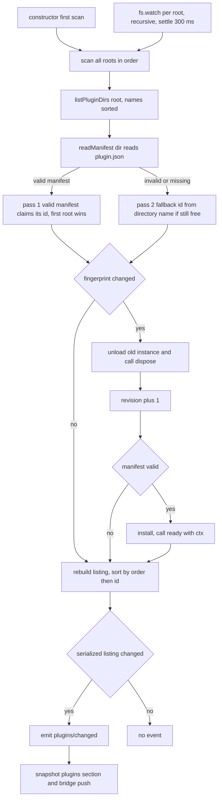
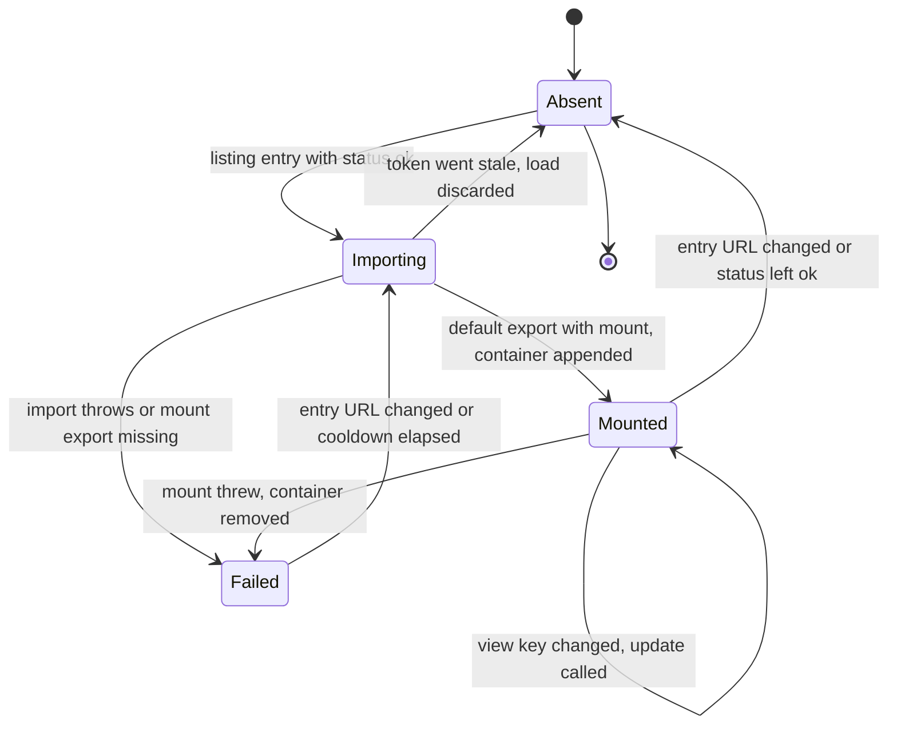

# Desktop component plugin host: manifest, protocol and lifecycle

<!-- openwiki: broken internal link [/repo://app/src/main/index.ts#L19-L26] file "/repo://app/src/main/index.ts" does not exist. Fix the href or restore the target, then delete this comment. -->
<!-- openwiki: broken internal link [/repo://README.md#L92-L99] file "/repo://README.md" does not exist. Fix the href or restore the target, then delete this comment. -->
<!-- openwiki: broken internal link [/repo://app/src/renderer/main.ts#L698-L710] file "/repo://app/src/renderer/main.ts" does not exist. Fix the href or restore the target, then delete this comment. -->
Every data card on the panel — clock, weather, sessions, hardware — is a plugin. There is no separate code path for built-in cards: `dist/renderer/cards/*` are scanned as the first plugin root, so a built-in card and a third-party component are the same kind of thing under the same contract. (The calendar grid and the settings overlay stay host-page code; the plugin system covers the components that carry kernel data.) ([index.ts](/repo://app/src/main/index.ts#L19-L26), [README.md](/repo://README.md#L92-L99), [main.ts](/repo://app/src/renderer/main.ts#L698-L710)).

The host is deliberately split into small files, each with one reason to exist:

| Piece | File | Responsibility |
|---|---|---|
| Declarative contract | `app/src/main/plugins/manifest.ts` | parse and validate `plugin.json`; pure logic, no fs, no Electron |
| Installation and lifecycle | `app/src/main/plugins/service.ts` | scan roots, install/uninstall/reload instances, keep the listing, emit `plugins/changed` |
| Asset delivery | `app/src/main/plugins/assets.ts` (pure) + `app/src/main/plugins/protocol.ts` (Electron wiring) | `deck-plugin://<id>/<path>` → disk file + MIME, served from the main process only |
| Watchdog | `app/src/main/plugins/watch.ts` | `fs.watch` per root, storm settling, root creation |
| Runtime | `app/src/renderer/plugins.ts` | dynamic `import`, mount/update/unmount, generation tokens, failure cooldown |

<!-- openwiki: broken internal link [/repo://app/src/main/plugins/service.ts#L10-L22] file "/repo://app/src/main/plugins/service.ts" does not exist. Fix the href or restore the target, then delete this comment. -->
<!-- openwiki: broken internal link [/repo://app/src/renderer/plugins.ts#L1-L6] file "/repo://app/src/renderer/plugins.ts" does not exist. Fix the href or restore the target, then delete this comment. -->
The service states its own boundary as four jobs: scan → validate → install in a cordis subset → watch and push; the trimming of per-plugin data deliberately happens on the other side of the process line, because only the page can assemble a view ([service.ts](/repo://app/src/main/plugins/service.ts#L10-L22), [plugins.ts](/repo://app/src/renderer/plugins.ts#L1-L6)).

## The manifest contract

<!-- openwiki: broken internal link [/repo://app/src/main/plugins/manifest.ts#L19] file "/repo://app/src/main/plugins/manifest.ts" does not exist. Fix the href or restore the target, then delete this comment. -->
<!-- openwiki: broken internal link [/repo://app/scripts/copy-assets.mjs#L10-L19] file "/repo://app/scripts/copy-assets.mjs" does not exist. Fix the href or restore the target, then delete this comment. -->
A plugin is a directory containing `plugin.json` and an entry module. `MANIFEST_FILE` is the only file the host looks for; a directory without it is not a plugin at all ([manifest.ts](/repo://app/src/main/plugins/manifest.ts#L19), [copy-assets.mjs](/repo://app/scripts/copy-assets.mjs#L10-L19)).

| Field | Required | Validation | Effect |
|---|---|---|---|
| `id` | yes | `/^[a-z0-9][a-z0-9._-]*$/` — lowercase hostname charset | doubles as the `deck-plugin://` host name, so the charset is an addressing-safety rule, not cosmetics |
| `name` | yes | non-empty after trim | panel-readable label only; never used for addressing |
| `version` | yes | non-empty after trim | not used for addressing, but any change is an asset change → reload |
| `entry` | yes | must end `.js`/`.mjs`; no leading `/`, no drive letter, no backslash, no `..` segment | renderer entry module inside the plugin directory |
| `capabilities` | no | array; each string filtered against `PLUGIN_CAPABILITIES`, duplicates removed | which snapshot sections the plugin may read |
| `mount` | no | trimmed non-empty string | element id to append the container to; absent → `document.body` |
| `order` | no | finite number | mount ordering; absent → `DEFAULT_PLUGIN_ORDER` (1000) |

Two failure policies are worth keeping straight, because they differ:

<!-- openwiki: broken internal link [/repo://app/src/main/plugins/manifest.ts#L39-L59] file "/repo://app/src/main/plugins/manifest.ts" does not exist. Fix the href or restore the target, then delete this comment. -->
- **Missing or invalid required field → the whole manifest is rejected** and the plugin is not installed. The error text is Chinese and specific (`plugin.json 缺 id`, `plugin.json entry 非法（须为插件目录内的 .js/.mjs）: …`) ([manifest.ts](/repo://app/src/main/plugins/manifest.ts#L39-L59)).
<!-- openwiki: broken internal link [/repo://app/src/main/plugins/manifest.ts#L59-L68] file "/repo://app/src/main/plugins/manifest.ts" does not exist. Fix the href or restore the target, then delete this comment. -->
<!-- openwiki: broken internal link [/repo://app/tests/plugins/manifest.spec.ts#L73-L94] file "/repo://app/tests/plugins/manifest.spec.ts" does not exist. Fix the href or restore the target, then delete this comment. -->
- **Bad optional field → that field is dropped, the manifest survives.** An unrecognized capability string, a non-array `capabilities`, a non-numeric `order` or a non-string `mount` all degrade to "not declared" instead of killing the plugin — "少给而非不给" (*give less rather than nothing*) ([manifest.ts](/repo://app/src/main/plugins/manifest.ts#L59-L68), [manifest.spec.ts](/repo://app/tests/plugins/manifest.spec.ts#L73-L94)).

<!-- openwiki: broken internal link [/repo://app/src/main/plugins/manifest.ts#L71-L85] file "/repo://app/src/main/plugins/manifest.ts" does not exist. Fix the href or restore the target, then delete this comment. -->
`readManifest` folds a missing file and unparsable JSON into the same shape as a validation failure: one error, no plugin ([manifest.ts](/repo://app/src/main/plugins/manifest.ts#L71-L85)).

<!-- openwiki: broken internal link [/repo://app/src/shared/contract.ts#L137-L148] file "/repo://app/src/shared/contract.ts" does not exist. Fix the href or restore the target, then delete this comment. -->
<!-- openwiki: broken internal link [/repo://app/tests/contract.spec.ts#L546-L566] file "/repo://app/tests/contract.spec.ts" does not exist. Fix the href or restore the target, then delete this comment. -->
The capability vocabulary is one-to-one with snapshot section names — `clock`, `sessions`, `hardware`, `weather`, `desktop`, `layout`, `settings` — and `PLUGIN_CAPABILITIES` is the single registry for it, so adding a snapshot section means registering it there ([contract.ts](/repo://app/src/shared/contract.ts#L137-L148)). Retiring a section is the precedent for narrowing it: when the `qoder` section was removed, an old manifest declaring `capabilities: ["qoder", "clock"]` stayed valid and was simply trimmed to `["clock"]` ([contract.spec.ts](/repo://app/tests/contract.spec.ts#L546-L566)).

## Discovery: roots, precedence, fingerprints

<!-- openwiki: broken internal link [/repo://app/src/main/plugins/service.ts#L99-L111] file "/repo://app/src/main/plugins/service.ts" does not exist. Fix the href or restore the target, then delete this comment. -->
<!-- openwiki: broken internal link [/repo://app/src/main/services/bridge.ts#L37-L48] file "/repo://app/src/main/services/bridge.ts" does not exist. Fix the href or restore the target, then delete this comment. -->
<!-- openwiki: broken internal link [/repo://app/src/main/kernel.ts#L83-L84] file "/repo://app/src/main/kernel.ts" does not exist. Fix the href or restore the target, then delete this comment. -->
<!-- openwiki: broken internal link [/repo://app/src/main/panel-kernel.ts#L40-L41] file "/repo://app/src/main/panel-kernel.ts" does not exist. Fix the href or restore the target, then delete this comment. -->
`PluginHostService` is a cordis `Service` registered as `plugins`, and it performs its first scan inside its constructor — not on a timer — so the very first snapshot already carries the component listing ([service.ts](/repo://app/src/main/plugins/service.ts#L99-L111), [bridge.ts](/repo://app/src/main/services/bridge.ts#L37-L48)). The kernel assemblies register it with `roots: []` as the spread-in default, so an offline kernel installs nothing and creates no directory; production passes the two real roots ([kernel.ts](/repo://app/src/main/kernel.ts#L83-L84), [panel-kernel.ts](/repo://app/src/main/panel-kernel.ts#L40-L41)).

```ts
plugins: { roots: [BUILTIN_CARDS_ROOT, config.plugins.dir || userDataPath('plugins')] }
```

<!-- openwiki: broken internal link [/repo://app/src/main/index.ts#L20-L26] file "/repo://app/src/main/index.ts" does not exist. Fix the href or restore the target, then delete this comment. -->
<!-- openwiki: broken internal link [/repo://app/src/main/index.ts#L91-L92] file "/repo://app/src/main/index.ts" does not exist. Fix the href or restore the target, then delete this comment. -->
<!-- openwiki: broken internal link [/repo://app/src/main/config.ts#L50-L58] file "/repo://app/src/main/config.ts" does not exist. Fix the href or restore the target, then delete this comment. -->
<!-- openwiki: broken internal link [/repo://app/src/main/paths.ts#L7-L14] file "/repo://app/src/main/paths.ts" does not exist. Fix the href or restore the target, then delete this comment. -->
`BUILTIN_CARDS_ROOT` is `dist/renderer/cards`; the user root defaults to `userData/plugins` because `config.ts` is a pure module that must not import Electron, so `config.plugins.dir` is an empty string meaning "use the default" ([index.ts](/repo://app/src/main/index.ts#L20-L26), [index.ts](/repo://app/src/main/index.ts#L91-L92), [config.ts](/repo://app/src/main/config.ts#L50-L58), [paths.ts](/repo://app/src/main/paths.ts#L7-L14)).

<!-- openwiki: broken internal link [/repo://app/src/main/plugins/service.ts#L180-L219] file "/repo://app/src/main/plugins/service.ts" does not exist. Fix the href or restore the target, then delete this comment. -->
Scanning is a two-pass algorithm whose whole point is that **a valid manifest always beats a broken directory** for an id ([service.ts](/repo://app/src/main/plugins/service.ts#L180-L219)):

1. Enumerate every root in order; inside a root, subdirectories sorted by name, so the scan order is stable.
2. Pass 1 — every candidate directory is read with `readManifest`; those with a valid manifest claim that manifest's id. First root wins, and a later duplicate valid id is warned about and ignored.
3. Pass 2 — directories whose `plugin.json` is missing or invalid enter under a fallback id derived from the directory name (lowercased, non-hostname characters replaced with `-`, leading non-alphanumerics stripped, `broken` when that leaves nothing) — and only if that id is still free.

<!-- openwiki: broken internal link [/repo://app/tests/plugins/service.spec.ts#L92-L101] file "/repo://app/tests/plugins/service.spec.ts" does not exist. Fix the href or restore the target, then delete this comment. -->
<!-- openwiki: broken internal link [/repo://app/src/main/plugins/service.ts#L231-L240] file "/repo://app/src/main/plugins/service.ts" does not exist. Fix the href or restore the target, then delete this comment. -->
The precedence is about ids, not about status: a directory carrying a broken `plugin.json` under the name `clock` cannot take the built-in clock card's id, and two valid plugins claiming the same id resolve by root order, so the built-in root always wins ([service.spec.ts](/repo://app/tests/plugins/service.spec.ts#L92-L101)). A valid manifest whose entry file is missing is not "broken" in this sense — it still claims its id and appears in the listing with `status: 'error'` ([service.ts](/repo://app/src/main/plugins/service.ts#L231-L240)).

### Fingerprints, revisions and the listing

<!-- openwiki: broken internal link [/repo://app/src/main/plugins/service.ts#L53-L80] file "/repo://app/src/main/plugins/service.ts" does not exist. Fix the href or restore the target, then delete this comment. -->
Each scanned entry carries a fingerprint: the serialized manifest plus the entry module's `mtimeMs:size` (`missing` when absent) ([service.ts](/repo://app/src/main/plugins/service.ts#L53-L80)). `rescan()` diffs fingerprints per id and acts on the difference:

- **new id** → install, `revision = 1`
- **existing id, new fingerprint** → unload the old instance, bump `revision`, install again (this *is* reload)
- **id disappeared** → unload, drop the generation record
- **same fingerprint** → nothing but a fresh `PluginInfo`

<!-- openwiki: broken internal link [/repo://app/src/main/plugins/service.ts#L134-L165] file "/repo://app/src/main/plugins/service.ts" does not exist. Fix the href or restore the target, then delete this comment. -->
<!-- openwiki: broken internal link [/repo://app/src/main/plugins/service.ts#L82-L85] file "/repo://app/src/main/plugins/service.ts" does not exist. Fix the href or restore the target, then delete this comment. -->
<!-- openwiki: broken internal link [/repo://app/tests/plugins/service.spec.ts#L103-L111] file "/repo://app/tests/plugins/service.spec.ts" does not exist. Fix the href or restore the target, then delete this comment. -->
<!-- openwiki: broken internal link [/repo://app/tests/plugins/service.spec.ts#L203-L211] file "/repo://app/tests/plugins/service.spec.ts" does not exist. Fix the href or restore the target, then delete this comment. -->
Then the listing is rebuilt and sorted by `order` ascending, ties broken by id lexicographically — deterministic regardless of scan order — and `plugins/changed` is emitted **only when the serialized listing changed** ([service.ts](/repo://app/src/main/plugins/service.ts#L134-L165), [service.ts](/repo://app/src/main/plugins/service.ts#L82-L85), [service.spec.ts](/repo://app/tests/plugins/service.spec.ts#L103-L111), [service.spec.ts](/repo://app/tests/plugins/service.spec.ts#L203-L211)).

<!-- openwiki: broken internal link [/repo://app/src/main/plugins/service.ts#L78-L80] file "/repo://app/src/main/plugins/service.ts" does not exist. Fix the href or restore the target, then delete this comment. -->
<!-- openwiki: broken internal link [/repo://app/tests/plugins/service.spec.ts#L177-L201] file "/repo://app/tests/plugins/service.spec.ts" does not exist. Fix the href or restore the target, then delete this comment. -->
One consequence plugin authors should know: the fingerprint watches the manifest text and the **entry file only**. Editing another asset in the same directory (a stylesheet, a sub-directory module) triggers a rescan from the watchdog but produces the same fingerprint, so no reload happens and the renderer keeps the module instance it already imported. Touching the entry module or `plugin.json` is what forces a new generation ([service.ts](/repo://app/src/main/plugins/service.ts#L78-L80), [service.spec.ts](/repo://app/tests/plugins/service.spec.ts#L177-L201)).

<!-- openwiki: broken internal link [/repo://app/src/main/plugins/service.ts#L221-L250] file "/repo://app/src/main/plugins/service.ts" does not exist. Fix the href or restore the target, then delete this comment. -->
`PluginInfo.entry` is the manifest entry with `./` stripped, wrapped as `deck-plugin://<id>/<entry>?v=<revision>` — a URL that is unique per generation, which is the only lever available against the renderer's ESM module cache ([service.ts](/repo://app/src/main/plugins/service.ts#L221-L250)).

## Lifecycle in the host

<!-- openwiki: broken internal link [/repo://app/src/main/plugins/service.ts#L30-L51] file "/repo://app/src/main/plugins/service.ts" does not exist. Fix the href or restore the target, then delete this comment. -->
<!-- openwiki: broken internal link [/repo://app/src/main/plugins/service.ts#L270-L279] file "/repo://app/src/main/plugins/service.ts" does not exist. Fix the href or restore the target, then delete this comment. -->
Instances follow a deliberately small cordis subset: `ready(ctx)` when installed, `dispose()` when removed, with `ctx` injection available so a plugin's main-process side can reach kernel services. The plugin directory (the protocol asset root) and the `PluginInfo` are handed to the instance at construction ([service.ts](/repo://app/src/main/plugins/service.ts#L30-L51)). The default factory does nothing in either hook — today's desktop components render in the page and own no main-process resource, so the hooks exist as contract positions ([service.ts](/repo://app/src/main/plugins/service.ts#L270-L279)).



*One rescan: the watchdog and the constructor feed the same scan, fingerprints decide load versus reload, and only a real listing change reaches the renderer.*

Failure handling is uniform: one bad plugin never blocks the rest.

<!-- openwiki: broken internal link [/repo://app/src/main/plugins/service.ts#L148-L151] file "/repo://app/src/main/plugins/service.ts" does not exist. Fix the href or restore the target, then delete this comment. -->
<!-- openwiki: broken internal link [/repo://app/tests/contract.spec.ts#L511-L527] file "/repo://app/tests/contract.spec.ts" does not exist. Fix the href or restore the target, then delete this comment. -->
- A directory whose manifest is invalid produces no instance at all — "no contract, no executable declaration" — and appears in the listing as `status: 'error'` with `entry: ''`, so the renderer has nothing to import ([service.ts](/repo://app/src/main/plugins/service.ts#L148-L151), [contract.spec.ts](/repo://app/tests/contract.spec.ts#L511-L527)).
<!-- openwiki: broken internal link [/repo://app/src/main/plugins/service.ts#L231-L240] file "/repo://app/src/main/plugins/service.ts" does not exist. Fix the href or restore the target, then delete this comment. -->
<!-- openwiki: broken internal link [/repo://app/tests/plugins/service.spec.ts#L81-L90] file "/repo://app/tests/plugins/service.spec.ts" does not exist. Fix the href or restore the target, then delete this comment. -->
- A valid manifest whose entry asset is missing is also `status: 'error'` with a reason and an empty entry: shipping a component that cannot open is worse than shipping nothing ([service.ts](/repo://app/src/main/plugins/service.ts#L231-L240), [service.spec.ts](/repo://app/tests/plugins/service.spec.ts#L81-L90)).
<!-- openwiki: broken internal link [/repo://app/src/main/plugins/service.ts#L167-L178] file "/repo://app/src/main/plugins/service.ts" does not exist. Fix the href or restore the target, then delete this comment. -->
<!-- openwiki: broken internal link [/repo://app/src/main/plugins/service.ts#L252-L261] file "/repo://app/src/main/plugins/service.ts" does not exist. Fix the href or restore the target, then delete this comment. -->
- A synchronous throw from `ready()` removes the instance from the live map and logs; a throw from `dispose()` is caught, warned, and the plugin still leaves the live map ([service.ts](/repo://app/src/main/plugins/service.ts#L167-L178), [service.ts](/repo://app/src/main/plugins/service.ts#L252-L261)).
<!-- openwiki: broken internal link [/repo://app/src/main/plugins/service.ts#L263-L267] file "/repo://app/src/main/plugins/service.ts" does not exist. Fix the href or restore the target, then delete this comment. -->
- Teardown is idempotent: `ctx.on('dispose')` may fire more than once, so `disposeAll` guards with a `stopped` flag and unloads every remaining instance exactly once ([service.ts](/repo://app/src/main/plugins/service.ts#L263-L267), [cordis-kernel-and-services](/openwiki/architecture/cordis-kernel-and-services.md)).

### Why the watcher creates the directory first

<!-- openwiki: broken internal link [/repo://app/src/main/plugins/watch.ts#L1-L49] file "/repo://app/src/main/plugins/watch.ts" does not exist. Fix the href or restore the target, then delete this comment. -->
<!-- openwiki: broken internal link [/repo://app/src/main/plugins/service.ts#L107-L109] file "/repo://app/src/main/plugins/service.ts" does not exist. Fix the href or restore the target, then delete this comment. -->
<!-- openwiki: broken internal link [/repo://app/tests/plugins/service.spec.ts#L296-L313] file "/repo://app/tests/plugins/service.spec.ts" does not exist. Fix the href or restore the target, then delete this comment. -->
An installation location that does not exist yet is the normal case on a first run: `watchPluginRoots` runs `fs.mkdirSync(dir, { recursive: true })` before `fs.watch`, otherwise the first "plugin dropped in" event can never arrive. Each root is watched recursively so editing a plugin's own `card.js` reloads it. Events are merged through a settle window (default 300 ms, `settleMs`): the callback fires once after the last event quiets down. A root that cannot be created or watched is silently skipped — the explicit `rescan()` remains the fallback — and the returned closer clears the pending timer and closes every watcher ([watch.ts](/repo://app/src/main/plugins/watch.ts#L1-L49), [service.ts](/repo://app/src/main/plugins/service.ts#L107-L109), [service.spec.ts](/repo://app/tests/plugins/service.spec.ts#L296-L313)).

<!-- openwiki: broken internal link [/repo://app/src/shared/contract.ts#L263-L267] file "/repo://app/src/shared/contract.ts" does not exist. Fix the href or restore the target, then delete this comment. -->
<!-- openwiki: broken internal link [/repo://app/src/main/cordis.d.ts#L27-L28] file "/repo://app/src/main/cordis.d.ts" does not exist. Fix the href or restore the target, then delete this comment. -->
<!-- openwiki: broken internal link [/repo://app/src/main/panel-ipc.ts#L30-L36] file "/repo://app/src/main/panel-ipc.ts" does not exist. Fix the href or restore the target, then delete this comment. -->
<!-- openwiki: broken internal link [/repo://app/src/renderer/main.ts#L756-L763] file "/repo://app/src/renderer/main.ts" does not exist. Fix the href or restore the target, then delete this comment. -->
Change propagation is intentionally out-of-band: `plugins/changed` exists so hot-plugging is visible without waiting for the 1 Hz snapshot. It is emitted on the cordis context, declared in both the cordis `Events` augmentation and `BridgeEvents`, forwarded by `FORWARDED_EVENTS` over `deck:bridge-event`, and applied by the page against its last snapshot ([contract.ts](/repo://app/src/shared/contract.ts#L263-L267), [cordis.d.ts](/repo://app/src/main/cordis.d.ts#L27-L28), [panel-ipc.ts](/repo://app/src/main/panel-ipc.ts#L30-L36), [main.ts](/repo://app/src/renderer/main.ts#L756-L763), [bridge-contract-and-ipc](/openwiki/architecture/bridge-contract-and-ipc.md)).

## `deck-plugin://` — addressing, escapes and MIME

<!-- openwiki: broken internal link [/repo://app/src/main/plugins/assets.ts#L12-L22] file "/repo://app/src/main/plugins/assets.ts" does not exist. Fix the href or restore the target, then delete this comment. -->
<!-- openwiki: broken internal link [/repo://app/src/main/plugins/protocol.ts#L31-L34] file "/repo://app/src/main/plugins/protocol.ts" does not exist. Fix the href or restore the target, then delete this comment. -->
<!-- openwiki: broken internal link [/repo://app/src/renderer/main.ts#L170-L171] file "/repo://app/src/renderer/main.ts" does not exist. Fix the href or restore the target, then delete this comment. -->
Plugin assets are not read through a preload API. They are served like files: a privileged custom scheme whose **host name is the plugin id**. `app` is reserved for the panel's own renderer root, which means the page itself loads from `deck-plugin://app/index.html` and shares scheme (and therefore ESM module semantics) with the plugin modules it imports ([assets.ts](/repo://app/src/main/plugins/assets.ts#L12-L22), [protocol.ts](/repo://app/src/main/plugins/protocol.ts#L31-L34), [main.ts](/repo://app/src/renderer/main.ts#L170-L171)).

<!-- openwiki: broken internal link [/repo://app/src/main/index.ts#L31-L32] file "/repo://app/src/main/index.ts" does not exist. Fix the href or restore the target, then delete this comment. -->
<!-- openwiki: broken internal link [/repo://app/src/main/index.ts#L106-L113] file "/repo://app/src/main/index.ts" does not exist. Fix the href or restore the target, then delete this comment. -->
<!-- openwiki: broken internal link [/repo://app/src/main/plugins/protocol.ts#L6-L13] file "/repo://app/src/main/plugins/protocol.ts" does not exist. Fix the href or restore the target, then delete this comment. -->
<!-- openwiki: broken internal link [/repo://app/src/main/plugins/protocol.ts#L15-L29] file "/repo://app/src/main/plugins/protocol.ts" does not exist. Fix the href or restore the target, then delete this comment. -->
<!-- openwiki: broken internal link [/repo://app/src/main/plugins/protocol.ts#L48-L57] file "/repo://app/src/main/plugins/protocol.ts" does not exist. Fix the href or restore the target, then delete this comment. -->
Timing is a hard constraint, and the comment in `protocol.ts` says so: `registerPluginScheme()` must run before `app ready` (it is called at module top level), while `installPluginProtocol()` must run after the kernel has started and before the window loads the page, so the asset roots are known when the first module request arrives ([index.ts](/repo://app/src/main/index.ts#L31-L32), [index.ts](/repo://app/src/main/index.ts#L106-L113), [protocol.ts](/repo://app/src/main/plugins/protocol.ts#L6-L13)). The privileges registered are `standard`, `secure`, `supportFetchAPI`, `corsEnabled` and `stream`: `standard` makes the scheme origin-bearing, `secure` is what lets the page load ES modules at all, and `corsEnabled` plus the response's `access-control-allow-origin: *` is what permits a page on host `app` to import a module on host `clock` — different host names are different origins ([protocol.ts](/repo://app/src/main/plugins/protocol.ts#L15-L29), [protocol.ts](/repo://app/src/main/plugins/protocol.ts#L48-L57)).

<!-- openwiki: broken internal link [/repo://app/src/main/plugins/protocol.ts#L40-L47] file "/repo://app/src/main/plugins/protocol.ts" does not exist. Fix the href or restore the target, then delete this comment. -->
<!-- openwiki: broken internal link [/repo://app/src/main/plugins/service.ts#L122-L128] file "/repo://app/src/main/plugins/service.ts" does not exist. Fix the href or restore the target, then delete this comment. -->
The asset roots are rebuilt **per request** from the app root plus `host.allDirs()`, the live instance map — so a plugin's files become addressable the moment it is installed and stop resolving the moment it is removed, without re-registering the protocol ([protocol.ts](/repo://app/src/main/plugins/protocol.ts#L40-L47), [service.ts](/repo://app/src/main/plugins/service.ts#L122-L128)). Unknown host → 404.

<!-- openwiki: broken internal link [/repo://app/src/main/plugins/assets.ts#L46-L89] file "/repo://app/src/main/plugins/assets.ts" does not exist. Fix the href or restore the target, then delete this comment. -->
`resolveAssetUrl` is pure (no Electron import) and returns `null` — which the handler turns into a 404 — for every one of these ([assets.ts](/repo://app/src/main/plugins/assets.ts#L46-L89)):

| Rejection | Mechanism |
|---|---|
| wrong scheme | `url.protocol !== 'deck-plugin:'` |
<!-- openwiki: broken internal link [/repo://app/tests/plugins/assets.spec.ts#L88-L95] file "/repo://app/tests/plugins/assets.spec.ts" does not exist. Fix the href or restore the target, then delete this comment. -->
| unregistered host | exact host lookup in the root list; the id charset is lowercase, so `deck-plugin://CLOCK/…` never matches ([assets.spec.ts](/repo://app/tests/plugins/assets.spec.ts#L88-L95)) |
| malformed percent-encoding | `decodeURIComponent` throws |
| NUL or backslash in the path | explicit reject |
| path escaping the root | `path.resolve(root, pathname)` then "still inside root" check |
| directory target | `statSync(...).isFile()` must hold |
| absent file, unreadable path | `statSync` throws |
| type not in the delivery whitelist | extension lookup returns `null` |

<!-- openwiki: broken internal link [/repo://app/src/main/plugins/assets.ts#L24-L39] file "/repo://app/src/main/plugins/assets.ts" does not exist. Fix the href or restore the target, then delete this comment. -->
<!-- openwiki: broken internal link [/repo://app/tests/plugins/assets.spec.ts#L98-L119] file "/repo://app/tests/plugins/assets.spec.ts" does not exist. Fix the href or restore the target, then delete this comment. -->
That whitelist is the *delivery* policy, not just a header nicety: `.js` and `.mjs` must go out as `text/javascript` or the module is refused, and unknown types are never served at all ([assets.ts](/repo://app/src/main/plugins/assets.ts#L24-L39), [assets.spec.ts](/repo://app/tests/plugins/assets.spec.ts#L98-L119)):

| Extension | MIME |
|---|---|
| `.js`, `.mjs` | `text/javascript` |
| `.css` | `text/css` |
| `.json` | `application/json` |
| `.html` | `text/html` |
| `.svg` | `image/svg+xml` |
| `.png` | `image/png` |
| `.woff2` | `font/woff2` |

<!-- openwiki: broken internal link [/repo://app/src/main/plugins/protocol.ts#L48-L57] file "/repo://app/src/main/plugins/protocol.ts" does not exist. Fix the href or restore the target, then delete this comment. -->
Every successful response adds `charset=utf-8` and `cache-control: no-store` — so the revision query parameter is not about HTTP caching but about giving the renderer a URL it has never imported before ([protocol.ts](/repo://app/src/main/plugins/protocol.ts#L48-L57)).

<!-- openwiki: broken internal link [/repo://app/tests/plugins/assets.spec.ts#L51-L87] file "/repo://app/tests/plugins/assets.spec.ts" does not exist. Fix the href or restore the target, then delete this comment. -->
Escape attempts are pinned by test cases rather than by review: `../secret.txt`, `%2e%2e/secret.txt`, `a/b/../../../secret.txt`, `..\secret.txt` and `card%00.js` all resolve to `null`, as do a non-`deck-plugin` scheme (`https:`, `file:`), a directory target, and an empty root list ([assets.spec.ts](/repo://app/tests/plugins/assets.spec.ts#L51-L87)).

### Security framing

<!-- openwiki: broken internal link [/repo://app/src/main/panel-window.ts#L31-L36] file "/repo://app/src/main/panel-window.ts" does not exist. Fix the href or restore the target, then delete this comment. -->
<!-- openwiki: broken internal link [/repo://app/src/main/plugins/protocol.ts#L36-L39] file "/repo://app/src/main/plugins/protocol.ts" does not exist. Fix the href or restore the target, then delete this comment. -->
<!-- openwiki: broken internal link [/repo://app/tests/contract.spec.ts#L529-L534] file "/repo://app/tests/contract.spec.ts" does not exist. Fix the href or restore the target, then delete this comment. -->
All file reads happen in the main process, in `installPluginProtocol`'s handler. The renderer keeps `contextIsolation: true`, `sandbox: true` and `nodeIntegration: false`, and its only privileged surface is the preload's IPC forwarder — it never holds a filesystem handle ([panel-window.ts](/repo://app/src/main/panel-window.ts#L31-L36), [protocol.ts](/repo://app/src/main/plugins/protocol.ts#L36-L39)). A source-level guard in the kernel contract suite enforces the intent: the renderer plugin runtime must contain no `require(` / `node:fs`, and the preload no `readFileSync` ([contract.spec.ts](/repo://app/tests/contract.spec.ts#L529-L534)).

<!-- openwiki: broken internal link [/repo://app/src/renderer/plugins.ts#L124-L150] file "/repo://app/src/renderer/plugins.ts" does not exist. Fix the href or restore the target, then delete this comment. -->
<!-- openwiki: broken internal link [/repo://app/src/renderer/global.d.ts#L21-L41] file "/repo://app/src/renderer/global.d.ts" does not exist. Fix the href or restore the target, then delete this comment. -->
<!-- openwiki: broken internal link [/repo://app/src/renderer/cards/weather/card.ts#L28-L40] file "/repo://app/src/renderer/cards/weather/card.ts" does not exist. Fix the href or restore the target, then delete this comment. -->
One honest caveat belongs here. Capability trimming narrows **data**, not privileges: the plugin module is dynamically imported into the panel page's own realm, so it can reach `window.deck` and the DOM directly, and a plugin's own network access is the page's ([plugins.ts](/repo://app/src/renderer/plugins.ts#L124-L150), [global.d.ts](/repo://app/src/renderer/global.d.ts#L21-L41), [weather card](/repo://app/src/renderer/cards/weather/card.ts#L28-L40)). The capability list is a contract between host and plugin about which snapshot sections the host will hand over — not a sandbox for untrusted code.

## Why plugins stay single-file with zero relative imports

<!-- openwiki: broken internal link [/repo://app/src/renderer/format.ts#L1-L6] file "/repo://app/src/renderer/format.ts" does not exist. Fix the href or restore the target, then delete this comment. -->
<!-- openwiki: broken internal link [/repo://README.md#L92-L99] file "/repo://README.md" does not exist. Fix the href or restore the target, then delete this comment. -->
An asset URL is `deck-plugin://<plugin id>/<path>`, so a relative specifier inside a plugin module resolves against **that plugin's own root** — `../../plugins.js` resolves to something inside the plugin directory, never to a sibling of it. Files outside the plugin directory simply do not exist in the addressing space: they belong to another host (`app`, or another plugin id), and the relative import fails before any whitelist question arises. The real-machine failure this encodes is recorded in the source: the first run of five cards died wholesale on exactly this, which is stated as a design rule in `format.ts` ([format.ts](/repo://app/src/renderer/format.ts#L1-L6), [README.md](/repo://README.md#L92-L99)).

<!-- openwiki: broken internal link [/repo://app/src/renderer/plugins.ts#L13-L25] file "/repo://app/src/renderer/plugins.ts" does not exist. Fix the href or restore the target, then delete this comment. -->
<!-- openwiki: broken internal link [/repo://app/src/renderer/plugins.ts#L28-L39] file "/repo://app/src/renderer/plugins.ts" does not exist. Fix the href or restore the target, then delete this comment. -->
<!-- openwiki: broken internal link [/repo://app/src/renderer/cards/clock/card.ts#L1-L2] file "/repo://app/src/renderer/cards/clock/card.ts" does not exist. Fix the href or restore the target, then delete this comment. -->
<!-- openwiki: broken internal link [/repo://app/tsconfig.renderer.json#L1-L16] file "/repo://app/tsconfig.renderer.json" does not exist. Fix the href or restore the target, then delete this comment. -->
<!-- openwiki: broken internal link [/repo://app/tests/plugins/assets.spec.ts#L43-L49] file "/repo://app/tests/plugins/assets.spec.ts" does not exist. Fix the href or restore the target, then delete this comment. -->
The resolution is to hand the shared presentation helpers to the plugin instead of letting it import them: `PluginHost.util` carries `pad`, `pad3`, `pct` and `esc`, and a plugin keeps a single entry module with a single default export ([plugins.ts](/repo://app/src/renderer/plugins.ts#L13-L25), [plugins.ts](/repo://app/src/renderer/plugins.ts#L28-L39)). The built-in cards follow the rule mechanically rather than by discipline: they are TypeScript whose only imports are `import type`, which `tsc` erases when it emits the `es2022` module, so the built `card.js` carries no import statements at all ([cards/clock/card.ts](/repo://app/src/renderer/cards/clock/card.ts#L1-L2), [tsconfig.renderer.json](/repo://app/tsconfig.renderer.json#L1-L16)). A sub-directory *inside* a plugin directory remains addressable if a plugin really wants to split files — `deck-plugin://clock/lib/util.js` resolves — but nothing shared can be reached that way ([assets.spec.ts](/repo://app/tests/plugins/assets.spec.ts#L43-L49)).

## The renderer runtime

<!-- openwiki: broken internal link [/repo://app/src/renderer/plugins.ts#L51-L85] file "/repo://app/src/renderer/plugins.ts" does not exist. Fix the href or restore the target, then delete this comment. -->
The page owns three maps and, through them, the whole component lifecycle ([plugins.ts](/repo://app/src/renderer/plugins.ts#L51-L85)):

- `mounted: Map<id, Mounted>` — the live components, with the API object, the host-created container, the current trimmed view, the view key, and the entry URL the mount was based on.
- `generations: Map<id, number>` — a **per-plugin** in-flight token. It is bumped on unmount and on reload; a mount that finishes after its token went stale is discarded. The comment records why it is not one global counter: with a single counter, five cards importing concurrently invalidated each other and the first screen lost four cards for four seconds.
- `failed: Map<id, { entry, at }>` — the failure ledger, cooldown `FAIL_RETRY_MS = 30_000`. Retrying every tick turned one 404 card into 88 evidence lines in two seconds; never retrying would leave a built-in card permanently missing after a transient failure, because a built-in's entry URL never changes. Hence: no retry inside the cooldown, one chance after it, and an immediate chance whenever the entry URL changes.

<!-- openwiki: broken internal link [/repo://app/src/renderer/plugins.ts#L165-L196] file "/repo://app/src/renderer/plugins.ts" does not exist. Fix the href or restore the target, then delete this comment. -->
<!-- openwiki: broken internal link [/repo://app/src/renderer/main.ts#L698-L704] file "/repo://app/src/renderer/main.ts" does not exist. Fix the href or restore the target, then delete this comment. -->
`syncPlugins(list, snap, deps)` runs on every snapshot and on every `plugins/changed`, and is required to be idempotent — a listing that has not changed must produce no DOM work ([plugins.ts](/repo://app/src/renderer/plugins.ts#L165-L196), [main.ts](/repo://app/src/renderer/main.ts#L698-L704)).



*The renderer-side lifecycle of one component: a stale token is discarded rather than resurrected, and failure is a cooldown state rather than a permanent verdict.*

The load path in detail:

1. **Skip if cooling down.** `failed` holds the same entry URL and the failure is younger than 30 s → return. A new `revision` produces a different URL and retries at once.
<!-- openwiki: broken internal link [/repo://app/src/renderer/plugins.ts#L124-L138] file "/repo://app/src/renderer/plugins.ts" does not exist. Fix the href or restore the target, then delete this comment. -->
2. **Snapshot the token**, then `await import(info.entry)` and take `mod.default ?? mod`; a module without a callable `mount` throws (`模块未导出 mount（default 导出契约对象）`). Failure → record in `failed` and `notify('plugin-load-failed', …)`; nothing is drawn ([plugins.ts](/repo://app/src/renderer/plugins.ts#L124-L138)).
<!-- openwiki: broken internal link [/repo://app/src/renderer/plugins.ts#L139-L140] file "/repo://app/src/renderer/plugins.ts" does not exist. Fix the href or restore the target, then delete this comment. -->
<!-- openwiki: broken internal link [/repo://app/src/renderer/plugins.ts#L108-L122] file "/repo://app/src/renderer/plugins.ts" does not exist. Fix the href or restore the target, then delete this comment. -->
3. **Re-check the token** after the await. If the plugin was unmounted or replaced during the import, drop the result — otherwise a late import would resurrect a component the user just removed ([plugins.ts](/repo://app/src/renderer/plugins.ts#L139-L140), [plugins.ts](/repo://app/src/renderer/plugins.ts#L108-L122)).
4. **Create the container** (`div.deck-plugin`, `dataset.pluginId = id`) and append it to the element named by `manifest.mount`, or to `document.body` when that id is absent or not found.
<!-- openwiki: broken internal link [/repo://app/src/renderer/plugins.ts#L87-L105] file "/repo://app/src/renderer/plugins.ts" does not exist. Fix the href or restore the target, then delete this comment. -->
<!-- openwiki: broken internal link [/repo://app/src/renderer/plugins.ts#L142-L163] file "/repo://app/src/renderer/plugins.ts" does not exist. Fix the href or restore the target, then delete this comment. -->
5. **Trim and mount.** `viewFor` copies only the snapshot sections the manifest declared — capability name equals section name, and a declared capability whose section is missing from the snapshot is simply omitted from the view — then `api.mount(host)`. A throwing `mount` removes the container, records the failure and notifies `plugin-mount-failed`. Success clears the failure record, stores the entry, notifies `plugin-mounted` with id/name/capabilities, and calls `deps.onDomChanged()` ([plugins.ts](/repo://app/src/renderer/plugins.ts#L87-L105), [plugins.ts](/repo://app/src/renderer/plugins.ts#L142-L163)).

The steady state is two comparisons per entry:

<!-- openwiki: broken internal link [/repo://app/src/renderer/plugins.ts#L181-L185] file "/repo://app/src/renderer/plugins.ts" does not exist. Fix the href or restore the target, then delete this comment. -->
- **Entry URL differs** from the stored one → the assets changed generation, so unmount and remount; the `?v=` parameter is the only way around the ESM module cache ([plugins.ts](/repo://app/src/renderer/plugins.ts#L181-L185)).
<!-- openwiki: broken internal link [/repo://app/src/renderer/plugins.ts#L186-L194] file "/repo://app/src/renderer/plugins.ts" does not exist. Fix the href or restore the target, then delete this comment. -->
- **View key differs** (the JSON of the trimmed view) → call `update` with a freshly built host. A throwing `update` is reported as `plugin-update-failed` and leaves the component mounted. If neither differs, nothing happens — which is what keeps a 1 Hz snapshot from touching plugin DOM at all ([plugins.ts](/repo://app/src/renderer/plugins.ts#L186-L194)).

<!-- openwiki: broken internal link [/repo://app/src/renderer/plugins.ts#L106-L122] file "/repo://app/src/renderer/plugins.ts" does not exist. Fix the href or restore the target, then delete this comment. -->
Anything the listing no longer marks `status: 'ok'` is unmounted: the token is bumped, the failure ledger cleared, `api.unmount?.()` called inside a try/catch, and the host's container removed — so the component's own DOM goes with it and the plugin never has to know the container existed ([plugins.ts](/repo://app/src/renderer/plugins.ts#L106-L122)).

### The host surface a plugin is given

| Member | Meaning |
|---|---|
| `el` | the container the plugin draws into (the mount anchor's element when `mount` named one) |
| `view` | `Partial<PanelSnapshot>` trimmed by capabilities; undeclared sections are absent keys, not empty values |
| `util` | `pad`, `pad3`, `pct`, `esc` — the shared helpers the protocol cannot deliver (see above) |
| `notify(type, payload)` | the panel's own evidence channel, straight to the event log |
| `invoke(method, payload)` | the kernel bridge contract; plugins open no channel of their own |

<!-- openwiki: broken internal link [/repo://app/src/renderer/plugins.ts#L41-L49] file "/repo://app/src/renderer/plugins.ts" does not exist. Fix the href or restore the target, then delete this comment. -->
<!-- openwiki: broken internal link [/repo://app/samples/hello-plugin/card.js#L1-L45] file "/repo://app/samples/hello-plugin/card.js" does not exist. Fix the href or restore the target, then delete this comment. -->
<!-- openwiki: broken internal link [/repo://app/samples/hello-plugin/plugin.json#L1-L8] file "/repo://app/samples/hello-plugin/plugin.json" does not exist. Fix the href or restore the target, then delete this comment. -->
The module contract is `mount(host)` plus optional `update(host)` and `unmount()` ([plugins.ts](/repo://app/src/renderer/plugins.ts#L41-L49)). The sample plugin `samples/hello-plugin` is the readable reference for all of it: it declares `capabilities: ["clock"]`, draws a fixed-position card, reads only `host.view.clock`, and reports `hello-mounted` so the acceptance battery can prove the module actually ran — while a second event, `plugin-mounted`, proves the host delivered it ([hello-plugin/card.js](/repo://app/samples/hello-plugin/card.js#L1-L45), [hello-plugin/plugin.json](/repo://app/samples/hello-plugin/plugin.json#L1-L8)).

### Hot-plugging interacts with the click-through model

<!-- openwiki: broken internal link [/repo://app/src/renderer/main.ts#L688-L693] file "/repo://app/src/renderer/main.ts" does not exist. Fix the href or restore the target, then delete this comment. -->
<!-- openwiki: broken internal link [/repo://app/src/renderer/main.ts#L738-L753] file "/repo://app/src/renderer/main.ts" does not exist. Fix the href or restore the target, then delete this comment. -->
The panel ignores mouse events by default and only receives clicks inside declared hot zones; those zones are derived from the DOM at the moment they are declared. Plugin mounting therefore has a second, easy-to-miss effect: `deps.onDomChanged` is `declareHotZones`, which collects every element with class `card` plus the desktop zones, and sends the rectangles to the window host ([main.ts](/repo://app/src/renderer/main.ts#L688-L693), [main.ts](/repo://app/src/renderer/main.ts#L738-L753)).

<!-- openwiki: broken internal link [/repo://app/src/renderer/cards/sessions/card.ts#L65-L80] file "/repo://app/src/renderer/cards/sessions/card.ts" does not exist. Fix the href or restore the target, then delete this comment. -->
<!-- openwiki: broken internal link [/repo://app/accept/battery.js#L2076-L2099] file "/repo://app/accept/battery.js" does not exist. Fix the href or restore the target, then delete this comment. -->
<!-- openwiki: broken internal link [/repo://app/accept/battery.js#L2131-L2151] file "/repo://app/accept/battery.js" does not exist. Fix the href or restore the target, then delete this comment. -->
Practical consequence for plugin authors: a component that wants to be clickable must carry the shared `card` class (and an id, so the rectangle is identifiable) on its own element inside the container — every built-in card does exactly that ([cards/sessions/card.ts](/repo://app/src/renderer/cards/sessions/card.ts#L65-L80)). A component that skips it still renders, but its pixels belong to a pass-through region. The acceptance battery asserts both halves of that: the four built-in cards appear in the hotzone declaration with the clock rectangle matching `index.html`, and a freshly installed sample plugin's card shows up in the hotzones ([battery.js](/repo://app/accept/battery.js#L2076-L2099), [battery.js](/repo://app/accept/battery.js#L2131-L2151), [renderer-panel](/openwiki/architecture/renderer-panel.md)).

## Built-in cards versus the user plugin directory

The built-in cards are ordinary plugins that happen to live in the build output:

<!-- openwiki: broken internal link [/repo://app/package.json#L7-L13] file "/repo://app/package.json" does not exist. Fix the href or restore the target, then delete this comment. -->
<!-- openwiki: broken internal link [/repo://app/scripts/copy-assets.mjs#L10-L19] file "/repo://app/scripts/copy-assets.mjs" does not exist. Fix the href or restore the target, then delete this comment. -->
- Sources are `app/src/renderer/cards/<id>/card.ts` with a `plugin.json` next to them. `tsc -p tsconfig.renderer.json` compiles the entry, and `scripts/copy-assets.mjs` copies each `plugin.json` into `dist/renderer/cards/<id>/` because manifests never pass through the compiler ([package.json](/repo://app/package.json#L7-L13), [copy-assets.mjs](/repo://app/scripts/copy-assets.mjs#L10-L19)).
<!-- openwiki: broken internal link [/repo://app/src/main/index.ts#L20-L26] file "/repo://app/src/main/index.ts" does not exist. Fix the href or restore the target, then delete this comment. -->
- The built-in root is `dist/renderer/cards`, which is also inside the app-root asset tree; each card is still its own protocol host (`deck-plugin://clock/card.js`), distinct from `deck-plugin://app/index.html` ([index.ts](/repo://app/src/main/index.ts#L20-L26)).
<!-- openwiki: broken internal link [/repo://app/src/main/plugins/service.ts#L204-L212] file "/repo://app/src/main/plugins/service.ts" does not exist. Fix the href or restore the target, then delete this comment. -->
<!-- openwiki: broken internal link [/repo://app/tests/plugins/service.spec.ts#L92-L101] file "/repo://app/tests/plugins/service.spec.ts" does not exist. Fix the href or restore the target, then delete this comment. -->
- The built-in root is scanned **first**, so a user plugin that reuses a built-in id is ignored rather than overriding the card; the intended path for a different look is a different id ([service.ts](/repo://app/src/main/plugins/service.ts#L204-L212), [service.spec.ts](/repo://app/tests/plugins/service.spec.ts#L92-L101)).
<!-- openwiki: broken internal link [/repo://app/src/renderer/cards/clock/plugin.json#L1-L8] file "/repo://app/src/renderer/cards/clock/plugin.json" does not exist. Fix the href or restore the target, then delete this comment. -->
<!-- openwiki: broken internal link [/repo://app/src/renderer/cards/weather/plugin.json#L1-L8] file "/repo://app/src/renderer/cards/weather/plugin.json" does not exist. Fix the href or restore the target, then delete this comment. -->
<!-- openwiki: broken internal link [/repo://app/src/renderer/cards/sessions/plugin.json#L1-L8] file "/repo://app/src/renderer/cards/sessions/plugin.json" does not exist. Fix the href or restore the target, then delete this comment. -->
<!-- openwiki: broken internal link [/repo://app/src/renderer/cards/hardware/plugin.json#L1-L8] file "/repo://app/src/renderer/cards/hardware/plugin.json" does not exist. Fix the href or restore the target, then delete this comment. -->
<!-- openwiki: broken internal link [/repo://app/src/main/plugins/service.ts#L24-L25] file "/repo://app/src/main/plugins/service.ts" does not exist. Fix the href or restore the target, then delete this comment. -->
- Current built-in manifests: `clock` order 10, `weather` 20, `sessions` 30, `hardware` 50 — order values that place them ahead of the un-ordered default of 1000, which is how the sample plugin sorts last ([cards/clock/plugin.json](/repo://app/src/renderer/cards/clock/plugin.json#L1-L8), [cards/weather/plugin.json](/repo://app/src/renderer/cards/weather/plugin.json#L1-L8), [cards/sessions/plugin.json](/repo://app/src/renderer/cards/sessions/plugin.json#L1-L8), [cards/hardware/plugin.json](/repo://app/src/renderer/cards/hardware/plugin.json#L1-L8), [service.ts](/repo://app/src/main/plugins/service.ts#L24-L25)).

<!-- openwiki: broken internal link [/repo://app/scripts/copy-assets.mjs#L10-L19] file "/repo://app/scripts/copy-assets.mjs" does not exist. Fix the href or restore the target, then delete this comment. -->
<!-- openwiki: broken internal link [/repo://README.md#L92-L99] file "/repo://README.md" does not exist. Fix the href or restore the target, then delete this comment. -->
Because a card directory without `plugin.json` is invisible to the host, adding a built-in component means adding a manifest, not registering it in code; and because both roots are plain directories, the same manifest shape works for a user plugin dropped into `userData/plugins` ([copy-assets.mjs](/repo://app/scripts/copy-assets.mjs#L10-L19), [README.md](/repo://README.md#L92-L99)).

## Extension points

<!-- openwiki: broken internal link [/repo://app/src/shared/contract.ts#L137-L148] file "/repo://app/src/shared/contract.ts" does not exist. Fix the href or restore the target, then delete this comment. -->
Adding a new data capability to the plugin vocabulary is a four-step recipe, and skipping a step fails silently — the type checker passes while plugins simply never see the data ([contract.ts](/repo://app/src/shared/contract.ts#L137-L148), [bridge-contract-and-ipc](/openwiki/architecture/bridge-contract-and-ipc.md)):

1. Add the section to `PanelSnapshot` and register the same name in `PLUGIN_CAPABILITIES` (the capability name *is* the section name; `viewFor` looks the name up in the snapshot object).
2. Have the owning service fill that section in `BridgeService.snapshot()`.
3. Declare the capability in the plugin's `plugin.json` — an old manifest that does not is unaffected, and unknown strings in one that does are dropped.
4. On the renderer side, nothing is needed: `viewFor` trims generically.

Other extension points in the same seam, in decreasing stability:

<!-- openwiki: broken internal link [/repo://app/src/main/plugins/service.ts#L42-L51] file "/repo://app/src/main/plugins/service.ts" does not exist. Fix the href or restore the target, then delete this comment. -->
<!-- openwiki: broken internal link [/repo://app/tests/plugins/service.spec.ts#L131-L148] file "/repo://app/tests/plugins/service.spec.ts" does not exist. Fix the href or restore the target, then delete this comment. -->
- **`PluginHostOptions`** — `roots`, `watch`, `settleMs` and `createInstance`. `createInstance` is the test seam for observing lifecycle calls without a real module; the offline suites use it to assert `ready`/`dispose` ordering ([service.ts](/repo://app/src/main/plugins/service.ts#L42-L51), [service.spec.ts](/repo://app/tests/plugins/service.spec.ts#L131-L148)).
- **`PluginInstance`** — the place to grow main-process-side plugin capabilities (a plugin that needs a resource in the main process implements `ready`/`dispose`; today's default is a no-op pair).
<!-- openwiki: broken internal link [/repo://app/src/main/plugins/assets.ts#L24-L39] file "/repo://app/src/main/plugins/assets.ts" does not exist. Fix the href or restore the target, then delete this comment. -->
- **The MIME whitelist** — a plugin that needs, say, `.webp` or `.woff` requires an entry in `MIME_BY_EXT`; until then the asset is a 404, not a download ([assets.ts](/repo://app/src/main/plugins/assets.ts#L24-L39)).
- **`PluginApi`** — adding a lifecycle hook means changing the interface, the render call sites in `syncPlugins`, and the sample plugin documentation.

## Operations

<!-- openwiki: broken internal link [/repo://app/src/main/config.ts#L160-L163] file "/repo://app/src/main/config.ts" does not exist. Fix the href or restore the target, then delete this comment. -->
<!-- openwiki: broken internal link [/repo://app/src/main/config.ts#L195-L201] file "/repo://app/src/main/config.ts" does not exist. Fix the href or restore the target, then delete this comment. -->
<!-- openwiki: broken internal link [/repo://README.md#L60-L71] file "/repo://README.md" does not exist. Fix the href or restore the target, then delete this comment. -->
- **Install location.** `userData/plugins` by default; `config.plugins.dir` overrides it. The shipped default is the empty string, and a non-object `plugins` section or a non-string `dir` produces a warning and falls back to the default rather than being silently swallowed ([config.ts](/repo://app/src/main/config.ts#L160-L163), [config.ts](/repo://app/src/main/config.ts#L195-L201), [README.md](/repo://README.md#L60-L71)).
<!-- openwiki: broken internal link [/repo://app/tests/plugins/service.spec.ts#L278-L313] file "/repo://app/tests/plugins/service.spec.ts" does not exist. Fix the href or restore the target, then delete this comment. -->
<!-- openwiki: broken internal link [/repo://app/accept/battery.js#L2065-L2196] file "/repo://app/accept/battery.js" does not exist. Fix the href or restore the target, then delete this comment. -->
- **Installation is a filesystem operation.** Dropping a directory in installs it; deleting the directory uninstalls it; editing the manifest or entry reloads it. No panel restart, no command, no registry — pinned by the offline watcher test and, in the real machine, by the acceptance battery asserting the boot evidence count does not move across install → reload → uninstall → reinstall ([service.spec.ts](/repo://app/tests/plugins/service.spec.ts#L278-L313), [battery.js](/repo://app/accept/battery.js#L2065-L2196)).
<!-- openwiki: broken internal link [/repo://app/src/main/plugins/service.ts#L221-L250] file "/repo://app/src/main/plugins/service.ts" does not exist. Fix the href or restore the target, then delete this comment. -->
<!-- openwiki: broken internal link [/repo://app/tests/plugins/service.spec.ts#L260-L275] file "/repo://app/tests/plugins/service.spec.ts" does not exist. Fix the href or restore the target, then delete this comment. -->
- **A broken plugin is visible, not fatal.** It appears in `PluginInfo` with `status: 'error'` and a reason, the panel degrades silently (no dialog, no interruption), and fixing `plugin.json` in place turns it back to `ok` on the next scan ([service.ts](/repo://app/src/main/plugins/service.ts#L221-L250), [service.spec.ts](/repo://app/tests/plugins/service.spec.ts#L260-L275), [plugin-hot-plug](/openwiki/workflows/plugin-hot-plug.md)).
<!-- openwiki: broken internal link [/repo://app/src/renderer/plugins.ts#L130-L137] file "/repo://app/src/renderer/plugins.ts" does not exist. Fix the href or restore the target, then delete this comment. -->
<!-- openwiki: broken internal link [/repo://app/src/renderer/plugins.ts#L151-L158] file "/repo://app/src/renderer/plugins.ts" does not exist. Fix the href or restore the target, then delete this comment. -->
- **Where to look when a card does not appear.** `plugins/changed` never arrived → the host did not see the directory (root path, permissions, watcher). It arrived with `status: 'error'` → read the `error` string. `plugin-mounted` arrived but nothing renders → the plugin's own `mount`. `plugin-load-failed` / `plugin-mount-failed` → a 404 on the entry URL or an exception inside `mount`; after a failure, remember the 30 s cooldown before concluding that a fix "did not work" ([plugins.ts](/repo://app/src/renderer/plugins.ts#L130-L137), [plugins.ts](/repo://app/src/renderer/plugins.ts#L151-L158)).

## Focused tests

The offline suite (`vitest`) covers everything that does not need Electron; the renderer runtime and the protocol wiring are covered on a real machine.

| File | What it pins |
|---|---|
| `app/tests/plugins/manifest.spec.ts` | Required-field rejection (including every rejected `id` and `entry` shape), optional-field dropping, unknown capability dropping, and that prototype-key ids like `constructor` are allowed because the defence is `Map` lookups rather than a banned-name list |
| `app/tests/plugins/assets.spec.ts` | Host and root resolution, sub-directory assets, `?v=` not affecting addressing, every traversal/NUL/backslash rejection, unknown host, non-`deck-plugin` schemes, directory targets, exact-match host casing, and the full MIME whitelist with its rejections |
| `app/tests/plugins/service.spec.ts` | Scan of empty/missing roots, `error` listings, id precedence across roots, stable ordering, prototype-key ids and `dirOf`, install/uninstall/reload with `revision` bumps, no-event on an unchanged listing, kernel-stop unload, self-healing from `error` to `ok`, and a real `fs.watch` install/uninstall round trip |
| `app/tests/contract.spec.ts` (plugin section) | Empty `plugins` section when unconfigured, entries appearing/disappearing without a restart, `plugins/changed` push and unsubscribe, broken plugin listing, and the source guards that keep `node:fs` out of the renderer runtime and the preload |
| `app/accept/battery.js` (P11) | The end-to-end hot-plug path with a real panel: the four built-in cards mounted through the plugin contract and present in the hotzones, the sample plugin installed at runtime without a restart, runtime reload after editing its `card.js`, disappearance on uninstall, and recovery on reinstall |

<!-- openwiki: broken internal link [/repo://app/tests/plugins/service.spec.ts#L10-L13] file "/repo://app/tests/plugins/service.spec.ts" does not exist. Fix the href or restore the target, then delete this comment. -->
<!-- openwiki: broken internal link [/repo://app/accept/battery.js#L2127-L2162] file "/repo://app/accept/battery.js" does not exist. Fix the href or restore the target, then delete this comment. -->
The unit tests deliberately run with `watch: false` and drive `rescan()` explicitly so they are deterministic, while one test opts into a real watcher with a 40 ms settle window; the renderer's `syncPlugins` has no unit test at all, which is precisely why the battery asserts mount, hotzone and reload events from the running panel ([service.spec.ts](/repo://app/tests/plugins/service.spec.ts#L10-L13), [battery.js](/repo://app/accept/battery.js#L2127-L2162)).

## Related pages

- [Bridge contract and IPC transport](/openwiki/architecture/bridge-contract-and-ipc.md) — the `plugins` snapshot section, the `plugins/changed` event and why the plugin host opens no channel of its own.
- [Cordis kernel and services](/openwiki/architecture/cordis-kernel-and-services.md) — registration order, `inject`, and the dispose path that unloads every plugin.
- [Renderer panel](/openwiki/architecture/renderer-panel.md) — the page that drives `syncPlugins` and derives hotzones from plugin DOM.
- [Plugin hot-plug](/openwiki/workflows/plugin-hot-plug.md) — the practical workflow of installing, editing and removing a desktop component.
- [Build and run](/openwiki/operations/build-and-run.md) — how card manifests and entries reach `dist/renderer/cards`, and how to run the acceptance battery.
