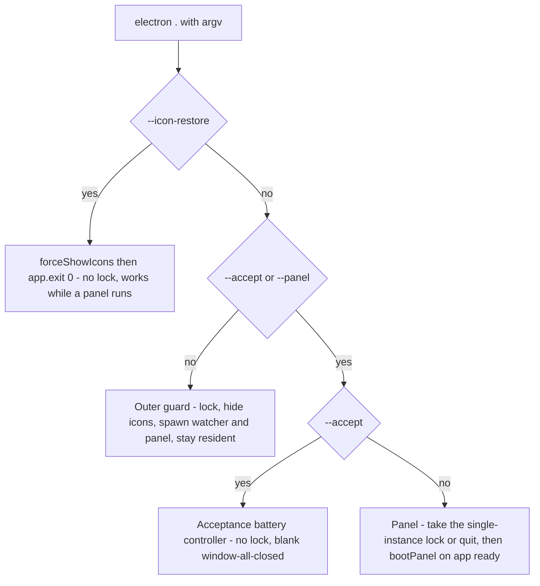
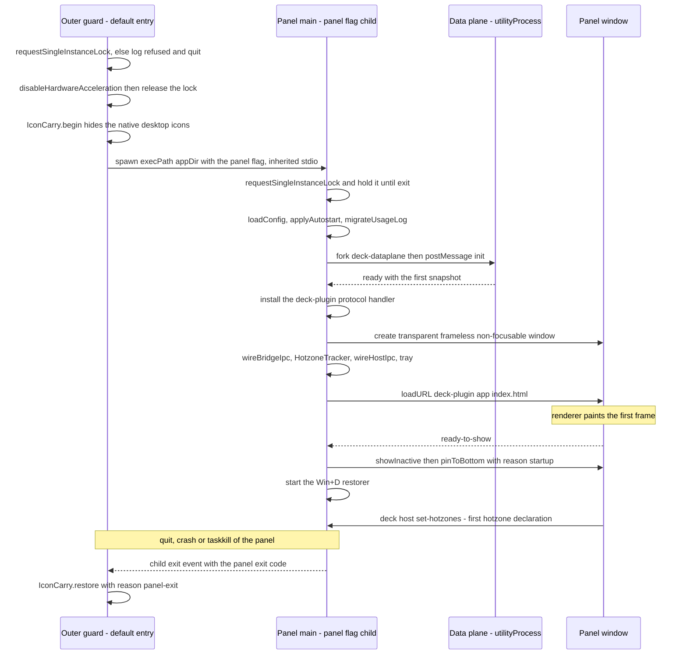
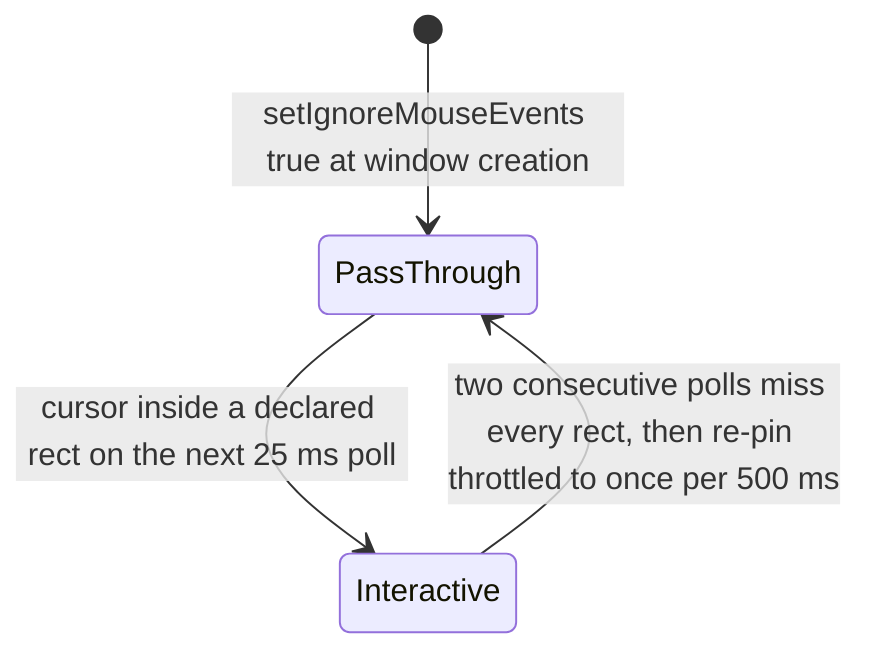

# Process lifecycle, window host and input model

<!-- openwiki: broken internal link [/repo://README.md#L45-L54] file "/repo://README.md" does not exist. Fix the href or restore the target, then delete this comment. -->
One Electron binary is four programs depending on its command line. The default entry is a windowless **outer guard**; it spawns the **panel** main process, which owns the window, the input model, the tray and the bridge, and which in turn forks the data-plane child. Nothing in this chain is packaging: the app runs from a checkout through `electron .`, and the mode flags are the only orchestration language ([README.md](/repo://README.md#L45-L54)).

This page covers the process lifecycle from argv to `ready-to-show` to quit, the window parameters that make the panel a background-layer overlay, and the input model that keeps the user's real desktop usable through it. Icon hiding/restoring and the Startup shortcut are the guard's and the panel's machine-level duties and are documented in [desktop icon carry and Startup autostart](/openwiki/architecture/desktop-icon-carry-and-autostart.md); the bridge channels that share the same `window.deck` namespace are documented in [bridge contract and IPC](/openwiki/architecture/bridge-contract-and-ipc.md).

## The four run modes

| Mode | argv | Role | Takes the single-instance lock |
|---|---|---|---|
<!-- openwiki: broken internal link [/repo://app/src/main/index.ts#L183-L234] file "/repo://app/src/main/index.ts" does not exist. Fix the href or restore the target, then delete this comment. -->
| Default (outer guard) | *(none)* | Single-instance admission, hide native desktop icons before the panel is raised, spawn the panel child and the detached restore watcher, stay resident as the parent, restore on child exit | yes, then **releases it before spawning** ([index.ts](/repo://app/src/main/index.ts#L183-L234)) |
<!-- openwiki: broken internal link [/repo://app/src/main/index.ts#L235-L239] file "/repo://app/src/main/index.ts" does not exist. Fix the href or restore the target, then delete this comment. -->
| Panel | `--panel` | `bootPanel()`: config, autostart, data plane, protocol, window, input model, tray, bridge | yes, and holds it until the process exits ([index.ts](/repo://app/src/main/index.ts#L235-L239)) |
<!-- openwiki: broken internal link [/repo://app/src/main/index.ts#L239-L247] file "/repo://app/src/main/index.ts" does not exist. Fix the href or restore the target, then delete this comment. -->
| Acceptance battery | `--accept` | In-process controller that spawns real panels, drives Win32 probes and writes evidence; no panel of its own | **no** ([index.ts](/repo://app/src/main/index.ts#L239-L247)) |
<!-- openwiki: broken internal link [/repo://app/src/main/index.ts#L176-L182] file "/repo://app/src/main/index.ts" does not exist. Fix the href or restore the target, then delete this comment. -->
| Icon restore | `--icon-restore` | One-shot `forceShowIcons()` then `app.exit(0)` — the cleanup and self-rescue entry | no ([index.ts](/repo://app/src/main/index.ts#L176-L182)) |

<!-- openwiki: broken internal link [/repo://app/src/main/index.ts#L27-L33] file "/repo://app/src/main/index.ts" does not exist. Fix the href or restore the target, then delete this comment. -->
<!-- openwiki: broken internal link [/repo://app/src/main/plugins/protocol.ts#L10-L13] file "/repo://app/src/main/plugins/protocol.ts" does not exist. Fix the href or restore the target, then delete this comment. -->
<!-- openwiki: broken internal link [/repo://app/src/main/index.ts#L193-L194] file "/repo://app/src/main/index.ts" does not exist. Fix the href or restore the target, then delete this comment. -->
The dispatch is a flat `if`/`else` chain evaluated at module load, before `app.whenReady()`, because two of its steps are hard pre-ready constraints: `registerPluginScheme()` must run before ready, and the guard's `app.disableHardwareAcceleration()` is pre-ready-only ([index.ts](/repo://app/src/main/index.ts#L27-L33), [protocol.ts](/repo://app/src/main/plugins/protocol.ts#L10-L13), [index.ts](/repo://app/src/main/index.ts#L193-L194)).



*Dispatch: the restore entry short-circuits before any lock logic, and the acceptance mode deliberately skips the lock so the battery can spawn a real guard/panel while it runs.*

<!-- openwiki: broken internal link [/repo://app/src/main/index.ts#L239-L247] file "/repo://app/src/main/index.ts" does not exist. Fix the href or restore the target, then delete this comment. -->
<!-- openwiki: broken internal link [/repo://app/accept/battery.js#L498-L502] file "/repo://app/accept/battery.js" does not exist. Fix the href or restore the target, then delete this comment. -->
The `--accept` details matter when reading the battery: it installs an empty `window-all-closed` handler so the controller outlives its own windows, and `require`s `accept/battery.js` inside the same Electron app context to reuse Electron APIs such as `nativeImage` capture ([index.ts](/repo://app/src/main/index.ts#L239-L247), [battery.js](/repo://app/accept/battery.js#L498-L502)).

## Boot sequence



*Boot sequence: the guard hides the icons and spawns its child, the child boots config and the data plane, and the window only becomes visible at `ready-to-show`, which is also where pinning and the Win+D watchdog start.*

<!-- openwiki: broken internal link [/repo://app/src/main/index.ts#L34-L174] file "/repo://app/src/main/index.ts" does not exist. Fix the href or restore the target, then delete this comment. -->
The ordering inside `bootPanel()` is fixed and load-bearing ([index.ts](/repo://app/src/main/index.ts#L34-L174)):

<!-- openwiki: broken internal link [/repo://app/src/main/panel-ipc.ts#L9-L24] file "/repo://app/src/main/panel-ipc.ts" does not exist. Fix the href or restore the target, then delete this comment. -->
1. **Evidence log** — `fileEventLog(process.env.DECK_EVENT_LOG)`; `null` when unset, so nothing below is observable without it ([panel-ipc.ts](/repo://app/src/main/panel-ipc.ts#L9-L24)).
2. **Config** — `loadConfig(CONFIG_FILE, fallback)` merges the user file over defaults derived from `screen.getPrimaryDisplay().bounds`, warns on illegal fields and writes a default `config.json` when none exists.
3. **Autostart and usage migration** — both wrapped in `try`/`catch`; neither may block the desktop.
<!-- openwiki: broken internal link [/repo://app/src/main/index.ts#L85-L109] file "/repo://app/src/main/index.ts" does not exist. Fix the href or restore the target, then delete this comment. -->
<!-- openwiki: broken internal link [/repo://app/src/main/services/dataplane.ts#L11-L12] file "/repo://app/src/main/services/dataplane.ts" does not exist. Fix the href or restore the target, then delete this comment. -->
<!-- openwiki: broken internal link [/repo://app/src/main/services/dataplane.ts#L57-L64] file "/repo://app/src/main/services/dataplane.ts" does not exist. Fix the href or restore the target, then delete this comment. -->
4. **Kernel** — `createPanelKernel(...)` then `await kernel.start()` and `await kernel.panelData.whenReady`. **The window is not created until the data plane has produced its first snapshot**, so the dock arrives with the first paint; the wait is bounded by a 15 s timeout that lets the panel start with an empty data plane rather than not at all ([index.ts](/repo://app/src/main/index.ts#L85-L109), [dataplane.ts](/repo://app/src/main/services/dataplane.ts#L11-L12), [dataplane.ts](/repo://app/src/main/services/dataplane.ts#L57-L64)).
<!-- openwiki: broken internal link [/repo://app/src/main/index.ts#L111-L113] file "/repo://app/src/main/index.ts" does not exist. Fix the href or restore the target, then delete this comment. -->
<!-- openwiki: broken internal link [/repo://app/src/main/plugins/protocol.ts#L15-L58] file "/repo://app/src/main/plugins/protocol.ts" does not exist. Fix the href or restore the target, then delete this comment. -->
5. **Protocol handler then window** — `installPluginProtocol(...)` before `createPanelWindow(...)`; the panel page is itself served from `deck-plugin://app/index.html`, which only works because the scheme was registered as privileged before app ready ([index.ts](/repo://app/src/main/index.ts#L111-L113), [protocol.ts](/repo://app/src/main/plugins/protocol.ts#L15-L58)).
6. **Wiring** — `wireBridgeIpc(win, kernel.bridge)`, then the recall helper, the hotzone tracker, `wireHostIpc`, and the tray.
<!-- openwiki: broken internal link [/repo://app/src/main/index.ts#L113-L171] file "/repo://app/src/main/index.ts" does not exist. Fix the href or restore the target, then delete this comment. -->
7. **First frame** — the window is created with `show: false`; the `ready-to-show` handler is attached *before* `win.loadURL(panelUrl())` and is the single place where the panel becomes visible: `showInactive()` then `pinToBottom(win)` logged with reason `startup` ([index.ts](/repo://app/src/main/index.ts#L113-L171)).

## Why the guard is the parent process

<!-- openwiki: broken internal link [/repo://app/src/main/index.ts#L183-L199] file "/repo://app/src/main/index.ts" does not exist. Fix the href or restore the target, then delete this comment. -->
The guard exists so that **killing the panel cannot kill the icon-restore path**. `taskkill /T` clears only the *downward* subtree, so an ordinary `taskkill /F` on the panel — or a panel crash — cannot reach the guard, and the process that hid the icons is still alive and still owns the restore obligation ([index.ts](/repo://app/src/main/index.ts#L183-L199)). The guard is therefore the sole owner of the native desktop icons while the panel never touches them; the split is documented in full in [desktop icon carry and Startup autostart](/openwiki/architecture/desktop-icon-carry-and-autostart.md).

The chain it establishes is: guard hides icons → guard spawns the detached restore watcher (only if it actually hid something) → guard spawns the panel → guard waits. The spawn itself keeps the icon story inside one process tree:

```ts
const child = spawn(process.execPath, [app.getAppPath(), '--panel'], {
  cwd: app.getAppPath(),
  env: process.env,
  stdio: 'inherit',
})
```

<!-- openwiki: broken internal link [/repo://app/src/main/index.ts#L219-L223] file "/repo://app/src/main/index.ts" does not exist. Fix the href or restore the target, then delete this comment. -->
([index.ts](/repo://app/src/main/index.ts#L219-L223)). `stdio: 'inherit'` is deliberate: the panel's `console.warn`/`console.error` lines reach the guard's console, which is how deck warnings stay visible in a development run. The guard is windowless — it calls `app.disableHardwareAcceleration()` so it does not even carry a GPU process — and it stays resident purely because the child process handle keeps the event loop alive.

<!-- openwiki: broken internal link [/repo://app/src/main/index.ts#L224-L233] file "/repo://app/src/main/index.ts" does not exist. Fix the href or restore the target, then delete this comment. -->
Both terminal paths restore before ending the guard: `child.on('error')` (the panel could not be spawned at all) restores with reason `panel-spawn-failed` and exits 1, while `child.on('exit')` restores with reason `panel-exit` and then calls `app.exit(code)` with the child's code ([index.ts](/repo://app/src/main/index.ts#L224-L233)). `app.exit` skips the normal quit sequence, so that explicit restore is not redundant with the `before-quit` hook. The one gap in this design — a console signal delivered by conhost to both processes at once, which bypasses every in-process hook — is exactly what the detached restore watcher covers.

<!-- openwiki: broken internal link [/repo://app/package.json#L11-L13] file "/repo://app/package.json" does not exist. Fix the href or restore the target, then delete this comment. -->
Because the restore duty is inherited rather than coupled, the panel can be developed without it: `npm run dev:panel` starts `electron . --panel` directly, skipping the guard, so no icons are hidden and no restore runs ([package.json](/repo://app/package.json#L11-L13)).

## Single-instance admission and the lock handoff

Two locks are involved, and the handoff between them is the subtle part.

<!-- openwiki: broken internal link [/repo://app/src/main/index.ts#L189-L192] file "/repo://app/src/main/index.ts" does not exist. Fix the href or restore the target, then delete this comment. -->
- The **guard** requests the lock first, and a refused launch logs `single-instance-refused` and quits within milliseconds. That is the fast path that keeps a second `electron .` from raising a second panel ([index.ts](/repo://app/src/main/index.ts#L189-L192)).
<!-- openwiki: broken internal link [/repo://app/src/main/index.ts#L184-L194] file "/repo://app/src/main/index.ts" does not exist. Fix the href or restore the target, then delete this comment. -->
<!-- openwiki: broken internal link [/repo://app/src/main/index.ts#L235-L239] file "/repo://app/src/main/index.ts" does not exist. Fix the href or restore the target, then delete this comment. -->
- The guard then calls `app.releaseSingleInstanceLock()` **before** spawning. The reason is recorded in the source: Electron's teardown is not instantaneous, and a lingering lock would make the guard's own fresh panel look like a second instance and get refused. During that empty window two launches may each spawn a panel, and the guarantee that only one panel is on screen comes from the panel's own lock — the **panel** process takes the lock at start and holds it until exit, and a panel that cannot take it quits ([index.ts](/repo://app/src/main/index.ts#L184-L194), [index.ts](/repo://app/src/main/index.ts#L235-L239)).
<!-- openwiki: broken internal link [/repo://app/src/main/index.ts#L173] file "/repo://app/src/main/index.ts" does not exist. Fix the href or restore the target, then delete this comment. -->
<!-- openwiki: broken internal link [/repo://app/accept/evidence/03-runtime-events.jsonl#L29-L31] file "/repo://app/accept/evidence/03-runtime-events.jsonl" does not exist. Fix the href or restore the target, then delete this comment. -->
- Holding the lock in the panel process is also what makes **recall by re-launch** work: `app.on('second-instance', () => showPanel('second-instance'))` is registered in `bootPanel`, so a second `electron .` both gets refused at the guard level and recalls the running panel ([index.ts](/repo://app/src/main/index.ts#L173)). Recorded evidence shows the pair: `pin` with reason `show-second-instance`, `panel-shown` with reason `second-instance` in the panel process and `single-instance-refused` in the refused process ([03-runtime-events.jsonl](/repo://app/accept/evidence/03-runtime-events.jsonl#L29-L31)).

<!-- openwiki: broken internal link [/repo://app/accept/battery.js#L1667-L1696] file "/repo://app/accept/battery.js" does not exist. Fix the href or restore the target, then delete this comment. -->
The acceptance battery asserts the observable half: a second launch exits with code 0 within 3 s, the event log carries `single-instance-refused`, the original window is still there and the count of `Chrome_WidgetWin_1` top-level windows is unchanged ([battery.js](/repo://app/accept/battery.js#L1667-L1696)).

## The panel window

<!-- openwiki: broken internal link [/repo://app/src/main/panel-window.ts#L16-L43] file "/repo://app/src/main/panel-window.ts" does not exist. Fix the href or restore the target, then delete this comment. -->
`createPanelWindow()` builds the overlay and nothing else; every behavioural rule lives in the modules that follow it ([panel-window.ts](/repo://app/src/main/panel-window.ts#L16-L43)):

| Option | Value | Why |
|---|---|---|
<!-- openwiki: broken internal link [/repo://app/src/main/config.ts#L101-L104] file "/repo://app/src/main/config.ts" does not exist. Fix the href or restore the target, then delete this comment. -->
| `x` / `y` / `width` / `height` | `config.panel` (default: the primary display's bounds) | the panel fills the screen like the retired wallpaper form ([config.ts](/repo://app/src/main/config.ts#L101-L104)) |
| `show` | `false` | the window appears only at `ready-to-show` |
| `frame`, `hasShadow` | `false` | no chrome; the transparent background must be the only thing over the wallpaper |
| `transparent`, `backgroundColor` | `true`, `#00000000` | the background layer shows through |
| `resizable`, `movable` | `false` | geometry is a boot-time value from `config.json`; changing it needs a restart |
| `focusable` | `false` | the panel can never activate (on Windows this is `WS_EX_NOACTIVATE`), so a click neither raises it nor steals the keyboard from the user's working window |
| `skipTaskbar` | `true` | no taskbar button; also what makes Win11's ToggleDesktop exempt the panel |
| `webPreferences` | `contextIsolation: true`, `sandbox: true`, `nodeIntegration: false`, preload `../preload/index.js` | the renderer never gets Node or filesystem access |

<!-- openwiki: broken internal link [/repo://app/src/main/panel-window.ts#L42] file "/repo://app/src/main/panel-window.ts" does not exist. Fix the href or restore the target, then delete this comment. -->
Immediately after construction the window is put into pass-through with `win.setIgnoreMouseEvents(true)` ([panel-window.ts](/repo://app/src/main/panel-window.ts#L42)). `win.setFocusable(false)` and `win.focus()` — the only way the panel ever receives keyboard input — are reachable only through keyboard mode.

<!-- openwiki: broken internal link [/repo://app/src/main/index.ts#L116-L122] file "/repo://app/src/main/index.ts" does not exist. Fix the href or restore the target, then delete this comment. -->
<!-- openwiki: broken internal link [/repo://app/src/main/index.ts#L145-L147] file "/repo://app/src/main/index.ts" does not exist. Fix the href or restore the target, then delete this comment. -->
The panel never activates, so the way it becomes visible is `win.showInactive()`: at startup from `ready-to-show`, and on every recall from `showPanel` ([index.ts](/repo://app/src/main/index.ts#L116-L122), [index.ts](/repo://app/src/main/index.ts#L145-L147)).

## The no-input-hooks red line (ADR-0005)

<!-- openwiki: broken internal link [/repo://docs/adr/0005-no-input-hooks-dataplane-utility-process.md#L5-L7] file "/repo://docs/adr/0005-no-input-hooks-dataplane-utility-process.md" does not exist. Fix the href or restore the target, then delete this comment. -->
This is a structural constraint, not a tuning choice, and it is stated in [ADR-0005](/repo://docs/adr/0005-no-input-hooks-dataplane-utility-process.md#L5-L7): **the window-host thread must hold no system-level input hook**.

The trigger was a measured machine-wide mouse stall: `setIgnoreMouseEvents(true, { forward: true })` makes Electron install a global `WH_MOUSE_LL` low-level mouse hook on the main thread, every system mouse event then serializes behind it, and the same thread was blocking roughly 300 ms per second in periodic collection. Two rules followed:

<!-- openwiki: broken internal link [/repo://app/src/main/panel-window.ts#L38-L42] file "/repo://app/src/main/panel-window.ts" does not exist. Fix the href or restore the target, then delete this comment. -->
- **Pass-through restore never uses `forward`.** The reason is written at the call site: forwarding means a main-thread hook, and any main-thread block — new plugin, synchronous IO, GC — would slow the system cursor; a full-screen window also copies every mouse move into Chromium for nothing ([panel-window.ts](/repo://app/src/main/panel-window.ts#L38-L42)).
<!-- openwiki: broken internal link [/repo://docs/adr/0005-no-input-hooks-dataplane-utility-process.md#L5-L7] file "/repo://docs/adr/0005-no-input-hooks-dataplane-utility-process.md" does not exist. Fix the href or restore the target, then delete this comment. -->
<!-- openwiki: broken internal link [/repo://app/src/main/services/dataplane.ts#L24-L34] file "/repo://app/src/main/services/dataplane.ts" does not exist. Fix the href or restore the target, then delete this comment. -->
- **Periodic collection leaves the main process.** The four collection services and their timers run in the `utilityProcess` data-plane child; the main process keeps only window, input, bridge and plugin host ([ADR-0005](/repo://docs/adr/0005-no-input-hooks-dataplane-utility-process.md#L5-L7), [dataplane.ts](/repo://app/src/main/services/dataplane.ts#L24-L34)).

Two consequences a reader should carry:

- **Hotzone detection is cursor polling**, not event forwarding: the main process asks Windows where the cursor is, 25 ms at a time, and compares that against the rectangles the renderer declared. Mechanics below.
<!-- openwiki: broken internal link [/repo://docs/adr/0005-no-input-hooks-dataplane-utility-process.md#L19] file "/repo://docs/adr/0005-no-input-hooks-dataplane-utility-process.md" does not exist. Fix the href or restore the target, then delete this comment. -->
- **Hover highlight is driven by real events after pass-through is lifted.** Once the cursor is inside a hotzone the window accepts input, so the renderer's CSS `:hover` works normally; outside hotzones there is deliberately no highlight ([ADR-0005](/repo://docs/adr/0005-no-input-hooks-dataplane-utility-process.md#L19)).

## Input model: pass-through plus hotzones

<!-- openwiki: broken internal link [/repo://app/src/preload/index.ts#L23-L30] file "/repo://app/src/preload/index.ts" does not exist. Fix the href or restore the target, then delete this comment. -->
<!-- openwiki: broken internal link [/repo://app/src/main/panel-ipc.ts#L58-L62] file "/repo://app/src/main/panel-ipc.ts" does not exist. Fix the href or restore the target, then delete this comment. -->
<!-- openwiki: broken internal link [/repo://app/src/shared/contract.ts#L273-L280] file "/repo://app/src/shared/contract.ts" does not exist. Fix the href or restore the target, then delete this comment. -->
The renderer owns *what is interactive*; the main process owns *whether the window accepts input*. The renderer measures its own DOM and sends rectangles over the host channel — `window.deck.host.setHotZones(rects)` → `deck:host-set-hotzones` → `HotzoneTracker.setRects()` — as `{ id, x, y, w, h }` relative to the client area's top-left in CSS px, which equals DIP ([preload/index.ts](/repo://app/src/preload/index.ts#L23-L30), [panel-ipc.ts](/repo://app/src/main/panel-ipc.ts#L58-L62), [contract.ts](/repo://app/src/shared/contract.ts#L273-L280)).

<!-- openwiki: broken internal link [/repo://app/src/renderer/main.ts#L712-L753] file "/repo://app/src/renderer/main.ts" does not exist. Fix the href or restore the target, then delete this comment. -->
The renderer declares one rectangle per `.card` (the card's own bounding box), one per desktop zone, and one each for the settings button and the overlay's reset button; rectangles with zero area are filtered out, and a desktop zone derives its rectangle from the union of its item boxes plus a 10 px margin, intersected with the visible container — so an empty zone contributes no rectangle and therefore no click dead zone ([main.ts](/repo://app/src/renderer/main.ts#L712-L753)).

<!-- openwiki: broken internal link [/repo://app/src/main/hotzone.ts#L4-L6] file "/repo://app/src/main/hotzone.ts" does not exist. Fix the href or restore the target, then delete this comment. -->
<!-- openwiki: broken internal link [/repo://app/src/main/hotzone.ts#L41-L69] file "/repo://app/src/main/hotzone.ts" does not exist. Fix the href or restore the target, then delete this comment. -->
`HotzoneTracker` then runs a `setInterval` of `POLL_MS = 25` and, on each tick ([hotzone.ts](/repo://app/src/main/hotzone.ts#L4-L6), [hotzone.ts](/repo://app/src/main/hotzone.ts#L41-L69)):

1. Bails out (and disposes itself) if the window is destroyed.
2. Reads `screen.getCursorScreenPoint()` and subtracts `win.getBounds()` to get window-relative coordinates.
3. If any rectangle contains the point: reset the miss counter, and — on the entering edge only — `setIgnoreMouseEvents(false)` and fire the transition hook.
4. If no rectangle contains the point: increment the miss counter, and only when `hot` was set and the counter reaches `LEAVE_CONFIRM_POLLS = 2` call `setIgnoreMouseEvents(true)`, then the leave hook and the transition hook.



*Hotzone state machine: the window is click-through by default, becomes interactive only while the cursor is in a declared rectangle, and needs a two-poll leave confirmation before pass-through returns.*

Two de-bouncing layers keep boundary jitter cheap:

<!-- openwiki: broken internal link [/repo://app/src/main/hotzone.ts#L5-L6] file "/repo://app/src/main/hotzone.ts" does not exist. Fix the href or restore the target, then delete this comment. -->
- **Leave confirmation (2 polls ≈ 50 ms)** — a single missed poll does not flip the window style, so a cursor trembling on an edge does not toggle `WS_EX_TRANSPARENT` every frame ([hotzone.ts](/repo://app/src/main/hotzone.ts#L5-L6)).
<!-- openwiki: broken internal link [/repo://app/src/main/index.ts#L124-L136] file "/repo://app/src/main/index.ts" does not exist. Fix the href or restore the target, then delete this comment. -->
- **Re-pin throttle (500 ms)** — the leave hook re-pins the window to the bottom, and each `SetWindowPos(..., HWND_BOTTOM, ...)` forces Windows to re-evaluate the whole z-order, so at most one such call is allowed per 500 ms; repeated leaves inside the window are dropped ([index.ts](/repo://app/src/main/index.ts#L124-L136)).

<!-- openwiki: broken internal link [/repo://app/src/renderer/main.ts#L738-L753] file "/repo://app/src/renderer/main.ts" does not exist. Fix the href or restore the target, then delete this comment. -->
<!-- openwiki: broken internal link [/repo://app/src/renderer/main.ts#L392-L417] file "/repo://app/src/renderer/main.ts" does not exist. Fix the href or restore the target, then delete this comment. -->
<!-- openwiki: broken internal link [/repo://app/src/renderer/main.ts#L595-L635] file "/repo://app/src/renderer/main.ts" does not exist. Fix the href or restore the target, then delete this comment. -->
<!-- openwiki: broken internal link [/repo://app/src/renderer/main.ts#L756-L771] file "/repo://app/src/renderer/main.ts" does not exist. Fix the href or restore the target, then delete this comment. -->
The renderer re-declares hotzones whenever the layout can have moved: after every snapshot render, on `plugins/changed`, on settings open/close, on search activate/deactivate, and once `document.fonts.ready` resolves ([main.ts](/repo://app/src/renderer/main.ts#L738-L753), [main.ts](/repo://app/src/renderer/main.ts#L392-L417), [main.ts](/repo://app/src/renderer/main.ts#L595-L635), [main.ts](/repo://app/src/renderer/main.ts#L756-L771)). A plugin card therefore becomes clickable by carrying the shared `card` class and an id, which is what puts it into the declaration.

## Keyboard mode

<!-- openwiki: broken internal link [/repo://app/src/main/panel-ipc.ts#L66-L82] file "/repo://app/src/main/panel-ipc.ts" does not exist. Fix the href or restore the target, then delete this comment. -->
Because the window is created non-focusable and never activates, the two scenes that genuinely need a keyboard — the search overlay's input and the settings overlay — take focus temporarily through one host-channel switch, `deck:host-keyboard-mode` ([panel-ipc.ts](/repo://app/src/main/panel-ipc.ts#L66-L82)):

| Switch | Actions |
|---|---|
| on | `win.setFocusable(true)` → `win.focus()` → `pinToBottom(win)` → `keyboard-mode-on` evidence |
| off | `win.setFocusable(false)` → `pinToBottom(win)` → `keyboard-mode-off` evidence |

Three semantics worth knowing:

<!-- openwiki: broken internal link [/repo://app/src/main/panel-ipc.ts#L66-L74] file "/repo://app/src/main/panel-ipc.ts" does not exist. Fix the href or restore the target, then delete this comment. -->
<!-- openwiki: broken internal link [/repo://app/accept/battery.js#L1221-L1236] file "/repo://app/accept/battery.js" does not exist. Fix the href or restore the target, then delete this comment. -->
<!-- openwiki: broken internal link [/repo://app/accept/battery.js#L1304-L1316] file "/repo://app/accept/battery.js" does not exist. Fix the href or restore the target, then delete this comment. -->
- **Turning it on does not raise the window.** The re-pin happens immediately after `focus()`, and the panel stays below ordinary windows even while it is the foreground window — probe `probe-focus-gate` (6/6) established this, and the battery re-asserts it by requiring that no normal window sits below the panel in the top-down z-order while keyboard mode is on ([panel-ipc.ts](/repo://app/src/main/panel-ipc.ts#L66-L74), [battery.js](/repo://app/accept/battery.js#L1221-L1236), [battery.js](/repo://app/accept/battery.js#L1304-L1316)).
<!-- openwiki: broken internal link [/repo://app/src/main/panel-ipc.ts#L66-L69] file "/repo://app/src/main/panel-ipc.ts" does not exist. Fix the href or restore the target, then delete this comment. -->
<!-- openwiki: broken internal link [/repo://app/src/renderer/main.ts#L408-L417] file "/repo://app/src/renderer/main.ts" does not exist. Fix the href or restore the target, then delete this comment. -->
- **Turning it off leaves focus nowhere.** The previously focused window is not restored — the same semantics as clicking the real desktop — and the overlay close path relies on that ([panel-ipc.ts](/repo://app/src/main/panel-ipc.ts#L66-L69), [main.ts](/repo://app/src/renderer/main.ts#L408-L417)).
<!-- openwiki: broken internal link [/repo://app/src/renderer/main.ts#L390-L417] file "/repo://app/src/renderer/main.ts" does not exist. Fix the href or restore the target, then delete this comment. -->
<!-- openwiki: broken internal link [/repo://app/src/renderer/main.ts#L595-L635] file "/repo://app/src/renderer/main.ts" does not exist. Fix the href or restore the target, then delete this comment. -->
- **It is the renderer's decision, on both edges.** `openSettings`/`closeSettings` and `searchActivate`/`searchDeactivate` call it as a pair; the off call is guarded by the overlay's own open flag so a focus-out re-entry cannot double-fire ([main.ts](/repo://app/src/renderer/main.ts#L390-L417), [main.ts](/repo://app/src/renderer/main.ts#L595-L635)).

<!-- openwiki: broken internal link [/repo://app/accept/battery.js#L1533-L1541] file "/repo://app/accept/battery.js" does not exist. Fix the href or restore the target, then delete this comment. -->
<!-- openwiki: broken internal link [/repo://app/accept/battery.js#L1576-L1584] file "/repo://app/accept/battery.js" does not exist. Fix the href or restore the target, then delete this comment. -->
The battery proves the round trip for both scenes: `keyboard-mode-on` plus foreground pid equal to the panel process, then on exit `keyboard-mode-off` plus `WS_EX_NOACTIVATE` back in the window's extended style and the panel still below every normal window ([battery.js](/repo://app/accept/battery.js#L1533-L1541), [battery.js](/repo://app/accept/battery.js#L1576-L1584)).

## Keeping the panel at the bottom

<!-- openwiki: broken internal link [/repo://docs/adr/0004-electron-cordis-standalone-panel.md#L8] file "/repo://docs/adr/0004-electron-cordis-standalone-panel.md" does not exist. Fix the href or restore the target, then delete this comment. -->
<!-- openwiki: broken internal link [/repo://app/src/main/win32.ts#L6-L25] file "/repo://app/src/main/win32.ts" does not exist. Fix the href or restore the target, then delete this comment. -->
Stacking order is fixed by ADR-0004 as **background layer < panel < ordinary windows**: the panel is above the wallpaper and below everything the user actually works in ([ADR-0004](/repo://docs/adr/0004-electron-cordis-standalone-panel.md#L8)). Electron has no native "always at the bottom" level, so it is one FFI call: `SetWindowPos(hwnd, HWND_BOTTOM, 0, 0, 0, 0, SWP_NOMOVE | SWP_NOSIZE | SWP_NOACTIVATE | SWP_NOOWNERZORDER)` against `user32.dll` through koffi, with the HWND obtained by `koffi.decode(win.getNativeWindowHandle(), 'uintptr_t')` ([win32.ts](/repo://app/src/main/win32.ts#L6-L25)).

Every place that re-asserts the bottom:

| Trigger | Reason string in the evidence log | Evidence |
|---|---|---|
<!-- openwiki: broken internal link [/repo://app/src/main/index.ts#L145-L147] file "/repo://app/src/main/index.ts" does not exist. Fix the href or restore the target, then delete this comment. -->
| Window creation completing (`ready-to-show`) | `startup` | [index.ts](/repo://app/src/main/index.ts#L145-L147) |
<!-- openwiki: broken internal link [/repo://app/src/main/index.ts#L118-L122] file "/repo://app/src/main/index.ts" does not exist. Fix the href or restore the target, then delete this comment. -->
| Tray click / second instance / Win+D restore | `show-<reason>` | [index.ts](/repo://app/src/main/index.ts#L118-L122) |
<!-- openwiki: broken internal link [/repo://app/src/main/index.ts#L127-L136] file "/repo://app/src/main/index.ts" does not exist. Fix the href or restore the target, then delete this comment. -->
| Cursor leaving a hotzone | `hotzone-leave` (throttled, see above) | [index.ts](/repo://app/src/main/index.ts#L127-L136) |
<!-- openwiki: broken internal link [/repo://app/src/main/panel-ipc.ts#L70-L81] file "/repo://app/src/main/panel-ipc.ts" does not exist. Fix the href or restore the target, then delete this comment. -->
| Switching keyboard mode on or off | *(not logged as `pin`)* | [panel-ipc.ts](/repo://app/src/main/panel-ipc.ts#L70-L81) |
<!-- openwiki: broken internal link [/repo://app/src/main/index.ts#L165-L169] file "/repo://app/src/main/index.ts" does not exist. Fix the href or restore the target, then delete this comment. -->
| A stray `focus` event on the panel | `focus-fallback` | [index.ts](/repo://app/src/main/index.ts#L165-L169) |

<!-- openwiki: broken internal link [/repo://app/src/main/index.ts#L118-L121] file "/repo://app/src/main/index.ts" does not exist. Fix the href or restore the target, then delete this comment. -->
<!-- openwiki: broken internal link [/repo://app/src/main/panel-ipc.ts#L14-L24] file "/repo://app/src/main/panel-ipc.ts" does not exist. Fix the href or restore the target, then delete this comment. -->
<!-- openwiki: broken internal link [/repo://app/src/main/index.ts#L165-L169] file "/repo://app/src/main/index.ts" does not exist. Fix the href or restore the target, then delete this comment. -->
Only a *successful* pin is recorded — the log line is inside `if (pinToBottom(win))` — so a `pin` event with its `reason` is positive proof that the z-order call returned true ([index.ts](/repo://app/src/main/index.ts#L118-L121), [panel-ipc.ts](/repo://app/src/main/panel-ipc.ts#L14-L24)). The `focus` fallback looks redundant while the window is non-focusable, and it is a deliberate backstop: the panel never activates, but a system interaction could still deliver a focus event, and probe evidence says re-pinning works even under activation ([index.ts](/repo://app/src/main/index.ts#L165-L169)).

## Recall paths

All three user-visible ways back to a panel that has been minimized or hidden converge on one function:

```ts
const showPanel = (reason: string) => {
  if (win.isMinimized() || !win.isVisible()) win.showInactive()
  if (pinToBottom(win)) log?.append({ type: 'pin', reason: `show-${reason}` })
  log?.append({ type: 'panel-shown', reason })
}
```

<!-- openwiki: broken internal link [/repo://app/src/main/index.ts#L116-L122] file "/repo://app/src/main/index.ts" does not exist. Fix the href or restore the target, then delete this comment. -->
([index.ts](/repo://app/src/main/index.ts#L116-L122)). Recall is *restore if down → show without stealing focus → re-pin*.

| Path | Trigger | Reason |
|---|---|---|
<!-- openwiki: broken internal link [/repo://app/src/main/index.ts#L139] file "/repo://app/src/main/index.ts" does not exist. Fix the href or restore the target, then delete this comment. -->
<!-- openwiki: broken internal link [/repo://app/src/main/tray.ts#L41] file "/repo://app/src/main/tray.ts" does not exist. Fix the href or restore the target, then delete this comment. -->
| Tray | left click on the tray icon | `tray-click` ([index.ts](/repo://app/src/main/index.ts#L139), [tray.ts](/repo://app/src/main/tray.ts#L41)) |
<!-- openwiki: broken internal link [/repo://app/src/main/index.ts#L173] file "/repo://app/src/main/index.ts" does not exist. Fix the href or restore the target, then delete this comment. -->
| Second instance | another `electron .` while the panel holds the lock | `second-instance` ([index.ts](/repo://app/src/main/index.ts#L173)) |
<!-- openwiki: broken internal link [/repo://app/src/main/index.ts#L152-L161] file "/repo://app/src/main/index.ts" does not exist. Fix the href or restore the target, then delete this comment. -->
| Win+D debounce | the restorer's debounce expired with the window still minimized | `wind-restore` ([index.ts](/repo://app/src/main/index.ts#L152-L161)) |

<!-- openwiki: broken internal link [/repo://app/src/main/tray.ts#L12-L42] file "/repo://app/src/main/tray.ts" does not exist. Fix the href or restore the target, then delete this comment. -->
<!-- openwiki: broken internal link [/repo://app/accept/battery.js#L1698-L1738] file "/repo://app/accept/battery.js" does not exist. Fix the href or restore the target, then delete this comment. -->
<!-- openwiki: broken internal link [/repo://app/src/main/tray.ts#L38-L40] file "/repo://app/src/main/tray.ts" does not exist. Fix the href or restore the target, then delete this comment. -->
The tray icon is drawn programmatically — a 32 px BGRA buffer with a dark background and four amber (`#f5a623`) squares — so there is no binary asset to ship, and that amber is also the recognition color the battery scans for in the notification area ([tray.ts](/repo://app/src/main/tray.ts#L12-L42), [battery.js](/repo://app/accept/battery.js#L1698-L1738)). Its context menu carries the only user-facing quit: `退出面板` → `app.quit()` ([tray.ts](/repo://app/src/main/tray.ts#L38-L40)).

<!-- openwiki: broken internal link [/repo://app/src/main/wind-restore.ts#L1-L69] file "/repo://app/src/main/wind-restore.ts" does not exist. Fix the href or restore the target, then delete this comment. -->
<!-- openwiki: broken internal link [/repo://app/tests/wind-restore.spec.ts#L1-L88] file "/repo://app/tests/wind-restore.spec.ts" does not exist. Fix the href or restore the target, then delete this comment. -->
`WinDRestorer` is the watchdog for a collapse the panel cannot prevent, and its semantics are pinned by unit test ([wind-restore.ts](/repo://app/src/main/wind-restore.ts#L1-L69), [wind-restore.spec.ts](/repo://app/tests/wind-restore.spec.ts#L1-L88)):

- It polls a predicate every `WIN_D_POLL_MS = 250` ms and, on the first hit of an episode, records the reason, fires `onMinimized` and starts a `WIN_D_DEBOUNCE_MS = 1500` ms timer.
- **Repeated hits during one episode do not restart the timer.** While the window is iconic every poll hits, so resetting on each hit would mean the restore never fires — the test that pins this is the "重复命中不重置防抖计时" case.
- **Leaving the down state cancels the episode.** If the shell restores the window inside the debounce window — the spec's second test simulates exactly that — the episode is dropped; a tray click or a second-instance recall restores the panel the same way, so the watchdog never fights a user action.
- **Restore fires only if the predicate still reports down at expiry**, so a double-toggle in the debounce window ends in no restore at all.
- `dispose()` on window `closed` clears both the interval and any pending timer.

The production predicate watches **`isMinimized()` only** and returns `'minimized'`:

```ts
const restorer = new WinDRestorer(() => (win.isMinimized() ? 'minimized' : null), { /* hooks */ })
```

<!-- openwiki: broken internal link [/repo://app/src/main/index.ts#L152-L161] file "/repo://app/src/main/index.ts" does not exist. Fix the href or restore the target, then delete this comment. -->
([index.ts](/repo://app/src/main/index.ts#L152-L161)). The `'hidden'` variant exists in the `IsDownFn` type but is never produced, and `!isVisible` is deliberately not watched: hidden is the legitimate pre-show state, and a future "hide the panel" feature must not be overridden by the restorer.

<!-- openwiki: broken internal link [/repo://app/accept/battery.js#L1740-L1798] file "/repo://app/accept/battery.js" does not exist. Fix the href or restore the target, then delete this comment. -->
<!-- openwiki: broken internal link [/repo://app/accept/evidence/03-runtime-events.jsonl#L37-L40] file "/repo://app/accept/evidence/03-runtime-events.jsonl" does not exist. Fix the href or restore the target, then delete this comment. -->
On Win11 the watchdog is a safety net rather than the primary defense. `ToggleDesktop` does not minimise `WS_EX_TOOLWINDOW` windows, so `skipTaskbar: true` makes the panel immune to Win+D — the user story being "an accidental Show Desktop should not need a recovery". The battery proves the immunity with a notepad control window and then drives `SW_MINIMIZE` on the panel to exercise the debounce: `wind-minimized` with `why: 'minimized'`, then `wind-restored` with `afterMs ≈ 1500`, the original rectangle restored within a 24 px frameless-border tolerance, and the notepad again covering the panel afterwards (re-pin effective) ([battery.js](/repo://app/accept/battery.js#L1740-L1798)). The recorded log for that run shows the expected pair ([03-runtime-events.jsonl](/repo://app/accept/evidence/03-runtime-events.jsonl#L37-L40)).

## Quit teardown

The panel process ends through one of three doors, and all of them end in `app.quit()`:

<!-- openwiki: broken internal link [/repo://app/src/main/index.ts#L162-L172] file "/repo://app/src/main/index.ts" does not exist. Fix the href or restore the target, then delete this comment. -->
- **Window closed** — `win.on('closed')` disposes the hotzone tracker and the Win+D restorer, then the `window-all-closed` handler calls `app.quit()` ([index.ts](/repo://app/src/main/index.ts#L162-L172)). This is why a `WM_CLOSE` from the acceptance battery is a valid end-to-end exit test rather than a leak.
<!-- openwiki: broken internal link [/repo://app/src/main/tray.ts#L38-L40] file "/repo://app/src/main/tray.ts" does not exist. Fix the href or restore the target, then delete this comment. -->
- **Tray menu → `app.quit()`** ([tray.ts](/repo://app/src/main/tray.ts#L38-L40)).
<!-- openwiki: broken internal link [/repo://app/src/main/index.ts#L248-L251] file "/repo://app/src/main/index.ts" does not exist. Fix the href or restore the target, then delete this comment. -->
- **Anything else that stops the app**, e.g. the boot `catch` in `whenReady` calling `app.quit()` after logging `[deck] 面板启动失败` ([index.ts](/repo://app/src/main/index.ts#L248-L251)).

<!-- openwiki: broken internal link [/repo://app/src/main/index.ts#L140-L143] file "/repo://app/src/main/index.ts" does not exist. Fix the href or restore the target, then delete this comment. -->
<!-- openwiki: broken internal link [/repo://app/accept/evidence/03-runtime-events.jsonl#L41-L44] file "/repo://app/accept/evidence/03-runtime-events.jsonl" does not exist. Fix the href or restore the target, then delete this comment. -->
`before-quit` logs `quit` and destroys the tray, so the icon cannot outlive the process ([index.ts](/repo://app/src/main/index.ts#L140-L143)). The panel's exit then propagates to the guard, which restores the native icons and exits with the same code — the panel never restores icons itself. Recorded ordering for a clean quit: `quit` → `dataplane-exit` → `icons-restored` (reason `panel-exit`) → `carry-exit` ([03-runtime-events.jsonl](/repo://app/accept/evidence/03-runtime-events.jsonl#L41-L44)).

## Configuration and operation

| Surface | Value | Effect |
|---|---|---|
<!-- openwiki: broken internal link [/repo://app/src/main/config.ts#L117-L138] file "/repo://app/src/main/config.ts" does not exist. Fix the href or restore the target, then delete this comment. -->
| `config.panel` | `{x, y, width, height}`, default = the primary display's bounds | window geometry, read once in `bootPanel()`; illegal values fall back per field with a warning ([config.ts](/repo://app/src/main/config.ts#L117-L138)) |
<!-- openwiki: broken internal link [/repo://app/package.json#L13] file "/repo://app/package.json" does not exist. Fix the href or restore the target, then delete this comment. -->
| `--panel` / `npm run dev:panel` | flag / script | run the panel without the guard: no icon hiding, no restore, and the panel itself takes the single-instance lock ([package.json](/repo://app/package.json#L13)) |
<!-- openwiki: broken internal link [/repo://app/src/main/index.ts#L239-L247] file "/repo://app/src/main/index.ts" does not exist. Fix the href or restore the target, then delete this comment. -->
| `--accept` | flag | the acceptance battery controller, no lock, spawns real panels ([index.ts](/repo://app/src/main/index.ts#L239-L247)) |
<!-- openwiki: broken internal link [/repo://app/src/main/index.ts#L176-L182] file "/repo://app/src/main/index.ts" does not exist. Fix the href or restore the target, then delete this comment. -->
| `--icon-restore` | flag | one-shot "make the native icons visible", safe to run while a panel is up ([index.ts](/repo://app/src/main/index.ts#L176-L182)) |
<!-- openwiki: broken internal link [/repo://app/src/main/panel-ipc.ts#L14-L24] file "/repo://app/src/main/panel-ipc.ts" does not exist. Fix the href or restore the target, then delete this comment. -->
<!-- openwiki: broken internal link [/repo://app/accept/battery.js#L498-L502] file "/repo://app/accept/battery.js" does not exist. Fix the href or restore the target, then delete this comment. -->
| `DECK_EVENT_LOG` | environment variable | turns the main process into a JSONL evidence recorder; unset in normal development runs, set by the battery to `accept/evidence/03-runtime-events.jsonl` ([panel-ipc.ts](/repo://app/src/main/panel-ipc.ts#L14-L24), [battery.js](/repo://app/accept/battery.js#L498-L502)) |

<!-- openwiki: broken internal link [/repo://app/accept/battery.js#L533-L536] file "/repo://app/accept/battery.js" does not exist. Fix the href or restore the target, then delete this comment. -->
<!-- openwiki: broken internal link [/repo://app/accept/battery.js#L1640-L1662] file "/repo://app/accept/battery.js" does not exist. Fix the href or restore the target, then delete this comment. -->
Because geometry is a boot-time value and the window is neither movable nor resizable, a `config.panel` change requires a panel restart; the battery verifies exactly that ("config.json 改动几何后重启面板即反映"), and one of its restart loops exists only because a previous panel generation's hotzone rectangles must not be reused ([battery.js](/repo://app/accept/battery.js#L533-L536), [battery.js](/repo://app/accept/battery.js#L1640-L1662)).

<!-- openwiki: broken internal link [/repo://app/src/main/index.ts#L49-L173] file "/repo://app/src/main/index.ts" does not exist. Fix the href or restore the target, then delete this comment. -->
<!-- openwiki: broken internal link [/repo://app/src/main/panel-ipc.ts#L57-L82] file "/repo://app/src/main/panel-ipc.ts" does not exist. Fix the href or restore the target, then delete this comment. -->
<!-- openwiki: broken internal link [/repo://app/src/main/wind-restore.ts#L11-L16] file "/repo://app/src/main/wind-restore.ts" does not exist. Fix the href or restore the target, then delete this comment. -->
Events in this page's area, written only when `DECK_EVENT_LOG` is set: `boot`, `pin` (with `reason` = `startup` / `show-tray-click` / `show-second-instance` / `show-wind-restore` / `hotzone-leave` / `focus-fallback`), `panel-shown`, `hotzones`, `hotzone-enter`, `hotzone-leave`, `keyboard-mode-on`, `keyboard-mode-off`, `wind-minimized`, `wind-restored`, `single-instance-refused`, `quit` ([index.ts](/repo://app/src/main/index.ts#L49-L173), [panel-ipc.ts](/repo://app/src/main/panel-ipc.ts#L57-L82), [wind-restore.ts](/repo://app/src/main/wind-restore.ts#L11-L16)). The operational reading of these events is covered in [recovery and diagnostics](/openwiki/operations/recovery-and-diagnostics.md).

## Tests and acceptance coverage

<!-- openwiki: broken internal link [/repo://app/tests/wind-restore.spec.ts#L1-L88] file "/repo://app/tests/wind-restore.spec.ts" does not exist. Fix the href or restore the target, then delete this comment. -->
`app/tests/wind-restore.spec.ts` is the only offline unit test in this area, and it is a pure-logic seam: `WinDRestorer` takes its down-predicate and hooks as injected arguments and uses only timers, so the spec drives it with `vi.useFakeTimers` (faking `Date` as well, because the episode start is wall-clock) and pins the five behaviours that matter — single `onMinimized` per episode, no restore before the debounce expires, restore at expiry with `afterMs = WIN_D_DEBOUNCE_MS`, cancellation when the down state clears, no timer reset on repeated hits, and full silence after `dispose()` ([wind-restore.spec.ts](/repo://app/tests/wind-restore.spec.ts#L1-L88)).

Everything else here is window- and OS-dependent and has no unit test on purpose; the real-machine acceptance battery is the verification seam, asserting window state rather than module behaviour:

| Assertion | What it proves |
|---|---|
<!-- openwiki: broken internal link [/repo://app/accept/battery.js#L717-L741] file "/repo://app/accept/battery.js" does not exist. Fix the href or restore the target, then delete this comment. -->
| Extended style contains `WS_EX_TRANSPARENT \| WS_EX_LAYERED`; a left click and a right click on an empty panel area land on the desktop (foreground becomes `Progman`/`WorkerW`/`SHELLDLL_DefView`/`SysListView32`, or the Win11 desktop context-menu host) | default pass-through is real, for both buttons ([battery.js](/repo://app/accept/battery.js#L717-L741)) |
<!-- openwiki: broken internal link [/repo://app/accept/battery.js#L743-L812] file "/repo://app/accept/battery.js" does not exist. Fix the href or restore the target, then delete this comment. -->
| A `hotzones` event containing `clock-card`; moving onto the card clears `WS_EX_TRANSPARENT` within 1.5 s; moving away restores it | the 25 ms poll drives the style flip both ways ([battery.js](/repo://app/accept/battery.js#L743-L812)) |
<!-- openwiki: broken internal link [/repo://app/accept/battery.js#L777-L798] file "/repo://app/accept/battery.js" does not exist. Fix the href or restore the target, then delete this comment. -->
| Clicking the card leaves the notepad above the panel, leaves the foreground unchanged, keeps `WS_EX_NOACTIVATE`, and delivers `clock-card-clicked` | the panel receives clicks without ever being raised or activated ([battery.js](/repo://app/accept/battery.js#L777-L798)) |
<!-- openwiki: broken internal link [/repo://app/accept/battery.js#L817-L822] file "/repo://app/accept/battery.js" does not exist. Fix the href or restore the target, then delete this comment. -->
| Panel index below the notepad in the top-down window enumeration | bottom pinning through `HWND_BOTTOM` actually took effect ([battery.js](/repo://app/accept/battery.js#L817-L822)) |
<!-- openwiki: broken internal link [/repo://app/accept/battery.js#L1667-L1696] file "/repo://app/accept/battery.js" does not exist. Fix the href or restore the target, then delete this comment. -->
| Second launch exits with code 0 in under 3 s, `single-instance-refused` recorded, window count unchanged | single-instance admission ([battery.js](/repo://app/accept/battery.js#L1667-L1696)) |
<!-- openwiki: broken internal link [/repo://app/accept/battery.js#L1698-L1738] file "/repo://app/accept/battery.js" does not exist. Fix the href or restore the target, then delete this comment. -->
<!-- openwiki: broken internal link [/repo://app/accept/battery.js#L1800-L1851] file "/repo://app/accept/battery.js" does not exist. Fix the href or restore the target, then delete this comment. -->
| Tray icon registered in `NotifyIconSettings` for `process.execPath` and found by amber-pixel scan in the visible area | the tray exists and is discoverable; the right-click menu is a manual check because injected context menus do not reach Electron tray icons on Win11 26200 ([battery.js](/repo://app/accept/battery.js#L1698-L1738), [battery.js](/repo://app/accept/battery.js#L1800-L1851)) |
<!-- openwiki: broken internal link [/repo://app/accept/battery.js#L1740-L1798] file "/repo://app/accept/battery.js" does not exist. Fix the href or restore the target, then delete this comment. -->
| Win+D leaves the panel untouched while minimising the notepad; `SW_MINIMIZE` then yields `wind-minimized` → `wind-restored` with `afterMs ≈ 1500`, the original rectangle, and the notepad back on top | the debounce restorer and its re-pin ([battery.js](/repo://app/accept/battery.js#L1740-L1798)) |
<!-- openwiki: broken internal link [/repo://app/accept/battery.js#L1304-L1316] file "/repo://app/accept/battery.js" does not exist. Fix the href or restore the target, then delete this comment. -->
<!-- openwiki: broken internal link [/repo://app/accept/battery.js#L1533-L1541] file "/repo://app/accept/battery.js" does not exist. Fix the href or restore the target, then delete this comment. -->
<!-- openwiki: broken internal link [/repo://app/accept/battery.js#L1576-L1584] file "/repo://app/accept/battery.js" does not exist. Fix the href or restore the target, then delete this comment. -->
| `keyboard-mode-on` with the panel as foreground and still below all normal windows, then `keyboard-mode-off` with `WS_EX_NOACTIVATE` restored, for both the search overlay and the settings overlay | keyboard mode grants and releases keyboard focus without breaking the z-order rule ([battery.js](/repo://app/accept/battery.js#L1304-L1316), [battery.js](/repo://app/accept/battery.js#L1533-L1541), [battery.js](/repo://app/accept/battery.js#L1576-L1584)) |

<!-- openwiki: broken internal link [/repo://app/accept/battery.js#L1-L8] file "/repo://app/accept/battery.js" does not exist. Fix the href or restore the target, then delete this comment. -->
<!-- openwiki: broken internal link [/repo://app/accept/battery.js#L498-L502] file "/repo://app/accept/battery.js" does not exist. Fix the href or restore the target, then delete this comment. -->
The battery does not call into production modules: it drives the running panel with `SendInput`, `GetWindowLongW`, `WindowFromPoint` and `IsIconic` through its own `accept/lib/win32.js`, and it launches panels as `electron .` — the guard entry — so the whole spawn chain is under test ([battery.js](/repo://app/accept/battery.js#L1-L8), [battery.js](/repo://app/accept/battery.js#L498-L502)). The battery's own coverage map is in [acceptance battery](/openwiki/testing/acceptance-battery.md).

## Changing this safely

<!-- openwiki: broken internal link [/repo://docs/adr/0005-no-input-hooks-dataplane-utility-process.md#L9-L15] file "/repo://docs/adr/0005-no-input-hooks-dataplane-utility-process.md" does not exist. Fix the href or restore the target, then delete this comment. -->
- **Do not add `forward: true`** to the pass-through call, anywhere, for any reason. It re-installs the global low-level mouse hook ADR-0005 removed, and the resulting stall is machine-wide and intermittent, which is the worst combination to debug ([ADR-0005](/repo://docs/adr/0005-no-input-hooks-dataplane-utility-process.md#L9-L15)).
- **Do not move collection back onto the main process.** The input model's latency budget assumes the main loop stays nearly idle; the 25 ms poll is microseconds per tick, and anything heavier on that thread is felt by the cursor ([data-service](/openwiki/architecture/data-service.md)).
- **New interactive UI must declare a hotzone** or it is unclickable: the panel is pass-through by default and only the declared rectangles are hit-testable. For plugin cards, that means carrying the shared `card` class and an id.
- **Adding a recall path** means adding a caller of `showPanel(reason)`, not a new implementation — the recall contract is show-inactive → re-pin → log, and every path must preserve it.
- **Adding a pin site** should keep the same two properties: never activate (`SWP_NOACTIVATE`) and avoid tight loops, because `HWND_BOTTOM` reorders the whole system z-order. Follow the 500 ms throttle precedent for anything that can fire from cursor or window events.
- **Do not widen the Win+D predicate to `!isVisible`.** Hidden is a legal pre-show state and the intended shape of any future "hide the panel" feature; the restorer watches minimization only.
- **Keyboard mode is a toggle, not a state.** If a new scene needs the keyboard, pair the on/off calls on the same edge as the overlay's own open flag, and expect no focus restoration when it closes.
- **Changing `panel-window.ts` options** is changing three behaviours at once: stacking (via pinning), taskbar presence, and Win+D immunity (`skipTaskbar`). Removing `skipTaskbar` in particular would hand Win+D the power to minimize the panel and lean entirely on the debounce restorer.
<!-- openwiki: broken internal link [/repo://app/src/main/panel-ipc.ts#L57-L82] file "/repo://app/src/main/panel-ipc.ts" does not exist. Fix the href or restore the target, then delete this comment. -->
- **A second `bootPanel()` in one process would double-register the host `ipcMain.on` handlers** (`deck:host-set-hotzones`, `deck:host-notify`, `deck:host-keyboard-mode`), which are process-global rather than window-scoped ([panel-ipc.ts](/repo://app/src/main/panel-ipc.ts#L57-L82)). The current design has exactly one panel window per process; keep that invariant.

## Related pages

- [System overview](/openwiki/architecture/overview.md) — where this page sits in the whole topology, and the four runtime domains.
- [Desktop icon carry and Startup autostart](/openwiki/architecture/desktop-icon-carry-and-autostart.md) — the guard's icon duty, the restore watcher and the Startup link whose flag-free target is what makes a boot run the guard.
- [Bridge contract and IPC](/openwiki/architecture/bridge-contract-and-ipc.md) — the two kernel channels, and the host channel that carries hotzones, keyboard mode and evidence notifications.
- [Cordis kernel and services](/openwiki/architecture/cordis-kernel-and-services.md) — what `kernel.start()` builds before the window exists, and which timers are not kernel-owned.
- [Recovery and diagnostics](/openwiki/operations/recovery-and-diagnostics.md) — reading the evidence log when the panel does not appear or the z-order looks wrong.
- [Acceptance battery](/openwiki/testing/acceptance-battery.md) — the probe list and how to run it.
