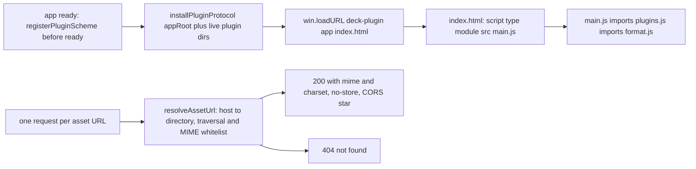
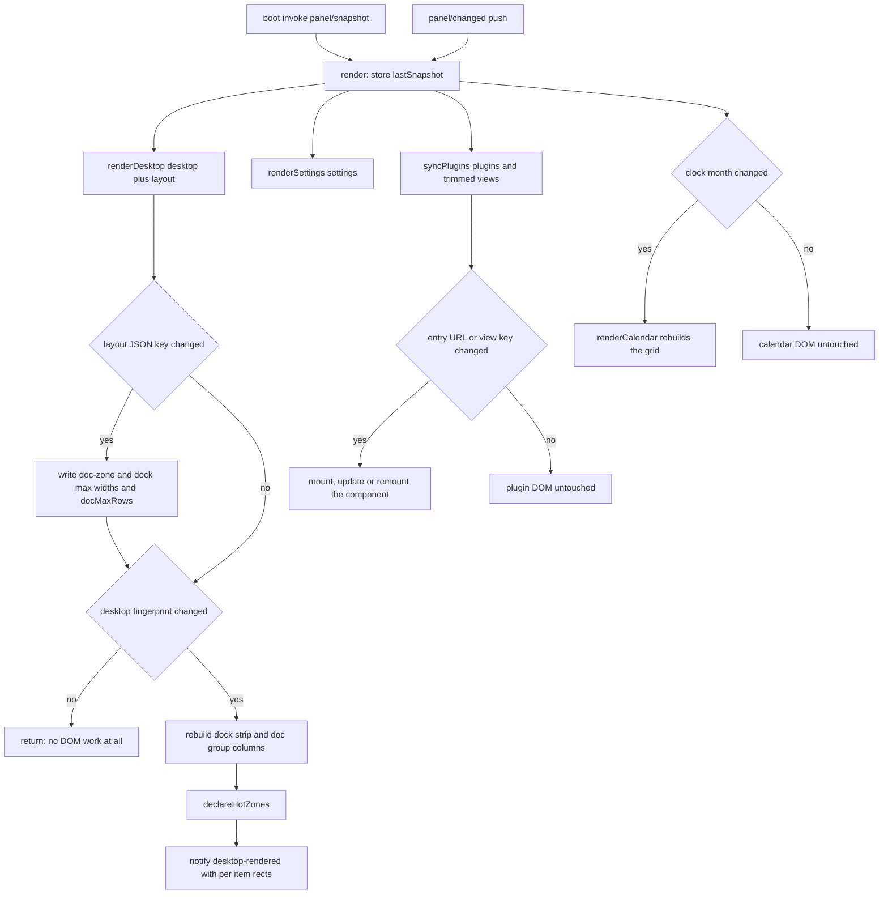
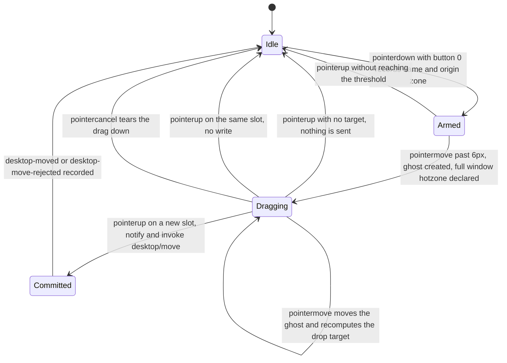
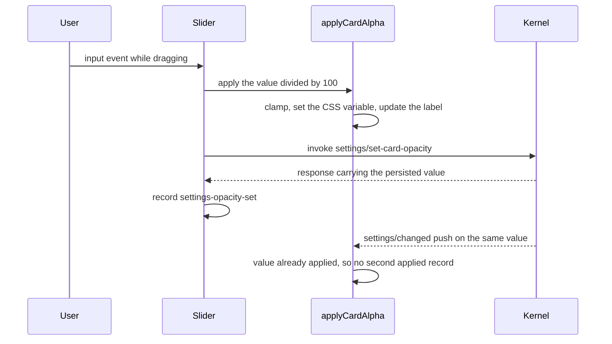

# Renderer panel: page delivery, the snapshot render loop and the in-page input surfaces

The renderer is the only user interface this repository draws. It is a single page whose whole job is to turn one `PanelSnapshot` per second into DOM, and to translate pointer and keyboard activity back into bridge calls. Two properties of the window shape everything else: it is click-through by default (so *nothing* in the page receives a click unless the page has declared a rectangle for it), and it never activates (so keyboard input only exists while the page has explicitly asked the host for it). Both are mechanics this page has to keep correct, because neither failure produces an error — a missing hotzone rectangle and a released keyboard focus both just look like an interface that stopped responding.

`app/src/renderer/main.ts` is the entry module. It owns the calendar card, the desktop carry zones, the search card and the settings overlay, the render loop, and the hotzone declarations. The right column's clock, weather, sessions and hardware cards are **not** in this file: since the plugin work they are built-in desktop components mounted by the plugin runtime, and their lifecycle belongs to [plugin host](/openwiki/architecture/plugin-host.md). This page covers the host page around them, and names the seam where the two meet.

## How the page is served

<!-- openwiki: broken internal link [/repo://app/src/main/plugins/protocol.ts#L31-L58] file "/repo://app/src/main/plugins/protocol.ts" does not exist. Fix the href or restore the target, then delete this comment. -->
<!-- openwiki: broken internal link [/repo://app/src/main/index.ts#L170-L171] file "/repo://app/src/main/index.ts" does not exist. Fix the href or restore the target, then delete this comment. -->
The page is loaded as `deck-plugin://app/index.html` — the same privileged scheme and the same code path that delivers plugin assets, which is what makes the page and the plugin modules one origin as far as ESM is concerned ([protocol.ts](/repo://app/src/main/plugins/protocol.ts#L31-L58), [index.ts](/repo://app/src/main/index.ts#L170-L171)).

*Every asset — the page, its modules and every plugin entry — is read from disk by the protocol handler in the main process; the page itself has no filesystem reach.*

The consequences are worth stating because they shape what can be changed safely:

<!-- openwiki: broken internal link [/repo://app/package.json#L7-L9] file "/repo://app/package.json" does not exist. Fix the href or restore the target, then delete this comment. -->
<!-- openwiki: broken internal link [/repo://app/scripts/copy-assets.mjs#L5-L9] file "/repo://app/scripts/copy-assets.mjs" does not exist. Fix the href or restore the target, then delete this comment. -->
<!-- openwiki: broken internal link [/repo://app/src/renderer/format.ts#L1-L6] file "/repo://app/src/renderer/format.ts" does not exist. Fix the href or restore the target, then delete this comment. -->
- **No bundler.** `npm run build` runs `tsc` twice and a copy script; `index.html` is copied verbatim into `dist/renderer` and the module graph is exactly `main.js` → `plugins.js` → `format.js` ([package.json](/repo://app/package.json#L7-L9), [copy-assets.mjs](/repo://app/scripts/copy-assets.mjs#L5-L9)). Relative specifiers in the page therefore resolve against `deck-plugin://app/`, and a module may only reach code that lives under the app root — the sibling-file hazard that forced `format.ts` helpers to be handed to plugins through `PluginHost.util` ([format.ts](/repo://app/src/renderer/format.ts#L1-L6)).
<!-- openwiki: broken internal link [/repo://app/src/renderer/global.d.ts#L1-L41] file "/repo://app/src/renderer/global.d.ts" does not exist. Fix the href or restore the target, then delete this comment. -->
<!-- openwiki: broken internal link [/repo://app/src/renderer/main.ts#L5-L7] file "/repo://app/src/renderer/main.ts" does not exist. Fix the href or restore the target, then delete this comment. -->
- **Contract types are erased.** `main.ts` imports only runtime modules; `PanelSnapshot`, `DesktopItem`, `HotzoneRect` and the rest arrive as ambient globals declared in `global.d.ts`, which re-exports them from the shared contract by `import(...)` type syntax ([global.d.ts](/repo://app/src/renderer/global.d.ts#L1-L41), [main.ts](/repo://app/src/renderer/main.ts#L5-L7)). The compiled page carries no import of `shared/contract.js`.
<!-- openwiki: broken internal link [/repo://app/src/main/panel-window.ts#L24-L42] file "/repo://app/src/main/panel-window.ts" does not exist. Fix the href or restore the target, then delete this comment. -->
<!-- openwiki: broken internal link [/repo://app/src/preload/index.ts#L8-L30] file "/repo://app/src/preload/index.ts" does not exist. Fix the href or restore the target, then delete this comment. -->
<!-- openwiki: broken internal link [/repo://app/tests/contract.spec.ts#L529-L534] file "/repo://app/tests/contract.spec.ts" does not exist. Fix the href or restore the target, then delete this comment. -->
- **The only privileged surface is `window.deck`.** The window is created with `contextIsolation`, `sandbox` and `nodeIntegration: false`, and the preload exposes exactly `bridge` and `host` ([panel-window.ts](/repo://app/src/main/panel-window.ts#L24-L42), [preload/index.ts](/repo://app/src/preload/index.ts#L8-L30)). An offline source guard asserts that the renderer never imports `node:fs` and that the preload never reads a file ([contract.spec.ts](/repo://app/tests/contract.spec.ts#L529-L534)).
<!-- openwiki: broken internal link [/repo://app/src/renderer/plugins.ts#L179-L185] file "/repo://app/src/renderer/plugins.ts" does not exist. Fix the href or restore the target, then delete this comment. -->
- **`cache-control: no-store`** on every response means a page reload always re-reads the built assets; the plugin runtime's `?v=<revision>` query is the *other* mechanism, used to defeat the ESM module cache for cards that change while the panel runs ([plugins.ts](/repo://app/src/renderer/plugins.ts#L179-L185)).

## The static surface: fixed cards, one CSS variable, and who owns what

<!-- openwiki: broken internal link [/repo://app/src/renderer/index.html#L23-L30] file "/repo://app/src/renderer/index.html" does not exist. Fix the href or restore the target, then delete this comment. -->
<!-- openwiki: broken internal link [/repo://app/src/main/panel-window.ts#L24-L27] file "/repo://app/src/main/panel-window.ts" does not exist. Fix the href or restore the target, then delete this comment. -->
`index.html` is a hand-written stylesheet plus a small body. Geometry is fixed-position in DIP, not flow layout: every interactive element has a hard-coded rectangle because the hotzone contract is derived from those rectangles, and the window is neither resizable nor movable ([index.html](/repo://app/src/renderer/index.html#L23-L30), [panel-window.ts](/repo://app/src/main/panel-window.ts#L24-L27)).

| Layer | Elements | z-index | Notes |
|---|---|---|---|
| Carry zones | `#dock-zone`, `#doc-zone` | 1 | `.zone`; fixed position, dock anchored to the bottom, doc zone at config coordinates |
| Cards | `.card` | default | `#calendar-card` and `#search-card` in the host markup, `#settings-card` when open, plus one card element created by each card plugin |
| Search card | `#search-card` | 5 | `height: auto` — the results list grows the card downward over the sessions card |
| Settings overlay | `#settings-card` | 6 | `display: none` while closed, `tabindex="-1"` so it can take focus |
| Drag ghost | `#drag-ghost` | 99 | Created per drag, `pointer-events: none` |

<!-- openwiki: broken internal link [/repo://app/src/renderer/index.html#L375-L411] file "/repo://app/src/renderer/index.html" does not exist. Fix the href or restore the target, then delete this comment. -->
<!-- openwiki: broken internal link [/repo://app/src/renderer/cards/sessions/card.ts#L66-L74] file "/repo://app/src/renderer/cards/sessions/card.ts" does not exist. Fix the href or restore the target, then delete this comment. -->
Only the calendar, the search card, the two carry zones and the settings overlay exist in the host markup ([index.html](/repo://app/src/renderer/index.html#L375-L411)). The clock, weather, sessions and hardware cards are appended by their plugins at mount time, yet their styling lives in this stylesheet as `#clock-card`, `#weather-card`, `#sessions-card`, `#hardware-card` rules — the plugin supplies `class="card"`, an `id`, and the inner markup ([cards/sessions/card.ts](/repo://app/src/renderer/cards/sessions/card.ts#L66-L74)). That split is deliberate: the host page keeps the geometry constants and the hotzone vocabulary, and a card plugin that omits the `card` class still renders but becomes unclickable.

<!-- openwiki: broken internal link [/repo://app/src/renderer/index.html#L19-L30] file "/repo://app/src/renderer/index.html" does not exist. Fix the href or restore the target, then delete this comment. -->
<!-- openwiki: broken internal link [/repo://app/src/renderer/index.html#L274-L290] file "/repo://app/src/renderer/index.html" does not exist. Fix the href or restore the target, then delete this comment. -->
<!-- openwiki: broken internal link [/repo://app/src/renderer/index.html#L305-L321] file "/repo://app/src/renderer/index.html" does not exist. Fix the href or restore the target, then delete this comment. -->
One CSS variable, `--card-alpha`, is the whole appearance state. It is set on `document.documentElement` and consumed only by the background colors of `.card` and `#dock-zone`; every text color is a literal, which is the structural guarantee that "the backdrop is adjustable, the text is always solid and legible". The settings entry button is a control rather than an information card and deliberately does not follow the slider ([index.html](/repo://app/src/renderer/index.html#L19-L30), [index.html](/repo://app/src/renderer/index.html#L274-L290), [index.html](/repo://app/src/renderer/index.html#L305-L321)).

## The render loop and its diffing

<!-- openwiki: broken internal link [/repo://app/src/renderer/main.ts#L765-L768] file "/repo://app/src/renderer/main.ts" does not exist. Fix the href or restore the target, then delete this comment. -->
A snapshot reaches the page by two paths: one `panel/snapshot` invoke issued at module scope as the page loads, and the `panel/changed` event thereafter. A failed boot invoke is reported as `snapshot-error` and the page simply renders nothing until a push arrives ([main.ts](/repo://app/src/renderer/main.ts#L765-L768)).

*One 1 Hz snapshot fans out into four independently guarded sections; an unchanged desktop, an unchanged layout, an unchanged calendar month and unchanged plugin views all mean no DOM work.*

Each guard is an equality check against state the page keeps in module scope:

<!-- openwiki: broken internal link [/repo://app/src/renderer/main.ts#L283-L294] file "/repo://app/src/renderer/main.ts" does not exist. Fix the href or restore the target, then delete this comment. -->
<!-- openwiki: broken internal link [/repo://app/src/shared/contract.ts#L119-L127] file "/repo://app/src/shared/contract.ts" does not exist. Fix the href or restore the target, then delete this comment. -->
- **Layout** is stringified and compared; on a change the doc-zone origin and max width, the dock max width and every group grid's `grid-template-rows` are written ([main.ts](/repo://app/src/renderer/main.ts#L283-L294), [contract.ts](/repo://app/src/shared/contract.ts#L119-L127)).
<!-- openwiki: broken internal link [/repo://app/src/renderer/main.ts#L296-L299] file "/repo://app/src/renderer/main.ts" does not exist. Fix the href or restore the target, then delete this comment. -->
- **The desktop fingerprint** is the concatenated item-and-plan hash the data plane produces; while it is unchanged `renderDesktop` returns before touching DOM. The split between the two halves is what keeps an in-zone reorder from re-extracting a single icon ([main.ts](/repo://app/src/renderer/main.ts#L296-L299), [desktop-zones-planning.md](/openwiki/architecture/desktop-zones-planning.md)).
<!-- openwiki: broken internal link [/repo://app/src/renderer/main.ts#L26-L51] file "/repo://app/src/renderer/main.ts" does not exist. Fix the href or restore the target, then delete this comment. -->
<!-- openwiki: broken internal link [/repo://app/src/renderer/main.ts#L705-L709] file "/repo://app/src/renderer/main.ts" does not exist. Fix the href or restore the target, then delete this comment. -->
- **The calendar** is keyed on the clock's month, not the day: the grid is rebuilt only when the month changes, so an in-month day rollover leaves the previous "today" marker in place until the month flips or the panel restarts ([main.ts](/repo://app/src/renderer/main.ts#L26-L51), [main.ts](/repo://app/src/renderer/main.ts#L705-L709)).
<!-- openwiki: broken internal link [/repo://app/src/renderer/plugins.ts#L169-L196] file "/repo://app/src/renderer/plugins.ts" does not exist. Fix the href or restore the target, then delete this comment. -->
- **Plugin views** are guarded inside the runtime by the JSON of the capability-trimmed view and by the entry URL ([plugins.ts](/repo://app/src/renderer/plugins.ts#L169-L196)).

There is no resize handling anywhere in the file, because the window cannot be resized; the only re-measurement triggers are DOM changes and font readiness (see [Hotzones](#hotzones-the-declaration-contract)).

<!-- openwiki: broken internal link [/repo://app/src/renderer/main.ts#L686-L696] file "/repo://app/src/renderer/main.ts" does not exist. Fix the href or restore the target, then delete this comment. -->
<!-- openwiki: broken internal link [/repo://app/src/renderer/main.ts#L756-L763] file "/repo://app/src/renderer/main.ts" does not exist. Fix the href or restore the target, then delete this comment. -->
`render` also keeps the last snapshot, solely so that a `plugins/changed` push can be applied immediately without re-asking the kernel: the listing is substituted into the retained snapshot and handed to `syncPlugins`, then hotzones are re-declared because a component may just have appeared or disappeared ([main.ts](/repo://app/src/renderer/main.ts#L686-L696), [main.ts](/repo://app/src/renderer/main.ts#L756-L763)).

## Desktop carry rendering

<!-- openwiki: broken internal link [/repo://app/src/renderer/main.ts#L296-L354] file "/repo://app/src/renderer/main.ts" does not exist. Fix the href or restore the target, then delete this comment. -->
`renderDesktop` is where the plan becomes DOM ([main.ts](/repo://app/src/renderer/main.ts#L296-L354)):

<!-- openwiki: broken internal link [/repo://app/src/renderer/main.ts#L300-L313] file "/repo://app/src/renderer/main.ts" does not exist. Fix the href or restore the target, then delete this comment. -->
<!-- openwiki: broken internal link [/repo://app/accept/battery.js#L1026-L1038] file "/repo://app/accept/battery.js" does not exist. Fix the href or restore the target, then delete this comment. -->
- **Dock.** Items are appended in `plan.dock` order. Afterwards, any pool item whose zone is `app` but which is absent from the plan is appended as a fallback — the plan is trusted, but a plan/pool disagreement must not silently drop a carried item. `source` (`pinned`/`placed`/`recommended`) is not rendered; it is only reported in evidence, which is how the pinned-first rule is verified on a real machine ([main.ts](/repo://app/src/renderer/main.ts#L300-L313), [battery.js](/repo://app/accept/battery.js#L1026-L1038)).
<!-- openwiki: broken internal link [/repo://app/src/renderer/main.ts#L62-L65] file "/repo://app/src/renderer/main.ts" does not exist. Fix the href or restore the target, then delete this comment. -->
<!-- openwiki: broken internal link [/repo://app/src/renderer/main.ts#L314-L333] file "/repo://app/src/renderer/main.ts" does not exist. Fix the href or restore the target, then delete this comment. -->
<!-- openwiki: broken internal link [/repo://app/src/renderer/index.html#L263-L272] file "/repo://app/src/renderer/index.html" does not exist. Fix the href or restore the target, then delete this comment. -->
- **Document zone.** One labelled block per non-empty group, always iterated in the hard-coded `GROUP_ORDER` (`folders`, `office`, `pdf`, `image`, `archive`, `other`) with `GROUP_LABELS` supplying the header text; entries inside a block keep `plan.docs` order, which is rank order per group. Columns come from CSS: the grid is `grid-auto-flow: column` with `grid-template-rows: repeat(docMaxRows, auto)` and `grid-auto-columns: 100px`, so the fold is a style decision, and `DesktopDocEntry.col`/`.row` are carried for evidence and fingerprinting rather than read by the renderer ([main.ts](/repo://app/src/renderer/main.ts#L62-L65), [main.ts](/repo://app/src/renderer/main.ts#L314-L333), [index.html](/repo://app/src/renderer/index.html#L263-L272), [desktop-zones-planning.md](/openwiki/architecture/desktop-zones-planning.md)).
<!-- openwiki: broken internal link [/repo://app/src/renderer/main.ts#L66-L73] file "/repo://app/src/renderer/main.ts" does not exist. Fix the href or restore the target, then delete this comment. -->
<!-- openwiki: broken internal link [/repo://app/src/renderer/main.ts#L82-L108] file "/repo://app/src/renderer/main.ts" does not exist. Fix the href or restore the target, then delete this comment. -->
<!-- openwiki: broken internal link [/repo://app/src/shared/contract.ts#L78-L83] file "/repo://app/src/shared/contract.ts" does not exist. Fix the href or restore the target, then delete this comment. -->
- **Icons are lazy and cached by `iconKey`.** A `Map<string, string>` holds data URLs for the life of the page; a miss issues `desktop/icon` and, when the answer is `null`, swaps the `` for a `DIR`/`URL`/`DOC` glyph and never retries — the kernel already owns the retry/backoff policy. Because the key contains the mtime, a `.lnk` whose target changes simply misses the cache and gets a new icon ([main.ts](/repo://app/src/renderer/main.ts#L66-L73), [main.ts](/repo://app/src/renderer/main.ts#L82-L108), [contract.ts](/repo://app/src/shared/contract.ts#L78-L83)).
<!-- openwiki: broken internal link [/repo://app/src/renderer/main.ts#L76-L80] file "/repo://app/src/renderer/main.ts" does not exist. Fix the href or restore the target, then delete this comment. -->
<!-- openwiki: broken internal link [/repo://app/src/renderer/main.ts#L114-L132] file "/repo://app/src/renderer/main.ts" does not exist. Fix the href or restore the target, then delete this comment. -->
- **Selection and launch.** A click sets `selectedName`, re-marks `.sel` across all `.ditem` elements and notifies `desktop-selected`; a double click notifies `desktop-launch-clicked` and calls `desktop/launch`, whose outcome becomes `desktop-launched`, `desktop-launch-rejected` or `desktop-launch-failed`. Selection is dropped when the item leaves the pool. Both handlers bail out while a drag has just finished ([main.ts](/repo://app/src/renderer/main.ts#L76-L80), [main.ts](/repo://app/src/renderer/main.ts#L114-L132)).
<!-- openwiki: broken internal link [/repo://app/src/renderer/main.ts#L337-L353] file "/repo://app/src/renderer/main.ts" does not exist. Fix the href or restore the target, then delete this comment. -->
<!-- openwiki: broken internal link [/repo://app/accept/battery.js#L1068-L1095] file "/repo://app/accept/battery.js" does not exist. Fix the href or restore the target, then delete this comment. -->
<!-- openwiki: broken internal link [/repo://app/src/renderer/index.html#L238-L247] file "/repo://app/src/renderer/index.html" does not exist. Fix the href or restore the target, then delete this comment. -->
<!-- openwiki: broken internal link [/repo://app/src/renderer/main.ts#L716-L736] file "/repo://app/src/renderer/main.ts" does not exist. Fix the href or restore the target, then delete this comment. -->
- **Evidence.** Every rebuild notifies `desktop-rendered` with a monotonic counter, the fingerprint, the item names, the dock entries with their sources, the document entries, and a `getBoundingClientRect` rectangle per item (or `null` for an item with no DOM node). The acceptance battery uses those rectangles as the physical click and drag coordinates, so they are part of the test contract, not just diagnostics ([main.ts](/repo://app/src/renderer/main.ts#L337-L353), [battery.js](/repo://app/accept/battery.js#L1068-L1095)). Note that those rectangles are raw layout boxes: an item clipped by the document zone's `overflow: hidden` still reports its unclipped position, which is exactly why the hotzone computation intersects with the container instead of trusting them ([index.html](/repo://app/src/renderer/index.html#L238-L247), [main.ts](/repo://app/src/renderer/main.ts#L716-L736)).

## Dragging: hand-rolled pointer events

<!-- openwiki: broken internal link [/repo://app/src/renderer/main.ts#L134-L153] file "/repo://app/src/renderer/main.ts" does not exist. Fix the href or restore the target, then delete this comment. -->
Layout placement is not HTML5 drag-and-drop. The source states two reasons: synthesized input cannot drive an OLE drag, and the self-drawn world needs "before whom" semantics rather than a drop payload. So dragging is pointer events on the item element, with one module-level `dragState` shared by all items ([main.ts](/repo://app/src/renderer/main.ts#L134-L153)).

*The drag has one armed state, one active state and one commit point; every exit path funnels through the same teardown, which also restores the ordinary hotzone list.*

The mechanics that matter:

<!-- openwiki: broken internal link [/repo://app/src/renderer/main.ts#L181-L191] file "/repo://app/src/renderer/main.ts" does not exist. Fix the href or restore the target, then delete this comment. -->
- **Arming** stores the item name, its `zone` from the snapshot, the pointer origin, and resets `active` and `suppressed`. `setPointerCapture` is attempted inside a `try` so that environments without it degrade to window-local dragging ([main.ts](/repo://app/src/renderer/main.ts#L181-L191)).
<!-- openwiki: broken internal link [/repo://app/src/renderer/main.ts#L192-L203] file "/repo://app/src/renderer/main.ts" does not exist. Fix the href or restore the target, then delete this comment. -->
- **The threshold** is 6 px of Euclidean distance; only past it does the drag become active, a ghost is created, `suppressed` is set to true, and the hotzone list is *replaced wholesale* by one full-window rectangle `{id: 'drag'}`. That replacement is load-bearing: a cross-zone drag passes over gaps between declared rectangles, and if the panel reverted to click-through mid-gesture the pointer stream would break and the drag would die in place ([main.ts](/repo://app/src/renderer/main.ts#L192-L203)).
<!-- openwiki: broken internal link [/repo://app/src/renderer/main.ts#L155-L179] file "/repo://app/src/renderer/main.ts" does not exist. Fix the href or restore the target, then delete this comment. -->
<!-- openwiki: broken internal link [/repo://app/src/renderer/main.ts#L204-L214] file "/repo://app/src/renderer/main.ts" does not exist. Fix the href or restore the target, then delete this comment. -->
<!-- openwiki: broken internal link [/repo://app/src/renderer/index.html#L292-L303] file "/repo://app/src/renderer/index.html" does not exist. Fix the href or restore the target, then delete this comment. -->
- **Hit testing** uses `document.elementFromPoint` for two separate questions: `zoneOfContainer` walks up the ancestor chain to classify the pointer as `app` (inside `#dock-zone`), `doc` (inside `#doc-zone` or `#doc-groups`) or nothing, while `itemUnder` finds the closest `.ditem` under the pointer, excluding the dragged item itself. Nothing under the pointer means the drop target is cleared and the gesture will end as a no-op. The ghost carries `pointer-events: none` so it never shadows the hit test, and the source item is dimmed with `.dragging` ([main.ts](/repo://app/src/renderer/main.ts#L155-L179), [main.ts](/repo://app/src/renderer/main.ts#L204-L214), [index.html](/repo://app/src/renderer/index.html#L292-L303)).
<!-- openwiki: broken internal link [/repo://app/src/renderer/main.ts#L174-L179] file "/repo://app/src/renderer/main.ts" does not exist. Fix the href or restore the target, then delete this comment. -->
<!-- openwiki: broken internal link [/repo://app/src/renderer/index.html#L290] file "/repo://app/src/renderer/index.html" does not exist. Fix the href or restore the target, then delete this comment. -->
- **The drop indicator** is a `.drop-before` class on the item that would be displaced, cleared and re-applied on each move ([main.ts](/repo://app/src/renderer/main.ts#L174-L179), [index.html](/repo://app/src/renderer/index.html#L290)).
<!-- openwiki: broken internal link [/repo://app/src/renderer/main.ts#L216-L242] file "/repo://app/src/renderer/main.ts" does not exist. Fix the href or restore the target, then delete this comment. -->
- **Commit** is a `desktop/move` with `{name, zone, beforeName}` — one call covers both reordering and a cross-zone move, since `zone` travels with it. Before sending, the page compares the target against `nextSiblingName(name)` and skips the write when the item would land exactly where it already is. Outcomes are recorded as `desktop-move-clicked`, then `desktop-moved` / `desktop-move-rejected` / `desktop-move-failed` ([main.ts](/repo://app/src/renderer/main.ts#L216-L242)).
<!-- openwiki: broken internal link [/repo://app/src/renderer/main.ts#L265-L279] file "/repo://app/src/renderer/main.ts" does not exist. Fix the href or restore the target, then delete this comment. -->
- **Teardown** removes the ghost, clears `.dragging` and `.drop-before`, resets the state, re-declares the ordinary hotzones, and releases `suppressed` on a `setTimeout(0)` — because the browser still delivers one `click` after `pointerup`, and that trailing click must not be mistaken for a selection ([main.ts](/repo://app/src/renderer/main.ts#L265-L279)).

The kernel side of a move — validation, persistence in `layout.json`, re-planning and the persistence check across a panel restart — is covered by [desktop carry runtime](/openwiki/architecture/desktop-zones-execution.md) and the operator-facing [drag an item to a new layout position](/openwiki/workflows/desktop-item-drag-to-layout.md).

## The settings overlay and the opacity plumbing

<!-- openwiki: broken internal link [/repo://app/src/renderer/index.html#L324-L372] file "/repo://app/src/renderer/index.html" does not exist. Fix the href or restore the target, then delete this comment. -->
<!-- openwiki: broken internal link [/repo://app/src/renderer/index.html#L401-L411] file "/repo://app/src/renderer/index.html" does not exist. Fix the href or restore the target, then delete this comment. -->
The overlay is a `.card` that is `display: none` when closed, toggled by a small fixed button, and it holds exactly two things: the backdrop-opacity slider and the factory-layout reset entry ([index.html](/repo://app/src/renderer/index.html#L324-L372), [index.html](/repo://app/src/renderer/index.html#L401-L411)).

<!-- openwiki: broken internal link [/repo://app/src/renderer/main.ts#L392-L406] file "/repo://app/src/renderer/main.ts" does not exist. Fix the href or restore the target, then delete this comment. -->
<!-- openwiki: broken internal link [/repo://app/accept/battery.js#L1521-L1547] file "/repo://app/accept/battery.js" does not exist. Fix the href or restore the target, then delete this comment. -->
<!-- openwiki: broken internal link [/repo://app/src/renderer/main.ts#L390-L417] file "/repo://app/src/renderer/main.ts" does not exist. Fix the href or restore the target, then delete this comment. -->
Opening calls `setKeyboardMode(true)` before showing the card, then focuses the card itself, then notifies `settings-opened` with the slider rectangle and the current percentage — the rectangle exists so the acceptance battery can drive a real drag without guessing the thumb position, and the value exists so "the slider starts at the config value" is assertable ([main.ts](/repo://app/src/renderer/main.ts#L392-L406), [battery.js](/repo://app/accept/battery.js#L1521-L1547)). Closing is one function with a reason in the evidence: `esc`, `blur` or `toggle` ([main.ts](/repo://app/src/renderer/main.ts#L390-L417)).

Three focus details make the overlay behave under a window that is normally non-focusable:

<!-- openwiki: broken internal link [/repo://app/src/renderer/main.ts#L419-L426] file "/repo://app/src/renderer/main.ts" does not exist. Fix the href or restore the target, then delete this comment. -->
- The entry button's `mousedown` is cancelled so clicking it never steals focus — otherwise the overlay's own `focusout` would close it on the click that was meant to toggle it ([main.ts](/repo://app/src/renderer/main.ts#L419-L426)).
<!-- openwiki: broken internal link [/repo://app/src/renderer/main.ts#L428-L431] file "/repo://app/src/renderer/main.ts" does not exist. Fix the href or restore the target, then delete this comment. -->
- Inside the card, `mousedown` is cancelled everywhere *except* on the slider, which needs focus to be draggable by keyboard and by pointer without the renderer fighting it for position ([main.ts](/repo://app/src/renderer/main.ts#L428-L431)).
<!-- openwiki: broken internal link [/repo://app/src/renderer/main.ts#L440-L444] file "/repo://app/src/renderer/main.ts" does not exist. Fix the href or restore the target, then delete this comment. -->
- `focusout` closes the overlay only when the new focus target is not inside the card, which is what lets the slider take focus without closing the panel. The source notes the same semantic boundary as the search card: "clicking outside" physically cannot reach the renderer, because those pixels are click-through ([main.ts](/repo://app/src/renderer/main.ts#L440-L444)).

Opacity has three write paths into one idempotent function, which is the whole reason the appearance cannot drift between the slider, the CSS variable and the persisted config:

*Slider, boot snapshot and kernel push all funnel through one function; because it notifies only on an actual value change, the three paths cannot produce conflicting records or a slider that fights the user.*

<!-- openwiki: broken internal link [/repo://app/src/renderer/main.ts#L372-L384] file "/repo://app/src/renderer/main.ts" does not exist. Fix the href or restore the target, then delete this comment. -->
- `applyCardAlpha` clamps, writes `--card-alpha` with three decimals, renders the label as a zero-padded percentage, and — unless the slider is the focused element — reconciles the slider position. The focused-slider exception is explicit: while the user is dragging, the user is the only source of the value ([main.ts](/repo://app/src/renderer/main.ts#L372-L384)).
<!-- openwiki: broken internal link [/repo://app/src/renderer/main.ts#L446-L454] file "/repo://app/src/renderer/main.ts" does not exist. Fix the href or restore the target, then delete this comment. -->
<!-- openwiki: broken internal link [/repo://app/src/shared/contract.ts#L242-L243] file "/repo://app/src/shared/contract.ts" does not exist. Fix the href or restore the target, then delete this comment. -->
- The slider's `input` handler applies locally first (immediate visual feedback), then invokes `settings/set-card-opacity`, so the persistence round trip and the paint do not wait on each other. The response is recorded as `settings-opacity-set`, a rejection as `settings-opacity-failed` ([main.ts](/repo://app/src/renderer/main.ts#L446-L454), [contract.ts](/repo://app/src/shared/contract.ts#L242-L243)).
<!-- openwiki: broken internal link [/repo://app/src/renderer/main.ts#L464] file "/repo://app/src/renderer/main.ts" does not exist. Fix the href or restore the target, then delete this comment. -->
<!-- openwiki: broken internal link [/repo://app/accept/battery.js#L1601-L1623] file "/repo://app/accept/battery.js" does not exist. Fix the href or restore the target, then delete this comment. -->
- `settings/changed` and every snapshot both call the same function, which is how a value written before a restart reappears: the boot render reports `settings-opacity-applied`, and that record is what the battery waits for after a relaunch ([main.ts](/repo://app/src/renderer/main.ts#L464), [battery.js](/repo://app/accept/battery.js#L1601-L1623)).
<!-- openwiki: broken internal link [/repo://app/src/renderer/main.ts#L456-L462] file "/repo://app/src/renderer/main.ts" does not exist. Fix the href or restore the target, then delete this comment. -->
- The reset entry belongs to the overlay but the action belongs to the desktop store: it notifies `desktop-reset-clicked` and invokes `desktop/reset-layout`, reporting `desktop-layout-reset` with the number of cleared placements, or `desktop-reset-failed` ([main.ts](/repo://app/src/renderer/main.ts#L456-L462), [desktop-zones-execution.md](/openwiki/architecture/desktop-zones-execution.md)).

## The search card as a UI mirror of the kernel state

<!-- openwiki: broken internal link [/repo://app/src/renderer/main.ts#L466-L485] file "/repo://app/src/renderer/main.ts" does not exist. Fix the href or restore the target, then delete this comment. -->
<!-- openwiki: broken internal link [/repo://app/src/shared/contract.ts#L214-L215] file "/repo://app/src/shared/contract.ts" does not exist. Fix the href or restore the target, then delete this comment. -->
The engine link is entirely in the kernel: the page feeds words to `search/query` and receives results and state changes as events. What the page owns is presentation and the local transition model, and it deliberately mirrors only part of the kernel's `SearchUiState` ([main.ts](/repo://app/src/renderer/main.ts#L466-L485), [contract.ts](/repo://app/src/shared/contract.ts#L214-L215)):

<!-- openwiki: broken internal link [/repo://app/src/renderer/main.ts#L595-L612] file "/repo://app/src/renderer/main.ts" does not exist. Fix the href or restore the target, then delete this comment. -->
<!-- openwiki: broken internal link [/repo://app/src/renderer/index.html#L387-L396] file "/repo://app/src/renderer/index.html" does not exist. Fix the href or restore the target, then delete this comment. -->
- The standby shape is the card head plus a `CLICK TO SEARCH_` hint. Clicking anywhere on the card activates: `searchActive` flips, keyboard mode is requested, the native `<input>` replaces the hint, the placeholder shows while the input is empty, `search/activate` is invoked, and the input is focused from JavaScript — which is the probe-verified reason a Chinese IME and composition events work normally ([main.ts](/repo://app/src/renderer/main.ts#L595-L612), [index.html](/repo://app/src/renderer/index.html#L387-L396)).
<!-- openwiki: broken internal link [/repo://app/src/renderer/main.ts#L596-L599] file "/repo://app/src/renderer/main.ts" does not exist. Fix the href or restore the target, then delete this comment. -->
- Activating while already active only re-focuses the input and never clears the query, matching the kernel's idempotent activation ([main.ts](/repo://app/src/renderer/main.ts#L596-L599)).
<!-- openwiki: broken internal link [/repo://app/src/renderer/main.ts#L643-L649] file "/repo://app/src/renderer/main.ts" does not exist. Fix the href or restore the target, then delete this comment. -->
- Every `input` event sends the current text to `search/query`; debouncing is the kernel's job (~200 ms). An emptied input clears the results DOM locally ([main.ts](/repo://app/src/renderer/main.ts#L643-L649)).
<!-- openwiki: broken internal link [/repo://app/src/renderer/main.ts#L670-L676] file "/repo://app/src/renderer/main.ts" does not exist. Fix the href or restore the target, then delete this comment. -->
- `search/results` is ignored whenever `searchActive` is false — that is how a late response for a query that was already abandoned is dropped instead of painting stale rows over the standby hint ([main.ts](/repo://app/src/renderer/main.ts#L670-L676)).
<!-- openwiki: broken internal link [/repo://app/src/renderer/main.ts#L678-L684] file "/repo://app/src/renderer/main.ts" does not exist. Fix the href or restore the target, then delete this comment. -->
- `search/state` only matters for the offline case: `offline` while active swaps the results box for the inverted `ENGINE OFFLINE` badge and notifies `search-offline-shown`; `active` needs no handling because the next results event redraws the rows; `idle` is handled purely by the local transition ([main.ts](/repo://app/src/renderer/main.ts#L678-L684)).
<!-- openwiki: broken internal link [/repo://app/src/renderer/main.ts#L615-L635] file "/repo://app/src/renderer/main.ts" does not exist. Fix the href or restore the target, then delete this comment. -->
<!-- openwiki: broken internal link [/repo://app/src/renderer/main.ts#L665-L668] file "/repo://app/src/renderer/main.ts" does not exist. Fix the href or restore the target, then delete this comment. -->
- Deactivation has three reasons — `esc`, `blur`, `action` — and one teardown: keyboard mode off, `search/deactivate` invoked, input cleared and hidden, hint restored, results cleared, input blurred, `search-deactivated` notified with the reason. A `searchDeactivating` flag is set around the programmatic blur so the resulting `blur` event cannot re-enter and double-fire; the flag is released on a `setTimeout(0)` ([main.ts](/repo://app/src/renderer/main.ts#L615-L635), [main.ts](/repo://app/src/renderer/main.ts#L665-L668)).

<!-- openwiki: broken internal link [/repo://app/src/renderer/main.ts#L479-L530] file "/repo://app/src/renderer/main.ts" does not exist. Fix the href or restore the target, then delete this comment. -->
<!-- openwiki: broken internal link [/repo://app/src/renderer/main.ts#L532-L566] file "/repo://app/src/renderer/main.ts" does not exist. Fix the href or restore the target, then delete this comment. -->
Rendering of results and the selection model are local and small: at most `SEARCH_LIMIT` (8) rows plus a `NO RESULTS` placeholder and a `TOTAL n` footer, each row split into name and parent directory by the last path separator with the drive-root rule (`C:\` rather than `C:`), the name elided from the right (26 chars) and the parent from the left (24 chars) because the identifying part of a filename is at its start and of a path at its end. A new result set resets the selection to the first row; `searchMove` clamps at both ends instead of wrapping, and each move notifies `search-selection-moved` with the index ([main.ts](/repo://app/src/renderer/main.ts#L479-L530), [main.ts](/repo://app/src/renderer/main.ts#L532-L566)).

<!-- openwiki: broken internal link [/repo://app/src/renderer/main.ts#L504-L510] file "/repo://app/src/renderer/main.ts" does not exist. Fix the href or restore the target, then delete this comment. -->
<!-- openwiki: broken internal link [/repo://app/src/renderer/main.ts#L551-L593] file "/repo://app/src/renderer/main.ts" does not exist. Fix the href or restore the target, then delete this comment. -->
<!-- openwiki: broken internal link [/repo://app/src/renderer/main.ts#L651-L663] file "/repo://app/src/renderer/main.ts" does not exist. Fix the href or restore the target, then delete this comment. -->
Key handling is a direct port of the previous implementation: `ArrowUp`/`ArrowDown` move the selection and are `preventDefault`ed so the caret does not move, `Enter` opens, `Ctrl+Enter` reveals in Explorer, `Escape` deactivates, and every other key is left alone. Row clicks are protected with a `mousedown` `preventDefault` for the same reason as the settings card — a stolen focus would collapse the card before the click landed. A completed action deactivates the card in the same tick ([main.ts](/repo://app/src/renderer/main.ts#L504-L510), [main.ts](/repo://app/src/renderer/main.ts#L551-L593), [main.ts](/repo://app/src/renderer/main.ts#L651-L663)).

<!-- openwiki: broken internal link [/repo://app/src/renderer/main.ts#L472] file "/repo://app/src/renderer/main.ts" does not exist. Fix the href or restore the target, then delete this comment. -->
<!-- openwiki: broken internal link [/repo://app/src/renderer/main.ts#L580-L592] file "/repo://app/src/renderer/main.ts" does not exist. Fix the href or restore the target, then delete this comment. -->
<!-- openwiki: broken internal link [/repo://app/src/renderer/main.ts#L673-L675] file "/repo://app/src/renderer/main.ts" does not exist. Fix the href or restore the target, then delete this comment. -->
<!-- openwiki: broken internal link [/repo://app/accept/battery.js#L1317-L1320] file "/repo://app/accept/battery.js" does not exist. Fix the href or restore the target, then delete this comment. -->
**The privacy rule this file observes:** no evidence record ever carries query text. The page reports query *lengths* only — `qlen` on `search-action` and `search-results-rendered` — and the acceptance battery's assertion text says so explicitly ([main.ts](/repo://app/src/renderer/main.ts#L472), [main.ts](/repo://app/src/renderer/main.ts#L580-L592), [main.ts](/repo://app/src/renderer/main.ts#L673-L675), [battery.js](/repo://app/accept/battery.js#L1317-L1320)). The query itself travels only inside the `search/query` bridge call, and the resolved paths only inside `search/action`.

## Hotzones: the declaration contract

<!-- openwiki: broken internal link [/repo://app/src/main/panel-window.ts#L38-L43] file "/repo://app/src/main/panel-window.ts" does not exist. Fix the href or restore the target, then delete this comment. -->
<!-- openwiki: broken internal link [/repo://app/src/main/hotzone.ts#L4-L69] file "/repo://app/src/main/hotzone.ts" does not exist. Fix the href or restore the target, then delete this comment. -->
<!-- openwiki: broken internal link [/repo://app/src/preload/index.ts#L23-L30] file "/repo://app/src/preload/index.ts" does not exist. Fix the href or restore the target, then delete this comment. -->
The panel window is created with `setIgnoreMouseEvents(true)` and a 25 ms cursor poll in the main process decides, per rectangle, whether the window should temporarily accept input; leaving is confirmed over two polls and re-pinning is throttled ([panel-window.ts](/repo://app/src/main/panel-window.ts#L38-L43), [hotzone.ts](/repo://app/src/main/hotzone.ts#L4-L69)). The renderer's only duty is to publish the rectangles, and it does so through a fire-and-forget host call — `setHotZones` has no response, so a page can never learn that its rectangles were wrong ([preload/index.ts](/repo://app/src/preload/index.ts#L23-L30), [bridge-contract-and-ipc.md](/openwiki/architecture/bridge-contract-and-ipc.md)).

<!-- openwiki: broken internal link [/repo://app/src/renderer/main.ts#L712-L754] file "/repo://app/src/renderer/main.ts" does not exist. Fix the href or restore the target, then delete this comment. -->
`declareHotZones` builds the whole list from scratch on every call ([main.ts](/repo://app/src/renderer/main.ts#L712-L754)):

| Source | Rule |
|---|---|
| Cards | Every element with class `card`, one rectangle per element, `id` taken from the element — this is why a card plugin must set both the class and an id |
| Dock strip | `zoneItemRect(#dock-zone, 'dock-zone')`: the union bounding box of the strip's `.ditem` children, inflated by 10 px and intersected with the container's own box |
| Document zone | `zoneItemRect(#doc-zone, 'doc-zone')`: same rule, so the strip's inner padding comes along and clipped overflow does not reserve clicks |
| Settings button | Explicit, added when its rectangle has non-zero width |
| Reset button | Explicit, so the battery can target `settings-reset` by id from the evidence alone |
| Filter | Any rectangle with `w <= 0` or `h <= 0` is dropped |

<!-- openwiki: broken internal link [/repo://app/src/renderer/main.ts#L716-L736] file "/repo://app/src/renderer/main.ts" does not exist. Fix the href or restore the target, then delete this comment. -->
<!-- openwiki: broken internal link [/repo://app/src/renderer/index.html#L238-L254] file "/repo://app/src/renderer/index.html" does not exist. Fix the href or restore the target, then delete this comment. -->
The synthesized zone rectangles are the interesting part: an empty zone contributes nothing (no invisible click dead zone where there are no items), the items' own boxes are padded by 10 px so a cursor stopped on the strip's inner edge still counts as inside, and the intersection with the visible container is what keeps a document item clipped by `overflow: hidden` from claiming clicks outside the strip ([main.ts](/repo://app/src/renderer/main.ts#L716-L736), [index.html](/repo://app/src/renderer/index.html#L238-L254)).

<!-- openwiki: broken internal link [/repo://app/src/renderer/main.ts#L276] file "/repo://app/src/renderer/main.ts" does not exist. Fix the href or restore the target, then delete this comment. -->
<!-- openwiki: broken internal link [/repo://app/src/renderer/main.ts#L336] file "/repo://app/src/renderer/main.ts" does not exist. Fix the href or restore the target, then delete this comment. -->
<!-- openwiki: broken internal link [/repo://app/src/renderer/main.ts#L405] file "/repo://app/src/renderer/main.ts" does not exist. Fix the href or restore the target, then delete this comment. -->
<!-- openwiki: broken internal link [/repo://app/src/renderer/main.ts#L416] file "/repo://app/src/renderer/main.ts" does not exist. Fix the href or restore the target, then delete this comment. -->
<!-- openwiki: broken internal link [/repo://app/src/renderer/main.ts#L565] file "/repo://app/src/renderer/main.ts" does not exist. Fix the href or restore the target, then delete this comment. -->
<!-- openwiki: broken internal link [/repo://app/src/renderer/main.ts#L577] file "/repo://app/src/renderer/main.ts" does not exist. Fix the href or restore the target, then delete this comment. -->
<!-- openwiki: broken internal link [/repo://app/src/renderer/main.ts#L611] file "/repo://app/src/renderer/main.ts" does not exist. Fix the href or restore the target, then delete this comment. -->
<!-- openwiki: broken internal link [/repo://app/src/renderer/main.ts#L634] file "/repo://app/src/renderer/main.ts" does not exist. Fix the href or restore the target, then delete this comment. -->
<!-- openwiki: broken internal link [/repo://app/src/renderer/main.ts#L688-L693] file "/repo://app/src/renderer/main.ts" does not exist. Fix the href or restore the target, then delete this comment. -->
<!-- openwiki: broken internal link [/repo://app/src/renderer/main.ts#L762] file "/repo://app/src/renderer/main.ts" does not exist. Fix the href or restore the target, then delete this comment. -->
<!-- openwiki: broken internal link [/repo://app/src/renderer/main.ts#L770-L771] file "/repo://app/src/renderer/main.ts" does not exist. Fix the href or restore the target, then delete this comment. -->
Declaration runs at every point where rectangles can move or appear: the end of `endDrag` (restoring the ordinary list after the full-window drag rectangle), every desktop rebuild, settings open and close, search activate, deactivate, results render and offline render, a `plugins/changed` push, the plugin runtime's `onDomChanged` after a mount or unmount, one unconditional call at the end of the module, and again once `document.fonts.ready` resolves — the last one exists because a font swap can reflow labels and move rectangles after the first measurement ([main.ts](/repo://app/src/renderer/main.ts#L276), [main.ts](/repo://app/src/renderer/main.ts#L336), [main.ts](/repo://app/src/renderer/main.ts#L405), [main.ts](/repo://app/src/renderer/main.ts#L416), [main.ts](/repo://app/src/renderer/main.ts#L565), [main.ts](/repo://app/src/renderer/main.ts#L577), [main.ts](/repo://app/src/renderer/main.ts#L611), [main.ts](/repo://app/src/renderer/main.ts#L634), [main.ts](/repo://app/src/renderer/main.ts#L688-L693), [main.ts](/repo://app/src/renderer/main.ts#L762), [main.ts](/repo://app/src/renderer/main.ts#L770-L771)).

Three consequences follow, and all three are silent when violated:

<!-- openwiki: broken internal link [/repo://app/accept/battery.js#L743-L750] file "/repo://app/accept/battery.js" does not exist. Fix the href or restore the target, then delete this comment. -->
<!-- openwiki: broken internal link [/repo://app/accept/battery.js#L2127-L2151] file "/repo://app/accept/battery.js" does not exist. Fix the href or restore the target, then delete this comment. -->
- **A missing or wrong rectangle means clicks pass through to whatever is underneath** — the desktop, or another window. Nothing is logged, nothing throws; the surface simply appears dead. This is the failure the acceptance battery exists to catch, and it is why every interactive card is asserted by id in the `hotzones` evidence record, including one that has just been hot-plugged ([battery.js](/repo://app/accept/battery.js#L743-L750), [battery.js](/repo://app/accept/battery.js#L2127-L2151)).
- **An oversized rectangle is equally wrong in the other direction**: it creates a region that swallows desktop clicks while showing no control, which is why cards are declared as measured boxes and empty zones contribute nothing.
- **Re-declaration is tied to the triggers above, not to geometry generally.** A snapshot whose layout changed while the desktop fingerprint did not returns early from `renderDesktop` before the hotzone call, so the page's clickable geometry catches up on the next declaration trigger rather than on that snapshot. New interactive elements must therefore either be created with the `card` class and an id before a declaration runs, or have the page call `declareHotZones` after mutating the DOM.

## Evidence the acceptance battery keys on

<!-- openwiki: broken internal link [/repo://app/src/renderer/main.ts#L15-L19] file "/repo://app/src/renderer/main.ts" does not exist. Fix the href or restore the target, then delete this comment. -->
<!-- openwiki: broken internal link [/repo://app/src/main/panel-ipc.ts#L9-L24] file "/repo://app/src/main/panel-ipc.ts" does not exist. Fix the href or restore the target, then delete this comment. -->
<!-- openwiki: broken internal link [/repo://app/src/main/panel-ipc.ts#L63-L65] file "/repo://app/src/main/panel-ipc.ts" does not exist. Fix the href or restore the target, then delete this comment. -->
`notify` is the page's single evidence channel: a fire-and-forget `deck:host-notify` message that the main process appends to a JSONL log when `DECK_EVENT_LOG` is set, adding a wall-clock `t` to every record ([main.ts](/repo://app/src/renderer/main.ts#L15-L19), [panel-ipc.ts](/repo://app/src/main/panel-ipc.ts#L9-L24), [panel-ipc.ts](/repo://app/src/main/panel-ipc.ts#L63-L65)). This file's records, and what the real-machine battery reads out of them:

| Record | Payload highlights | What it is for |
|---|---|---|
| `desktop-rendered` | `n`, `fingerprint`, `apps`, `docs`, `names`, `dock` (name + source), `docEntries`, `rects` (per item, `null` when unrendered) | Proves pool/disk agreement and arrangement, and supplies the physical coordinates for selection, launch and drag probes |
| `desktop-selected`, `desktop-launch-clicked`, `desktop-launched` / `desktop-launch-rejected` / `desktop-launch-failed` | `name`, `path`, `ok`, `error` | Single-click selection and double-click launch, including refusals |
| `desktop-move-clicked`, `desktop-moved` / `desktop-move-rejected` / `desktop-move-failed` | `name`, `zone`, `beforeName`, `ok`, `error` | That a real pointer drag reached `desktop/move` and landed |
| `desktop-reset-clicked`, `desktop-layout-reset`, `desktop-reset-failed` | `ok`, `cleared` | The factory-layout entry in the settings overlay |
| `settings-opened`, `settings-closed` | slider rect, `value`; `reason` = `esc` / `blur` / `toggle` | Overlay open/close and the three close paths, plus slider targeting |
| `settings-opacity-input`, `settings-opacity-set`, `settings-opacity-applied`, `settings-opacity-failed` | `value` as a percentage | The three-way consistency chain between slider, kernel response, applied CSS and the persisted config, including across a restart |
| `search-activated`, `search-deactivated` | `reason` = `esc` / `blur` / `action` | Activation and each way back to standby |
| `search-results-rendered`, `search-selection-moved`, `search-offline-shown` | `qlen`, `total`, `count` · `index` · none | That a query reached the screen, that the arrow keys moved the selection by index, and that the engine-offline degradation rendered |
| `search-action`, `search-opened` / `search-revealed` / `search-action-rejected`, `search-action-failed` | `index`, `reveal`, `qlen`, `ok`, `error` | The two result actions and their refusals |
| `plugins-changed` | `ids`, `status` strings | That the listing changed and how the host classified each entry |
| `snapshot-error` | `message` | The boot invoke failed; the page is running on pushes only |

<!-- openwiki: broken internal link [/repo://app/src/main/panel-ipc.ts#L57-L82] file "/repo://app/src/main/panel-ipc.ts" does not exist. Fix the href or restore the target, then delete this comment. -->
Card-level records (`sessions-rendered`, `hardware-rendered`, `weather-rendered`, `clock-card-clicked`, `session-focus-*`, `plugin-mounted`, `plugin-load-failed`, …) come from the card plugins through the same channel and are documented in [plugin host](/openwiki/architecture/plugin-host.md). The `hotzones`, `keyboard-mode-on` and `keyboard-mode-off` records are written by the main process, not by this file ([panel-ipc.ts](/repo://app/src/main/panel-ipc.ts#L57-L82)).

## Failure handling and invariants worth preserving

<!-- openwiki: broken internal link [/repo://app/src/renderer/main.ts#L82-L96] file "/repo://app/src/renderer/main.ts" does not exist. Fix the href or restore the target, then delete this comment. -->
<!-- openwiki: broken internal link [/repo://app/src/renderer/main.ts#L585-L591] file "/repo://app/src/renderer/main.ts" does not exist. Fix the href or restore the target, then delete this comment. -->
- **Silent degradation everywhere.** No bridge rejection in this file produces a dialog or an exception path: launches, moves, resets, opacity writes and search actions are turned into evidence records, icon failures fall back to a glyph, and a late search response is discarded. The stated policy is that a panel of cards must not fight the desktop for attention ([main.ts](/repo://app/src/renderer/main.ts#L82-L96), [main.ts](/repo://app/src/renderer/main.ts#L585-L591)).
- **Every interactive surface must be both measured and declared.** Class `card` plus a stable `id` for cards, explicit rectangles for controls that are not cards, and the full-window rectangle only for the duration of a drag.
<!-- openwiki: broken internal link [/repo://app/src/renderer/main.ts#L395-L396] file "/repo://app/src/renderer/main.ts" does not exist. Fix the href or restore the target, then delete this comment. -->
<!-- openwiki: broken internal link [/repo://app/src/renderer/main.ts#L411-L413] file "/repo://app/src/renderer/main.ts" does not exist. Fix the href or restore the target, then delete this comment. -->
<!-- openwiki: broken internal link [/repo://app/src/renderer/main.ts#L601-L602] file "/repo://app/src/renderer/main.ts" does not exist. Fix the href or restore the target, then delete this comment. -->
<!-- openwiki: broken internal link [/repo://app/src/renderer/main.ts#L622-L624] file "/repo://app/src/renderer/main.ts" does not exist. Fix the href or restore the target, then delete this comment. -->
- **Focus is borrowed, never kept.** The page turns keyboard mode on for exactly the two scenes that need typing and off on the way out, on every exit path (ESC, blur, toggle, completed action) ([main.ts](/repo://app/src/renderer/main.ts#L395-L396), [main.ts](/repo://app/src/renderer/main.ts#L411-L413), [main.ts](/repo://app/src/renderer/main.ts#L601-L602), [main.ts](/repo://app/src/renderer/main.ts#L622-L624)).
- **The 1 Hz snapshot must not touch unchanged DOM.** Any new panel section needs its own equality guard, and any new guard must be a comparison the data plane can actually keep stable.
- **Rects reported in evidence are layout boxes, rects declared as hotzones are clipped boxes.** Keeping those two distinct is what prevents both dead zones and clipped items that still absorb clicks.
- **The query text never enters evidence.** Only lengths cross into the log.

## Verification

<!-- openwiki: broken internal link [/repo://app/tests/contract.spec.ts#L529-L534] file "/repo://app/tests/contract.spec.ts" does not exist. Fix the href or restore the target, then delete this comment. -->
<!-- openwiki: broken internal link [/repo://app/tests/config.spec.ts#L78-L85] file "/repo://app/tests/config.spec.ts" does not exist. Fix the href or restore the target, then delete this comment. -->
<!-- openwiki: broken internal link [/repo://app/accept/battery.js#L1-L8] file "/repo://app/accept/battery.js" does not exist. Fix the href or restore the target, then delete this comment. -->
There is no offline test for `main.ts`: `vitest` never loads the page, the preload runtime or the hotzone tracker. The offline suite touches this page only indirectly — a source-level guard keeps `node:fs` out of the renderer runtime and out of the preload, and the config test pins the default desktop geometry (the doc-zone origin, `docMaxRows` and the dock max width) that the page applies ([contract.spec.ts](/repo://app/tests/contract.spec.ts#L529-L534), [config.spec.ts](/repo://app/tests/config.spec.ts#L78-L85)). Everything else on this page is verified on a real machine by `npm run accept`, which launches the panel with the event log enabled, drives real SendInput clicks and drags at coordinates derived from the evidence rectangles, and screenshots the result ([battery.js](/repo://app/accept/battery.js#L1-L8)).

<!-- openwiki: broken internal link [/repo://app/accept/battery.js#L27-L38] file "/repo://app/accept/battery.js" does not exist. Fix the href or restore the target, then delete this comment. -->
<!-- openwiki: broken internal link [/repo://app/src/renderer/index.html#L42-L49] file "/repo://app/src/renderer/index.html" does not exist. Fix the href or restore the target, then delete this comment. -->
<!-- openwiki: broken internal link [/repo://app/src/renderer/index.html#L95-L102] file "/repo://app/src/renderer/index.html" does not exist. Fix the href or restore the target, then delete this comment. -->
The geometry assumptions are hard-coded on both sides of that seam and must be changed together: the battery builds its probe coordinates from DIP constants that mirror the stylesheet — the clock card at 48/48/320×176, the search card at the right column's 420 width, the document strip's 1056 px right edge, and the dock strip's 110 px bottom band ([battery.js](/repo://app/accept/battery.js#L27-L38), [index.html](/repo://app/src/renderer/index.html#L42-L49), [index.html](/repo://app/src/renderer/index.html#L95-L102)). A card that moves in the stylesheet without the corresponding battery constant turns probe clicks into misses and a passing assertion into a false failure.

## Related pages

- [Bridge contract and IPC transport](/openwiki/architecture/bridge-contract-and-ipc.md) — the `window.deck` surface this page calls, and the host channel that carries hotzones, keyboard mode and evidence.
- [Plugin host](/openwiki/architecture/plugin-host.md) — the runtime that mounts the clock, weather, sessions and hardware cards into this page's stylesheet, and the hotzone interaction of hot-plugging.
- [Desktop carry runtime](/openwiki/architecture/desktop-zones-execution.md) — what happens to a drop after `desktop/move`, and where `desktop/icon` comes from.
- [Desktop zones planning](/openwiki/architecture/desktop-zones-planning.md) — the fingerprints and plan this page diffs against.
- [Drag an item to a new layout position](/openwiki/workflows/desktop-item-drag-to-layout.md) and [search query lifecycle](/openwiki/workflows/search-query-lifecycle.md) — the two operator-visible flows that run through this page.
or-visible flows that run through this page.
