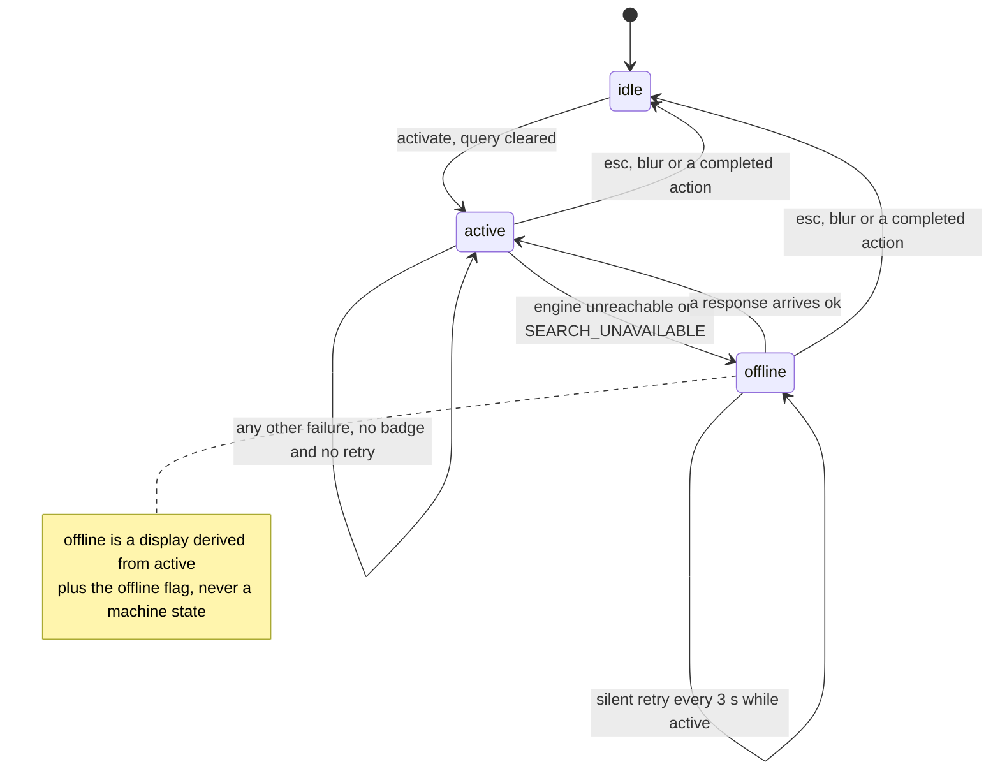
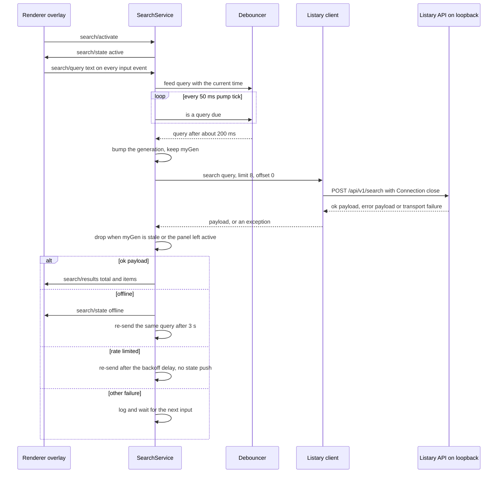

# Search panel: kernel state machine and engine link policy

The search panel is an HTML overlay inside the standalone panel window, not a window of its own. At rest it is a card with a `SEARCH` head and a `CLICK TO SEARCH_` hint that reads as part of the right column; a click swaps in a native `<input>`, and what the user types reaches the local Listary 7 HTTP API and comes back as a self-drawn result list. [Renderer panel](/openwiki/architecture/renderer-panel.md) documents that surface — the card, the rows, the selection highlight, the local transition model. This page covers what feeds it: the kernel-side state machine and the engine link policy in `app/src/main/services/search.ts`.

<!-- openwiki: broken internal link [/repo://docs/adr/0004-electron-cordis-standalone-panel.md#L18-L22] file "/repo://docs/adr/0004-electron-cordis-standalone-panel.md" does not exist. Fix the href or restore the target, then delete this comment. -->
<!-- openwiki: broken internal link [/repo://.scratch/standalone-app/issues/07-search-overlay.md#L46] file "/repo://.scratch/standalone-app/issues/07-search-overlay.md" does not exist. Fix the href or restore the target, then delete this comment. -->
<!-- openwiki: broken internal link [/repo://CONTEXT.md#L133-L135] file "/repo://CONTEXT.md" does not exist. Fix the href or restore the target, then delete this comment. -->
<!-- openwiki: broken internal link [/repo://CONTEXT.md#L125-L127] file "/repo://CONTEXT.md" does not exist. Fix the href or restore the target, then delete this comment. -->
**The separate native search window is gone.** A previous revision of this page documented a frameless Tk window owned by the Python data service, placed at fixed pixels over the wallpaper's right column and publishing its idle rectangle through the old `/deck` handshake. [ADR-0004](/repo://docs/adr/0004-electron-cordis-standalone-panel.md#L18-L22) retired that host model and with it the ADR-0003 conclusion that the search panel had to be a service-owned window; the search surface moved into the panel's own HTML layer, and the overlay is now the only search UI. `search_panel.py` and `tests/test_search_panel.py`, the `scripts/accept_search*.py|ps1` batteries, the `searchspacer` in the old wallpaper page and the `panel` field on `/deck` were all removed ([.scratch/standalone-app/issues/07-search-overlay.md](/repo://.scratch/standalone-app/issues/07-search-overlay.md#L46)), `CONTEXT.md` lists the old window as retired vocabulary ([CONTEXT.md](/repo://CONTEXT.md#L133-L135)), and the entire data-service process followed in ticket 11 ([CONTEXT.md](/repo://CONTEXT.md#L125-L127)). There is no second window, no Tk, no `/deck`, and no `QD_*` panel environment hook left to reason about.

## Where the boundary sits

The split is deliberate and lopsided: **the kernel owns all engine I/O and every policy decision; the renderer only feeds text and draws.**

| Piece | Role |
|---|---|
<!-- openwiki: broken internal link [/repo://app/src/main/search/engine.ts#L1-L21] file "/repo://app/src/main/search/engine.ts" does not exist. Fix the href or restore the target, then delete this comment. -->
| `app/src/main/search/engine.ts` | Pure policy with no network and no Electron: the `Debouncer`, `buildRequest`, `parseResponse`, `classifyFailure`, `backoffDelay`, and every timeout/retry/limit constant ([engine.ts](/repo://app/src/main/search/engine.ts#L1-L21)). |
<!-- openwiki: broken internal link [/repo://app/src/main/search/client.ts#L1-L24] file "/repo://app/src/main/search/client.ts" does not exist. Fix the href or restore the target, then delete this comment. -->
| `app/src/main/search/client.ts` | The only I/O: one `POST` to the loopback Listary endpoint, one connection per request ([client.ts](/repo://app/src/main/search/client.ts#L1-L24)). |
<!-- openwiki: broken internal link [/repo://app/src/main/services/search.ts#L49-L88] file "/repo://app/src/main/services/search.ts" does not exist. Fix the href or restore the target, then delete this comment. -->
| `app/src/main/services/search.ts` | The `SearchService` cordis service: the machine, the 50 ms pump, the single-flight generation, the failure reactions, and the execution of result actions ([search.ts](/repo://app/src/main/services/search.ts#L49-L88)). |
<!-- openwiki: broken internal link [/repo://app/src/renderer/main.ts#L466-L485] file "/repo://app/src/renderer/main.ts" does not exist. Fix the href or restore the target, then delete this comment. -->
| Renderer (`app/src/renderer/main.ts`) | Presentation and a *local* transition model; it invokes `search/query` on every `input` event and paints `search/results` / `search/state` ([main.ts](/repo://app/src/renderer/main.ts#L466-L485)). |

<!-- openwiki: broken internal link [/repo://app/src/shared/contract.ts#L231-L241] file "/repo://app/src/shared/contract.ts" does not exist. Fix the href or restore the target, then delete this comment. -->
<!-- openwiki: broken internal link [/repo://app/src/shared/contract.ts#L254-L261] file "/repo://app/src/shared/contract.ts" does not exist. Fix the href or restore the target, then delete this comment. -->
<!-- openwiki: broken internal link [/repo://app/src/main/services/bridge.ts#L68-L79] file "/repo://app/src/main/services/bridge.ts" does not exist. Fix the href or restore the target, then delete this comment. -->
<!-- openwiki: broken internal link [/repo://app/src/main/panel-ipc.ts#L30-L36] file "/repo://app/src/main/panel-ipc.ts" does not exist. Fix the href or restore the target, then delete this comment. -->
The kernel exposes exactly four request methods and two events for this feature — `search/activate`, `search/query`, `search/deactivate`, `search/action`, plus `search/state` and `search/results` ([contract.ts](/repo://app/src/shared/contract.ts#L231-L241), [contract.ts](/repo://app/src/shared/contract.ts#L254-L261)); the bridge dispatch is a four-line switch that only unwraps payloads ([bridge.ts](/repo://app/src/main/services/bridge.ts#L68-L79)), and `panel-ipc.ts` forwards the two events to the renderer ([panel-ipc.ts](/repo://app/src/main/panel-ipc.ts#L30-L36)). Nothing in the renderer's search path opens a socket, and nothing in the kernel draws. The mechanism and transport details of that channel are [bridge contract and IPC](/openwiki/architecture/bridge-contract-and-ipc.md).

Two consequences of the boundary are worth stating outright. First, the renderer can *ask* but cannot *cause*: a `search/query` outside the active state is rejected with `accepted: false`, so a stray keystroke from a torn-down overlay cannot reach the engine. Second, there is no second in-flight policy in the page: late responses are dropped by the kernel's generation check, and the page only ignores results it no longer has a surface for.

## The state machine

<!-- openwiki: broken internal link [/repo://app/src/main/services/search.ts#L61-L66] file "/repo://app/src/main/services/search.ts" does not exist. Fix the href or restore the target, then delete this comment. -->
<!-- openwiki: broken internal link [/repo://app/src/shared/contract.ts#L214-L215] file "/repo://app/src/shared/contract.ts" does not exist. Fix the href or restore the target, then delete this comment. -->
The machine has one real state variable, `'idle' | 'active'`, and a derived third UI state, `offline`, which is what the renderer paints when the engine is unreachable ([search.ts](/repo://app/src/main/services/search.ts#L61-L66), [contract.ts](/repo://app/src/shared/contract.ts#L214-L215)).

*One way in, one way out, and the offline badge is a projection of the active state rather than a state the machine can rest in.*

| Call | Effect |
|---|---|
<!-- openwiki: broken internal link [/repo://app/src/main/services/search.ts#L90-L98] file "/repo://app/src/main/services/search.ts" does not exist. Fix the href or restore the target, then delete this comment. -->
| `activate()` | `idle → active`, clears the query, pushes the new state; while already active it is a no-op that keeps the query and the rendered results ([search.ts](/repo://app/src/main/services/search.ts#L90-L98)). |
<!-- openwiki: broken internal link [/repo://app/src/main/services/search.ts#L100-L113] file "/repo://app/src/main/services/search.ts" does not exist. Fix the href or restore the target, then delete this comment. -->
| `deactivate()` | The single exit, used for `ESC`, lost focus, and a completed action; resets the generation, the debouncer, the rate-limit counter, the pending retry, the query, the last result set and the offline flag, then pushes the state ([search.ts](/repo://app/src/main/services/search.ts#L100-L113)). |
<!-- openwiki: broken internal link [/repo://app/src/main/services/search.ts#L115-L122] file "/repo://app/src/main/services/search.ts" does not exist. Fix the href or restore the target, then delete this comment. -->
| `setQuery(text)` | Accepted only while active; stores the text and feeds the debouncer ([search.ts](/repo://app/src/main/services/search.ts#L115-L122)). |

Three details make this table hold in practice:

<!-- openwiki: broken internal link [/repo://app/src/main/services/search.ts#L158-L163] file "/repo://app/src/main/services/search.ts" does not exist. Fix the href or restore the target, then delete this comment. -->
<!-- openwiki: broken internal link [/repo://app/tests/search/service.spec.ts#L27-L69] file "/repo://app/tests/search/service.spec.ts" does not exist. Fix the href or restore the target, then delete this comment. -->
- **The service is born idle and silent.** `pushed` starts at `'idle'` and `pushState()` emits only when the derived state differs from what was last pushed ([search.ts](/repo://app/src/main/services/search.ts#L158-L163)), so `search/state` is a change notification rather than a heartbeat — the page never has to filter duplicate transitions, and the kernel startup emits nothing. Tests assert both directions: activation pushes `active`, a duplicate activation pushes nothing, and deactivation from idle pushes nothing ([service.spec.ts](/repo://app/tests/search/service.spec.ts#L27-L69)).
<!-- openwiki: broken internal link [/repo://app/src/renderer/main.ts#L615-L635] file "/repo://app/src/renderer/main.ts" does not exist. Fix the href or restore the target, then delete this comment. -->
- **Deactivation is driven by the renderer, and it is one path.** The page collapses the overlay on `ESC`, on focus loss, and after an action completes, and each of those sends the same `search/deactivate` ([main.ts](/repo://app/src/renderer/main.ts#L615-L635)); there is no kernel-side timer or event that returns the panel to standby.
<!-- openwiki: broken internal link [/repo://app/src/main/services/search.ts#L115-L122] file "/repo://app/src/main/services/search.ts" does not exist. Fix the href or restore the target, then delete this comment. -->
<!-- openwiki: broken internal link [/repo://app/tests/search/service.spec.ts#L321-L343] file "/repo://app/tests/search/service.spec.ts" does not exist. Fix the href or restore the target, then delete this comment. -->
- **An empty query disarms the result actions.** `setQuery('')` clears `lastResults`, so with an empty box there is nothing for the path guard to match and `search/action` has to refuse ([search.ts](/repo://app/src/main/services/search.ts#L115-L122), [service.spec.ts](/repo://app/tests/search/service.spec.ts#L321-L343)).

## The query pipeline

<!-- openwiki: broken internal link [/repo://app/src/main/services/search.ts#L169-L179] file "/repo://app/src/main/services/search.ts" does not exist. Fix the href or restore the target, then delete this comment. -->
Nothing blocks. The kernel never starts a worker thread and never owns a results queue: `node:http` already answers asynchronously, so the service simply awaits the client and renders by emitting an event ([search.ts](/repo://app/src/main/services/search.ts#L169-L179)).

*Input events feed a debouncer that a 50 ms pump polls; the engine call leaves the event loop; the generation decides which response still counts.*

<!-- openwiki: broken internal link [/repo://app/src/renderer/main.ts#L643-L649] file "/repo://app/src/renderer/main.ts" does not exist. Fix the href or restore the target, then delete this comment. -->
<!-- openwiki: broken internal link [/repo://app/src/main/search/engine.ts#L10-L18] file "/repo://app/src/main/search/engine.ts" does not exist. Fix the href or restore the target, then delete this comment. -->
<!-- openwiki: broken internal link [/repo://app/src/main/search/engine.ts#L31-L54] file "/repo://app/src/main/search/engine.ts" does not exist. Fix the href or restore the target, then delete this comment. -->
<!-- openwiki: broken internal link [/repo://app/tests/search/engine.spec.ts#L20-L86] file "/repo://app/tests/search/engine.spec.ts" does not exist. Fix the href or restore the target, then delete this comment. -->
1. **The debounce lives in the kernel, not in the page.** Every renderer `input` event becomes a `search/query` call and lands in `Debouncer.feed`; the page deliberately does not debounce ([main.ts](/repo://app/src/renderer/main.ts#L643-L649)). The window is `DEFAULT_DEBOUNCE_MS = 200` ms ([engine.ts](/repo://app/src/main/search/engine.ts#L10-L18)). Continuous typing inside the window coalesces to the last change, a query equal to the one already released is suppressed, empty text clears the pending slot and never fires, and the deadline comparison adds a `1e-9` second tolerance so a float difference such as `0.30 − 0.10` cannot stall a query forever ([engine.ts](/repo://app/src/main/search/engine.ts#L31-L54), [engine.spec.ts](/repo://app/tests/search/engine.spec.ts#L20-L86)).
<!-- openwiki: broken internal link [/repo://app/src/main/kernel.ts#L55-L60] file "/repo://app/src/main/kernel.ts" does not exist. Fix the href or restore the target, then delete this comment. -->
<!-- openwiki: broken internal link [/repo://app/src/main/kernel.ts#L103-L108] file "/repo://app/src/main/kernel.ts" does not exist. Fix the href or restore the target, then delete this comment. -->
<!-- openwiki: broken internal link [/repo://app/src/main/panel-kernel.ts#L45-L50] file "/repo://app/src/main/panel-kernel.ts" does not exist. Fix the href or restore the target, then delete this comment. -->
<!-- openwiki: broken internal link [/repo://app/tests/search/service.spec.ts#L102-L147] file "/repo://app/tests/search/service.spec.ts" does not exist. Fix the href or restore the target, then delete this comment. -->
<!-- openwiki: broken internal link [/repo://app/tests/contract.spec.ts#L249-L281] file "/repo://app/tests/contract.spec.ts" does not exist. Fix the href or restore the target, then delete this comment. -->
2. **A 50 ms pump is the single decision point.** `createKernel` and `createPanelKernel` install `setInterval(() => ctx.search?.tick(), searchIntervalMs)` with `DEFAULT_SEARCH_INTERVAL_MS = 50`, mirroring the old Tk `after(50)` loop's cadence ([kernel.ts](/repo://app/src/main/kernel.ts#L55-L60), [kernel.ts](/repo://app/src/main/kernel.ts#L103-L108), [panel-kernel.ts](/repo://app/src/main/panel-kernel.ts#L45-L50)). Debounce expiry, rate-limit backoff and offline retry all resolve in that one tick instead of in `setTimeout` chains, which is why tests can drive the whole link with a synthetic clock by passing `searchIntervalMs: 0` and calling `tick()` themselves ([service.spec.ts](/repo://app/tests/search/service.spec.ts#L102-L147), [contract.spec.ts](/repo://app/tests/contract.spec.ts#L249-L281)). `tick()` returns immediately while idle, so a standby panel never polls the engine.
<!-- openwiki: broken internal link [/repo://app/src/main/search/engine.ts#L74-L76] file "/repo://app/src/main/search/engine.ts" does not exist. Fix the href or restore the target, then delete this comment. -->
<!-- openwiki: broken internal link [/repo://app/tests/search/engine.spec.ts#L88-L102] file "/repo://app/tests/search/engine.spec.ts" does not exist. Fix the href or restore the target, then delete this comment. -->
<!-- openwiki: broken internal link [/repo://app/src/main/services/search.ts#L170-L178] file "/repo://app/src/main/services/search.ts" does not exist. Fix the href or restore the target, then delete this comment. -->
3. **The request is always the first page.** `buildRequest` supports `offset` pass-through for the engine's contract ([engine.ts](/repo://app/src/main/search/engine.ts#L74-L76), [engine.spec.ts](/repo://app/tests/search/engine.spec.ts#L88-L102)), but the service always calls with `offset = 0` and `limit = DEFAULT_LIMIT = 8` ([search.ts](/repo://app/src/main/services/search.ts#L170-L178)). Paging is a contract capability, not a UI path.
<!-- openwiki: broken internal link [/repo://app/src/main/services/search.ts#L66-L67] file "/repo://app/src/main/services/search.ts" does not exist. Fix the href or restore the target, then delete this comment. -->
<!-- openwiki: broken internal link [/repo://app/src/main/services/search.ts#L85-L87] file "/repo://app/src/main/services/search.ts" does not exist. Fix the href or restore the target, then delete this comment. -->
<!-- openwiki: broken internal link [/repo://app/src/main/services/search.ts#L165-L178] file "/repo://app/src/main/services/search.ts" does not exist. Fix the href or restore the target, then delete this comment. -->
<!-- openwiki: broken internal link [/repo://app/tests/search/service.spec.ts#L266-L300] file "/repo://app/tests/search/service.spec.ts" does not exist. Fix the href or restore the target, then delete this comment. -->
4. **Single-flight by generation token.** `runSearch` increments `gen` and captures it before awaiting; `stale(myGen)` is true when a newer query has started, when the panel has returned to idle, or after the kernel is disposed ([search.ts](/repo://app/src/main/services/search.ts#L66-L67), [search.ts](/repo://app/src/main/services/search.ts#L85-L87), [search.ts](/repo://app/src/main/services/search.ts#L165-L178)). A slow reply for an abandoned query can therefore never overwrite newer rows or resurrect results after `ESC`; the test resolves the newer response first, then the older one, and asserts that only the newer result survives ([service.spec.ts](/repo://app/tests/search/service.spec.ts#L266-L300)).
<!-- openwiki: broken internal link [/repo://app/src/main/services/search.ts#L181-L190] file "/repo://app/src/main/services/search.ts" does not exist. Fix the href or restore the target, then delete this comment. -->
5. **What crosses back is data, never markup.** A successful response is parsed and re-emitted as `search/results` with `total` and `items`, and the state is re-derived first so that an engine that just recovered pushes `active` again ([search.ts](/repo://app/src/main/services/search.ts#L181-L190)). The decision to store the parsed result set is what arms the action guard described below.

## Failure taxonomy and the two silent recoveries

<!-- openwiki: broken internal link [/repo://app/src/main/search/engine.ts#L109-L124] file "/repo://app/src/main/search/engine.ts" does not exist. Fix the href or restore the target, then delete this comment. -->
`classifyFailure` is the single decision point that turns either a thrown value or a decoded payload into one of three kinds, or `null` for a usable answer ([engine.ts](/repo://app/src/main/search/engine.ts#L109-L124)).

| Input | Kind | Why |
|---|---|---|
| `{"ok": true, ...}`, with or without usable `data` | `null` | A usable answer, even when it carries zero rows. |
| A `ListaryNetworkError` from the client | `offline` | Connection refused, socket error or timeout — the engine is not reachable. |
| `{"ok": false, "error": "SEARCH_UNAVAILABLE"}` | `offline` | The documented "not ready yet" code. |
| `{"ok": false, "error": "TOO_MANY_REQUESTS"}` | `rate_limited` | Throttling has its own curve. |
| Any other error payload, or any other thrown value such as a JSON parse error | `error` | The engine answered but misbehaved. |

<!-- openwiki: broken internal link [/repo://app/tests/search/engine.spec.ts#L145-L170] file "/repo://app/tests/search/engine.spec.ts" does not exist. Fix the href or restore the target, then delete this comment. -->
<!-- openwiki: broken internal link [/repo://app/tests/search/client.spec.ts#L104-L120] file "/repo://app/tests/search/client.spec.ts" does not exist. Fix the href or restore the target, then delete this comment. -->
The `offline`/`error` split is the deliberate refinement this taxonomy exists to protect: **an engine that is reachable but weird must not masquerade as an engine that is absent, and it must not enter an automatic retry loop.** Only transport-level failure and the explicit `SEARCH_UNAVAILABLE` code count as offline; a non-JSON body or an unknown error code is an `error` ([engine.spec.ts](/repo://app/tests/search/engine.spec.ts#L145-L170), [client.spec.ts](/repo://app/tests/search/client.spec.ts#L104-L120)). The client never inspects the HTTP status code, so the verdict comes entirely from the decoded body: the same non-200 answer delivered as a JSON error code and as an HTML page lands in *different* kinds. And because the kind is decided before `parseResponse` runs, an error payload can never be rendered as an empty-but-successful result set.

<!-- openwiki: broken internal link [/repo://app/src/main/services/search.ts#L181-L215] file "/repo://app/src/main/services/search.ts" does not exist. Fix the href or restore the target, then delete this comment. -->
The service then reacts in three mutually exclusive ways ([search.ts](/repo://app/src/main/services/search.ts#L181-L215)):

| Kind | Display | Recovery |
|---|---|---|
| ok | Parsed results are emitted; the offline flag and any pending retry are cleared and the rate-limit counter is reset to zero. | — |
<!-- openwiki: broken internal link [/repo://app/src/renderer/main.ts#L678-L684] file "/repo://app/src/renderer/main.ts" does not exist. Fix the href or restore the target, then delete this comment. -->
| `offline` | The state becomes `offline`, so the page replaces the list with the inverted `ENGINE OFFLINE` badge ([main.ts](/repo://app/src/renderer/main.ts#L678-L684)). | Silent retry: `retryAt = now + OFFLINE_RETRY_MS` with `OFFLINE_RETRY_MS = 3000`; the pump re-sends the current query when the deadline passes. |
| `rate_limited` | Nothing on screen changes — the last good list stays, and no state event is pushed. | Silent exponential backoff: `backoffDelay(attempt) = min(500 · 2^(attempt−1), MAX_BACKOFF_MS)`, i.e. `500, 1000, 2000, 4000, 5000, 5000, …` ms with `MAX_BACKOFF_MS = 5000`. |
| `error` | Nothing on screen changes; no badge, no retry. | None — it waits for the next input. |

<!-- openwiki: broken internal link [/repo://app/src/main/services/search.ts#L124-L133] file "/repo://app/src/main/services/search.ts" does not exist. Fix the href or restore the target, then delete this comment. -->
<!-- openwiki: broken internal link [/repo://app/src/main/search/engine.ts#L56-L61] file "/repo://app/src/main/search/engine.ts" does not exist. Fix the href or restore the target, then delete this comment. -->
<!-- openwiki: broken internal link [/repo://app/tests/search/engine.spec.ts#L69-L85] file "/repo://app/tests/search/engine.spec.ts" does not exist. Fix the href or restore the target, then delete this comment. -->
- **Both retries re-send whatever is in the box now, not what failed.** When a retry deadline passes, `tick()` calls `feedDue(this.query)`, which marks the query due immediately (the pending timestamp is pushed far into the past) and clears the same-query record so a word that was already sent can be sent again ([search.ts](/repo://app/src/main/services/search.ts#L124-L133), [engine.ts](/repo://app/src/main/search/engine.ts#L56-L61), [engine.spec.ts](/repo://app/tests/search/engine.spec.ts#L69-L85)). Because `tick()` early-returns unless the machine is active, a deadline that expires after `ESC` does nothing at all.
<!-- openwiki: broken internal link [/repo://app/src/main/services/search.ts#L67-L70] file "/repo://app/src/main/services/search.ts" does not exist. Fix the href or restore the target, then delete this comment. -->
<!-- openwiki: broken internal link [/repo://app/tests/search/service.spec.ts#L208-L246] file "/repo://app/tests/search/service.spec.ts" does not exist. Fix the href or restore the target, then delete this comment. -->
- **The two retry paths share one slot.** `retryAt` is a single deadline used by both the offline retry and the backoff retry, and it is cleared when the deadline fires, on any success, and on deactivation — so a recovered engine or a fresh activation starts from the shortest delay ([search.ts](/repo://app/src/main/services/search.ts#L67-L70), [service.spec.ts](/repo://app/tests/search/service.spec.ts#L208-L246)).
<!-- openwiki: broken internal link [/repo://app/src/main/services/search.ts#L100-L113] file "/repo://app/src/main/services/search.ts" does not exist. Fix the href or restore the target, then delete this comment. -->
<!-- openwiki: broken internal link [/repo://app/tests/search/service.spec.ts#L71-L89] file "/repo://app/tests/search/service.spec.ts" does not exist. Fix the href or restore the target, then delete this comment. -->
- **Offline is not sticky and does not leak, two ways.** Any ok response flips the derived state back to `active` and the badge is replaced by the next `search/results`; and `deactivate()` clears `offlineShown`, so the badge cannot appear on a fresh activation that has not queried yet. That second rule was a real regression found in review — without it, an activation following an offline collapse showed `ENGINE OFFLINE` before any query had run — and it has its own test ([search.ts](/repo://app/src/main/services/search.ts#L100-L113), [service.spec.ts](/repo://app/tests/search/service.spec.ts#L71-L89)).
<!-- openwiki: broken internal link [/repo://app/tests/search/service.spec.ts#L174-L206] file "/repo://app/tests/search/service.spec.ts" does not exist. Fix the href or restore the target, then delete this comment. -->
<!-- openwiki: broken internal link [/repo://app/tests/search/service.spec.ts#L248-L264] file "/repo://app/tests/search/service.spec.ts" does not exist. Fix the href or restore the target, then delete this comment. -->
- **Retries only re-arm the pump, never re-render.** A retry produces no state event of its own, so a persistent outage pushes `offline` exactly once and a persistent throttle pushes nothing at all; the tests assert the pushed state sequence explicitly ([service.spec.ts](/repo://app/tests/search/service.spec.ts#L174-L206), [service.spec.ts](/repo://app/tests/search/service.spec.ts#L248-L264)).

## Result actions and the path guard

<!-- openwiki: broken internal link [/repo://app/src/main/services/search.ts#L135-L146] file "/repo://app/src/main/services/search.ts" does not exist. Fix the href or restore the target, then delete this comment. -->
<!-- openwiki: broken internal link [/repo://app/src/main/services/bridge.ts#L76-L79] file "/repo://app/src/main/services/bridge.ts" does not exist. Fix the href or restore the target, then delete this comment. -->
Enter and Ctrl+Enter ultimately reach the kernel as one call, `search/action(path, reveal)`, and the kernel — not the page — is the authority on whether that path may be acted upon ([search.ts](/repo://app/src/main/services/search.ts#L135-L146), [bridge.ts](/repo://app/src/main/services/bridge.ts#L76-L79)).

<!-- openwiki: broken internal link [/repo://app/tests/contract.spec.ts#L283-L305] file "/repo://app/tests/contract.spec.ts" does not exist. Fix the href or restore the target, then delete this comment. -->
- **The guard is membership in the most recent result set.** `action` refuses with `{ ok: false, error: '动作路径不在最近一次搜索结果内' }` unless `lastResults.items` contains the exact path string. This is the search path's peer of the desktop item pool guard: the renderer sends identifiers, and the kernel validates them against state it owns, so a compromised or buggy page cannot make the panel execute an arbitrary path ([contract.spec.ts](/repo://app/tests/contract.spec.ts#L283-L305)). Emptying the query clears that result set, so the guard closes with the list.
<!-- openwiki: broken internal link [/repo://app/src/main/services/search.ts#L79-L84] file "/repo://app/src/main/services/search.ts" does not exist. Fix the href or restore the target, then delete this comment. -->
<!-- openwiki: broken internal link [/repo://app/src/main/desktop/adapter.ts#L87-L91] file "/repo://app/src/main/desktop/adapter.ts" does not exist. Fix the href or restore the target, then delete this comment. -->
<!-- openwiki: broken internal link [/repo://app/tests/search/service.spec.ts#L321-L343] file "/repo://app/tests/search/service.spec.ts" does not exist. Fix the href or restore the target, then delete this comment. -->
- **`reveal: false` opens through an injected port.** Production wires `open` to `shellOpen`, i.e. `shell.openPath` (`''` means success), and a non-empty return string becomes the action's `error` ([search.ts](/repo://app/src/main/services/search.ts#L79-L84), [adapter.ts](/repo://app/src/main/desktop/adapter.ts#L87-L91)). The port shape is why the service can be tested with a fake open that reports a failure ([service.spec.ts](/repo://app/tests/search/service.spec.ts#L321-L343)).
<!-- openwiki: broken internal link [/repo://app/src/main/services/search.ts#L30-L39] file "/repo://app/src/main/services/search.ts" does not exist. Fix the href or restore the target, then delete this comment. -->
- **`reveal: true` spawns Explorer detached from the result flow.** `defaultReveal` runs `spawn('explorer', ['/select,', path], { stdio: 'ignore' })` and swallows a spawn failure silently. The code records why there is deliberately **no** `windowsHide`: `windowsHide` travels through `STARTUPINFO` as `SW_HIDE`, which hides the folder window as well — measured on the real machine as `reveal ok=true` while `CabinetWClass` never appeared ([search.ts](/repo://app/src/main/services/search.ts#L30-L39)).
<!-- openwiki: broken internal link [/repo://app/src/renderer/main.ts#L580-L593] file "/repo://app/src/renderer/main.ts" does not exist. Fix the href or restore the target, then delete this comment. -->
- **Actions never return the panel to standby by themselves.** The kernel executes and answers; the page collapses the overlay after the invoke settles, so the standby transition stays owned by the local transition model ([main.ts](/repo://app/src/renderer/main.ts#L580-L593)).

## Configuration, operations and the privacy line

<!-- openwiki: broken internal link [/repo://app/src/main/config.ts#L84-L87] file "/repo://app/src/main/config.ts" does not exist. Fix the href or restore the target, then delete this comment. -->
<!-- openwiki: broken internal link [/repo://app/src/main/config.ts#L151-L153] file "/repo://app/src/main/config.ts" does not exist. Fix the href or restore the target, then delete this comment. -->
<!-- openwiki: broken internal link [/repo://app/src/main/config.ts#L334-L347] file "/repo://app/src/main/config.ts" does not exist. Fix the href or restore the target, then delete this comment. -->
<!-- openwiki: broken internal link [/repo://app/config.json#L21-L23] file "/repo://app/config.json" does not exist. Fix the href or restore the target, then delete this comment. -->
<!-- openwiki: broken internal link [/repo://app/src/main/index.ts#L85-L90] file "/repo://app/src/main/index.ts" does not exist. Fix the href or restore the target, then delete this comment. -->
<!-- openwiki: broken internal link [/repo://app/accept/battery.js#L1416-L1437] file "/repo://app/accept/battery.js" does not exist. Fix the href or restore the target, then delete this comment. -->
- **`config.search.port` is the only knob.** `defaultSearchConfig()` returns `{ port: BASE_PORT }` with `BASE_PORT = 38431` taken from `engine.ts` as the single source, and `mergeSearch` accepts any integer in `1..65535`, warning and falling back to the default otherwise ([config.ts](/repo://app/src/main/config.ts#L84-L87), [config.ts](/repo://app/src/main/config.ts#L151-L153), [config.ts](/repo://app/src/main/config.ts#L334-L347), [config.json](/repo://app/config.json#L21-L23)). The port reaches the kernel at assembly time as `search: { port: config.search.port }` ([index.ts](/repo://app/src/main/index.ts#L85-L90)). Pointing it at a dead port is the accepted way to reproduce the engine-offline path on a machine where Listary *is* running — the acceptance battery rewrites `config.json`, restarts the panel and asserts the offline badge ([battery.js](/repo://app/accept/battery.js#L1416-L1437)).
<!-- openwiki: broken internal link [/repo://app/src/main/cordis.d.ts#L43-L44] file "/repo://app/src/main/cordis.d.ts" does not exist. Fix the href or restore the target, then delete this comment. -->
<!-- openwiki: broken internal link [/repo://app/src/main/kernel.ts#L80] file "/repo://app/src/main/kernel.ts" does not exist. Fix the href or restore the target, then delete this comment. -->
<!-- openwiki: broken internal link [/repo://app/src/main/panel-kernel.ts#L37] file "/repo://app/src/main/panel-kernel.ts" does not exist. Fix the href or restore the target, then delete this comment. -->
- **The engine link is the panel's own process.** `SearchService` is registered by both kernel assemblies and is declared mandatory on the cordis context, so a search-less panel is not a supported configuration ([cordis.d.ts](/repo://app/src/main/cordis.d.ts#L43-L44), [kernel.ts](/repo://app/src/main/kernel.ts#L80), [panel-kernel.ts](/repo://app/src/main/panel-kernel.ts#L37)). There is no child process and no HTTP server between the page and the engine: the failure of the engine degrades the badge, not the panel.
<!-- openwiki: broken internal link [/repo://app/tests/contract.spec.ts#L569-L609] file "/repo://app/tests/contract.spec.ts" does not exist. Fix the href or restore the target, then delete this comment. -->
<!-- openwiki: broken internal link [/repo://app/src/main/search/engine.ts#L15-L17] file "/repo://app/src/main/search/engine.ts" does not exist. Fix the href or restore the target, then delete this comment. -->
<!-- openwiki: broken internal link [/repo://app/src/main/search/client.ts#L26-L37] file "/repo://app/src/main/search/client.ts" does not exist. Fix the href or restore the target, then delete this comment. -->
- **Query text is memory-only.** The query lives in the service's `query` field, in the debouncer's pending slot, and in the request body of a loopback HTTP call; the three search files never touch the usage log and never write to disk, enforced by both a behavioural test (a full search flow leaves nothing containing the query in the usage directory) and a source-level guard that rejects `usage/log` references, `writeFileSync`/`appendFileSync` and hard-coded HTTP URLs in those files ([contract.spec.ts](/repo://app/tests/contract.spec.ts#L569-L609)). `BASE_HOST` is a constant in `engine.ts` — `127.0.0.1`, never read from input or configuration — and the client only ever uses it as the `host` of its request options ([engine.ts](/repo://app/src/main/search/engine.ts#L15-L17), [client.ts](/repo://app/src/main/search/client.ts#L26-L37)), so retargeting a query off the machine is not possible through configuration. The page adds its own half of the rule by reporting only query *lengths* in its evidence records; that side belongs to [privacy and data boundaries](/openwiki/concepts/privacy-and-data-boundaries.md) and [renderer panel](/openwiki/architecture/renderer-panel.md).
<!-- openwiki: broken internal link [/repo://app/src/main/panel-ipc.ts#L9-L24] file "/repo://app/src/main/panel-ipc.ts" does not exist. Fix the href or restore the target, then delete this comment. -->
- **`DECK_EVENT_LOG` is the operational window.** With it set, the main process appends JSONL events, so an acceptance run can assert `hotzones` (the search card's rectangle), `keyboard-mode-on` / `keyboard-mode-off` and the page's `search-*` records without any kernel-side search trace hook of its own ([panel-ipc.ts](/repo://app/src/main/panel-ipc.ts#L9-L24)).

## Verification

<!-- openwiki: broken internal link [/repo://app/tests/search/engine.spec.ts#L20-L176] file "/repo://app/tests/search/engine.spec.ts" does not exist. Fix the href or restore the target, then delete this comment. -->
- **Pure policy** — `app/tests/search/engine.spec.ts` pins the debounce window, coalescing, same-word suppression, empty-query suppression, `cancel`/`reset`, the `feedDue` bypass, request construction with `offset`, the loopback constants, response parsing (including `data: null` degrading to an empty result and non-object rows being skipped), the failure classification table, and the backoff curve `500, 1000, 2000, 4000, 5000` ([engine.spec.ts](/repo://app/tests/search/engine.spec.ts#L20-L176)).
<!-- openwiki: broken internal link [/repo://app/tests/search/client.spec.ts#L57-L126] file "/repo://app/tests/search/client.spec.ts" does not exist. Fix the href or restore the target, then delete this comment. -->
- **Transport against a fake API** — `app/tests/search/client.spec.ts` runs the real client against a `node:http` server on loopback and covers request bodies with `offset`, empty and error payloads, connection refused, a forced timeout, a non-JSON body, and the no-keep-alive behaviour of two back-to-back requests ([client.spec.ts](/repo://app/tests/search/client.spec.ts#L57-L126)).
<!-- openwiki: broken internal link [/repo://app/tests/search/harness.ts#L13-L62] file "/repo://app/tests/search/harness.ts" does not exist. Fix the href or restore the target, then delete this comment. -->
<!-- openwiki: broken internal link [/repo://app/tests/search/service.spec.ts#L1-L344] file "/repo://app/tests/search/service.spec.ts" does not exist. Fix the href or restore the target, then delete this comment. -->
- **The machine and the link** — `app/tests/search/service.spec.ts` drives a shared fake dependency bundle with a synthetic clock ([harness.ts](/repo://app/tests/search/harness.ts#L13-L62)) and covers the three-state transitions, standby rejection of `setQuery`, debounce expiry, same-word dedup and its reset on deactivation, the offline retry at exactly 3 s, the rate-limit curve, the no-retry `error` branch, single-flight invalidation, and the action guard ([service.spec.ts](/repo://app/tests/search/service.spec.ts#L1-L344)).
<!-- openwiki: broken internal link [/repo://app/tests/contract.spec.ts#L248-L326] file "/repo://app/tests/contract.spec.ts" does not exist. Fix the href or restore the target, then delete this comment. -->
- **The bridge cut** — `app/tests/contract.spec.ts` exercises the same flow through `ctx.bridge.invoke` / `subscribe`, including `accepted: false` outside the active state, the ordering of `search/state` before results, the offline push, and the refusal of a path outside the result set ([contract.spec.ts](/repo://app/tests/contract.spec.ts#L248-L326)).
<!-- openwiki: broken internal link [/repo://app/accept/battery.js#L1177-L1445] file "/repo://app/accept/battery.js" does not exist. Fix the href or restore the target, then delete this comment. -->
<!-- openwiki: broken internal link [/repo://app/accept/evidence/03-battery.log.txt#L55-L66] file "/repo://app/accept/evidence/03-battery.log.txt" does not exist. Fix the href or restore the target, then delete this comment. -->
<!-- openwiki: broken internal link [/repo://.scratch/standalone-app/issues/07-search-overlay.md#L38-L44] file "/repo://.scratch/standalone-app/issues/07-search-overlay.md" does not exist. Fix the href or restore the target, then delete this comment. -->
- **Real machine** — the acceptance battery's search section (P7S) pre-checks the real engine with a probe file, then asserts hotzone click activation, keyboard mode, the debounce-engine-render pipeline, Enter open, Ctrl+Enter reveal (a `CabinetWClass` window appears), `↑`/`↓` selection, `ESC`, focus loss, and the offline badge through a fake port, with screenshots `07-search-idle|results|reveal|offline.png` ([battery.js](/repo://app/accept/battery.js#L1177-L1445), [03-battery.log.txt](/repo://app/accept/evidence/03-battery.log.txt#L55-L66)). Two pitfalls recorded while that section was being made green are now structural facts: `windowsHide` hides the Explorer window, and an activation probe must start from standby, because clicking the card's centre while results are open lands on a result row ([.scratch/standalone-app/issues/07-search-overlay.md](/repo://.scratch/standalone-app/issues/07-search-overlay.md#L38-L44)).

## Change-safe rules

- **Keep engine I/O in `client.ts` alone.** A new endpoint, a page, or a retry belongs behind the injected `search` dependency, never in the service's body and never in the page.
- **Keep failure semantics in `classifyFailure`.** New codes get classified there and the service keeps exactly four branches (ok, `rate_limited`, `offline`, `error`). Do not widen `offline`, and do not add automatic retry to `error` — "reachable but weird" must stay distinguishable.
- **Retry policy is three constants plus one function**: `OFFLINE_RETRY_MS`, `MAX_BACKOFF_MS` and `backoffDelay` in `engine.ts`, driven through `feedDue` so a retry can re-send an already-sent word. Any new retry must go through the pump, so it inherits the active-state gate and the single-flight guard.
- **Never bypass the generation check.** Any new asynchronous step in the search path must capture `gen` before awaiting and pass `stale()` before emitting.
- **Keep the action guard kernel-side.** `search/action` must keep comparing against the most recent result set; the renderer's index is a convenience, not an authorization.
- **Do not add persistence or logging of query text.** No disk writes, no usage-log entries, no evidence record containing the query itself.
<!-- openwiki: broken internal link [/repo://docs/adr/0004-electron-cordis-standalone-panel.md#L8-L24] file "/repo://docs/adr/0004-electron-cordis-standalone-panel.md" does not exist. Fix the href or restore the target, then delete this comment. -->
<!-- openwiki: broken internal link [/repo://docs/adr/0005-no-input-hooks-dataplane-utility-process.md#L5-L7] file "/repo://docs/adr/0005-no-input-hooks-dataplane-utility-process.md" does not exist. Fix the href or restore the target, then delete this comment. -->
- **Retire nothing back.** The search surface must stay an overlay inside the panel: a second native window, a keyboard hook, or a data-service style HTTP endpoint would reintroduce exactly what [ADR-0004](/repo://docs/adr/0004-electron-cordis-standalone-panel.md#L8-L24) and [ADR-0005](/repo://docs/adr/0005-no-input-hooks-dataplane-utility-process.md#L5-L7) removed (see [process lifecycle and windowing](/openwiki/architecture/process-lifecycle-and-windowing.md)).

## Related pages

- [Bridge contract and IPC](/openwiki/architecture/bridge-contract-and-ipc.md) — the four search methods, the two events, and the envelope they travel in.
- [Listary engine](/openwiki/integrations/listary-engine.md) — the upstream HTTP contract this policy is built on.
- [Search query lifecycle](/openwiki/workflows/search-query-lifecycle.md) — the same pipeline told as one click-to-open trace, including the offline and throttled detours.
- [Renderer panel](/openwiki/architecture/renderer-panel.md) — the overlay's markup, local transition model and result rendering.
- [Privacy and data boundaries](/openwiki/concepts/privacy-and-data-boundaries.md) — why query text is memory-only and loopback-only.
