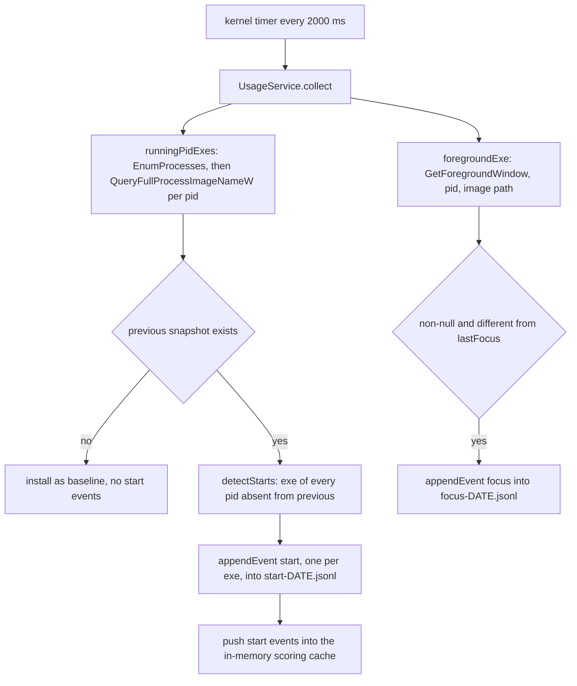
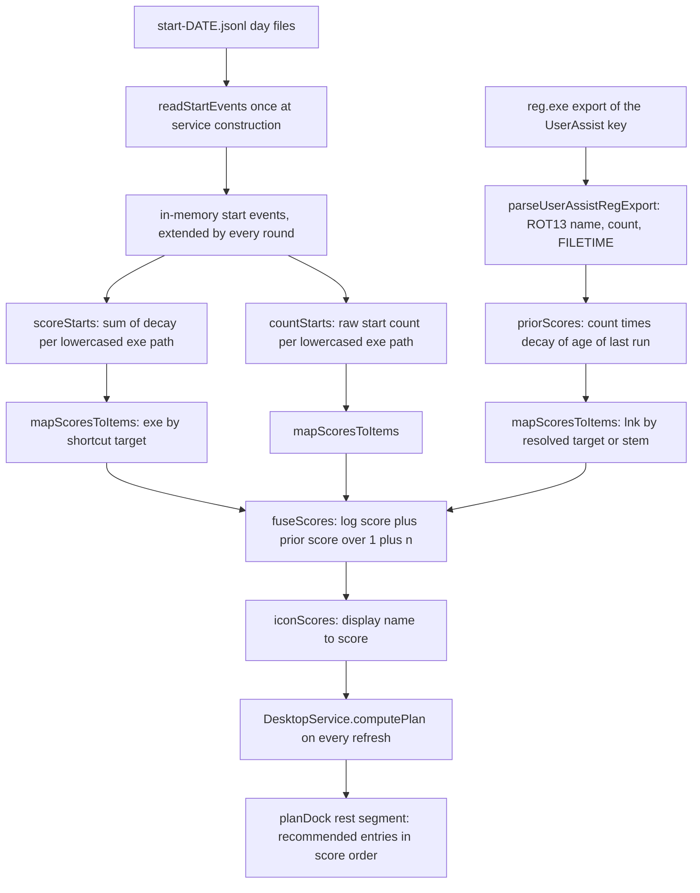

# Usage telemetry, scoring and cold-start prior fusion

The recommended segment of the dock is filled by one score per desktop shortcut display name. Producing that score is a two-stage pipeline owned by two groups of modules:

| Module | Owns | Never does |
|---|---|---|
<!-- openwiki: broken internal link [/repo://app/src/main/usage/log.ts#L1-L11] file "/repo://app/src/main/usage/log.ts" does not exist. Fix the href or restore the target, then delete this comment. -->
| [`usage/log.ts`](/repo://app/src/main/usage/log.ts#L1-L11) | The event vocabulary (`detectStarts`, `detectFocus`), day-file naming, `appendEvent`, `readStartEvents`, `pruneOldDays` | Touch Win32, resolve a shortcut, rank anything |
<!-- openwiki: broken internal link [/repo://app/src/main/usage/native.ts#L1-L4] file "/repo://app/src/main/usage/native.ts" does not exist. Fix the href or restore the target, then delete this comment. -->
| [`usage/native.ts`](/repo://app/src/main/usage/native.ts#L1-L4) | The real Win32 sources: the pid → executable-path snapshot and the foreground window's executable path | Obtain any window title text |
<!-- openwiki: broken internal link [/repo://app/src/main/usage/score.ts#L1-L7] file "/repo://app/src/main/usage/score.ts" does not exist. Fix the href or restore the target, then delete this comment. -->
| [`usage/score.ts`](/repo://app/src/main/usage/score.ts#L1-L7) | Decay and the aggregations, the UserAssist value layout, path → desktop-item mapping, fusion | Read the clock, read a file, touch the registry |
<!-- openwiki: broken internal link [/repo://app/src/main/usage/userassist.ts#L1-L4] file "/repo://app/src/main/usage/userassist.ts" does not exist. Fix the href or restore the target, then delete this comment. -->
| [`usage/userassist.ts`](/repo://app/src/main/usage/userassist.ts#L1-L4) | The prior read path: `reg.exe export` plus a pure text parser | Throw on failure (an empty prior is returned instead) |
<!-- openwiki: broken internal link [/repo://app/src/main/usage/migrate.ts#L1-L11] file "/repo://app/src/main/usage/migrate.ts" does not exist. Fix the href or restore the target, then delete this comment. -->
| [`usage/migrate.ts`](/repo://app/src/main/usage/migrate.ts#L1-L11) | The one-shot copy of the Python-era log directory into `userData` | Parse and rewrite records (the copy is byte-preserving) |
<!-- openwiki: broken internal link [/repo://app/src/main/services/usage.ts#L23-L29] file "/repo://app/src/main/services/usage.ts" does not exist. Fix the href or restore the target, then delete this comment. -->
| [`services/usage.ts`](/repo://app/src/main/services/usage.ts#L23-L29) | The `UsageService` state machine: round bookkeeping, the in-memory event cache, the async prior, `collect`, `prune`, `iconScores` | Own a timer of its own |

<!-- openwiki: broken internal link [/repo://docs/adr/0002-no-window-titles-in-usage-log.md#L3] file "/repo://docs/adr/0002-no-window-titles-in-usage-log.md" does not exist. Fix the href or restore the target, then delete this comment. -->
<!-- openwiki: broken internal link [/repo://app/src/main/usage/score.ts#L1-L13] file "/repo://app/src/main/usage/score.ts" does not exist. Fix the href or restore the target, then delete this comment. -->
The pipeline exists because neither available source is sufficient on its own. The machine's `C:\Windows\Prefetch` is an empty directory (prefetching is disabled) and `UserAssist` holds only about four records, so the application accumulates its own history; a brand-new log has no history at all, so the system's existing launch records are borrowed as a **cold-start prior** that retires as first-party data accumulates ([ADR-0002](/repo://docs/adr/0002-no-window-titles-in-usage-log.md#L3), [score.ts](/repo://app/src/main/usage/score.ts#L1-L13)).

## Where collection runs, and what drives it

<!-- openwiki: broken internal link [/repo://app/src/main/kernel.ts#L62-L110] file "/repo://app/src/main/kernel.ts" does not exist. Fix the href or restore the target, then delete this comment. -->
<!-- openwiki: broken internal link [/repo://app/src/main/kernel.ts#L129-L165] file "/repo://app/src/main/kernel.ts" does not exist. Fix the href or restore the target, then delete this comment. -->
<!-- openwiki: broken internal link [/repo://app/src/main/cordis.d.ts#L41-L43] file "/repo://app/src/main/cordis.d.ts" does not exist. Fix the href or restore the target, then delete this comment. -->
`UsageService` is a cordis service registered under the name `usage`, mounted by both kernel assemblies: [`createKernel`](/repo://app/src/main/kernel.ts#L62-L110) (the offline contract seam, "no production caller") and [`createDataplaneKernel`](/repo://app/src/main/kernel.ts#L129-L165), which is what production runs. `createKernel` additionally lets `DesktopService` reach it through the `ctx.usage` seam, which `cordis.d.ts` types as optional ([cordis.d.ts](/repo://app/src/main/cordis.d.ts#L41-L43)).

<!-- openwiki: broken internal link [/repo://app/src/main/index.ts#L67-L83] file "/repo://app/src/main/index.ts" does not exist. Fix the href or restore the target, then delete this comment. -->
<!-- openwiki: broken internal link [/repo://app/src/main/services/dataplane.ts#L67-L76] file "/repo://app/src/main/services/dataplane.ts" does not exist. Fix the href or restore the target, then delete this comment. -->
<!-- openwiki: broken internal link [/repo://app/src/main/dataplane.ts#L34-L55] file "/repo://app/src/main/dataplane.ts" does not exist. Fix the href or restore the target, then delete this comment. -->
In production the service lives in the data-plane `utilityProcess` child, not in the panel main process. Electron APIs are unavailable in the child, so the parent resolves the paths: `bootPanel()` computes `usageDir = path.join(app.getPath('userData'), 'usage')` and hands it to the host's `init` bundle ([index.ts](/repo://app/src/main/index.ts#L67-L83), [services/dataplane.ts](/repo://app/src/main/services/dataplane.ts#L67-L76)), and the child constructs the service with `usage: { dir: msg.init.usageDir }` ([dataplane.ts](/repo://app/src/main/dataplane.ts#L34-L55)). A child restart therefore re-reads the log from disk rather than losing it.

Collection is driven by kernel timers, and both of the usage timers sit in one branch:

| Constant | Value | Drives |
|---|---|---|
<!-- openwiki: broken internal link [/repo://app/src/main/kernel.ts#L57-L57] file "/repo://app/src/main/kernel.ts" does not exist. Fix the href or restore the target, then delete this comment. -->
<!-- openwiki: broken internal link [/repo://app/src/main/kernel.ts#L95-L98] file "/repo://app/src/main/kernel.ts" does not exist. Fix the href or restore the target, then delete this comment. -->
| `DEFAULT_USAGE_MS` | `2000` | `ctx.usage?.collect()` — one collection round ([kernel.ts](/repo://app/src/main/kernel.ts#L57-L57), [kernel.ts](/repo://app/src/main/kernel.ts#L95-L98)) |
<!-- openwiki: broken internal link [/repo://app/src/main/kernel.ts#L59-L59] file "/repo://app/src/main/kernel.ts" does not exist. Fix the href or restore the target, then delete this comment. -->
<!-- openwiki: broken internal link [/repo://app/src/main/kernel.ts#L99-L102] file "/repo://app/src/main/kernel.ts" does not exist. Fix the href or restore the target, then delete this comment. -->
| `USAGE_PRUNE_MS` | `3600_000` | `ctx.usage?.prune()` — the rolling cleanup a resident panel cannot converge on restarts alone ([kernel.ts](/repo://app/src/main/kernel.ts#L59-L59), [kernel.ts](/repo://app/src/main/kernel.ts#L99-L102)) |

<!-- openwiki: broken internal link [/repo://app/src/main/kernel.ts#L95-L102] file "/repo://app/src/main/kernel.ts" does not exist. Fix the href or restore the target, then delete this comment. -->
<!-- openwiki: broken internal link [/repo://app/tests/usage/log.spec.ts#L131-L164] file "/repo://app/tests/usage/log.spec.ts" does not exist. Fix the href or restore the target, then delete this comment. -->
`usageIntervalMs: 0` — the offline test setting — suppresses *both* timers, because the prune timer is created inside the same `if (usageMs > 0)` branch, and tests then drive `collect(nowMs)` manually ([kernel.ts](/repo://app/src/main/kernel.ts#L95-L102), [tests/usage/log.spec.ts](/repo://app/tests/usage/log.spec.ts#L131-L164)).

<!-- openwiki: broken internal link [/repo://app/src/main/services/usage.ts#L38-L58] file "/repo://app/src/main/services/usage.ts" does not exist. Fix the href or restore the target, then delete this comment. -->
<!-- openwiki: broken internal link [/repo://app/src/main/services/usage.ts#L48-L57] file "/repo://app/src/main/services/usage.ts" does not exist. Fix the href or restore the target, then delete this comment. -->
The constructor does three things before the first round ever runs ([services/usage.ts](/repo://app/src/main/services/usage.ts#L38-L58)): it loads the existing start events into memory with `readStartEvents(this.dir, Date.now())`, prunes once, and kicks off the prior read **without awaiting it** — the cold-start prior is a one-off `reg.exe` export whose arrival a few hundred milliseconds late only changes the initial recommendation order, not the panel's first paint ([services/usage.ts](/repo://app/src/main/services/usage.ts#L48-L57)).

## The collection round

<!-- openwiki: broken internal link [/repo://app/src/main/services/usage.ts#L65-L83] file "/repo://app/src/main/services/usage.ts" does not exist. Fix the href or restore the target, then delete this comment. -->
`collect(nowMs = Date.now())` is one round and returns the events it produced ([services/usage.ts](/repo://app/src/main/services/usage.ts#L65-L83)):



*One round: the pid snapshot produces start events, the foreground probe produces at most one focus event, and only starts reach the scoring cache.*

<!-- openwiki: broken internal link [/repo://app/src/main/services/usage.ts#L70-L78] file "/repo://app/src/main/services/usage.ts" does not exist. Fix the href or restore the target, then delete this comment. -->
<!-- openwiki: broken internal link [/repo://app/tests/usage/log.spec.ts#L148-L155] file "/repo://app/tests/usage/log.spec.ts" does not exist. Fix the href or restore the target, then delete this comment. -->
<!-- openwiki: broken internal link [/repo://app/src/main/services/usage.ts#L79-L82] file "/repo://app/src/main/services/usage.ts" does not exist. Fix the href or restore the target, then delete this comment. -->
Two asymmetries in that flow are deliberate. The **baseline rule applies to starts only**: while `this.previous === null` no start events are emitted, so the many processes already running when the service starts are treated as a baseline instead of a burst of fake starts — but a first-round focus event is still recorded, which is exactly what the service test asserts ([services/usage.ts](/repo://app/src/main/services/usage.ts#L70-L78), [tests/usage/log.spec.ts](/repo://app/tests/usage/log.spec.ts#L148-L155)). And **only start events enter the scoring cache** (`this.events.push(...starts)`); the focus events are written to disk and dropped ([services/usage.ts](/repo://app/src/main/services/usage.ts#L79-L82)).

Because a round is the unit of detection, every event discovered in one round is stamped with that round's `nowMs`, so the effective time resolution of a start is the 2 s poll interval rather than the OS process creation time.

### Starts are diffed by pid, not by executable path

<!-- openwiki: broken internal link [/repo://app/src/main/usage/log.ts#L18-L25] file "/repo://app/src/main/usage/log.ts" does not exist. Fix the href or restore the target, then delete this comment. -->
<!-- openwiki: broken internal link [/repo://app/tests/usage/log.spec.ts#L26-L42] file "/repo://app/tests/usage/log.spec.ts" does not exist. Fix the href or restore the target, then delete this comment. -->
`detectStarts(previous, current)` collects the executable path of every pid that is absent from the previous snapshot, de-duplicates the paths in a `Set` and returns them sorted ([log.ts](/repo://app/src/main/usage/log.ts#L18-L25)). Diffing sets of *paths* instead would miss two cases the notion of "real start" requires: a second concurrent instance of an application that is already running, and an application that exits and is relaunched under a new pid. The test file pins all four outcomes — a new pid counts, a restart under a new pid counts, a second instance of an already-running path counts, and a process disappearing does not ([tests/usage/log.spec.ts](/repo://app/tests/usage/log.spec.ts#L26-L42)).

<!-- openwiki: broken internal link [/repo://app/src/main/usage/native.ts#L40-L68] file "/repo://app/src/main/usage/native.ts" does not exist. Fix the href or restore the target, then delete this comment. -->
A pid whose image path cannot be read never enters the map at all, so it can neither produce a start nor count as a vanished process ([native.ts](/repo://app/src/main/usage/native.ts#L40-L68)).

### Foreground switches, and why no title text ever exists

<!-- openwiki: broken internal link [/repo://app/src/main/usage/log.ts#L27-L31] file "/repo://app/src/main/usage/log.ts" does not exist. Fix the href or restore the target, then delete this comment. -->
<!-- openwiki: broken internal link [/repo://app/tests/usage/log.spec.ts#L44-L54] file "/repo://app/tests/usage/log.spec.ts" does not exist. Fix the href or restore the target, then delete this comment. -->
`detectFocus(last, current)` returns `current` only when it is non-`null` and different from `last`; an unknown foreground (no window, or an unreadable process) is not an event and does not clear `lastFocus` ([log.ts](/repo://app/src/main/usage/log.ts#L27-L31), [tests/usage/log.spec.ts](/repo://app/tests/usage/log.spec.ts#L44-L54)).

<!-- openwiki: broken internal link [/repo://app/src/main/usage/native.ts#L71-L79] file "/repo://app/src/main/usage/native.ts" does not exist. Fix the href or restore the target, then delete this comment. -->
<!-- openwiki: broken internal link [/repo://app/src/main/usage/native.ts#L40-L53] file "/repo://app/src/main/usage/native.ts" does not exist. Fix the href or restore the target, then delete this comment. -->
<!-- openwiki: broken internal link [/repo://app/src/main/usage/native.ts#L1-L4] file "/repo://app/src/main/usage/native.ts" does not exist. Fix the href or restore the target, then delete this comment. -->
<!-- openwiki: broken internal link [/repo://app/src/main/usage/log.ts#L1-L4] file "/repo://app/src/main/usage/log.ts" does not exist. Fix the href or restore the target, then delete this comment. -->
The foreground probe resolves the foreground window to a process and then to an image path, and nothing else: `GetForegroundWindow` → `GetWindowThreadProcessId` → `OpenProcess(PROCESS_QUERY_LIMITED_INFORMATION)` → `QueryFullProcessImageNameW`, with the handle always closed ([native.ts](/repo://app/src/main/usage/native.ts#L71-L79), [native.ts](/repo://app/src/main/usage/native.ts#L40-L53)). **No call in the collection path asks for window title text**, so title text never exists in the process to be filtered later; the module headers state the rule and cite ADR-0002 ([native.ts](/repo://app/src/main/usage/native.ts#L1-L4), [log.ts](/repo://app/src/main/usage/log.ts#L1-L4)).

That structural claim is held up by two standing source guards rather than by review:

<!-- openwiki: broken internal link [/repo://app/tests/usage/log.spec.ts#L116-L129] file "/repo://app/tests/usage/log.spec.ts" does not exist. Fix the href or restore the target, then delete this comment. -->
- A privacy guard walks **every `.ts` file under `src/main`** (recursively) and fails if any of them contains `GetWindowText` or `window_title` ([tests/usage/log.spec.ts](/repo://app/tests/usage/log.spec.ts#L116-L129)).
<!-- openwiki: broken internal link [/repo://app/tests/contract.spec.ts#L611-L618] file "/repo://app/tests/contract.spec.ts" does not exist. Fix the href or restore the target, then delete this comment. -->
- A second guard covers the adjacent risk that arrived with session-row jump: the focus modules must not read a title through `SendMessageW` either, nor carry a `title` field on their window candidates ([tests/contract.spec.ts](/repo://app/tests/contract.spec.ts#L611-L618)). The boundary is thus enforced by name over the whole main-process source tree, not just over the usage modules.

<!-- openwiki: broken internal link [/repo://docs/adr/0002-no-window-titles-in-usage-log.md#L5-L8] file "/repo://docs/adr/0002-no-window-titles-in-usage-log.md" does not exist. Fix the href or restore the target, then delete this comment. -->
The same refusals that the ADR recorded still apply: storing titles locally-only and sanitizing titles were both rejected because the daily work is legal case research and titles routinely carry case numbers, party names and project names, while contributing nothing to "which application is used most" ([ADR-0002](/repo://docs/adr/0002-no-window-titles-in-usage-log.md#L5-L8), see also [privacy and data boundaries](/openwiki/concepts/privacy-and-data-boundaries.md)).

### Native binding shape

<!-- openwiki: broken internal link [/repo://app/src/main/usage/native.ts#L21-L38] file "/repo://app/src/main/usage/native.ts" does not exist. Fix the href or restore the target, then delete this comment. -->
<!-- openwiki: broken internal link [/repo://app/src/main/usage/native.ts#L9-L10] file "/repo://app/src/main/usage/native.ts" does not exist. Fix the href or restore the target, then delete this comment. -->
<!-- openwiki: broken internal link [/repo://app/src/main/usage/native.ts#L55-L69] file "/repo://app/src/main/usage/native.ts" does not exist. Fix the href or restore the target, then delete this comment. -->
`native.ts` binds lazily: the koffi handles for `psapi.dll`, `kernel32.dll` and `user32.dll` are created on the first call, never at import time, so offline tests that inject fake sources never touch FFI ([native.ts](/repo://app/src/main/usage/native.ts#L21-L38)). Out-parameters are plain `Buffer`s: a 4096-pid `EnumProcesses` buffer, a 4-byte `used` counter, and a 1024-byte UTF-16 name buffer whose returned length is read back as `size * 2` bytes. The snapshot capacity is a fixed `MAX_PIDS = 4096` pid slots, and no attempt is made to grow the buffer if that is exceeded ([native.ts](/repo://app/src/main/usage/native.ts#L9-L10), [native.ts](/repo://app/src/main/usage/native.ts#L55-L69)).

## The log on disk: day files, record shape, retention

<!-- openwiki: broken internal link [/repo://app/src/main/usage/log.ts#L33-L41] file "/repo://app/src/main/usage/log.ts" does not exist. Fix the href or restore the target, then delete this comment. -->
Each event kind writes to its own day file, `{kind}-YYYYMMDD.jsonl`, under the log directory, so a record can stay exactly two fields while "real start count" remains separable from foreground traffic ([log.ts](/repo://app/src/main/usage/log.ts#L33-L41)):

```json
{"ts": "2026-09-23T12:00:00Z", "exe": "C:\\Program Files\\app\\app.exe"}
```

<!-- openwiki: broken internal link [/repo://app/src/main/usage/log.ts#L43-L52] file "/repo://app/src/main/usage/log.ts" does not exist. Fix the href or restore the target, then delete this comment. -->
<!-- openwiki: broken internal link [/repo://app/src/main/usage/log.ts#L33-L41] file "/repo://app/src/main/usage/log.ts" does not exist. Fix the href or restore the target, then delete this comment. -->
<!-- openwiki: broken internal link [/repo://app/src/main/usage/log.ts#L86-L98] file "/repo://app/src/main/usage/log.ts" does not exist. Fix the href or restore the target, then delete this comment. -->
`appendEvent(dir, kind, exe, tsMs)` creates the directory if needed, opens the day file in append mode, and writes one JSON line with a **second-precision** ISO timestamp — `toISOString()` with the milliseconds stripped, which is what keeps the TypeScript writer byte-compatible with the retired Python `isoformat(timespec="seconds")` writer ([log.ts](/repo://app/src/main/usage/log.ts#L43-L52)). The day tag is the UTC date of the event timestamp, and day-file naming and pruning agree on that convention because both derive it from the same date arithmetic ([log.ts](/repo://app/src/main/usage/log.ts#L33-L41), [log.ts](/repo://app/src/main/usage/log.ts#L86-L98)).

<!-- openwiki: broken internal link [/repo://app/src/main/usage/log.ts#L54-L83] file "/repo://app/src/main/usage/log.ts" does not exist. Fix the href or restore the target, then delete this comment. -->
`readStartEvents(dir, nowMs)` is the only reader, and it is deliberately narrow: it accepts only files matching `^start-\d{8}\.jsonl$` (so `focus-*.jsonl` and any bookkeeping file are invisible to it), sorts the file names so events arrive in day order, skips unreadable files, skips lines that fail JSON parsing or lack a string `exe` and a parseable `ts`, and ignores events timestamped in the future ([log.ts](/repo://app/src/main/usage/log.ts#L54-L83)). A truncated file or a clock adjustment therefore degrades the ranking instead of derailing an arrangement.

<!-- openwiki: broken internal link [/repo://app/src/main/usage/log.ts#L85-L106] file "/repo://app/src/main/usage/log.ts" does not exist. Fix the href or restore the target, then delete this comment. -->
<!-- openwiki: broken internal link [/repo://app/tests/usage/log.spec.ts#L104-L113] file "/repo://app/tests/usage/log.spec.ts" does not exist. Fix the href or restore the target, then delete this comment. -->
<!-- openwiki: broken internal link [/repo://app/src/main/usage/log.ts#L8-L8] file "/repo://app/src/main/usage/log.ts" does not exist. Fix the href or restore the target, then delete this comment. -->
<!-- openwiki: broken internal link [/repo://app/src/main/usage/score.ts#L9-L9] file "/repo://app/src/main/usage/score.ts" does not exist. Fix the href or restore the target, then delete this comment. -->
`pruneOldDays(dir, nowMs, days = RETENTION_DAYS)` deletes day files of **both** kinds whose day tag parsed as UTC midnight falls before `nowMs - days * 86400_000`; names that do not match the day-file pattern are ignored, a failed `unlink` is swallowed per file, and a missing directory is a no-op ([log.ts](/repo://app/src/main/usage/log.ts#L85-L106)). The current day's file is exempt by construction rather than by a special case: its day start is always inside the window. The unit test contrasts a 91-day-old pair of start/focus files (deleted) with an 89-day-old file (kept) ([tests/usage/log.spec.ts](/repo://app/tests/usage/log.spec.ts#L104-L113)). `RETENTION_DAYS = 90` is far longer than the 14-day scoring half-life — about 6.4 half-lives — so pruning only removes events whose decayed weight has already fallen below roughly 1 % of its original value ([log.ts](/repo://app/src/main/usage/log.ts#L8-L8), [score.ts](/repo://app/src/main/usage/score.ts#L9-L9)).

## Failure semantics

Every persistence step is best-effort by construction:

<!-- openwiki: broken internal link [/repo://app/src/main/usage/log.ts#L43-L52] file "/repo://app/src/main/usage/log.ts" does not exist. Fix the href or restore the target, then delete this comment. -->
<!-- openwiki: broken internal link [/repo://app/tests/usage/log.spec.ts#L80-L84] file "/repo://app/tests/usage/log.spec.ts" does not exist. Fix the href or restore the target, then delete this comment. -->
- `appendEvent` catches everything and returns, so a directory position occupied by a regular file, a full disk or a permission problem produces no exception ([log.ts](/repo://app/src/main/usage/log.ts#L43-L52), [tests/usage/log.spec.ts](/repo://app/tests/usage/log.spec.ts#L80-L84)).
<!-- openwiki: broken internal link [/repo://app/src/main/usage/log.ts#L55-L62] file "/repo://app/src/main/usage/log.ts" does not exist. Fix the href or restore the target, then delete this comment. -->
<!-- openwiki: broken internal link [/repo://app/src/main/usage/log.ts#L86-L106] file "/repo://app/src/main/usage/log.ts" does not exist. Fix the href or restore the target, then delete this comment. -->
<!-- openwiki: broken internal link [/repo://app/tests/usage/log.spec.ts#L100-L102] file "/repo://app/tests/usage/log.spec.ts" does not exist. Fix the href or restore the target, then delete this comment. -->
- `pruneOldDays` swallows the directory read and each failed `unlink`; `readStartEvents` returns an empty list when the directory cannot be read ([log.ts](/repo://app/src/main/usage/log.ts#L55-L62), [log.ts](/repo://app/src/main/usage/log.ts#L86-L106), [tests/usage/log.spec.ts](/repo://app/tests/usage/log.spec.ts#L100-L102)).
<!-- openwiki: broken internal link [/repo://app/src/main/usage/userassist.ts#L70-L89] file "/repo://app/src/main/usage/userassist.ts" does not exist. Fix the href or restore the target, then delete this comment. -->
<!-- openwiki: broken internal link [/repo://app/src/main/services/usage.ts#L50-L57] file "/repo://app/src/main/services/usage.ts" does not exist. Fix the href or restore the target, then delete this comment. -->
- `readUserAssistPrior` maps every export and parse failure to an empty map — a failed or slow `reg.exe` export only means "no prior", never a blocked panel ([userassist.ts](/repo://app/src/main/usage/userassist.ts#L70-L89)). The temporary-directory creation sits outside that protection, and a rejection from there is caught by the service, which logs `deck-usage: 冷启动先验读取失败（按无先验继续）` and continues without a prior ([services/usage.ts](/repo://app/src/main/services/usage.ts#L50-L57)).
<!-- openwiki: broken internal link [/repo://app/src/main/usage/migrate.ts#L101-L137] file "/repo://app/src/main/usage/migrate.ts" does not exist. Fix the href or restore the target, then delete this comment. -->
<!-- openwiki: broken internal link [/repo://app/src/main/index.ts#L67-L83] file "/repo://app/src/main/index.ts" does not exist. Fix the href or restore the target, then delete this comment. -->
- The migration never throws out of its own loop: per-file failures land in `failed`, are logged, and are retried on the next boot ([migrate.ts](/repo://app/src/main/usage/migrate.ts#L101-L137)); the caller in `bootPanel()` also wraps the whole call, and a failure degrades to "the history starts accumulating from zero" ([index.ts](/repo://app/src/main/index.ts#L67-L83)).

Two properties of the *round* are worth keeping in mind, because they are the places where this subsystem is not defensive:

<!-- openwiki: broken internal link [/repo://app/src/main/services/usage.ts#L65-L83] file "/repo://app/src/main/services/usage.ts" does not exist. Fix the href or restore the target, then delete this comment. -->
<!-- openwiki: broken internal link [/repo://app/src/main/kernel.ts#L95-L98] file "/repo://app/src/main/kernel.ts" does not exist. Fix the href or restore the target, then delete this comment. -->
<!-- openwiki: broken internal link [/repo://app/src/main/services/dataplane.ts#L78-L88] file "/repo://app/src/main/services/dataplane.ts" does not exist. Fix the href or restore the target, then delete this comment. -->
- **There is no per-round catch.** `collect()` has no `try`/`catch`, and the kernel's timer callback does not add one ([services/usage.ts](/repo://app/src/main/services/usage.ts#L65-L83), [kernel.ts](/repo://app/src/main/kernel.ts#L95-L98)). The retired Python loop's blanket `except Exception` with throttled diagnostics was not carried over, so a throwing source propagates out of the timer callback; in production that callback runs in the data-plane child, whose exit-and-restart path (backoff up to 30 s) is the recovery mechanism rather than a logged, retried round ([services/dataplane.ts](/repo://app/src/main/services/dataplane.ts#L78-L88)).
<!-- openwiki: broken internal link [/repo://app/src/main/usage/native.ts#L55-L69] file "/repo://app/src/main/usage/native.ts" does not exist. Fix the href or restore the target, then delete this comment. -->
<!-- openwiki: broken internal link [/repo://app/src/main/services/usage.ts#L69-L73] file "/repo://app/src/main/services/usage.ts" does not exist. Fix the href or restore the target, then delete this comment. -->
- **An empty snapshot is indistinguishable from "no processes".** `nativeRunningPidExes` returns an empty map when `EnumProcesses` fails, and the round installs whatever came back as the new baseline ([native.ts](/repo://app/src/main/usage/native.ts#L55-L69), [services/usage.ts](/repo://app/src/main/services/usage.ts#L69-L73)). The following round then sees every running pid as newly appeared and emits one start event per distinct executable path. Nothing in the pipeline can tell this apart from a real burst of starts; the only bound on it is the fixed 4096-pid snapshot capacity.

## The one-shot migration of the Python-era log

The log this subsystem writes today has a predecessor: the Python data service kept the same log at `%LOCALAPPDATA%\qoder-deck\usage`. Rather than declaring "start accumulating again", the panel copies that directory into `userData/usage` on boot, so the fresh scoring pipeline immediately counts the historical starts instead of spending 90 days growing a ranking back.

<!-- openwiki: broken internal link [/repo://app/src/main/index.ts#L67-L83] file "/repo://app/src/main/index.ts" does not exist. Fix the href or restore the target, then delete this comment. -->
<!-- openwiki: broken internal link [/repo://app/src/main/usage/migrate.ts#L18-L23] file "/repo://app/src/main/usage/migrate.ts" does not exist. Fix the href or restore the target, then delete this comment. -->
<!-- openwiki: broken internal link [/repo://README.md#L85-L90] file "/repo://README.md" does not exist. Fix the href or restore the target, then delete this comment. -->
The call site fixes the ordering: in `bootPanel()`, after config load and autostart handling and **before** the kernel (and therefore before collection) starts, `migrateUsageLog` runs with `legacyDir: legacyUsageDir()`, `targetDir: usageDir` and `markerFile: path.join(usageDir, '.legacy-migrated.json')` ([index.ts](/repo://app/src/main/index.ts#L67-L83), [migrate.ts](/repo://app/src/main/usage/migrate.ts#L18-L23)). Running it after collection had started would merge the day's two record sets out of order. It is **a copy, not a move**: the legacy directory is left untouched for the user to delete once the new panel's numbers look right ([README.md](/repo://README.md#L85-L90)). The marker file sits inside the log directory and matches neither the day-file pattern of `readStartEvents` nor that of `pruneOldDays`, so it is invisible to both.

<!-- openwiki: broken internal link [/repo://app/src/main/usage/migrate.ts#L18-L23] file "/repo://app/src/main/usage/migrate.ts" does not exist. Fix the href or restore the target, then delete this comment. -->
<!-- openwiki: broken internal link [/repo://app/src/main/index.ts#L80-L83] file "/repo://app/src/main/index.ts" does not exist. Fix the href or restore the target, then delete this comment. -->
`legacyUsageDir()` throws when `LOCALAPPDATA` is unset; because the call site wraps the call, that degrades into a logged `usage-migrate-failed` event and a panel that starts with no migrated history ([migrate.ts](/repo://app/src/main/usage/migrate.ts#L18-L23), [index.ts](/repo://app/src/main/index.ts#L80-L83)).

### What is copied, and what is skipped

<!-- openwiki: broken internal link [/repo://app/src/main/usage/migrate.ts#L31-L49] file "/repo://app/src/main/usage/migrate.ts" does not exist. Fix the href or restore the target, then delete this comment. -->
`planUsageMigration({legacyFiles, nowMs})` splits the legacy directory listing into `files` and `skipped` ([migrate.ts](/repo://app/src/main/usage/migrate.ts#L31-L49)):

| Input | Decision |
|---|---|
| `start-YYYYMMDD.jsonl` / `focus-YYYYMMDD.jsonl` dated inside the retention window | copied |
| A day file older than `RETENTION_DAYS` (90 days) | skipped — it would be deleted again by the very next rolling cleanup |
| Anything else (`layout.json`, `notes.txt`, …) | skipped — not part of this log |

<!-- openwiki: broken internal link [/repo://app/src/main/usage/migrate.ts#L16-L29] file "/repo://app/src/main/usage/migrate.ts" does not exist. Fix the href or restore the target, then delete this comment. -->
<!-- openwiki: broken internal link [/repo://app/src/main/usage/log.ts#L8-L8] file "/repo://app/src/main/usage/log.ts" does not exist. Fix the href or restore the target, then delete this comment. -->
<!-- openwiki: broken internal link [/repo://app/tests/usage/migrate.spec.ts#L35-L53] file "/repo://app/tests/usage/migrate.spec.ts" does not exist. Fix the href or restore the target, then delete this comment. -->
Both the plan and the live pruning use the same UTC day-start arithmetic and the same 90-day constant, imported from `log.ts`, so migration and retention cannot drift apart ([migrate.ts](/repo://app/src/main/usage/migrate.ts#L16-L29), [log.ts](/repo://app/src/main/usage/log.ts#L8-L8)). The tests pin "day files only", "out-of-retention days are not copied" and "today's file is never judged stale" ([tests/usage/migrate.spec.ts](/repo://app/tests/usage/migrate.spec.ts#L35-L53)).

<!-- openwiki: broken internal link [/repo://app/src/main/usage/migrate.ts#L1-L11] file "/repo://app/src/main/usage/migrate.ts" does not exist. Fix the href or restore the target, then delete this comment. -->
<!-- openwiki: broken internal link [/repo://app/tests/usage/migrate.spec.ts#L66-L71] file "/repo://app/tests/usage/migrate.spec.ts" does not exist. Fix the href or restore the target, then delete this comment. -->
The copy is **byte-preserving**: the file body is read and written unchanged, with no parse and re-serialize step, because the two sides agree field by field and a rewrite would only create an opportunity for old and new formats to drift ([migrate.ts](/repo://app/src/main/usage/migrate.ts#L1-L11), [tests/usage/migrate.spec.ts](/repo://app/tests/usage/migrate.spec.ts#L66-L71)).

### Idempotency: per-file bookkeeping plus line de-duplication

Migration runs on the boot path and can be interrupted at any point, so idempotency is the hard requirement:

<!-- openwiki: broken internal link [/repo://app/src/main/usage/migrate.ts#L59-L99] file "/repo://app/src/main/usage/migrate.ts" does not exist. Fix the href or restore the target, then delete this comment. -->
<!-- openwiki: broken internal link [/repo://app/tests/usage/migrate.spec.ts#L82-L91] file "/repo://app/tests/usage/migrate.spec.ts" does not exist. Fix the href or restore the target, then delete this comment. -->
1. **The marker records file names, not a single "done" flag.** `<usageDir>/.legacy-migrated.json` holds `{migratedAt, files: string[]}`, and the pending set is the planned files minus the recorded names, so a re-run only picks up what was never copied ([migrate.ts](/repo://app/src/main/usage/migrate.ts#L59-L99), [tests/usage/migrate.spec.ts](/repo://app/tests/usage/migrate.spec.ts#L82-L91)).
<!-- openwiki: broken internal link [/repo://app/src/main/usage/migrate.ts#L64-L72] file "/repo://app/src/main/usage/migrate.ts" does not exist. Fix the href or restore the target, then delete this comment. -->
<!-- openwiki: broken internal link [/repo://app/tests/usage/migrate.spec.ts#L121-L128] file "/repo://app/tests/usage/migrate.spec.ts" does not exist. Fix the href or restore the target, then delete this comment. -->
2. **A missing or corrupt marker means "nothing was migrated".** `readMarker` returns an empty record on any read or JSON error, which is safe *only* because of the next rule — the stated bias is "re-copy rather than lose history" ([migrate.ts](/repo://app/src/main/usage/migrate.ts#L64-L72), [tests/usage/migrate.spec.ts](/repo://app/tests/usage/migrate.spec.ts#L121-L128)).
<!-- openwiki: broken internal link [/repo://app/src/main/usage/migrate.ts#L107-L118] file "/repo://app/src/main/usage/migrate.ts" does not exist. Fix the href or restore the target, then delete this comment. -->
<!-- openwiki: broken internal link [/repo://app/tests/usage/migrate.spec.ts#L73-L103] file "/repo://app/tests/usage/migrate.spec.ts" does not exist. Fix the href or restore the target, then delete this comment. -->
3. **An existing target day file is merged, not overwritten.** The target's current lines are read into a `Set`, the source's lines that already appear there are dropped, and only the remainder is appended. This closes the crash window between "append succeeded" and "marker landed": a re-run re-plans the file, finds every line already present and adds nothing, so no record is doubled ([migrate.ts](/repo://app/src/main/usage/migrate.ts#L107-L118), [tests/usage/migrate.spec.ts](/repo://app/tests/usage/migrate.spec.ts#L73-L103)).
<!-- openwiki: broken internal link [/repo://app/src/main/usage/migrate.ts#L113-L117] file "/repo://app/src/main/usage/migrate.ts" does not exist. Fix the href or restore the target, then delete this comment. -->
<!-- openwiki: broken internal link [/repo://app/tests/usage/migrate.spec.ts#L105-L110] file "/repo://app/tests/usage/migrate.spec.ts" does not exist. Fix the href or restore the target, then delete this comment. -->
4. **De-duplication compares against the target's pre-existing lines only.** Legitimate duplicate lines *inside* a source file — the same application started twice in the same second — are copied as-is, so the copy can never silently drop a real start ([migrate.ts](/repo://app/src/main/usage/migrate.ts#L113-L117), [tests/usage/migrate.spec.ts](/repo://app/tests/usage/migrate.spec.ts#L105-L110)).
<!-- openwiki: broken internal link [/repo://app/src/main/usage/migrate.ts#L120-L136] file "/repo://app/src/main/usage/migrate.ts" does not exist. Fix the href or restore the target, then delete this comment. -->
<!-- openwiki: broken internal link [/repo://app/tests/usage/migrate.spec.ts#L130-L140] file "/repo://app/tests/usage/migrate.spec.ts" does not exist. Fix the href or restore the target, then delete this comment. -->
5. **A failure is not recorded.** If any file in the pending set throws, no marker is written at all (not even for the files that succeeded), so the whole pending set is retried next boot; the successful copies are already on disk and land on the merge path, where rule 3 keeps them from doubling ([migrate.ts](/repo://app/src/main/usage/migrate.ts#L120-L136), [tests/usage/migrate.spec.ts](/repo://app/tests/usage/migrate.spec.ts#L130-L140)).

<!-- openwiki: broken internal link [/repo://app/src/main/usage/migrate.ts#L84-L91] file "/repo://app/src/main/usage/migrate.ts" does not exist. Fix the href or restore the target, then delete this comment. -->
<!-- openwiki: broken internal link [/repo://app/src/main/usage/migrate.ts#L139-L145] file "/repo://app/src/main/usage/migrate.ts" does not exist. Fix the href or restore the target, then delete this comment. -->
<!-- openwiki: broken internal link [/repo://app/tests/usage/migrate.spec.ts#L112-L119] file "/repo://app/tests/usage/migrate.spec.ts" does not exist. Fix the href or restore the target, then delete this comment. -->
Two operational consequences follow. First, **doubling is the failure that matters** — a duplicated record is a duplicated start count and therefore a wrong dock order, not just a longer file. Second, the marker write is itself best-effort and swallowed, and when the legacy directory is missing the code books an empty marker on purpose so later boots stop stat-ing a directory that does not exist ([migrate.ts](/repo://app/src/main/usage/migrate.ts#L84-L91), [migrate.ts](/repo://app/src/main/usage/migrate.ts#L139-L145), [tests/usage/migrate.spec.ts](/repo://app/tests/usage/migrate.spec.ts#L112-L119)). Because rule 3 is line equality, changing `appendEvent`'s serialization also changes what counts as a duplicate — migration and the writer have to move together.

## Scoring: decay, path scores and prior scores

<!-- openwiki: broken internal link [/repo://app/src/main/usage/score.ts#L9-L23] file "/repo://app/src/main/usage/score.ts" does not exist. Fix the href or restore the target, then delete this comment. -->
<!-- openwiki: broken internal link [/repo://docs/adr/0002-no-window-titles-in-usage-log.md#L14] file "/repo://docs/adr/0002-no-window-titles-in-usage-log.md" does not exist. Fix the href or restore the target, then delete this comment. -->
`usage/score.ts` fixes one constant — `HALF_LIFE_DAYS = 14.0` — with `decay(ageDays) = 0.5 ** (ageDays / HALF_LIFE_DAYS)` ([score.ts](/repo://app/src/main/usage/score.ts#L9-L23)). Frequency is therefore *real start count under exponential time decay* ([ADR-0002](/repo://docs/adr/0002-no-window-titles-in-usage-log.md#L14)).

<!-- openwiki: broken internal link [/repo://app/src/main/usage/score.ts#L25-L52] file "/repo://app/src/main/usage/score.ts" does not exist. Fix the href or restore the target, then delete this comment. -->
The three aggregations are pure and take the current time as a parameter, which is what makes the decay mathematics directly assertable ([score.ts](/repo://app/src/main/usage/score.ts#L25-L52)):

- `scoreStarts(events, nowMs)` → `Map<lowercased exe, Σ decay(age)>`, each start contributing independently.
- `countStarts(events)` → `Map<lowercased exe, raw count>`, used only to decide how much the prior is discounted.
- `priorScores(prior, nowMs)` → `Map<path key, count × decay(age(lastMs))>` — everything UserAssist knows about an entry, folded into one number.

<!-- openwiki: broken internal link [/repo://app/tests/usage/score.spec.ts#L26-L48] file "/repo://app/tests/usage/score.spec.ts" does not exist. Fix the href or restore the target, then delete this comment. -->
<!-- openwiki: broken internal link [/repo://app/tests/usage/score.spec.ts#L77-L82] file "/repo://app/tests/usage/score.spec.ts" does not exist. Fix the href or restore the target, then delete this comment. -->
The tests assert a start exactly 14 days old scores 0.5, one 28 days old scores 0.25, a zero-age start scores 1, independent starts sum, keying is case-folded, and the same event list scored from a later `nowMs` decays further ([tests/usage/score.spec.ts](/repo://app/tests/usage/score.spec.ts#L26-L48), [tests/usage/score.spec.ts](/repo://app/tests/usage/score.spec.ts#L77-L82)). A missing prior or an empty log is an empty map, never an error.

<!-- openwiki: broken internal link [/repo://app/src/main/services/usage.ts#L46-L46] file "/repo://app/src/main/services/usage.ts" does not exist. Fix the href or restore the target, then delete this comment. -->
<!-- openwiki: broken internal link [/repo://app/src/main/services/usage.ts#L79-L93] file "/repo://app/src/main/services/usage.ts" does not exist. Fix the href or restore the target, then delete this comment. -->
The events those functions consume come from the service's **in-memory cache**, not from a fresh directory read: `readStartEvents` runs once in the constructor and each round appends the start events it detected, so scoring never re-reads the day files while the process lives and disk is touched once per boot per service life ([services/usage.ts](/repo://app/src/main/services/usage.ts#L46-L46), [services/usage.ts](/repo://app/src/main/services/usage.ts#L79-L93)). In production that also means a data-plane child restart re-reads the log and converges, while a long-lived child will not notice records written by anyone else.

## The UserAssist cold-start prior

<!-- openwiki: broken internal link [/repo://app/src/main/usage/userassist.ts#L11-L11] file "/repo://app/src/main/usage/userassist.ts" does not exist. Fix the href or restore the target, then delete this comment. -->
<!-- openwiki: broken internal link [/repo://app/src/main/usage/userassist.ts#L67-L89] file "/repo://app/src/main/usage/userassist.ts" does not exist. Fix the href or restore the target, then delete this comment. -->
<!-- openwiki: broken internal link [/repo://app/src/main/usage/userassist.ts#L1-L4] file "/repo://app/src/main/usage/userassist.ts" does not exist. Fix the href or restore the target, then delete this comment. -->
<!-- openwiki: broken internal link [/repo://app/src/main/usage/userassist.ts#L70-L76] file "/repo://app/src/main/usage/userassist.ts" does not exist. Fix the href or restore the target, then delete this comment. -->
<!-- openwiki: broken internal link [/repo://app/src/main/services/usage.ts#L48-L57] file "/repo://app/src/main/services/usage.ts" does not exist. Fix the href or restore the target, then delete this comment. -->
The system's own launch records live under `HKCU\Software\Microsoft\Windows\CurrentVersion\Explorer\UserAssist` ([userassist.ts](/repo://app/src/main/usage/userassist.ts#L11-L11)). The read path is deliberately indirect: `reg.exe export <key> <temp file> /y` runs through `execFile` with a 15 s timeout into a fresh temporary directory, the exported `.reg` text is read back as UTF-16LE and handed to a pure parser, and the temporary file and directory are removed afterwards ([userassist.ts](/repo://app/src/main/usage/userassist.ts#L67-L89)). Two design reasons are recorded in the module header: parsing `reg`'s own escaping layer is steadier than `advapi32` enumeration pointer work for ROT13 names containing quotes and backslashes, and the single export is **asynchronous** so it never blocks the boot path — the function returns a `Promise`, and the service does not await it ([userassist.ts](/repo://app/src/main/usage/userassist.ts#L1-L4), [userassist.ts](/repo://app/src/main/usage/userassist.ts#L70-L76), [services/usage.ts](/repo://app/src/main/services/usage.ts#L48-L57)).

<!-- openwiki: broken internal link [/repo://app/src/main/usage/score.ts#L54-L60] file "/repo://app/src/main/usage/score.ts" does not exist. Fix the href or restore the target, then delete this comment. -->
Each value in the registry is a ROT13-encoded path name plus a binary blob whose layout was confirmed on the real machine and is pinned by named constants ([score.ts](/repo://app/src/main/usage/score.ts#L54-L60)):

| Field | Position | Meaning |
|---|---|---|
| dword 0 | offset 0 | A constant `145` session/version field — **not** the run count |
| run count | offset 4 (`UA_COUNT_OFFSET`) | Little-endian `u32` |
| last execution | offset 60 (`UA_FILETIME_OFFSET`) | Little-endian FILETIME, 100 ns ticks since 1601-01-01 |
| minimum blob | `UA_MIN_LEN = 68` | Anything shorter is discarded |

<!-- openwiki: broken internal link [/repo://app/src/main/usage/score.ts#L62-L83] file "/repo://app/src/main/usage/score.ts" does not exist. Fix the href or restore the target, then delete this comment. -->
<!-- openwiki: broken internal link [/repo://app/src/main/usage/score.ts#L54-L58] file "/repo://app/src/main/usage/score.ts" does not exist. Fix the href or restore the target, then delete this comment. -->
<!-- openwiki: broken internal link [/repo://app/tests/usage/score.spec.ts#L50-L75] file "/repo://app/tests/usage/score.spec.ts" does not exist. Fix the href or restore the target, then delete this comment. -->
`parseUserAssistEntry(rotatedName, data)` rejects a blob shorter than 68 bytes, reads the count and the FILETIME at those offsets, rejects a **zero FILETIME** (with no last-execution time there is nothing to decay, so the record cannot serve as a prior at all), converts the FILETIME through the epoch offset, rejects a non-finite or negative result, and returns `{path: rot13(name), count, lastMs}` ([score.ts](/repo://app/src/main/usage/score.ts#L62-L83)). The source comment is explicit that the count must not be "corrected" to bytes 0:4, and the test fixture builds a 72-byte blob with `145` written at byte 0 precisely so that a future "fix" to the offset fails a test rather than silently ranking garbage ([score.ts](/repo://app/src/main/usage/score.ts#L54-L58), [tests/usage/score.spec.ts](/repo://app/tests/usage/score.spec.ts#L50-L75)).

<!-- openwiki: broken internal link [/repo://app/src/main/usage/userassist.ts#L13-L65] file "/repo://app/src/main/usage/userassist.ts" does not exist. Fix the href or restore the target, then delete this comment. -->
<!-- openwiki: broken internal link [/repo://app/tests/usage/score.spec.ts#L166-L225] file "/repo://app/tests/usage/score.spec.ts" does not exist. Fix the href or restore the target, then delete this comment. -->
`parseUserAssistRegExport(text)` is the pure half of the read path, and it is **GUID-agnostic**: it never hardcodes or enumerates a GUID subkey name, because those differ between Windows versions and the export already contains whatever the machine has. It tracks sections and reads only values that follow a section header ending in `\Count]`, re-joins values that `reg` folded across lines with a trailing backslash, unescapes the value name (`\\` → `\`, `\"` → `"`), decodes the `hex:` byte list, and keeps only paths ending in `.exe` or `.lnk`, retaining per lowercased path the entry with the largest count ([userassist.ts](/repo://app/src/main/usage/userassist.ts#L13-L65)). The tests cover the section filter, the largest-count rule, the `.exe`/`.lnk` filter, folded hex lines and escaped names ([tests/usage/score.spec.ts](/repo://app/tests/usage/score.spec.ts#L166-L225)).

<!-- openwiki: broken internal link [/repo://app/src/main/usage/userassist.ts#L70-L89] file "/repo://app/src/main/usage/userassist.ts" does not exist. Fix the href or restore the target, then delete this comment. -->
<!-- openwiki: broken internal link [/repo://app/src/main/services/usage.ts#L50-L57] file "/repo://app/src/main/services/usage.ts" does not exist. Fix the href or restore the target, then delete this comment. -->
Failures inside the export and parse path — a missing `reg.exe`, a non-zero exit, no export file, a decode error, a value the parser does not recognize — all collapse into an **empty prior**, and the service logs a rejection (`deck-usage: 冷启动先验读取失败（按无先验继续）`) while continuing with an empty map ([userassist.ts](/repo://app/src/main/usage/userassist.ts#L70-L89), [services/usage.ts](/repo://app/src/main/services/usage.ts#L50-L57)). The prior is read once per service lifetime; nothing refreshes it in place.

<!-- openwiki: broken internal link [/repo://app/src/main/usage/userassist.ts#L11-L11] file "/repo://app/src/main/usage/userassist.ts" does not exist. Fix the href or restore the target, then delete this comment. -->
<!-- openwiki: broken internal link [/repo://docs/adr/0002-no-window-titles-in-usage-log.md#L3] file "/repo://docs/adr/0002-no-window-titles-in-usage-log.md" does not exist. Fix the href or restore the target, then delete this comment. -->
<!-- openwiki: broken internal link [/repo://app/tests/usage/score.spec.ts#L1-L30] file "/repo://app/tests/usage/score.spec.ts" does not exist. Fix the href or restore the target, then delete this comment. -->
**Prefetch is not a source.** The only machine record consulted is the UserAssist key, and the reason the self-built log exists at all is that `C:\Windows\Prefetch` is empty on this machine ([userassist.ts](/repo://app/src/main/usage/userassist.ts#L11-L11), [ADR-0002](/repo://docs/adr/0002-no-window-titles-in-usage-log.md#L3)). Note that the Python era backed this with a source-scanning test (`NoPrefetchTest`) that failed if `usage_score.py` mentioned Prefetch; **that guard was not carried into the TypeScript module**, and neither `score.ts` nor its spec mentions Prefetch at all, so the boundary now holds by convention rather than by a failing test ([tests/usage/score.spec.ts](/repo://app/tests/usage/score.spec.ts#L1-L30)).

## Mapping paths to desktop icons, then fusing there

<!-- openwiki: broken internal link [/repo://app/src/main/usage/score.ts#L85-L133] file "/repo://app/src/main/usage/score.ts" does not exist. Fix the href or restore the target, then delete this comment. -->
Fusion happens at the **desktop-item** level, not the executable-path level, and one mapping function is shared by all three inputs (log scores, log counts, prior scores). `mapScoresToItems(scores, items, resolve, exists)` builds two indices from the item list ([score.ts](/repo://app/src/main/usage/score.ts#L85-L133)):

| Index | Built from | Used for |
|---|---|---|
| `byTarget` | `item.target.toLowerCase()` for `kind === 'shortcut'` items only | resolving an `.exe` path to a display name |
| `byStem` | `item.display.toLowerCase()` | the fallback when a `.lnk` path cannot be resolved |

<!-- openwiki: broken internal link [/repo://app/src/main/usage/score.ts#L109-L114] file "/repo://app/src/main/usage/score.ts" does not exist. Fix the href or restore the target, then delete this comment. -->
<!-- openwiki: broken internal link [/repo://app/tests/usage/score.spec.ts#L103-L109] file "/repo://app/tests/usage/score.spec.ts" does not exist. Fix the href or restore the target, then delete this comment. -->
Only `kind === 'shortcut'` items are candidates, so non-shortcut desktop items — files, folders, `.url` entries — can never receive a frequency score even if a path happens to match their name ([score.ts](/repo://app/src/main/usage/score.ts#L109-L114), [tests/usage/score.spec.ts](/repo://app/tests/usage/score.spec.ts#L103-L109)). The three path shapes then behave differently:

<!-- openwiki: broken internal link [/repo://app/src/main/usage/score.ts#L119-L120] file "/repo://app/src/main/usage/score.ts" does not exist. Fix the href or restore the target, then delete this comment. -->
<!-- openwiki: broken internal link [/repo://app/tests/usage/score.spec.ts#L91-L95] file "/repo://app/tests/usage/score.spec.ts" does not exist. Fix the href or restore the target, then delete this comment. -->
- **`.exe`** — matched through a shortcut's target, case-insensitively; this is how a start recorded against `C:\P\Kimi.exe` lands on the `Kimi.lnk` item ([score.ts](/repo://app/src/main/usage/score.ts#L119-L120), [tests/usage/score.spec.ts](/repo://app/tests/usage/score.spec.ts#L91-L95)).
<!-- openwiki: broken internal link [/repo://app/src/main/usage/score.ts#L121-L128] file "/repo://app/src/main/usage/score.ts" does not exist. Fix the href or restore the target, then delete this comment. -->
<!-- openwiki: broken internal link [/repo://app/tests/usage/score.spec.ts#L111-L125] file "/repo://app/tests/usage/score.spec.ts" does not exist. Fix the href or restore the target, then delete this comment. -->
- **`.lnk`** (the shape of taskbar and Start-menu prior entries) — resolved through the injected `resolve`. If a target comes back it **must** match a desktop shortcut's target, which is what stops a same-named taskbar shortcut pointing at a different executable from crediting the wrong icon. Only when the `.lnk` cannot be resolved *and* does not exist on disk — a shell alias path such as `{guid}\TaskBar\kimi.lnk` — does the function fall back to aligning the file stem with the display name; a `.lnk` that exists but whose target cannot be read is refused rather than guessed ([score.ts](/repo://app/src/main/usage/score.ts#L121-L128), [tests/usage/score.spec.ts](/repo://app/tests/usage/score.spec.ts#L111-L125)).
<!-- openwiki: broken internal link [/repo://app/src/main/usage/score.ts#L129-L131] file "/repo://app/src/main/usage/score.ts" does not exist. Fix the href or restore the target, then delete this comment. -->
<!-- openwiki: broken internal link [/repo://app/tests/usage/score.spec.ts#L97-L101] file "/repo://app/tests/usage/score.spec.ts" does not exist. Fix the href or restore the target, then delete this comment. -->
- **Anything that maps to nothing** is simply absent from the result: the path stays in the log file but never reaches a ranking ([score.ts](/repo://app/src/main/usage/score.ts#L129-L131), [tests/usage/score.spec.ts](/repo://app/tests/usage/score.spec.ts#L97-L101)).

<!-- openwiki: broken internal link [/repo://app/src/main/usage/score.ts#L130-L130] file "/repo://app/src/main/usage/score.ts" does not exist. Fix the href or restore the target, then delete this comment. -->
Scores that map onto the same display name are summed inside the function, so one item accumulates contributions from several paths ([score.ts](/repo://app/src/main/usage/score.ts#L130-L130)).

<!-- openwiki: broken internal link [/repo://app/src/main/usage/score.ts#L140-L164] file "/repo://app/src/main/usage/score.ts" does not exist. Fix the href or restore the target, then delete this comment. -->
`fuseScores(prior, events, nowMs, items, resolve, exists)` is the whole pipeline in one pure function — the mapping is applied to `countStarts(events)`, `scoreStarts(events, nowMs)` and `priorScores(prior, nowMs)`, and the prior's icon score is discounted by that icon's log start count ([score.ts](/repo://app/src/main/usage/score.ts#L140-L164)):

```
fused[display] = Σ log decay contributions                       (from start-*.jsonl)
               + ( count × decay(age(lastMs)) ) / (1 + n)        (UserAssist prior)
```

where `n` is that *item's* start count in the self-built log; entries whose fused score is `<= 0` are dropped from the result.



*Events and prior become path scores, the path scores become per-icon scores in three parallel mapping passes, and the fused icon scores are the only ranking input the planner's recommended segment receives.*

Two consequences are the point of the design, and both are asserted:

<!-- openwiki: broken internal link [/repo://app/tests/usage/score.spec.ts#L133-L137] file "/repo://app/tests/usage/score.spec.ts" does not exist. Fix the href or restore the target, then delete this comment. -->
- **The first day still ranks.** With an empty log `n = 0`, so the prior's weight is exactly 1 and the ranking is non-empty on a fresh install — a feature that would otherwise look broken for its first days ([tests/usage/score.spec.ts](/repo://app/tests/usage/score.spec.ts#L133-L137)).
<!-- openwiki: broken internal link [/repo://app/tests/usage/score.spec.ts#L139-L151] file "/repo://app/tests/usage/score.spec.ts" does not exist. Fix the href or restore the target, then delete this comment. -->
- **The prior retires.** As first-party evidence accumulates, `1 / (1 + n)` shrinks toward zero and the log's own decayed sum dominates ([tests/usage/score.spec.ts](/repo://app/tests/usage/score.spec.ts#L139-L151)).

<!-- openwiki: broken internal link [/repo://app/tests/usage/score.spec.ts#L146-L159] file "/repo://app/tests/usage/score.spec.ts" does not exist. Fix the href or restore the target, then delete this comment. -->
Because the discount is keyed by **item** rather than by path string, three failure modes of path-level fusion are avoided at once: case differences (`C:\P\KIMI.EXE` vs `c:\p\kimi.exe`) cannot split one application into two ranking entries, a `.lnk` prior credited to the same display name is discounted by `.exe` starts from the log, and the same application reached from a taskbar pin and a desktop shortcut lands on one line ([tests/usage/score.spec.ts](/repo://app/tests/usage/score.spec.ts#L146-L159)).

### The service entry point, and how the scores arrive

<!-- openwiki: broken internal link [/repo://app/src/main/services/usage.ts#L85-L93] file "/repo://app/src/main/services/usage.ts" does not exist. Fix the href or restore the target, then delete this comment. -->
`UsageService.iconScores(items, resolve, exists, nowMs = Date.now())` is the end-to-end entry point: it calls `fuseScores(this.prior, this.events, nowMs, items, resolve, exists)` over the cached prior and the cached events ([services/usage.ts](/repo://app/src/main/services/usage.ts#L85-L93)). Nothing about the ranking is cached — the *inputs* are, and the fusion itself is recomputed on every call.

<!-- openwiki: broken internal link [/repo://app/src/main/kernel.ts#L68-L76] file "/repo://app/src/main/kernel.ts" does not exist. Fix the href or restore the target, then delete this comment. -->
<!-- openwiki: broken internal link [/repo://app/src/main/kernel.ts#L134-L142] file "/repo://app/src/main/kernel.ts" does not exist. Fix the href or restore the target, then delete this comment. -->
<!-- openwiki: broken internal link [/repo://app/src/main/services/desktop.ts#L112-L124] file "/repo://app/src/main/services/desktop.ts" does not exist. Fix the href or restore the target, then delete this comment. -->
<!-- openwiki: broken internal link [/repo://app/src/main/services/desktop.ts#L126-L137] file "/repo://app/src/main/services/desktop.ts" does not exist. Fix the href or restore the target, then delete this comment. -->
<!-- openwiki: broken internal link [/repo://app/tests/desktop/service.spec.ts#L284-L303] file "/repo://app/tests/desktop/service.spec.ts" does not exist. Fix the href or restore the target, then delete this comment. -->
The wiring is a kernel closure rather than a coupling: both kernel assemblies hand `DesktopService` an `iconScores` implementation that delegates to `ctx.usage?.iconScores(...)` and substitutes an empty map when the usage service is not mounted, so a kernel without usage degrades to a stable name order instead of failing ([kernel.ts](/repo://app/src/main/kernel.ts#L68-L76), [kernel.ts](/repo://app/src/main/kernel.ts#L134-L142)). `DesktopService.computePlan` builds one `ScoreItem` per scanned item — including a resolved `target` for shortcuts — and passes `this.deps.readShortcutTarget` and `this.deps.fileExists` as `resolve`/`exists`, which is exactly the pair the mapping guards expect ([services/desktop.ts](/repo://app/src/main/services/desktop.ts#L112-L124), [services/desktop.ts](/repo://app/src/main/services/desktop.ts#L126-L137)). The seam is covered by a service test that asserts the target arrives resolved and that `resolve` rejects an unknown `.lnk` ([tests/desktop/service.spec.ts](/repo://app/tests/desktop/service.spec.ts#L284-L303)).

In production two latencies are the reason the recommended order is not correct on the very first tick, and both converge through the 1 Hz recompute instead:

<!-- openwiki: broken internal link [/repo://app/src/main/services/usage.ts#L48-L57] file "/repo://app/src/main/services/usage.ts" does not exist. Fix the href or restore the target, then delete this comment. -->
- **The prior arrives asynchronously** (the `reg.exe` export), so the first recomputes may run with an empty prior ([services/usage.ts](/repo://app/src/main/services/usage.ts#L48-L57)).
<!-- openwiki: broken internal link [/repo://app/src/main/dataplane-protocol.ts#L46-L87] file "/repo://app/src/main/dataplane-protocol.ts" does not exist. Fix the href or restore the target, then delete this comment. -->
<!-- openwiki: broken internal link [/repo://app/src/main/dataplane.ts#L38-L55] file "/repo://app/src/main/dataplane.ts" does not exist. Fix the href or restore the target, then delete this comment. -->
- **Shortcut targets arrive asynchronously too.** In the data-plane child `readShortcutTarget` is a `ProxyShortcutResolver`: it answers from a cache, batches unresolved paths to the main process, and returns `null` for the round that misses, with `null` results cached so they are never asked for twice ([dataplane-protocol.ts](/repo://app/src/main/dataplane-protocol.ts#L46-L87), [dataplane.ts](/repo://app/src/main/dataplane.ts#L38-L55)). Until those answers land, no shortcut item carries a `target`, so no `.exe` log score can map to an icon and the recommended segment falls back to name order.

## What the scores may reorder, and what they may not

<!-- openwiki: broken internal link [/repo://app/src/main/desktop/plan.ts#L86-L120] file "/repo://app/src/main/desktop/plan.ts" does not exist. Fix the href or restore the target, then delete this comment. -->
<!-- openwiki: broken internal link [/repo://app/src/main/desktop/plan.ts#L109-L114] file "/repo://app/src/main/desktop/plan.ts" does not exist. Fix the href or restore the target, then delete this comment. -->
<!-- openwiki: broken internal link [/repo://app/tests/desktop/plan.spec.ts#L138-L167] file "/repo://app/tests/desktop/plan.spec.ts" does not exist. Fix the href or restore the target, then delete this comment. -->
The fused map is keyed by **display name** and is used in exactly one place: the recommended segment of the app zone. `planDock` concatenates three segments — the pin list in list order, the explicitly placed names in store order, then everything else sorted by `(-score(display), name)` — so a score can only order the third segment and can never displace a pin or an explicit placement ([plan.ts](/repo://app/src/main/desktop/plan.ts#L86-L120)). The lookup is `scores.get(item.display) ?? 0`: **a missing score is not a filter**, and an unscored shortcut still fills a dock position at the end of the ranked group in name order ([plan.ts](/repo://app/src/main/desktop/plan.ts#L109-L114), [tests/desktop/plan.spec.ts](/repo://app/tests/desktop/plan.spec.ts#L138-L167)). There is no dock capacity that scores compete for; see [desktop zone planning](/openwiki/architecture/desktop-zones-planning.md) for the segment rules and [desktop zone execution](/openwiki/architecture/desktop-zones-execution.md) for the refresh loop that calls the scorer.

<!-- openwiki: broken internal link [/repo://app/src/main/desktop/plan.ts#L54-L84] file "/repo://app/src/main/desktop/plan.ts" does not exist. Fix the href or restore the target, then delete this comment. -->
<!-- openwiki: broken internal link [/repo://docs/adr/0002-no-window-titles-in-usage-log.md#L12] file "/repo://docs/adr/0002-no-window-titles-in-usage-log.md" does not exist. Fix the href or restore the target, then delete this comment. -->
Document ordering is a **separate path that never consults a frequency score**: `planDocs` keeps explicit placements at the head of each group and sorts the rest by `(-mtimeMs, name)` ([plan.ts](/repo://app/src/main/desktop/plan.ts#L54-L84)). This is a direct consequence of the missing window title — with no title the log cannot say *which* Excel document was open, so "most used document" is not derivable and the document zone uses the filesystem's own signal instead ([ADR-0002](/repo://docs/adr/0002-no-window-titles-in-usage-log.md#L12)). Nothing in the scoring module is reachable from `planDocs`, so no change to `fuseScores` can alter document order.

<!-- openwiki: broken internal link [/repo://app/src/main/services/usage.ts#L79-L80] file "/repo://app/src/main/services/usage.ts" does not exist. Fix the href or restore the target, then delete this comment. -->
<!-- openwiki: broken internal link [/repo://app/src/main/usage/score.ts#L101-L133] file "/repo://app/src/main/usage/score.ts" does not exist. Fix the href or restore the target, then delete this comment. -->
<!-- openwiki: broken internal link [/repo://docs/adr/0002-no-window-titles-in-usage-log.md#L13] file "/repo://docs/adr/0002-no-window-titles-in-usage-log.md" does not exist. Fix the href or restore the target, then delete this comment. -->
Every detected start is logged, including short-lived tooling processes and installers, and the filter is the mapping step: a path that reaches no desktop item stays in the day file and never appears in a ranking ([services/usage.ts](/repo://app/src/main/services/usage.ts#L79-L80), [score.ts](/repo://app/src/main/usage/score.ts#L101-L133), [ADR-0002](/repo://docs/adr/0002-no-window-titles-in-usage-log.md#L13)). Log retention and ranking are therefore independent concerns: the log is the raw record, the ranking is a filtered view of it.

## Focused tests

| Test file | What it pins |
|---|---|
<!-- openwiki: broken internal link [/repo://app/tests/usage/log.spec.ts#L26-L42] file "/repo://app/tests/usage/log.spec.ts" does not exist. Fix the href or restore the target, then delete this comment. -->
| [tests/usage/log.spec.ts](/repo://app/tests/usage/log.spec.ts#L26-L42) | Pid-diff start semantics: new pid, restart, second concurrent instance, exit, empty-to-empty |
<!-- openwiki: broken internal link [/repo://app/tests/usage/log.spec.ts#L44-L54] file "/repo://app/tests/usage/log.spec.ts" does not exist. Fix the href or restore the target, then delete this comment. -->
| [tests/usage/log.spec.ts](/repo://app/tests/usage/log.spec.ts#L44-L54) | Focus detection reports a switch only when it is non-`null` and different |
<!-- openwiki: broken internal link [/repo://app/tests/usage/log.spec.ts#L56-L114] file "/repo://app/tests/usage/log.spec.ts" does not exist. Fix the href or restore the target, then delete this comment. -->
| [tests/usage/log.spec.ts](/repo://app/tests/usage/log.spec.ts#L56-L114) | Exact `{ts, exe}` key set, start/focus files staying separate, swallowed write failure, bad lines and future timestamps skipped, missing directory reading empty, 90-day-only pruning |
<!-- openwiki: broken internal link [/repo://app/tests/usage/log.spec.ts#L116-L129] file "/repo://app/tests/usage/log.spec.ts" does not exist. Fix the href or restore the target, then delete this comment. -->
| [tests/usage/log.spec.ts](/repo://app/tests/usage/log.spec.ts#L116-L129) | The privacy guard over every `.ts` under `src/main` |
<!-- openwiki: broken internal link [/repo://app/tests/usage/log.spec.ts#L131-L164] file "/repo://app/tests/usage/log.spec.ts" does not exist. Fix the href or restore the target, then delete this comment. -->
| [tests/usage/log.spec.ts](/repo://app/tests/usage/log.spec.ts#L131-L164) | The service state machine with fake sources: first round builds the pid baseline, the foreground switch is the only event of that round, only start events enter scoring, produced files carry only `ts` and `exe` |
<!-- openwiki: broken internal link [/repo://app/tests/usage/score.spec.ts#L26-L48] file "/repo://app/tests/usage/score.spec.ts" does not exist. Fix the href or restore the target, then delete this comment. -->
| [tests/usage/score.spec.ts](/repo://app/tests/usage/score.spec.ts#L26-L48) | 14-day half-life, zero-age full weight, independent sums, `nowMs` as a parameter, case-folded counting |
<!-- openwiki: broken internal link [/repo://app/tests/usage/score.spec.ts#L50-L75] file "/repo://app/tests/usage/score.spec.ts" does not exist. Fix the href or restore the target, then delete this comment. -->
| [tests/usage/score.spec.ts](/repo://app/tests/usage/score.spec.ts#L50-L75) | ROT13 names, count at `UA_COUNT_OFFSET`, short blobs and zero FILETIME rejected |
<!-- openwiki: broken internal link [/repo://app/tests/usage/score.spec.ts#L77-L82] file "/repo://app/tests/usage/score.spec.ts" does not exist. Fix the href or restore the target, then delete this comment. -->
| [tests/usage/score.spec.ts](/repo://app/tests/usage/score.spec.ts#L77-L82) | Prior folding as `count × decay(age(last))` |
<!-- openwiki: broken internal link [/repo://app/tests/usage/score.spec.ts#L84-L126] file "/repo://app/tests/usage/score.spec.ts" does not exist. Fix the href or restore the target, then delete this comment. -->
| [tests/usage/score.spec.ts](/repo://app/tests/usage/score.spec.ts#L84-L126) | Case-insensitive target matching, unmapped and non-shortcut items dropped, taskbar `.lnk` stem fallback, on-disk-but-unresolvable refusal, target-mismatch refusal |
<!-- openwiki: broken internal link [/repo://app/tests/usage/score.spec.ts#L128-L164] file "/repo://app/tests/usage/score.spec.ts" does not exist. Fix the href or restore the target, then delete this comment. -->
| [tests/usage/score.spec.ts](/repo://app/tests/usage/score.spec.ts#L128-L164) | Empty log still ranks from the prior, an abundant log suppresses it, a `.lnk` prior recedes at item level, case mismatch stays one entry, unmapped noise never ranks |
<!-- openwiki: broken internal link [/repo://app/tests/usage/score.spec.ts#L166-L225] file "/repo://app/tests/usage/score.spec.ts" does not exist. Fix the href or restore the target, then delete this comment. -->
| [tests/usage/score.spec.ts](/repo://app/tests/usage/score.spec.ts#L166-L225) | `reg` export parsing: `\Count` sections only, largest count per path, `.exe`/`.lnk` filter, folded hex lines, escaped names |
<!-- openwiki: broken internal link [/repo://app/tests/usage/migrate.spec.ts#L35-L53] file "/repo://app/tests/usage/migrate.spec.ts" does not exist. Fix the href or restore the target, then delete this comment. -->
| [tests/usage/migrate.spec.ts](/repo://app/tests/usage/migrate.spec.ts#L35-L53) | The migration plan: day files only, retention filter, today's file never stale |
<!-- openwiki: broken internal link [/repo://app/tests/usage/migrate.spec.ts#L66-L110] file "/repo://app/tests/usage/migrate.spec.ts" does not exist. Fix the href or restore the target, then delete this comment. -->
| [tests/usage/migrate.spec.ts](/repo://app/tests/usage/migrate.spec.ts#L66-L110) | Byte-identical copy, merge over an existing day file, per-file idempotency, a lost marker after a successful append, source-internal duplicates preserved |
<!-- openwiki: broken internal link [/repo://app/tests/usage/migrate.spec.ts#L112-L140] file "/repo://app/tests/usage/migrate.spec.ts" does not exist. Fix the href or restore the target, then delete this comment. -->
| [tests/usage/migrate.spec.ts](/repo://app/tests/usage/migrate.spec.ts#L112-L140) | Missing legacy directory books an empty marker, corrupt marker treated as unmigrated, failures not recorded so they retry |
<!-- openwiki: broken internal link [/repo://app/tests/desktop/plan.spec.ts#L135-L191] file "/repo://app/tests/desktop/plan.spec.ts" does not exist. Fix the href or restore the target, then delete this comment. -->
| [tests/desktop/plan.spec.ts](/repo://app/tests/desktop/plan.spec.ts#L135-L191) | The recommended segment: pins first, score-descending fill, zero-score still fills, name tiebreak, explicit placements between pins and recommendations |
<!-- openwiki: broken internal link [/repo://app/tests/desktop/service.spec.ts#L284-L303] file "/repo://app/tests/desktop/service.spec.ts" does not exist. Fix the href or restore the target, then delete this comment. -->
| [tests/desktop/service.spec.ts](/repo://app/tests/desktop/service.spec.ts#L284-L303) | The service builds `ScoreItem`s with resolved targets and hands `resolve` to the scorer |
<!-- openwiki: broken internal link [/repo://app/tests/contract.spec.ts#L569-L593] file "/repo://app/tests/contract.spec.ts" does not exist. Fix the href or restore the target, then delete this comment. -->
| [tests/contract.spec.ts](/repo://app/tests/contract.spec.ts#L569-L593) | Behavior level: a full search flow leaves no query text anywhere in the usage directory |

<!-- openwiki: broken internal link [/repo://app/src/main/services/usage.ts#L9-L45] file "/repo://app/src/main/services/usage.ts" does not exist. Fix the href or restore the target, then delete this comment. -->
<!-- openwiki: broken internal link [/repo://app/src/main/services/usage.ts#L95-L98] file "/repo://app/src/main/services/usage.ts" does not exist. Fix the href or restore the target, then delete this comment. -->
The two Win32 surfaces — `nativeForegroundExe` and `nativeRunningPidExes` — are the part the offline suite never exercises, because they read the real process table and the real foreground window; that is exactly why they sit behind the `UsageDeps` bundle, which lets every test above run against fake sources with FFI untouched ([services/usage.ts](/repo://app/src/main/services/usage.ts#L9-L45)). `snapshotForTest()` exists as the observation seam for "how many events and how many prior entries the service currently holds" ([services/usage.ts](/repo://app/src/main/services/usage.ts#L95-L98)).

## Changing this subsystem safely

<!-- openwiki: broken internal link [/repo://app/src/main/usage/score.ts#L54-L58] file "/repo://app/src/main/usage/score.ts" does not exist. Fix the href or restore the target, then delete this comment. -->
<!-- openwiki: broken internal link [/repo://app/tests/usage/score.spec.ts#L50-L75] file "/repo://app/tests/usage/score.spec.ts" does not exist. Fix the href or restore the target, then delete this comment. -->
- **The UserAssist offsets are "wrong-looking but correct."** Byte 0 is the constant 145, the count lives at `UA_COUNT_OFFSET`, and the fixture writes 145 at byte 0 so that a future "fix" trips a test instead of silently ranking garbage ([score.ts](/repo://app/src/main/usage/score.ts#L54-L58), [tests/usage/score.spec.ts](/repo://app/tests/usage/score.spec.ts#L50-L75)).
<!-- openwiki: broken internal link [/repo://app/src/main/usage/log.ts#L8-L8] file "/repo://app/src/main/usage/log.ts" does not exist. Fix the href or restore the target, then delete this comment. -->
<!-- openwiki: broken internal link [/repo://app/src/main/usage/score.ts#L9-L9] file "/repo://app/src/main/usage/score.ts" does not exist. Fix the href or restore the target, then delete this comment. -->
- **Retention and half-life are coupled by intent, not by code.** Pruning at 90 days against a 14-day half-life keeps the whole meaningful horizon (about six half-lives) inside the retained window; lowering `RETENTION_DAYS` toward the half-life would silently truncate the ranking's memory ([log.ts](/repo://app/src/main/usage/log.ts#L8-L8), [score.ts](/repo://app/src/main/usage/score.ts#L9-L9)).
<!-- openwiki: broken internal link [/repo://app/src/main/usage/score.ts#L140-L164] file "/repo://app/src/main/usage/score.ts" does not exist. Fix the href or restore the target, then delete this comment. -->
<!-- openwiki: broken internal link [/repo://app/tests/usage/log.spec.ts#L116-L129] file "/repo://app/tests/usage/log.spec.ts" does not exist. Fix the href or restore the target, then delete this comment. -->
- **Adding a data source means answering two separate questions.** A new signal needs a defined relationship to the prior's `1 / (1 + n)` weight, since that weight assumes the datum is a start count; and a signal that needs window titles violates ADR-0002 at the *collection path*, not at the write — the guard tests fail on the API name, so the boundary has to be re-argued rather than merely extended ([score.ts](/repo://app/src/main/usage/score.ts#L140-L164), [tests/usage/log.spec.ts](/repo://app/tests/usage/log.spec.ts#L116-L129)).
<!-- openwiki: broken internal link [/repo://app/src/main/usage/log.ts#L54-L62] file "/repo://app/src/main/usage/log.ts" does not exist. Fix the href or restore the target, then delete this comment. -->
<!-- openwiki: broken internal link [/repo://app/src/main/services/usage.ts#L79-L82] file "/repo://app/src/main/services/usage.ts" does not exist. Fix the href or restore the target, then delete this comment. -->
- **The focus stream is collected but write-only.** Foreground switches are recorded every round, yet `readStartEvents` reads only `start-*.jsonl` and no other consumer exists, so `focus-*.jsonl` is an unused extension point rather than part of the ranking ([log.ts](/repo://app/src/main/usage/log.ts#L54-L62), [services/usage.ts](/repo://app/src/main/services/usage.ts#L79-L82)). Any dwell-time scoring built on it would be a new definition of "frequency", not a fix to the current one.
<!-- openwiki: broken internal link [/repo://app/src/main/usage/migrate.ts#L107-L118] file "/repo://app/src/main/usage/migrate.ts" does not exist. Fix the href or restore the target, then delete this comment. -->
<!-- openwiki: broken internal link [/repo://app/src/main/usage/log.ts#L43-L52] file "/repo://app/src/main/usage/log.ts" does not exist. Fix the href or restore the target, then delete this comment. -->
- **Migration de-duplicates by raw line equality.** Changing the record shape, the timestamp precision or the key order in `appendEvent` changes which lines count as duplicates, so the migration's merge rule has to be revisited in the same change ([migrate.ts](/repo://app/src/main/usage/migrate.ts#L107-L118), [log.ts](/repo://app/src/main/usage/log.ts#L43-L52)).
<!-- openwiki: broken internal link [/repo://app/src/main/services/usage.ts#L65-L83] file "/repo://app/src/main/services/usage.ts" does not exist. Fix the href or restore the target, then delete this comment. -->
<!-- openwiki: broken internal link [/repo://app/src/main/usage/native.ts#L55-L69] file "/repo://app/src/main/usage/native.ts" does not exist. Fix the href or restore the target, then delete this comment. -->
- **The round is the least defensive layer.** Write and read failures are swallowed by design, but a throwing dependency escapes `collect()` into the kernel timer, and an empty process snapshot silently becomes the next round's baseline — both are worth knowing before adding work inside a round ([services/usage.ts](/repo://app/src/main/services/usage.ts#L65-L83), [native.ts](/repo://app/src/main/usage/native.ts#L55-L69)).

## Related pages

- [Desktop zone planning](/openwiki/architecture/desktop-zones-planning.md) — what the recommended segment is, and why document order uses modification time instead.
- [Desktop zone execution](/openwiki/architecture/desktop-zones-execution.md) — the refresh loop, the `iconScores` seam and the layout store.
- [Privacy and data boundaries](/openwiki/concepts/privacy-and-data-boundaries.md) — the standing rules this log is part of.
- [Desktop icon carry and Startup autostart](/openwiki/architecture/desktop-icon-carry-and-autostart.md) — where the migration sits in the boot sequence.
