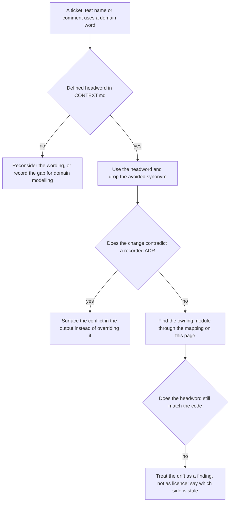
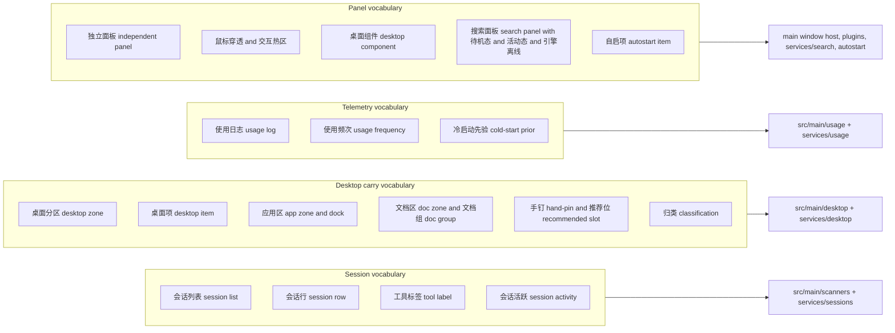
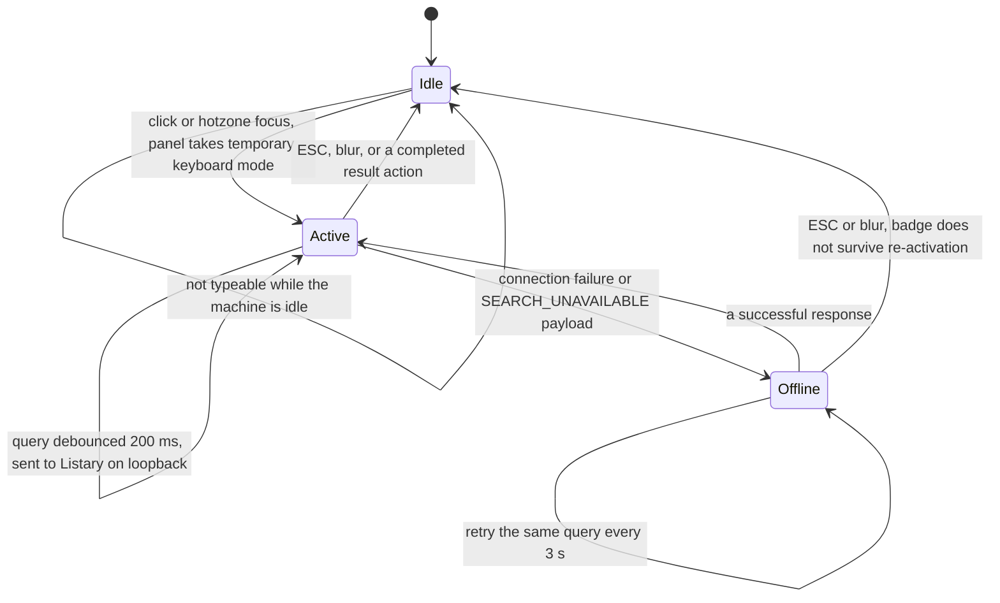

# Domain model: the shared vocabulary and the code that defines each word

`CONTEXT.md` at the repository root is this project's canonical domain glossary, and it is written in Chinese; the pages of this wiki are written in English. This page is the bridge. It pairs every glossary headword with the English term used in this wiki, the meaning the project attaches to it, and the module or constant that makes the word true — so a reader can move from a word in a ticket to the code that gives that word force, and back. Mechanisms and call flows belong to the architecture pages linked at the end; what lives here is naming.

<!-- openwiki: broken internal link [/repo://docs/agents/domain.md#L41-L51] file "/repo://docs/agents/domain.md" does not exist. Fix the href or restore the target, then delete this comment. -->
<!-- openwiki: broken internal link [/repo://docs/agents/domain.md#L5-L11] file "/repo://docs/agents/domain.md" does not exist. Fix the href or restore the target, then delete this comment. -->
`docs/agents/domain.md` makes the glossary normative rather than descriptive: before exploring, read `CONTEXT.md` and the ADRs touching the area; when output names a domain concept — an issue title, a refactor proposal, a hypothesis, a test name — use the glossary term and do not drift to a synonym the glossary explicitly avoids; if the concept is not in the glossary, treat that as a signal that either the wording is invented or there is a real gap to record; and if the intended change contradicts an ADR, say so explicitly instead of silently overriding it ([domain.md](/repo://docs/agents/domain.md#L41-L51), [domain.md](/repo://docs/agents/domain.md#L5-L11)).

Two names for one thing is where bugs hide, so the vocabulary has an identifier side too. A glossary entry is a Chinese headword; the code that implements it is English and often narrower than the headword suggests. The mapping below is the point of this page.

## Where the vocabulary lives, and how a word is expected to travel

<!-- openwiki: broken internal link [/repo://CONTEXT.md#L5-L160] file "/repo://CONTEXT.md" does not exist. Fix the href or restore the target, then delete this comment. -->
<!-- openwiki: broken internal link [/repo://README.md#L118-L118] file "/repo://README.md" does not exist. Fix the href or restore the target, then delete this comment. -->
<!-- openwiki: broken internal link [/repo://AGENTS.md#L29-L31] file "/repo://AGENTS.md" does not exist. Fix the href or restore the target, then delete this comment. -->
- [`CONTEXT.md`](/repo://CONTEXT.md#L5-L160) — a single-context document whose entries pair a bold Chinese headword with a definition and an explicit `_Avoid_` list of rejected synonyms, and whose tail section registers *retired* vocabulary. The README points at it as authoritative, retired section included ([README](/repo://README.md#L118-L118)), and `AGENTS.md` records the single-context layout as root `CONTEXT.md` plus `docs/adr/`, created lazily ([AGENTS.md](/repo://AGENTS.md#L29-L31)).
<!-- openwiki: broken internal link [/repo://docs/adr/0004-electron-cordis-standalone-panel.md] file "/repo://docs/adr/0004-electron-cordis-standalone-panel.md" does not exist. Fix the href or restore the target, then delete this comment. -->
- [`docs/adr/`](/repo://docs/adr/0004-electron-cordis-standalone-panel.md) — decisions that give words like "zone", "usage frequency" and "engine offline" their specific meaning. A renaming or a scope move is a documentation change as much as a code change.
<!-- openwiki: broken internal link [/repo://app/src/shared/contract.ts#L1-L7] file "/repo://app/src/shared/contract.ts" does not exist. Fix the href or restore the target, then delete this comment. -->
- [`app/src/shared/contract.ts`](/repo://app/src/shared/contract.ts#L1-L7) — the identifier vocabulary the kernel and the renderer share. Several domain words are *only* spelled here (`DesktopZone`, `DesktopDockSource`, `DesktopDocGroup`, `SearchUiState`, `PluginCapability`).

The path a domain word is expected to travel: glossary first, ADR conflict surfaced rather than silently overridden, then the owning module — with any glossary-versus-code drift stated out loud.

## The governing decisions, and which vocabulary each one fixes

| ADR | Status | What it fixes | Vocabulary it governs |
|---|---|---|---|
<!-- openwiki: broken internal link [/repo://docs/adr/0001-win32-icon-manipulation.md#L1-L19] file "/repo://docs/adr/0001-win32-icon-manipulation.md" does not exist. Fix the href or restore the target, then delete this comment. -->
| [ADR-0001](/repo://docs/adr/0001-win32-icon-manipulation.md#L1-L19) Win32 icon manipulation | superseded by ADR-0004 | Made desktop zones a convention over *real* icon coordinates, arranged by `LVM_SETITEMPOSITION`, because the wallpaper layer received neither clicks nor focus | The original meaning of 桌面分区 / 桌面项; its approach is now reversed (see below) |
<!-- openwiki: broken internal link [/repo://docs/adr/0002-no-window-titles-in-usage-log.md#L1-L13] file "/repo://docs/adr/0002-no-window-titles-in-usage-log.md" does not exist. Fix the href or restore the target, then delete this comment. -->
| [ADR-0002](/repo://docs/adr/0002-no-window-titles-in-usage-log.md#L1-L13) no window titles in the usage log | accepted | The self-built usage log stores process executable path plus timestamp, never window titles | 使用日志, 使用频次, 冷启动先验, and why documents cannot be ranked by frequency |
<!-- openwiki: broken internal link [/repo://docs/adr/0003-multi-tool-unified-session-model.md#L1-L16] file "/repo://docs/adr/0003-multi-tool-unified-session-model.md" does not exist. Fix the href or restore the target, then delete this comment. -->
| [ADR-0003](/repo://docs/adr/0003-multi-tool-unified-session-model.md#L1-L16) multi-tool unified session model | accepted | Five incompatible tool stores, one strictly read-only scanner each, normalized into Qoder's four-state model and one pair of activity windows | 会话列表, 会话行, 工具标签, 会话活跃, and the accepted distortions of the unified model |
<!-- openwiki: broken internal link [/repo://docs/adr/0003-search-panel-service-window.md#L1-L20] file "/repo://docs/adr/0003-search-panel-service-window.md" does not exist. Fix the href or restore the target, then delete this comment. -->
| [ADR-0003](/repo://docs/adr/0003-search-panel-service-window.md#L1-L20) search panel as a service window | superseded by ADR-0004 | Made the search panel a resident window owned by the data service, disguised as wallpaper while idle | The original meaning of 搜索面板; the *states* survive, the window ownership does not |
<!-- openwiki: broken internal link [/repo://docs/adr/0004-electron-cordis-standalone-panel.md#L6-L24] file "/repo://docs/adr/0004-electron-cordis-standalone-panel.md" does not exist. Fix the href or restore the target, then delete this comment. -->
| [ADR-0004](/repo://docs/adr/0004-electron-cordis-standalone-panel.md#L6-L24) Electron + cordis standalone panel | accepted | Host and kernel: Electron window host, cordis plugin kernel, stacking order background layer < panel < ordinary windows; zones become panel-drawn; drift correction and layout snapshots retire | 独立面板, 背景层, 鼠标穿透, 交互热区, 桌面分区, 桌面组件 — and the whole retired section |
<!-- openwiki: broken internal link [/repo://docs/adr/0005-no-input-hooks-dataplane-utility-process.md#L5-L7] file "/repo://docs/adr/0005-no-input-hooks-dataplane-utility-process.md" does not exist. Fix the href or restore the target, then delete this comment. -->
| [ADR-0005](/repo://docs/adr/0005-no-input-hooks-dataplane-utility-process.md#L5-L7) no input hooks, data in a utility process | accepted | The window-host thread holds no system-level input hook; periodic collection leaves the panel's event loop for a `utilityProcess` child | 鼠标穿透 and 交互热区 mechanics; where the four collectors run |

<!-- openwiki: broken internal link [/repo://docs/adr/0003-search-panel-service-window.md#L1-L2] file "/repo://docs/adr/0003-search-panel-service-window.md" does not exist. Fix the href or restore the target, then delete this comment. -->
<!-- openwiki: broken internal link [/repo://README.md#L107-L116] file "/repo://README.md" does not exist. Fix the href or restore the target, then delete this comment. -->
Two ADR files are both numbered `0003`, and one of them is superseded, so cite ADRs by filename rather than by number alone ([ADR-0003 search-panel](/repo://docs/adr/0003-search-panel-service-window.md#L1-L2), [README's ADR table](/repo://README.md#L107-L116)).

<!-- openwiki: broken internal link [/repo://docs/adr/0004-electron-cordis-standalone-panel.md#L20-L22] file "/repo://docs/adr/0004-electron-cordis-standalone-panel.md" does not exist. Fix the href or restore the target, then delete this comment. -->
The supersession is itself vocabulary: ADR-0004 records that ADR-0001's "the wallpaper layer cannot receive clicks" premise and ADR-0003's "the search panel must be a service-owned Tk window" conclusion both lapsed, that zone semantics were *translated* rather than reinvented (application zone, doc zone, slot, hand-pin, recommended slot, usage frequency, classification, arrangement), that drift correction and layout snapshots retired while the restore-factory-layout action stayed, and that the wallpaper is now simply the user's background layer ([ADR-0004](/repo://docs/adr/0004-electron-cordis-standalone-panel.md#L20-L22)).

## Vocabulary map

Vocabulary clusters and the code areas that own them; the tables below resolve each headword to its specific module, constant or contract field.

## The live glossary, term by term

| Headword | English in this wiki | Means | Owning code |
|---|---|---|---|
<!-- openwiki: broken internal link [/repo://app/src/renderer/cards/sessions/card.ts#L26-L47] file "/repo://app/src/renderer/cards/sessions/card.ts" does not exist. Fix the href or restore the target, then delete this comment. -->
<!-- openwiki: broken internal link [/repo://app/src/shared/contract.ts#L191-L202] file "/repo://app/src/shared/contract.ts" does not exist. Fix the href or restore the target, then delete this comment. -->
| **会话列表** | session list | The desktop component that mixes all tools' active sessions by most recent activity | A built-in desktop component: [`cards/sessions/card.ts`](/repo://app/src/renderer/cards/sessions/card.ts#L26-L47), fed by the `sessions` snapshot section ([contract.ts](/repo://app/src/shared/contract.ts#L191-L202)) |
<!-- openwiki: broken internal link [/repo://app/src/renderer/cards/sessions/card.ts#L14-L24] file "/repo://app/src/renderer/cards/sessions/card.ts" does not exist. Fix the href or restore the target, then delete this comment. -->
<!-- openwiki: broken internal link [/repo://app/src/main/focus/plan.ts#L67-L85] file "/repo://app/src/main/focus/plan.ts" does not exist. Fix the href or restore the target, then delete this comment. -->
| **会话行** | session row | One row standing for one tool session; clicking brings that tool's window forward, launching it when it is not running | [`cards/sessions/card.ts`](/repo://app/src/renderer/cards/sessions/card.ts#L14-L24) → `session/focus` → [`focus/plan.ts`](/repo://app/src/main/focus/plan.ts#L67-L85) |
<!-- openwiki: broken internal link [/repo://app/src/renderer/cards/sessions/card.ts#L7-L7] file "/repo://app/src/renderer/cards/sessions/card.ts" does not exist. Fix the href or restore the target, then delete this comment. -->
<!-- openwiki: broken internal link [/repo://app/src/renderer/cards/sessions/card.ts#L38-L42] file "/repo://app/src/renderer/cards/sessions/card.ts" does not exist. Fix the href or restore the target, then delete this comment. -->
| **工具标签** | tool label | The two-letter mark at the head of a session row naming the source tool (QD, KC, KW, ZC, HM) | [`TOOL_TAGS`](/repo://app/src/renderer/cards/sessions/card.ts#L7-L7); unknown tools render `??` ([card.ts](/repo://app/src/renderer/cards/sessions/card.ts#L38-L42)) |
<!-- openwiki: broken internal link [/repo://app/src/main/scanners/types.ts#L11-L12] file "/repo://app/src/main/scanners/types.ts" does not exist. Fix the href or restore the target, then delete this comment. -->
| **会话活跃** | session activity | A session record updated inside a time window is live: `RUNNING` within 90 s, counted in the active pool within 10 min | [`RUNNING_WINDOW = 90.0`, `ACTIVE_WINDOW = 600.0`](/repo://app/src/main/scanners/types.ts#L11-L12) |
<!-- openwiki: broken internal link [/repo://app/src/shared/contract.ts#L150-L169] file "/repo://app/src/shared/contract.ts" does not exist. Fix the href or restore the target, then delete this comment. -->
<!-- openwiki: broken internal link [/repo://app/src/main/plugins/service.ts#L10-L22] file "/repo://app/src/main/plugins/service.ts" does not exist. Fix the href or restore the target, then delete this comment. -->
| **桌面组件** | desktop component | A hot-pluggable card or function area on the panel (clock, weather, sessions, hardware), addable and removable through the plugin contract | [`plugin.json` manifest](/repo://app/src/shared/contract.ts#L150-L169) + [`PluginHostService`](/repo://app/src/main/plugins/service.ts#L10-L22) |
<!-- openwiki: broken internal link [/repo://app/src/shared/contract.ts#L65-L66] file "/repo://app/src/shared/contract.ts" does not exist. Fix the href or restore the target, then delete this comment. -->
<!-- openwiki: broken internal link [/repo://app/src/renderer/index.html#L398-L399] file "/repo://app/src/renderer/index.html" does not exist. Fix the href or restore the target, then delete this comment. -->
| **桌面分区** | desktop zone | A purpose-bound region of the panel that carries and renders desktop items; the only two zone values are `app` and `doc` | [`DesktopZone`](/repo://app/src/shared/contract.ts#L65-L66); rendered as `#dock-zone` and `#doc-zone` ([index.html](/repo://app/src/renderer/index.html#L398-L399)) |
<!-- openwiki: broken internal link [/repo://app/src/main/desktop/scan.ts#L67-L90] file "/repo://app/src/main/desktop/scan.ts" does not exist. Fix the href or restore the target, then delete this comment. -->
<!-- openwiki: broken internal link [/repo://app/src/main/services/desktop.ts#L150-L157] file "/repo://app/src/main/services/desktop.ts" does not exist. Fix the href or restore the target, then delete this comment. -->
| **桌面项** | desktop item | A desktop file or shortcut carried and rendered by the panel, gathered from the user's and the public desktop, launched by double click | [`collectDesktopItems`](/repo://app/src/main/desktop/scan.ts#L67-L90), [`desktop/launch`](/repo://app/src/main/services/desktop.ts#L150-L157) |
<!-- openwiki: broken internal link [/repo://app/src/main/desktop/plan.ts#L92-L120] file "/repo://app/src/main/desktop/plan.ts" does not exist. Fix the href or restore the target, then delete this comment. -->
<!-- openwiki: broken internal link [/repo://app/src/renderer/index.html#L274-L290] file "/repo://app/src/renderer/index.html" does not exist. Fix the href or restore the target, then delete this comment. -->
| **应用区** | app zone | The zone holding application entries, presented as the bottom dock, filled by hand-pins plus recommendations | [`planDock`](/repo://app/src/main/desktop/plan.ts#L92-L120); `#dock-zone` ([index.html](/repo://app/src/renderer/index.html#L274-L290)) |
<!-- openwiki: broken internal link [/repo://app/src/main/desktop/plan.ts#L58-L84] file "/repo://app/src/main/desktop/plan.ts" does not exist. Fix the href or restore the target, then delete this comment. -->
<!-- openwiki: broken internal link [/repo://app/src/renderer/index.html#L238-L254] file "/repo://app/src/renderer/index.html" does not exist. Fix the href or restore the target, then delete this comment. -->
| **文档区** | doc zone | The zone holding non-application items (files and folders); panel-managed, user placement inside it is not protected | [`planDocs`](/repo://app/src/main/desktop/plan.ts#L58-L84); `#doc-zone` with its `DOCS` label ([index.html](/repo://app/src/renderer/index.html#L238-L254)) |
<!-- openwiki: broken internal link [/repo://app/src/shared/contract.ts#L85-L92] file "/repo://app/src/shared/contract.ts" does not exist. Fix the href or restore the target, then delete this comment. -->
| **栏位** | slot | One position in the app zone; pinned entries take the front, recommendations fill the remainder | [`DesktopDockEntry`](/repo://app/src/shared/contract.ts#L85-L92) — the dock array *is* the slot order, and today it has no capacity limit |
<!-- openwiki: broken internal link [/repo://app/src/main/desktop/layout-store.ts#L7-L17] file "/repo://app/src/main/desktop/layout-store.ts" does not exist. Fix the href or restore the target, then delete this comment. -->
| **手钉** | hand-pin | An application entry the user explicitly listed; it holds a front position and is never displaced by a recommendation | The `pinned` list in `userData/layout.json` ([layout-store.ts](/repo://app/src/main/desktop/layout-store.ts#L7-L17)) |
<!-- openwiki: broken internal link [/repo://app/src/main/desktop/plan.ts#L109-L118] file "/repo://app/src/main/desktop/plan.ts" does not exist. Fix the href or restore the target, then delete this comment. -->
| **推荐位** | recommended slot | The positions left after pins and explicit placements, filled by usage-frequency rank; if no score exists the order falls back to name | `source: 'recommended'`, the remainder segment of [`planDock`](/repo://app/src/main/desktop/plan.ts#L109-L118) |
<!-- openwiki: broken internal link [/repo://app/src/main/usage/score.ts#L9-L9] file "/repo://app/src/main/usage/score.ts" does not exist. Fix the href or restore the target, then delete this comment. -->
<!-- openwiki: broken internal link [/repo://app/src/main/usage/score.ts#L17-L33] file "/repo://app/src/main/usage/score.ts" does not exist. Fix the href or restore the target, then delete this comment. -->
| **使用频次** | usage frequency | An application's start count weighted by time decay, used to rank the dock's recommendation segment | [`HALF_LIFE_DAYS = 14.0`](/repo://app/src/main/usage/score.ts#L9-L9), [`decay`/`scoreStarts`](/repo://app/src/main/usage/score.ts#L17-L33) |
<!-- openwiki: broken internal link [/repo://app/src/main/usage/log.ts#L43-L52] file "/repo://app/src/main/usage/log.ts" does not exist. Fix the href or restore the target, then delete this comment. -->
<!-- openwiki: broken internal link [/repo://app/src/main/usage/log.ts#L8-L9] file "/repo://app/src/main/usage/log.ts" does not exist. Fix the href or restore the target, then delete this comment. -->
| **使用日志** | usage log | The panel's own first-hand usage record: process path plus timestamp, never window titles | [`appendEvent`](/repo://app/src/main/usage/log.ts#L43-L52), per-day JSONL files, `RETENTION_DAYS = 90` ([log.ts](/repo://app/src/main/usage/log.ts#L8-L9)) |
<!-- openwiki: broken internal link [/repo://app/src/main/usage/userassist.ts#L67-L88] file "/repo://app/src/main/usage/userassist.ts" does not exist. Fix the href or restore the target, then delete this comment. -->
<!-- openwiki: broken internal link [/repo://app/src/main/usage/score.ts#L140-L164] file "/repo://app/src/main/usage/score.ts" does not exist. Fix the href or restore the target, then delete this comment. -->
| **冷启动先验** | cold-start prior | An initial frequency estimate borrowed from the system's existing application launch record while the self-built log is still thin; it retires as the log accumulates | [`readUserAssistPrior`](/repo://app/src/main/usage/userassist.ts#L67-L88), fusion weight `1/(1+count)` in [`fuseScores`](/repo://app/src/main/usage/score.ts#L140-L164) |
<!-- openwiki: broken internal link [/repo://app/src/main/desktop/scan.ts#L38-L46] file "/repo://app/src/main/desktop/scan.ts" does not exist. Fix the href or restore the target, then delete this comment. -->
<!-- openwiki: broken internal link [/repo://app/src/main/services/desktop.ts#L203-L210] file "/repo://app/src/main/services/desktop.ts" does not exist. Fix the href or restore the target, then delete this comment. -->
| **归类** | classification | The rule-based act of deciding whether a desktop item belongs in the app zone or the doc zone | [`isAppEntry` / `zoneOf`](/repo://app/src/main/desktop/scan.ts#L38-L46), overridden by an explicit placement before planning ([services/desktop.ts](/repo://app/src/main/services/desktop.ts#L203-L210)) |
<!-- openwiki: broken internal link [/repo://app/src/main/desktop/plan.ts#L19-L34] file "/repo://app/src/main/desktop/plan.ts" does not exist. Fix the href or restore the target, then delete this comment. -->
| **文档组** | doc group | One column group in the doc zone aggregated by extension; a type with no members takes no column and the group order is fixed | [`GROUP_ORDER` and `docGroupOf`](/repo://app/src/main/desktop/plan.ts#L19-L34) |
<!-- openwiki: broken internal link [/repo://app/src/main/desktop/plan.ts#L126-L136] file "/repo://app/src/main/desktop/plan.ts" does not exist. Fix the href or restore the target, then delete this comment. -->
<!-- openwiki: broken internal link [/repo://app/src/main/services/desktop.ts#L95-L110] file "/repo://app/src/main/services/desktop.ts" does not exist. Fix the href or restore the target, then delete this comment. -->
| **编排** | arrangement | One complete act of computing and placing desktop items into the zones | [`planDesktop`](/repo://app/src/main/desktop/plan.ts#L126-L136), recomputed per scan round by [`DesktopService.refresh`](/repo://app/src/main/services/desktop.ts#L95-L110) |
<!-- openwiki: broken internal link [/repo://app/src/renderer/index.html#L243-L253] file "/repo://app/src/renderer/index.html" does not exist. Fix the href or restore the target, then delete this comment. -->
<!-- openwiki: broken internal link [/repo://app/src/renderer/index.html#L398-L398] file "/repo://app/src/renderer/index.html" does not exist. Fix the href or restore the target, then delete this comment. -->
| **分区标签** | zone label | A very small piece of text marking a zone's position; no zone boundary is drawn | The `DOCS` label on the doc zone ([index.html](/repo://app/src/renderer/index.html#L243-L253), [index.html](/repo://app/src/renderer/index.html#L398-L398)) |
<!-- openwiki: broken internal link [/repo://app/src/main/services/search.ts#L49-L56] file "/repo://app/src/main/services/search.ts" does not exist. Fix the href or restore the target, then delete this comment. -->
<!-- openwiki: broken internal link [/repo://app/src/renderer/index.html#L387-L396] file "/repo://app/src/renderer/index.html" does not exist. Fix the href or restore the target, then delete this comment. -->
| **搜索面板** | search panel | The search overlay built into the panel; idle it merges into the right-hand column and is not typeable, activated it queries Listary's local HTTP API and draws its own result rows | [`SearchService`](/repo://app/src/main/services/search.ts#L49-L56) + the `#search-card` markup ([index.html](/repo://app/src/renderer/index.html#L387-L396)) |
<!-- openwiki: broken internal link [/repo://app/src/shared/contract.ts#L214-L215] file "/repo://app/src/shared/contract.ts" does not exist. Fix the href or restore the target, then delete this comment. -->
<!-- openwiki: broken internal link [/repo://app/src/renderer/index.html#L389-L393] file "/repo://app/src/renderer/index.html" does not exist. Fix the href or restore the target, then delete this comment. -->
| **待机态** | standby state | The search panel's inactive form: visually part of the panel, not typeable | `SearchUiState = 'idle'` ([contract.ts](/repo://app/src/shared/contract.ts#L214-L215)); `CLICK TO SEARCH_` hint ([index.html](/repo://app/src/renderer/index.html#L389-L393)) |
<!-- openwiki: broken internal link [/repo://app/src/main/services/search.ts#L90-L113] file "/repo://app/src/main/services/search.ts" does not exist. Fix the href or restore the target, then delete this comment. -->
| **活动态** | active state | The search panel's activated form: query typed, results shown live; `ESC` or focus loss returns it to standby | `'active'` — [`activate`/`deactivate`](/repo://app/src/main/services/search.ts#L90-L113) |
<!-- openwiki: broken internal link [/repo://app/src/main/services/search.ts#L153-L156] file "/repo://app/src/main/services/search.ts" does not exist. Fix the href or restore the target, then delete this comment. -->
<!-- openwiki: broken internal link [/repo://app/src/renderer/main.ts#L568-L578] file "/repo://app/src/renderer/main.ts" does not exist. Fix the href or restore the target, then delete this comment. -->
| **引擎离线** | engine offline | The degraded state shown when Listary's local HTTP API is unreachable or not ready (`ENGINE OFFLINE`) | `'offline'`, derived in [`derivedState`](/repo://app/src/main/services/search.ts#L153-L156); badge in [main.ts](/repo://app/src/renderer/main.ts#L568-L578) |
<!-- openwiki: broken internal link [/repo://app/src/main/panel-window.ts#L9-L43] file "/repo://app/src/main/panel-window.ts" does not exist. Fix the href or restore the target, then delete this comment. -->
<!-- openwiki: broken internal link [/repo://app/src/main/config.ts#L6-L12] file "/repo://app/src/main/config.ts" does not exist. Fix the href or restore the target, then delete this comment. -->
| **独立面板** | independent panel | The resident native window floating above the desktop wallpaper that carries the cards and the zones; transparent background, mouse pass-through by default, clicks accepted only inside interaction hotzones | [`createPanelWindow`](/repo://app/src/main/panel-window.ts#L9-L43), geometry from `config.panel` ([config.ts](/repo://app/src/main/config.ts#L6-L12)) |
<!-- openwiki: broken internal link [/repo://archive/README.md#L3-L7] file "/repo://archive/README.md" does not exist. Fix the href or restore the target, then delete this comment. -->
| **背景层** | background layer | The user's own wallpaper, below the panel and visible through its transparent areas | Not built here any more: the Wallpaper Engine assets are frozen read-only in [`archive/wallpaper-assets/`](/repo://archive/README.md#L3-L7) |
<!-- openwiki: broken internal link [/repo://app/src/main/panel-window.ts#L38-L42] file "/repo://app/src/main/panel-window.ts" does not exist. Fix the href or restore the target, then delete this comment. -->
| **鼠标穿透** | mouse pass-through | The panel's default input state: clicks are not intercepted and land on the background layer and the desktop | `win.setIgnoreMouseEvents(true)` ([panel-window.ts](/repo://app/src/main/panel-window.ts#L38-L42)) |
<!-- openwiki: broken internal link [/repo://app/src/main/hotzone.ts#L15-L69] file "/repo://app/src/main/hotzone.ts" does not exist. Fix the href or restore the target, then delete this comment. -->
<!-- openwiki: broken internal link [/repo://app/src/renderer/main.ts#L712-L754] file "/repo://app/src/renderer/main.ts" does not exist. Fix the href or restore the target, then delete this comment. -->
| **交互热区** | interaction hotzone | A declared interactive rectangle; while the cursor is inside it the panel lifts pass-through to receive clicks, and restores it on leave | [`HotzoneTracker`](/repo://app/src/main/hotzone.ts#L15-L69), rectangles declared from the DOM ([main.ts](/repo://app/src/renderer/main.ts#L712-L754)) |
<!-- openwiki: broken internal link [/repo://app/src/main/autostart.ts#L24-L28] file "/repo://app/src/main/autostart.ts" does not exist. Fix the href or restore the target, then delete this comment. -->
<!-- openwiki: broken internal link [/repo://app/src/main/autostart.ts#L183-L209] file "/repo://app/src/main/autostart.ts" does not exist. Fix the href or restore the target, then delete this comment. -->
| **自启项** | autostart item | The panel's boot entry, one `AGENT DECK.lnk` in the current user's Startup folder, maintained by the panel itself | [`AUTOSTART_LINK_NAME`](/repo://app/src/main/autostart.ts#L24-L28), [`applyAutostart`](/repo://app/src/main/autostart.ts#L183-L209) |

The glossary has no headword for *hardware*; the hardware card's vocabulary (gauges, 300-point history rings, "field absent" versus "field null") is a code-level distinction documented in [hardware telemetry](/openwiki/architecture/hardware-telemetry.md).

### Session vocabulary in detail

`会话列表` is no longer a "column of a wallpaper" — it is one desktop component among several, and the session vocabulary itself is defined by three shared things: one activity window pair, one four-state enumeration, and one record shape.

| Tool id | Label | Store read by its scanner |
|---|---|---|
| `qoder` | QD | `~/.qoder-cn` JSONL event streams |
| `hermes` | HM | `~/AppData/Local/hermes` SQLite + active-session lease file |
| `zcode` | ZC | `~/.zcode` SQLite |
| `kimicode` | KC | `~/.kimi-code` session directories and mtimes |
| `kimiwork` | KW | `~/AppData/Roaming/kimi-desktop/kimi-agent` JSON state maps |

<!-- openwiki: broken internal link [/repo://app/src/main/scanners/index.ts#L22-L28] file "/repo://app/src/main/scanners/index.ts" does not exist. Fix the href or restore the target, then delete this comment. -->
<!-- openwiki: broken internal link [/repo://app/src/main/scanners/index.ts#L31-L39] file "/repo://app/src/main/scanners/index.ts" does not exist. Fix the href or restore the target, then delete this comment. -->
The five ids are the keys of [`SCANNERS`](/repo://app/src/main/scanners/index.ts#L22-L28) and of [`defaultSessionRoots`](/repo://app/src/main/scanners/index.ts#L31-L39); they are the value carried by the session record's `tool` field, and the label letters are a rendering of it, no longer something that lives outside this repository.

<!-- openwiki: broken internal link [/repo://app/src/main/scanners/types.ts#L11-L12] file "/repo://app/src/main/scanners/types.ts" does not exist. Fix the href or restore the target, then delete this comment. -->
<!-- openwiki: broken internal link [/repo://app/src/main/scanners/types.ts#L24-L41] file "/repo://app/src/main/scanners/types.ts" does not exist. Fix the href or restore the target, then delete this comment. -->
<!-- openwiki: broken internal link [/repo://app/src/main/scanners/qoder.ts#L58-L63] file "/repo://app/src/main/scanners/qoder.ts" does not exist. Fix the href or restore the target, then delete this comment. -->
<!-- openwiki: broken internal link [/repo://app/src/main/scanners/hermes.ts#L44-L56] file "/repo://app/src/main/scanners/hermes.ts" does not exist. Fix the href or restore the target, then delete this comment. -->
<!-- openwiki: broken internal link [/repo://app/src/main/scanners/zcode.ts#L49-L54] file "/repo://app/src/main/scanners/zcode.ts" does not exist. Fix the href or restore the target, then delete this comment. -->
<!-- openwiki: broken internal link [/repo://app/src/main/scanners/kimicode.ts#L43-L46] file "/repo://app/src/main/scanners/kimicode.ts" does not exist. Fix the href or restore the target, then delete this comment. -->
<!-- openwiki: broken internal link [/repo://app/src/main/scanners/kimiwork.ts#L29-L34] file "/repo://app/src/main/scanners/kimiwork.ts" does not exist. Fix the href or restore the target, then delete this comment. -->
<!-- openwiki: broken internal link [/repo://docs/adr/0003-multi-tool-unified-session-model.md#L14-L16] file "/repo://docs/adr/0003-multi-tool-unified-session-model.md" does not exist. Fix the href or restore the target, then delete this comment. -->
`会话活跃` has exactly one definition: [`RUNNING_WINDOW` and `ACTIVE_WINDOW`](/repo://app/src/main/scanners/types.ts#L11-L12) are declared once and imported by every scanner and by the shared record builder, whose default `running` flag is `age <= RUNNING_WINDOW` ([types.ts](/repo://app/src/main/scanners/types.ts#L24-L41)). The four states (`RUN`/`CONFIRM`/`DONE`/`IDLE`) are shared, but not evenly reachable: only qoder's scanner can produce `CONFIRM`, because it requires the session's own event stream to end in an unanswered tool call ([qoder.ts](/repo://app/src/main/scanners/qoder.ts#L58-L63)); hermes derives `RUN` from an active-session lease or an unended session, otherwise `IDLE`/`DONE` ([hermes.ts](/repo://app/src/main/scanners/hermes.ts#L44-L56)); zcode and kimi code only ever produce `RUN` or `DONE` ([zcode.ts](/repo://app/src/main/scanners/zcode.ts#L49-L54), [kimicode.ts](/repo://app/src/main/scanners/kimicode.ts#L43-L46)); kimi work adds `DONE`/`IDLE` from its status map ([kimiwork.ts](/repo://app/src/main/scanners/kimiwork.ts#L29-L34)). ADR-0003 records that asymmetry as an accepted distortion of the unified model ([ADR-0003](/repo://docs/adr/0003-multi-tool-unified-session-model.md#L14-L16)).

<!-- openwiki: broken internal link [/repo://app/src/shared/contract.ts#L18-L29] file "/repo://app/src/shared/contract.ts" does not exist. Fix the href or restore the target, then delete this comment. -->
<!-- openwiki: broken internal link [/repo://docs/adr/0003-multi-tool-unified-session-model.md#L16-L16] file "/repo://docs/adr/0003-multi-tool-unified-session-model.md" does not exist. Fix the href or restore the target, then delete this comment. -->
Session identity is the pair `tool` + `id`, not the tool-local id, because ids from different tools collide and would otherwise overwrite each other in the renderer ([contract.ts](/repo://app/src/shared/contract.ts#L18-L29), [ADR-0003](/repo://docs/adr/0003-multi-tool-unified-session-model.md#L16-L16)).

### Desktop carry vocabulary in detail

The panel *draws* desktop items; it does not move real icons and does not store coordinates. That inversion is what most of this cluster's words now mean.

<!-- openwiki: broken internal link [/repo://app/src/main/desktop/scan.ts#L43-L46] file "/repo://app/src/main/desktop/scan.ts" does not exist. Fix the href or restore the target, then delete this comment. -->
<!-- openwiki: broken internal link [/repo://app/src/main/services/desktop.ts#L203-L210] file "/repo://app/src/main/services/desktop.ts" does not exist. Fix the href or restore the target, then delete this comment. -->
- **归类 (classification)** is only a baseline. `zoneOf` maps `shortcut`/`url` to `app` and `file`/`folder` to `doc`, and the comment says plainly that this is the baseline before full arrangement ([scan.ts](/repo://app/src/main/desktop/scan.ts#L43-L46)); the *user's* drag decision outranks it, because the service rewrites `zone` from the layout store's `dock`/`docs` lists before planning ([services/desktop.ts](/repo://app/src/main/services/desktop.ts#L203-L210)). There is no `recycle` cell and no `untouched` zone any more: hidden and system entries are filtered at pool level and the panel simply does not carry a recycle bin.
<!-- openwiki: broken internal link [/repo://app/src/main/desktop/plan.ts#L92-L120] file "/repo://app/src/main/desktop/plan.ts" does not exist. Fix the href or restore the target, then delete this comment. -->
<!-- openwiki: broken internal link [/repo://app/tests/desktop/plan.spec.ts#L138-L144] file "/repo://app/tests/desktop/plan.spec.ts" does not exist. Fix the href or restore the target, then delete this comment. -->
<!-- openwiki: broken internal link [/repo://app/tests/desktop/service.spec.ts#L176-L192] file "/repo://app/tests/desktop/service.spec.ts" does not exist. Fix the href or restore the target, then delete this comment. -->
<!-- openwiki: broken internal link [/repo://app/src/main/desktop/plan.ts#L109-L114] file "/repo://app/src/main/desktop/plan.ts" does not exist. Fix the href or restore the target, then delete this comment. -->
- **应用区 (app zone)** is the dock, built by concatenating three segments in a fixed order — `pinned`, then `placed`, then `recommended` — rather than by one composite sort key ([plan.ts](/repo://app/src/main/desktop/plan.ts#L92-L120)). That structure is what makes "a recommendation never displaces a hand-pin" a property instead of a sorting accident ([plan.spec.ts](/repo://app/tests/desktop/plan.spec.ts#L138-L144), [service.spec.ts](/repo://app/tests/desktop/service.spec.ts#L176-L192)). An item with no score is not filtered out; it fills a position at score 0 ([plan.ts](/repo://app/src/main/desktop/plan.ts#L109-L114)).
<!-- openwiki: broken internal link [/repo://app/src/main/desktop/plan.ts#L16-L23] file "/repo://app/src/main/desktop/plan.ts" does not exist. Fix the href or restore the target, then delete this comment. -->
<!-- openwiki: broken internal link [/repo://app/tests/desktop/plan.spec.ts#L203-L207] file "/repo://app/tests/desktop/plan.spec.ts" does not exist. Fix the href or restore the target, then delete this comment. -->
- **文档组 (doc group)** order is fixed by `GROUP_ORDER` (`folders`, `office`, `pdf`, `image`, `archive`, `other`) regardless of group size, so a file type always sits in the same relative column — the stated prerequisite for a zone usable from muscle memory ([plan.ts](/repo://app/src/main/desktop/plan.ts#L16-L23), [plan.spec.ts](/repo://app/tests/desktop/plan.spec.ts#L203-L207)).
<!-- openwiki: broken internal link [/repo://app/src/main/desktop/layout-store.ts#L7-L17] file "/repo://app/src/main/desktop/layout-store.ts" does not exist. Fix the href or restore the target, then delete this comment. -->
<!-- openwiki: broken internal link [/repo://app/src/main/desktop/plan.ts#L98-L107] file "/repo://app/src/main/desktop/plan.ts" does not exist. Fix the href or restore the target, then delete this comment. -->
<!-- openwiki: broken internal link [/repo://app/src/main/desktop/layout-store.ts#L1-L6] file "/repo://app/src/main/desktop/layout-store.ts" does not exist. Fix the href or restore the target, then delete this comment. -->
<!-- openwiki: broken internal link [/repo://app/tests/desktop/plan.spec.ts#L129-L132] file "/repo://app/tests/desktop/plan.spec.ts" does not exist. Fix the href or restore the target, then delete this comment. -->
- **手钉 (hand-pin)** is an ordered list of display names in the machine-written layout store (`userData/layout.json`), filtered to names actually present in the pool, de-duplicated with first mention winning ([layout-store.ts](/repo://app/src/main/desktop/layout-store.ts#L7-L17), [plan.ts](/repo://app/src/main/desktop/plan.ts#L98-L107)). Stale names are deliberately kept: a file that comes back finds its placement still recorded ([layout-store.ts](/repo://app/src/main/desktop/layout-store.ts#L1-L6), [plan.spec.ts](/repo://app/tests/desktop/plan.spec.ts#L129-L132)).
<!-- openwiki: broken internal link [/repo://app/src/main/desktop/layout-store.ts#L1-L6] file "/repo://app/src/main/desktop/layout-store.ts" does not exist. Fix the href or restore the target, then delete this comment. -->
- **编排 (arrangement)** is now derived state only — "no coordinates to store: *where you dragged it* is recorded as *which item it comes before*" ([layout-store.ts](/repo://app/src/main/desktop/layout-store.ts#L1-L6)).

### Desktop component vocabulary in detail

<!-- openwiki: broken internal link [/repo://app/src/shared/contract.ts#L150-L169] file "/repo://app/src/shared/contract.ts" does not exist. Fix the href or restore the target, then delete this comment. -->
`桌面组件` is a plugin, and its vocabulary is a declarative contract: a directory containing `plugin.json` with `id`, `name`, `version`, `entry` and `capabilities` (plus optional `mount` and `order`) ([contract.ts](/repo://app/src/shared/contract.ts#L150-L169)). Three names in that contract carry meaning beyond their spelling:

<!-- openwiki: broken internal link [/repo://app/src/main/plugins/manifest.ts#L10-L11] file "/repo://app/src/main/plugins/manifest.ts" does not exist. Fix the href or restore the target, then delete this comment. -->
<!-- openwiki: broken internal link [/repo://app/src/main/plugins/protocol.ts#L31-L34] file "/repo://app/src/main/plugins/protocol.ts" does not exist. Fix the href or restore the target, then delete this comment. -->
- `id` is simultaneously the plugin's identity and its protocol host: assets are addressed as `deck-plugin://<id>/…`, so the id is restricted to a lowercase hostname character set, and the panel page itself is loaded through the same scheme ([manifest.ts](/repo://app/src/main/plugins/manifest.ts#L10-L11), [plugins/protocol.ts](/repo://app/src/main/plugins/protocol.ts#L31-L34)).
<!-- openwiki: broken internal link [/repo://app/src/shared/contract.ts#L137-L148] file "/repo://app/src/shared/contract.ts" does not exist. Fix the href or restore the target, then delete this comment. -->
<!-- openwiki: broken internal link [/repo://app/src/renderer/plugins.ts#L87-L95] file "/repo://app/src/renderer/plugins.ts" does not exist. Fix the href or restore the target, then delete this comment. -->
- `capabilities` are snapshot section names, and the cropping direction is "give less, never more": an unknown capability string is discarded without invalidating the manifest, and a plugin receives only the sections it declared ([contract.ts](/repo://app/src/shared/contract.ts#L137-L148), [renderer/plugins.ts](/repo://app/src/renderer/plugins.ts#L87-L95)).
<!-- openwiki: broken internal link [/repo://app/src/main/plugins/manifest.ts#L25-L32] file "/repo://app/src/main/plugins/manifest.ts" does not exist. Fix the href or restore the target, then delete this comment. -->
- `entry` must be a `.js`/`.mjs` path inside the plugin's own directory — absolute paths, drive letters and `..` are rejected ([manifest.ts](/repo://app/src/main/plugins/manifest.ts#L25-L32)).

<!-- openwiki: broken internal link [/repo://app/src/renderer/index.html#L377-L399] file "/repo://app/src/renderer/index.html" does not exist. Fix the href or restore the target, then delete this comment. -->
<!-- openwiki: broken internal link [/repo://app/src/renderer/cards/clock/plugin.json#L1-L8] file "/repo://app/src/renderer/cards/clock/plugin.json" does not exist. Fix the href or restore the target, then delete this comment. -->
<!-- openwiki: broken internal link [/repo://app/src/main/index.ts#L91-L92] file "/repo://app/src/main/index.ts" does not exist. Fix the href or restore the target, then delete this comment. -->
<!-- openwiki: broken internal link [/repo://app/src/main/plugins/service.ts#L180-L200] file "/repo://app/src/main/plugins/service.ts" does not exist. Fix the href or restore the target, then delete this comment. -->
Four card components ship in-tree (clock, hardware, sessions, weather) and are mounted from the same contract as user plugins — the host page keeps only the calendar, the search overlay, the two zones and the settings overlay ([index.html](/repo://app/src/renderer/index.html#L377-L399), [cards/clock/plugin.json](/repo://app/src/renderer/cards/clock/plugin.json#L1-L8)); a user plugin lives in `config.plugins.dir` (default `userData/plugins`) and is scanned after the built-in roots, so a same-`id` user plugin cannot displace a built-in one ([index.ts](/repo://app/src/main/index.ts#L91-L92), [plugins/service.ts](/repo://app/src/main/plugins/service.ts#L180-L200)).

### Panel and search vocabulary in detail

The panel vocabulary is a window model, not a styling choice:

| Term | Mechanically |
|---|---|
<!-- openwiki: broken internal link [/repo://app/src/main/panel-window.ts#L9-L43] file "/repo://app/src/main/panel-window.ts" does not exist. Fix the href or restore the target, then delete this comment. -->
<!-- openwiki: broken internal link [/repo://app/src/main/index.ts#L145-L148] file "/repo://app/src/main/index.ts" does not exist. Fix the href or restore the target, then delete this comment. -->
| 独立面板 | A transparent, frameless, never-focusable `BrowserWindow` sized from `config.panel`, created with `setIgnoreMouseEvents(true)`, skipped from the taskbar, and pinned to the bottom of the z-order ([panel-window.ts](/repo://app/src/main/panel-window.ts#L9-L43), [index.ts](/repo://app/src/main/index.ts#L145-L148)) |
<!-- openwiki: broken internal link [/repo://archive/README.md#L3-L7] file "/repo://archive/README.md" does not exist. Fix the href or restore the target, then delete this comment. -->
| 背景层 | Whatever the user chose: system wallpaper or Wallpaper Engine. The panel is transparent, so the layer shows through; nothing in the repository builds or deploys it ([archive/README.md](/repo://archive/README.md#L3-L7)) |
<!-- openwiki: broken internal link [/repo://app/src/main/panel-window.ts#L38-L42] file "/repo://app/src/main/panel-window.ts" does not exist. Fix the href or restore the target, then delete this comment. -->
| 鼠标穿透 | The default input state; pass-through is restored *without* `forward`, because `forward` would make Electron install a system-wide low-level mouse hook (ADR-0005) ([panel-window.ts](/repo://app/src/main/panel-window.ts#L38-L42)) |
<!-- openwiki: broken internal link [/repo://app/src/renderer/main.ts#L712-L754] file "/repo://app/src/renderer/main.ts" does not exist. Fix the href or restore the target, then delete this comment. -->
<!-- openwiki: broken internal link [/repo://app/src/main/hotzone.ts#L41-L69] file "/repo://app/src/main/hotzone.ts" does not exist. Fix the href or restore the target, then delete this comment. -->
<!-- openwiki: broken internal link [/repo://app/src/main/index.ts#L124-L137] file "/repo://app/src/main/index.ts" does not exist. Fix the href or restore the target, then delete this comment. -->
| 交互热区 | Rectangles declared by the renderer (every `.card`, plus the bounding box of the dock's and doc zone's items with a 10 px pad, plus the settings controls) and polled at 25 ms against `GetCursorPos`; a leave is confirmed after two consecutive misses, and leaving re-pins the window with a 500 ms throttle ([main.ts](/repo://app/src/renderer/main.ts#L712-L754), [hotzone.ts](/repo://app/src/main/hotzone.ts#L41-L69), [index.ts](/repo://app/src/main/index.ts#L124-L137)) |

The 搜索面板's three states are one machine plus one derived display state:

The search panel's state vocabulary: `offline` is a display state derived while the machine is active, and any deactivation returns to standby with the query cleared and in-flight responses voided.

<!-- openwiki: broken internal link [/repo://app/src/renderer/main.ts#L595-L635] file "/repo://app/src/renderer/main.ts" does not exist. Fix the href or restore the target, then delete this comment. -->
<!-- openwiki: broken internal link [/repo://app/src/main/panel-ipc.ts#L66-L82] file "/repo://app/src/main/panel-ipc.ts" does not exist. Fix the href or restore the target, then delete this comment. -->
Because the panel window is deliberately not focusable, standby is not merely "not focused": the input box only exists while active, and activation is what asks the host for temporary keyboard mode ([renderer/main.ts](/repo://app/src/renderer/main.ts#L595-L635), [panel-ipc.ts](/repo://app/src/main/panel-ipc.ts#L66-L82)).

## Glossary drift: where the headwords and the code disagree

Four places need care, because an agent that trusts the glossary alone would change the wrong thing. None of them is a mechanism change; all are worth stating out loud rather than silently "fixing" either side.

<!-- openwiki: broken internal link [/repo://CONTEXT.md#L43-L53] file "/repo://CONTEXT.md" does not exist. Fix the href or restore the target, then delete this comment. -->
<!-- openwiki: broken internal link [/repo://app/src/main/desktop/plan.ts#L86-L91] file "/repo://app/src/main/desktop/plan.ts" does not exist. Fix the href or restore the target, then delete this comment. -->
<!-- openwiki: broken internal link [/repo://app/src/renderer/index.html#L274-L290] file "/repo://app/src/renderer/index.html" does not exist. Fix the href or restore the target, then delete this comment. -->
1. **栏位 (slot) still describes a capped grid that does not exist.** The glossary says a slot is a *fixed-coordinate* cell with a *capped total*, filled pins-first with recommendations taking the remainder, and that when the slots are pinned full *recommendations simply do not appear* ([CONTEXT.md](/repo://CONTEXT.md#L43-L53)). Today there is no slot count anywhere: `planDock` has no capacity parameter and emits one entry per app-zone item, so every item is carried, and a long dock is absorbed visually by a `flex-wrap` strip bounded by `config.desktop.dockMaxWidth` ([plan.ts](/repo://app/src/main/desktop/plan.ts#L86-L91), [index.html](/repo://app/src/renderer/index.html#L274-L290)). Read the capped-slot clause as historical; the surviving part of the word is *position plus source* (`DesktopDockEntry`).
<!-- openwiki: broken internal link [/repo://CONTEXT.md#L75-L77] file "/repo://CONTEXT.md" does not exist. Fix the href or restore the target, then delete this comment. -->
<!-- openwiki: broken internal link [/repo://app/src/main/services/desktop.ts#L46-L52] file "/repo://app/src/main/services/desktop.ts" does not exist. Fix the href or restore the target, then delete this comment. -->
<!-- openwiki: broken internal link [/repo://app/src/main/services/desktop.ts#L95-L110] file "/repo://app/src/main/services/desktop.ts" does not exist. Fix the href or restore the target, then delete this comment. -->
<!-- openwiki: broken internal link [/repo://app/src/main/desktop/watch.ts#L17-L30] file "/repo://app/src/main/desktop/watch.ts" does not exist. Fix the href or restore the target, then delete this comment. -->
2. **编排 (arrangement) still describes "first-time full plus single-item incremental".** The glossary names two modes ([CONTEXT.md](/repo://CONTEXT.md#L75-L77)); the current implementation has one, and it is a full recompute: every scan round re-derives the whole plan from the item pool, the store and the scores ([services/desktop.ts](/repo://app/src/main/services/desktop.ts#L46-L52), [services/desktop.ts](/repo://app/src/main/services/desktop.ts#L95-L110)). What remains of the distinction is *triggering*: a 1 Hz refresh plus an `fs.watch` directory watcher that merges an event storm into one call after the directory goes quiet ([watch.ts](/repo://app/src/main/desktop/watch.ts#L17-L30)). There is no one-shot dry-run/`--apply` arrangement command.
<!-- openwiki: broken internal link [/repo://CONTEXT.md#L27-L29] file "/repo://CONTEXT.md" does not exist. Fix the href or restore the target, then delete this comment. -->
<!-- openwiki: broken internal link [/repo://CONTEXT.md#L79-L81] file "/repo://CONTEXT.md" does not exist. Fix the href or restore the target, then delete this comment. -->
<!-- openwiki: broken internal link [/repo://app/src/renderer/index.html#L205-L206] file "/repo://app/src/renderer/index.html" does not exist. Fix the href or restore the target, then delete this comment. -->
<!-- openwiki: broken internal link [/repo://app/src/renderer/index.html#L238-L253] file "/repo://app/src/renderer/index.html" does not exist. Fix the href or restore the target, then delete this comment. -->
<!-- openwiki: broken internal link [/repo://app/src/renderer/index.html#L274-L290] file "/repo://app/src/renderer/index.html" does not exist. Fix the href or restore the target, then delete this comment. -->
3. **桌面分区's "no border, no background" rule now holds for one zone only.** The glossary says a zone draws neither border nor fill and is marked by a 分区标签 ([CONTEXT.md](/repo://CONTEXT.md#L27-L29), [CONTEXT.md](/repo://CONTEXT.md#L79-L81)). The document zone honors that — `.zone` carries no fill and the zone label is the single `DOCS` label ([index.html](/repo://app/src/renderer/index.html#L205-L206), [index.html](/repo://app/src/renderer/index.html#L238-L253)) — while the application zone is drawn as a filled, bordered, rounded dock strip ([index.html](/repo://app/src/renderer/index.html#L274-L290)).
<!-- openwiki: broken internal link [/repo://app/src/shared/contract.ts#L85-L92] file "/repo://app/src/shared/contract.ts" does not exist. Fix the href or restore the target, then delete this comment. -->
<!-- openwiki: broken internal link [/repo://app/src/main/desktop/plan.ts#L104-L118] file "/repo://app/src/main/desktop/plan.ts" does not exist. Fix the href or restore the target, then delete this comment. -->
<!-- openwiki: broken internal link [/repo://CONTEXT.md#L47-L49] file "/repo://CONTEXT.md" does not exist. Fix the href or restore the target, then delete this comment. -->
<!-- openwiki: broken internal link [/repo://app/src/main/desktop/layout-store.ts#L7-L15] file "/repo://app/src/main/desktop/layout-store.ts" does not exist. Fix the href or restore the target, then delete this comment. -->
4. **A first-class dock source has no headword.** `DesktopDockSource` is `'pinned' | 'placed' | 'recommended'` ([contract.ts](/repo://app/src/shared/contract.ts#L85-L92)); the glossary names the first and the third (手钉 / 推荐位) but not the middle one, which is the user's explicit drag placement and the only ordering the panel lets a user express through the UI at all ([plan.ts](/repo://app/src/main/desktop/plan.ts#L104-L118)). The same gap runs the other way for identifiers: the glossary rejects the word *pin* in prose, but the code keeps `pinned`, `dock` and `docs` because there is no cleaner English identifier ([CONTEXT.md](/repo://CONTEXT.md#L47-L49), [layout-store.ts](/repo://app/src/main/desktop/layout-store.ts#L7-L15)).

<!-- openwiki: broken internal link [/repo://app/src/main/services/desktop.ts#L87-L87] file "/repo://app/src/main/services/desktop.ts" does not exist. Fix the href or restore the target, then delete this comment. -->
<!-- openwiki: broken internal link [/repo://app/src/main/services/desktop.ts#L194-L200] file "/repo://app/src/main/services/desktop.ts" does not exist. Fix the href or restore the target, then delete this comment. -->
<!-- openwiki: broken internal link [/repo://app/src/renderer/index.html#L401-L411] file "/repo://app/src/renderer/index.html" does not exist. Fix the href or restore the target, then delete this comment. -->
One operational consequence of the same inversion: the hand-pin list is no longer a human-editable file at the repository root. It is the `pinned` array of `userData/layout.json`, read once when the desktop service is constructed and rewritten in full on every placement change ([services/desktop.ts](/repo://app/src/main/services/desktop.ts#L87-L87), [services/desktop.ts](/repo://app/src/main/services/desktop.ts#L194-L200)), and no UI writes it — the SETTINGS overlay offers only the factory reset ([index.html](/repo://app/src/renderer/index.html#L401-L411)). Hand-editing it therefore takes effect at the next start and is overwritten by the next placement change.

## Retired vocabulary: do not revive, and what replaced each word

<!-- openwiki: broken internal link [/repo://CONTEXT.md#L119-L159] file "/repo://CONTEXT.md" does not exist. Fix the href or restore the target, then delete this comment. -->
The glossary's tail section is a register, not a graveyard ([CONTEXT.md](/repo://CONTEXT.md#L119-L159)). Each row gives the retired headword, what it used to name, when it was retired, and what to say or do instead.

| Retired headword | What it named | Retired | Replacement concept today |
|---|---|---|---|
<!-- openwiki: broken internal link [/repo://app/src/shared/contract.ts#L143-L148] file "/repo://app/src/shared/contract.ts" does not exist. Fix the href or restore the target, then delete this comment. -->
<!-- openwiki: broken internal link [/repo://app/tests/contract.spec.ts#L546-L566] file "/repo://app/tests/contract.spec.ts" does not exist. Fix the href or restore the target, then delete this comment. -->
| **Qoder 状态块** (Qoder status block) | A desktop component that held a right-column slot showing the most recently active Qoder session's run state and task progress | 2026-09-30, ticket 03 | Absorbed by **会话列表** (the session card grew into the freed slot); the QD **会话行**, in-row task progress and click-through survive as five-tool capabilities. The `qoder` plugin capability is gone and an old manifest declaring it loses that capability silently ([contract.ts](/repo://app/src/shared/contract.ts#L143-L148), [contract.spec.ts](/repo://app/tests/contract.spec.ts#L546-L566)) |
<!-- openwiki: broken internal link [/repo://app/src/main/kernel.ts#L61-L84] file "/repo://app/src/main/kernel.ts" does not exist. Fix the href or restore the target, then delete this comment. -->
| **数据服务** (data service) | The resident Python HTTP service that fed "wallpaper + data plane": hardware and session contracts, a watchdog to start it, and three scripts to deploy the wallpaper | 2026-09-29, ticket 11 | **cordis kernel services** in the panel main process (bridge, search, settings, focus, plugin host) with the four collectors moved into the data-plane `utilityProcess` child ([kernel.ts](/repo://app/src/main/kernel.ts#L61-L84), [overview](/openwiki/architecture/overview.md)) |
<!-- openwiki: broken internal link [/repo://app/src/main/index.ts#L183-L234] file "/repo://app/src/main/index.ts" does not exist. Fix the href or restore the target, then delete this comment. -->
<!-- openwiki: broken internal link [/repo://app/src/main/icon-carry.ts#L80-L122] file "/repo://app/src/main/icon-carry.ts" does not exist. Fix the href or restore the target, then delete this comment. -->
<!-- openwiki: broken internal link [/repo://app/src/main/autostart.ts#L27-L28] file "/repo://app/src/main/autostart.ts" does not exist. Fix the href or restore the target, then delete this comment. -->
| **看门狗** (watchdog) | `server_watchdog.pyw`, a Startup shortcut that started the data service when Wallpaper Engine ran, and doubled as icon-restore fallback | 2026-09-29, ticket 11 | The **outer supervisor** process owns the panel child's lifetime and the icon hide/restore duty, with a detached restore watcher fence for the killed-console case ([index.ts](/repo://app/src/main/index.ts#L183-L234), [icon-carry.ts](/repo://app/src/main/icon-carry.ts#L80-L122)); the legacy Startup link it left behind is deleted on every start ([autostart.ts](/repo://app/src/main/autostart.ts#L27-L28)) |
<!-- openwiki: broken internal link [/repo://app/src/renderer/index.html#L387-L396] file "/repo://app/src/renderer/index.html" does not exist. Fix the href or restore the target, then delete this comment. -->
<!-- openwiki: broken internal link [/repo://app/src/main/services/search.ts#L49-L56] file "/repo://app/src/main/services/search.ts" does not exist. Fix the href or restore the target, then delete this comment. -->
| **搜索浮层窗** (search overlay window) | A separate native Tk window created by the data service, disguised as part of the wallpaper, carrying the Listary search box | 2026-09-29, ticket 11 | **搜索面板**: an in-panel HTML overlay plus the kernel's `SearchService` ([index.html](/repo://app/src/renderer/index.html#L387-L396), [services/search.ts](/repo://app/src/main/services/search.ts#L49-L56)) |
<!-- openwiki: broken internal link [/repo://app/src/main/desktop/layout-store.ts#L1-L6] file "/repo://app/src/main/desktop/layout-store.ts" does not exist. Fix the href or restore the target, then delete this comment. -->
| **漂移纠正** (drift correction) | The policy of placing only newly appeared items and never moving icons the user had already arranged | 2026-09-25 | No successor is needed: the panel draws its own items, so no system process can disturb the layout. Do not revive the word to mean "auto-arrange"; the durable user intent is the explicit placement order ([layout-store.ts](/repo://app/src/main/desktop/layout-store.ts#L1-L6)) |
<!-- openwiki: broken internal link [/repo://app/src/shared/contract.ts#L229-L230] file "/repo://app/src/shared/contract.ts" does not exist. Fix the href or restore the target, then delete this comment. -->
<!-- openwiki: broken internal link [/repo://app/src/main/desktop/layout-store.ts#L73-L76] file "/repo://app/src/main/desktop/layout-store.ts" does not exist. Fix the href or restore the target, then delete this comment. -->
| **布局快照** (layout snapshot) | Snapshots of all real icon coordinates taken before an arrangement (factory state plus per-run state) | 2026-09-25 | Only the **restore-factory-layout** action survives: `desktop/reset-layout` clears the explicit placements while keeping the pin list ([contract.ts](/repo://app/src/shared/contract.ts#L229-L230), [layout-store.ts](/repo://app/src/main/desktop/layout-store.ts#L73-L76)) |
<!-- openwiki: broken internal link [/repo://CONTEXT.md#L143-L144] file "/repo://CONTEXT.md" does not exist. Fix the href or restore the target, then delete this comment. -->
| **鼠标指示器** (mouse indicator) | A module showing resolution, cursor coordinates and key events (`RES`/`POS`/`EVT`) | 2026-09-20 | None. No such card exists; do not reintroduce it as a "debug card" ([CONTEXT.md](/repo://CONTEXT.md#L143-L144)) |
<!-- openwiki: broken internal link [/repo://CONTEXT.md#L146-L147] file "/repo://CONTEXT.md" does not exist. Fix the href or restore the target, then delete this comment. -->
| **头部视差** (head parallax) | A dynamic offset that nudged the whole view with cursor position | 2026-09-20 | None. The view is static; a mouse-following transform would be re-introducing retired vocabulary ([CONTEXT.md](/repo://CONTEXT.md#L146-L147)) |
| **信息模块** (information module) | An information block inside a wallpaper column | 2026-09-25 | **桌面组件** (desktop component): the same idea, now with a plugin contract, four built-in cards and a user plugin directory ([plugin-host](/openwiki/architecture/plugin-host.md)) |
<!-- openwiki: broken internal link [/repo://archive/README.md#L3-L20] file "/repo://archive/README.md" does not exist. Fix the href or restore the target, then delete this comment. -->
<!-- openwiki: broken internal link [/repo://README.md#L9-L9] file "/repo://README.md" does not exist. Fix the href or restore the target, then delete this comment. -->
| **HUD 模式**, **座舱环抱**, **仪表俯倾** (HUD mode, cockpit wrap, instrument tilt) | The helmet-view look: perspective on the columns, wrap about the vertical axis, tilt about the horizontal axis | 2026-09-25 | None — the UI is a flat card grid. The wallpaper assets that carried those transforms are frozen read-only under [`archive/wallpaper-assets/`](/repo://archive/README.md#L3-L20); the repository no longer builds, patches or deploys a wallpaper at all ([README](/repo://README.md#L9-L9)) |

Two retired words have surviving *kin* that are easy to confuse with a revival: the panel has a **restore-factory-layout** action (the residue of 布局快照) and it does keep a durable record of user intent (the residue of 漂移纠正) — but that record is an order of names, not a map of coordinates, so no snapshot format and no icon-moving path should come back with the name.

## Invariants the vocabulary carries

Each glossary word pins behaviour that a change must not silently break.

<!-- openwiki: broken internal link [/repo://app/src/main/scanners/types.ts#L11-L12] file "/repo://app/src/main/scanners/types.ts" does not exist. Fix the href or restore the target, then delete this comment. -->
<!-- openwiki: broken internal link [/repo://app/src/main/scanners/index.ts#L19-L20] file "/repo://app/src/main/scanners/index.ts" does not exist. Fix the href or restore the target, then delete this comment. -->
- **One definition of "active".** The 90-second and 10-minute windows exist once, in `scanners/types.ts`, and every scanner imports them ([types.ts](/repo://app/src/main/scanners/types.ts#L11-L12), [index.ts](/repo://app/src/main/scanners/index.ts#L19-L20)).
- **Session identity is `tool` + `id`.** Any renderer keyed on `id` alone will collide across tools.
<!-- openwiki: broken internal link [/repo://app/src/main/desktop/plan.ts#L98-L120] file "/repo://app/src/main/desktop/plan.ts" does not exist. Fix the href or restore the target, then delete this comment. -->
<!-- openwiki: broken internal link [/repo://app/tests/desktop/plan.spec.ts#L138-L144] file "/repo://app/tests/desktop/plan.spec.ts" does not exist. Fix the href or restore the target, then delete this comment. -->
<!-- openwiki: broken internal link [/repo://app/src/main/services/desktop.ts#L159-L167] file "/repo://app/src/main/services/desktop.ts" does not exist. Fix the href or restore the target, then delete this comment. -->
- **A hand-pin is never displaced by a recommendation**, and no dock capacity exists to suppress recommendations ([plan.ts](/repo://app/src/main/desktop/plan.ts#L98-L120), [plan.spec.ts](/repo://app/tests/desktop/plan.spec.ts#L138-L144)). A pin cannot be dragged *within* the app zone either: the move is refused explicitly and the reason names the pin list, rather than silently springing back ([services/desktop.ts](/repo://app/src/main/services/desktop.ts#L159-L167)).
<!-- openwiki: broken internal link [/repo://app/src/renderer/index.html#L238-L254] file "/repo://app/src/renderer/index.html" does not exist. Fix the href or restore the target, then delete this comment. -->
- **Planning carries every item.** No plan entry is ever "unplaced": an overfull doc zone is clipped visually, not dropped ([index.html](/repo://app/src/renderer/index.html#L238-L254)).
<!-- openwiki: broken internal link [/repo://app/src/main/desktop/layout-store.ts#L53-L71] file "/repo://app/src/main/desktop/layout-store.ts" does not exist. Fix the href or restore the target, then delete this comment. -->
- **Classification is a default, not a verdict.** A user drag rewrites the zone before planning, and the same name can never sit in both lists ([layout-store.ts](/repo://app/src/main/desktop/layout-store.ts#L53-L71)).
<!-- openwiki: broken internal link [/repo://docs/adr/0002-no-window-titles-in-usage-log.md#L10-L13] file "/repo://docs/adr/0002-no-window-titles-in-usage-log.md" does not exist. Fix the href or restore the target, then delete this comment. -->
<!-- openwiki: broken internal link [/repo://app/src/main/services/usage.ts#L79-L82] file "/repo://app/src/main/services/usage.ts" does not exist. Fix the href or restore the target, then delete this comment. -->
- **The usage log is start counts, not foreground time**, and documents cannot be ranked by it ([ADR-0002](/repo://docs/adr/0002-no-window-titles-in-usage-log.md#L10-L13)). Only `start` events feed the score ([services/usage.ts](/repo://app/src/main/services/usage.ts#L79-L82)).
<!-- openwiki: broken internal link [/repo://app/tests/usage/log.spec.ts#L62-L70] file "/repo://app/tests/usage/log.spec.ts" does not exist. Fix the href or restore the target, then delete this comment. -->
<!-- openwiki: broken internal link [/repo://app/tests/usage/log.spec.ts#L116-L129] file "/repo://app/tests/usage/log.spec.ts" does not exist. Fix the href or restore the target, then delete this comment. -->
<!-- openwiki: broken internal link [/repo://app/src/renderer/main.ts#L466-L472] file "/repo://app/src/renderer/main.ts" does not exist. Fix the href or restore the target, then delete this comment. -->
<!-- openwiki: broken internal link [/repo://app/tests/contract.spec.ts#L569-L609] file "/repo://app/tests/contract.spec.ts" does not exist. Fix the href or restore the target, then delete this comment. -->
<!-- openwiki: broken internal link [/repo://app/src/main/search/engine.ts#L15-L18] file "/repo://app/src/main/search/engine.ts" does not exist. Fix the href or restore the target, then delete this comment. -->
- **Two privacy boundaries hold by test.** A usage record is exactly `{ts, exe}`, and no module under `src/main` may contain `GetWindowText` or `window_title` ([log.spec.ts](/repo://app/tests/usage/log.spec.ts#L62-L70), [log.spec.ts](/repo://app/tests/usage/log.spec.ts#L116-L129)). Search query text is never written: the renderer's evidence events carry only a length, the search modules may not import the usage log, write files, or hardcode a URL, and the target is the loopback constant plus the configured port ([main.ts](/repo://app/src/renderer/main.ts#L466-L472), [contract.spec.ts](/repo://app/tests/contract.spec.ts#L569-L609), [engine.ts](/repo://app/src/main/search/engine.ts#L15-L18)).
<!-- openwiki: broken internal link [/repo://app/src/main/search/engine.ts#L109-L124] file "/repo://app/src/main/search/engine.ts" does not exist. Fix the href or restore the target, then delete this comment. -->
<!-- openwiki: broken internal link [/repo://app/src/main/services/search.ts#L181-L215] file "/repo://app/src/main/services/search.ts" does not exist. Fix the href or restore the target, then delete this comment. -->
- **`offline` is narrower than "something went wrong".** Only a connection failure or a `SEARCH_UNAVAILABLE` payload is engine offline; rate limiting backs off silently; a reachable engine returning a malformed payload is an `error` that is neither shown as offline nor retried automatically ([engine.ts](/repo://app/src/main/search/engine.ts#L109-L124), [services/search.ts](/repo://app/src/main/services/search.ts#L181-L215)).
<!-- openwiki: broken internal link [/repo://app/src/main/panel-window.ts#L38-L42] file "/repo://app/src/main/panel-window.ts" does not exist. Fix the href or restore the target, then delete this comment. -->
<!-- openwiki: broken internal link [/repo://app/src/main/hotzone.ts#L4-L19] file "/repo://app/src/main/hotzone.ts" does not exist. Fix the href or restore the target, then delete this comment. -->
<!-- openwiki: broken internal link [/repo://docs/adr/0005-no-input-hooks-dataplane-utility-process.md#L5-L7] file "/repo://docs/adr/0005-no-input-hooks-dataplane-utility-process.md" does not exist. Fix the href or restore the target, then delete this comment. -->
- **Pass-through is the default, and it is never restored with `forward`.** The panel window is created with `setIgnoreMouseEvents(true)` and the hotzone tracker polls the cursor rather than installing a low-level mouse hook — ADR-0005 makes that red line structural, not stylistic ([panel-window.ts](/repo://app/src/main/panel-window.ts#L38-L42), [hotzone.ts](/repo://app/src/main/hotzone.ts#L4-L19), [ADR-0005](/repo://docs/adr/0005-no-input-hooks-dataplane-utility-process.md#L5-L7)).
<!-- openwiki: broken internal link [/repo://app/src/main/autostart.ts#L95-L121] file "/repo://app/src/main/autostart.ts" does not exist. Fix the href or restore the target, then delete this comment. -->
<!-- openwiki: broken internal link [/repo://app/src/main/autostart.ts#L202-L234] file "/repo://app/src/main/autostart.ts" does not exist. Fix the href or restore the target, then delete this comment. -->
- **Only a declared production install location may create or adopt the autostart item.** A live link pointing elsewhere is never chased, legacy watchdog links are deleted unconditionally, and disabling the switch removes the link ([autostart.ts](/repo://app/src/main/autostart.ts#L95-L121), [autostart.ts](/repo://app/src/main/autostart.ts#L202-L234)).
<!-- openwiki: broken internal link [/repo://app/src/main/plugins/manifest.ts#L59-L68] file "/repo://app/src/main/plugins/manifest.ts" does not exist. Fix the href or restore the target, then delete this comment. -->
<!-- openwiki: broken internal link [/repo://app/src/renderer/plugins.ts#L87-L95] file "/repo://app/src/renderer/plugins.ts" does not exist. Fix the href or restore the target, then delete this comment. -->
- **A desktop-component capability is a snapshot section name.** A manifest may ask for less than it can see, never more: unknown capability strings are dropped without invalidating the manifest, and the renderer hands a plugin only the declared sections ([manifest.ts](/repo://app/src/main/plugins/manifest.ts#L59-L68), [renderer/plugins.ts](/repo://app/src/renderer/plugins.ts#L87-L95)).
<!-- openwiki: broken internal link [/repo://app/src/main/services/desktop.ts#L150-L157] file "/repo://app/src/main/services/desktop.ts" does not exist. Fix the href or restore the target, then delete this comment. -->
<!-- openwiki: broken internal link [/repo://app/src/main/services/search.ts#L135-L146] file "/repo://app/src/main/services/search.ts" does not exist. Fix the href or restore the target, then delete this comment. -->
- **The desktop-item pool is the only source of launchable paths.** `desktop/launch` refuses any path not in the current pool, and search actions refuse any path outside the last result set ([services/desktop.ts](/repo://app/src/main/services/desktop.ts#L150-L157), [services/search.ts](/repo://app/src/main/services/search.ts#L135-L146)).

## Configuration: which section carries which term

<!-- openwiki: broken internal link [/repo://app/src/main/config.ts#L374-L412] file "/repo://app/src/main/config.ts" does not exist. Fix the href or restore the target, then delete this comment. -->
<!-- openwiki: broken internal link [/repo://README.md#L56-L71] file "/repo://README.md" does not exist. Fix the href or restore the target, then delete this comment. -->
`app/config.json` is the user-editable copy of production values, written on first run from the current screen geometry; invalid fields fall back to defaults *with a warning* instead of being silently swallowed, and an unparseable file is left untouched ([config.ts](/repo://app/src/main/config.ts#L374-L412), [README](/repo://README.md#L56-L71)).

| Section | Vocabulary it parameterizes |
|---|---|
<!-- openwiki: broken internal link [/repo://app/src/main/config.ts#L101-L104] file "/repo://app/src/main/config.ts" does not exist. Fix the href or restore the target, then delete this comment. -->
| `panel` | 独立面板 geometry; default is the primary display's full bounds ([config.ts](/repo://app/src/main/config.ts#L101-L104)) |
<!-- openwiki: broken internal link [/repo://app/src/main/config.ts#L145-L148] file "/repo://app/src/main/config.ts" does not exist. Fix the href or restore the target, then delete this comment. -->
| `desktop` | 文档区 origin and maximum width, `docMaxRows` (the fold height used by both the planner and the CSS grid), and the dock's maximum width ([config.ts](/repo://app/src/main/config.ts#L145-L148)) |
<!-- openwiki: broken internal link [/repo://app/src/main/search/engine.ts#L15-L18] file "/repo://app/src/main/search/engine.ts" does not exist. Fix the href or restore the target, then delete this comment. -->
| `search` | 搜索面板: the Listary port; the host is the constant `127.0.0.1` and is deliberately not configurable ([engine.ts](/repo://app/src/main/search/engine.ts#L15-L18)) |
<!-- openwiki: broken internal link [/repo://app/src/main/config.ts#L89-L92] file "/repo://app/src/main/config.ts" does not exist. Fix the href or restore the target, then delete this comment. -->
| `appearance` | The card-fill opacity slider — the only appearance value with a global control ([config.ts](/repo://app/src/main/config.ts#L89-L92)) |
<!-- openwiki: broken internal link [/repo://app/src/main/config.ts#L60-L82] file "/repo://app/src/main/config.ts" does not exist. Fix the href or restore the target, then delete this comment. -->
| `tools` | 会话行 direct-to-tool launch: per-tool `launch` path and `processes` image names, normalized through one shared `normalizeProcessName` ([config.ts](/repo://app/src/main/config.ts#L60-L82)) |
<!-- openwiki: broken internal link [/repo://app/src/main/config.ts#L50-L58] file "/repo://app/src/main/config.ts" does not exist. Fix the href or restore the target, then delete this comment. -->
| `plugins` | 桌面组件 installation directory; empty means `userData/plugins` ([config.ts](/repo://app/src/main/config.ts#L50-L58)) |
<!-- openwiki: broken internal link [/repo://app/src/main/config.ts#L33-L48] file "/repo://app/src/main/config.ts" does not exist. Fix the href or restore the target, then delete this comment. -->
| `autostart` | 自启项: the `enabled` switch and the declared production `appDir` without which this run may not create or adopt the link ([config.ts](/repo://app/src/main/config.ts#L33-L48)) |

<!-- openwiki: broken internal link [/repo://app/src/renderer/cards/clock/plugin.json#L1-L8] file "/repo://app/src/renderer/cards/clock/plugin.json" does not exist. Fix the href or restore the target, then delete this comment. -->
<!-- openwiki: broken internal link [/repo://README.md#L32-L32] file "/repo://README.md" does not exist. Fix the href or restore the target, then delete this comment. -->
<!-- openwiki: broken internal link [/repo://app/src/main/index.ts#L22-L26] file "/repo://app/src/main/index.ts" does not exist. Fix the href or restore the target, then delete this comment. -->
<!-- openwiki: broken internal link [/repo://app/src/renderer/index.html#L377-L379] file "/repo://app/src/renderer/index.html" does not exist. Fix the href or restore the target, then delete this comment. -->
The four built-in cards live in [`app/src/renderer/cards/`](/repo://app/src/renderer/cards/clock/plugin.json#L1-L8) — clock, hardware, sessions, weather — while the calendar stays in the host page; the README line that says five built-in components ([README](/repo://README.md#L32-L32)) and the comment in `index.ts` that says the same ([index.ts](/repo://app/src/main/index.ts#L22-L26)) are both stale, and the page's own comment states the real split ([index.html](/repo://app/src/renderer/index.html#L377-L379)).

## Focused tests that pin this vocabulary

<!-- openwiki: broken internal link [/repo://app/tests/scanners/collect.spec.ts#L32-L40] file "/repo://app/tests/scanners/collect.spec.ts" does not exist. Fix the href or restore the target, then delete this comment. -->
- [tests/scanners/](/repo://app/tests/scanners/collect.spec.ts#L32-L40) — the `collectSessions(roots, now)` seam with fixture roots and a fixed `now`, including window boundaries derived from `RUNNING_WINDOW`.
<!-- openwiki: broken internal link [/repo://app/tests/desktop/plan.spec.ts#L135-L191] file "/repo://app/tests/desktop/plan.spec.ts" does not exist. Fix the href or restore the target, then delete this comment. -->
<!-- openwiki: broken internal link [/repo://app/tests/desktop/plan.spec.ts#L51-L112] file "/repo://app/tests/desktop/plan.spec.ts" does not exist. Fix the href or restore the target, then delete this comment. -->
- [tests/desktop/plan.spec.ts](/repo://app/tests/desktop/plan.spec.ts#L135-L191) — the three dock segments and their guarantee ("no slot cap version" in the test's own words), and [L51-L112](/repo://app/tests/desktop/plan.spec.ts#L51-L112) — doc grouping, fixed group order, newest-on-top, column fold and spacer columns.
<!-- openwiki: broken internal link [/repo://app/tests/desktop/service.spec.ts#L176-L192] file "/repo://app/tests/desktop/service.spec.ts" does not exist. Fix the href or restore the target, then delete this comment. -->
- [tests/desktop/service.spec.ts](/repo://app/tests/desktop/service.spec.ts#L176-L192) — a hand-pin scoring `0` ahead of a recommendation scoring `99`.
<!-- openwiki: broken internal link [/repo://app/tests/usage/log.spec.ts#L62-L70] file "/repo://app/tests/usage/log.spec.ts" does not exist. Fix the href or restore the target, then delete this comment. -->
<!-- openwiki: broken internal link [/repo://app/tests/usage/log.spec.ts#L116-L129] file "/repo://app/tests/usage/log.spec.ts" does not exist. Fix the href or restore the target, then delete this comment. -->
- [tests/usage/log.spec.ts](/repo://app/tests/usage/log.spec.ts#L62-L70) and [L116-L129](/repo://app/tests/usage/log.spec.ts#L116-L129) — the record shape and the standing no-window-title guard.
<!-- openwiki: broken internal link [/repo://app/tests/usage/score.spec.ts#L128-L165] file "/repo://app/tests/usage/score.spec.ts" does not exist. Fix the href or restore the target, then delete this comment. -->
- [tests/usage/score.spec.ts](/repo://app/tests/usage/score.spec.ts#L128-L165) — prior-versus-log fusion and the `1/(1+count)` retirement weight.
<!-- openwiki: broken internal link [/repo://app/tests/search/service.spec.ts#L27-L100] file "/repo://app/tests/search/service.spec.ts" does not exist. Fix the href or restore the target, then delete this comment. -->
- [tests/search/service.spec.ts](/repo://app/tests/search/service.spec.ts#L27-L100) — the standby/active/offline state machine, including "the offline badge does not survive a re-activation".
<!-- openwiki: broken internal link [/repo://app/tests/search/engine.spec.ts#L145-L190] file "/repo://app/tests/search/engine.spec.ts" does not exist. Fix the href or restore the target, then delete this comment. -->
- [tests/search/engine.spec.ts](/repo://app/tests/search/engine.spec.ts#L145-L190) — `classifyFailure` and the backoff curve.
<!-- openwiki: broken internal link [/repo://app/tests/contract.spec.ts#L547-L566] file "/repo://app/tests/contract.spec.ts" does not exist. Fix the href or restore the target, then delete this comment. -->
- [tests/contract.spec.ts](/repo://app/tests/contract.spec.ts#L547-L566) — the retired `qoder` capability: absent from the capability list and silently dropped from an old manifest.
<!-- openwiki: broken internal link [/repo://app/tests/autostart.spec.ts#L89-L121] file "/repo://app/tests/autostart.spec.ts" does not exist. Fix the href or restore the target, then delete this comment. -->
- [tests/autostart.spec.ts](/repo://app/tests/autostart.spec.ts#L89-L121) — the autostart decision table.
<!-- openwiki: broken internal link [/repo://app/tests/plugins/manifest.spec.ts#L14-L60] file "/repo://app/tests/plugins/manifest.spec.ts" does not exist. Fix the href or restore the target, then delete this comment. -->
- [tests/plugins/manifest.spec.ts](/repo://app/tests/plugins/manifest.spec.ts#L14-L60) — manifest validation, including the unknown-capability rule.

## Related pages

- [Agent session collection](/openwiki/architecture/agent-session-collection.md) — how the session vocabulary is produced from five stores.
- [Desktop zone planning](/openwiki/architecture/desktop-zones-planning.md) — classification, dock segments, doc groups and the layout store in depth.
- [System overview and boundaries](/openwiki/architecture/overview.md) — where each of these vocabularies sits among the supervisor, panel, data plane and renderer.
- [Renderer panel](/openwiki/architecture/renderer-panel.md) — how zones, the dock and the hotzone declaration reach the screen.
- [Search panel](/openwiki/architecture/search-panel.md), [usage telemetry and recommendation](/openwiki/architecture/usage-telemetry-and-recommendation.md), [plugin host](/openwiki/architecture/plugin-host.md) — the mechanisms behind the search, telemetry and desktop-component vocabularies.
