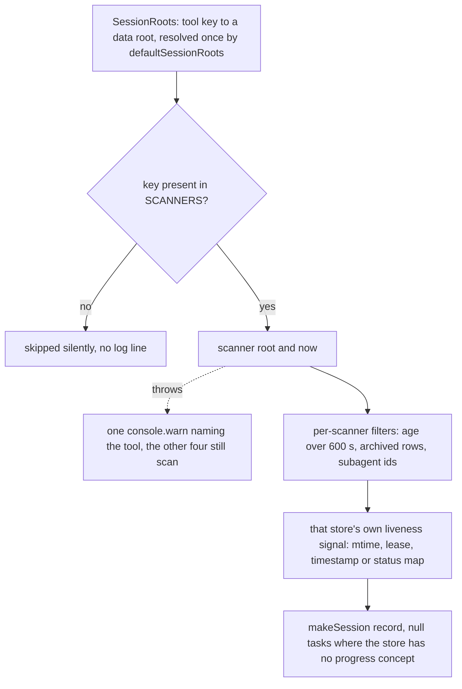

# Integration: the five AI tool on-disk stores

Five AI coding tools keep their session state on this machine in five mutually incompatible places: a JSONL event stream that doubles as a task directory (qoder), two unrelated SQLite schemas (hermes, zcode), a per-session directory tree holding a `state.json` next to an append-only `wire.jsonl` (kimi code), and two flat JSON maps whose conversation bodies stay inside the tool's own private store (kimi work). This page is the store-side reference: where each surface lives, what shape it has, which signal can prove a session is alive, how strong that signal actually is, and what the integration is obliged to do — and not do — against them.

All five are read by `app/src/main/scanners/`, one strictly read-only scanner per tool. None of the five formats is a published interface, and this repository owns none of them. The scanner behaviour built on top of these surfaces is described in [multi-tool session collection](/openwiki/architecture/agent-session-collection.md); the standing read-only posture is a rule of this project, recorded in [privacy and data boundaries](/openwiki/concepts/privacy-and-data-boundaries.md). What follows stays on the store side of that boundary.

## The read contract shared by every format

The roots are spelled out in exactly one function, `defaultSessionRoots(home = os.homedir())`, and injected into the scanners rather than resolved inside them:

```ts
export function defaultSessionRoots(home: string = os.homedir()): SessionRoots {
  return {
    qoder: path.join(home, '.qoder-cn'),
    hermes: path.join(home, 'AppData', 'Local', 'hermes'),
    zcode: path.join(home, '.zcode'),
    kimicode: path.join(home, '.kimi-code'),
    kimiwork: path.join(home, 'AppData', 'Roaming', 'kimi-desktop', 'kimi-agent'),
  }
}
```

<!-- openwiki: broken internal link [/repo://app/src/main/scanners/index.ts#L30-L39] file "/repo://app/src/main/scanners/index.ts" does not exist. Fix the href or restore the target, then delete this comment. -->
<!-- openwiki: broken internal link [/repo://app/src/main/services/sessions.ts#L16-L19] file "/repo://app/src/main/services/sessions.ts" does not exist. Fix the href or restore the target, then delete this comment. -->
The ownership chain is: `defaultSessionRoots()` → `SessionsService` (which resolves `options.roots ?? defaultSessionRoots()` once at construction) → `collectSessions(roots, now)` → one scanner per tool key. Production passes the real Windows layout; tests pass fixture roots, and nothing in a scanner resolves a user path on its own ([index.ts](/repo://app/src/main/scanners/index.ts#L30-L39), [sessions.ts](/repo://app/src/main/services/sessions.ts#L16-L19)). These roots are not configurable through `config.json`.

Obligations that hold for all five surfaces:

<!-- openwiki: broken internal link [/repo://app/src/main/kernel.ts#L55-L55] file "/repo://app/src/main/kernel.ts" does not exist. Fix the href or restore the target, then delete this comment. -->
<!-- openwiki: broken internal link [/repo://app/src/main/kernel.ts#L143-L151] file "/repo://app/src/main/kernel.ts" does not exist. Fix the href or restore the target, then delete this comment. -->
<!-- openwiki: broken internal link [/repo://app/src/main/services/bridge.ts#L98-L102] file "/repo://app/src/main/services/bridge.ts" does not exist. Fix the href or restore the target, then delete this comment. -->
- **Re-read at 1 Hz, no matter how often the panel asks.** `DEFAULT_TICK_MS = 1000` drives one sampling round; the in-process kernel's timer calls `bridge.tick()` → `panelData.refresh()` → `sessions.refresh()` pushes a snapshot, while the production data-plane kernel calls `sessions.refresh()` directly in the utility process ([kernel.ts](/repo://app/src/main/kernel.ts#L55-L55), [kernel.ts](/repo://app/src/main/kernel.ts#L143-L151), [bridge.ts](/repo://app/src/main/services/bridge.ts#L98-L102)). A slow or busy store therefore cannot be re-read faster than about once per second.
<!-- openwiki: broken internal link [/repo://app/src/main/scanners/sqlite.ts#L8-L16] file "/repo://app/src/main/scanners/sqlite.ts" does not exist. Fix the href or restore the target, then delete this comment. -->
<!-- openwiki: broken internal link [/repo://app/src/main/scanners/qoder.ts#L12-L23] file "/repo://app/src/main/scanners/qoder.ts" does not exist. Fix the href or restore the target, then delete this comment. -->
- **Strictly read-only, by mechanism rather than by convention.** JSON stores are read with `readFileSync`, or with `openSync(file, 'r')` plus `readSync` for a tail; no write path exists against any store. SQLite goes through the shared `openReadOnly` helper, which is the only SQLite open in the module ([sqlite.ts](/repo://app/src/main/scanners/sqlite.ts#L8-L16), [qoder.ts](/repo://app/src/main/scanners/qoder.ts#L12-L23)).
<!-- openwiki: broken internal link [/repo://app/src/main/scanners/hermes.ts#L38-L40] file "/repo://app/src/main/scanners/hermes.ts" does not exist. Fix the href or restore the target, then delete this comment. -->
<!-- openwiki: broken internal link [/repo://app/src/main/scanners/zcode.ts#L27-L31] file "/repo://app/src/main/scanners/zcode.ts" does not exist. Fix the href or restore the target, then delete this comment. -->
- **Metadata only.** Both upstream databases carry a `title` column and neither scanner selects it; no message body, todo text or conversation text ever reaches a session record. Details per tool below ([hermes.ts](/repo://app/src/main/scanners/hermes.ts#L38-L40), [zcode.ts](/repo://app/src/main/scanners/zcode.ts#L27-L31)).
<!-- openwiki: broken internal link [/repo://app/src/main/scanners/sqlite.ts#L1-L16] file "/repo://app/src/main/scanners/sqlite.ts" does not exist. Fix the href or restore the target, then delete this comment. -->
<!-- openwiki: broken internal link [/repo://docs/adr/0003-multi-tool-unified-session-model.md#L16-L16] file "/repo://docs/adr/0003-multi-tool-unified-session-model.md" does not exist. Fix the href or restore the target, then delete this comment. -->
- **Fast failure instead of stalling.** `openReadOnly` opens `DatabaseSync` with `{ readOnly: true }` — the `node:sqlite` equivalent of the Python era's `file:…?mode=ro` URI that ADR-0003 names — and then sets `PRAGMA busy_timeout = 500`; if that pragma fails it closes the handle and throws. The read-only open guarantees the panel can never write to a tool's database, and the 500 ms busy timeout makes a database held exclusively by its own writer give up quickly instead of blocking the 1 Hz round ([sqlite.ts](/repo://app/src/main/scanners/sqlite.ts#L1-L16), [ADR-0003](/repo://docs/adr/0003-multi-tool-unified-session-model.md#L16-L16)).
<!-- openwiki: broken internal link [/repo://app/src/main/scanners/index.ts#L41-L54] file "/repo://app/src/main/scanners/index.ts" does not exist. Fix the href or restore the target, then delete this comment. -->
<!-- openwiki: broken internal link [/repo://app/src/main/services/sessions.ts#L21-L29] file "/repo://app/src/main/services/sessions.ts" does not exist. Fix the href or restore the target, then delete this comment. -->
- **Per-tool isolation at the seam.** Each scanner call is wrapped in `try`/`catch`; a failure emits one `console.warn` line naming the tool (`agent-sessions: <tool> 扫描失败，跳过：…`) and the other four tools still scan. A store failure therefore costs one tool's rows, never the round — and if the round as a whole fails, `SessionsService` stores an empty list rather than stale rows ([index.ts](/repo://app/src/main/scanners/index.ts#L41-L54), [sessions.ts](/repo://app/src/main/services/sessions.ts#L21-L29)).
<!-- openwiki: broken internal link [/repo://app/src/main/scanners/index.ts#L22-L28] file "/repo://app/src/main/scanners/index.ts" does not exist. Fix the href or restore the target, then delete this comment. -->
<!-- openwiki: broken internal link [/repo://app/tests/scanners/collect.spec.ts#L127-L131] file "/repo://app/tests/scanners/collect.spec.ts" does not exist. Fix the href or restore the target, then delete this comment. -->
- **Silent on unknown keys.** A root whose key is absent from `SCANNERS` is skipped with no log line at all, so a typo in a root mapping drops a tool invisibly — unlike a store failure, which always logs ([index.ts](/repo://app/src/main/scanners/index.ts#L22-L28), [collect.spec.ts](/repo://app/tests/scanners/collect.spec.ts#L127-L131)).
<!-- openwiki: broken internal link [/repo://app/src/main/scanners/types.ts#L11-L12] file "/repo://app/src/main/scanners/types.ts" does not exist. Fix the href or restore the target, then delete this comment. -->
- **The 10-minute active pool is applied inside each scanner**, not at the seam: every scanner drops rows whose `age` exceeds `ACTIVE_WINDOW = 600.0` on its own, and `RUNNING_WINDOW = 90.0` is the boundary every liveness decision uses, inclusive on the kept side and always evaluated on the unrounded age ([types.ts](/repo://app/src/main/scanners/types.ts#L11-L12)).



Caption: how each private store becomes session records, and where each failure mode exits without touching the other four tools.

## Store surfaces at a glance

| Tool key | Root as derived | Tag | On-disk format | How liveness is judged | Quality tier | Known filters |
|---|---|---|---|---|---|---|
| `qoder` | `~/.qoder-cn` | QD | `projects/<project>/<session id>.jsonl` append log + `tasks/<session id>/*.json` | jsonl mtime within 600 s; the tail record splits `CONFIRM`/`DONE`/`IDLE` | heuristic, but the only source of `CONFIRM` | mtime older than 600 s |
| `hermes` | `~/AppData/Local/hermes` | HM | SQLite `state.db` (`sessions`) + `runtime/active_sessions.json` lease | session id in the lease, or `end_reason IS NULL` and activity within 90 s | strongest: a lease cross-checked against an explicit end reason | `archived` truthy |
| `zcode` | `~/.zcode` | ZC | SQLite `cli/db/db.sqlite` (`session`, `todo`) | explicit millisecond `time_updated` | strong: explicit timestamp plus an archive flag | `time_archived` non-null; ids prefixed `sess_subagent_` |
| `kimicode` | `~/.kimi-code` | KC | `sessions/<workspace>/<session>/state.json` + `agents/main/wire.jsonl` | the newer of the two file mtimes | coarsest: pure file mtime | 600 s window only |
| `kimiwork` | `~/AppData/Roaming/kimi-desktop/kimi-agent` | KW | `conversation-statuses.json` + `conversation-context-usage.json` | per-conversation `updatedAt` from the usage map | explicit status, coarse timing, and deliberately title-less | needs an entry in both maps; `updatedAt` must be a non-empty string |

<!-- openwiki: broken internal link [/repo://docs/adr/0003-multi-tool-unified-session-model.md#L12-L15] file "/repo://docs/adr/0003-multi-tool-unified-session-model.md" does not exist. Fix the href or restore the target, then delete this comment. -->
<!-- openwiki: broken internal link [/repo://app/src/renderer/cards/sessions/card.ts#L7-L7] file "/repo://app/src/renderer/cards/sessions/card.ts" does not exist. Fix the href or restore the target, then delete this comment. -->
<!-- openwiki: broken internal link [/repo://app/config.json#L27-L59] file "/repo://app/config.json" does not exist. Fix the href or restore the target, then delete this comment. -->
The tiering is the accepted consequence of five signals of different strength ([ADR-0003](/repo://docs/adr/0003-multi-tool-unified-session-model.md#L12-L15)), and two distortions follow from it by design: `CONFIRM` can only ever be produced by qoder, and kimi work rows carry no project at all. The tool key above is not just a store label — it is the join key used by `SCANNERS`, by `config.json`'s `tools` section (the session row's click-through) and by the card's `TOOL_TAGS` map ([card.ts](/repo://app/src/renderer/cards/sessions/card.ts#L7-L7), [config.json](/repo://app/config.json#L27-L59)).

## qoder — a JSONL append log plus a task directory

```
~/.qoder-cn/
  projects/
    <project dir>/
      <session id>.jsonl      # one JSON object per line, appended while the session runs
  tasks/
    <session id>/
      <task id>.json        # {"id", "subject", "status"}
```

<!-- openwiki: broken internal link [/repo://app/src/main/scanners/qoder.ts#L11-L56] file "/repo://app/src/main/scanners/qoder.ts" does not exist. Fix the href or restore the target, then delete this comment. -->
<!-- openwiki: broken internal link [/repo://app/src/main/scanners/qoder.ts#L65-L86] file "/repo://app/src/main/scanners/qoder.ts" does not exist. Fix the href or restore the target, then delete this comment. -->
A jsonl line carries `type` (`assistant` / `user`), a `message.content` list whose last element may be a `tool_use` block, and sometimes `cwd`. Two bounded tail reads serve everything: `sessionLast` reads at most 131072 bytes for the state classification and `projectName` at most 65536 bytes for `cwd`, so a growing file is treated as an unbounded log that may be read from its end at any time ([qoder.ts](/repo://app/src/main/scanners/qoder.ts#L11-L56), [qoder.ts](/repo://app/src/main/scanners/qoder.ts#L65-L86)).

<!-- openwiki: broken internal link [/repo://app/src/main/scanners/qoder.ts#L143-L155] file "/repo://app/src/main/scanners/qoder.ts" does not exist. Fix the href or restore the target, then delete this comment. -->
- Session id is the jsonl filename stem (`.jsonl` stripped case-insensitively); `age` is `now - st_mtime`; rows older than 600 s never enter the list ([qoder.ts](/repo://app/src/main/scanners/qoder.ts#L143-L155)).
<!-- openwiki: broken internal link [/repo://app/src/main/scanners/qoder.ts#L81-L85] file "/repo://app/src/main/scanners/qoder.ts" does not exist. Fix the href or restore the target, then delete this comment. -->
- `project` is the basename of the newest `cwd` found in the tail, falling back to the jsonl's parent directory name ([qoder.ts](/repo://app/src/main/scanners/qoder.ts#L81-L85)).
<!-- openwiki: broken internal link [/repo://app/src/main/scanners/qoder.ts#L89-L115] file "/repo://app/src/main/scanners/qoder.ts" does not exist. Fix the href or restore the target, then delete this comment. -->
- Task progress comes from `tasks/<session id>/*.json`: `total` counts the files that parse as JSON, `done` counts `status === "completed"`, and only the `in_progress` entries are recognised as a third value. `taskStats` also returns the subject of the first `in_progress` task, which currently has no consumer ([qoder.ts](/repo://app/src/main/scanners/qoder.ts#L89-L115)).
<!-- openwiki: broken internal link [/repo://app/src/main/scanners/qoder.ts#L58-L63] file "/repo://app/src/main/scanners/qoder.ts" does not exist. Fix the href or restore the target, then delete this comment. -->
- Liveness is the mtime plus the tail: within 90 s the state is `RUN` regardless of the record kind; beyond it an assistant record ending in `tool_use` is `CONFIRM`, an assistant record is `DONE`, anything else (including a `user` record or nothing recognisable) is `IDLE` ([qoder.ts](/repo://app/src/main/scanners/qoder.ts#L58-L63)).

<!-- openwiki: broken internal link [/repo://app/tests/scanners/collect.spec.ts#L149-L159] file "/repo://app/tests/scanners/collect.spec.ts" does not exist. Fix the href or restore the target, then delete this comment. -->
**What degrades.** A missing `projects/` directory yields no rows and no error; a project subdirectory that cannot be listed is skipped; a file whose `stat` fails is skipped; malformed lines are skipped line by line. A wholly unparseable jsonl still yields a session — its mtime put it in the list — with an `IDLE` state and the directory-name project ([collect.spec.ts](/repo://app/tests/scanners/collect.spec.ts#L149-L159)). A missing or unreadable `tasks/` directory yields `0/0`, and task files that fail to parse are counted in neither number.

**What the format cannot support.** Nothing in the log proves a session ended other than the last record's shape, so `DONE` here means "the newest line was assistant output", not "the tool closed the session".

## hermes — SQLite sessions plus an active lease file

```
~/AppData/Local/hermes/
  state.db
  runtime/
    active_sessions.json        # {"entries": [{"lease_id", "session_id", "pid", "updated_at"}]}
```

<!-- openwiki: broken internal link [/repo://app/src/main/scanners/hermes.ts#L38-L40] file "/repo://app/src/main/scanners/hermes.ts" does not exist. Fix the href or restore the target, then delete this comment. -->
<!-- openwiki: broken internal link [/repo://app/tests/scanners/fixtures.ts#L47-L57] file "/repo://app/tests/scanners/fixtures.ts" does not exist. Fix the href or restore the target, then delete this comment. -->
The `sessions` query selects `id, cwd, last_activity_at, started_at, end_reason, archived`. `title` and `ended_at` exist upstream — the fixture schema proves it — but are never selected, so nothing textual from this store reaches a row ([hermes.ts](/repo://app/src/main/scanners/hermes.ts#L38-L40), [fixtures.ts](/repo://app/tests/scanners/fixtures.ts#L47-L57)).

Liveness is the cross-check that gives hermes the strongest tier:

<!-- openwiki: broken internal link [/repo://app/src/main/scanners/hermes.ts#L9-L22] file "/repo://app/src/main/scanners/hermes.ts" does not exist. Fix the href or restore the target, then delete this comment. -->
<!-- openwiki: broken internal link [/repo://app/tests/scanners/hermes.spec.ts#L107-L116] file "/repo://app/tests/scanners/hermes.spec.ts" does not exist. Fix the href or restore the target, then delete this comment. -->
- The lease file is read **before** the database and independently: only `entries[].session_id` is used, and the whole read sits in its own `try` whose `catch` returns an empty set, so a broken lease file degrades to "no leases" while the tool still scans ([hermes.ts](/repo://app/src/main/scanners/hermes.ts#L9-L22), [hermes.spec.ts](/repo://app/tests/scanners/hermes.spec.ts#L107-L116)).
<!-- openwiki: broken internal link [/repo://app/src/main/scanners/hermes.ts#L45-L50] file "/repo://app/src/main/scanners/hermes.ts" does not exist. Fix the href or restore the target, then delete this comment. -->
- `age` is `now - (last_activity_at ?? started_at)`; a row where both are null is dropped, and a value that is neither null nor a number throws, which skips the whole tool ([hermes.ts](/repo://app/src/main/scanners/hermes.ts#L45-L50)).
<!-- openwiki: broken internal link [/repo://app/src/main/scanners/hermes.ts#L52-L54] file "/repo://app/src/main/scanners/hermes.ts" does not exist. Fix the href or restore the target, then delete this comment. -->
- `running` is true when the session id appears in the lease set **or** when `end_reason` is null and `age <= 90`. A lease therefore keeps a quiet long-running session at `RUN` ([hermes.ts](/repo://app/src/main/scanners/hermes.ts#L52-L54)).
<!-- openwiki: broken internal link [/repo://app/tests/scanners/hermes.spec.ts#L63-L75] file "/repo://app/tests/scanners/hermes.spec.ts" does not exist. Fix the href or restore the target, then delete this comment. -->
- State is `RUN` when running, otherwise `IDLE` for an unended session and `DONE` whenever an end reason is set — an ended session is `DONE` even if it was touched seconds ago ([hermes.spec.ts](/repo://app/tests/scanners/hermes.spec.ts#L63-L75)).
<!-- openwiki: broken internal link [/repo://app/tests/scanners/hermes.spec.ts#L77-L98] file "/repo://app/tests/scanners/hermes.spec.ts" does not exist. Fix the href or restore the target, then delete this comment. -->
- Archived rows (`archived` truthy) never enter the list, rows older than 600 s are dropped, and hermes exposes no task progress at all (`tasks_done`/`tasks_total` stay `null`) ([hermes.spec.ts](/repo://app/tests/scanners/hermes.spec.ts#L77-L98)).

**What the format cannot support.** There is no message stream to read, so `CONFIRM` is unreachable here; and the lease is a liveness hint only — its `lease_id`, `pid` and `updated_at` fields are ignored.

## zcode — one database, a session table and a todo table

```
~/.zcode/
  cli/
    db/
      db.sqlite                 # tables: session, todo
```

Instrumented shapes (also the fixture schema):

- `session(id TEXT PRIMARY KEY, directory, title, time_created, time_updated, time_archived)`
- `todo(session_id, content, status, position, PRIMARY KEY (session_id, position))`

<!-- openwiki: broken internal link [/repo://app/src/main/scanners/zcode.ts#L22-L34] file "/repo://app/src/main/scanners/zcode.ts" does not exist. Fix the href or restore the target, then delete this comment. -->
<!-- openwiki: broken internal link [/repo://app/tests/scanners/fixtures.ts#L100-L115] file "/repo://app/tests/scanners/fixtures.ts" does not exist. Fix the href or restore the target, then delete this comment. -->
The scanner selects `id, directory, time_updated, time_archived` from `session` — `title` exists and is not selected — and one grouped query over `todo`: `SELECT session_id AS session_id, SUM(status = 'completed') AS done, COUNT(*) AS total FROM todo GROUP BY session_id` ([zcode.ts](/repo://app/src/main/scanners/zcode.ts#L22-L34), [fixtures.ts](/repo://app/tests/scanners/fixtures.ts#L100-L115)).

<!-- openwiki: broken internal link [/repo://app/src/main/scanners/zcode.ts#L48-L50] file "/repo://app/src/main/scanners/zcode.ts" does not exist. Fix the href or restore the target, then delete this comment. -->
- `time_updated` is a **millisecond** epoch, converted as `now - time_updated / 1000`; `age > 600` drops the row ([zcode.ts](/repo://app/src/main/scanners/zcode.ts#L48-L50)).
<!-- openwiki: broken internal link [/repo://app/src/main/scanners/zcode.ts#L51-L54] file "/repo://app/src/main/scanners/zcode.ts" does not exist. Fix the href or restore the target, then delete this comment. -->
- Liveness is entirely that timestamp: within 90 s the state is `RUN`, otherwise `DONE`. zcode never emits `IDLE` or `CONFIRM` ([zcode.ts](/repo://app/src/main/scanners/zcode.ts#L51-L54)).
<!-- openwiki: broken internal link [/repo://app/src/main/scanners/zcode.ts#L35-L53] file "/repo://app/src/main/scanners/zcode.ts" does not exist. Fix the href or restore the target, then delete this comment. -->
<!-- openwiki: broken internal link [/repo://app/tests/scanners/zcode.spec.ts#L54-L72] file "/repo://app/tests/scanners/zcode.spec.ts" does not exist. Fix the href or restore the target, then delete this comment. -->
- Progress comes from the grouped counts, so a session with no todos reports `(0, 0)` — a real "no tasks yet" rather than the `null` used by tools with no progress concept. `SUM` over a group whose statuses are all null yields `null`, so `tasks_done` can be null while `tasks_total` is positive ([zcode.ts](/repo://app/src/main/scanners/zcode.ts#L35-L53), [zcode.spec.ts](/repo://app/tests/scanners/zcode.spec.ts#L54-L72)).
<!-- openwiki: broken internal link [/repo://app/src/main/scanners/zcode.ts#L7-L7] file "/repo://app/src/main/scanners/zcode.ts" does not exist. Fix the href or restore the target, then delete this comment. -->
<!-- openwiki: broken internal link [/repo://app/src/main/scanners/zcode.ts#L44-L47] file "/repo://app/src/main/scanners/zcode.ts" does not exist. Fix the href or restore the target, then delete this comment. -->
<!-- openwiki: broken internal link [/repo://.scratch/agent-deck-multi-sessions/spec.md#L65-L65] file "/repo://.scratch/agent-deck-multi-sessions/spec.md" does not exist. Fix the href or restore the target, then delete this comment. -->
- Three filters live inside the scanner: rows with a non-null `time_archived`, rows with a null `time_updated` (which cannot be aged), and ids starting with `ZCODE_SUBAGENT_PREFIX = 'sess_subagent_'` are dropped. The prefix filter exists because real subagent rows swamped the list at acceptance time; it is a convention extracted from observed data, not a published upstream concept ([zcode.ts](/repo://app/src/main/scanners/zcode.ts#L7-L7), [zcode.ts](/repo://app/src/main/scanners/zcode.ts#L44-L47), [spec.md](/repo://.scratch/agent-deck-multi-sessions/spec.md#L65-L65)).

<!-- openwiki: broken internal link [/repo://app/tests/scanners/zcode.spec.ts#L97-L109] file "/repo://app/tests/scanners/zcode.spec.ts" does not exist. Fix the href or restore the target, then delete this comment. -->
<!-- openwiki: broken internal link [/repo://.scratch/agent-deck-multi-sessions/issues/03-zcode-scanner.md#L21-L21] file "/repo://.scratch/agent-deck-multi-sessions/issues/03-zcode-scanner.md" does not exist. Fix the href or restore the target, then delete this comment. -->
**What degrades.** A missing database throws as the helper opens it and skips the tool; a file that is not a SQLite database fails on the first statement that touches it and also skips the tool; a `time_updated` that is neither null nor a number skips the tool. All three are covered by tests ([zcode.spec.ts](/repo://app/tests/scanners/zcode.spec.ts#L97-L109)). With WAL mode — which zcode uses — a read-only connection is not blocked by a writer transaction, so the 500 ms busy timeout is the backstop for the extreme case rather than the everyday path ([03-zcode-scanner.md](/repo://.scratch/agent-deck-multi-sessions/issues/03-zcode-scanner.md#L21-L21)).

## kimi code — a per-session directory tree

```
~/.kimi-code/
  sessions/
    <workspace dir>/
      <session id>/
        state.json              # {"createdAt", "updatedAt", "title", "workDir"}
        agents/
          main/
            wire.jsonl          # append log of config/mcp style events
```

<!-- openwiki: broken internal link [/repo://app/src/main/scanners/kimicode.ts#L32-L46] file "/repo://app/src/main/scanners/kimicode.ts" does not exist. Fix the href or restore the target, then delete this comment. -->
<!-- openwiki: broken internal link [/repo://app/tests/scanners/fixtures.ts#L143-L165] file "/repo://app/tests/scanners/fixtures.ts" does not exist. Fix the href or restore the target, then delete this comment. -->
`state.json` is the mandatory file and the only source of identity: `project` is the last path segment of its `workDir` key, and an absent `workDir` legitimately produces an empty project rather than an error ([kimicode.ts](/repo://app/src/main/scanners/kimicode.ts#L32-L46), [fixtures.ts](/repo://app/tests/scanners/fixtures.ts#L143-L165)).

<!-- openwiki: broken internal link [/repo://app/src/main/scanners/kimicode.ts#L43-L46] file "/repo://app/src/main/scanners/kimicode.ts" does not exist. Fix the href or restore the target, then delete this comment. -->
<!-- openwiki: broken internal link [/repo://app/tests/scanners/kimicode.spec.ts#L42-L56] file "/repo://app/tests/scanners/kimicode.spec.ts" does not exist. Fix the href or restore the target, then delete this comment. -->
`age` is taken from the **newer** of the two file mtimes, because `wire.jsonl` is written as the session works while `state.json` may have been written earlier; the `updatedAt` field inside `state.json` is not used for the window at all. Within 90 s the state is `RUN`; beyond it the session is `DONE` ([kimicode.ts](/repo://app/src/main/scanners/kimicode.ts#L43-L46), [kimicode.spec.ts](/repo://app/tests/scanners/kimicode.spec.ts#L42-L56)).

<!-- openwiki: broken internal link [/repo://app/src/main/scanners/kimicode.ts#L32-L38] file "/repo://app/src/main/scanners/kimicode.ts" does not exist. Fix the href or restore the target, then delete this comment. -->
<!-- openwiki: broken internal link [/repo://app/tests/scanners/kimicode.spec.ts#L66-L89] file "/repo://app/tests/scanners/kimicode.spec.ts" does not exist. Fix the href or restore the target, then delete this comment. -->
Degradation is finer-grained here than anywhere else: an unreadable or unparseable `state.json` skips only that session while sibling sessions of the same tool still appear, and a missing `sessions/` directory simply yields an empty list ([kimicode.ts](/repo://app/src/main/scanners/kimicode.ts#L32-L38), [kimicode.spec.ts](/repo://app/tests/scanners/kimicode.spec.ts#L66-L89)).

Three boundaries worth knowing:

<!-- openwiki: broken internal link [/repo://.scratch/agent-deck-multi-sessions/spec.md#L39-L39] file "/repo://.scratch/agent-deck-multi-sessions/spec.md" does not exist. Fix the href or restore the target, then delete this comment. -->
- Only the migrated `~/.kimi-code` tree is read; the legacy `.kimi` directory is deliberately out of scope ([spec.md](/repo://.scratch/agent-deck-multi-sessions/spec.md#L39-L39)).
<!-- openwiki: broken internal link [/repo://.scratch/agent-deck-multi-sessions/issues/04-kimicode-scanner.md#L19-L21] file "/repo://.scratch/agent-deck-multi-sessions/issues/04-kimicode-scanner.md" does not exist. Fix the href or restore the target, then delete this comment. -->
- The tail of `wire.jsonl` carries config/mcp events with no `user`/`assistant` role signal, so the planned "rough `DONE`/`IDLE` split from the last record" was not implementable; every non-`RUN` kimi code session lands on `DONE`, exactly like zcode, and `CONFIRM` is unreachable ([04-kimicode-scanner.md](/repo://.scratch/agent-deck-multi-sessions/issues/04-kimicode-scanner.md#L19-L21)).
<!-- openwiki: broken internal link [/repo://app/src/main/scanners/kimicode.ts#L39-L42] file "/repo://app/src/main/scanners/kimicode.ts" does not exist. Fix the href or restore the target, then delete this comment. -->
- A `state.json` that parses into something that is not an object (an array, a string, `null`) throws instead of skipping one session, so that pathological shape costs the whole tool ([kimicode.ts](/repo://app/src/main/scanners/kimicode.ts#L39-L42)). Its `title` key is present upstream but is never read.

## kimi work — two flat JSON maps, deliberately title-less

```
~/AppData/Roaming/kimi-desktop/kimi-agent/
  conversation-statuses.json        # { "<key>": "<status string>" }
  conversation-context-usage.json   # { "<key>": {"contextUsage": float, "updatedAt": "<ISO-8601 Z>"} }
```

<!-- openwiki: broken internal link [/repo://app/src/main/scanners/kimiwork.ts#L24-L33] file "/repo://app/src/main/scanners/kimiwork.ts" does not exist. Fix the href or restore the target, then delete this comment. -->
<!-- openwiki: broken internal link [/repo://app/tests/scanners/kimiwork.spec.ts#L55-L67] file "/repo://app/tests/scanners/kimiwork.spec.ts" does not exist. Fix the href or restore the target, then delete this comment. -->
Keys are composite conversation identifiers of the form `agent:main:main:conversation:<uuid>`; the session id shown is the last colon-separated segment, i.e. the uuid. The status map is the iteration source, so a conversation appears only if it has an entry in *both* maps and its usage entry carries a usable `updatedAt`; an entry present in only one map is invisible ([kimiwork.ts](/repo://app/src/main/scanners/kimiwork.ts#L24-L33), [kimiwork.spec.ts](/repo://app/tests/scanners/kimiwork.spec.ts#L55-L67)).

<!-- openwiki: broken internal link [/repo://docs/adr/0003-multi-tool-unified-session-model.md#L7-L7] file "/repo://docs/adr/0003-multi-tool-unified-session-model.md" does not exist. Fix the href or restore the target, then delete this comment. -->
This is the degradation case recorded in ADR-0003: the conversation text is locked inside the tool's own private store (LevelDB/IndexedDB class of storage), so parsing it was rejected as expensive and version-fragile and the row carries only "tool tag + state" ([ADR-0003](/repo://docs/adr/0003-multi-tool-unified-session-model.md#L7-L7)).

Within that:

<!-- openwiki: broken internal link [/repo://app/src/main/scanners/kimiwork.ts#L29-L30] file "/repo://app/src/main/scanners/kimiwork.ts" does not exist. Fix the href or restore the target, then delete this comment. -->
- `age` comes from the per-conversation `updatedAt` (`new Date(iso).getTime() / 1000`), not from the file mtime — so one fresh conversation cannot promote every older conversation to `RUN` ([kimiwork.ts](/repo://app/src/main/scanners/kimiwork.ts#L29-L30)).
<!-- openwiki: broken internal link [/repo://app/src/main/scanners/kimiwork.ts#L31-L32] file "/repo://app/src/main/scanners/kimiwork.ts" does not exist. Fix the href or restore the target, then delete this comment. -->
<!-- openwiki: broken internal link [/repo://app/tests/scanners/kimiwork.spec.ts#L43-L53] file "/repo://app/tests/scanners/kimiwork.spec.ts" does not exist. Fix the href or restore the target, then delete this comment. -->
- State is `RUN` within 90 s; beyond it `DONE` only when the status string is exactly `completed`; any unrecognised status falls back to `IDLE` rather than raising ([kimiwork.ts](/repo://app/src/main/scanners/kimiwork.ts#L31-L32), [kimiwork.spec.ts](/repo://app/tests/scanners/kimiwork.spec.ts#L43-L53)).
<!-- openwiki: broken internal link [/repo://app/tests/scanners/kimiwork.spec.ts#L32-L41] file "/repo://app/tests/scanners/kimiwork.spec.ts" does not exist. Fix the href or restore the target, then delete this comment. -->
- `project` is always the empty string and task progress is always `null` ([kimiwork.spec.ts](/repo://app/tests/scanners/kimiwork.spec.ts#L32-L41)).

<!-- openwiki: broken internal link [/repo://app/src/main/scanners/kimiwork.ts#L10-L23] file "/repo://app/src/main/scanners/kimiwork.ts" does not exist. Fix the href or restore the target, then delete this comment. -->
<!-- openwiki: broken internal link [/repo://app/tests/scanners/kimiwork.spec.ts#L75-L88] file "/repo://app/tests/scanners/kimiwork.spec.ts" does not exist. Fix the href or restore the target, then delete this comment. -->
**What degrades.** Both files are parsed before any filtering, so a missing or corrupt file skips the **whole tool**; so does an `updatedAt` that does not parse as a date, because `epochFromIso` throws on a `NaN` timestamp ([kimiwork.ts](/repo://app/src/main/scanners/kimiwork.ts#L10-L23), [kimiwork.spec.ts](/repo://app/tests/scanners/kimiwork.spec.ts#L75-L88)). kimi work can never emit `CONFIRM`, and its rows never carry a name.

## Version fragility: these are observations, not contracts

None of the five formats is an external contract this repository owns. Every schema above was observed on this machine at implementation and acceptance time, and the fixtures encode the observation rather than a guarantee:

| Surface | Observation, not contract |
|---|---|
<!-- openwiki: broken internal link [/repo://app/src/main/scanners/hermes.ts#L52-L54] file "/repo://app/src/main/scanners/hermes.ts" does not exist. Fix the href or restore the target, then delete this comment. -->
<!-- openwiki: broken internal link [/repo://.scratch/agent-deck-multi-sessions/spec.md#L67-L67] file "/repo://.scratch/agent-deck-multi-sessions/spec.md" does not exist. Fix the href or restore the target, then delete this comment. -->
| hermes `end_reason` | Values seen: `NULL`, `cli_close`, `startup_orphan_reap`, `ws_orphan_reap`. The scanner tests the column only for `NULL`, which is what keeps that vocabulary from mattering ([hermes.ts](/repo://app/src/main/scanners/hermes.ts#L52-L54), [spec.md](/repo://.scratch/agent-deck-multi-sessions/spec.md#L67-L67)) |
| hermes lease file | `entries[].session_id` is the only field used; `lease_id`, `pid` and `updated_at` are ignored — a renamed field silently means "no leases" |
| hermes `archived` / zcode `time_archived` | Archive state is tested by truthiness alone: `0`, `NULL` and an empty string all mean "not archived", any real value means "archived". A store that switched to a non-null sentinel for "not archived" would empty the list |
<!-- openwiki: broken internal link [/repo://app/src/main/scanners/zcode.ts#L30-L31] file "/repo://app/src/main/scanners/zcode.ts" does not exist. Fix the href or restore the target, then delete this comment. -->
| zcode `todo.status` | Values seen: `pending`, `in_progress`, `completed`. Only the literal `completed` is counted, so a renamed status silently reduces `tasks_done` to `null`/`0` ([zcode.ts](/repo://app/src/main/scanners/zcode.ts#L30-L31)) |
| zcode subagent ids | `sess_subagent_` is an id convention extracted from real data during acceptance, not a published prefix |
| kimi code `workDir` / `updatedAt` | `workDir` may be absent (migrated sessions), producing an empty project; the inner `updatedAt` is never used for the window |
<!-- openwiki: broken internal link [/repo://app/src/main/scanners/kimiwork.ts#L32-L32] file "/repo://app/src/main/scanners/kimiwork.ts" does not exist. Fix the href or restore the target, then delete this comment. -->
<!-- openwiki: broken internal link [/repo://.scratch/agent-deck-multi-sessions/spec.md#L67-L67] file "/repo://.scratch/agent-deck-multi-sessions/spec.md" does not exist. Fix the href or restore the target, then delete this comment. -->
| kimi work statuses | All seven observed conversations were `completed`, so that is the only verified mapping; everything else is defensive `IDLE` ([kimiwork.ts](/repo://app/src/main/scanners/kimiwork.ts#L32-L32), [spec.md](/repo://.scratch/agent-deck-multi-sessions/spec.md#L67-L67)) |
| kimi work key shape | `agent:main:main:conversation:<uuid>` is parsed only by taking everything after the last colon — no field of the key is interpreted |
| qoder jsonl record shape | `type`, `message.content` and `cwd` are read by name; a renamed field degrades silently to `IDLE` with a fallback project rather than raising |

<!-- openwiki: broken internal link [/repo://docs/adr/0003-multi-tool-unified-session-model.md#L16-L16] file "/repo://docs/adr/0003-multi-tool-unified-session-model.md" does not exist. Fix the href or restore the target, then delete this comment. -->
<!-- openwiki: broken internal link [/repo://app/src/main/scanners/index.ts#L41-L54] file "/repo://app/src/main/scanners/index.ts" does not exist. Fix the href or restore the target, then delete this comment. -->
The mitigation is structural rather than defensive parsing: because a scanner that raises is converted into one log line plus a skipped tool, an upstream format change surfaces as a tool quietly missing from the session list, never as a broken panel. That is the trade ADR-0003 records — availability over fault visibility ([ADR-0003](/repo://docs/adr/0003-multi-tool-unified-session-model.md#L16-L16), [index.ts](/repo://app/src/main/scanners/index.ts#L41-L54)). A silent-`IDLE` drift inside qoder is the one case that does *not* produce a log line, because the tail parser treats every unrecognisable record as "no signal".

Operational reflex when a tool's rows disappear or look wrong: open the store by hand, read-only, and compare it against the shapes above.

```
sqlite3 "file:%LOCALAPPDATA%\hermes\state.db?mode=ro" "SELECT id, cwd, last_activity_at, started_at, end_reason, archived FROM sessions;"
sqlite3 "file:%USERPROFILE%\.zcode\cli\db\db.sqlite?mode=ro" "SELECT id, directory, time_updated, time_archived FROM session;"
```

If a column, file or key has moved, the fix belongs in the scanner and its fixture — not in a tolerance layer that hides the drift.

## Fixtures mirror these layouts

<!-- openwiki: broken internal link [/repo://app/tests/scanners/fixtures.ts#L1-L8] file "/repo://app/tests/scanners/fixtures.ts" does not exist. Fix the href or restore the target, then delete this comment. -->
Each scanner is tested against a temporary directory or database that reproduces the layout above, with an injected `now` so window boundaries need no sleeping; no test touches a real user store. `tests/scanners/fixtures.ts` is the shared builder of those fake roots ([fixtures.ts](/repo://app/tests/scanners/fixtures.ts#L1-L8)).

| Store | Fixture | What it reproduces |
|---|---|---|
<!-- openwiki: broken internal link [/repo://app/tests/scanners/fixtures.ts#L24-L45] file "/repo://app/tests/scanners/fixtures.ts" does not exist. Fix the href or restore the target, then delete this comment. -->
| qoder | `QoderFx` ([fixtures.ts](/repo://app/tests/scanners/fixtures.ts#L24-L45)) | `projects/<proj>/<sid>.jsonl` written from synthetic records with `fs.utimesSync`, plus `tasks/<sid>/<task id>.json` |
<!-- openwiki: broken internal link [/repo://app/tests/scanners/fixtures.ts#L47-L98] file "/repo://app/tests/scanners/fixtures.ts" does not exist. Fix the href or restore the target, then delete this comment. -->
| hermes | `HermesFx` ([fixtures.ts](/repo://app/tests/scanners/fixtures.ts#L47-L98)) | a real `node:sqlite` `sessions` table (including the unused `title` / `ended_at` columns) and `runtime/active_sessions.json` with `entries[].session_id` |
<!-- openwiki: broken internal link [/repo://app/tests/scanners/fixtures.ts#L100-L141] file "/repo://app/tests/scanners/fixtures.ts" does not exist. Fix the href or restore the target, then delete this comment. -->
| zcode | `ZcodeFx` ([fixtures.ts](/repo://app/tests/scanners/fixtures.ts#L100-L141)) | `cli/db/db.sqlite` with the `session` + `todo` DDL, millisecond timestamps and todo statuses |
<!-- openwiki: broken internal link [/repo://app/tests/scanners/fixtures.ts#L143-L165] file "/repo://app/tests/scanners/fixtures.ts" does not exist. Fix the href or restore the target, then delete this comment. -->
| kimi code | `KimiCodeFx` ([fixtures.ts](/repo://app/tests/scanners/fixtures.ts#L143-L165)) | `sessions/wd_an-w_hash/<sid>/state.json` plus `agents/main/wire.jsonl`, with an independent `utime` per file |
<!-- openwiki: broken internal link [/repo://app/tests/scanners/fixtures.ts#L167-L197] file "/repo://app/tests/scanners/fixtures.ts" does not exist. Fix the href or restore the target, then delete this comment. -->
| kimi work | `KimiWorkFx` ([fixtures.ts](/repo://app/tests/scanners/fixtures.ts#L167-L197)) | both maps and the `agent:main:main:conversation:<uuid>` key template, with helpers to drop either side of the intersection |

Because the fixtures are the executable statement of these layouts, a store-format change must land as a scanner edit plus its fixture edit **and** an update to this page — a fixture will not fail merely because upstream moved a file the scanner stopped looking for.

## Adding or changing a tool's store

<!-- openwiki: broken internal link [/repo://app/src/main/scanners/index.ts#L41-L54] file "/repo://app/src/main/scanners/index.ts" does not exist. Fix the href or restore the target, then delete this comment. -->
<!-- openwiki: broken internal link [/repo://docs/adr/0003-multi-tool-unified-session-model.md#L3-L3] file "/repo://docs/adr/0003-multi-tool-unified-session-model.md" does not exist. Fix the href or restore the target, then delete this comment. -->
Extending the integration is one scanner plus a registry entry, not a change to the unified model: the four-state vocabulary, the two windows, the `SessionInfo` record shape, the age sort and the per-tool failure isolation are all applied by the seam, so a new store inherits them unchanged ([index.ts](/repo://app/src/main/scanners/index.ts#L41-L54), [ADR-0003](/repo://docs/adr/0003-multi-tool-unified-session-model.md#L3-L3)).

<!-- openwiki: broken internal link [/repo://app/src/main/scanners/types.ts#L14-L42] file "/repo://app/src/main/scanners/types.ts" does not exist. Fix the href or restore the target, then delete this comment. -->
1. Write a scanner with the `Scanner = (root: string, now: number) => SessionInfo[]` signature returning `makeSession(...)` records, and keep every store read inside it ([types.ts](/repo://app/src/main/scanners/types.ts#L14-L42)).
<!-- openwiki: broken internal link [/repo://app/src/main/scanners/index.ts#L22-L28] file "/repo://app/src/main/scanners/index.ts" does not exist. Fix the href or restore the target, then delete this comment. -->
2. Register it in `SCANNERS` under the **exact** key used in the roots mapping; a mismatch silently drops the tool with no log line ([index.ts](/repo://app/src/main/scanners/index.ts#L22-L28)).
<!-- openwiki: broken internal link [/repo://app/src/main/scanners/index.ts#L30-L39] file "/repo://app/src/main/scanners/index.ts" does not exist. Fix the href or restore the target, then delete this comment. -->
3. Add the root to `defaultSessionRoots()` in `scanners/index.ts`; that function is the only place production paths are spelled out ([index.ts](/repo://app/src/main/scanners/index.ts#L30-L39)).
4. Add a fixture under `tests/scanners/` that mirrors the new on-disk layout, plus a spec that drives `collectSessions` with that root and a fixed `now`.
<!-- openwiki: broken internal link [/repo://app/src/renderer/cards/sessions/card.ts#L7-L7] file "/repo://app/src/renderer/cards/sessions/card.ts" does not exist. Fix the href or restore the target, then delete this comment. -->
<!-- openwiki: broken internal link [/repo://app/src/main/focus/plan.ts#L54-L70] file "/repo://app/src/main/focus/plan.ts" does not exist. Fix the href or restore the target, then delete this comment. -->
5. For the row to be usable end to end, the same key needs a two-letter entry in the card's `TOOL_TAGS` map (unknown keys render `??`) and a `config.json` `tools` entry for click-through; a missing tool mapping degrades the click silently rather than erroring ([card.ts](/repo://app/src/renderer/cards/sessions/card.ts#L7-L7), [plan.ts](/repo://app/src/main/focus/plan.ts#L54-L70)).
6. Keep the open read-only, keep each `SELECT` metadata-only, and keep failures inside the scanner so the other four tools are unaffected.

The end-to-end path from a store row to a session row on the panel is covered in [session row to tool window](/openwiki/workflows/session-row-to-tool-window.md); the seam contract itself is in [multi-tool session collection](/openwiki/architecture/agent-session-collection.md).
