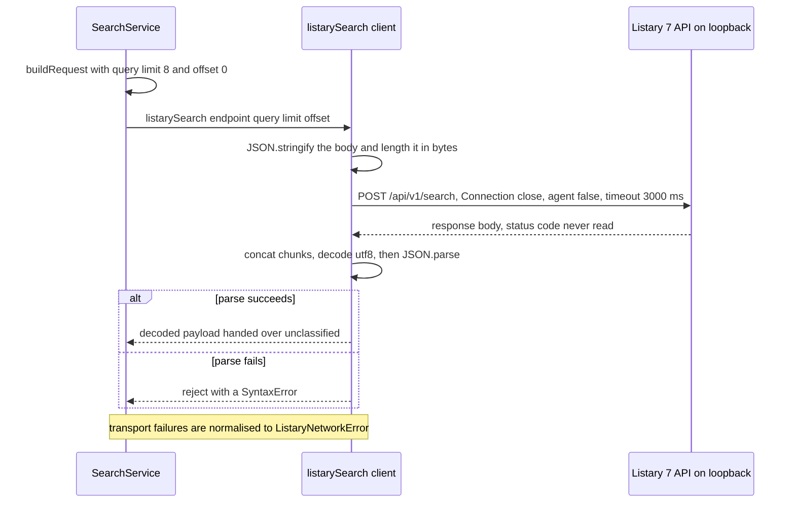
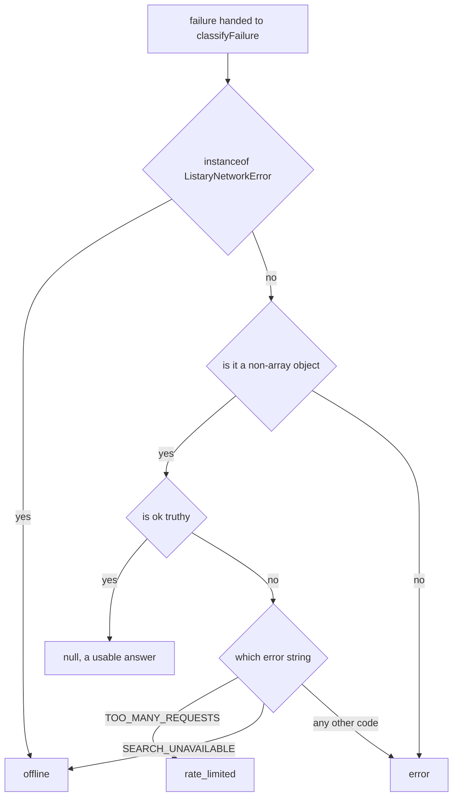

# Integration: Listary 7 local HTTP search API

<!-- openwiki: broken internal link [/repo://app/src/main/search/engine.ts#L1-L21] file "/repo://app/src/main/search/engine.ts" does not exist. Fix the href or restore the target, then delete this comment. -->
<!-- openwiki: broken internal link [/repo://app/src/main/search/client.ts#L1-L24] file "/repo://app/src/main/search/client.ts" does not exist. Fix the href or restore the target, then delete this comment. -->
<!-- openwiki: broken internal link [/repo://app/src/main/services/search.ts#L14-L15] file "/repo://app/src/main/services/search.ts" does not exist. Fix the href or restore the target, then delete this comment. -->
File search is not implemented in this repository. Listary 7 — a third-party Windows search tool the user installs and runs separately — owns the index and the matching, and answers queries over a local HTTP API. Everything this project needs from that API is confined to two files: `app/src/main/search/engine.ts` holds the contract's constants and the pure request/response/failure logic, and `app/src/main/search/client.ts` holds the single I/O function ([engine.ts](/repo://app/src/main/search/engine.ts#L1-L21), [client.ts](/repo://app/src/main/search/client.ts#L1-L24)). `SearchService` in `app/src/main/services/search.ts` is the only module that imports the client and therefore the only production client of the API in the tree; how that service drives the link — debounce, 50 ms pump, single-flight generations, retry scheduling, result actions — belongs to [search panel](/openwiki/architecture/search-panel.md), and this page is the upstream contract it is built on ([search.ts](/repo://app/src/main/services/search.ts#L14-L15)).

<!-- openwiki: broken internal link [/repo://app/src/main/search/engine.ts#L1-L7] file "/repo://app/src/main/search/engine.ts" does not exist. Fix the href or restore the target, then delete this comment. -->
<!-- openwiki: broken internal link [/repo://.scratch/listary-search/spec.md#L47-L52] file "/repo://.scratch/listary-search/spec.md" does not exist. Fix the href or restore the target, then delete this comment. -->
`engine.ts` is a TypeScript port of a retired Python engine, and its header still names the contract's reference: `.scratch/listary-search/spec.md`, a transcription of Listary 7's in-app `Options → HTTP API` dialog archived with the feature. That file is the **historical source** of the contract, not a live authority — the contract below is the subset the code actually depends on, and anything the dialog declares that this integration never sends or reads is marked as such ([engine.ts](/repo://app/src/main/search/engine.ts#L1-L7), [.scratch/listary-search/spec.md](/repo://.scratch/listary-search/spec.md#L47-L52)).

## The wire contract

| Aspect | Value |
|---|---|
| Method and path | `POST /api/v1/search` |
| Host | `BASE_HOST = '127.0.0.1'` — a module constant, never taken from input or configuration |
| Port | `BASE_PORT = 38431`; the production value is `config.search.port` |
| Request headers | `Content-Type: application/json`, `Content-Length`, `Connection: close` |
| Request body | `{"query": <string>, "limit": <number>, "offset": <number>}` |
| Success envelope | `{"ok": true, "data": {"results": [...], "total": <number>, ...}}` |
| Engine-not-ready code | `SEARCH_UNAVAILABLE` |
| Throttling code | `TOO_MANY_REQUESTS` |
| Timeout | `HTTP_TIMEOUT_MS = 3000` for connect and response |

<!-- openwiki: broken internal link [/repo://app/src/main/search/engine.ts#L10-L21] file "/repo://app/src/main/search/engine.ts" does not exist. Fix the href or restore the target, then delete this comment. -->
<!-- openwiki: broken internal link [/repo://app/src/main/search/engine.ts#L74-L76] file "/repo://app/src/main/search/engine.ts" does not exist. Fix the href or restore the target, then delete this comment. -->
<!-- openwiki: broken internal link [/repo://app/src/main/search/client.ts#L22-L37] file "/repo://app/src/main/search/client.ts" does not exist. Fix the href or restore the target, then delete this comment. -->
The constants, the path and the two error strings live in one place ([engine.ts](/repo://app/src/main/search/engine.ts#L10-L21)); the body is five lines of object assembly ([engine.ts](/repo://app/src/main/search/engine.ts#L74-L76)); the request is built with `host: BASE_HOST`, `port: endpoint.port`, `path: SEARCH_PATH`, `agent: false` and `timeout` ([client.ts](/repo://app/src/main/search/client.ts#L22-L37)).

```json
{"query": "readme", "limit": 8, "offset": 0}
```

Two deliberate narrowings are worth stating outright, because the dialog documents more than this integration uses:

<!-- openwiki: broken internal link [/repo://.scratch/listary-search/spec.md#L47-L52] file "/repo://.scratch/listary-search/spec.md" does not exist. Fix the href or restore the target, then delete this comment. -->
<!-- openwiki: broken internal link [/repo://app/tests/search/engine.spec.ts#L88-L102] file "/repo://app/tests/search/engine.spec.ts" does not exist. Fix the href or restore the target, then delete this comment. -->
- **Only three fields are ever sent.** `buildRequest` emits `query`, `limit` and `offset` and nothing else, so the optional `search_in` (directory array), `types` (`file`/`folder`) and `extensions` filters declared by the dialog are never used: results are not scoped to a directory, not restricted to folders and not filtered by extension, and a query matches whatever Listary's own defaults match ([.scratch/listary-search/spec.md](/repo://.scratch/listary-search/spec.md#L47-L52), [engine.spec.ts](/repo://app/tests/search/engine.spec.ts#L88-L102)).
<!-- openwiki: broken internal link [/repo://app/src/main/search/engine.ts#L11-L11] file "/repo://app/src/main/search/engine.ts" does not exist. Fix the href or restore the target, then delete this comment. -->
<!-- openwiki: broken internal link [/repo://app/src/main/services/search.ts#L170-L178] file "/repo://app/src/main/services/search.ts" does not exist. Fix the href or restore the target, then delete this comment. -->
<!-- openwiki: broken internal link [/repo://app/src/main/search/engine.ts#L74-L76] file "/repo://app/src/main/search/engine.ts" does not exist. Fix the href or restore the target, then delete this comment. -->
<!-- openwiki: broken internal link [/repo://app/tests/search/client.spec.ts#L80-L84] file "/repo://app/tests/search/client.spec.ts" does not exist. Fix the href or restore the target, then delete this comment. -->
- **The page size is the client's choice, not the contract's default.** The dialog states a default `limit` of 10 with a ceiling of 100; this client sends `DEFAULT_LIMIT = 8` because the panel's result list is eight rows tall ([engine.ts](/repo://app/src/main/search/engine.ts#L11-L11), [search.ts](/repo://app/src/main/services/search.ts#L170-L178)). `offset` exists as a pass-through for contract completeness and is covered by tests, but the service always sends `offset = 0` — paging is a capability, not a UI path ([engine.ts](/repo://app/src/main/search/engine.ts#L74-L76), [client.spec.ts](/repo://app/tests/search/client.spec.ts#L80-L84)).

<!-- openwiki: broken internal link [/repo://app/src/main/search/client.ts#L16-L24] file "/repo://app/src/main/search/client.ts" does not exist. Fix the href or restore the target, then delete this comment. -->
<!-- openwiki: broken internal link [/repo://app/src/main/services/search.ts#L74-L84] file "/repo://app/src/main/services/search.ts" does not exist. Fix the href or restore the target, then delete this comment. -->
<!-- openwiki: broken internal link [/repo://app/src/main/index.ts#L85-L90] file "/repo://app/src/main/index.ts" does not exist. Fix the href or restore the target, then delete this comment. -->
The endpoint is also where the only knob lives. `listarySearch` takes a `ListaryEndpoint` of `{ port, timeoutMs? }`; the `timeoutMs` field exists so tests can use short timeouts, and production never sets it ([client.ts](/repo://app/src/main/search/client.ts#L16-L24)). The port is resolved once, when `SearchService` is constructed from `config.search.port`, and captured in the closure that calls the client — so a port change takes effect on the next panel start, not on the next query ([search.ts](/repo://app/src/main/services/search.ts#L74-L84), [index.ts](/repo://app/src/main/index.ts#L85-L90)).

## What the response becomes

<!-- openwiki: broken internal link [/repo://app/src/main/search/engine.ts#L87-L107] file "/repo://app/src/main/search/engine.ts" does not exist. Fix the href or restore the target, then delete this comment. -->
<!-- openwiki: broken internal link [/repo://app/src/shared/contract.ts#L204-L212] file "/repo://app/src/shared/contract.ts" does not exist. Fix the href or restore the target, then delete this comment. -->
`parseResponse` reads exactly two things out of the envelope — `data.results` and `data.total` — and maps each row into the shared `SearchResultItem` model, where upstream `snake_case` becomes the contract's camel case ([engine.ts](/repo://app/src/main/search/engine.ts#L87-L107), [contract.ts](/repo://app/src/shared/contract.ts#L204-L212)):

| Upstream key in `data.results[]` | `SearchResultItem` field | Coercion when missing or unusable |
|---|---|---|
| `path` | `path` | stringified, empty string fallback |
| `name` | `name` | stringified, empty string fallback |
| `type` | `type` | stringified, `'file'` fallback |
| `size_bytes` | `sizeBytes` | numeric, `0` fallback |
| `modified_at` | `modifiedAt` | stringified, empty string fallback |
| `score` | `score` | numeric, `0` fallback |

Four parsing behaviours are deliberate and pinned by tests:

<!-- openwiki: broken internal link [/repo://app/src/main/search/engine.ts#L83-L91] file "/repo://app/src/main/search/engine.ts" does not exist. Fix the href or restore the target, then delete this comment. -->
<!-- openwiki: broken internal link [/repo://app/tests/search/engine.spec.ts#L127-L130] file "/repo://app/tests/search/engine.spec.ts" does not exist. Fix the href or restore the target, then delete this comment. -->
<!-- openwiki: broken internal link [/repo://app/tests/search/engine.spec.ts#L166-L169] file "/repo://app/tests/search/engine.spec.ts" does not exist. Fix the href or restore the target, then delete this comment. -->
- **A missing or non-object `data` is an empty success, not an exception.** `{"ok": true, "data": null}` and a payload that is not an object at all both yield `{ total: 0, items: [] }`, so parsing an odd-but-truthy envelope degrades to an empty result model instead of throwing. In the service's own path that branch is only reached for payloads classified `ok` first; a non-object payload arriving from the client is classified `error` and never rendered ([engine.ts](/repo://app/src/main/search/engine.ts#L83-L91), [engine.spec.ts](/repo://app/tests/search/engine.spec.ts#L127-L130), [engine.spec.ts](/repo://app/tests/search/engine.spec.ts#L166-L169)).
<!-- openwiki: broken internal link [/repo://app/src/main/search/engine.ts#L92-L105] file "/repo://app/src/main/search/engine.ts" does not exist. Fix the href or restore the target, then delete this comment. -->
<!-- openwiki: broken internal link [/repo://app/tests/search/engine.spec.ts#L137-L142] file "/repo://app/tests/search/engine.spec.ts" does not exist. Fix the href or restore the target, then delete this comment. -->
- **Rows are defensive.** A `data.results` that is not an array is treated as empty, and any row that is not an object is skipped rather than defaulted into a phantom result ([engine.ts](/repo://app/src/main/search/engine.ts#L92-L105), [engine.spec.ts](/repo://app/tests/search/engine.spec.ts#L137-L142)).
<!-- openwiki: broken internal link [/repo://app/tests/search/engine.spec.ts#L132-L135] file "/repo://app/tests/search/engine.spec.ts" does not exist. Fix the href or restore the target, then delete this comment. -->
<!-- openwiki: broken internal link [/repo://app/src/renderer/main.ts#L532-L534] file "/repo://app/src/renderer/main.ts" does not exist. Fix the href or restore the target, then delete this comment. -->
- **No local limit enforcement.** Twelve rows returned for `limit=8` remain twelve; the engine layer never silently truncates what the server sent. Truncation to the visible list happens in the renderer, which slices to its own `SEARCH_LIMIT = 8` ([engine.spec.ts](/repo://app/tests/search/engine.spec.ts#L132-L135), [main.ts](/repo://app/src/renderer/main.ts#L532-L534)).
<!-- openwiki: broken internal link [/repo://app/src/renderer/main.ts#L559-L562] file "/repo://app/src/renderer/main.ts" does not exist. Fix the href or restore the target, then delete this comment. -->
- **The envelope's metadata is dropped on the floor.** `data.query`, `data.offset`, `data.limit` and `data.count` are never read — `total` is the only quantity the panel shows besides the rows themselves, which is why it renders a `TOTAL <n>` footer rather than a "showing 8 of n" pair ([main.ts](/repo://app/src/renderer/main.ts#L559-L562)).

<!-- openwiki: broken internal link [/repo://app/src/main/search/engine.ts#L98-L107] file "/repo://app/src/main/search/engine.ts" does not exist. Fix the href or restore the target, then delete this comment. -->
<!-- openwiki: broken internal link [/repo://app/src/main/services/search.ts#L181-L190] file "/repo://app/src/main/services/search.ts" does not exist. Fix the href or restore the target, then delete this comment. -->
The most important consequence of the parse layer is negative: **`parseResponse` never looks at the `ok` flag.** It inspects `data` only, so an error payload such as `{"ok": false, "error": "TOO_MANY_REQUESTS"}` parses into a perfectly ordinary empty result model. Classification must therefore happen *before* parsing — `SearchService.onPayload` calls `classifyFailure` first and only reaches `parseResponse` on the ok branch ([engine.ts](/repo://app/src/main/search/engine.ts#L98-L107), [search.ts](/repo://app/src/main/services/search.ts#L181-L190)). A new call site that parses first will present a throttled or failing engine as `NO RESULTS` with a `TOTAL 0` footer.

## Transport facts and their consequences

The API is a local, read-only convenience endpoint, and its three transport properties shape the whole integration.



*One request, one connection: the client builds the body, opens a fresh connection, reads the whole body, decodes and parses it, and the connection is closed rather than pooled.*

<!-- openwiki: broken internal link [/repo://app/src/main/search/engine.ts#L15-L17] file "/repo://app/src/main/search/engine.ts" does not exist. Fix the href or restore the target, then delete this comment. -->
<!-- openwiki: broken internal link [/repo://app/src/main/search/client.ts#L26-L28] file "/repo://app/src/main/search/client.ts" does not exist. Fix the href or restore the target, then delete this comment. -->
<!-- openwiki: broken internal link [/repo://README.md#L65-L65] file "/repo://README.md" does not exist. Fix the href or restore the target, then delete this comment. -->
<!-- openwiki: broken internal link [/repo://app/tests/contract.spec.ts#L595-L609] file "/repo://app/tests/contract.spec.ts" does not exist. Fix the href or restore the target, then delete this comment. -->
- **Loopback only, and the host is not a knob.** `BASE_HOST` is `127.0.0.1`, used directly as the `host` of the request options, and the API listens nowhere else. The host is never read from configuration or from input; only the port is configurable, and the repository's own README states the rule as "host is always 127.0.0.1, not part of the config" ([engine.ts](/repo://app/src/main/search/engine.ts#L15-L17), [client.ts](/repo://app/src/main/search/client.ts#L26-L28), [README.md](/repo://README.md#L65-L65)). A source-level guard keeps it that way: the search files may not contain hard-coded `http(s)://` URLs, and `client.ts` must reference `BASE_HOST` ([contract.spec.ts](/repo://app/tests/contract.spec.ts#L595-L609)).
<!-- openwiki: broken internal link [/repo://.scratch/listary-search/spec.md#L51-L51] file "/repo://.scratch/listary-search/spec.md" does not exist. Fix the href or restore the target, then delete this comment. -->
<!-- openwiki: broken internal link [/repo://docs/adr/0003-search-panel-service-window.md#L2-L7] file "/repo://docs/adr/0003-search-panel-service-window.md" does not exist. Fix the href or restore the target, then delete this comment. -->
<!-- openwiki: broken internal link [/repo://docs/adr/0004-electron-cordis-standalone-panel.md#L18-L20] file "/repo://docs/adr/0004-electron-cordis-standalone-panel.md" does not exist. Fix the href or restore the target, then delete this comment. -->
- **No CORS support, so a browser context could never call it.** That is why the caller is the panel's own main process and never the renderer page, and why no write endpoint was ever added for search: the wallpaper/page layer stays the presentation side and the query leaves the process only as a loopback POST. The older formulation of this conclusion lived in ADR-0003's "the search panel must be a service-owned window", which the standalone-panel migration superseded by moving the search surface into the panel's own HTML overlay; the CORS-driven caller constraint survived that move intact ([.scratch/listary-search/spec.md](/repo://.scratch/listary-search/spec.md#L51-L51), [ADR-0003](/repo://docs/adr/0003-search-panel-service-window.md#L2-L7), [ADR-0004](/repo://docs/adr/0004-electron-cordis-standalone-panel.md#L18-L20)).
<!-- openwiki: broken internal link [/repo://app/src/main/search/client.ts#L26-L37] file "/repo://app/src/main/search/client.ts" does not exist. Fix the href or restore the target, then delete this comment. -->
<!-- openwiki: broken internal link [/repo://app/tests/search/client.spec.ts#L122-L126] file "/repo://app/tests/search/client.spec.ts" does not exist. Fix the href or restore the target, then delete this comment. -->
- **No keep-alive.** Every call constructs a request with `agent: false` and sends `Connection: close`, so a connection is used for exactly one query and never returned to a pool. The client test fires two requests back to back and asserts both arrive, which is the behaviour a pooled connection would have to preserve rather than assume ([client.ts](/repo://app/src/main/search/client.ts#L26-L37), [client.spec.ts](/repo://app/tests/search/client.spec.ts#L122-L126)).
<!-- openwiki: broken internal link [/repo://app/src/main/search/engine.ts#L18-L18] file "/repo://app/src/main/search/engine.ts" does not exist. Fix the href or restore the target, then delete this comment. -->
<!-- openwiki: broken internal link [/repo://app/src/main/search/client.ts#L49-L51] file "/repo://app/src/main/search/client.ts" does not exist. Fix the href or restore the target, then delete this comment. -->
- **A 3-second timeout covers connect and read, and it is not configuration.** `HTTP_TIMEOUT_MS = 3000` is passed to the request and the `timeout` event destroys the request with a `ListaryNetworkError`. Its operational consequence: a merely *slow* engine — indexing a large tree, or wedged — surfaces as a transport failure, which the taxonomy below classifies as `offline`; the panel then shows `ENGINE OFFLINE` and retries every 3 seconds rather than waiting indefinitely ([engine.ts](/repo://app/src/main/search/engine.ts#L18-L18), [client.ts](/repo://app/src/main/search/client.ts#L49-L51)).
<!-- openwiki: broken internal link [/repo://app/src/main/search/client.ts#L38-L48] file "/repo://app/src/main/search/client.ts" does not exist. Fix the href or restore the target, then delete this comment. -->
- **HTTP status codes are never inspected.** `listarySearch` does not read `res.statusCode`; classification is driven entirely by the decoded body, plus the fact that a transport-level failure arrives as a thrown `ListaryNetworkError`. The point is not cosmetic: the same non-200 answer delivered as `{"ok": false, "error": "TOO_MANY_REQUESTS"}` and as an HTML error page lands in two different kinds, because only one of them is JSON ([client.ts](/repo://app/src/main/search/client.ts#L38-L48)).
<!-- openwiki: broken internal link [/repo://app/src/main/search/client.ts#L41-L47] file "/repo://app/src/main/search/client.ts" does not exist. Fix the href or restore the target, then delete this comment. -->
<!-- openwiki: broken internal link [/repo://app/tests/search/engine.spec.ts#L127-L130] file "/repo://app/tests/search/engine.spec.ts" does not exist. Fix the href or restore the target, then delete this comment. -->
<!-- openwiki: broken internal link [/repo://app/tests/search/engine.spec.ts#L166-L169] file "/repo://app/tests/search/engine.spec.ts" does not exist. Fix the href or restore the target, then delete this comment. -->
- **Decoding and malformed payloads.** The body is the concatenation of the response chunks decoded as `utf8`, then `JSON.parse`d. Anything that is not JSON (an HTML page, an empty body, a truncated stream) makes `JSON.parse` throw, and the client rejects with that `SyntaxError` — an ordinary `Error`, deliberately *not* a `ListaryNetworkError`. Valid JSON that is not an object (`"not a dict"`, an array, a bare number) parses fine and is handed to the caller, where `classifyFailure` calls it `error` ([client.ts](/repo://app/src/main/search/client.ts#L41-L47), [engine.spec.ts](/repo://app/tests/search/engine.spec.ts#L127-L130), [engine.spec.ts](/repo://app/tests/search/engine.spec.ts#L166-L169)).

<!-- openwiki: broken internal link [/repo://app/src/main/search/engine.ts#L23-L29] file "/repo://app/src/main/search/engine.ts" does not exist. Fix the href or restore the target, then delete this comment. -->
<!-- openwiki: broken internal link [/repo://app/src/main/search/client.ts#L52-L54] file "/repo://app/src/main/search/client.ts" does not exist. Fix the href or restore the target, then delete this comment. -->
`ListaryNetworkError` is the transport-failure normalisation channel rather than an incidental class: the client wraps every socket error, using `err.code` when present and the message otherwise, and its own timeout, into that one type, and `classifyFailure` keys `offline` on the type instead of re-inspecting Node error codes at each call site ([engine.ts](/repo://app/src/main/search/engine.ts#L23-L29), [client.ts](/repo://app/src/main/search/client.ts#L52-L54)).

## Failure taxonomy

<!-- openwiki: broken internal link [/repo://app/src/main/search/engine.ts#L109-L124] file "/repo://app/src/main/search/engine.ts" does not exist. Fix the href or restore the target, then delete this comment. -->
`classifyFailure` is the single decision point that turns either a thrown value or a decoded payload into one of three kinds, or `null` for a usable answer ([engine.ts](/repo://app/src/main/search/engine.ts#L109-L124)).

| Input to `classifyFailure` | Kind | Consequence in the service |
|---|---|---|
<!-- openwiki: broken internal link [/repo://app/src/main/services/search.ts#L184-L190] file "/repo://app/src/main/services/search.ts" does not exist. Fix the href or restore the target, then delete this comment. -->
| `{"ok": true, ...}`, with or without usable `data` | `null` | Parse and render the rows plus `TOTAL <n>`; clear the offline flag, the pending retry and the rate-limit counter ([search.ts](/repo://app/src/main/services/search.ts#L184-L190)). |
<!-- openwiki: broken internal link [/repo://app/src/main/services/search.ts#L209-L215] file "/repo://app/src/main/services/search.ts" does not exist. Fix the href or restore the target, then delete this comment. -->
| A `ListaryNetworkError` — connection refused, socket error, 3 s timeout | `offline` | Show the `ENGINE OFFLINE` badge and silently re-send the current word after `OFFLINE_RETRY_MS = 3000` ([search.ts](/repo://app/src/main/services/search.ts#L209-L215)). |
| `{"ok": false, "error": "SEARCH_UNAVAILABLE"}` | `offline` | Same as above: the documented "engine not ready yet" code is reachability-equivalent. |
<!-- openwiki: broken internal link [/repo://app/src/main/services/search.ts#L191-L194] file "/repo://app/src/main/services/search.ts" does not exist. Fix the href or restore the target, then delete this comment. -->
| `{"ok": false, "error": "TOO_MANY_REQUESTS"}` | `rate_limited` | Nothing on screen changes — the last good list stays and no state event is pushed; the query is re-sent on the backoff curve ([search.ts](/repo://app/src/main/services/search.ts#L191-L194)). |
<!-- openwiki: broken internal link [/repo://app/src/main/services/search.ts#L203-L207] file "/repo://app/src/main/services/search.ts" does not exist. Fix the href or restore the target, then delete this comment. -->
| Malformed payload: a non-JSON body (rejected as a `SyntaxError`), valid JSON that is not an object, or any error code other than the two above | `error` | Nothing on screen changes, no badge, **no automatic retry** — the service logs and waits for the next input ([search.ts](/repo://app/src/main/services/search.ts#L203-L207)). |



*The taxonomy has exactly two ways into `offline`: an unreachable engine and an engine that says it is not ready.*

<!-- openwiki: broken internal link [/repo://app/src/main/search/engine.ts#L111-L123] file "/repo://app/src/main/search/engine.ts" does not exist. Fix the href or restore the target, then delete this comment. -->
<!-- openwiki: broken internal link [/repo://app/tests/search/engine.spec.ts#L145-L170] file "/repo://app/tests/search/engine.spec.ts" does not exist. Fix the href or restore the target, then delete this comment. -->
<!-- openwiki: broken internal link [/repo://app/tests/search/client.spec.ts#L104-L120] file "/repo://app/tests/search/client.spec.ts" does not exist. Fix the href or restore the target, then delete this comment. -->
<!-- openwiki: broken internal link [/repo://app/tests/search/service.spec.ts#L174-L206] file "/repo://app/tests/search/service.spec.ts" does not exist. Fix the href or restore the target, then delete this comment. -->
<!-- openwiki: broken internal link [/repo://app/tests/search/service.spec.ts#L248-L264] file "/repo://app/tests/search/service.spec.ts" does not exist. Fix the href or restore the target, then delete this comment. -->
The narrowness of `offline` is a deliberate review outcome, not an accident of the code shape. An engine that is reachable but behaving abnormally — invalid JSON, or an error code nobody has seen before — must not masquerade as an engine that is not there: the user's corrective action is completely different ("open Listary" versus "something is wrong with the search backend"), and an auto-retry loop against a broken-but-listening engine would spin forever behind a stale badge. So `offline` is limited to transport failure plus the explicit `SEARCH_UNAVAILABLE` code, and only `offline` and `rate_limited` schedule retries ([engine.ts](/repo://app/src/main/search/engine.ts#L111-L123), [engine.spec.ts](/repo://app/tests/search/engine.spec.ts#L145-L170), [client.spec.ts](/repo://app/tests/search/client.spec.ts#L104-L120), [service.spec.ts](/repo://app/tests/search/service.spec.ts#L174-L206), [service.spec.ts](/repo://app/tests/search/service.spec.ts#L248-L264)).

<!-- openwiki: broken internal link [/repo://app/src/main/search/engine.ts#L20-L21] file "/repo://app/src/main/search/engine.ts" does not exist. Fix the href or restore the target, then delete this comment. -->
<!-- openwiki: broken internal link [/repo://app/src/main/search/engine.ts#L114-L123] file "/repo://app/src/main/search/engine.ts" does not exist. Fix the href or restore the target, then delete this comment. -->
Because the classification compares against the two named error strings, `ERR_UNAVAILABLE` and `ERR_RATE_LIMITED` in `engine.ts` are wire-level identifiers, not display strings: renaming them would silently reclassify the engine's answers (the changed code would fall into `error`) without touching anything the server sends ([engine.ts](/repo://app/src/main/search/engine.ts#L20-L21), [engine.ts](/repo://app/src/main/search/engine.ts#L114-L123)).

## Retry arithmetic

<!-- openwiki: broken internal link [/repo://app/src/main/search/engine.ts#L126-L129] file "/repo://app/src/main/search/engine.ts" does not exist. Fix the href or restore the target, then delete this comment. -->
Retry arithmetic lives in this module while retry policy lives in the service, and the split is sharp ([engine.ts](/repo://app/src/main/search/engine.ts#L126-L129)):

- `backoffDelay(attempt) = min(500 · 2 ** (attempt - 1), MAX_BACKOFF_MS)` with `MAX_BACKOFF_MS = 5000`, i.e. `500, 1000, 2000, 4000, 5000, 5000, …` milliseconds for `attempt` counting from 1 — the curve the service uses for `rate_limited`.
- `OFFLINE_RETRY_MS = 3000` is the flat offline cadence, independent of how many attempts have already failed.
<!-- openwiki: broken internal link [/repo://app/src/main/search/engine.ts#L56-L61] file "/repo://app/src/main/search/engine.ts" does not exist. Fix the href or restore the target, then delete this comment. -->
<!-- openwiki: broken internal link [/repo://app/src/main/services/search.ts#L124-L133] file "/repo://app/src/main/services/search.ts" does not exist. Fix the href or restore the target, then delete this comment. -->
- The engine supplies the delay function and the constants; the service owns the attempt counter, the single pending-retry deadline, and the 50 ms pump that resolves both deadlines. A retry is sent by pushing the current query back through `Debouncer.feedDue`, which marks it due immediately and clears the same-word record, because the entire point of a retry is to re-send a word that was already sent ([engine.ts](/repo://app/src/main/search/engine.ts#L56-L61), [search.ts](/repo://app/src/main/services/search.ts#L124-L133)). The debounce window itself, `DEFAULT_DEBOUNCE_MS = 200`, and the same-word suppression are engine-module logic documented in full on the [search panel](/openwiki/architecture/search-panel.md) page.

## Configuration, the dead-port technique and verification

Only one knob exists, and it is process-level rather than per-request:

| Override | Default | Effect |
|---|---|---|
| `config.search.port` | `38431` (`BASE_PORT` as the single source) | The port every query is sent to; validated as an integer in `1..65535`, with a warning and a fallback to the default otherwise |

<!-- openwiki: broken internal link [/repo://app/src/main/config.ts#L150-L153] file "/repo://app/src/main/config.ts" does not exist. Fix the href or restore the target, then delete this comment. -->
<!-- openwiki: broken internal link [/repo://app/src/main/config.ts#L334-L347] file "/repo://app/src/main/config.ts" does not exist. Fix the href or restore the target, then delete this comment. -->
<!-- openwiki: broken internal link [/repo://app/src/main/index.ts#L85-L90] file "/repo://app/src/main/index.ts" does not exist. Fix the href or restore the target, then delete this comment. -->
<!-- openwiki: broken internal link [/repo://app/tests/config.spec.ts#L129-L167] file "/repo://app/tests/config.spec.ts" does not exist. Fix the href or restore the target, then delete this comment. -->
`defaultSearchConfig()` returns `{ port: BASE_PORT }`, `mergeSearch` rejects out-of-range and non-integer values with a warning instead of silently accepting them, and the value reaches the kernel at assembly time as `search: { port: config.search.port }`. Because the service captures the port when it is constructed, changing it requires restarting the panel — there is no per-request re-read of configuration and no environment-variable override ([config.ts](/repo://app/src/main/config.ts#L150-L153), [config.ts](/repo://app/src/main/config.ts#L334-L347), [index.ts](/repo://app/src/main/index.ts#L85-L90), [config.spec.ts](/repo://app/tests/config.spec.ts#L129-L167)).

<!-- openwiki: broken internal link [/repo://app/accept/battery.js#L441-L451] file "/repo://app/accept/battery.js" does not exist. Fix the href or restore the target, then delete this comment. -->
<!-- openwiki: broken internal link [/repo://app/accept/battery.js#L1416-L1437] file "/repo://app/accept/battery.js" does not exist. Fix the href or restore the target, then delete this comment. -->
<!-- openwiki: broken internal link [/repo://app/accept/evidence/03-battery.log.txt#L66-L66] file "/repo://app/accept/evidence/03-battery.log.txt" does not exist. Fix the href or restore the target, then delete this comment. -->
<!-- openwiki: broken internal link [/repo://app/accept/evidence/03-runtime-events-preP6.jsonl#L240-L240] file "/repo://app/accept/evidence/03-runtime-events-preP6.jsonl" does not exist. Fix the href or restore the target, then delete this comment. -->
That is the mechanism behind the offline evidence: pointing the port at a dead endpoint reproduces the offline engine path on a machine where Listary *is* running. The acceptance battery allocates a loopback port and immediately releases it (`freePort`), writes it into `config.json` as `search.port`, restarts the panel, activates the search card, pastes the probe word, and waits for the `search-offline-shown` record that the renderer emits when it paints the badge — producing `07-search-offline.png` plus the recorded log line "engine unreachable shows ENGINE OFFLINE (fake-port connection failure → offline state → badge; the kernel's 3 s silent retry is present)". It then restores `config.json` and restarts the panel again ([battery.js](/repo://app/accept/battery.js#L441-L451), [battery.js](/repo://app/accept/battery.js#L1416-L1437), [03-battery.log.txt](/repo://app/accept/evidence/03-battery.log.txt#L66-L66), [03-runtime-events-preP6.jsonl](/repo://app/accept/evidence/03-runtime-events-preP6.jsonl#L240-L240)).

<!-- openwiki: broken internal link [/repo://app/accept/battery.js#L411-L439] file "/repo://app/accept/battery.js" does not exist. Fix the href or restore the target, then delete this comment. -->
<!-- openwiki: broken internal link [/repo://app/accept/evidence/03-battery.log.txt#L55-L55] file "/repo://app/accept/evidence/03-battery.log.txt" does not exist. Fix the href or restore the target, then delete this comment. -->
The same battery carries the harness's own **independent client** of this contract: `engineProbeFirst` posts the same `{query, limit, offset}` body to `127.0.0.1:38431` with `agent: false` and a 3 s timeout, and passes only if the freshly created probe file ranks first in `data.results`. This pre-check is what proves the real engine is live before the UI probes run, and it is a second implementation of the request shape by design — not a shared helper ([battery.js](/repo://app/accept/battery.js#L411-L439), [03-battery.log.txt](/repo://app/accept/evidence/03-battery.log.txt#L55-L55)).

Verification of the contract itself is split three ways:

<!-- openwiki: broken internal link [/repo://app/tests/search/engine.spec.ts#L104-L176] file "/repo://app/tests/search/engine.spec.ts" does not exist. Fix the href or restore the target, then delete this comment. -->
- **Pure logic, no sockets** — `app/tests/search/engine.spec.ts` asserts the response mapping, the `data: null` degradation, row skipping, the no-truncation rule, the whole classification table and the backoff curve, with no server and no Listary ([engine.spec.ts](/repo://app/tests/search/engine.spec.ts#L104-L176)).
<!-- openwiki: broken internal link [/repo://app/tests/search/client.spec.ts#L20-L33] file "/repo://app/tests/search/client.spec.ts" does not exist. Fix the href or restore the target, then delete this comment. -->
<!-- openwiki: broken internal link [/repo://app/tests/search/client.spec.ts#L57-L126] file "/repo://app/tests/search/client.spec.ts" does not exist. Fix the href or restore the target, then delete this comment. -->
- **The real transport against a fake API** — `app/tests/search/client.spec.ts` starts a `node:http` server on `127.0.0.1` and runs the real client against it, covering the request body with `offset`, empty and error payloads, `SEARCH_UNAVAILABLE`, connection refused against port 1, a forced 120 ms timeout against a server that never answers, a non-JSON `<html>` body, and the no-keep-alive behaviour. It binds loopback only, exactly like the production target ([client.spec.ts](/repo://app/tests/search/client.spec.ts#L20-L33), [client.spec.ts](/repo://app/tests/search/client.spec.ts#L57-L126)).
<!-- openwiki: broken internal link [/repo://.scratch/listary-search/probe_v7api_live.ps1#L1-L24] file "/repo://.scratch/listary-search/probe_v7api_live.ps1" does not exist. Fix the href or restore the target, then delete this comment. -->
<!-- openwiki: broken internal link [/repo://.scratch/listary-search/probe_v7api_discover.ps1#L1-L61] file "/repo://.scratch/listary-search/probe_v7api_discover.ps1" does not exist. Fix the href or restore the target, then delete this comment. -->
- **Real machine** — no test in the suite ever contacts the real Listary engine; the live confirmation is the battery's pre-check plus the archived probes from the discovery round, which posted benign queries to `http://127.0.0.1:38431/api/v1/search` and printed `ok`, `data.total`, `data.count` and each item's `type`, `name`, `score` and `path` ([probe_v7api_live.ps1](/repo://.scratch/listary-search/probe_v7api_live.ps1#L1-L24)). The discovery probe that established the endpoint in the first place read only structural configuration — truncating any long value to a length plus a four-character prefix rather than storing it, never reading license or history data — and separately listed the loopback sockets owned by Listary processes ([probe_v7api_discover.ps1](/repo://.scratch/listary-search/probe_v7api_discover.ps1#L1-L61)).

## Beta contract, provenance and drift

<!-- openwiki: broken internal link [/repo://app/src/main/search/engine.ts#L1-L7] file "/repo://app/src/main/search/engine.ts" does not exist. Fix the href or restore the target, then delete this comment. -->
<!-- openwiki: broken internal link [/repo://.scratch/listary-search/spec.md#L47-L52] file "/repo://.scratch/listary-search/spec.md" does not exist. Fix the href or restore the target, then delete this comment. -->
The endpoint, the port and the error strings are not published API surface. The authoritative contract is Listary's own in-app `Options → HTTP API` dialog, and the version of record in this repository is the transcription archived as `.scratch/listary-search/spec.md`, which the engine module still cites as its contract reference. Two consequences follow ([engine.ts](/repo://app/src/main/search/engine.ts#L1-L7), [.scratch/listary-search/spec.md](/repo://.scratch/listary-search/spec.md#L47-L52)):

<!-- openwiki: broken internal link [/repo://.scratch/listary-search/spec.md#L76-L80] file "/repo://.scratch/listary-search/spec.md" does not exist. Fix the href or restore the target, then delete this comment. -->
<!-- openwiki: broken internal link [/repo://app/accept/battery.js#L411-L439] file "/repo://app/accept/battery.js" does not exist. Fix the href or restore the target, then delete this comment. -->
- **Listary 7 is beta**, with a fix history that includes HTTP API crashes. The port and the response shape can change in a release, and **nothing in this repository can detect that at import time**: a moved port looks like `offline`, while a renamed response field degrades silently into a defaulted or empty value. The realistic detectors are the acceptance battery's engine pre-check (a probe file that must rank first) and a human noticing wrong or empty results ([.scratch/listary-search/spec.md](/repo://.scratch/listary-search/spec.md#L76-L80), [battery.js](/repo://app/accept/battery.js#L411-L439)).
- **Everything the dialog documents but this integration never exercises is unverified here.** The optional filter fields, the numeric ceiling on `limit` and any error code beyond the two named constants appear only in the transcription; port, path and the `ok`/`data` envelope were confirmed live by probe against a running Listary, and the `data.results` row shape is confirmed by the battery's probe-file pre-check.

## Change-safe rules

- **New error codes are classified in `classifyFailure`, nowhere else.** Any code that is not `SEARCH_UNAVAILABLE` or `TOO_MANY_REQUESTS` deliberately falls into `error`. Widening `offline`, or adding auto-retry to `error`, changes user-visible failure semantics and the taxonomy table above.
- **Always classify before parsing, and before consuming `data.total`.** `parseResponse` does not read `ok`, and a degraded envelope yields `total = 0`, which renders as a legitimate `TOTAL 0` — indistinguishable from "no matches" unless the failure kind was checked first.
- **A new request field belongs in `buildRequest`**, the single place the wire body is assembled and the only thing the request-shape test asserts against. Do not add `search_in`/`types`/`extensions` to a call without deciding what the panel does with a narrowed result set.
- **Keep engine I/O in `client.ts` alone, and keep the host a constant.** The API has no CORS, so the caller must stay a main-process client; the host is not configurable, and the source guard rejects hard-coded URLs in the search files. Only the port is a user-facing knob, and it is read at panel start.
- **One connection per request, off the renderer thread.** The API has no keep-alive and a 3 s timeout; a caller that pools connections or blocks on the response trades a documented, retryable failure for a stuck panel.
- **Port changes are a one-variable change plus an acceptance re-run.** If a Listary release moves the port, `BASE_PORT` (and any port baked into an acceptance run or `config.json`) must move with it, and the battery's engine pre-check is what will tell you.

## Related pages

- [Search panel](/openwiki/architecture/search-panel.md) — the kernel state machine, debounce, pump, retries and result actions built on this contract.
- [Search query lifecycle](/openwiki/workflows/search-query-lifecycle.md) — the same contract walked once from click to opened file, with the offline and rate-limited detours.
- [Privacy and data boundaries](/openwiki/concepts/privacy-and-data-boundaries.md) — why the query exists only as a loopback POST and never in the self-built usage log.
<!-- openwiki: broken internal link [/openwiki/operations/configuration-reference.md] file "/openwiki/operations/configuration-reference.md" does not exist. Fix the href or restore the target, then delete this comment. -->
- [Configuration reference](/openwiki/operations/configuration-reference.md) — where `config.search.port` sits among the other `config.json` sections.
