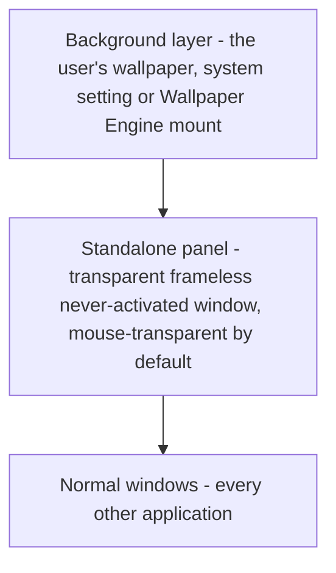

# Integration: background layer and the retired Wallpaper Engine toolchain

> **Retirement pointer.** Earlier revisions of this page documented a live integration: two Wallpaper Engine web wallpapers (TERMINAL 02, AGENT DECK), their `patched/` mirrors, the `apply_patch.py` / `restore_original.py` replay tooling and the `GET /performance` and `GET /deck` contracts served by a Python data service. All of that was retired on 2026-09-29 and no longer exists in the working tree. What follows is what a reader needs now: the background-layer model, what `archive/` holds, and which stale names still point at the old world.

## The wallpaper is only a background layer

<!-- openwiki: broken internal link [/repo://CONTEXT.md#L99-L109] file "/repo://CONTEXT.md" does not exist. Fix the href or restore the target, then delete this comment. -->
<!-- openwiki: broken internal link [/repo://README.md#L5] file "/repo://README.md" does not exist. Fix the href or restore the target, then delete this comment. -->
There is no wallpaper integration left to build against. The wallpaper is whatever the user selected outside this repository — a Windows system wallpaper or a Wallpaper Engine mount, indistinguishable to the code — and it sits *under* the panel. The panel is transparent, so the wallpaper shows through its uncovered areas, and the panel's default input state is mouse-transparency, so clicks that miss an interactive hot zone fall through to the background layer and the desktop ([CONTEXT.md](/repo://CONTEXT.md#L99-L109), [README](/repo://README.md#L5)).

<!-- openwiki: broken internal link [/repo://docs/adr/0004-electron-cordis-standalone-panel.md#L8] file "/repo://docs/adr/0004-electron-cordis-standalone-panel.md" does not exist. Fix the href or restore the target, then delete this comment. -->
Nothing in the repository produces, deploys, patches, reloads or queries a wallpaper. The window stack is the whole contract ([ADR-0004](/repo://docs/adr/0004-electron-cordis-standalone-panel.md#L8)):

*The layering the panel depends on, bottom to top; the arrows mean "is drawn above": the wallpaper stays visible through the panel, while normal windows take z-order priority over the panel.*

<!-- openwiki: broken internal link [/repo://app/src/main/panel-window.ts#L9-L43] file "/repo://app/src/main/panel-window.ts" does not exist. Fix the href or restore the target, then delete this comment. -->
<!-- openwiki: broken internal link [/repo://app/src/main/win32.ts#L20-L25] file "/repo://app/src/main/win32.ts" does not exist. Fix the href or restore the target, then delete this comment. -->
Two mechanisms hold that stack in place. `createPanelWindow()` builds a `frame: false`, `transparent: true`, non-activatable window with no shadow, then calls `setIgnoreMouseEvents(true)` — transparency goes through WebView2 compositing rather than a whole-window alpha fallback ([panel-window.ts](/repo://app/src/main/panel-window.ts#L9-L43)). `pinToBottom()` re-pins the window with `SetWindowPos(HWND_BOTTOM)` so it stays below every normal window and above the wallpaper/desktop layer, which Electron has no native z-order setting for ([win32.ts](/repo://app/src/main/win32.ts#L20-L25)).

<!-- openwiki: broken internal link [/repo://app/src/main/icon-carry.ts#L35-L52] file "/repo://app/src/main/icon-carry.ts" does not exist. Fix the href or restore the target, then delete this comment. -->
**The one place the code still understands Wallpaper Engine** is the desktop-icon host. The panel hides explorer's native icons so it can draw the desktop itself, and the shell view that owns them is `SHELLDLL_DefView`; a dynamic-wallpaper host such as Wallpaper Engine reparents that view under `WorkerW`, so `findDefView()` probes the `Progman` child first and then enumerates top-level windows for a `WorkerW` that owns a `SHELLDLL_DefView` ([icon-carry.ts](/repo://app/src/main/icon-carry.ts#L35-L52)). That is a shell-topology fact, not a Wallpaper Engine feature: no Wallpaper Engine process, project or setting is read anywhere, and a plain system wallpaper is served by the same two-step lookup. The detail is documented as a shell integration in [Windows shell and system APIs](/openwiki/integrations/windows-shell-and-system-apis.md) and [icon carry and Startup autostart](/openwiki/architecture/desktop-icon-carry-and-autostart.md).

<!-- openwiki: broken internal link [/repo://app/accept/battery.js#L634-L674] file "/repo://app/accept/battery.js" does not exist. Fix the href or restore the target, then delete this comment. -->
Nothing asserts on the wallpaper either. The acceptance battery proves transparency by sampling the panel's transparent zone and checking that the checker window *beneath* the panel is visible through it, then takes one `02-on-wallpaper` shot as a visual record only — a dynamic wallpaper differs frame by frame, so it carries no pixel assertion ([battery.js](/repo://app/accept/battery.js#L634-L674)).

## What was retired, and when

<!-- openwiki: broken internal link [/repo://README.md#L9] file "/repo://README.md" does not exist. Fix the href or restore the target, then delete this comment. -->
<!-- openwiki: broken internal link [/repo://archive/README.md#L3-L7] file "/repo://archive/README.md" does not exist. Fix the href or restore the target, then delete this comment. -->
The end of the Wallpaper Engine era is recorded in the README banner and the freeze note in the archive: the panel stopped being a web wallpaper plus a data service and became a standalone application ([README](/repo://README.md#L9), [archive/README.md](/repo://archive/README.md#L3-L7)). Retired on 2026-09-29 with it:

<!-- openwiki: broken internal link [/repo://CONTEXT.md#L125-L131] file "/repo://CONTEXT.md" does not exist. Fix the href or restore the target, then delete this comment. -->
- The Python data service `server.py` and its loopback HTTP contracts, together with the watchdog that started it only while a Wallpaper Engine process was running. No HTTP service, no `/performance`, no `/deck`, and no Python in this repository remains ([CONTEXT.md](/repo://CONTEXT.md#L125-L131)).
- The Tk search overlay that disguised itself as part of the wallpaper, and the Win32 chain that arranged real desktop icons.
<!-- openwiki: broken internal link [/repo://archive/README.md#L9-L13] file "/repo://archive/README.md" does not exist. Fix the href or restore the target, then delete this comment. -->
<!-- openwiki: broken internal link [/repo://.scratch/terminal02-qoder-status/issues/01-backup-patch-infra.md#L16] file "/repo://.scratch/terminal02-qoder-status/issues/01-backup-patch-infra.md" does not exist. Fix the href or restore the target, then delete this comment. -->
- The three Wallpaper Engine deployment scripts: the DECK deployer `scripts/deploy_deck.py`, the patch replay `scripts/apply_patch.py` and the interactive rollback `scripts/restore_original.py` ([archive/README.md](/repo://archive/README.md#L9-L13), [historical ticket](/repo://.scratch/terminal02-qoder-status/issues/01-backup-patch-infra.md#L16)).

<!-- openwiki: broken internal link [/repo://docs/adr/0001-win32-icon-manipulation.md#L1-L3] file "/repo://docs/adr/0001-win32-icon-manipulation.md" does not exist. Fix the href or restore the target, then delete this comment. -->
<!-- openwiki: broken internal link [/repo://docs/adr/0003-search-panel-service-window.md#L1-L3] file "/repo://docs/adr/0003-search-panel-service-window.md" does not exist. Fix the href or restore the target, then delete this comment. -->
<!-- openwiki: broken internal link [/repo://docs/adr/0004-electron-cordis-standalone-panel.md#L18-L20] file "/repo://docs/adr/0004-electron-cordis-standalone-panel.md" does not exist. Fix the href or restore the target, then delete this comment. -->
<!-- openwiki: broken internal link [/repo://README.md#L109-L116] file "/repo://README.md" does not exist. Fix the href or restore the target, then delete this comment. -->
Their capabilities moved into the cordis kernel services of the Electron app ([overview](/openwiki/architecture/overview.md), [cordis kernel and services](/openwiki/architecture/cordis-kernel-and-services.md)). The two decisions that were built *on* the wallpaper platform are marked superseded rather than deleted, because their reasoning explains why the platform boundary moved: ADR-0001 (arrange real desktop icons through Win32 because a web wallpaper receives no clicks) and ADR-0003 (the search panel must be a service-owned native window) both lose their premise once the interactive layer is a real Electron window with declared hot zones ([ADR-0001](/repo://docs/adr/0001-win32-icon-manipulation.md#L1-L3), [ADR-0003](/repo://docs/adr/0003-search-panel-service-window.md#L1-L3), [ADR-0004](/repo://docs/adr/0004-electron-cordis-standalone-panel.md#L18-L20), [README](/repo://README.md#L109-L116)).

## What `archive/` preserves

<!-- openwiki: broken internal link [/repo://archive/README.md#L9-L13] file "/repo://archive/README.md" does not exist. Fix the href or restore the target, then delete this comment. -->
<!-- openwiki: broken internal link [/repo://archive/README.md#L29-L32] file "/repo://archive/README.md" does not exist. Fix the href or restore the target, then delete this comment. -->
`archive/wallpaper-assets/` holds the retired wallpaper assets, frozen read-only since 2026-09-29. The three trees were moved in unchanged from the former top-level `deck/`, `patched/` and `backup/` directories ([archive/README.md](/repo://archive/README.md#L9-L13), [archive/README.md](/repo://archive/README.md#L29-L32)):

| Directory | What it was |
|---|---|
| `deck/` | Source of the self-built AGENT DECK wallpaper that `scripts/deploy_deck.py` pushed into Wallpaper Engine |
| `patched/` | The TERMINAL 02 customization (custom page, `performance.layout.user.js`, reserialized `project.json`) |
| `backup/original/` | The pristine upstream TERMINAL 02 project that the rollback script restored |

<!-- openwiki: broken internal link [/repo://archive/README.md#L15-L20] file "/repo://archive/README.md" does not exist. Fix the href or restore the target, then delete this comment. -->
<!-- openwiki: broken internal link [/repo://.gitignore#L4-L16] file "/repo://.gitignore" does not exist. Fix the href or restore the target, then delete this comment. -->
It is kept for provenance, not for recovery: the commercial Decima Mono font, the `preview.gif` and the original `performance.layout.js` inside those trees could otherwise only be fetched again by re-downloading the Workshop item ([archive/README.md](/repo://archive/README.md#L15-L20)). Note that part of it was already never versioned — the deck fonts and the upstream editor's `.history/` are git-ignored, so a fresh clone of `archive/` is incomplete on purpose ([.gitignore](/repo://.gitignore#L4-L16)).

<!-- openwiki: broken internal link [/repo://archive/README.md#L15-L20] file "/repo://archive/README.md" does not exist. Fix the href or restore the target, then delete this comment. -->
<!-- openwiki: broken internal link [/repo://archive/README.md#L22-L27] file "/repo://archive/README.md" does not exist. Fix the href or restore the target, then delete this comment. -->
**The archive is not a dependency.** Nothing in `app/`, the tests, the acceptance battery or the build copies, imports or reads anything under `archive/`; the freeze note states that explicitly and invites a grep to confirm it ([archive/README.md](/repo://archive/README.md#L15-L20)). The disposition rules are the load-bearing part for a reader making changes ([archive/README.md](/repo://archive/README.md#L22-L27)):

- **Do not modify** — no fix, refactor or reformat lands in that directory; it is a snapshot of what the wallpaper used to look like.
<!-- openwiki: broken internal link [/repo://app/src/renderer/index.html#L14-L18] file "/repo://app/src/renderer/index.html" does not exist. Fix the href or restore the target, then delete this comment. -->
<!-- openwiki: broken internal link [/repo://.gitignore#L12-L13] file "/repo://.gitignore" does not exist. Fix the href or restore the target, then delete this comment. -->
- **Do not depend on it** — new work must not reference the archived fonts or assets. Fonts come from the panel's own asset stack (the renderer uses a system monospace stack — `Cascadia Mono`, Consolas, `Courier New`), and the archived font binaries are excluded from the repository outright ([index.html](/repo://app/src/renderer/index.html#L14-L18), [.gitignore](/repo://.gitignore#L12-L13)).
- **Deleting it is allowed** — if the assets are ever confirmed useless, the directory can go; the history stays in git.

## Stale names that still point here

Old terminology survives in three places, and only those:

<!-- openwiki: broken internal link [/repo://CONTEXT.md#L119-L160] file "/repo://CONTEXT.md" does not exist. Fix the href or restore the target, then delete this comment. -->
- **The glossary.** `CONTEXT.md` keeps a "retired words" section that defines the dead vocabulary and dates each retirement: 数据服务 (the Python data service), 看门狗 (the Wallpaper Engine-coupled watchdog), 搜索浮层窗 (the Tk search window), plus the retired interface terms 信息模块, HUD 模式, 座舱环抱, 仪表俯倾, 鼠标指示器 and 头部视差 ([CONTEXT.md](/repo://CONTEXT.md#L119-L160)). The [domain model](/openwiki/concepts/domain-model.md) page bridges that glossary to current code.
<!-- openwiki: broken internal link [/repo://archive/README.md#L29-L32] file "/repo://archive/README.md" does not exist. Fix the href or restore the target, then delete this comment. -->
- **Historical tickets.** `.scratch/terminal02-qoder-status/`, `.scratch/qoder-deck/`, `.scratch/terminal02-hud-perspective/` and `.scratch/listary-search/` are the only remaining carriers of the old project names and contracts — TERMINAL 02, `patched/`, `GET /performance`, `GET /deck`, `performance.layout.user.js`. They are history, not contracts to satisfy ([archive/README.md](/repo://archive/README.md#L29-L32)).
<!-- openwiki: broken internal link [/repo://app/src/main/autostart.ts#L24-L28] file "/repo://app/src/main/autostart.ts" does not exist. Fix the href or restore the target, then delete this comment. -->
<!-- openwiki: broken internal link [/repo://README.md#L75-L81] file "/repo://README.md" does not exist. Fix the href or restore the target, then delete this comment. -->
<!-- openwiki: broken internal link [/repo://app/src/main/usage/migrate.ts#L16-L48] file "/repo://app/src/main/usage/migrate.ts" does not exist. Fix the href or restore the target, then delete this comment. -->
<!-- openwiki: broken internal link [/repo://README.md#L83-L90] file "/repo://README.md" does not exist. Fix the href or restore the target, then delete this comment. -->
- **Live residue in code, deliberately handled.** Two retired-era artifacts are still recognised by name so the machine cleans itself up. The Python watchdog's Startup link `qoder-deck-server-watchdog.lnk` is deleted on every application run, so the retirement does not depend on the user remembering to delete it ([autostart.ts](/repo://app/src/main/autostart.ts#L24-L28), [README](/repo://README.md#L75-L81)). And the retired service's usage log at `%LOCALAPPDATA%\qoder-deck\usage` is copied once into the panel's `userData` so the dock's frequency ranking keeps its history; the legacy directory is left in place, the migration is idempotent, and only files inside the retention window are taken ([migrate.ts](/repo://app/src/main/usage/migrate.ts#L16-L48), [README](/repo://README.md#L83-L90)).

The `qoder-deck` string is therefore a legacy path name, not the product identity: the running panel is AGENT DECK, and the archived wallpaper tree under `archive/wallpaper-assets/deck/` is what that name used to describe.

## Change checklist

- **Never wire new code to `archive/`** — no imports, no asset copies, no font references, no build steps. If an archived file looks like the right asset, it is not: add the asset to the panel's own tree instead.
- **Do not reintroduce a wallpaper-side surface.** No HTTP endpoint, no reload command and no page-under-the-desktop belongs in this repository; anything the user must interact with is a hot zone in the panel window.
- **Keep the archive out of fixes.** A bug report that points into `archive/wallpaper-assets/` is a request about a frozen file; the correct answer is the current panel code, or nothing.
- **Treat the DefView `WorkerW` branch as shell behaviour.** Removing it breaks icon hiding for any user running a dynamic wallpaper, including Wallpaper Engine, so it is not dead code left over from the retired era.

## Related pages

- [Overview](/openwiki/architecture/overview.md) — the current system map and its own retirement note.
- [Domain model](/openwiki/concepts/domain-model.md) — includes the background-layer term and the retired-vocabulary table.
- [Windows shell and system APIs](/openwiki/integrations/windows-shell-and-system-apis.md) — the `WorkerW`/`SHELLDLL_DefView` lookup in its native-API context.
- [Icon carry and Startup autostart](/openwiki/architecture/desktop-icon-carry-and-autostart.md) — why the panel hides the native icons, and the Startup link bookkeeping.
- [Quickstart](/openwiki/quickstart.md) — running the panel that replaces the wallpaper.
