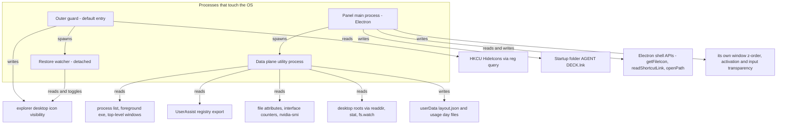

# Integration: Windows shell, registry and native APIs

`app/` is a Windows-only application. Its window stack, its desktop-icon host, its autostart entry and its telemetry sources all end in a Win32 call, a shell command or a registry query, and none of those are optional decoration: without them there is no panel. This page is the inventory of the surfaces involved — which process owns each one, whether the application writes to it or only reads it, and the exact calling shape (library, function, calling convention, encoding) that a change has to preserve.

The mechanisms themselves are documented where they belong: [icon carry and Startup autostart](/openwiki/architecture/desktop-icon-carry-and-autostart.md) for the hide/restore lifecycle and the decision table, [desktop zones execution](/openwiki/architecture/desktop-zones-execution.md) for the scan/icon/launch dependency bundle, [hardware telemetry](/openwiki/architecture/hardware-telemetry.md) for the sampling loop, [usage telemetry and recommendation](/openwiki/architecture/usage-telemetry-and-recommendation.md) for the process-diff collection and the UserAssist prior. What this page adds is the map: which surfaces exist, which direction the traffic flows, and what breaks the machine if a write goes wrong.

## Reads degrade, writes are owned

The governing asymmetry is direction. A read that fails costs a field: the GPU gauge loses its value, the UserAssist prior comes back empty, the foreground exe is `null`, and the next tick retries. A write that fails — or succeeds at the wrong moment — leaves state behind after the process is gone: a desktop without icons, a Startup entry pointing at a deleted worktree, a foreground window stolen from the user's typing.

Every write in the application therefore has three properties, and a change that adds another one has to repeat all three:

- **A single owner.** The outer guard owns the desktop icon view, the panel process owns the Startup folder, and no other process touches either.
- **A restore or an idempotent re-apply.** Hiding icons has five documented restore reasons; the Startup link is recomputed from declarative rules on every boot.
- **A non-fatal failure path.** A hide failure degrades to a visibly logged "two desktops" run, a Startup write failure is caught in `bootPanel`, and neither is allowed to stop the panel from appearing.

Reads are the opposite contract: best-effort, injected behind a seam, and never allowed to throw into the panel's tick.

## The processes that touch the operating system

| Process | Entry point | OS surfaces it owns | Lifetime |
|---|---|---|---|
| Outer guard | default entry, no flags | explorer's desktop icon view, the `HideIcons` preference read, the restore watcher | outlives the panel; `taskkill /T` of the panel cannot reach it |
| Panel main process | `--panel` | Startup folder, Electron `shell`/`app` APIs, its own window z-order and activation, the data-plane child, `config.json`, plugin roots | until the panel quits |
| Data plane utility process | spawned by the panel | process and window enumeration, `reg.exe` export, `nvidia-smi`, file attributes, interface counters, desktop-root watching, `userData` writes | restarted by the panel with 1 s→30 s backoff |
| Restore watcher | spawned detached by the guard | the guard's process handle, and the icon view if the guard died | exits as soon as the guard is gone |
| `--icon-restore` one-shot | `--icon-restore` | the icon view, keyed on the registry preference | exits immediately; needs no single-instance lock |

*Which process touches which operating-system surface, and in which direction; the guard and the panel never share a surface, which is what keeps a panel crash from leaving the desktop empty.*

## Surfaces this application writes to

### 1. explorer's desktop icon view

<!-- openwiki: broken internal link [/repo://app/src/main/icon-carry.ts#L12-L25] file "/repo://app/src/main/icon-carry.ts" does not exist. Fix the href or restore the target, then delete this comment. -->
<!-- openwiki: broken internal link [/repo://app/src/main/icon-carry.ts#L73-L78] file "/repo://app/src/main/icon-carry.ts" does not exist. Fix the href or restore the target, then delete this comment. -->
This is the only write into another process's user interface, and it is deliberately modelled as a **command**, not as a flag: the application sends `WM_COMMAND` (`0x0111`) with the parameter `0x7402` to the `SHELLDLL_DefView` window — the same message explorer issues from *View → Show desktop icons* — using `SendMessageTimeoutW` with `SMTO_ABORTIFHUNG` and a 3000 ms budget so a hung explorer degrades to a logged failure instead of wedging the guard ([icon-carry.ts](/repo://app/src/main/icon-carry.ts#L12-L25), [icon-carry.ts](/repo://app/src/main/icon-carry.ts#L73-L78)).

Two consequences follow, and both are load-bearing:

- **The application never writes a registry value.** Explorer writes the resulting `HideIcons` `REG_DWORD` back into `HKCU\Software\Microsoft\Windows\CurrentVersion\Explorer\Advanced` itself. Every registry access on this path is a read.
<!-- openwiki: broken internal link [/repo://app/src/main/icon-carry.ts#L60-L71] file "/repo://app/src/main/icon-carry.ts" does not exist. Fix the href or restore the target, then delete this comment. -->
<!-- openwiki: broken internal link [/repo://app/src/main/icon-carry.ts#L102-L116] file "/repo://app/src/main/icon-carry.ts" does not exist. Fix the href or restore the target, then delete this comment. -->
- **The view fact and the user preference are two different observations.** `iconsVisible()` asks `IsWindowVisible` on the desktop `SysListView32` and is the only authority for whether a toggle is needed; `prefHidden()` reads `HideIcons` and decides whether this run may hide at all. Mixing them up is the classic bug here — the restore predicate that flips the state back must not hide icons a user just re-showed ([icon-carry.ts](/repo://app/src/main/icon-carry.ts#L60-L71), [icon-carry.ts](/repo://app/src/main/icon-carry.ts#L102-L116)).

<!-- openwiki: broken internal link [/repo://app/src/main/icon-carry.ts#L35-L58] file "/repo://app/src/main/icon-carry.ts" does not exist. Fix the href or restore the target, then delete this comment. -->
The host window is found in two steps — the `SHELLDLL_DefView` child of `Progman`, then a bounded 2048-iteration enumeration of top-level windows for a `WorkerW` that owns one — because a dynamic-wallpaper host reparents the view ([icon-carry.ts](/repo://app/src/main/icon-carry.ts#L35-L58)). The lifecycle (four restore reasons, the detached watcher, the `--icon-restore` self-rescue) is on [icon carry and Startup autostart](/openwiki/architecture/desktop-icon-carry-and-autostart.md).

### 2. The current user's Startup folder

<!-- openwiki: broken internal link [/repo://app/src/main/autostart.ts#L61-L74] file "/repo://app/src/main/autostart.ts" does not exist. Fix the href or restore the target, then delete this comment. -->
<!-- openwiki: broken internal link [/repo://app/src/main/autostart.ts#L80-L86] file "/repo://app/src/main/autostart.ts" does not exist. Fix the href or restore the target, then delete this comment. -->
The autostart entry is `%APPDATA%\Microsoft\Windows\Start Menu\Programs\Startup\AGENT DECK.lnk`, composed by `startupDirFrom()`; a missing `APPDATA` is an explicit throw that the boot path catches, not a guessed path ([autostart.ts](/repo://app/src/main/autostart.ts#L61-L74)). The link's target is derived from the current run — `process.execPath` plus the quoted app directory as its argument — and it carries **no mode flag**, so a Startup boot runs the default entry, the guard ([autostart.ts](/repo://app/src/main/autostart.ts#L80-L86)).

<!-- openwiki: broken internal link [/repo://app/src/main/autostart.ts#L95-L121] file "/repo://app/src/main/autostart.ts" does not exist. Fix the href or restore the target, then delete this comment. -->
<!-- openwiki: broken internal link [/repo://app/src/main/autostart.ts#L202-L209] file "/repo://app/src/main/autostart.ts" does not exist. Fix the href or restore the target, then delete this comment. -->
<!-- openwiki: broken internal link [/repo://app/src/main/autostart.ts#L166-L172] file "/repo://app/src/main/autostart.ts" does not exist. Fix the href or restore the target, then delete this comment. -->
Who may write it is gated by `config.autostart.appDir`: only a run whose app directory normalizes to the declared production location may create the link or adopt a dead one, a link that points elsewhere and is still alive is never followed, and the legacy Python-watchdog link is deleted unconditionally so the retirement does not depend on the user remembering anything ([autostart.ts](/repo://app/src/main/autostart.ts#L95-L121), [autostart.ts](/repo://app/src/main/autostart.ts#L202-L209)). The write and read of the `.lnk` itself go through a PowerShell COM helper; deletion is deliberately *not* in the helper — `removeShortcut()` deletes the file directly with `fs.rmSync(..., { force: true })`, because an unused COM delete branch rots ([autostart.ts](/repo://app/src/main/autostart.ts#L166-L172)).

### 3. Other applications' windows and processes

Three writes cross into other applications, all user-initiated from the panel and all best-effort:

| Write | Mechanism | Failure semantics |
|---|---|---|
| Bring a tool's window to the front | `ShowWindow(SW_RESTORE)` if iconic, then `BringWindowToTop` + `SetForegroundWindow` | the foreground lock can refuse; the result is `ok: false, action: 'degraded'`, never an exception into the panel |
| Start a tool or a desktop item | `shell.openPath` (ShellExecute semantics; a single-instance app is raised, not duplicated) | the returned error string is surfaced as the failure; `''` is success |
| Reveal a path in explorer | `spawn('explorer', ['/select,', path])`, fire-and-forget | silent |

<!-- openwiki: broken internal link [/repo://app/src/main/focus/adapter.ts#L76-L103] file "/repo://app/src/main/focus/adapter.ts" does not exist. Fix the href or restore the target, then delete this comment. -->
<!-- openwiki: broken internal link [/repo://app/src/main/focus/plan.ts#L9-L47] file "/repo://app/src/main/focus/plan.ts" does not exist. Fix the href or restore the target, then delete this comment. -->
The focus path deliberately drops the window-title-shaped information it could have read: `nativeWindowCandidates()` returns only `hwnd`, `pid`, exe basename, `visible` and `minimized`, and ranking prefers a visible non-minimized window over a minimized one, skipping invisible ones ([focus/adapter.ts](/repo://app/src/main/focus/adapter.ts#L76-L103), [focus/plan.ts](/repo://app/src/main/focus/plan.ts#L9-L47)).

<!-- openwiki: broken internal link [/repo://app/src/main/services/search.ts#L30-L39] file "/repo://app/src/main/services/search.ts" does not exist. Fix the href or restore the target, then delete this comment. -->
The `explorer /select,` spawn deliberately omits `windowsHide`: it travels through `STARTUPINFO` as `SW_HIDE` and would hide explorer's own folder window along with any console — the battery caught this as `reveal ok=true` with `CabinetWClass` never appearing ([services/search.ts](/repo://app/src/main/services/search.ts#L30-L39)).

<!-- openwiki: broken internal link [/repo://app/src/main/services/desktop.ts#L150-L157] file "/repo://app/src/main/services/desktop.ts" does not exist. Fix the href or restore the target, then delete this comment. -->
<!-- openwiki: broken internal link [/repo://app/src/main/services/search.ts#L135-L146] file "/repo://app/src/main/services/search.ts" does not exist. Fix the href or restore the target, then delete this comment. -->
<!-- openwiki: broken internal link [/repo://app/src/main/services/focus.ts#L37-L45] file "/repo://app/src/main/services/focus.ts" does not exist. Fix the href or restore the target, then delete this comment. -->
Launch is additionally fenced three times, and every fence is about *who names the path*: a desktop item is started only if its path is in the current scanned pool (`桌面项不在当前扫描池内` otherwise), a search result only if it belongs to the latest result set (`动作路径不在最近一次搜索结果内` otherwise), and a tool only from `config.tools` — the renderer sends tool names and result paths, never executable paths ([services/desktop.ts](/repo://app/src/main/services/desktop.ts#L150-L157), [services/search.ts](/repo://app/src/main/services/search.ts#L135-L146), [services/focus.ts](/repo://app/src/main/services/focus.ts#L37-L45)).

<!-- openwiki: broken internal link [/repo://app/src/main/panel-window.ts#L9-L43] file "/repo://app/src/main/panel-window.ts" does not exist. Fix the href or restore the target, then delete this comment. -->
<!-- openwiki: broken internal link [/repo://app/src/main/win32.ts#L20-L25] file "/repo://app/src/main/win32.ts" does not exist. Fix the href or restore the target, then delete this comment. -->
<!-- openwiki: broken internal link [/repo://app/src/main/index.ts#L116-L136] file "/repo://app/src/main/index.ts" does not exist. Fix the href or restore the target, then delete this comment. -->
Finally the application writes to its own window: `focusable: false` on Windows is effectively `WS_EX_NOACTIVATE`, the window is transparent, frameless, shadowless and `skipTaskbar`, mouse input falls through by default, and z-order is forced to the bottom with `SetWindowPos(win, HWND_BOTTOM, …, SWP_NOMOVE | SWP_NOSIZE | SWP_NOACTIVATE | SWP_NOOWNERZORDER)` — re-pinned on startup, on hot-zone leave (500 ms throttle) and on any stray focus event ([panel-window.ts](/repo://app/src/main/panel-window.ts#L9-L43), [win32.ts](/repo://app/src/main/win32.ts#L20-L25), [index.ts](/repo://app/src/main/index.ts#L116-L136)).

### 4. Its own files on disk

These are writes into the application's own territory, so they are ordinary durability problems rather than integration risk:

| Path | Written by | Mechanism and failure policy |
|---|---|---|
<!-- openwiki: broken internal link [/repo://app/src/main/config.ts#L364-L382] file "/repo://app/src/main/config.ts" does not exist. Fix the href or restore the target, then delete this comment. -->
| `app/config.json` | panel process, at boot when absent, and on every card-opacity change | atomic `tmp` + `rename`; an unparsable file is **not** overwritten, the process falls back to defaults with a warning ([config.ts](/repo://app/src/main/config.ts#L364-L382)) |
<!-- openwiki: broken internal link [/repo://app/src/main/desktop/adapter.ts#L121-L126] file "/repo://app/src/main/desktop/adapter.ts" does not exist. Fix the href or restore the target, then delete this comment. -->
<!-- openwiki: broken internal link [/repo://app/src/main/services/desktop.ts#L194-L200] file "/repo://app/src/main/services/desktop.ts" does not exist. Fix the href or restore the target, then delete this comment. -->
| `userData/layout.json` | data plane | same atomic write; a failed write logs and leaves the in-memory plan running ([desktop/adapter.ts](/repo://app/src/main/desktop/adapter.ts#L121-L126), [services/desktop.ts](/repo://app/src/main/services/desktop.ts#L194-L200)) |
<!-- openwiki: broken internal link [/repo://app/src/main/usage/log.ts#L43-L52] file "/repo://app/src/main/usage/log.ts" does not exist. Fix the href or restore the target, then delete this comment. -->
| `userData/usage/start-YYYYMMDD.jsonl` and `focus-…` | data plane | append-only, `{ts, exe}` per line; every write failure is swallowed because a log must not kill the service; 90-day prune at boot and hourly ([usage/log.ts](/repo://app/src/main/usage/log.ts#L43-L52)) |
<!-- openwiki: broken internal link [/repo://app/src/main/panel-ipc.ts#L9-L24] file "/repo://app/src/main/panel-ipc.ts" does not exist. Fix the href or restore the target, then delete this comment. -->
| evidence log at `DECK_EVENT_LOG` | whichever process holds it | append-only JSONL; `fileEventLog` returns `null` when the variable is unset, so a normal run writes nothing ([panel-ipc.ts](/repo://app/src/main/panel-ipc.ts#L9-L24)) |
<!-- openwiki: broken internal link [/repo://app/src/main/plugins/watch.ts#L1-L42] file "/repo://app/src/main/plugins/watch.ts" does not exist. Fix the href or restore the target, then delete this comment. -->
| `userData/plugins` (or `config.plugins.dir`) | panel process | `mkdirSync(recursive)` before watching, because "the install directory does not exist yet" is the normal first-run state ([plugins/watch.ts](/repo://app/src/main/plugins/watch.ts#L1-L42)) |
<!-- openwiki: broken internal link [/repo://app/src/main/usage/userassist.ts#L70-L89] file "/repo://app/src/main/usage/userassist.ts" does not exist. Fix the href or restore the target, then delete this comment. -->
| `%TEMP%\deck-ua-*\userassist.reg` | data plane, transient | created for one `reg export`, deleted in a `finally` block; a failed cleanup is ignored ([usage/userassist.ts](/repo://app/src/main/usage/userassist.ts#L70-L89)) |
<!-- openwiki: broken internal link [/repo://app/scripts/copy-assets.mjs#L20-L28] file "/repo://app/scripts/copy-assets.mjs" does not exist. Fix the href or restore the target, then delete this comment. -->
| `dist/main/autostart.ps1`, `dist/main/icon-restore-watch.cjs` | build (`npm run build`) | not compiled by `tsc`; `scripts/copy-assets.mjs` copies both next to their compiled consumers, which reference them via `__dirname` ([copy-assets.mjs](/repo://app/scripts/copy-assets.mjs#L20-L28)) |

<!-- openwiki: broken internal link [/repo://app/src/main/usage/migrate.ts#L16-L23] file "/repo://app/src/main/usage/migrate.ts" does not exist. Fix the href or restore the target, then delete this comment. -->
<!-- openwiki: broken internal link [/repo://app/src/main/usage/migrate.ts#L38-L49] file "/repo://app/src/main/usage/migrate.ts" does not exist. Fix the href or restore the target, then delete this comment. -->
One neighbouring directory is read and copied but never modified: the Python-era usage log at `%LOCALAPPDATA%\qoder-deck\usage` is migrated *by copying* day files that are still inside the retention window, idempotently, and the legacy directory is left in place for the user to delete ([usage/migrate.ts](/repo://app/src/main/usage/migrate.ts#L16-L23), [usage/migrate.ts](/repo://app/src/main/usage/migrate.ts#L38-L49)).

## Surfaces this application only reads

### Process and window enumeration

<!-- openwiki: broken internal link [/repo://app/src/main/usage/native.ts#L9-L53] file "/repo://app/src/main/usage/native.ts" does not exist. Fix the href or restore the target, then delete this comment. -->
<!-- openwiki: broken internal link [/repo://app/src/main/focus/adapter.ts#L8-L74] file "/repo://app/src/main/focus/adapter.ts" does not exist. Fix the href or restore the target, then delete this comment. -->
Two callers share the same primitive: `usage/native.ts` builds a `pid → exe path` map for the start diff, and `focus/adapter.ts` walks the top-level window chain to find a tool's window. Both are narrow by construction — a pid, a handle, an exe path, and two window flags ([usage/native.ts](/repo://app/src/main/usage/native.ts#L9-L53), [focus/adapter.ts](/repo://app/src/main/focus/adapter.ts#L8-L74)):

- `EnumProcesses` fills a 4096-entry `uint32` pid buffer; each pid is then opened with `OpenProcess(PROCESS_QUERY_LIMITED_INFORMATION, false, pid)` — the limited-information query right — and its image path is read with `QueryFullProcessImageNameW` into a 1024-byte buffer whose length field is pre-set to 510 wide characters. The handle is always closed in a `finally`.
- The foreground window is `GetForegroundWindow()` → `GetWindowThreadProcessId` → the same image-name query. No further window property is touched.
<!-- openwiki: broken internal link [/repo://app/src/main/focus/adapter.ts#L1-L5] file "/repo://app/src/main/focus/adapter.ts" does not exist. Fix the href or restore the target, then delete this comment. -->
- The window-chain enumeration uses `GetTopWindow`/`GetWindow(GW_HWNDNEXT)` rather than an `EnumWindows` callback, with a 2048-iteration guard, and takes `IsWindowVisible` and `IsIconic` per window. The comment records the reason for the chain form: it avoids FFI callback lifetime problems ([focus/adapter.ts](/repo://app/src/main/focus/adapter.ts#L1-L5)).

<!-- openwiki: broken internal link [/repo://app/src/main/focus/adapter.ts#L76-L103] file "/repo://app/src/main/focus/adapter.ts" does not exist. Fix the href or restore the target, then delete this comment. -->
<!-- openwiki: broken internal link [/repo://app/src/main/services/focus.ts#L62-L90] file "/repo://app/src/main/services/focus.ts" does not exist. Fix the href or restore the target, then delete this comment. -->
Windows whose exe cannot be read (access denied, already exited) are skipped rather than reported, and a window enumeration failure still lets the click fall through to "launch the tool" ([focus/adapter.ts](/repo://app/src/main/focus/adapter.ts#L76-L103), [services/focus.ts](/repo://app/src/main/services/focus.ts#L62-L90)).

### The no-titles rule (ADR-0002)

<!-- openwiki: broken internal link [/repo://docs/adr/0002-no-window-titles-in-usage-log.md#L1-L13] file "/repo://docs/adr/0002-no-window-titles-in-usage-log.md" does not exist. Fix the href or restore the target, then delete this comment. -->
The foreground-window path never reads a window title. The reasoning is in [ADR-0002](/repo://docs/adr/0002-no-window-titles-in-usage-log.md#L1-L13): the user's daily work is legal-case research, window titles routinely carry case numbers and party names, and "recorded locally but never sent anywhere" is not a boundary because the log file is plaintext. Titles were also judged worthless for the question being answered — which application is used most.

The rule is enforced at three levels, and the levels matter more than the promise:

<!-- openwiki: broken internal link [/repo://app/src/main/usage/log.ts#L1-L16] file "/repo://app/src/main/usage/log.ts" does not exist. Fix the href or restore the target, then delete this comment. -->
<!-- openwiki: broken internal link [/repo://app/tests/usage/log.spec.ts#L155-L157] file "/repo://app/tests/usage/log.spec.ts" does not exist. Fix the href or restore the target, then delete this comment. -->
- **Data**: the usage log has exactly two fields per record, `ts` and `exe`, and a test asserts that the parsed keys are exactly `exe,ts` ([usage/log.ts](/repo://app/src/main/usage/log.ts#L1-L16), [tests/usage/log.spec.ts](/repo://app/tests/usage/log.spec.ts#L155-L157)).
<!-- openwiki: broken internal link [/repo://app/src/main/focus/plan.ts#L9-L17] file "/repo://app/src/main/focus/plan.ts" does not exist. Fix the href or restore the target, then delete this comment. -->
- **Types**: `WindowCandidate` has no title field at all — a candidate carries `hwnd`, `pid`, exe basename, `visible`, `minimized` — so a title cannot be threaded through the focus decision even by accident ([focus/plan.ts](/repo://app/src/main/focus/plan.ts#L9-L17)).
<!-- openwiki: broken internal link [/repo://app/tests/usage/log.spec.ts#L116-L129] file "/repo://app/tests/usage/log.spec.ts" does not exist. Fix the href or restore the target, then delete this comment. -->
- **Source**: a standing test walks every `.ts` file under `src/main` and asserts that neither `GetWindowText` nor `window_title` appears ([tests/usage/log.spec.ts](/repo://app/tests/usage/log.spec.ts#L116-L129)). Note the filter — it is `src/main/**/*.ts`, so the `.cjs` watcher and the `.ps1` helper are outside the scan.

<!-- openwiki: broken internal link [/repo://app/accept/battery.js#L397-L409] file "/repo://app/accept/battery.js" does not exist. Fix the href or restore the target, then delete this comment. -->
The only window-title read in the application or its acceptance harness is in the battery itself, which binds `GetWindowTextW` for its own probe assertions and is commented as acceptance-only, not production ([accept/battery.js](/repo://app/accept/battery.js#L397-L409)).

<!-- openwiki: broken internal link [/repo://docs/adr/0002-no-window-titles-in-usage-log.md#L11-L13] file "/repo://docs/adr/0002-no-window-titles-in-usage-log.md" does not exist. Fix the href or restore the target, then delete this comment. -->
The consequence is a budget, not just a privacy choice: with no titles, "frequency" can only mean *real process starts* (new pid) with time decay, and the document zone cannot reuse the same score — it sorts by file modification time instead ([docs/adr/0002-no-window-titles-in-usage-log.md](/repo://docs/adr/0002-no-window-titles-in-usage-log.md#L11-L13)).

### Registry reads

| Read | How | Degradation |
|---|---|---|
<!-- openwiki: broken internal link [/repo://app/src/main/icon-carry.ts#L66-L71] file "/repo://app/src/main/icon-carry.ts" does not exist. Fix the href or restore the target, then delete this comment. -->
| `HideIcons` preference | `spawnSync('reg', ['query', ADV_KEY, '/v', 'HideIcons'], { encoding: 'utf8', timeout: 8000 })`, matched with `/\bHideIcons\s+REG_DWORD\s+0x([0-9a-fA-F]+)/` | absent or unparsable reads as "not hidden" ([icon-carry.ts](/repo://app/src/main/icon-carry.ts#L66-L71)) |
| Explorer's `UserAssist` launch counts | async `execFile('reg.exe', ['export', USERASSIST_KEY, tmp, '/y'], { timeout: 15000 })`, then the exported `.reg` file is read from disk and parsed as text | a failed export, a missing file or a parse error resolves to an empty map — the prior is optional by design |

<!-- openwiki: broken internal link [/repo://app/src/main/usage/userassist.ts#L1-L35] file "/repo://app/src/main/usage/userassist.ts" does not exist. Fix the href or restore the target, then delete this comment. -->
<!-- openwiki: broken internal link [/repo://app/src/main/usage/userassist.ts#L36-L65] file "/repo://app/src/main/usage/userassist.ts" does not exist. Fix the href or restore the target, then delete this comment. -->
<!-- openwiki: broken internal link [/repo://app/src/main/services/usage.ts#L44-L57] file "/repo://app/src/main/services/usage.ts" does not exist. Fix the href or restore the target, then delete this comment. -->
The UserAssist read is the one place where the application ingests activity the operating system already recorded about the user. It is deliberately done through an exported text file rather than through `advapi32` enumeration: the export's escaping layer absorbs the quotes and backslashes inside the ROT13-obfuscated value names, which is what makes a pure-text parser safe to test offline ([usage/userassist.ts](/repo://app/src/main/usage/userassist.ts#L1-L35), [usage/userassist.ts](/repo://app/src/main/usage/userassist.ts#L36-L65)). Only values under a `\Count` subkey are taken, only paths ending in `.exe` or `.lnk` are kept, and duplicate paths keep the higher count. The export is asynchronous on purpose — a `reg` export must not sit on the boot critical path while the dock needs to be on screen with the first paint ([services/usage.ts](/repo://app/src/main/services/usage.ts#L44-L57)).

### File attributes and the desktop directories

<!-- openwiki: broken internal link [/repo://app/src/main/desktop/adapter.ts#L12-L49] file "/repo://app/src/main/desktop/adapter.ts" does not exist. Fix the href or restore the target, then delete this comment. -->
<!-- openwiki: broken internal link [/repo://app/tests/desktop/adapter.spec.ts#L1-L33] file "/repo://app/tests/desktop/adapter.spec.ts" does not exist. Fix the href or restore the target, then delete this comment. -->
`GetFileAttributesW` is bound from **kernel32** (the source comments call this out explicitly, because `GetFileAttributes` is easy to assume into user32), and returns `0xffffffff` on failure. The adapter turns an attribute word into one boolean, `isHidden`, from `FILE_ATTRIBUTE_HIDDEN | FILE_ATTRIBUTE_SYSTEM`, and a failed lookup is treated as *visible* — the filter must never drop an item just because the attribute read failed ([desktop/adapter.ts](/repo://app/src/main/desktop/adapter.ts#L12-L49)). `desktop.ini`-class entries are the reason the filter exists; a test creates a real file, sets `attrib +h +s` and asserts the flag ([tests/desktop/adapter.spec.ts](/repo://app/tests/desktop/adapter.spec.ts#L1-L33)).

<!-- openwiki: broken internal link [/repo://app/src/main/desktop/adapter.ts#L51-L62] file "/repo://app/src/main/desktop/adapter.ts" does not exist. Fix the href or restore the target, then delete this comment. -->
<!-- openwiki: broken internal link [/repo://app/src/main/desktop/watch.ts#L13-L48] file "/repo://app/src/main/desktop/watch.ts" does not exist. Fix the href or restore the target, then delete this comment. -->
The two roots are the user desktop — resolved through `app.getPath('desktop')`, which is what follows a OneDrive redirection — and the common desktop from the `PUBLIC` environment variable, with a `homedir()/../Public` guess when Electron is unavailable ([desktop/adapter.ts](/repo://app/src/main/desktop/adapter.ts#L51-L62)). Both are watched with non-persistent `fs.watch`, events are merged through a 300 ms settle timer, an unwatchable root is skipped silently, and the 1 Hz rescan is the documented backstop ([desktop/watch.ts](/repo://app/src/main/desktop/watch.ts#L13-L48)).

### Interface counters and the GPU probe

<!-- openwiki: broken internal link [/repo://app/src/main/hardware/net-counters.ts#L1-L40] file "/repo://app/src/main/hardware/net-counters.ts" does not exist. Fix the href or restore the target, then delete this comment. -->
<!-- openwiki: broken internal link [/repo://app/src/main/hardware/rates.ts#L31-L69] file "/repo://app/src/main/hardware/rates.ts" does not exist. Fix the href or restore the target, then delete this comment. -->
`readNetCounters()` calls `iphlpapi!GetIfTable` and walks a flat `MIB_IFROW` layout with hand-validated offsets that are hardcoded in the module: rows are 860 bytes, the table body starts at offset 4, `dwIndex` is at 512, `dwInOctets` at 552 and `dwOutOctets` at 576. The comment records that these constants were cross-checked against `Get-NetAdapterStatistics` on this machine, and `ERROR_INSUFFICIENT_BUFFER` (111) triggers one re-query with the size the API returned ([net-counters.ts](/repo://app/src/main/hardware/net-counters.ts#L1-L40)). The 32-bit counters wrap; that is handled in the pure rate layer, not here ([hardware/rates.ts](/repo://app/src/main/hardware/rates.ts#L31-L69)).

<!-- openwiki: broken internal link [/repo://app/src/main/services/hardware.ts#L26-L38] file "/repo://app/src/main/services/hardware.ts" does not exist. Fix the href or restore the target, then delete this comment. -->
<!-- openwiki: broken internal link [/repo://app/src/main/kernel.ts#L129-L165] file "/repo://app/src/main/kernel.ts" does not exist. Fix the href or restore the target, then delete this comment. -->
Whichever process assembles `HardwareSources` loads it: in production that is the data-plane subprocess, since `createDataplaneKernel` installs `HardwareService` there ([services/hardware.ts](/repo://app/src/main/services/hardware.ts#L26-L38), [kernel.ts](/repo://app/src/main/kernel.ts#L129-L165)). The module header still says "loaded only in the main process" — that comment predates the data-plane move and is stale.

<!-- openwiki: broken internal link [/repo://app/src/main/hardware/nvidia.ts#L15-L43] file "/repo://app/src/main/hardware/nvidia.ts" does not exist. Fix the href or restore the target, then delete this comment. -->
<!-- openwiki: broken internal link [/repo://app/src/main/services/hardware.ts#L26-L30] file "/repo://app/src/main/services/hardware.ts" does not exist. Fix the href or restore the target, then delete this comment. -->
<!-- openwiki: broken internal link [/repo://app/src/main/hardware/nvidia.ts#L45-L74] file "/repo://app/src/main/hardware/nvidia.ts" does not exist. Fix the href or restore the target, then delete this comment. -->
The GPU probe is the one external command on the sampling path: `execFile('nvidia-smi', ['--query-gpu=utilization.gpu,temperature.gpu,memory.used,memory.total', '--format=csv,noheader,nounits'], { timeout: 5000, windowsHide: true })`, parsed from the first CSV line into `gpu_usage`, `gpu_temp` and a `vram_usage` percentage ([hardware/nvidia.ts](/repo://app/src/main/hardware/nvidia.ts#L15-L43)). The query is cached and asynchronous so the 1 Hz loop never blocks on the spawn; the production assembly constructs it with a **5 s** TTL even though the class default is 3 s, so a machine with no NVIDIA driver is probed twelve times a minute at most — and a failure still occupies the TTL, which is the Python-era semantics ([services/hardware.ts](/repo://app/src/main/services/hardware.ts#L26-L30), [hardware/nvidia.ts](/repo://app/src/main/hardware/nvidia.ts#L45-L74)).

<!-- openwiki: broken internal link [/repo://app/src/main/services/hardware.ts#L31-L37] file "/repo://app/src/main/services/hardware.ts" does not exist. Fix the href or restore the target, then delete this comment. -->
<!-- openwiki: broken internal link [/repo://app/src/main/hardware/rates.ts#L12-L29] file "/repo://app/src/main/hardware/rates.ts" does not exist. Fix the href or restore the target, then delete this comment. -->
CPU time and memory are *not* FFI: they come from Node's `os.cpus()` and `os.totalmem()`, with the CPU percentage computed from successive totals ([services/hardware.ts](/repo://app/src/main/services/hardware.ts#L31-L37), [hardware/rates.ts](/repo://app/src/main/hardware/rates.ts#L12-L29)).

### Other applications' session stores

<!-- openwiki: broken internal link [/repo://app/src/main/scanners/sqlite.ts#L1-L16] file "/repo://app/src/main/scanners/sqlite.ts" does not exist. Fix the href or restore the target, then delete this comment. -->
Session collection reads the five tools' own databases and files, never their memory: SQLite stores are opened through `node:sqlite` with `{ readOnly: true }` and a `busy_timeout` of 500 ms, so a store locked by its writer fails fast instead of stalling a 1 Hz tick ([scanners/sqlite.ts](/repo://app/src/main/scanners/sqlite.ts#L1-L16)). The per-tool layouts are documented in [agent tool stores](/openwiki/integrations/agent-tool-stores.md).

### Electron and Node helpers used as read services

The panel process exposes a handful of operating-system reads through Electron rather than through koffi, and three of them are load-bearing enough to appear on several other pages:

<!-- openwiki: broken internal link [/repo://app/src/main/desktop/adapter.ts#L64-L85] file "/repo://app/src/main/desktop/adapter.ts" does not exist. Fix the href or restore the target, then delete this comment. -->
<!-- openwiki: broken internal link [/repo://app/src/main/desktop/icons.ts#L7-L23] file "/repo://app/src/main/desktop/icons.ts" does not exist. Fix the href or restore the target, then delete this comment. -->
- `app.getFileIcon` — the icon extractor, an `SHGetFileInfo` wrapper. It is used on the shortcut's *target*, not on the `.lnk`: this machine returns a byte-identical generic icon for every `.lnk`, so `shell.readShortcutLink` resolves the icon source first and the pure decision in `desktop/icons.ts` prefers the declared icon location, falls back to the target executable, and returns `null` when neither exists so the caller can fall back to extracting from the `.lnk` itself — the dead-link look ([desktop/adapter.ts](/repo://app/src/main/desktop/adapter.ts#L64-L85), [desktop/icons.ts](/repo://app/src/main/desktop/icons.ts#L7-L23)).
<!-- openwiki: broken internal link [/repo://app/src/main/desktop/icons.ts#L25-L73] file "/repo://app/src/main/desktop/icons.ts" does not exist. Fix the href or restore the target, then delete this comment. -->
- `shell.readShortcutLink` — synchronous `.lnk` target resolution, both for the icon decision and for mapping processes to desktop items. Extract failures are cached per icon key, retried up to three times, then cached as `null` so a poisoned key does not re-extract every tick ([desktop/icons.ts](/repo://app/src/main/desktop/icons.ts#L25-L73)).
<!-- openwiki: broken internal link [/repo://app/src/main/paths.ts#L1-L14] file "/repo://app/src/main/paths.ts" does not exist. Fix the href or restore the target, then delete this comment. -->
<!-- openwiki: broken internal link [/repo://app/src/main/hotzone.ts#L41-L69] file "/repo://app/src/main/hotzone.ts" does not exist. Fix the href or restore the target, then delete this comment. -->
- `app.getPath` / `screen.getCursorScreenPoint` — `desktop`, `userData` and `appPath` resolve the roots, the state directory and the config file; the cursor position drives the 25 ms hot-zone poll that toggles `setIgnoreMouseEvents` ([paths.ts](/repo://app/src/main/paths.ts#L1-L14), [hotzone.ts](/repo://app/src/main/hotzone.ts#L41-L69)).

None of these are available in the data-plane child. That is why shortcut resolution travels back to the parent as a batched request and why icon extraction and item launching stay in the panel process — the split is documented in [desktop zones execution](/openwiki/architecture/desktop-zones-execution.md) and the wiring in [process lifecycle and windowing](/openwiki/architecture/process-lifecycle-and-windowing.md).

### The retired wallpaper assets

<!-- openwiki: broken internal link [/repo://archive/README.md#L1-L20] file "/repo://archive/README.md" does not exist. Fix the href or restore the target, then delete this comment. -->
<!-- openwiki: broken internal link [/repo://archive/README.md#L22-L27] file "/repo://archive/README.md" does not exist. Fix the href or restore the target, then delete this comment. -->
`archive/wallpaper-assets/` is the one asset tree in this repository that no code path reads. It holds the Wallpaper Engine era's `deck/`, `patched/` and `backup/` trees, frozen read-only on 2026-09-29; the freeze note states that the assets are not referenced by any build, test or acceptance flow and that a grep can confirm it ([archive/README.md](/repo://archive/README.md#L1-L20)). It is kept for provenance — the commercial font, the preview GIF and the original layout script would otherwise only be recoverable from the Workshop — with three standing rules: do not modify it, do not depend on it, and deleting it is allowed ([archive/README.md](/repo://archive/README.md#L22-L27)). See [background layer and the retired Wallpaper Engine toolchain](/openwiki/integrations/wallpaper-engine.md).

## FFI binding inventory

<!-- openwiki: broken internal link [/repo://app/src/main/icon-carry.ts#L18-L25] file "/repo://app/src/main/icon-carry.ts" does not exist. Fix the href or restore the target, then delete this comment. -->
<!-- openwiki: broken internal link [/repo://app/src/main/usage/native.ts#L29-L37] file "/repo://app/src/main/usage/native.ts" does not exist. Fix the href or restore the target, then delete this comment. -->
<!-- openwiki: broken internal link [/repo://app/src/main/koffi.d.ts#L1-L13] file "/repo://app/src/main/koffi.d.ts" does not exist. Fix the href or restore the target, then delete this comment. -->
Every binding in the application is declared `__stdcall` with explicit argument and return types, out-parameters are passed as `Buffer`s (never as koffi-supplied pointers), handle-returning functions use `void *` or `uintptr_t`, and pointers that may legitimately be `NULL` are typed so a `null` argument is accepted ([icon-carry.ts](/repo://app/src/main/icon-carry.ts#L18-L25), [usage/native.ts](/repo://app/src/main/usage/native.ts#L29-L37)). The koffi surface is typed by a hand-written local declaration in `src/main/koffi.d.ts` whose functions return `any`, so the signature string inside each `func()` call *is* the contract ([koffi.d.ts](/repo://app/src/main/koffi.d.ts#L1-L13)).

| Module | Library | Functions | Bound | Owner process |
|---|---|---|---|---|
| `src/main/win32.ts` | `user32.dll` | `SetWindowPos` | at module load | every process that imports `index.ts`; used by the panel |
| `src/main/icon-carry.ts` | `user32.dll` | `FindWindowExW`, `GetTopWindow`, `GetWindow`, `IsWindowVisible`, `GetClassNameW`, `SendMessageTimeoutW` | at module load | guard, `--icon-restore` |
| `src/main/usage/native.ts` | `psapi.dll`, `kernel32.dll`, `user32.dll` | `EnumProcesses`; `OpenProcess`, `QueryFullProcessImageNameW`, `CloseHandle`; `GetForegroundWindow`, `GetWindowThreadProcessId` | lazily, memoized in `bind()` | data plane |
| `src/main/focus/adapter.ts` | `user32.dll`, `kernel32.dll` | `GetTopWindow`, `GetWindow`, `IsWindowVisible`, `GetWindowThreadProcessId`, `IsIconic`, `ShowWindow`, `BringWindowToTop`, `SetForegroundWindow`; `OpenProcess`, `QueryFullProcessImageNameW`, `CloseHandle` | lazily, memoized in `bind()` | panel main |
| `src/main/desktop/adapter.ts` | `kernel32.dll` | `GetFileAttributesW` | lazily, memoized in `getAttributes` | data plane (scan); main process via the in-process assembly |
| `src/main/hardware/net-counters.ts` | `iphlpapi.dll` | `GetIfTable` | at module load | data plane |
| `src/main/icon-restore-watch.cjs` | `kernel32.dll` | `OpenProcess`, `WaitForSingleObject`, `CloseHandle` | at module load | its own detached process |

Three binding lifetimes are in use, and the difference is not stylistic:

<!-- openwiki: broken internal link [/repo://app/src/main/index.ts#L1-L17] file "/repo://app/src/main/index.ts" does not exist. Fix the href or restore the target, then delete this comment. -->
<!-- openwiki: broken internal link [/repo://app/src/main/services/hardware.ts#L26-L38] file "/repo://app/src/main/services/hardware.ts" does not exist. Fix the href or restore the target, then delete this comment. -->
- **Eager, at module load**, for modules only reachable from an Electron entry point or from a lazily-required source: `win32.ts` and `icon-carry.ts` are imported by `index.ts`, so the guard, the panel, the acceptance run and the one-shot restore all load `user32.dll` through koffi at startup; `net-counters.ts` is reached through `require()` inside `systemHardwareSources()` ([index.ts](/repo://app/src/main/index.ts#L1-L17), [services/hardware.ts](/repo://app/src/main/services/hardware.ts#L26-L38)).
<!-- openwiki: broken internal link [/repo://app/src/main/desktop/adapter.ts#L1-L28] file "/repo://app/src/main/desktop/adapter.ts" does not exist. Fix the href or restore the target, then delete this comment. -->
<!-- openwiki: broken internal link [/repo://app/tests/contract.spec.ts#L36-L50] file "/repo://app/tests/contract.spec.ts" does not exist. Fix the href or restore the target, then delete this comment. -->
- **Lazy, memoized inside the first call**, for modules whose consumers are tested with injected fake sources — `usage/native.ts`, `focus/adapter.ts` and the attribute read in `desktop/adapter.ts`. This is the same convention as the hardware source bundle: an offline test that injects a fake never loads native code, and a failure to bind surfaces as a caught exception on the caller's own degradation path ([desktop/adapter.ts](/repo://app/src/main/desktop/adapter.ts#L1-L28), [tests/contract.spec.ts](/repo://app/tests/contract.spec.ts#L36-L50)).
<!-- openwiki: broken internal link [/repo://app/src/main/icon-restore-watch.cjs#L10-L30] file "/repo://app/src/main/icon-restore-watch.cjs" does not exist. Fix the href or restore the target, then delete this comment. -->
- **A separate process**, for the watcher: it is plain `.cjs`, requires `koffi` directly, and takes the guard's pid as `process.argv[2]` ([icon-restore-watch.cjs](/repo://app/src/main/icon-restore-watch.cjs#L10-L30)).

<!-- openwiki: broken internal link [/repo://app/accept/lib/win32.js#L1-L9] file "/repo://app/accept/lib/win32.js" does not exist. Fix the href or restore the target, then delete this comment. -->
The acceptance harness deliberately re-binds its own copy of `user32`/`kernel32`/`imm32` instead of importing production code, so a probe cannot be "fixed" by the same edit that breaks the panel ([accept/lib/win32.js](/repo://app/accept/lib/win32.js#L1-L9)).

## Spawned helpers and their encoding constraints

| Helper | Spawn shape | Encoding and I/O constraints | Failure semantics |
|---|---|---|---|
| `powershell.exe` — the Startup-link COM helper | `-NoProfile -NonInteractive -ExecutionPolicy Bypass -File <autostart.ps1> -Mode read\|write -Link … [-Target … -LinkArgs … -WorkDir …]`, `encoding: 'utf8'`, 20 s timeout | the script must stay **ASCII-only**: Windows PowerShell 5.1 reads a BOM-less script with the system ANSI code page, so UTF-8 comments become mojibake and break parsing; output is a single JSON line and the caller parses the *last* non-empty stdout line; a standalone `-File` invocation exists because `-Command` would re-parse argument values through `cmd`, and app-directory paths routinely contain spaces | non-zero exit is a real failure, deliberately distinguished from "the shortcut does not exist" |
| `reg` — the `HideIcons` preference read | `spawnSync('reg', ['query', ADV_KEY, '/v', 'HideIcons'], { encoding: 'utf8', timeout: 8000 })` | stdout is matched by regex; the spawn does not set `windowsHide` | no match reads as "not hidden" |
| `reg.exe` — the `UserAssist` export | `execFile('reg.exe', ['export', USERASSIST_KEY, tmpFile, '/y'], { timeout: 15000 })` | the *file* is the output channel, read back as **utf16le** because `reg export` v5 writes UTF-16LE; stdout is unused | failed export, missing file or parse error → empty prior map |
| `nvidia-smi` | `execFile('nvidia-smi', [query, format], { timeout: 5000, windowsHide: true })` | ASCII CSV on stdout, first line only, `noheader,nounits` so parsing is numeric | spawn error or unparsable output → empty GPU readout that still occupies the cache TTL |
| `explorer` — search reveal | `spawn('explorer', ['/select,', path], { stdio: 'ignore' })` | deliberately **without** `windowsHide`, which would travel as `SW_HIDE` and hide the folder window too | silent |
| the restore watcher | `spawn(process.execPath, [icon-restore-watch.cjs, guardPid], { detached: true, stdio: 'ignore', env: { …, ELECTRON_RUN_AS_NODE: '1' } })` | no console at all — that is the point, since a console signal would reach it too — and `unref()` so it never holds the guard open; the Electron binary acts as Node, so no separate Node install is required | a spawn error is logged as `restore-watch-spawn-failed` and the run continues |
| the data-plane child | `utilityProcess.fork(workerModule, [], { serviceName: 'deck-dataplane', stdio: 'inherit' })` | messages are structured-cloned objects of the shared protocol type; `stdio: 'inherit'` is what lets `deck-*` warnings from the child reach the panel's console | a killed child rejects in-flight requests and is respawned with 1 s→30 s backoff |
| the panel child | `spawn(process.execPath, [app.getAppPath(), '--panel'], { cwd: app.getAppPath(), env: process.env, stdio: 'inherit' })` | arguments carry no path quoting subtleties — the app directory is passed as a single argv element, not a command line to re-parse | spawn error restores the icons and exits 1 |

<!-- openwiki: broken internal link [/repo://app/src/main/autostart.ps1#L10-L17] file "/repo://app/src/main/autostart.ps1" does not exist. Fix the href or restore the target, then delete this comment. -->
<!-- openwiki: broken internal link [/repo://app/src/main/autostart.ts#L131-L146] file "/repo://app/src/main/autostart.ts" does not exist. Fix the href or restore the target, then delete this comment. -->
Two encoding facts about the PowerShell helper are worth separating, because conflating them hides a real hazard. The ASCII rule constrains the *script source* (the reading direction), while the caller decodes the helper's *stdout* as UTF-8 and JSON. Non-ASCII path values can therefore only appear if the child writes them and the console output encoding agrees with that decode — no test covers a non-ASCII `APPDATA`, so a change that has to support one should verify the whole direction rather than assume the ASCII invariant covers it ([autostart.ps1](/repo://app/src/main/autostart.ps1#L10-L17), [autostart.ts](/repo://app/src/main/autostart.ts#L131-L146)).

<!-- openwiki: broken internal link [/repo://app/src/main/autostart.ps1#L18-L58] file "/repo://app/src/main/autostart.ps1" does not exist. Fix the href or restore the target, then delete this comment. -->
The helper also carries two smaller traps that are documented in place rather than rediscovered: the argument parameter is `$LinkArgs` and not `$Args`, because `$args` is a PowerShell automatic variable that silently swallows a bound value, and absence is reported only in read mode — the `Test-Path` check sits after the write branch so write mode can create a link that does not exist yet ([autostart.ps1](/repo://app/src/main/autostart.ps1#L18-L58)).

## Configuration that changes these surfaces

Everything here is read once at process start; there is no runtime toggle for the machine-level behaviour.

| Setting | Effect on the OS surface |
|---|---|
| `autostart.enabled` (`true` by default) | `false` deletes the Startup link on every run, without requiring production identity |
| `autostart.appDir` (empty by default) | the declared production install location; empty means this run may never create or adopt a link, which is what keeps a development worktree from hijacking the machine |
| `tools.<tool>.launch` / `.processes` | the only source of launch targets and of the process-image names the window enumeration matches, with `%VAR%` placeholders expanded from the environment |
| `desktop.docMaxRows`, `plugins.dir`, `search.port`, `panel`, `appearance` | geometry and directory choices; `plugins.dir` empty means `userData/plugins` |
| `DECK_EVENT_LOG` (environment) | switches the evidence log on; unset in `npm run dev`, set by the acceptance battery, which is why carry and autostart behaviour is only observable in a battery or equivalent run |

<!-- openwiki: broken internal link [/repo://app/config.json#L63-L66] file "/repo://app/config.json" does not exist. Fix the href or restore the target, then delete this comment. -->
<!-- openwiki: broken internal link [/repo://app/src/main/config.ts#L33-L48] file "/repo://app/src/main/config.ts" does not exist. Fix the href or restore the target, then delete this comment. -->
The repository's own `app/config.json` declares `"appDir": "D:\\local_works\\agent-deck\\app"`, so a battery run from a working tree resolves to a non-production run and never claims the entry ([config.json](/repo://app/config.json#L63-L66), [config.ts](/repo://app/src/main/config.ts#L33-L48)).

## What the tests can and cannot pin

| Surface | Offline coverage | Real-machine coverage |
|---|---|---|
<!-- openwiki: broken internal link [/repo://app/tests/autostart.spec.ts#L1-L47] file "/repo://app/tests/autostart.spec.ts" does not exist. Fix the href or restore the target, then delete this comment. -->
| Startup link | the whole `decideAutostart` table, `sameShortcut` normalization and `isProductionRun`, plus an adapter seam that round-trips a real `.lnk` through `WScript.Shell` in a temp directory, skipped off Windows ([tests/autostart.spec.ts](/repo://app/tests/autostart.spec.ts#L1-L47)) | none — a genuine reboot check of the entry is a manual acceptance step |
<!-- openwiki: broken internal link [/repo://app/accept/battery.js#L844-L849] file "/repo://app/accept/battery.js" does not exist. Fix the href or restore the target, then delete this comment. -->
<!-- openwiki: broken internal link [/repo://app/accept/battery.js#L992-L1010] file "/repo://app/accept/battery.js" does not exist. Fix the href or restore the target, then delete this comment. -->
<!-- openwiki: broken internal link [/repo://app/accept/battery.js#L2220-L2234] file "/repo://app/accept/battery.js" does not exist. Fix the href or restore the target, then delete this comment. -->
| Desktop icon view | none; it is Win32-dependent end to end | the battery asserts `SysListView32` invisibility while the panel runs, icon restoration after `taskkill /F` of the panel, and a `--icon-restore` fallback at teardown, re-implementing the probes itself ([battery.js](/repo://app/accept/battery.js#L844-L849), [battery.js](/repo://app/accept/battery.js#L992-L1010), [battery.js](/repo://app/accept/battery.js#L2220-L2234)) |
<!-- openwiki: broken internal link [/repo://app/tests/focus/service.spec.ts#L1-L60] file "/repo://app/tests/focus/service.spec.ts" does not exist. Fix the href or restore the target, then delete this comment. -->
<!-- openwiki: broken internal link [/repo://app/accept/lib/win32.js#L63-L71] file "/repo://app/accept/lib/win32.js" does not exist. Fix the href or restore the target, then delete this comment. -->
| Process/window reads | the focus planner and service driven by fake candidates, including the degrade paths ([tests/focus/service.spec.ts](/repo://app/tests/focus/service.spec.ts#L1-L60)) | session-row focus and tool launch against a real probe window the battery identifies by the executable that owns it ([accept/lib/win32.js](/repo://app/accept/lib/win32.js#L63-L71)) |
<!-- openwiki: broken internal link [/repo://app/tests/usage/log.spec.ts#L116-L129] file "/repo://app/tests/usage/log.spec.ts" does not exist. Fix the href or restore the target, then delete this comment. -->
| No window titles | the source scan over `src/main/**/*.ts` and the two-field record assertion ([tests/usage/log.spec.ts](/repo://app/tests/usage/log.spec.ts#L116-L129)) | — |
<!-- openwiki: broken internal link [/repo://app/tests/desktop/adapter.spec.ts#L11-L33] file "/repo://app/tests/desktop/adapter.spec.ts" does not exist. Fix the href or restore the target, then delete this comment. -->
| File attributes | a real temp directory plus `attrib +h +s` ([tests/desktop/adapter.spec.ts](/repo://app/tests/desktop/adapter.spec.ts#L11-L33)) | — |
<!-- openwiki: broken internal link [/repo://app/tests/hardware.spec.ts#L90-L131] file "/repo://app/tests/hardware.spec.ts" does not exist. Fix the href or restore the target, then delete this comment. -->
| GPU parse and cache | CSV parsing, unusable output, zero VRAM total, and TTL behaviour with a fake runner (using the class's 3 s default) ([tests/hardware.spec.ts](/repo://app/tests/hardware.spec.ts#L90-L131)) | — |
| Net counters | the wrap/reset arithmetic in the pure layer | — |
<!-- openwiki: broken internal link [/repo://app/tests/desktop/watch.spec.ts#L29-L68] file "/repo://app/tests/desktop/watch.spec.ts" does not exist. Fix the href or restore the target, then delete this comment. -->
| Desktop watching | real `fs.watch` and a real clock in a temp directory ([tests/desktop/watch.spec.ts](/repo://app/tests/desktop/watch.spec.ts#L29-L68)) | the battery's drag and icon-extraction rounds |

Nothing covers the PowerShell helper's behaviour on a non-ASCII Startup path, and nothing covers the `MIB_IFROW` offsets on a different Windows build.

## Changing these surfaces safely

- **Never read a window title.** If you add a native read, keep the standing scan in mind: it currently only walks `.ts` files, so a new `.cjs` or `.ps1` participant should be added to the guard rather than trusted.
- **Keep the direction split.** A new write needs an owning process, a restore or idempotent re-apply story, and a non-fatal failure path; a new read should sit behind the injected dependency bundle so offline tests never load native code.
- **Do not add a second authority for icon state.** `IsWindowVisible` on the `SysListView32` decides whether a toggle is needed; `HideIcons` decides whether this run may hide at all. A new path that consults the registry preference for a toggle decision re-introduces the "hid the icons the user just re-showed" bug.
- **Keep `autostart.ps1` ASCII-only**, keep deletion in Node, and treat `$LinkArgs` as a name that must not be "cleaned up" to `$Args`.
- **Treat the `MIB_IFROW` offsets and the `SHELLDLL_DefView` message constant as validated constants, not as derived ones.** Both are documented as machine-verified, both can be invalidated by a Windows update, and both fail silently or degrade rather than throwing.
- **Koffi crashes and native faults are why the data plane exists.** Do not move native reads back into the panel's main event loop to "simplify" a call path.
- **Do not wire anything to `archive/`**, and do not read the legacy `%LOCALAPPDATA%\qoder-deck` tree for anything except the one-shot migration.

## Related pages

- [Icon carry and Startup autostart](/openwiki/architecture/desktop-icon-carry-and-autostart.md) — the hide/restore lifecycle, the restore watcher, the autostart decision table, boot order.
- [Process lifecycle and windowing](/openwiki/architecture/process-lifecycle-and-windowing.md) — the four run modes, the single-instance lock handoff and the spawn chain.
- [Hardware telemetry](/openwiki/architecture/hardware-telemetry.md) — the sampling loop, the source seam and the net/GPU details in context.
- [Usage telemetry and recommendation](/openwiki/architecture/usage-telemetry-and-recommendation.md) — the process diff, the UserAssist prior and how the scores are used.
- [Desktop zones execution](/openwiki/architecture/desktop-zones-execution.md) — scan, icons, launch and the two service assemblies.
- [Agent tool stores](/openwiki/integrations/agent-tool-stores.md) — the read-only session sources.
- [Listary engine](/openwiki/integrations/listary-engine.md) — the loopback search integration, a network surface rather than an OS one.
- [Background layer and the retired Wallpaper Engine toolchain](/openwiki/integrations/wallpaper-engine.md) — what `archive/` holds and why nothing reads it.
- [Privacy and data boundaries](/openwiki/concepts/privacy-and-data-boundaries.md) — the ADR-0002 boundary in the wider data-flow picture.
