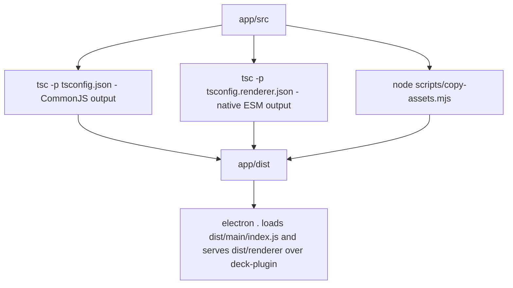
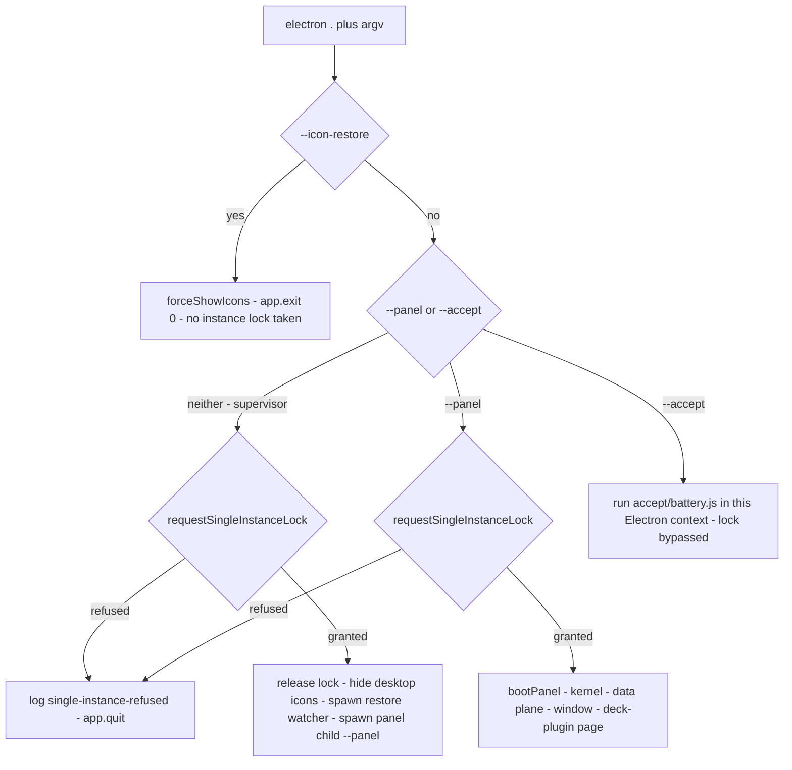

# Build, run and develop locally

<!-- openwiki: broken internal link [/repo://README.md#L11-L19] file "/repo://README.md" does not exist. Fix the href or restore the target, then delete this comment. -->
The panel is run **from a checkout** — there is no packaging step and no installer, and `dist/` is the only build product ([README](/repo://README.md#L11-L19)). Everything below happens from `app/`:

```
cd app
npm install
npm run dev
```

<!-- openwiki: broken internal link [/repo://.gitignore#L18-L22] file "/repo://.gitignore" does not exist. Fix the href or restore the target, then delete this comment. -->
<!-- openwiki: broken internal link [/repo://app/package.json#L15-L24] file "/repo://app/package.json" does not exist. Fix the href or restore the target, then delete this comment. -->
<!-- openwiki: broken internal link [/repo://app/src/main/win32.ts#L1-L7] file "/repo://app/src/main/win32.ts" does not exist. Fix the href or restore the target, then delete this comment. -->
<!-- openwiki: broken internal link [/repo://app/src/main/autostart.ts#L131-L137] file "/repo://app/src/main/autostart.ts" does not exist. Fix the href or restore the target, then delete this comment. -->
<!-- openwiki: broken internal link [/repo://app/accept/lib/capture.ps1#L1-L19] file "/repo://app/accept/lib/capture.ps1" does not exist. Fix the href or restore the target, then delete this comment. -->
`npm install` is required in every working tree, because `app/node_modules` is untracked ([.gitignore](/repo://.gitignore#L18-L22)). `electron` is a devDependency (44.4.3) while `cordis` and `koffi` are runtime dependencies — the latter a native FFI binding, which is one of the reasons the application and its acceptance harness are Windows-only ([package.json](/repo://app/package.json#L15-L24), [win32.ts](/repo://app/src/main/win32.ts#L1-L7), [autostart.ts](/repo://app/src/main/autostart.ts#L131-L137), [capture.ps1](/repo://app/accept/lib/capture.ps1#L1-L19)).

## The local loop

| Command | What it runs | Notes |
|---|---|---|
| `npm run build` | `tsc -p tsconfig.json && tsc -p tsconfig.renderer.json && node scripts/copy-assets.mjs` | the whole build; no bundler and no watch mode |
| `npm run dev` | `npm run build && electron .` | the default entry: outer supervisor → icons hidden → panel |
| `npm run dev:panel` | `npm run build && electron . --panel` | skips the supervisor — for debugging |
| `npm run accept` | `npm run build && electron . --accept` | real-machine acceptance battery |
| `npm run typecheck` | `tsc -p tsconfig.typecheck.json` | no output; the only project that sees `src` and `tests` together |
| `npm test` | `vitest run` | offline suite; runs against `src` TypeScript, so it needs no build |

<!-- openwiki: broken internal link [/repo://app/package.json#L7-L14] file "/repo://app/package.json" does not exist. Fix the href or restore the target, then delete this comment. -->
<!-- openwiki: broken internal link [/repo://app/src/main/plugins/protocol.ts#L40-L58] file "/repo://app/src/main/plugins/protocol.ts" does not exist. Fix the href or restore the target, then delete this comment. -->
All six scripts are declared in [package.json](/repo://app/package.json#L7-L14); there is no `watch`, `start`, `package` or `publish` script. Because `dev`, `dev:panel` and `accept` each begin with `npm run build`, no launch path can start Electron against a stale `dist` — and because nothing watches or reloads, a source edit costs a full rebuild plus a relaunch. Protocol responses are served `no-store`, so a relaunch always picks up the freshly built assets ([protocol.ts](/repo://app/src/main/plugins/protocol.ts#L40-L58)).

## How the build is assembled



*Build pipeline: two independent `tsc` programs plus one copy step all write into the single `dist` tree that Electron and the privileged protocol read from.*

<!-- openwiki: broken internal link [/repo://.scratch/standalone-app/spec.md#L90] file "/repo://.scratch/standalone-app/spec.md" does not exist. Fix the href or restore the target, then delete this comment. -->
<!-- openwiki: broken internal link [/repo://.scratch/standalone-app/issues/02-panel-tracer.md#L55-L56] file "/repo://.scratch/standalone-app/issues/02-panel-tracer.md" does not exist. Fix the href or restore the target, then delete this comment. -->
There is deliberately **no bundler**. The decision is recorded as ticket 10 route (b): the renderer moved to native ES modules loaded through the custom `deck-plugin://` scheme, so `tsc` output is directly runnable and relative imports keep their `.js` suffix ([spec.md](/repo://.scratch/standalone-app/spec.md#L90), [02-panel-tracer.md](/repo://.scratch/standalone-app/issues/02-panel-tracer.md#L55-L56)). The earlier plan to introduce Vite never landed; its supersede note is kept in the issue file.

### What each tsconfig covers

<!-- openwiki: broken internal link [/repo://app/tsconfig.json#L1-L16] file "/repo://app/tsconfig.json" does not exist. Fix the href or restore the target, then delete this comment. -->
- **`tsconfig.json` — main, preload, shared.** `module: commonjs`, `target: es2022`, `outDir: dist`, `rootDir: src`, `strict: true`, `types: ["node"]`. `include` is `src/main/**/*.ts`, `src/preload/**/*.ts`, `src/shared/**/*.ts` — the Electron main-process side that runs under Node's CommonJS loader ([tsconfig.json](/repo://app/tsconfig.json#L1-L16)).
<!-- openwiki: broken internal link [/repo://app/tsconfig.renderer.json#L1-L16] file "/repo://app/tsconfig.renderer.json" does not exist. Fix the href or restore the target, then delete this comment. -->
<!-- openwiki: broken internal link [/repo://app/src/renderer/index.html#L413-L415] file "/repo://app/src/renderer/index.html" does not exist. Fix the href or restore the target, then delete this comment. -->
<!-- openwiki: broken internal link [/repo://app/src/main/plugins/protocol.ts#L31-L34] file "/repo://app/src/main/plugins/protocol.ts" does not exist. Fix the href or restore the target, then delete this comment. -->
<!-- openwiki: broken internal link [/repo://app/src/main/plugins/protocol.ts#L15-L28] file "/repo://app/src/main/plugins/protocol.ts" does not exist. Fix the href or restore the target, then delete this comment. -->
<!-- openwiki: broken internal link [/repo://app/src/main/plugins/assets.ts#L24-L39] file "/repo://app/src/main/plugins/assets.ts" does not exist. Fix the href or restore the target, then delete this comment. -->
- **`tsconfig.renderer.json` — renderer, shared.** Identical settings except `module: es2022`, so the emitted files are real ES modules. The renderer needs its own module target because it never runs under Node: the page is loaded as `deck-plugin://app/index.html` and starts from `<script type="module" src="./main.js">`, and every card entry is dynamically `import()`ed through the same scheme ([tsconfig.renderer.json](/repo://app/tsconfig.renderer.json#L1-L16), [index.html](/repo://app/src/renderer/index.html#L413-L415), [protocol.ts](/repo://app/src/main/plugins/protocol.ts#L31-L34)). The protocol must be registered with `standard`/`secure` privileges for that to be legal, and `.js` must be delivered as `text/javascript` or the module is refused ([protocol.ts](/repo://app/src/main/plugins/protocol.ts#L15-L28), [assets.ts](/repo://app/src/main/plugins/assets.ts#L24-L39)).
<!-- openwiki: broken internal link [/repo://app/tsconfig.typecheck.json#L1-L8] file "/repo://app/tsconfig.typecheck.json" does not exist. Fix the href or restore the target, then delete this comment. -->
- **`tsconfig.typecheck.json` — everything.** It extends the main config, sets `noEmit: true` and `rootDir: "."`, and includes `src/**/*.ts` plus `tests/**/*.ts`. Neither build project compiles the tests, so this is the only program that type-checks the renderer and the offline suite in one pass ([tsconfig.typecheck.json](/repo://app/tsconfig.typecheck.json#L1-L8)).

<!-- openwiki: broken internal link [/repo://app/src/renderer/main.ts#L1-L7] file "/repo://app/src/renderer/main.ts" does not exist. Fix the href or restore the target, then delete this comment. -->
<!-- openwiki: broken internal link [/repo://app/src/renderer/cards/clock/plugin.json#L1-L8] file "/repo://app/src/renderer/cards/clock/plugin.json" does not exist. Fix the href or restore the target, then delete this comment. -->
<!-- openwiki: broken internal link [/repo://app/tsconfig.json#L15] file "/repo://app/tsconfig.json" does not exist. Fix the href or restore the target, then delete this comment. -->
<!-- openwiki: broken internal link [/repo://app/tsconfig.renderer.json#L15] file "/repo://app/tsconfig.renderer.json" does not exist. Fix the href or restore the target, then delete this comment. -->
<!-- openwiki: broken internal link [/repo://app/src/main/plugins/manifest.ts#L3-L14] file "/repo://app/src/main/plugins/manifest.ts" does not exist. Fix the href or restore the target, then delete this comment. -->
One consequence of the split is worth knowing before touching the build. Relative specifiers are emitted verbatim, so renderer sources must import their siblings with an explicit extension (`./plugins.js`, `./format.js`, `../../plugins.js`), and card manifests declare `"entry": "./card.js"` — compare the extensionless imports in the main process ([main.ts](/repo://app/src/renderer/main.ts#L1-L7), [plugin.json](/repo://app/src/renderer/cards/clock/plugin.json#L1-L8)). And because `src/shared` is in *both* `include` lists while both programs write into the same `dist`, `dist/shared/contract.js` is emitted twice: the renderer project runs second, so the ES-module form is what lands on disk, even though the main process consumes that module as a value (`PLUGIN_CAPABILITIES`, used to validate plugin capabilities) and therefore reaches it through `require()` in the emitted main output ([tsconfig.json](/repo://app/tsconfig.json#L15), [tsconfig.renderer.json](/repo://app/tsconfig.renderer.json#L15), [manifest.ts](/repo://app/src/main/plugins/manifest.ts#L3-L14)). Every other main-side import of the contract is `import type` and is erased, which is what keeps the two emits from colliding in practice — that is a property of the current source, not something the build enforces.

### What the copy step adds

<!-- openwiki: broken internal link [/repo://app/scripts/copy-assets.mjs#L5-L28] file "/repo://app/scripts/copy-assets.mjs" does not exist. Fix the href or restore the target, then delete this comment. -->
`scripts/copy-assets.mjs` handles exactly what `tsc` cannot emit ([copy-assets.mjs](/repo://app/scripts/copy-assets.mjs#L5-L28)):

| Copied | To | Why it cannot be compiled |
|---|---|---|
| `src/renderer/index.html` | `dist/renderer/index.html` | HTML is the page itself; the protocol root is `dist/renderer` |
| `src/renderer/cards/<id>/plugin.json` | `dist/renderer/cards/<id>/plugin.json` | the manifest is a JSON contract, and the manifest is what makes a card visible at all |
| `src/main/icon-restore-watch.cjs` | `dist/main/icon-restore-watch.cjs` | a standalone plain-JS process launched with `ELECTRON_RUN_AS_NODE`; it `require`s `./icon-carry.js`, so it must sit next to the compiled module |
| `src/main/autostart.ps1` | `dist/main/autostart.ps1` | a PowerShell COM helper invoked as `spawnSync('powershell.exe', ['-File', path.join(__dirname, 'autostart.ps1'), …])` |

<!-- openwiki: broken internal link [/repo://app/src/main/plugins/manifest.ts#L71-L79] file "/repo://app/src/main/plugins/manifest.ts" does not exist. Fix the href or restore the target, then delete this comment. -->
<!-- openwiki: broken internal link [/repo://app/src/main/plugins/service.ts#L185-L219] file "/repo://app/src/main/plugins/service.ts" does not exist. Fix the href or restore the target, then delete this comment. -->
<!-- openwiki: broken internal link [/repo://app/package.json#L8] file "/repo://app/package.json" does not exist. Fix the href or restore the target, then delete this comment. -->
<!-- openwiki: broken internal link [/repo://app/scripts/copy-assets.mjs#L10-L19] file "/repo://app/scripts/copy-assets.mjs" does not exist. Fix the href or restore the target, then delete this comment. -->
<!-- openwiki: broken internal link [/repo://app/src/main/index.ts#L19-L26] file "/repo://app/src/main/index.ts" does not exist. Fix the href or restore the target, then delete this comment. -->
<!-- openwiki: broken internal link [/repo://app/src/main/plugins/watch.ts#L51-L69] file "/repo://app/src/main/plugins/watch.ts" does not exist. Fix the href or restore the target, then delete this comment. -->
<!-- openwiki: broken internal link [/repo://app/src/main/plugins/service.ts#L134-L165] file "/repo://app/src/main/plugins/service.ts" does not exist. Fix the href or restore the target, then delete this comment. -->
Two failure modes follow from that shape. A card directory whose `plugin.json` never reaches `dist` cannot mount: the host reads a directory without a manifest as a broken plugin — it appears in the snapshot with an `error` status and a sanitized fallback id, and is not instantiated ([manifest.ts](/repo://app/src/main/plugins/manifest.ts#L71-L79), [service.ts](/repo://app/src/main/plugins/service.ts#L185-L219)). And since **nothing in the build deletes anything** — `tsc` only emits, the copy script only writes, and `dist` is gitignored — a deleted or renamed card leaves its previous `card.js` and `plugin.json` behind under `dist/renderer/cards`, where the built-in plugin root still discovers it and mounts it as a component ([package.json](/repo://app/package.json#L8), [copy-assets.mjs](/repo://app/scripts/copy-assets.mjs#L10-L19), [index.ts](/repo://app/src/main/index.ts#L19-L26), [watch.ts](/repo://app/src/main/plugins/watch.ts#L51-L69), [service.ts](/repo://app/src/main/plugins/service.ts#L134-L165)). Removing `app/dist` by hand is the only cleanup path the repository offers.

## The dist layout the runtime depends on

<!-- openwiki: broken internal link [/repo://app/src/main/index.ts#L19-L26] file "/repo://app/src/main/index.ts" does not exist. Fix the href or restore the target, then delete this comment. -->
<!-- openwiki: broken internal link [/repo://app/src/main/panel-window.ts#L31-L36] file "/repo://app/src/main/panel-window.ts" does not exist. Fix the href or restore the target, then delete this comment. -->
The compiled output is an interface, not just an artifact: every runtime path is resolved relative to `dist/main`, so the layout below has to survive any build change ([index.ts](/repo://app/src/main/index.ts#L19-L26), [panel-window.ts](/repo://app/src/main/panel-window.ts#L31-L36)).

| Path | Produced by | Consumer |
|---|---|---|
| `dist/main/index.js` | main project | Electron's entry point (`"main"` in package.json): supervisor, panel and `--icon-restore` modes |
| `dist/main/dataplane.js` | main project | the worker module forked with `utilityProcess.fork` (`__dirname/dataplane.js`), which hosts the four collection services |
| `dist/main/icon-restore-watch.cjs`, `dist/main/autostart.ps1` | copy step | spawned/executed by the compiled siblings that reference them by `__dirname` |
| `dist/preload/index.js` | main project | `webPreferences.preload` of the panel window |
| `dist/renderer/index.html` | copy step | loaded as `deck-plugin://app/index.html` |
| `dist/renderer/main.js`, `plugins.js`, `format.js` | renderer project | the ES-module entry of the page |
| `dist/renderer/cards/<id>/card.js` | renderer project | dynamically imported as `deck-plugin://<id>/card.js?v=<revision>` |
| `dist/renderer/cards/<id>/plugin.json` | copy step | the manifest scanned at boot and on every rescan |
| `dist/shared/contract.js` | both projects | the single shared module (see the emit-order note above) |

<!-- openwiki: broken internal link [/repo://app/package.json#L6] file "/repo://app/package.json" does not exist. Fix the href or restore the target, then delete this comment. -->
<!-- openwiki: broken internal link [/repo://app/src/main/plugins/protocol.ts#L31-L34] file "/repo://app/src/main/plugins/protocol.ts" does not exist. Fix the href or restore the target, then delete this comment. -->
`electron .` loads `dist/main/index.js` and serves `dist/renderer` as the protocol root, so launching without a build leaves the panel with nothing to display ([package.json](/repo://app/package.json#L6), [protocol.ts](/repo://app/src/main/plugins/protocol.ts#L31-L34)).

## Entry modes and runtime flags

<!-- openwiki: broken internal link [/repo://app/src/main/index.ts#L27-L32] file "/repo://app/src/main/index.ts" does not exist. Fix the href or restore the target, then delete this comment. -->
Mode is chosen purely by `process.argv` at the top of [index.ts](/repo://app/src/main/index.ts#L27-L32):



*Entry dispatch: four modes, two of which take the single-instance lock and one of which deliberately does not.*

| Invocation | Mode | Instance lock | Effect |
|---|---|---|---|
| `electron .` (what `npm run dev` runs) | outer supervisor | requested, then explicitly released before the child is spawned | hides the native desktop icons, spawns the detached restore watcher, spawns the panel child as `electron <appPath> --panel`, waits for its exit, restores the icons |
| `electron . --panel` (`npm run dev:panel`) | panel | requested and held until exit | runs `bootPanel()`, which ends in `win.loadURL(panelUrl())` |
| `electron . --accept` (`npm run accept`) | acceptance | bypassed by construction — both lock branches are guarded by `!ACCEPT_MODE` | installs an empty `window-all-closed` handler and runs `accept/battery.js` inside this Electron app context |
| `npx electron . --icon-restore` | one-shot | not taken | `forceShowIcons`, then `app.exit(0)`; safe to run while a panel is resident |

<!-- openwiki: broken internal link [/repo://app/src/main/index.ts#L183-L199] file "/repo://app/src/main/index.ts" does not exist. Fix the href or restore the target, then delete this comment. -->
<!-- openwiki: broken internal link [/repo://app/src/main/index.ts#L235-L239] file "/repo://app/src/main/index.ts" does not exist. Fix the href or restore the target, then delete this comment. -->
<!-- openwiki: broken internal link [/repo://app/src/main/index.ts#L173] file "/repo://app/src/main/index.ts" does not exist. Fix the href or restore the target, then delete this comment. -->
<!-- openwiki: broken internal link [/repo://app/accept/battery.js#L1667-L1696] file "/repo://app/accept/battery.js" does not exist. Fix the href or restore the target, then delete this comment. -->
The lock handoff is deliberate and is the reason a second launch is refused in milliseconds rather than being queued behind a dying process: the supervisor takes the lock, releases it before spawning (a residual lock would make the freshly spawned panel look like a second instance), and the panel child takes it again and keeps it for its whole life ([index.ts](/repo://app/src/main/index.ts#L183-L199), [index.ts](/repo://app/src/main/index.ts#L235-L239)). A refused launch logs `single-instance-refused` and exits 0, while the *running* process receives Electron's `second-instance` event and re-shows the panel — so starting the app again is the same as invoking the panel from the tray ([index.ts](/repo://app/src/main/index.ts#L173), [battery.js](/repo://app/accept/battery.js#L1667-L1696)).

<!-- openwiki: broken internal link [/repo://app/src/main/index.ts#L34-L113] file "/repo://app/src/main/index.ts" does not exist. Fix the href or restore the target, then delete this comment. -->
<!-- openwiki: broken internal link [/repo://app/src/main/services/dataplane.ts#L11-L64] file "/repo://app/src/main/services/dataplane.ts" does not exist. Fix the href or restore the target, then delete this comment. -->
<!-- openwiki: broken internal link [/repo://app/src/main/index.ts#L19] file "/repo://app/src/main/index.ts" does not exist. Fix the href or restore the target, then delete this comment. -->
<!-- openwiki: broken internal link [/repo://app/src/main/index.ts#L36-L49] file "/repo://app/src/main/index.ts" does not exist. Fix the href or restore the target, then delete this comment. -->
<!-- openwiki: broken internal link [/repo://README.md#L21] file "/repo://README.md" does not exist. Fix the href or restore the target, then delete this comment. -->
<!-- openwiki: broken internal link [/repo://app/src/main/config.ts#L117-L138] file "/repo://app/src/main/config.ts" does not exist. Fix the href or restore the target, then delete this comment. -->
<!-- openwiki: broken internal link [/repo://app/src/main/paths.ts#L1-L14] file "/repo://app/src/main/paths.ts" does not exist. Fix the href or restore the target, then delete this comment. -->
`bootPanel()` runs in this order: load or generate `app/config.json`, apply the autostart decision, migrate any legacy usage log, create and start the panel kernel, wait for the data plane's first snapshot, install the protocol handler, create the window, wire the bridge and host IPC, create the tray, and finally load the page. The first-snapshot wait has a 15 s cap and releases on timeout, so a broken data plane cannot block the desktop ([index.ts](/repo://app/src/main/index.ts#L34-L113), [services/dataplane.ts](/repo://app/src/main/services/dataplane.ts#L11-L64)). The first run writes `app/config.json` next to `package.json` — `CONFIG_FILE` is `app.getAppPath()/config.json` — seeded from the current display geometry, with invalid fields falling back to defaults and warning rather than being silently ignored ([index.ts](/repo://app/src/main/index.ts#L19), [index.ts](/repo://app/src/main/index.ts#L36-L49), [README](/repo://README.md#L21), [config.ts](/repo://app/src/main/config.ts#L117-L138)). Runtime state — the placement store `layout.json` and `usage/` — lives under Electron's `userData`, never in the code directory ([paths.ts](/repo://app/src/main/paths.ts#L1-L14)).

<!-- openwiki: broken internal link [/repo://app/src/main/panel-ipc.ts#L9-L24] file "/repo://app/src/main/panel-ipc.ts" does not exist. Fix the href or restore the target, then delete this comment. -->
One environment variable matters for development: `DECK_EVENT_LOG` turns the main process into a JSONL recorder, appending one line per notable event (best-effort, never fatal) ([panel-ipc.ts](/repo://app/src/main/panel-ipc.ts#L9-L24)). It is unset in normal development runs and pointed at `accept/evidence/03-runtime-events.jsonl` by the battery.

<!-- openwiki: broken internal link [/repo://app/src/main/tray.ts#L35-L43] file "/repo://app/src/main/tray.ts" does not exist. Fix the href or restore the target, then delete this comment. -->
<!-- openwiki: broken internal link [/repo://app/src/main/index.ts#L200-L218] file "/repo://app/src/main/index.ts" does not exist. Fix the href or restore the target, then delete this comment. -->
Normal teardown is the tray menu item `退出面板`, which calls `app.quit()`; the supervisor then restores the desktop icons and exits ([tray.ts](/repo://app/src/main/tray.ts#L35-L43)). Killing the console instead takes guard and panel down together before any in-process restore hook runs, which is what the detached restore watcher exists for ([index.ts](/repo://app/src/main/index.ts#L200-L218)); see [recovery and diagnostics](/openwiki/operations/recovery-and-diagnostics.md) for that chain and the `--icon-restore` self-help path.

## Running the acceptance battery

<!-- openwiki: broken internal link [/repo://app/accept/battery.js#L498-L502] file "/repo://app/accept/battery.js" does not exist. Fix the href or restore the target, then delete this comment. -->
<!-- openwiki: broken internal link [/repo://app/accept/battery.js#L1-L18] file "/repo://app/accept/battery.js" does not exist. Fix the href or restore the target, then delete this comment. -->
`npm run accept` is the real-machine path: the battery is a controller that **spawns its own panels** (`spawn(process.execPath, ['.'], { cwd: APP_ROOT, env: { … DECK_EVENT_LOG } })`, i.e. the supervisor entry, so the whole spawn chain is under test) and drives them through its own Win32 bindings rather than through production modules ([battery.js](/repo://app/accept/battery.js#L498-L502), [battery.js](/repo://app/accept/battery.js#L1-L18)).

It is not sandboxed, and that is the point:

- it hides and later restores the native desktop icons, and falls back to `--icon-restore` at teardown when it killed the panel tree too hard for the guard's own restore path;
- it backs up and restores `app/config.json` (the search section is deliberately pointed at a dead port to exercise the engine-offline path) and seeds, then restores, the placement store in `userData`;
<!-- openwiki: broken internal link [/repo://app/accept/battery.js#L462-L505] file "/repo://app/accept/battery.js" does not exist. Fix the href or restore the target, then delete this comment. -->
<!-- openwiki: broken internal link [/repo://app/accept/battery.js#L561-L566] file "/repo://app/accept/battery.js" does not exist. Fix the href or restore the target, then delete this comment. -->
<!-- openwiki: broken internal link [/repo://app/accept/battery.js#L1416-L1437] file "/repo://app/accept/battery.js" does not exist. Fix the href or restore the target, then delete this comment. -->
<!-- openwiki: broken internal link [/repo://app/accept/battery.js#L2199-L2244] file "/repo://app/accept/battery.js" does not exist. Fix the href or restore the target, then delete this comment. -->
- it moves the real cursor and injects real clicks and drags, so it needs a clean desktop and will disturb whatever the user has open ([battery.js](/repo://app/accept/battery.js#L462-L505), [battery.js](/repo://app/accept/battery.js#L561-L566), [battery.js](/repo://app/accept/battery.js#L1416-L1437), [battery.js](/repo://app/accept/battery.js#L2199-L2244)).

<!-- openwiki: broken internal link [/repo://app/accept/lib/report.js#L5-L31] file "/repo://app/accept/lib/report.js" does not exist. Fix the href or restore the target, then delete this comment. -->
<!-- openwiki: broken internal link [/repo://app/accept/battery.js#L2247-L2255] file "/repo://app/accept/battery.js" does not exist. Fix the href or restore the target, then delete this comment. -->
<!-- openwiki: broken internal link [/repo://README.md#L101-L105] file "/repo://README.md" does not exist. Fix the href or restore the target, then delete this comment. -->
Evidence is written into the repository under `app/accept/evidence/`: a `03-battery.log.txt` verdict log plus screenshots, with the runtime event log beside them ([report.js](/repo://app/accept/lib/report.js#L5-L31)). The process exit code is the verdict — `0` pass, `1` fail, `2` crash — so a failing run is visible to a caller without reading the log ([battery.js](/repo://app/accept/battery.js#L2247-L2255)). Visual alignment is still a manual check, and the autostart behaviour needs a real reboot to confirm ([README](/repo://README.md#L101-L105)).

<!-- openwiki: broken internal link [/repo://app/src/main/index.ts#L239-L247] file "/repo://app/src/main/index.ts" does not exist. Fix the href or restore the target, then delete this comment. -->
<!-- openwiki: broken internal link [/repo://app/tsconfig.typecheck.json#L1-L8] file "/repo://app/tsconfig.typecheck.json" does not exist. Fix the href or restore the target, then delete this comment. -->
The battery is hand-written plain JavaScript (`accept/battery.js` and `accept/lib/*`); no project compiles it and `tsconfig.typecheck.json` does not include it, so `--accept` simply `require`s it at runtime and the battery's only verification is the run itself ([index.ts](/repo://app/src/main/index.ts#L239-L247), [tsconfig.typecheck.json](/repo://app/tsconfig.typecheck.json#L1-L8)).

## Offline verification next to the build

<!-- openwiki: broken internal link [/repo://app/package.json#L10] file "/repo://app/package.json" does not exist. Fix the href or restore the target, then delete this comment. -->
<!-- openwiki: broken internal link [/repo://app/tests/wind-restore.spec.ts#L1-L3] file "/repo://app/tests/wind-restore.spec.ts" does not exist. Fix the href or restore the target, then delete this comment. -->
<!-- openwiki: broken internal link [/repo://app/tests/contract.spec.ts#L1-L10] file "/repo://app/tests/contract.spec.ts" does not exist. Fix the href or restore the target, then delete this comment. -->
<!-- openwiki: broken internal link [/repo://app/tests/contract.spec.ts#L529-L534] file "/repo://app/tests/contract.spec.ts" does not exist. Fix the href or restore the target, then delete this comment. -->
<!-- openwiki: broken internal link [/repo://app/tests/contract.spec.ts#L595-L609] file "/repo://app/tests/contract.spec.ts" does not exist. Fix the href or restore the target, then delete this comment. -->
`npm test` needs no build and no Electron: the specs import `../src/...` directly and run under `vitest` with no config file, so the suite exercises the TypeScript sources rather than `dist` ([package.json](/repo://app/package.json#L10), [wind-restore.spec.ts](/repo://app/tests/wind-restore.spec.ts#L1-L3), [contract.spec.ts](/repo://app/tests/contract.spec.ts#L1-L10)). Part of that suite is a set of source-level guards that read repository files and fail when an architectural boundary is crossed — the renderer and preload sources must not reach for `node:fs`, and the search chain must not touch the usage log or hard-code URLs ([contract.spec.ts](/repo://app/tests/contract.spec.ts#L529-L534), [contract.spec.ts](/repo://app/tests/contract.spec.ts#L595-L609)). Those guards are why moving or renaming one of the files they scan shows up as a test failure.

What the offline suite cannot see is everything Electron- or Win32-only: the `utilityProcess` glue, hotzones and pinning, icon carry, single-instance admission, the privileged protocol, and the build configuration itself (no test asserts on `tsconfig*.json` or the `scripts` block). Those are covered by the battery — its coverage map is in [acceptance battery](/openwiki/testing/acceptance-battery.md), and the split is discussed in [testing strategy](/openwiki/testing/testing-strategy.md).

## Parallel worktrees and remote branches

<!-- openwiki: broken internal link [/repo://AGENTS.md#L5-L13] file "/repo://AGENTS.md" does not exist. Fix the href or restore the target, then delete this comment. -->
The repository's own rules for running more than one checkout at a time ([AGENTS.md](/repo://AGENTS.md#L5-L13)):

<!-- openwiki: broken internal link [/repo://AGENTS.md#L7] file "/repo://AGENTS.md" does not exist. Fix the href or restore the target, then delete this comment. -->
<!-- openwiki: broken internal link [/repo://README.md#L73-L81] file "/repo://README.md" does not exist. Fix the href or restore the target, then delete this comment. -->
- The **main checkout** is `D:\local_works\agent-deck`, sits on `master` and stays pushable. The machine's autostart points at *that* checkout's `app/`; worktrees get deleted, so the Startup shortcut must never point at one ([AGENTS.md](/repo://AGENTS.md#L7), [README](/repo://README.md#L73-L81)).
<!-- openwiki: broken internal link [/repo://AGENTS.md#L8] file "/repo://AGENTS.md" does not exist. Fix the href or restore the target, then delete this comment. -->
- Feature worktrees live at `D:\local_works\agent-deck-wt\<slug>` on branch `feat/<slug>`. Because the panel is single-instance (a second launch exits), parallel worktrees must not each keep a resident panel alive; real-machine acceptance uses `npm run accept`, whose acceptance mode bypasses the lock and can coexist with a running panel ([AGENTS.md](/repo://AGENTS.md#L8)).
- The full start/finish flow — creating the tree, bootstrapping the environment, self-checking with the tests, merging and cleaning up — is owned by the `agent-deck-worktree` skill that AGENTS.md points to.
<!-- openwiki: broken internal link [/repo://AGENTS.md#L13] file "/repo://AGENTS.md" does not exist. Fix the href or restore the target, then delete this comment. -->
- **Remote branch discipline:** before deleting a remote branch (`git push origin --delete <branch>` and the like) you must have explicit user confirmation, and without it you must not delete branches in the gh repository that the user did not check out themselves. Local `git branch -d` is not restricted ([AGENTS.md](/repo://AGENTS.md#L13)).

## What to change together

<!-- openwiki: broken internal link [/repo://app/scripts/copy-assets.mjs#L10-L19] file "/repo://app/scripts/copy-assets.mjs" does not exist. Fix the href or restore the target, then delete this comment. -->
- **A new built-in card** is `src/renderer/cards/<id>/card.ts` plus a `plugin.json` with `entry: "./card.js"`; the renderer project compiles the entry and the copy step places the manifest, so both must exist before a rebuild produces a mountable component ([copy-assets.mjs](/repo://app/scripts/copy-assets.mjs#L10-L19), [plugin-host](/openwiki/architecture/plugin-host.md)).
- **A new renderer module** is imported with its `.js` extension; forgetting it produces a module-resolution failure at runtime, not at build time.
<!-- openwiki: broken internal link [/repo://app/scripts/copy-assets.mjs#L20-L28] file "/repo://app/scripts/copy-assets.mjs" does not exist. Fix the href or restore the target, then delete this comment. -->
- **A new non-TS runtime asset** needs a line in `scripts/copy-assets.mjs` and a `__dirname`-relative reference from the compiled file that consumes it — that is the pattern the restore watcher and the PowerShell helper already follow ([copy-assets.mjs](/repo://app/scripts/copy-assets.mjs#L20-L28)).
- **Deleting or renaming a card** requires clearing the stale output by hand; nothing in the build prunes `dist`.
<!-- openwiki: broken internal link [/repo://app/accept/battery.js#L27-L38] file "/repo://app/accept/battery.js" does not exist. Fix the href or restore the target, then delete this comment. -->
- **Changing the page's geometry** means changing `src/renderer/index.html` and the battery's DIP constants together, or the battery's probes miss their targets ([battery.js](/repo://app/accept/battery.js#L27-L38)).

## Where to go next

- First-time setup and orientation: [quickstart](/openwiki/quickstart.md).
- How the built tree is actually run and kept alive: [process lifecycle and windowing](/openwiki/architecture/process-lifecycle-and-windowing.md).
- Failure handling for the icon/autostart chain: [recovery and diagnostics](/openwiki/operations/recovery-and-diagnostics.md), [desktop icon carry and autostart](/openwiki/architecture/desktop-icon-carry-and-autostart.md).
- Verification layers: [testing strategy](/openwiki/testing/testing-strategy.md), [acceptance battery](/openwiki/testing/acceptance-battery.md).
- The plugin contract that the renderer build serves: [plugin host](/openwiki/architecture/plugin-host.md).
