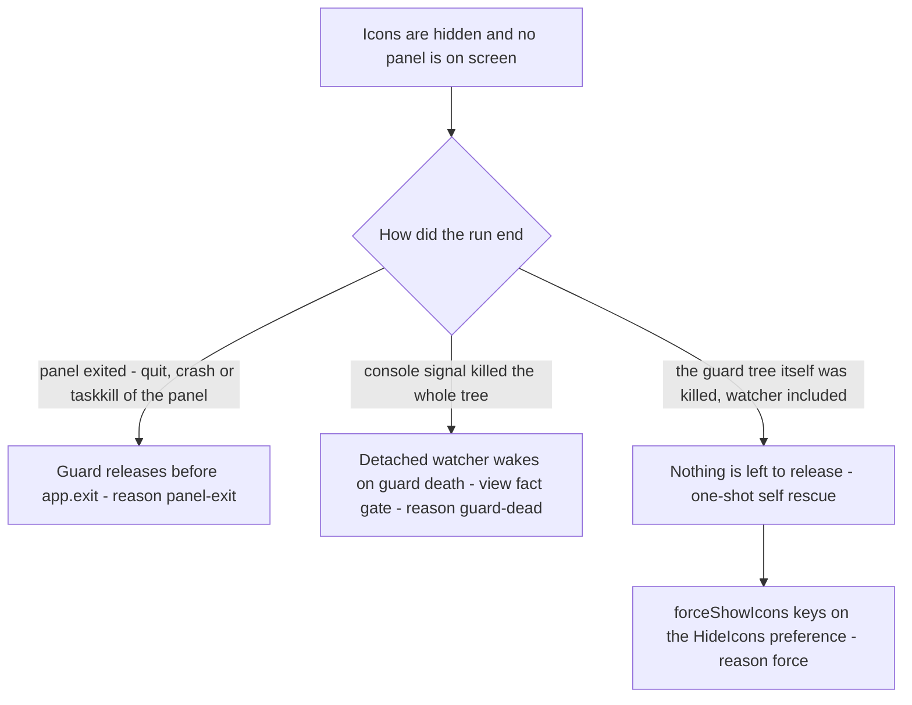
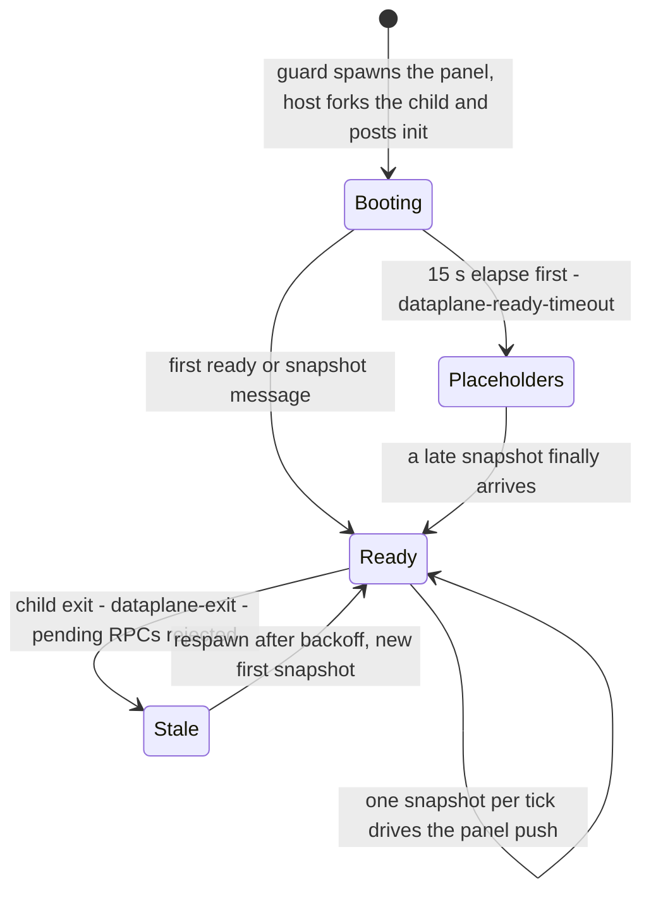

# Recovery and diagnostics playbook

This page is the failure playbook. Every row below names a symptom you can actually observe, the code path that produces it, the evidence line that proves which case you are in, and the remedy. Commands and config edits are the **user-facing remedies**; code paths, event names and payload fields are the **code-level diagnosis** that tells you whether that remedy applies at all.

Two prerequisites shape almost everything here:

<!-- openwiki: broken internal link [/repo://app/src/main/panel-ipc.ts#L9-L24] file "/repo://app/src/main/panel-ipc.ts" does not exist. Fix the href or restore the target, then delete this comment. -->
<!-- openwiki: broken internal link [/repo://app/package.json#L7-L14] file "/repo://app/package.json" does not exist. Fix the href or restore the target, then delete this comment. -->
- **The evidence log is opt-in.** Without `DECK_EVENT_LOG` the main process has no log object at all and a normal development run writes nothing ([panel-ipc.ts](/repo://app/src/main/panel-ipc.ts#L9-L24), [package.json](/repo://app/package.json#L7-L14)). Turn it on before reproducing a failure.
- **The architecture pages own the mechanisms.** This page does not restate them: process topology and the recall paths are in [process lifecycle and windowing](/openwiki/architecture/process-lifecycle-and-windowing.md), icon carry and the Startup decision table in [desktop icon carry and Startup autostart](/openwiki/architecture/desktop-icon-carry-and-autostart.md), the data-plane host in [data service](/openwiki/architecture/data-service.md), and the engine link policy in [search panel](/openwiki/architecture/search-panel.md).

## Turning on the evidence log

<!-- openwiki: broken internal link [/repo://app/src/main/panel-ipc.ts#L14-L24] file "/repo://app/src/main/panel-ipc.ts" does not exist. Fix the href or restore the target, then delete this comment. -->
`fileEventLog(process.env.DECK_EVENT_LOG)` returns `null` when the variable is unset; when it is set it creates the parent directory and appends one JSON line per event, `{"t": <epoch ms>, "type": …}`, swallowing write failures so logging can never affect the panel ([panel-ipc.ts](/repo://app/src/main/panel-ipc.ts#L14-L24)).

```powershell
cd app
$env:DECK_EVENT_LOG = "$PWD\evidence\events.jsonl"
npm run dev            # guard + panel + renderer, interleaved in one file
```

<!-- openwiki: broken internal link [/repo://app/src/main/index.ts#L195-L223] file "/repo://app/src/main/index.ts" does not exist. Fix the href or restore the target, then delete this comment. -->
<!-- openwiki: broken internal link [/repo://app/src/main/panel-ipc.ts#L63-L65] file "/repo://app/src/main/panel-ipc.ts" does not exist. Fix the href or restore the target, then delete this comment. -->
<!-- openwiki: broken internal link [/repo://app/src/renderer/main.ts#L17-L19] file "/repo://app/src/renderer/main.ts" does not exist. Fix the href or restore the target, then delete this comment. -->
- **One variable covers the whole tree.** The guard writes `carry-boot`, `icons-*`, `restore-watch-*`, `single-instance-refused` and `carry-exit`; it spawns the panel with `env: process.env`, so the panel inherits the same path and writes `boot`, `autostart-*`, `dataplane-*`, `usage-*`, `pin`, `quit`; the renderer's `notify` records arrive through `deck:host-notify` and land in the same file ([index.ts](/repo://app/src/main/index.ts#L195-L223), [panel-ipc.ts](/repo://app/src/main/panel-ipc.ts#L63-L65), [renderer main.ts](/repo://app/src/renderer/main.ts#L17-L19)). Sort by `t` rather than by file position when a guard line and a panel line interleave.
<!-- openwiki: broken internal link [/repo://app/package.json#L13] file "/repo://app/package.json" does not exist. Fix the href or restore the target, then delete this comment. -->
<!-- openwiki: broken internal link [/repo://app/src/main/index.ts#L183-L199] file "/repo://app/src/main/index.ts" does not exist. Fix the href or restore the target, then delete this comment. -->
- **`npm run dev:panel` writes only the panel half** — no guard, so no carry events, because `--panel` skips the icon duty entirely ([package.json](/repo://app/package.json#L13), [index.ts](/repo://app/src/main/index.ts#L183-L199)).
<!-- openwiki: broken internal link [/repo://app/src/main/index.ts#L176-L182] file "/repo://app/src/main/index.ts" does not exist. Fix the href or restore the target, then delete this comment. -->
- **`npx electron . --icon-restore` honours the same variable** and adds `carry-boot` with `mode: 'restore'` plus the restore outcome ([index.ts](/repo://app/src/main/index.ts#L176-L182)).
<!-- openwiki: broken internal link [/repo://app/accept/battery.js#L498-L502] file "/repo://app/accept/battery.js" does not exist. Fix the href or restore the target, then delete this comment. -->
<!-- openwiki: broken internal link [/repo://app/accept/evidence/03-battery.log.txt#L1-L10] file "/repo://app/accept/evidence/03-battery.log.txt" does not exist. Fix the href or restore the target, then delete this comment. -->
- **A reference sample already exists.** `npm run accept` points the variable at `app/accept/evidence/` and writes `03-runtime-events.jsonl` beside a human-readable verdict log; those files are the fastest way to see what a healthy sequence looks like ([battery.js](/repo://app/accept/battery.js#L498-L502), [03-battery.log.txt](/repo://app/accept/evidence/03-battery.log.txt#L1-L10)).

Three reading rules that save time:

<!-- openwiki: broken internal link [/repo://app/src/main/icon-carry.ts#L102-L116] file "/repo://app/src/main/icon-carry.ts" does not exist. Fix the href or restore the target, then delete this comment. -->
1. **Trust the payload, not the event name.** `icons-restored` is emitted even when the restore path decided there was nothing to toggle; only `prefHiddenAfter` / `viewVisibleAfter` tell you the resulting state ([icon-carry.ts](/repo://app/src/main/icon-carry.ts#L102-L116)).
<!-- openwiki: broken internal link [/repo://app/src/main/services/dataplane.ts#L67-L76] file "/repo://app/src/main/services/dataplane.ts" does not exist. Fix the href or restore the target, then delete this comment. -->
<!-- openwiki: broken internal link [/repo://app/accept/evidence/03-runtime-events.jsonl#L6] file "/repo://app/accept/evidence/03-runtime-events.jsonl" does not exist. Fix the href or restore the target, then delete this comment. -->
2. **`dataplane-spawn` usually carries no `pid`.** The child pid is still undefined when the line is written, so `JSON.stringify` drops the field — every recorded `dataplane-spawn` line carries only `reason`. Identify the child by `serviceName: 'deck-dataplane'` in a process listing instead of scanning the log for a number ([services/dataplane.ts](/repo://app/src/main/services/dataplane.ts#L67-L76), [03-runtime-events.jsonl](/repo://app/accept/evidence/03-runtime-events.jsonl#L6)).
<!-- openwiki: broken internal link [/repo://app/src/main/icon-restore-watch.cjs#L31-L38] file "/repo://app/src/main/icon-restore-watch.cjs" does not exist. Fix the href or restore the target, then delete this comment. -->
3. **Silence is evidence too.** The detached restore watcher is handed a `null` log, so a `guard-dead` restore appears only as a changed desktop state ([icon-restore-watch.cjs](/repo://app/src/main/icon-restore-watch.cjs#L31-L38)). Likewise the search kernel has no evidence hook of its own; the renderer's `search-*` records are the only trace.

### The console stream

<!-- openwiki: broken internal link [/repo://app/src/main/index.ts#L219-L223] file "/repo://app/src/main/index.ts" does not exist. Fix the href or restore the target, then delete this comment. -->
<!-- openwiki: broken internal link [/repo://app/src/main/services/dataplane.ts#L68-L71] file "/repo://app/src/main/services/dataplane.ts" does not exist. Fix the href or restore the target, then delete this comment. -->
The guard spawns the panel with `stdio: 'inherit'`, and the data-plane child is forked with `stdio: 'inherit'` as well, so the whole tree shares one console ([index.ts](/repo://app/src/main/index.ts#L219-L223), [services/dataplane.ts](/repo://app/src/main/services/dataplane.ts#L68-L71)). These prefixes are the second observability surface and they appear with no environment variable set:

| Line prefix | Emitted by | Read it as |
|---|---|---|
<!-- openwiki: broken internal link [/repo://app/src/main/index.ts#L46-L48] file "/repo://app/src/main/index.ts" does not exist. Fix the href or restore the target, then delete this comment. -->
<!-- openwiki: broken internal link [/repo://app/src/main/config.ts#L117-L138] file "/repo://app/src/main/config.ts" does not exist. Fix the href or restore the target, then delete this comment. -->
| `[deck] <warning>` | `loadConfig` warnings and boot fallbacks | an illegal `config.json` field was replaced by its default; the panel kept running with the default ([index.ts](/repo://app/src/main/index.ts#L46-L48), [config.ts](/repo://app/src/main/config.ts#L117-L138)) |
| `[deck] config.json 不存在…` | first run | the file was just generated from the current screen geometry |
<!-- openwiki: broken internal link [/repo://app/src/main/icon-carry.ts#L96-L99] file "/repo://app/src/main/icon-carry.ts" does not exist. Fix the href or restore the target, then delete this comment. -->
| `[deck] 原生图标隐藏失败…` | `IconCarry.begin` | `SHELLDLL_DefView` was unreachable; the panel runs in the two-desktop degrade ([icon-carry.ts](/repo://app/src/main/icon-carry.ts#L96-L99)) |
<!-- openwiki: broken internal link [/repo://app/src/main/index.ts#L54-L83] file "/repo://app/src/main/index.ts" does not exist. Fix the href or restore the target, then delete this comment. -->
| `[deck] 自启项处理失败:` / `[deck] 使用日志迁移失败:` | `bootPanel` catch blocks | the Startup folder threw (e.g. `APPDATA` unset) or the migration threw; boot continues ([index.ts](/repo://app/src/main/index.ts#L54-L83)) |
<!-- openwiki: broken internal link [/repo://app/src/main/scanners/index.ts#L48-L50] file "/repo://app/src/main/scanners/index.ts" does not exist. Fix the href or restore the target, then delete this comment. -->
| `agent-sessions: <tool> 扫描失败，跳过` | `collectSessions` | one tool's session source is unreadable; the other four keep working ([scanners/index.ts](/repo://app/src/main/scanners/index.ts#L48-L50)) |
<!-- openwiki: broken internal link [/repo://app/src/main/services/sessions.ts#L25-L28] file "/repo://app/src/main/services/sessions.ts" does not exist. Fix the href or restore the target, then delete this comment. -->
| `deck-sessions: 本轮扫描失败，给空表` | sessions service | the whole round failed; the list is emptied rather than cached ([sessions.ts](/repo://app/src/main/services/sessions.ts#L25-L28)) |
<!-- openwiki: broken internal link [/repo://app/src/main/services/desktop.ts#L107-L109] file "/repo://app/src/main/services/desktop.ts" does not exist. Fix the href or restore the target, then delete this comment. -->
| `deck-desktop: 本轮扫描失败，沿用上一轮条目` | desktop service | deliberately different from sessions: the previous item pool is kept ([desktop.ts](/repo://app/src/main/services/desktop.ts#L107-L109)) |
<!-- openwiki: broken internal link [/repo://app/src/main/services/desktop.ts#L198] file "/repo://app/src/main/services/desktop.ts" does not exist. Fix the href or restore the target, then delete this comment. -->
| `deck-desktop: 摆位落盘失败…` | desktop service | the drag was applied in memory but `layout.json` was not written ([desktop.ts](/repo://app/src/main/services/desktop.ts#L198)) |
<!-- openwiki: broken internal link [/repo://app/src/main/services/usage.ts#L55] file "/repo://app/src/main/services/usage.ts" does not exist. Fix the href or restore the target, then delete this comment. -->
| `deck-usage: 冷启动先验读取失败…` | usage service | the UserAssist prior was skipped; scoring continues without it ([usage.ts](/repo://app/src/main/services/usage.ts#L55)) |
<!-- openwiki: broken internal link [/repo://app/src/main/services/search.ts#L195-L207] file "/repo://app/src/main/services/search.ts" does not exist. Fix the href or restore the target, then delete this comment. -->
| `deck-search: 引擎响应异常，等下次输入` | search service | engine reachable but misbehaving — explicitly **not** offline ([search.ts](/repo://app/src/main/services/search.ts#L195-L207)) |
<!-- openwiki: broken internal link [/repo://app/src/main/services/focus.ts#L67-L72] file "/repo://app/src/main/services/focus.ts" does not exist. Fix the href or restore the target, then delete this comment. -->
| `deck-focus: 窗口枚举失败，降级为仅启动…` | focus service | window discovery failed, so a session row can only launch, not focus ([focus.ts](/repo://app/src/main/services/focus.ts#L67-L72)) |
<!-- openwiki: broken internal link [/repo://app/src/main/plugins/service.ts#L175-L207] file "/repo://app/src/main/plugins/service.ts" does not exist. Fix the href or restore the target, then delete this comment. -->
| `deck-plugins: …` | plugin host | a plugin was skipped or unloaded after a throwing hook ([service.ts](/repo://app/src/main/plugins/service.ts#L175-L207)) |

## Symptom → cause → code path → evidence

### Panel and window

| Symptom | Cause | Code path | Evidence to look for | Remedy |
|---|---|---|---|---|
<!-- openwiki: broken internal link [/repo://app/src/main/index.ts#L116-L122] file "/repo://app/src/main/index.ts" does not exist. Fix the href or restore the target, then delete this comment. -->
| No panel on screen, tray icon present | the panel is minimized or hidden, or it is simply covered: it is pinned to the bottom layer on purpose, so an ordinary window legitimately sits above it | `showPanel(reason)` in [index.ts](/repo://app/src/main/index.ts#L116-L122) | `panel-shown {reason: 'tray-click'}` plus `pin {reason: 'show-tray-click'}` | left-click the tray icon; see [recalling a covered panel](#recalling-a-panel-that-is-behind-other-windows) |
<!-- openwiki: broken internal link [/repo://app/src/main/index.ts#L189-L192] file "/repo://app/src/main/index.ts" does not exist. Fix the href or restore the target, then delete this comment. -->
<!-- openwiki: broken internal link [/repo://app/src/main/index.ts#L235-L239] file "/repo://app/src/main/index.ts" does not exist. Fix the href or restore the target, then delete this comment. -->
| Nothing appears at all and the process exits with code 0 in milliseconds | single-instance admission: another panel — possibly a debug `--panel` run in another worktree — holds the lock | [index.ts](/repo://app/src/main/index.ts#L189-L192), [index.ts](/repo://app/src/main/index.ts#L235-L239) | `single-instance-refused {pid}` in the refused process | use the tray icon of the panel that is already running; only one panel per machine, and `--accept` bypasses the lock by design |
<!-- openwiki: broken internal link [/repo://app/src/main/index.ts#L111-L113] file "/repo://app/src/main/index.ts" does not exist. Fix the href or restore the target, then delete this comment. -->
<!-- openwiki: broken internal link [/repo://app/src/main/index.ts#L171] file "/repo://app/src/main/index.ts" does not exist. Fix the href or restore the target, then delete this comment. -->
<!-- openwiki: broken internal link [/repo://app/src/renderer/main.ts#L738-L771] file "/repo://app/src/renderer/main.ts" does not exist. Fix the href or restore the target, then delete this comment. -->
| The window is there but blank/fully transparent and nothing is clickable | the renderer never executed — stale or missing `dist/renderer`, a protocol failure, or a script error | `installPluginProtocol` then `win.loadURL(panelUrl())`; the page declares hotzones at module end ([index.ts](/repo://app/src/main/index.ts#L111-L113), [index.ts](/repo://app/src/main/index.ts#L171), [renderer main.ts](/repo://app/src/renderer/main.ts#L738-L771)) | **zero `hotzones` lines after `boot`**, and possibly `snapshot-error` | `npm run build` (every launch script already builds first) and confirm `app/dist/renderer/index.html` exists; see [build and run](/openwiki/operations/build-and-run.md) |
| Values look wrong and a `[deck]` warning was printed at boot | an illegal `config.json` field silently fell back to its default | `loadConfig` merge functions | the warning text names the field and the default | correct the field in `app/config.json` and restart; geometry and port are boot-time values |
<!-- openwiki: broken internal link [/repo://app/src/main/index.ts#L113] file "/repo://app/src/main/index.ts" does not exist. Fix the href or restore the target, then delete this comment. -->
| Panel ignores a `config.panel` geometry edit | geometry is read once at boot and the window is neither movable nor resizable | [index.ts](/repo://app/src/main/index.ts#L113) | `boot` with a new pid | restart the panel |

### Native desktop icons: the three restore channels

Hiding is a *claim*; every restore path is the matching release. Three channels exist, and knowing which one owns a given death is the entire diagnosis.



*Which restore channel owns which death: the guard for a panel-only exit, the detached watcher for a console-signal kill, and `--icon-restore` for the residue where nothing survived.*

| Channel | Trigger | Test it applies | Evidence | Remedy when it did not fire |
|---|---|---|---|---|
<!-- openwiki: broken internal link [/repo://app/src/main/index.ts#L224-L233] file "/repo://app/src/main/index.ts" does not exist. Fix the href or restore the target, then delete this comment. -->
<!-- openwiki: broken internal link [/repo://app/src/main/icon-carry.ts#L102-L116] file "/repo://app/src/main/icon-carry.ts" does not exist. Fix the href or restore the target, then delete this comment. -->
| Guard release | the panel child exits for any reason (clean quit, crash, `taskkill /F` of the panel), a spawn failure, or the guard's own `before-quit` | "this run hid them" **and** still hidden | `icons-restored` / `icons-restore-failed` with reason `panel-exit`, `panel-spawn-failed` or `outer-quit`, plus `prefHiddenAfter` / `viewVisibleAfter` ([index.ts](/repo://app/src/main/index.ts#L224-L233), [icon-carry.ts](/repo://app/src/main/icon-carry.ts#L102-L116)) | start the panel again from a checkout: the guard hides on boot and releases on exit |
<!-- openwiki: broken internal link [/repo://app/src/main/index.ts#L209-L218] file "/repo://app/src/main/index.ts" does not exist. Fix the href or restore the target, then delete this comment. -->
<!-- openwiki: broken internal link [/repo://app/src/main/icon-restore-watch.cjs#L14-L38] file "/repo://app/src/main/icon-restore-watch.cjs" does not exist. Fix the href or restore the target, then delete this comment. -->
| Detached restore watcher | the guard **process object** signals — it waits in `WaitForSingleObject` on the handle, immune to pid reuse | view fact only: toggles only if the `SysListView32` is still hidden | silent (the watcher is handed a `null` log); `restore-watch-spawned` / `restore-watch-spawn-failed` prove only that it was launched ([index.ts](/repo://app/src/main/index.ts#L209-L218), [icon-restore-watch.cjs](/repo://app/src/main/icon-restore-watch.cjs#L14-L38)) | `npx electron . --icon-restore` |
<!-- openwiki: broken internal link [/repo://app/src/main/index.ts#L176-L182] file "/repo://app/src/main/index.ts" does not exist. Fix the href or restore the target, then delete this comment. -->
<!-- openwiki: broken internal link [/repo://app/src/main/icon-carry.ts#L137-L141] file "/repo://app/src/main/icon-carry.ts" does not exist. Fix the href or restore the target, then delete this comment. -->
| `--icon-restore` | a human or a script | registry preference: toggles only when `HideIcons` is `1` | `carry-boot {mode: 'restore'}` then `icons-restored` with reason `force` ([index.ts](/repo://app/src/main/index.ts#L176-L182), [icon-carry.ts](/repo://app/src/main/icon-carry.ts#L137-L141)) | check that explorer is alive and `SHELLDLL_DefView` is reachable at all |

Two traps worth memorising:

<!-- openwiki: broken internal link [/repo://app/src/main/icon-carry.ts#L66-L71] file "/repo://app/src/main/icon-carry.ts" does not exist. Fix the href or restore the target, then delete this comment. -->
<!-- openwiki: broken internal link [/repo://app/src/main/icon-carry.ts#L88-L100] file "/repo://app/src/main/icon-carry.ts" does not exist. Fix the href or restore the target, then delete this comment. -->
<!-- openwiki: broken internal link [/repo://app/src/main/icon-carry.ts#L105-L116] file "/repo://app/src/main/icon-carry.ts" does not exist. Fix the href or restore the target, then delete this comment. -->
- **A leftover hidden state is indistinguishable from a user preference.** Both are `HideIcons=1`, so the next guard run logs `icons-already-hidden`, records `hid = false`, and its later `icons-restored` performs no toggle at all. That is why the guard cannot repair this residue and why `--icon-restore` — keyed on the preference rather than on ownership — is the only channel that does ([icon-carry.ts](/repo://app/src/main/icon-carry.ts#L66-L71), [icon-carry.ts](/repo://app/src/main/icon-carry.ts#L88-L100), [icon-carry.ts](/repo://app/src/main/icon-carry.ts#L105-L116)).
<!-- openwiki: broken internal link [/repo://app/src/main/index.ts#L209-L218] file "/repo://app/src/main/index.ts" does not exist. Fix the href or restore the target, then delete this comment. -->
<!-- openwiki: broken internal link [/repo://.scratch/standalone-app/issues/05-desktop-carrying-tracer.md#L63] file "/repo://.scratch/standalone-app/issues/05-desktop-carrying-tracer.md" does not exist. Fix the href or restore the target, then delete this comment. -->
- **The watcher's trigger is the guard, not the panel.** It is born only when `didHide()` is true, has no console (so no signal reaches it) and is deliberately outside the Chromium job, but it is still a child of the guard tree: killing the whole tree with `taskkill /T` on the guard takes the watcher with it ([index.ts](/repo://app/src/main/index.ts#L209-L218), [.scratch/standalone-app/issues/05-desktop-carrying-tracer.md](/repo://.scratch/standalone-app/issues/05-desktop-carrying-tracer.md#L63)).

Two further observable states, neither of them a failure to repair:

| Observation | Meaning | Evidence |
|---|---|---|
<!-- openwiki: broken internal link [/repo://app/src/main/icon-carry.ts#L88-L100] file "/repo://app/src/main/icon-carry.ts" does not exist. Fix the href or restore the target, then delete this comment. -->
| Two desktops visible while the panel runs | the hide failed (`SHELLDLL_DefView` unreachable, e.g. a wedged explorer); the panel deliberately starts anyway | `icons-hide-failed` plus the console line ([icon-carry.ts](/repo://app/src/main/icon-carry.ts#L88-L100)) |
<!-- openwiki: broken internal link [/repo://app/src/main/icon-carry.ts#L88-L100] file "/repo://app/src/main/icon-carry.ts" does not exist. Fix the href or restore the target, then delete this comment. -->
| Nothing was ever hidden | the user's own `HideIcons=1` preference was respected, so no restore obligation and no watcher exist | `icons-already-hidden {prefHidden: true}`, and no `restore-watch-spawned` ([icon-carry.ts](/repo://app/src/main/icon-carry.ts#L88-L100)) |

### Data plane: crash, restart and the readiness timeout



*The four reader-visible data-plane states and the transitions between them: placeholders before the first snapshot, stale values after a crash, never an error state.*

| Symptom | Cause | Code path | Evidence to look for | Remedy |
|---|---|---|---|---|
<!-- openwiki: broken internal link [/repo://app/src/main/services/dataplane.ts#L11-L12] file "/repo://app/src/main/services/dataplane.ts" does not exist. Fix the href or restore the target, then delete this comment. -->
<!-- openwiki: broken internal link [/repo://app/src/main/services/dataplane.ts#L48-L65] file "/repo://app/src/main/services/dataplane.ts" does not exist. Fix the href or restore the target, then delete this comment. -->
| Every card empty right after boot, then fine | the window opened on an empty data plane because the readiness wait expired | `whenReady` resolves on the first `ready`/`snapshot` **or** after `DEFAULT_READY_TIMEOUT_MS = 15_000` ([services/dataplane.ts](/repo://app/src/main/services/dataplane.ts#L11-L12), [services/dataplane.ts](/repo://app/src/main/services/dataplane.ts#L48-L65)) | `dataplane-ready-timeout {timeoutMs: 15000}` | none, if a snapshot arrives; the timeout is one-shot and bounds boot only |
<!-- openwiki: broken internal link [/repo://app/src/main/services/dataplane.ts#L78-L88] file "/repo://app/src/main/services/dataplane.ts" does not exist. Fix the href or restore the target, then delete this comment. -->
<!-- openwiki: broken internal link [/repo://app/src/main/services/dataplane.ts#L138-L159] file "/repo://app/src/main/services/dataplane.ts" does not exist. Fix the href or restore the target, then delete this comment. -->
| All cards frozen on the last values, no more pushes | the child exited; `latest` is deliberately never cleared, so reads are stale rather than empty | `onExit` rejects every pending RPC, logs the exit and schedules a respawn at `min(30 s, 1 s · 2^attempt)` ([services/dataplane.ts](/repo://app/src/main/services/dataplane.ts#L78-L88), [services/dataplane.ts](/repo://app/src/main/services/dataplane.ts#L138-L159)) | `dataplane-exit {code}` followed by `dataplane-spawn {reason: 'restart'}`; a healthy cycle resets the backoff | none — the restart converges the desktop pool, layout store and usage log; only the hardware history ring restarts empty (ADR-0005) |
<!-- openwiki: broken internal link [/repo://app/src/main/dataplane-protocol.ts#L27-L28] file "/repo://app/src/main/dataplane-protocol.ts" does not exist. Fix the href or restore the target, then delete this comment. -->
<!-- openwiki: broken internal link [/repo://app/src/main/services/dataplane.ts#L81-L83] file "/repo://app/src/main/services/dataplane.ts" does not exist. Fix the href or restore the target, then delete this comment. -->
<!-- openwiki: broken internal link [/repo://app/src/main/services/dataplane.ts#L124-L134] file "/repo://app/src/main/services/dataplane.ts" does not exist. Fix the href or restore the target, then delete this comment. -->
| A drag or factory reset fails while the child is down | write RPCs are the only data-plane methods, and they reject while there is no child or after an exit | `desktop/move`, `desktop/reset-layout`; errors `数据面子进程不在场` and `数据面子进程退出，请求失败` ([dataplane-protocol.ts](/repo://app/src/main/dataplane-protocol.ts#L27-L28), [services/dataplane.ts](/repo://app/src/main/services/dataplane.ts#L81-L83), [services/dataplane.ts](/repo://app/src/main/services/dataplane.ts#L124-L134)) | the renderer's `desktop-move-failed` / `desktop-reset-failed` records carry the message | retry after the next snapshot; the backoff restarts at 1 s whenever a snapshot was seen |
<!-- openwiki: broken internal link [/repo://app/src/main/services/dataplane.ts#L146-L151] file "/repo://app/src/main/services/dataplane.ts" does not exist. Fix the href or restore the target, then delete this comment. -->
<!-- openwiki: broken internal link [/repo://app/src/renderer/cards/hardware/card.ts#L70-L75] file "/repo://app/src/renderer/cards/hardware/card.ts" does not exist. Fix the href or restore the target, then delete this comment. -->
<!-- openwiki: broken internal link [/repo://docs/adr/0005-no-input-hooks-dataplane-utility-process.md#L21] file "/repo://docs/adr/0005-no-input-hooks-dataplane-utility-process.md" does not exist. Fix the href or restore the target, then delete this comment. -->
| Hardware curve restarts from zero | the 300-point history ring lives in the child's memory | `hardware()` in the child ([services/dataplane.ts](/repo://app/src/main/services/dataplane.ts#L146-L151)) | `hardware-rendered {historyLen}` dropping, or `history-live {len}` restarting low ([hardware card](/repo://app/src/renderer/cards/hardware/card.ts#L70-L75)) | expected, display-only degradation ([ADR-0005](/repo://docs/adr/0005-no-input-hooks-dataplane-utility-process.md#L21)) |
| The child dies repeatedly | a collection source that throws on every round, or an unwritable store | the child's own console output, inherited by the panel | the last `deck-*` / `agent-sessions:` line before each `dataplane-exit` | fix the source; there is no in-process fallback by design ([data service](/openwiki/architecture/data-service.md)) |

<!-- openwiki: broken internal link [/repo://app/src/main/services/dataplane.ts#L161-L182] file "/repo://app/src/main/services/dataplane.ts" does not exist. Fix the href or restore the target, then delete this comment. -->
<!-- openwiki: broken internal link [/repo://app/src/main/services/desktop.ts#L159-L178] file "/repo://app/src/main/services/desktop.ts" does not exist. Fix the href or restore the target, then delete this comment. -->
Because the two async failure channels are distinguishable only by their messages, remember the split: a missing child or an exit gives a **rejected promise** carrying `数据面子进程不在场` / `数据面子进程退出，请求失败`, while a business refusal (an item outside the pool, a pinned dock item) resolves with `{ ok: false, error }` and is not a transport problem at all ([services/dataplane.ts](/repo://app/src/main/services/dataplane.ts#L161-L182), [services/desktop.ts](/repo://app/src/main/services/desktop.ts#L159-L178)).

### Cards and sources: empty is not the same as broken

Every card is a desktop component fed by a different source, and each source has its own definition of "nothing to show" ([plugin host](/openwiki/architecture/plugin-host.md) covers the card contract itself).

| Card / surface | Legitimately empty | Actually broken | Code path | Evidence |
|---|---|---|---|---|
<!-- openwiki: broken internal link [/repo://app/src/main/scanners/index.ts#L41-L53] file "/repo://app/src/main/scanners/index.ts" does not exist. Fix the href or restore the target, then delete this comment. -->
<!-- openwiki: broken internal link [/repo://app/src/main/services/sessions.ts#L21-L29] file "/repo://app/src/main/services/sessions.ts" does not exist. Fix the href or restore the target, then delete this comment. -->
| Sessions | an idle machine: the pool is age-windowed (90 s running, 10 min active), so a quiet desktop honestly shows nothing | one tool's source is unreadable → that tool is skipped and the other four still render; a whole-round failure empties the list **without** caching stale rows | `collectSessions` per-tool try/catch, `SessionsService.refresh` ([scanners/index.ts](/repo://app/src/main/scanners/index.ts#L41-L53), [sessions.ts](/repo://app/src/main/services/sessions.ts#L21-L29)) | console `agent-sessions: <tool> 扫描失败，跳过`; renderer `sessions-rendered {count, rows}` |
<!-- openwiki: broken internal link [/repo://app/src/main/services/dataplane.ts#L146-L151] file "/repo://app/src/main/services/dataplane.ts" does not exist. Fix the href or restore the target, then delete this comment. -->
| Hardware | before the first snapshot: `cpu: 0`, `memory_gb: '-- GB/-- GB'`, empty history | after a child crash the same values are the last real ones, not placeholders | placeholders in `hardware()`, real values from the child ([services/dataplane.ts](/repo://app/src/main/services/dataplane.ts#L146-L151)) | `hardware-rendered`, `history-live` (renderer side) |
<!-- openwiki: broken internal link [/repo://app/src/main/services/desktop.ts#L96-L110] file "/repo://app/src/main/services/desktop.ts" does not exist. Fix the href or restore the target, then delete this comment. -->
| Desktop (dock + document zone) | a desktop with no eligible entries: `desktop.ini`, hidden and system files are filtered, and zero-area zones declare no hotzone | a throwing scan round **keeps the previous round's items** — stale entries are the designed failure mode, not a bug | `DesktopService.refresh` ([services/desktop.ts](/repo://app/src/main/services/desktop.ts#L96-L110)) | `deck-desktop: 本轮扫描失败，沿用上一轮条目`; renderer `desktop-rendered {fingerprint, names, dock}` |
<!-- openwiki: broken internal link [/repo://app/src/renderer/cards/weather/card.ts#L28-L56] file "/repo://app/src/renderer/cards/weather/card.ts" does not exist. Fix the href or restore the target, then delete this comment. -->
| Weather | the card keeps its last reading until the next 10-minute refresh; it has no empty state | a network failure or the 10 s abort makes the card print `FETCH FAILED` until the next attempt | renderer-side `fetch` of Open-Meteo with coordinates from the snapshot ([weather card](/repo://app/src/renderer/cards/weather/card.ts#L28-L56)) | `weather-error {message}` (and `weather-rendered` on success) |
<!-- openwiki: broken internal link [/repo://app/src/main/services/dataplane.ts#L138-L140] file "/repo://app/src/main/services/dataplane.ts" does not exist. Fix the href or restore the target, then delete this comment. -->
| Clock | never: `clock()` is synthesized locally, the one read that survives a dead child | — | [services/dataplane.ts](/repo://app/src/main/services/dataplane.ts#L138-L140) | `clock-rendered {epochMs}` |
<!-- openwiki: broken internal link [/repo://app/src/main/services/focus.ts#L61-L90] file "/repo://app/src/main/services/focus.ts" does not exist. Fix the href or restore the target, then delete this comment. -->
<!-- openwiki: broken internal link [/repo://app/src/renderer/cards/sessions/card.ts#L15-L22] file "/repo://app/src/renderer/cards/sessions/card.ts" does not exist. Fix the href or restore the target, then delete this comment. -->
| Session row click | the tool is not running and a mapping exists: the click launches it instead of failing | a missing `config.tools` entry, no matching window, or a refused foreground call all return `action: 'degraded'` with a reason | `FocusService.focusTool` ([services/focus.ts](/repo://app/src/main/services/focus.ts#L61-L90)) | `session-focus-result` / `session-focus-failed` from the sessions card ([sessions card](/repo://app/src/renderer/cards/sessions/card.ts#L15-L22)) |
| Dock recommendation order | after a fresh install the order rests on the UserAssist prior and stays stable | a missing or unreadable usage history flattens the ranking (see the migration section) | scoring in `usage/score.ts`, prior read in the child | `deck-usage: 冷启动先验读取失败…`, plus the `pinned` / `recommended` sources in `desktop-rendered` |

### Search: ENGINE OFFLINE and the engine-online-but-weird case

<!-- openwiki: broken internal link [/repo://app/src/renderer/main.ts#L678-L684] file "/repo://app/src/renderer/main.ts" does not exist. Fix the href or restore the target, then delete this comment. -->
The badge is the renderer's rendering of the kernel's derived `offline` state, not a kernel-side error surface, so the trace is the page's own `search-offline-shown` record plus the state event it reacted to ([renderer main.ts](/repo://app/src/renderer/main.ts#L678-L684), [search panel](/openwiki/architecture/search-panel.md)).

| Symptom | Cause | Code path | Evidence | Remedy |
|---|---|---|---|---|
<!-- openwiki: broken internal link [/repo://app/src/main/search/engine.ts#L109-L124] file "/repo://app/src/main/search/engine.ts" does not exist. Fix the href or restore the target, then delete this comment. -->
<!-- openwiki: broken internal link [/repo://app/src/main/search/client.ts#L49-L54] file "/repo://app/src/main/search/client.ts" does not exist. Fix the href or restore the target, then delete this comment. -->
<!-- openwiki: broken internal link [/repo://app/src/main/services/search.ts#L124-L133] file "/repo://app/src/main/services/search.ts" does not exist. Fix the href or restore the target, then delete this comment. -->
<!-- openwiki: broken internal link [/repo://app/src/main/services/search.ts#L203-L215] file "/repo://app/src/main/services/search.ts" does not exist. Fix the href or restore the target, then delete this comment. -->
| `ENGINE OFFLINE` replaces the result list | Listary is not running, or the engine answered `SEARCH_UNAVAILABLE`: both are transport-level unavailability | `ListaryNetworkError` and the `SEARCH_UNAVAILABLE` code both classify as `offline` ([engine.ts](/repo://app/src/main/search/engine.ts#L109-L124), [client.ts](/repo://app/src/main/search/client.ts#L49-L54)) | `search-offline-shown`; the offline state is pushed once and the same query is re-sent every 3 s while the overlay stays active ([search.ts](/repo://app/src/main/services/search.ts#L124-L133), [search.ts](/repo://app/src/main/services/search.ts#L203-L215)) | start Listary; the badge clears by itself when a query succeeds |
<!-- openwiki: broken internal link [/repo://app/src/main/index.ts#L85-L90] file "/repo://app/src/main/index.ts" does not exist. Fix the href or restore the target, then delete this comment. -->
<!-- openwiki: broken internal link [/repo://app/src/main/config.ts#L334-L347] file "/repo://app/src/main/config.ts" does not exist. Fix the href or restore the target, then delete this comment. -->
<!-- openwiki: broken internal link [/repo://app/src/main/search/engine.ts#L15-L18] file "/repo://app/src/main/search/engine.ts" does not exist. Fix the href or restore the target, then delete this comment. -->
| `ENGINE OFFLINE` while Listary clearly runs | `config.search.port` does not match the port of Listary's in-app HTTP API (default `38431`); the host is a constant `127.0.0.1` and is never read from config | port reaches the kernel at assembly; `mergeSearch` accepts an integer `1..65535` and otherwise warns and falls back ([kernel assembly](/repo://app/src/main/index.ts#L85-L90), [config.ts](/repo://app/src/main/config.ts#L334-L347), [engine.ts](/repo://app/src/main/search/engine.ts#L15-L18)) | `search-offline-shown`; console `[deck] config.search.port 须为 1..65535 整数…` if the value was illegal | set `search.port` in `app/config.json` and restart the panel (the port is a boot-time value) |
<!-- openwiki: broken internal link [/repo://app/accept/battery.js#L1416-L1437] file "/repo://app/accept/battery.js" does not exist. Fix the href or restore the target, then delete this comment. -->
| You need to reproduce offline on a machine where Listary **is** running | point the port at a dead one | the acceptance battery does exactly this: rewrite `config.json`, restart the panel, assert the badge, then restore the config ([battery.js](/repo://app/accept/battery.js#L1416-L1437)) | `search-offline-shown` with `t` after the restart | accepted practice; restore `config.json` afterwards |
<!-- openwiki: broken internal link [/repo://app/src/main/search/engine.ts#L111-L124] file "/repo://app/src/main/search/engine.ts" does not exist. Fix the href or restore the target, then delete this comment. -->
<!-- openwiki: broken internal link [/repo://app/src/main/services/search.ts#L181-L207] file "/repo://app/src/main/services/search.ts" does not exist. Fix the href or restore the target, then delete this comment. -->
| No badge, no results, and a warning on the console | the engine answered but misbehaved (non-JSON body, unknown error code) → classified `error`, which is deliberately **not** offline | `classifyFailure` returns `error`; the service logs and waits for the next input ([engine.ts](/repo://app/src/main/search/engine.ts#L111-L124), [search.ts](/repo://app/src/main/services/search.ts#L181-L207)) | console `deck-search: 引擎响应异常，等下次输入`; no `search-offline-shown` | fix the engine side; there is no automatic retry for this class, and typing again re-queries |
<!-- openwiki: broken internal link [/repo://app/src/main/services/search.ts#L100-L113] file "/repo://app/src/main/services/search.ts" does not exist. Fix the href or restore the target, then delete this comment. -->
| The badge appears on the first activation before any query | a regression this design already guards against: `deactivate()` clears the offline flag, so a fresh activation cannot inherit it | [search.ts](/repo://app/src/main/services/search.ts#L100-L113) | `search-deactivated` then `search-activated` with no `search-offline-shown` | if it does appear, the flag-clearing is broken — that is a code bug, not an environment one |

### Startup autostart: repairing or disabling the link

<!-- openwiki: broken internal link [/repo://app/src/main/autostart.ts#L25-L28] file "/repo://app/src/main/autostart.ts" does not exist. Fix the href or restore the target, then delete this comment. -->
<!-- openwiki: broken internal link [/repo://app/src/main/autostart.ts#L61-L86] file "/repo://app/src/main/autostart.ts" does not exist. Fix the href or restore the target, then delete this comment. -->
The entry is `%APPDATA%\Microsoft\Windows\Start Menu\Programs\Startup\AGENT DECK.lnk`, aimed at `process.execPath` with the app directory as its single argument and **no mode flag**, so a Startup boot runs the default entry — the guard ([autostart.ts](/repo://app/src/main/autostart.ts#L25-L28), [autostart.ts](/repo://app/src/main/autostart.ts#L61-L86)).

| Symptom | Cause | Code path | Evidence | Remedy |
|---|---|---|---|---|
<!-- openwiki: broken internal link [/repo://app/src/main/autostart.ts#L102-L121] file "/repo://app/src/main/autostart.ts" does not exist. Fix the href or restore the target, then delete this comment. -->
<!-- openwiki: broken internal link [/repo://app/src/main/autostart.ts#L95-L100] file "/repo://app/src/main/autostart.ts" does not exist. Fix the href or restore the target, then delete this comment. -->
| Booting the machine does not raise the panel | the link is missing, and this run was not allowed to create it | `decideAutostart` returns `create / missing` only when `mayClaim` is true ([autostart.ts](/repo://app/src/main/autostart.ts#L102-L121), [autostart.ts](/repo://app/src/main/autostart.ts#L95-L100)) | `autostart-applied {action}`; `action: 'skip', reason: 'not-production-run'` means the run was not the declared install | set `config.autostart.appDir` to this install's `app` directory and start the panel **from that directory** once |
<!-- openwiki: broken internal link [/repo://README.md#L126] file "/repo://README.md" does not exist. Fix the href or restore the target, then delete this comment. -->
| The link points at a deleted worktree | a dead link is healed only by a run from the declared production dir; a live link pointing elsewhere is never chased | `live-other-location` (keep) versus `dead-target` + `mayClaim` | `autostart-applied {reason}` — `dead-target` or `live-other-location` | delete `AGENT DECK.lnk` and start the panel once from the declared dir — a hand-delete is the documented way past the "never chase a live link" rule ([README.md](/repo://README.md#L126)) |
<!-- openwiki: broken internal link [/repo://app/src/main/autostart.ts#L148-L158] file "/repo://app/src/main/autostart.ts" does not exist. Fix the href or restore the target, then delete this comment. -->
<!-- openwiki: broken internal link [/repo://app/src/main/autostart.ts#L211-L216] file "/repo://app/src/main/autostart.ts" does not exist. Fix the href or restore the target, then delete this comment. -->
| The link is unreadable but present | the PowerShell COM helper failed; the read error is downgraded and the link is treated as absent | `readShortcut` throws, `applyAutostart` catches and proceeds with `existing = null`, so a production run **rewrites** it ([autostart.ts](/repo://app/src/main/autostart.ts#L148-L158), [autostart.ts](/repo://app/src/main/autostart.ts#L211-L216)) | `autostart-read-failed`, then `autostart-applied {action: 'create'}` | fix whatever is blocking `powershell.exe` (policy, AV); the rewrite is intended |
<!-- openwiki: broken internal link [/repo://app/src/main/autostart.ts#L226-L241] file "/repo://app/src/main/autostart.ts" does not exist. Fix the href or restore the target, then delete this comment. -->
| The link cannot be written or removed | write permission or COM failure | `create` / `remove` are the only actions that touch disk; a throw downgrades to `applied: false` ([autostart.ts](/repo://app/src/main/autostart.ts#L226-L241)) | `autostart-write-failed`, then `autostart-applied {applied: false}` | fix the Startup folder ACL; boot is never blocked by this |
<!-- openwiki: broken internal link [/repo://app/src/main/autostart.ts#L27-L28] file "/repo://app/src/main/autostart.ts" does not exist. Fix the href or restore the target, then delete this comment. -->
<!-- openwiki: broken internal link [/repo://app/src/main/autostart.ts#L202-L209] file "/repo://app/src/main/autostart.ts" does not exist. Fix the href or restore the target, then delete this comment. -->
| `qoder-deck-server-watchdog.lnk` keeps coming back | the removed legacy watchdog link is re-created by the retired stack | unconditional removal by name on every boot ([autostart.ts](/repo://app/src/main/autostart.ts#L27-L28), [autostart.ts](/repo://app/src/main/autostart.ts#L202-L209)) | `autostart-legacy-removed {names}` | stop the old stack; the panel already deletes it every start |
<!-- openwiki: broken internal link [/repo://app/src/main/autostart.ts#L111-L113] file "/repo://app/src/main/autostart.ts" does not exist. Fix the href or restore the target, then delete this comment. -->
| The entry must be turned off entirely | `enabled: false` | the plan is `remove / disabled` with or without production identity ([autostart.ts](/repo://app/src/main/autostart.ts#L111-L113)) | `autostart-applied {action: 'remove', reason: 'disabled'}` | set `config.autostart.enabled = false`; the next panel start deletes the shortcut |
<!-- openwiki: broken internal link [/repo://app/src/main/index.ts#L54-L65] file "/repo://app/src/main/index.ts" does not exist. Fix the href or restore the target, then delete this comment. -->
<!-- openwiki: broken internal link [/repo://app/src/main/autostart.ts#L66-L70] file "/repo://app/src/main/autostart.ts" does not exist. Fix the href or restore the target, then delete this comment. -->
| `autostart-failed` in the log | `startupDir()` threw — typically `APPDATA` missing | `bootPanel` catch ([index.ts](/repo://app/src/main/index.ts#L54-L65), [autostart.ts](/repo://app/src/main/autostart.ts#L66-L70)) | `autostart-failed {message}` | run under a normal user environment |

<!-- openwiki: broken internal link [/repo://README.md#L101-L105] file "/repo://README.md" does not exist. Fix the href or restore the target, then delete this comment. -->
Disabling and repairing are both one-shot at boot: `config.autostart` is read once per process start and has no runtime toggle, and no genuine reboot check exists in the acceptance battery — the README keeps that as a manual verification step ([README.md](/repo://README.md#L101-L105)).

### Usage history migration

<!-- openwiki: broken internal link [/repo://app/src/main/index.ts#L67-L83] file "/repo://app/src/main/index.ts" does not exist. Fix the href or restore the target, then delete this comment. -->
<!-- openwiki: broken internal link [/repo://app/src/main/usage/migrate.ts#L16-L23] file "/repo://app/src/main/usage/migrate.ts" does not exist. Fix the href or restore the target, then delete this comment. -->
The migration copies — never moves — the Python-era day files from `%LOCALAPPDATA%\qoder-deck\usage` into `userData/usage` before collection starts, so a same-day file cannot end up interleaved out of order ([index.ts](/repo://app/src/main/index.ts#L67-L83), [usage/migrate.ts](/repo://app/src/main/usage/migrate.ts#L16-L23)).

| Symptom | Cause | Code path | Evidence | Remedy |
|---|---|---|---|---|
<!-- openwiki: broken internal link [/repo://app/src/main/usage/migrate.ts#L38-L49] file "/repo://app/src/main/usage/migrate.ts" does not exist. Fix the href or restore the target, then delete this comment. -->
<!-- openwiki: broken internal link [/repo://app/src/main/usage/migrate.ts#L74-L99] file "/repo://app/src/main/usage/migrate.ts" does not exist. Fix the href or restore the target, then delete this comment. -->
<!-- openwiki: broken internal link [/repo://README.md#L83-L89] file "/repo://README.md" does not exist. Fix the href or restore the target, then delete this comment. -->
| The dock recommendation order looks like a fresh install | the migration did not complete, or the history genuinely does not exist | per-file accounting in `.legacy-migrated.json`; only files inside the 90-day retention are copied ([usage/migrate.ts](/repo://app/src/main/usage/migrate.ts#L38-L49), [usage/migrate.ts](/repo://app/src/main/usage/migrate.ts#L74-L99)) | absence of `usage-migrated`; a marker with `files: []` means "nothing to copy" | **leave the legacy directory in place** and restart the panel — the pass is idempotent and retries only what it never recorded ([README.md](/repo://README.md#L83-L89)) |
<!-- openwiki: broken internal link [/repo://app/src/main/usage/migrate.ts#L101-L124] file "/repo://app/src/main/usage/migrate.ts" does not exist. Fix the href or restore the target, then delete this comment. -->
<!-- openwiki: broken internal link [/repo://app/src/main/usage/migrate.ts#L126-L135] file "/repo://app/src/main/usage/migrate.ts" does not exist. Fix the href or restore the target, then delete this comment. -->
| `usage-migrate-failed {file, message}` for specific files | a read/write failure or a lock on that day file; a failed file is deliberately **not** recorded, so the run writes no marker at all | the per-file try/catch skips the marker write when anything failed ([usage/migrate.ts](/repo://app/src/main/usage/migrate.ts#L101-L124), [usage/migrate.ts](/repo://app/src/main/usage/migrate.ts#L126-L135)) | one `usage-migrate-failed` per file, then no marker update | clear the lock (AV, another process), restart; the panel only degrades to "history accumulates from zero" in the meantime |
<!-- openwiki: broken internal link [/repo://app/src/main/usage/migrate.ts#L38-L49] file "/repo://app/src/main/usage/migrate.ts" does not exist. Fix the href or restore the target, then delete this comment. -->
| Legacy files older than 90 days were skipped | by design — the rolling prune would delete them immediately after arrival | `planUsageMigration` retention filter ([usage/migrate.ts](/repo://app/src/main/usage/migrate.ts#L38-L49)) | `usage-migrated {skipped: N}` with no failures | nothing; delete the old directory once the readings look right |
<!-- openwiki: broken internal link [/repo://app/src/main/usage/migrate.ts#L107-L118] file "/repo://app/src/main/usage/migrate.ts" does not exist. Fix the href or restore the target, then delete this comment. -->
| A migration was interrupted by a reboot or a kill — will records double? | no: per-file accounting plus line-level dedup against the target file makes the rerun idempotent, and a legal duplicate inside the source file is preserved rather than "fixed" | merge branch of `migrateUsageLog` ([usage/migrate.ts](/repo://app/src/main/usage/migrate.ts#L107-L118)) | none — a rerun records only the files it never finished | nothing; restart the panel and let the pass complete |
<!-- openwiki: broken internal link [/repo://app/src/main/index.ts#L72-L83] file "/repo://app/src/main/index.ts" does not exist. Fix the href or restore the target, then delete this comment. -->
| `[deck] 使用日志迁移失败:` at boot | the whole call threw before file accounting (e.g. `LOCALAPPDATA` unset) | `bootPanel` catch ([index.ts](/repo://app/src/main/index.ts#L72-L83)) | `usage-migrate-failed {message}` without a `file` field | run under a normal user environment |
<!-- openwiki: broken internal link [/repo://app/src/main/usage/migrate.ts#L84-L91] file "/repo://app/src/main/usage/migrate.ts" does not exist. Fix the href or restore the target, then delete this comment. -->
| The old directory was deleted by hand after a good migration | safe by design: the marker lives in `userData/usage`, and a missing legacy dir is recorded as "no history" instead of being rescanned every boot | [usage/migrate.ts](/repo://app/src/main/usage/migrate.ts#L84-L91) | no further `usage-*` events | deletion is the documented cleanup |

<!-- openwiki: broken internal link [/repo://app/src/main/usage/log.ts#L8-L9] file "/repo://app/src/main/usage/log.ts" does not exist. Fix the href or restore the target, then delete this comment. -->
<!-- openwiki: broken internal link [/repo://app/src/main/usage/score.ts#L9-L33] file "/repo://app/src/main/usage/score.ts" does not exist. Fix the href or restore the target, then delete this comment. -->
The ranking itself only reads `start-*.jsonl` with a 14-day half-life over a 90-day retention, which is why a partly-migrated history shows up as a flattened dock rather than as a missing card ([usage/log.ts](/repo://app/src/main/usage/log.ts#L8-L9), [usage/score.ts](/repo://app/src/main/usage/score.ts#L9-L33)).

### Recalling a panel that is behind other windows

<!-- openwiki: broken internal link [/repo://app/src/main/index.ts#L116-L122] file "/repo://app/src/main/index.ts" does not exist. Fix the href or restore the target, then delete this comment. -->
One function is the whole recall contract: restore if the window is minimized or hidden, show it **without** activating, and re-pin it to the bottom, logging `panel-shown` and (on success) `pin` ([index.ts](/repo://app/src/main/index.ts#L116-L122)). Two triggers reach it without touching the mouse:

| Trigger | Reason string | Notes |
|---|---|---|
<!-- openwiki: broken internal link [/repo://app/src/main/tray.ts#L35-L42] file "/repo://app/src/main/tray.ts" does not exist. Fix the href or restore the target, then delete this comment. -->
<!-- openwiki: broken internal link [/repo://app/src/main/index.ts#L139] file "/repo://app/src/main/index.ts" does not exist. Fix the href or restore the target, then delete this comment. -->
| Left click on the tray icon | `tray-click` | the tray exists only while the panel process lives; if the panel is gone there is nothing to click and the app must be launched again ([tray.ts](/repo://app/src/main/tray.ts#L35-L42), [index.ts](/repo://app/src/main/index.ts#L139)) |
<!-- openwiki: broken internal link [/repo://app/src/main/index.ts#L173] file "/repo://app/src/main/index.ts" does not exist. Fix the href or restore the target, then delete this comment. -->
<!-- openwiki: broken internal link [/repo://app/src/main/index.ts#L189-L192] file "/repo://app/src/main/index.ts" does not exist. Fix the href or restore the target, then delete this comment. -->
<!-- openwiki: broken internal link [/repo://app/accept/evidence/03-runtime-events.jsonl#L29-L31] file "/repo://app/accept/evidence/03-runtime-events.jsonl" does not exist. Fix the href or restore the target, then delete this comment. -->
| Any second `electron .` launch | `second-instance` | the running panel receives Electron's `second-instance` event while the new process is refused in milliseconds and logs `single-instance-refused`; a recorded run shows the exact three-line sequence ([index.ts](/repo://app/src/main/index.ts#L173), [index.ts](/repo://app/src/main/index.ts#L189-L192), [03-runtime-events.jsonl](/repo://app/accept/evidence/03-runtime-events.jsonl#L29-L31)) |

Two limitations are features, not bugs:

<!-- openwiki: broken internal link [/repo://app/src/main/win32.ts#L20-L25] file "/repo://app/src/main/win32.ts" does not exist. Fix the href or restore the target, then delete this comment. -->
<!-- openwiki: broken internal link [/repo://app/src/main/index.ts#L118-L122] file "/repo://app/src/main/index.ts" does not exist. Fix the href or restore the target, then delete this comment. -->
- **Recall does not raise the panel.** `pinToBottom` forces `HWND_BOTTOM` and no always-on-top call exists anywhere, so a panel that is merely covered by a maximized window stays covered after a recall — minimize that window instead ([win32.ts](/repo://app/src/main/win32.ts#L20-L25), [index.ts](/repo://app/src/main/index.ts#L118-L122), [process lifecycle and windowing](/openwiki/architecture/process-lifecycle-and-windowing.md)).
<!-- openwiki: broken internal link [/repo://app/src/main/index.ts#L152-L161] file "/repo://app/src/main/index.ts" does not exist. Fix the href or restore the target, then delete this comment. -->
- **Recall does not fight a user action.** The Win+D restorer cancels its episode if the window comes back inside the debounce window, which is exactly what a tray click or a second launch does, so the two paths never toggle against each other ([index.ts](/repo://app/src/main/index.ts#L152-L161)).

## Related pages

- [Build, run and develop locally](/openwiki/operations/build-and-run.md) — the launch commands and the environment variables this playbook assumes.
- [Process lifecycle and windowing](/openwiki/architecture/process-lifecycle-and-windowing.md) — the four run modes, the single-instance lock handoff, the pin sites, and the tray.
- [Desktop icon carry and Startup autostart](/openwiki/architecture/desktop-icon-carry-and-autostart.md) — the full carry/restore and autostart decision tables behind the two tables above.
- [Data service](/openwiki/architecture/data-service.md) — what the child collects, how the snapshot travels, and the degradation contract.
- [Search panel](/openwiki/architecture/search-panel.md) — the kernel state machine and the failure taxonomy the badge is derived from.
- [Acceptance battery](/openwiki/testing/acceptance-battery.md) — the real-machine battery whose evidence files are the reference samples referenced throughout this page.
