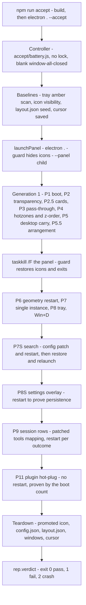

# Real-machine acceptance battery and evidence

The panel's behaviour is mostly about the machine it sits on: a transparent layered window pinned below every ordinary window, clicks routed by hotzones, explorer's desktop icons hidden and carried, tray and Startup entries, and a utilityProcess data plane. Almost none of that can be loaded by `vitest`, so it is verified by a single hand-written on-machine program: `app/accept/battery.js` plus the helpers in `app/accept/lib/`. The offline suite and the battery are complementary by design and their split is described in [testing strategy](/openwiki/testing/testing-strategy.md); this page is the battery's own map — how a run starts, what each phase asserts and with which probe function, how evidence is produced, and what no run can decide.

<!-- openwiki: broken internal link [/repo://app/tsconfig.json#L15-L15] file "/repo://app/tsconfig.json" does not exist. Fix the href or restore the target, then delete this comment. -->
<!-- openwiki: broken internal link [/repo://app/tsconfig.typecheck.json#L7-L7] file "/repo://app/tsconfig.typecheck.json" does not exist. Fix the href or restore the target, then delete this comment. -->
<!-- openwiki: broken internal link [/repo://app/src/main/index.ts#L239-L247] file "/repo://app/src/main/index.ts" does not exist. Fix the href or restore the target, then delete this comment. -->
The battery is plain JavaScript. Nothing compiles it (`tsconfig.json` includes only `src/main`, `src/preload` and `src/shared`, and `tsconfig.typecheck.json` only `src` and `tests`), so `--accept` simply `require`s it at runtime and its only verification is the run itself ([tsconfig.json](/repo://app/tsconfig.json#L15-L15), [tsconfig.typecheck.json](/repo://app/tsconfig.typecheck.json#L7-L7), [index.ts](/repo://app/src/main/index.ts#L239-L247)).

## Entry: `npm run accept`

| Step | What happens | Where |
|---|---|---|
<!-- openwiki: broken internal link [/repo://app/package.json#L7-L14] file "/repo://app/package.json" does not exist. Fix the href or restore the target, then delete this comment. -->
| `npm run accept` | `npm run build && electron . --accept` — the build runs first, so the controller and every panel it spawns share one `dist` | [package.json](/repo://app/package.json#L7-L14) |
<!-- openwiki: broken internal link [/repo://app/src/main/index.ts#L235-L247] file "/repo://app/src/main/index.ts" does not exist. Fix the href or restore the target, then delete this comment. -->
| `--accept` dispatch | the single-instance branches are both guarded by `!ACCEPT_MODE`, so a battery run never takes or needs the lock and can coexist with a resident panel | [index.ts](/repo://app/src/main/index.ts#L235-L247) |
<!-- openwiki: broken internal link [/repo://app/src/main/index.ts#L240-L246] file "/repo://app/src/main/index.ts" does not exist. Fix the href or restore the target, then delete this comment. -->
| Controller | installs an empty `window-all-closed` handler (so the controller outlives its own windows) and `require`s `accept/battery.js` inside the same Electron app context, which is what lets it use `nativeImage`, `BrowserWindow` and `app.getPath('userData')` directly | [index.ts](/repo://app/src/main/index.ts#L240-L246) |
<!-- openwiki: broken internal link [/repo://app/accept/battery.js#L2247-L2255] file "/repo://app/accept/battery.js" does not exist. Fix the href or restore the target, then delete this comment. -->
| Verdict | `app.whenReady()` → `main()` → `Report.verdict()`; exit code `0` pass, `1` fail, `2` crash | [battery.js](/repo://app/accept/battery.js#L2247-L2255) |

<!-- openwiki: broken internal link [/repo://AGENTS.md#L8-L8] file "/repo://AGENTS.md" does not exist. Fix the href or restore the target, then delete this comment. -->
Because acceptance mode skips the lock, `npm run accept` is also the only way to run a verification pass while the production panel is up — the reason the repository's worktree rules point real-machine checks at this command ([AGENTS.md](/repo://AGENTS.md#L8-L8), [process lifecycle](/openwiki/architecture/process-lifecycle-and-windowing.md)).

### The battery is a controller, not a panel

<!-- openwiki: broken internal link [/repo://app/accept/battery.js#L498-L502] file "/repo://app/accept/battery.js" does not exist. Fix the href or restore the target, then delete this comment. -->
<!-- openwiki: broken internal link [/repo://app/accept/battery.js#L1-L8] file "/repo://app/accept/battery.js" does not exist. Fix the href or restore the target, then delete this comment. -->
Every panel under test is a child process. `launchPanel()` spawns `process.execPath` with `['.']` and `cwd: APP_ROOT` — the **default guard entry**, not `--panel` — and sets `DECK_EVENT_LOG` to the evidence JSONL, so the whole spawn chain (guard holds the icon carry, then spawns the panel) is under test ([battery.js](/repo://app/accept/battery.js#L498-L502), [battery.js](/repo://app/accept/battery.js#L1-L8)). Two consequences shape every later assertion:

<!-- openwiki: broken internal link [/repo://app/accept/battery.js#L355-L381] file "/repo://app/accept/battery.js" does not exist. Fix the href or restore the target, then delete this comment. -->
- **`child.pid` is not the panel.** The spawned process is the launcher/guard shell, so the battery takes the panel's real pid from the panel's own `boot` evidence record and then looks for a visible `Chrome_WidgetWin_1` top-level window owned by that pid ([battery.js](/repo://app/accept/battery.js#L355-L381)). A second `electron .` launch (the single-instance phase) is spawned the same way.
<!-- openwiki: broken internal link [/repo://app/accept/battery.js#L504-L521] file "/repo://app/accept/battery.js" does not exist. Fix the href or restore the target, then delete this comment. -->
- **Teardown is a signal, not a shutdown.** `stopPanel()` kills the child, waits, and falls back to `taskkill /PID <pid> /T /F` because Electron also owns GPU and utility children ([battery.js](/repo://app/accept/battery.js#L504-L521)). The crash-restore phase deliberately uses a bare `taskkill /F` on the panel pid to exercise the guard's restore path.

<!-- openwiki: broken internal link [/repo://app/accept/lib/win32.js#L1-L9] file "/repo://app/accept/lib/win32.js" does not exist. Fix the href or restore the target, then delete this comment. -->
<!-- openwiki: broken internal link [/repo://app/accept/lib/win32.js#L95-L118] file "/repo://app/accept/lib/win32.js" does not exist. Fix the href or restore the target, then delete this comment. -->
`app/accept/lib/win32.js` is the probe library: a second, independent koffi binding of `user32`/`kernel32`/`imm32` written for the harness and explicitly not production code, so a probe cannot be quietly "fixed" by the same edit that fixes the panel ([win32.js](/repo://app/accept/lib/win32.js#L1-L9)). It re-implements DefView discovery and the `SysListView32` visibility test rather than importing `icon-carry.ts` ([win32.js](/repo://app/accept/lib/win32.js#L95-L118)).

## Run plan and panel generations

*Run plan: the phases in execution order and the panel generations they drive.*

The phases are named after the tickets that introduced them (P2 … P11, with P5.5 for ticket 06 and the `S` suffix for the search and settings sections ported into the battery). Because the event file and the panel's DOM survive restarts, three conventions are load-bearing:

<!-- openwiki: broken internal link [/repo://app/accept/battery.js#L337-L353] file "/repo://app/accept/battery.js" does not exist. Fix the href or restore the target, then delete this comment. -->
<!-- openwiki: broken internal link [/repo://app/accept/battery.js#L533-L551] file "/repo://app/accept/battery.js" does not exist. Fix the href or restore the target, then delete this comment. -->
- **A panel generation must be dated.** Post-restart waits pass a time lower bound (`sinceMs`, `lastBootMs()`, or a wall-clock `t0`) because `readEvents()` scans the whole file and `waitEvent` returns the *first* match — a stale `boot` or `hotzones` record from an earlier generation would otherwise satisfy an assertion ([battery.js](/repo://app/accept/battery.js#L337-L353), [battery.js](/repo://app/accept/battery.js#L533-L551)).
<!-- openwiki: broken internal link [/repo://app/accept/battery.js#L538-L542] file "/repo://app/accept/battery.js" does not exist. Fix the href or restore the target, then delete this comment. -->
<!-- openwiki: broken internal link [/repo://app/accept/battery.js#L2044-L2048] file "/repo://app/accept/battery.js" does not exist. Fix the href or restore the target, then delete this comment. -->
- **Hotzone rectangles belong to a generation.** `latestZoneOf(id, sinceMs)` re-reads the newest `hotzones` record, and the session-row phase waits up to 6 s for a `clock-card` rectangle declared *after* the current boot rather than reusing the previous panel's geometry ([battery.js](/repo://app/accept/battery.js#L538-L542), [battery.js](/repo://app/accept/battery.js#L2044-L2048)).
<!-- openwiki: broken internal link [/repo://app/accept/battery.js#L383-L395] file "/repo://app/accept/battery.js" does not exist. Fix the href or restore the target, then delete this comment. -->
- **Wait for quiet before clicking.** `waitStable('desktop-rendered', 1500)` exists because dock ranking is recomputed asynchronously about a second after boot, so the first-painted rectangles can point at items that have since swapped places ([battery.js](/repo://app/accept/battery.js#L383-L395)).

<!-- openwiki: broken internal link [/repo://app/accept/battery.js#L461-L502] file "/repo://app/accept/battery.js" does not exist. Fix the href or restore the target, then delete this comment. -->
Also note the startup baseline and seeding block: the tray's amber pixel count, whether native desktop icons are visible, and the user's real `layout.json` are all recorded before the first panel is spawned, and `layout.json` is then seeded with one pinned real desktop `.lnk` so the pinned-first rule has something to assert against ([battery.js](/repo://app/accept/battery.js#L461-L502)).

## Assertion groups

| Phase | Asserted behaviour | Probe entry points |
|---|---|---|
| P1 | panel window exists for the pid that reported `boot`; geometry noted | `launchPanel`, `waitPanelWindow`, `readEvents` |
| P2 | panel transparent area really shows the window beneath it; clock text is solid | `capture`, `checkerHitRateAtPoints`, `whitePixels`, `windowFromPointRoot`, `lib/capture.ps1`, `lib/checker.html` |
| P2.5 | four data cards come from the kernel and keep refreshing | `waitEvent` on `sessions-rendered`, `hardware-rendered`, `history-live`, `weather-rendered` |
| P3 | default pass-through: buttons reach the desktop | `clickPhys`, `GetWindowLongW`, `GetForegroundWindow`, `className` |
| P4 | hotzone entry/exit, click routing, never-raise, bottom z-order | `latestZoneOf`, `ptOfZoneAt`, `moveMousePhys`, `windowFromPointRoot`, `topLevelWindows`, `GetWindowLongW` |
| P5 | desktop items match an independent disk scan; icons hidden and restored; lnk fixtures | `psDesktopScan`, `desktopIconsVisible`, `createProbeLnk`, `createShortcutLnk`, `waitStable`, in-process `createKernel` |
| P5.5 | pinned-first, extension grouping, drag placement, factory reset | `waitEvent`/`waitStable` on `desktop-rendered`, `send` + `mouseInput`, `occludedClickAt`, `withControlWindowClear` |
| P7S | real Listary chain: activation, results, open, reveal, selection, deactivate, offline | `engineProbeFirst`, `freePort`, `clipboardSet/Get`, `windowTitle`, `panelBelowAllNormal` |
| P8S | settings overlay: open, slider consistency, ESC/blur close, restart persistence | `occludedClickAt`, `dragSliderTo`, `dragConsistent`, `latestZoneOf`, `readCardOpacity` |
| P6 | `config.panel` geometry takes effect on restart | `backupConfigB`/`restoreConfigB`, `waitPanelWindow`, `rectOf` |
| P7 | single-instance refusal and intact original panel | raw `spawn` + `exit` event, `single-instance-refused` record, `IsWindow` |
| P8 | tray icon registered and visible | `listNotifyIcons`, `setPromoted`, `scanAmberInTray`, `colorIconTarget` |
| Win+D | panel exempt from Show Desktop; debounced recovery otherwise | `send` (Win+D), `IsIconic`, `ShowWindow(SW_MINIMIZE)`, `wind-minimized`/`wind-restored` |
| P10 | tray icon system-level visible; exit pipeline tears the tray down | `lib/uia-focus.ps1`, `PostMessageW(WM_CLOSE)`, `isAlive`, `quit` record, `scanAmberInTray` |
| P9 | session rows launch or focus the mapped tool, or degrade silently | `exeNameOfWindow`, `exeOfPid`, `relaunchWith`, `clickProbeRow` |
| P11 | built-in cards are plugins; external plugin installation is hot | `lastEvent`/`waitEvent` on `plugin-mounted`, `hello-mounted`, `hotzones`, `boot` count |

### P1 — boot

<!-- openwiki: broken internal link [/repo://app/accept/battery.js#L355-L381] file "/repo://app/accept/battery.js" does not exist. Fix the href or restore the target, then delete this comment. -->
<!-- openwiki: broken internal link [/repo://app/accept/battery.js#L466-L468] file "/repo://app/accept/battery.js" does not exist. Fix the href or restore the target, then delete this comment. -->
`waitPanelWindow(20000)` waits for a `boot` record (optionally newer than `sinceMs`), takes its `pid`, and polls for a visible top-level window of class `Chrome_WidgetWin_1` owned by it; on timeout it prints every Chrome-class window with its pid so the failure is diagnosable ([battery.js](/repo://app/accept/battery.js#L355-L381)). The event file is deleted at the start of the run so the first `boot` is unambiguous ([battery.js](/repo://app/accept/battery.js#L466-L468)).

### P2 — transparency and solid text

<!-- openwiki: broken internal link [/repo://app/accept/battery.js#L590-L610] file "/repo://app/accept/battery.js" does not exist. Fix the href or restore the target, then delete this comment. -->
<!-- openwiki: broken internal link [/repo://app/accept/lib/checker.html#L1-L5] file "/repo://app/accept/lib/checker.html" does not exist. Fix the href or restore the target, then delete this comment. -->
A **checker window** is created by the controller itself: a frameless `BrowserWindow` sized to the panel's physical rect plus 8 DIP, loading `lib/checker.html` — an 80 px conic checkerboard of `#2040c0`/`#c04020` — and pushed to `HWND_BOTTOM` so it sits under the panel but over the wallpaper ([battery.js](/repo://app/accept/battery.js#L590-L610), [checker.html](/repo://app/accept/lib/checker.html#L1-L5)). A fixed wallpaper would make a pixel assertion meaningless, so the harness supplies its own backdrop.

<!-- openwiki: broken internal link [/repo://app/accept/battery.js#L624-L650] file "/repo://app/accept/battery.js" does not exist. Fix the href or restore the target, then delete this comment. -->
<!-- openwiki: broken internal link [/repo://app/accept/battery.js#L641-L666] file "/repo://app/accept/battery.js" does not exist. Fix the href or restore the target, then delete this comment. -->
<!-- openwiki: broken internal link [/repo://app/accept/battery.js#L66-L86] file "/repo://app/accept/battery.js" does not exist. Fix the href or restore the target, then delete this comment. -->
<!-- openwiki: broken internal link [/repo://app/accept/battery.js#L88-L103] file "/repo://app/accept/battery.js" does not exist. Fix the href or restore the target, then delete this comment. -->
<!-- openwiki: broken internal link [/repo://app/src/renderer/index.html#L19-L21] file "/repo://app/src/renderer/index.html" does not exist. Fix the href or restore the target, then delete this comment. -->
<!-- openwiki: broken internal link [/repo://app/accept/battery.js#L671-L674] file "/repo://app/accept/battery.js" does not exist. Fix the href or restore the target, then delete this comment. -->
Sample points are built on a 16 px grid inside a band that avoids both card columns and the desktop-carry zones, and each point survives only if `windowFromPointRoot` reports the checker window — occlusion-aware sampling, since a window the user restored mid-run must not be counted as a transparency failure ([battery.js](/repo://app/accept/battery.js#L624-L650)). PASS requires at least 500 valid points and a checker-colour hit rate above 90 % with a colour tolerance of 30. When the rate is at or below 90 % *and* enough points were valid, a shell flyout is the prime suspect (it is `TOPMOST` and would blank the band), so the battery sends `ESC` and re-shoots once, keeping the second reading ([battery.js](/repo://app/accept/battery.js#L641-L666), [battery.js](/repo://app/accept/battery.js#L66-L86)). The same shot feeds `whitePixels(shot, localCard)` — more than 30 near-white pixels in the clock card proves the text is drawn in solid colour, because the opacity slider only moves the card background ([battery.js](/repo://app/accept/battery.js#L88-L103), [index.html](/repo://app/src/renderer/index.html#L19-L21)). `02-on-wallpaper.png` is taken afterwards as a nominal record only: a dynamic wallpaper differs frame by frame, so nothing is asserted on it ([battery.js](/repo://app/accept/battery.js#L671-L674)).

### P2.5 — data cards

<!-- openwiki: broken internal link [/repo://app/accept/battery.js#L676-L698] file "/repo://app/accept/battery.js" does not exist. Fix the href or restore the target, then delete this comment. -->
<!-- openwiki: broken internal link [/repo://app/accept/battery.js#L699-L713] file "/repo://app/accept/battery.js" does not exist. Fix the href or restore the target, then delete this comment. -->
Card liveness is asserted from renderer evidence, not pixels: `sessions-rendered` (session count from the live pool), `hardware-rendered` with `n >= 2` (the 1 Hz refresh really ticked twice), the one-shot `history-live` (the CPU ring accumulated at least five points), and either `weather-rendered` or — network-dependent — a `weather-error` that downgrades to a `NOTE` instead of a failure ([battery.js](/repo://app/accept/battery.js#L676-L698)). Two zone screenshots (`04-cards-left.png`, `04-cards-right.png`) record the card columns ([battery.js](/repo://app/accept/battery.js#L699-L713)).

### P3 — default pass-through

<!-- openwiki: broken internal link [/repo://app/accept/battery.js#L717-L741] file "/repo://app/accept/battery.js" does not exist. Fix the href or restore the target, then delete this comment. -->
The window's extended style must contain `WS_EX_TRANSPARENT | WS_EX_LAYERED`, and two real clicks at an empty point (DIP 700×300, chosen to sit between the document strip and the right card column) must land on the desktop: left click turns the foreground into one of `Progman`/`WorkerW`/`SHELLDLL_DefView`/`SysListView32`, right click opens the desktop context menu, whose Win11 host is a WASDK class starting with `XamlExplorerHost` ([battery.js](/repo://app/accept/battery.js#L717-L741)). `ESC` cleans up afterwards.

### P4 — hotzone routing, never-raise and bottom z-order

<!-- openwiki: broken internal link [/repo://app/accept/battery.js#L743-L750] file "/repo://app/accept/battery.js" does not exist. Fix the href or restore the target, then delete this comment. -->
<!-- openwiki: broken internal link [/repo://app/accept/battery.js#L320-L335] file "/repo://app/accept/battery.js" does not exist. Fix the href or restore the target, then delete this comment. -->
The phase first waits for a `hotzones` record that actually contains `clock-card`, because the built-in cards mount asynchronously through the plugin contract; without that wait the absence of a rectangle would be misread as a missing declaration ([battery.js](/repo://app/accept/battery.js#L743-L750)). A real Notepad window is launched and placed at physical (1000, 200) 1400×900 as the ordinary-window control, then used as the reference for everything else ([battery.js](/repo://app/accept/battery.js#L320-L335)):

1. **z-order baseline** — clicking an overlap point outside the cards activates Notepad, and `WindowFromPoint` there must return the Notepad root window.
<!-- openwiki: broken internal link [/repo://app/accept/battery.js#L762-L775] file "/repo://app/accept/battery.js" does not exist. Fix the href or restore the target, then delete this comment. -->
<!-- openwiki: broken internal link [/repo://app/src/main/hotzone.ts#L4-L6] file "/repo://app/src/main/hotzone.ts" does not exist. Fix the href or restore the target, then delete this comment. -->
2. **entry** — the cursor is moved to the clock card centre and `GWL_EXSTYLE` is polled for up to 1.5 s until `WS_EX_TRANSPARENT` disappears; this is the 25 ms poll in `HotzoneTracker` doing its job ([battery.js](/repo://app/accept/battery.js#L762-L775), [hotzone.ts](/repo://app/src/main/hotzone.ts#L4-L6)).
<!-- openwiki: broken internal link [/repo://app/accept/battery.js#L777-L798] file "/repo://app/accept/battery.js" does not exist. Fix the href or restore the target, then delete this comment. -->
3. **click** — after a click on the same point, all four of these must hold: the overlap point still resolves to Notepad (the panel was not raised), the foreground is still Notepad (no focus theft), the extended style still has `WS_EX_NOACTIVATE`, and a `clock-card-clicked` record arrived. The `clock-rendered` records must also number at least two with increasing `epochMs`, proving data comes from the kernel rather than a static paint ([battery.js](/repo://app/accept/battery.js#L777-L798)).
<!-- openwiki: broken internal link [/repo://app/accept/battery.js#L800-L822] file "/repo://app/accept/battery.js" does not exist. Fix the href or restore the target, then delete this comment. -->
4. **exit** — moving the cursor to the safe point restores `WS_EX_TRANSPARENT` within 1.5 s, the overlap point still belongs to Notepad, and the panel's index in `topLevelWindows()` must be *below* Notepad's (never-raise, plus a `02-pinned-bottom.png` record) ([battery.js](/repo://app/accept/battery.js#L800-L822)).

<!-- openwiki: broken internal link [/repo://app/accept/battery.js#L1221-L1236] file "/repo://app/accept/battery.js" does not exist. Fix the href or restore the target, then delete this comment. -->
The same "panel below every normal window" predicate is re-implemented as `panelBelowAllNormal()` for the search phase, where it must hold *while* the panel is the foreground window in keyboard mode ([battery.js](/repo://app/accept/battery.js#L1221-L1236)).

### P5 — desktop carry, icon hiding and lnk fixtures

<!-- openwiki: broken internal link [/repo://app/accept/battery.js#L212-L227] file "/repo://app/accept/battery.js" does not exist. Fix the href or restore the target, then delete this comment. -->
<!-- openwiki: broken internal link [/repo://app/accept/battery.js#L826-L842] file "/repo://app/accept/battery.js" does not exist. Fix the href or restore the target, then delete this comment. -->
<!-- openwiki: broken internal link [/repo://app/accept/battery.js#L844-L849] file "/repo://app/accept/battery.js" does not exist. Fix the href or restore the target, then delete this comment. -->
The panel's item set is compared against an **independent scan**: `psDesktopScan()` runs PowerShell over the user desktop and `CommonDesktopDirectory`, filters Hidden/System entries, and forces UTF-8 output (Chinese file names came back as GBK mojibake otherwise); the expected set is user items plus common items that are not shadowed by a same-named user item, and the assertion is set equality in both directions ([battery.js](/repo://app/accept/battery.js#L212-L227), [battery.js](/repo://app/accept/battery.js#L826-L842)). While the panel runs, `desktopIconsVisible()` — a second implementation of the `SHELLDLL_DefView`/`SysListView32` probe — must be false, with `05-icons-hidden.png` as the visual record ([battery.js](/repo://app/accept/battery.js#L844-L849)).

<!-- openwiki: broken internal link [/repo://app/accept/battery.js#L851-L873] file "/repo://app/accept/battery.js" does not exist. Fix the href or restore the target, then delete this comment. -->
<!-- openwiki: broken internal link [/repo://app/accept/battery.js#L875-L918] file "/repo://app/accept/battery.js" does not exist. Fix the href or restore the target, then delete this comment. -->
<!-- openwiki: broken internal link [/repo://app/accept/battery.js#L229-L247] file "/repo://app/accept/battery.js" does not exist. Fix the href or restore the target, then delete this comment. -->
<!-- openwiki: broken internal link [/repo://app/accept/battery.js#L920-L990] file "/repo://app/accept/battery.js" does not exist. Fix the href or restore the target, then delete this comment. -->
<!-- openwiki: broken internal link [/repo://app/accept/battery.js#L944-L973] file "/repo://app/accept/battery.js" does not exist. Fix the href or restore the target, then delete this comment. -->
Click routing for carried items is asserted with real input at rectangles taken from the quiet `desktop-rendered` snapshot: the first dock item must report `desktop-selected` ([battery.js](/repo://app/accept/battery.js#L851-L873)). A uniquely named probe shortcut is then created whose target writes a marker file; it must appear in the 1 Hz rescan, a double click (two clicks 90 ms apart, inside `GetDoubleClickTime`) must produce `desktop-launched` with `ok: true` **and** the marker file within 10 s, and deleting the shortcut must remove the item from the render ([battery.js](/repo://app/accept/battery.js#L875-L918), [battery.js](/repo://app/accept/battery.js#L229-L247)). Two shortcuts pointing at different executables (`notepad.exe`, `System32\charmap.exe`) cover the icon-extraction detour: the battery builds an in-process kernel from `dist/main/kernel.js` with every timer disabled and an isolated layout store and usage directory, and requires that `panel/snapshot` + `desktop/icon` return different `data:image/…` URLs for the two fixtures — a regression to the byte-identical generic `.lnk` icon fails here ([battery.js](/repo://app/accept/battery.js#L920-L990), [battery.js](/repo://app/accept/battery.js#L944-L973)).

<!-- openwiki: broken internal link [/repo://app/accept/battery.js#L992-L1010] file "/repo://app/accept/battery.js" does not exist. Fix the href or restore the target, then delete this comment. -->
<!-- openwiki: broken internal link [/repo://app/accept/battery.js#L1013-L1021] file "/repo://app/accept/battery.js" does not exist. Fix the href or restore the target, then delete this comment. -->
The crash path closes the group: `taskkill /F` on the panel pid, then native icons visible again within 6 s, an `icons-restored` record (reason `panel-exit`) and the guard process gone — the restore lives in the guard precisely because it survives the panel's death ([battery.js](/repo://app/accept/battery.js#L992-L1010), [desktop icon carry](/openwiki/architecture/desktop-icon-carry-and-autostart.md)). A fresh generation is launched afterwards with an explicit `sinceMs` so the old `boot` record cannot be reused ([battery.js](/repo://app/accept/battery.js#L1013-L1021)).

### P5.5 — arrangement, drag placement and factory reset

<!-- openwiki: broken internal link [/repo://app/accept/battery.js#L1028-L1064] file "/repo://app/accept/battery.js" does not exist. Fix the href or restore the target, then delete this comment. -->
<!-- openwiki: broken internal link [/repo://app/accept/battery.js#L1066-L1127] file "/repo://app/accept/battery.js" does not exist. Fix the href or restore the target, then delete this comment. -->
<!-- openwiki: broken internal link [/repo://app/accept/battery.js#L1129-L1175] file "/repo://app/accept/battery.js" does not exist. Fix the href or restore the target, then delete this comment. -->
<!-- openwiki: broken internal link [/repo://app/accept/battery.js#L566-L588] file "/repo://app/accept/battery.js" does not exist. Fix the href or restore the target, then delete this comment. -->
Against the seeded `layout.json`, three behaviours are asserted from `desktop-rendered` payloads: the pinned item occupies `dock[0]` with `source: 'pinned'` while no other entry is `pinned`; newly created `.docx`/`.pdf` files land in the `office` and `pdf` document groups and disappear again when deleted ([battery.js](/repo://app/accept/battery.js#L1028-L1064)). Placement is then driven by a **real pointer drag** — `SendInput` left-down, twelve mouse moves, left-up after a 140 ms settle — from the last dock item to before the second one; the assertion chain is `desktop-moved` with `ok: true`, a reordered `desktop-rendered`, and the order surviving a **panel restart** through `layout.json` ([battery.js](/repo://app/accept/battery.js#L1066-L1127)). Factory reset is reached the honest way, through the UI: `settings-btn` hotzone click → `settings-opened` → `settings-reset` hotzone click → `desktop-layout-reset` with a cleared count, then a `desktop-rendered` in which no dock entry has `source: 'placed'` and the pinned entry is still first; the attempt is retried once inside `withControlWindowClear` because the battery's own Notepad control window covers the settings entry at that point ([battery.js](/repo://app/accept/battery.js#L1129-L1175), [battery.js](/repo://app/accept/battery.js#L566-L588)).

### P7S — the search chain against the real engine

<!-- openwiki: broken internal link [/repo://app/accept/battery.js#L411-L439] file "/repo://app/accept/battery.js" does not exist. Fix the href or restore the target, then delete this comment. -->
<!-- openwiki: broken internal link [/repo://app/accept/battery.js#L1279-L1292] file "/repo://app/accept/battery.js" does not exist. Fix the href or restore the target, then delete this comment. -->
<!-- openwiki: broken internal link [/repo://app/accept/battery.js#L1181-L1199] file "/repo://app/accept/battery.js" does not exist. Fix the href or restore the target, then delete this comment. -->
This section is the port of the retired Python search battery and it is **conditional on the environment**: it first proves Listary is live with its own client — `POST 127.0.0.1:38431 /api/v1/search` for a freshly created probe file, requiring that file to rank first (`realpath` + basename compare, 90 s budget) — and returns early after a `FAIL` if that pre-check does not pass, so the UI assertions below are never reported as green on a machine without the engine ([battery.js](/repo://app/accept/battery.js#L411-L439), [battery.js](/repo://app/accept/battery.js#L1279-L1292)). The battery's Notepad control window covers the search card, so it is moved aside for the section and restored in the section's `finally`, and the clipboard is saved and restored ([battery.js](/repo://app/accept/battery.js#L1181-L1199)).

<!-- openwiki: broken internal link [/repo://app/accept/battery.js#L1237-L1254] file "/repo://app/accept/battery.js" does not exist. Fix the href or restore the target, then delete this comment. -->
<!-- openwiki: broken internal link [/repo://app/accept/battery.js#L1304-L1320] file "/repo://app/accept/battery.js" does not exist. Fix the href or restore the target, then delete this comment. -->
<!-- openwiki: broken internal link [/repo://app/accept/battery.js#L1392-L1398] file "/repo://app/accept/battery.js" does not exist. Fix the href or restore the target, then delete this comment. -->
<!-- openwiki: broken internal link [/repo://app/accept/battery.js#L1255-L1268] file "/repo://app/accept/battery.js" does not exist. Fix the href or restore the target, then delete this comment. -->
<!-- openwiki: broken internal link [/repo://app/accept/battery.js#L397-L409] file "/repo://app/accept/battery.js" does not exist. Fix the href or restore the target, then delete this comment. -->
<!-- openwiki: broken internal link [/repo://app/accept/battery.js#L1325-L1414] file "/repo://app/accept/battery.js" does not exist. Fix the href or restore the target, then delete this comment. -->
<!-- openwiki: broken internal link [/repo://app/accept/battery.js#L441-L451] file "/repo://app/accept/battery.js" does not exist. Fix the href or restore the target, then delete this comment. -->
<!-- openwiki: broken internal link [/repo://app/accept/battery.js#L1416-L1438] file "/repo://app/accept/battery.js" does not exist. Fix the href or restore the target, then delete this comment. -->
<!-- openwiki: broken internal link [/repo://app/accept/battery.js#L1439-L1460] file "/repo://app/accept/battery.js" does not exist. Fix the href or restore the target, then delete this comment. -->
Activation is a click on the `search-card` hotzone plus a hard foreground gate: up to three attempts, and the foreground window must belong to the panel pid before any keystroke is sent ([battery.js](/repo://app/accept/battery.js#L1237-L1254)). The keyboard path is then asserted as a pair of records: `keyboard-mode-on` with the panel foreground **and** `panelBelowAllNormal()` still true — keyboard mode must not break the pinning rule — and, at the end, `keyboard-mode-off` with `WS_EX_NOACTIVATE` restored and the panel still at the bottom ([battery.js](/repo://app/accept/battery.js#L1304-L1320), [battery.js](/repo://app/accept/battery.js#L1392-L1398)). The probe word is pasted with `Ctrl+V` to bypass IME composition; `search-results-rendered` carries a count, a total and only the query *length* ([battery.js](/repo://app/accept/battery.js#L1255-L1268)). `Enter` must open a window whose title contains the probe token (bound locally with `GetWindowTextW`, which `win32.js` does not export), `Ctrl+Enter` must produce a `CabinetWClass` window titled with the probe directory, two `VK_DOWN` presses must yield `search-selection-moved` with `index: 2`, `ESC` must yield `search-deactivated` with reason `esc`, and clicking the desktop must yield reason `blur` ([battery.js](/repo://app/accept/battery.js#L397-L409), [battery.js](/repo://app/accept/battery.js#L1325-L1414)). Offline is reproduced the accepted way: `freePort()` allocates and releases a dead loopback port, `config.json` is pointed at it, the panel is restarted, and `search-offline-shown` must appear ([battery.js](/repo://app/accept/battery.js#L441-L451), [battery.js](/repo://app/accept/battery.js#L1416-L1438)). The section restores `config.json` and relaunches; the probe directory is deleted only in the battery's outer teardown, because the file opened by `Enter` is a Notepad *tab* holding the handle ([battery.js](/repo://app/accept/battery.js#L1439-L1460)).

### P8S — settings overlay and card opacity

<!-- openwiki: broken internal link [/repo://app/accept/battery.js#L1521-L1541] file "/repo://app/accept/battery.js" does not exist. Fix the href or restore the target, then delete this comment. -->
<!-- openwiki: broken internal link [/repo://app/src/renderer/main.ts#L392-L406] file "/repo://app/src/renderer/main.ts" does not exist. Fix the href or restore the target, then delete this comment. -->
<!-- openwiki: broken internal link [/repo://app/accept/battery.js#L1490-L1519] file "/repo://app/accept/battery.js" does not exist. Fix the href or restore the target, then delete this comment. -->
<!-- openwiki: broken internal link [/repo://app/accept/battery.js#L1549-L1569] file "/repo://app/accept/battery.js" does not exist. Fix the href or restore the target, then delete this comment. -->
<!-- openwiki: broken internal link [/repo://app/accept/battery.js#L1571-L1599] file "/repo://app/accept/battery.js" does not exist. Fix the href or restore the target, then delete this comment. -->
<!-- openwiki: broken internal link [/repo://app/accept/battery.js#L1601-L1630] file "/repo://app/accept/battery.js" does not exist. Fix the href or restore the target, then delete this comment. -->
The whole section runs inside `withControlWindowClear` because its click targets (settings entry, slider, clock card) sit in the panel's bottom-right corner under the battery's Notepad. Opening is a hotzone click on `settings-btn`; PASS requires both a `settings-opened` record — carrying the slider rectangle and the current value — and `settings-card` present in the hotzones, and the open must also raise `keyboard-mode-on` with the panel as foreground, since `ESC` is handled through the keyboard path ([battery.js](/repo://app/accept/battery.js#L1521-L1541), [main.ts](/repo://app/src/renderer/main.ts#L392-L406)). The initial slider value must equal `config.appearance.cardOpacity` within 1 %. Dragging is then asserted as a three-link equality with `dragConsistent`: the renderer's `settings-opacity-input`, the kernel's `settings-opacity-set`, the applied `settings-opacity-applied` and the value read back from `config.json` must all agree within 1 %, once at the low end (≤ 30 %) and once at the high end (≥ 70 %) ([battery.js](/repo://app/accept/battery.js#L1490-L1519), [battery.js](/repo://app/accept/battery.js#L1549-L1569)). Closing is asserted twice: `ESC` gives `settings-closed` with reason `esc` plus `keyboard-mode-off` and `WS_EX_NOACTIVATE` back, and clicking the clock card gives reason `blur` ([battery.js](/repo://app/accept/battery.js#L1571-L1599)). Finally the value is dragged, the overlay is closed, the panel is restarted, and a boot-time `settings-opacity-applied` within 1 % of the persisted config proves persistence ([battery.js](/repo://app/accept/battery.js#L1601-L1630)). Full-screen shots `08-settings-open.png`, `08-opacity-low.png`, `08-opacity-high.png`, `08-opacity-persisted.png` are taken along the way. `config.json` is backed up before the section and restored in its `finally`.

### P6 — configuration geometry and the event-file cut

<!-- openwiki: broken internal link [/repo://app/accept/battery.js#L1639-L1665] file "/repo://app/accept/battery.js" does not exist. Fix the href or restore the target, then delete this comment. -->
The panel is stopped, `config.json` is overwritten with a fixed geometry (60,60 1100×800 DIP), the event file is **archived to `03-runtime-events-preP6.jsonl` and deleted** so the next `boot` is unambiguous, and the panel is relaunched; the new window rect must match DIP × scale factor within 24 physical pixels, the tolerance for the invisible border of a frameless window ([battery.js](/repo://app/accept/battery.js#L1639-L1665)). This is why the final `03-runtime-events.jsonl` in the evidence directory holds only the post-P6 portion of a run. `config.json` is restored in a `finally`.

### P7 — single-instance refusal

<!-- openwiki: broken internal link [/repo://app/accept/battery.js#L1667-L1696] file "/repo://app/accept/battery.js" does not exist. Fix the href or restore the target, then delete this comment. -->
<!-- openwiki: broken internal link [/repo://app/src/main/index.ts#L183-L199] file "/repo://app/src/main/index.ts" does not exist. Fix the href or restore the target, then delete this comment. -->
A second `electron .` is spawned with the same environment and must exit **within 3 s with code 0**; the event log must contain `single-instance-refused`; and the original panel must still be a valid window with an unchanged count of `Chrome_WidgetWin_1` top-level windows — the admission check must not disturb a running panel ([battery.js](/repo://app/accept/battery.js#L1667-L1696)). The refusal itself is the guard's lock attempt, while the panel child holds the lock for its lifetime ([index.ts](/repo://app/src/main/index.ts#L183-L199)).

### P8 — tray icon registered and visible

<!-- openwiki: broken internal link [/repo://app/accept/battery.js#L160-L188] file "/repo://app/accept/battery.js" does not exist. Fix the href or restore the target, then delete this comment. -->
<!-- openwiki: broken internal link [/repo://app/accept/battery.js#L1701-L1707] file "/repo://app/accept/battery.js" does not exist. Fix the href or restore the target, then delete this comment. -->
<!-- openwiki: broken internal link [/repo://app/accept/battery.js#L105-L158] file "/repo://app/accept/battery.js" does not exist. Fix the href or restore the target, then delete this comment. -->
<!-- openwiki: broken internal link [/repo://app/accept/battery.js#L273-L283] file "/repo://app/accept/battery.js" does not exist. Fix the href or restore the target, then delete this comment. -->
<!-- openwiki: broken internal link [/repo://app/accept/battery.js#L198-L210] file "/repo://app/accept/battery.js" does not exist. Fix the href or restore the target, then delete this comment. -->
Registration is read from the registry fact source, not from the app: `HKCU:\Control Panel\NotifyIconSettings` entries are enumerated with `ExecutablePath` and `IsPromoted`, and one entry's exe must equal `process.execPath` ([battery.js](/repo://app/accept/battery.js#L160-L188), [battery.js](/repo://app/accept/battery.js#L1701-L1707)). Win11 hides new icons in the overflow area, so the battery sets `IsPromoted = 1` (remembering the previous value for restore) and then looks for the programmatic amber icon (`#f5a623` → `AMBER = [245, 166, 35]`) in the `Shell_TrayWnd` strip by connected-cluster analysis — the icon is four small squares, so a single centroid over all matching pixels would be pulled into the gap between them ([battery.js](/repo://app/accept/battery.js#L105-L158), [battery.js](/repo://app/accept/battery.js#L273-L283)). If nothing is found the panel is restarted and the strip is rescanned for 8 s, because explorer may only re-attach the icon after the registration changes; PASS requires a hit count above the pre-run baseline. `IsPromoted` is the one registry value the battery writes, and `restorePromoted()` runs both in this phase's `finally` and in the outer teardown ([battery.js](/repo://app/accept/battery.js#L198-L210)).

### Win+D — immunity and debounced recovery

<!-- openwiki: broken internal link [/repo://app/accept/battery.js#L1744-L1760] file "/repo://app/accept/battery.js" does not exist. Fix the href or restore the target, then delete this comment. -->
<!-- openwiki: broken internal link [/repo://app/accept/battery.js#L1766-L1797] file "/repo://app/accept/battery.js" does not exist. Fix the href or restore the target, then delete this comment. -->
<!-- openwiki: broken internal link [/repo://app/src/main/wind-restore.ts#L8-L9] file "/repo://app/src/main/wind-restore.ts" does not exist. Fix the href or restore the target, then delete this comment. -->
`Win+D` is sent with `SendInput`, and the Notepad control window must be found iconic before anything is concluded — otherwise the keyboard delivery itself failed and the group is reported as untrustworthy ([battery.js](/repo://app/accept/battery.js#L1744-L1760)). On this Windows version `ToggleDesktop` does not minimise `WS_EX_TOOLWINDOW` windows, so the expected outcome is the panel staying put while Notepad is minimised (`03-wind-immune.png`); if the panel *was* minimised, the group instead waits for the panel's own `wind-minimized` record. The debounce is then exercised directly: `SW_MINIMIZE` on the panel → `wind-minimized` record with `IsIconic` true → `wind-restored` about 1.5 s later with the window back at its original rectangle within 24 px, after which the restored Notepad must again cover the panel (re-pin effective) ([battery.js](/repo://app/accept/battery.js#L1766-L1797), [wind-restore.ts](/repo://app/src/main/wind-restore.ts#L8-L9)).

### P10 — tray visibility and the exit pipeline

<!-- openwiki: broken internal link [/repo://app/accept/battery.js#L1800-L1851] file "/repo://app/accept/battery.js" does not exist. Fix the href or restore the target, then delete this comment. -->
<!-- openwiki: broken internal link [/repo://app/accept/lib/uia-focus.ps1#L1-L16] file "/repo://app/accept/lib/uia-focus.ps1" does not exist. Fix the href or restore the target, then delete this comment. -->
<!-- openwiki: broken internal link [/repo://app/src/main/index.ts#L139-L143] file "/repo://app/src/main/index.ts" does not exist. Fix the href or restore the target, then delete this comment. -->
<!-- openwiki: broken internal link [/repo://app/src/main/index.ts#L172-L173] file "/repo://app/src/main/index.ts" does not exist. Fix the href or restore the target, then delete this comment. -->
Two hard facts stand in for the tray menu: `Win+B` followed by `lib/uia-focus.ps1 -Needle 'AGENT DECK' -MaxSteps 20`, which walks the UIA focus chain leftwards and prints `MATCH` when the focused element's name contains the needle (the script is ASCII-only on purpose — PowerShell 5.1 misreads BOM-less UTF-8 comments on an ANSI code page and `Add-Type` breaks) — and a `WM_CLOSE` posted to the panel window, which must end in the panel pid dying within 10 s, a `quit` record from `before-quit`, and the amber count falling back to the baseline ([battery.js](/repo://app/accept/battery.js#L1800-L1851), [uia-focus.ps1](/repo://app/accept/lib/uia-focus.ps1#L1-L16)). `WM_CLOSE` and the tray's `退出面板` share the same teardown path (`window-all-closed` → `app.quit()` → `before-quit` destroys the tray), which is why the injection is a valid proxy for the menu item ([index.ts](/repo://app/src/main/index.ts#L139-L143), [index.ts](/repo://app/src/main/index.ts#L172-L173)). The human right-click menu itself is not automatable — see below.

### P9 — session-row direct access

<!-- openwiki: broken internal link [/repo://app/accept/battery.js#L1853-L1899] file "/repo://app/accept/battery.js" does not exist. Fix the href or restore the target, then delete this comment. -->
<!-- openwiki: broken internal link [/repo://app/accept/battery.js#L1941-L1959] file "/repo://app/accept/battery.js" does not exist. Fix the href or restore the target, then delete this comment. -->
<!-- openwiki: broken internal link [/repo://app/accept/lib/win32.js#L63-L93] file "/repo://app/accept/lib/win32.js" does not exist. Fix the href or restore the target, then delete this comment. -->
This section is built around three constraints recorded in its own comments: the user's real tools must not be disturbed, the probe program must be a classic single-process Win32 application that owns its own window and holds no user data (an earlier version used Notepad, which is single-instance on Win11 and forced closing the user's windows to obtain a clean start), and there may be no active session to click at all. So `config.tools.qoder` is repointed at `charmap.exe`, a unique probe session is seeded under `~/.qoder-cn/projects/DECK-PROBE-09/` with a fresh mtime so it enters the 10-minute active pool, and the row is located by `project === 'DECK-PROBE-09'` in the newest `sessions-rendered` payload ([battery.js](/repo://app/accept/battery.js#L1853-L1899)). Probe windows are identified by the executable that owns them (`exeNameOfWindow`, backed by `OpenProcess`/`QueryFullProcessImageNameW`) rather than by class name, so no user window is ever touched, and the section self-skips with a `NOTE` if `charmap` is already running ([battery.js](/repo://app/accept/battery.js#L1941-L1959), [win32.js](/repo://app/accept/lib/win32.js#L63-L93)).

<!-- openwiki: broken internal link [/repo://app/accept/battery.js#L1961-L1980] file "/repo://app/accept/battery.js" does not exist. Fix the href or restore the target, then delete this comment. -->
<!-- openwiki: broken internal link [/repo://app/accept/battery.js#L1984-L2057] file "/repo://app/accept/battery.js" does not exist. Fix the href or restore the target, then delete this comment. -->
<!-- openwiki: broken internal link [/repo://app/accept/battery.js#L1896-L1919] file "/repo://app/accept/battery.js" does not exist. Fix the href or restore the target, then delete this comment. -->
<!-- openwiki: broken internal link [/repo://app/accept/battery.js#L1920-L1940] file "/repo://app/accept/battery.js" does not exist. Fix the href or restore the target, then delete this comment. -->
Before clicking anything it performs the one read-only check for this feature: every explicitly configured `config.tools.*.launch` (with `%VAR%` expansion) must exist on the machine, since a wrong mapping degrades a click into "relaunch the launcher every time" and cannot be covered by a probe ([battery.js](/repo://app/accept/battery.js#L1961-L1980)). The three click outcomes are then asserted separately: `action: 'launched'` plus a new window owned by the probe exe; `action: 'focused'` with the same hwnd, the probe pid as foreground and no longer iconic (after positioning and minimising the probe window); and, with the mapping blanked, `action: 'degraded'` with `ok: false` — followed by a clock-card click proving the panel is still alive ([battery.js](/repo://app/accept/battery.js#L1984-L2057)). Each click is preceded by a diagnostic line carrying the panel rect, the row rect, the physical point and the `WindowFromPoint` result, because a bare failure cannot distinguish "row not found" from "click never arrived" ([battery.js](/repo://app/accept/battery.js#L1896-L1919)). The section is deliberately last but one in the run: it restarts the panel with a patched config, which would otherwise disturb the icon state machine of the crash-restore phase ([battery.js](/repo://app/accept/battery.js#L1920-L1940)).

### P11 — built-in cards and plugin hot-plug

The evidence is filtered by panel generation (`since = lastBootMs()`), because `plugin-mounted` records from a previous generation would otherwise make the phase pass on their own. Four things are asserted:

<!-- openwiki: broken internal link [/repo://app/accept/battery.js#L2076-L2099] file "/repo://app/accept/battery.js" does not exist. Fix the href or restore the target, then delete this comment. -->
1. Each built-in card (`clock`, `weather`, `sessions`, `hardware`) has a `plugin-mounted` record **and** a `*-card` entry in the newest hotzone declaration, and the `clock-card` rectangle must equal `CARD_DIP` exactly — the one runtime cross-check between the battery's geometry constants and the stylesheet ([battery.js](/repo://app/accept/battery.js#L2076-L2099)).
<!-- openwiki: broken internal link [/repo://app/accept/battery.js#L2101-L2112] file "/repo://app/accept/battery.js" does not exist. Fix the href or restore the target, then delete this comment. -->
2. The retired Qoder status card is absent from the hotzones while `sessions-card` fills the slot at top 152 / height 522 ([battery.js](/repo://app/accept/battery.js#L2101-L2112)).
<!-- openwiki: broken internal link [/repo://app/accept/battery.js#L2127-L2190] file "/repo://app/accept/battery.js" does not exist. Fix the href or restore the target, then delete this comment. -->
3. Dropping `samples/hello-plugin` into `<userData>/plugins/hello` produces, without any restart: `plugin-mounted hello` (the host delivered the entry), `hello-mounted` (the module actually ran) and a `hello-card` hotzone (the card is clickable, not a painted dead zone). Editing its `card.js` triggers a re-mount, deleting the directory removes the card from the hotzones, and re-adding it brings the card back ([battery.js](/repo://app/accept/battery.js#L2127-L2190)).
<!-- openwiki: broken internal link [/repo://app/accept/battery.js#L2074-L2074] file "/repo://app/accept/battery.js" does not exist. Fix the href or restore the target, then delete this comment. -->
<!-- openwiki: broken internal link [/repo://app/accept/battery.js#L2148-L2151] file "/repo://app/accept/battery.js" does not exist. Fix the href or restore the target, then delete this comment. -->
4. "Without any restart" is not self-reported: the battery counts `boot` records before and after all four steps and the phase fails if the count moved ([battery.js](/repo://app/accept/battery.js#L2074-L2074), [battery.js](/repo://app/accept/battery.js#L2148-L2151)). The plugin directory is removed in the `finally`, leaving nothing of the battery behind.

### Teardown

<!-- openwiki: broken internal link [/repo://app/accept/battery.js#L2197-L2244] file "/repo://app/accept/battery.js" does not exist. Fix the href or restore the target, then delete this comment. -->
<!-- openwiki: broken internal link [/repo://app/accept/battery.js#L2197-L2199] file "/repo://app/accept/battery.js" does not exist. Fix the href or restore the target, then delete this comment. -->
<!-- openwiki: broken internal link [/repo://app/accept/battery.js#L2251-L2254] file "/repo://app/accept/battery.js" does not exist. Fix the href or restore the target, then delete this comment. -->
The outer `finally` restores everything the run touched: the promoted tray registry value, `ESC`, the battery's Notepad (which also disposes the appended probe-file tab), the search probe directory (three attempts — the handle is only free once Notepad is closed), all spawned panels, the desktop icons — with `electron . --icon-restore` as the fallback when a forced kill left them hidden while they were visible before the run — `layout.json` (restored from backup or deleted if it did not exist), the windows minimised by `clearDesktop`, and the saved cursor position ([battery.js](/repo://app/accept/battery.js#L2197-L2244)). An exception anywhere in the run is caught and recorded as `rep.fail('电池中断: …')`, so a crash inside `main()` still ends as a failure verdict rather than the crash exit code; only an error outside `main()` (for example while building the module) produces exit code 2 ([battery.js](/repo://app/accept/battery.js#L2197-L2199), [battery.js](/repo://app/accept/battery.js#L2251-L2254)).

## Geometry constants shared with `index.html`

<!-- openwiki: broken internal link [/repo://app/accept/battery.js#L27-L38] file "/repo://app/accept/battery.js" does not exist. Fix the href or restore the target, then delete this comment. -->
<!-- openwiki: broken internal link [/repo://app/accept/battery.js#L552-L552] file "/repo://app/accept/battery.js" does not exist. Fix the href or restore the target, then delete this comment. -->
Every click point and screenshot rectangle in the battery is computed as `panelRect + round(DIP × scaleFactor)`, so the harness carries its own copy of the renderer's layout geometry ([battery.js](/repo://app/accept/battery.js#L27-L38), [battery.js](/repo://app/accept/battery.js#L552-L552)):

| Battery constant | Value (DIP) | Mirrored from | Used for |
|---|---|---|---|
| `CARD_DIP` | 48,48 320×176 | `#clock-card` | clock-card centre click; left-column screenshot; and the only rectangle compared to the stylesheet at run time (P11) |
| `LEFT_CARDS_DIP` | 48,48 320×686 (bottom 734) | clock + weather + calendar | left boundary of the transparency sampling band |
| `RIGHT_CARDS_DIP` | right 48, 48, 420×894 (bottom 942) | search + sessions + hardware | right boundary of the transparency sampling band |
| `SEARCH_CARD_DIP` | right 48, 48, 420×89 | `#search-card` | declared for reference only — no code reads it; the search phase locates the card from the `hotzones` record instead |
| `DOC_ZONE_RIGHT_DIP` | 1056 | `#doc-zone` (left 408 + max-width 640, plus an 8 px margin) | left edge of the sampling band, so document items do not pull the hit rate down |
| `DOCK_STRIP_DIP` | 110 | `#dock-zone` (bottom 16 + ~94 px strip) | bottom edge of the sampling band and the dock screenshot strips |

<!-- openwiki: broken internal link [/repo://app/src/renderer/index.html#L42-L49] file "/repo://app/src/renderer/index.html" does not exist. Fix the href or restore the target, then delete this comment. -->
<!-- openwiki: broken internal link [/repo://app/src/renderer/index.html#L95-L102] file "/repo://app/src/renderer/index.html" does not exist. Fix the href or restore the target, then delete this comment. -->
<!-- openwiki: broken internal link [/repo://app/src/renderer/index.html#L243-L247] file "/repo://app/src/renderer/index.html" does not exist. Fix the href or restore the target, then delete this comment. -->
<!-- openwiki: broken internal link [/repo://app/accept/battery.js#L2089-L2099] file "/repo://app/accept/battery.js" does not exist. Fix the href or restore the target, then delete this comment. -->
<!-- openwiki: broken internal link [/repo://app/accept/battery.js#L2101-L2112] file "/repo://app/accept/battery.js" does not exist. Fix the href or restore the target, then delete this comment. -->
<!-- openwiki: broken internal link [/repo://app/src/main/config.ts#L145-L148] file "/repo://app/src/main/config.ts" does not exist. Fix the href or restore the target, then delete this comment. -->
The two sides must therefore be edited together. If a card moves in the stylesheet and the battery keeps the old constant, the worst case is not a build error but a silent misdirection: the click lands in pass-through space (or on another card) and the event gate fails, which reads as a product defect, or the pixel assertion samples the wrong pixels and passes for the wrong reason ([index.html](/repo://app/src/renderer/index.html#L42-L49), [index.html](/repo://app/src/renderer/index.html#L95-L102), [index.html](/repo://app/src/renderer/index.html#L243-L247)). The automated safety net is partial: P11 compares `clock-card` against `CARD_DIP` and asserts the sessions-card literals (top 152, height 522) inline, while `LEFT_CARDS_DIP`, `RIGHT_CARDS_DIP`, `SEARCH_CARD_DIP`, `DOC_ZONE_RIGHT_DIP` and `DOCK_STRIP_DIP` have no runtime equivalent — their drift only shows up as flaky or misleading assertions ([battery.js](/repo://app/accept/battery.js#L2089-L2099), [battery.js](/repo://app/accept/battery.js#L2101-L2112)). The document-zone and dock *productions* values are also duplicated in `defaultDesktopLayout()`, a third place to keep aligned ([config.ts](/repo://app/src/main/config.ts#L145-L148)).

## Evidence

Three kinds of artifact land in `app/accept/evidence/`:

| Artifact | Produced by | Shape |
|---|---|---|
<!-- openwiki: broken internal link [/repo://app/accept/lib/report.js#L8-L31] file "/repo://app/accept/lib/report.js" does not exist. Fix the href or restore the target, then delete this comment. -->
| `03-battery.log.txt` | `Report` (`lib/report.js`) | a header line with the ISO start time, then one `[HH:MM:SS.mmm] PASS/FAIL/NOTE …` line per assertion, ending with a verdict line carrying the phase name, the verdict and the pass/fail counts ([report.js](/repo://app/accept/lib/report.js#L8-L31)) |
<!-- openwiki: broken internal link [/repo://app/src/main/panel-ipc.ts#L9-L24] file "/repo://app/src/main/panel-ipc.ts" does not exist. Fix the href or restore the target, then delete this comment. -->
<!-- openwiki: broken internal link [/repo://app/accept/battery.js#L1644-L1647] file "/repo://app/accept/battery.js" does not exist. Fix the href or restore the target, then delete this comment. -->
| `03-runtime-events.jsonl` | every process the battery spawns, via `DECK_EVENT_LOG` → `fileEventLog` | one JSON object per line, `{t, type, …}`; the battery truncates the file at the start and archives the pre-P6 half to `03-runtime-events-preP6.jsonl` ([panel-ipc.ts](/repo://app/src/main/panel-ipc.ts#L9-L24), [battery.js](/repo://app/accept/battery.js#L1644-L1647)) |
| `*.png` | `capture(rect, name)` → `lib/capture.ps1` | physical-pixel region captures, named after the phase (`02-transparent-on-checker`, `03-tray-area`, `05-icons-hidden`, `06-drag-persisted`, `07-search-results`, `08-opacity-low`, `09-session-focus-focused`, `10-plugin-hello`, …) |

<!-- openwiki: broken internal link [/repo://app/accept/lib/capture.ps1#L1-L20] file "/repo://app/accept/lib/capture.ps1" does not exist. Fix the href or restore the target, then delete this comment. -->
<!-- openwiki: broken internal link [/repo://app/accept/battery.js#L68-L86] file "/repo://app/accept/battery.js" does not exist. Fix the href or restore the target, then delete this comment. -->
<!-- openwiki: broken internal link [/repo://app/accept/battery.js#L108-L158] file "/repo://app/accept/battery.js" does not exist. Fix the href or restore the target, then delete this comment. -->
<!-- openwiki: broken internal link [/repo://app/accept/battery.js#L42-L50] file "/repo://app/accept/battery.js" does not exist. Fix the href or restore the target, then delete this comment. -->
The screenshot helper is a DPI-aware PowerShell script: it declares `SetProcessDPIAware()` before `CopyFromScreen`, so a display at 125 % or 150 % scaling is captured in physical pixels rather than being resampled ([capture.ps1](/repo://app/accept/lib/capture.ps1#L1-L20)). The battery reads those PNGs back through Electron's `nativeImage.toBitmap()` (BGRA byte order) for its hit-rate, white-pixel and amber-cluster probes ([battery.js](/repo://app/accept/battery.js#L68-L86), [battery.js](/repo://app/accept/battery.js#L108-L158)). The controller inherits the display's `scaleFactor` once at start and every DIP→physical conversion uses it ([battery.js](/repo://app/accept/battery.js#L42-L50)).

<!-- openwiki: broken internal link [/repo://app/accept/battery.js#L2247-L2255] file "/repo://app/accept/battery.js" does not exist. Fix the href or restore the target, then delete this comment. -->
<!-- openwiki: broken internal link [/repo://.gitignore#L18-L22] file "/repo://.gitignore" does not exist. Fix the href or restore the target, then delete this comment. -->
<!-- openwiki: broken internal link [/repo://app/accept/evidence/03-battery.log.txt#L40-L40] file "/repo://app/accept/evidence/03-battery.log.txt" does not exist. Fix the href or restore the target, then delete this comment. -->
<!-- openwiki: broken internal link [/repo://app/accept/evidence/03-battery.log.txt#L95-L95] file "/repo://app/accept/evidence/03-battery.log.txt" does not exist. Fix the href or restore the target, then delete this comment. -->
<!-- openwiki: broken internal link [/repo://app/accept/evidence/03-battery.log.txt#L114-L114] file "/repo://app/accept/evidence/03-battery.log.txt" does not exist. Fix the href or restore the target, then delete this comment. -->
Exit codes are the machine-readable verdict: `process.exitCode` plus `app.exit(fails > 0 ? 1 : 0)` 300 ms after `main()` resolves, and `app.exit(2)` on an unhandled crash ([battery.js](/repo://app/accept/battery.js#L2247-L2255)). `app/accept/evidence/` is not excluded by `.gitignore` (which ignores `app/node_modules/`, `app/dist/` and `app/config.json`), so a run's screenshots, log and event file appear as working-tree changes next to the recorded reference round — whose log ends `VERDICT: FAIL (pass=79 fail=2)` and whose two failures are a probe-fixture timeout ("the probe lnk target did not write its marker file within 10 s") and the read-only tools-mapping check finding `config.tools.kimicode`'s launch target missing on that machine ([.gitignore](/repo://.gitignore#L18-L22), [03-battery.log.txt](/repo://app/accept/evidence/03-battery.log.txt#L40-L40), [03-battery.log.txt](/repo://app/accept/evidence/03-battery.log.txt#L95-L95), [03-battery.log.txt](/repo://app/accept/evidence/03-battery.log.txt#L114-L114)).

## What the battery cannot settle

| Item | Why it stays manual |
|---|---|
<!-- openwiki: broken internal link [/repo://README.md#L101-L105] file "/repo://README.md" does not exist. Fix the href or restore the target, then delete this comment. -->
<!-- openwiki: broken internal link [/repo://app/accept/battery.js#L2082-L2095] file "/repo://app/accept/battery.js" does not exist. Fix the href or restore the target, then delete this comment. -->
| Visual alignment of the panel | The repository has no automated seam for look-and-feel: the interface is reviewed from the screenshots, and the built-in-card assertion says so in its own PASS text — pixel-level appearance is checked by a human against `04-cards-left.png` / `04-cards-right.png` ([README.md](/repo://README.md#L101-L105), [battery.js](/repo://app/accept/battery.js#L2082-L2095)) |
<!-- openwiki: broken internal link [/repo://README.md#L73-L81] file "/repo://README.md" does not exist. Fix the href or restore the target, then delete this comment. -->
<!-- openwiki: broken internal link [/repo://.scratch/standalone-app/issues/11-retire-legacy.md#L9-L14] file "/repo://.scratch/standalone-app/issues/11-retire-legacy.md" does not exist. Fix the href or restore the target, then delete this comment. -->
| A genuine reboot of the Startup entry | There is no autostart assertion in the battery at all; the reboot check (only the new panel starts, old data-service links are gone) remains an open manual item ([README.md](/repo://README.md#L73-L81), [.scratch/standalone-app/issues/11-retire-legacy.md](/repo://.scratch/standalone-app/issues/11-retire-legacy.md#L9-L14)) |
<!-- openwiki: broken internal link [/repo://app/accept/battery.js#L1800-L1807] file "/repo://app/accept/battery.js" does not exist. Fix the href or restore the target, then delete this comment. -->
| The tray right-click menu (the user-facing quit) | Injected right-click and keyboard context menus do not reach Electron tray icons on Win11 26200, so the battery substitutes UIA visibility plus `WM_CLOSE` through the shared teardown path, and the human menu is left to a person ([battery.js](/repo://app/accept/battery.js#L1800-L1807)) |
<!-- openwiki: broken internal link [/repo://app/accept/battery.js#L1853-L1870] file "/repo://app/accept/battery.js" does not exist. Fix the href or restore the target, then delete this comment. -->
<!-- openwiki: broken internal link [/repo://app/accept/battery.js#L1961-L1980] file "/repo://app/accept/battery.js" does not exist. Fix the href or restore the target, then delete this comment. -->
| The five real tools | The battery never launches or focuses them; it checks explicit `config.tools` mappings read-only and substitutes `charmap.exe` for launch/focus semantics, so per-tool exe→window discovery is only proven by using the panel ([battery.js](/repo://app/accept/battery.js#L1853-L1870), [battery.js](/repo://app/accept/battery.js#L1961-L1980)) |
<!-- openwiki: broken internal link [/repo://app/accept/battery.js#L690-L698] file "/repo://app/accept/battery.js" does not exist. Fix the href or restore the target, then delete this comment. -->
<!-- openwiki: broken internal link [/repo://app/accept/battery.js#L1289-L1292] file "/repo://app/accept/battery.js" does not exist. Fix the href or restore the target, then delete this comment. -->
| Weather, and the search chain when Listary is absent | Weather failure is a `NOTE` because the data comes from the network; the search section aborts after a failed engine pre-check, which makes it conditional on the environment rather than a standing regression seam ([battery.js](/repo://app/accept/battery.js#L690-L698), [battery.js](/repo://app/accept/battery.js#L1289-L1292)) |
<!-- openwiki: broken internal link [/repo://app/accept/battery.js#L671-L674] file "/repo://app/accept/battery.js" does not exist. Fix the href or restore the target, then delete this comment. -->
| Dynamic wallpaper appearance | `02-on-wallpaper.png` is a nominal record; a Wallpaper Engine frame differs every capture, so no pixel assertion is made against it ([battery.js](/repo://app/accept/battery.js#L671-L674)) |

<!-- openwiki: broken internal link [/repo://app/accept/battery.js#L487-L496] file "/repo://app/accept/battery.js" does not exist. Fix the href or restore the target, then delete this comment. -->
<!-- openwiki: broken internal link [/repo://app/accept/battery.js#L1416-L1420] file "/repo://app/accept/battery.js" does not exist. Fix the href or restore the target, then delete this comment. -->
<!-- openwiki: broken internal link [/repo://app/accept/battery.js#L1927-L1932] file "/repo://app/accept/battery.js" does not exist. Fix the href or restore the target, then delete this comment. -->
<!-- openwiki: broken internal link [/repo://README.md#L120-L126] file "/repo://README.md" does not exist. Fix the href or restore the target, then delete this comment. -->
<!-- openwiki: broken internal link [/repo://.scratch/standalone-app/issues/11-retire-legacy.md#L53-L62] file "/repo://.scratch/standalone-app/issues/11-retire-legacy.md" does not exist. Fix the href or restore the target, then delete this comment. -->
Operationally the battery is not read-only and not quiet, and that is worth knowing before running it: it rewrites `app/config.json` several times (geometry, fake search port, probe tool mapping) and restores it from its own backup, seeds and restores `layout.json` in the real `userData`, writes one registry value, moves the real cursor, injects real clicks and drags, minimises every non-topmost ordinary window, and creates and deletes desktop fixtures ([battery.js](/repo://app/accept/battery.js#L487-L496), [battery.js](/repo://app/accept/battery.js#L1416-L1420), [battery.js](/repo://app/accept/battery.js#L1927-L1932)). An interrupted run (Ctrl+C, a taskkill) skips those `finally` blocks, so a machine can be left with a patched `config.json`, a seeded `layout.json` or hidden desktop icons — `electron . --icon-restore` and re-checking `app/config.json` are the recovery steps ([README.md](/repo://README.md#L120-L126), [recovery and diagnostics](/openwiki/operations/recovery-and-diagnostics.md)). And because most of the harness's probes are occlusion-aware rather than occlusion-proof, a busy desktop produces false failures: the recorded pitfalls are a Chromium window covering the transparency band (only 57 valid sample points) and another raising itself over the desktop and turning the pass-through assertion red ([.scratch/standalone-app/issues/11-retire-legacy.md](/repo://.scratch/standalone-app/issues/11-retire-legacy.md#L53-L62)). Run it on a quiet desktop.
