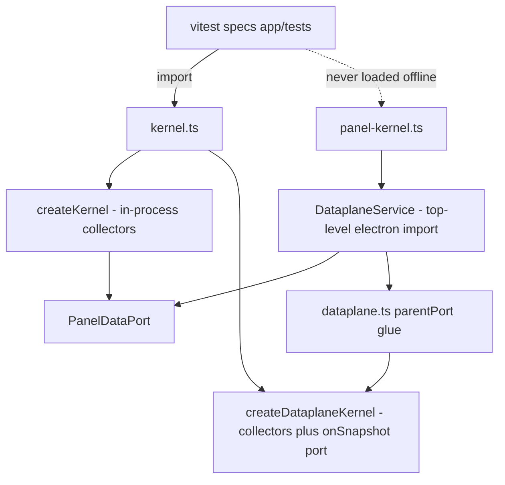

# Testing strategy: offline seams and what they pin

`npm test` runs the whole verification suite that needs neither Electron nor the machine's real data: vitest specs under `app/tests/**` that import the TypeScript sources directly and drive cordis services with injected fake sources. Everything that requires a window, an FFI call, a real tool store or the real Listary engine is deliberately left to `npm run accept` ([acceptance battery](/openwiki/testing/acceptance-battery.md)). This page is the offline half: the rule that keeps it loadable, the injection seam every service exposes, the manual pumps that replace the kernel's timers, what the bridge contract suite actually guarantees, and the gaps that stay open by design.

## What runs, and what it loads

| Fact | Where |
|---|---|
<!-- openwiki: broken internal link [/repo://app/package.json#L7-L14] file "/repo://app/package.json" does not exist. Fix the href or restore the target, then delete this comment. -->
| `npm test` is `vitest run`; `npm run typecheck` type-checks sources and specs without emitting | [package.json](/repo://app/package.json#L7-L14) |
<!-- openwiki: broken internal link [/repo://app/package.json#L10] file "/repo://app/package.json" does not exist. Fix the href or restore the target, then delete this comment. -->
<!-- openwiki: broken internal link [/repo://README.md#L34] file "/repo://README.md" does not exist. Fix the href or restore the target, then delete this comment. -->
| There is no `vitest.config.*` in `app/` — the suite is just the `*.spec.ts` files under `app/tests/**`, discovered with vitest's defaults (Node environment) | [package.json](/repo://app/package.json#L10), [README](/repo://README.md#L34) |
<!-- openwiki: broken internal link [/repo://app/tests/contract.spec.ts#L1-L10] file "/repo://app/tests/contract.spec.ts" does not exist. Fix the href or restore the target, then delete this comment. -->
<!-- openwiki: broken internal link [/repo://app/tests/services.spec.ts#L5-L14] file "/repo://app/tests/services.spec.ts" does not exist. Fix the href or restore the target, then delete this comment. -->
| Specs import `../src/main/...` as TypeScript, so the suite never needs `npm run build` and never touches `dist/` | [contract.spec.ts](/repo://app/tests/contract.spec.ts#L1-L10), [services.spec.ts](/repo://app/tests/services.spec.ts#L5-L14) |
<!-- openwiki: broken internal link [/repo://app/tsconfig.typecheck.json#L1-L7] file "/repo://app/tsconfig.typecheck.json" does not exist. Fix the href or restore the target, then delete this comment. -->
<!-- openwiki: broken internal link [/repo://app/tsconfig.json#L15-L15] file "/repo://app/tsconfig.json" does not exist. Fix the href or restore the target, then delete this comment. -->
| `tsconfig.typecheck.json` includes `src/**` plus `tests/**`, while the emit config covers only `src/main`, `src/preload`, `src/shared` — specs are type-checked, never compiled into the build | [tsconfig.typecheck.json](/repo://app/tsconfig.typecheck.json#L1-L7), [tsconfig.json](/repo://app/tsconfig.json#L15-L15) |

<!-- openwiki: broken internal link [/repo://app/tests/autostart.spec.ts#L160-L160] file "/repo://app/tests/autostart.spec.ts" does not exist. Fix the href or restore the target, then delete this comment. -->
<!-- openwiki: broken internal link [/repo://app/tests/autostart.spec.ts#L247-L247] file "/repo://app/tests/autostart.spec.ts" does not exist. Fix the href or restore the target, then delete this comment. -->
Specs use real Node built-ins where that is the interesting surface: `node:sqlite` to build tool databases, `node:http` to serve a fake Listary API, `node:fs` plus `attrib` for hidden/system file attributes, `child_process` for the COM shortcut round-trip. A few of those are Windows-only and say so: the COM parts of the autostart spec are wrapped in `describe.skipIf(!isWindows)` ([autostart.spec.ts](/repo://app/tests/autostart.spec.ts#L160-L160), [autostart.spec.ts](/repo://app/tests/autostart.spec.ts#L247-L247)).

## The Electron rule, and the one place it is broken on purpose

<!-- openwiki: broken internal link [/repo://app/src/main/kernel.ts#L167-L176] file "/repo://app/src/main/kernel.ts" does not exist. Fix the href or restore the target, then delete this comment. -->
<!-- openwiki: broken internal link [/repo://app/src/main/panel-kernel.ts#L1-L11] file "/repo://app/src/main/panel-kernel.ts" does not exist. Fix the href or restore the target, then delete this comment. -->
No module that the offline suite loads may import `electron` at module scope. `kernel.ts` states it in the comment above `dataplaneSnapshot` — it builds the clock inline precisely so the file stays loadable offline — and `panel-kernel.ts` states the converse: it imports `DataplaneService`, whose first line is a top-level `electron` import, so no offline test may load that file ([kernel.ts](/repo://app/src/main/kernel.ts#L167-L176), [panel-kernel.ts](/repo://app/src/main/panel-kernel.ts#L1-L11)).

*`LocalPanelDataService` (in-process) and `DataplaneService` (over a utilityProcess RPC) are the two implementations of `PanelDataPort`; the offline suite loads only the first, and the Electron-only host file with it.*

The rule is kept by making Electron reachable only through lazily bound adapters, so importing them under plain Node is harmless and the real API is touched only when a dependency was not injected:

<!-- openwiki: broken internal link [/repo://app/src/main/desktop/adapter.ts#L1-L5] file "/repo://app/src/main/desktop/adapter.ts" does not exist. Fix the href or restore the target, then delete this comment. -->
<!-- openwiki: broken internal link [/repo://app/src/main/desktop/adapter.ts#L52-L62] file "/repo://app/src/main/desktop/adapter.ts" does not exist. Fix the href or restore the target, then delete this comment. -->
- `desktop/adapter.ts` binds `koffi` on first use and resolves `require('electron')` inside the functions that need it; `defaultDesktopRoots()` falls back to `homedir()/Desktop` when `app.getPath` is unavailable ([desktop/adapter.ts](/repo://app/src/main/desktop/adapter.ts#L1-L5), [desktop/adapter.ts](/repo://app/src/main/desktop/adapter.ts#L52-L62)).
<!-- openwiki: broken internal link [/repo://app/src/main/focus/adapter.ts#L1-L5] file "/repo://app/src/main/focus/adapter.ts" does not exist. Fix the href or restore the target, then delete this comment. -->
<!-- openwiki: broken internal link [/repo://app/src/main/focus/adapter.ts#L33-L51] file "/repo://app/src/main/focus/adapter.ts" does not exist. Fix the href or restore the target, then delete this comment. -->
- `focus/adapter.ts` binds `user32`/`kernel32` on first use only ([focus/adapter.ts](/repo://app/src/main/focus/adapter.ts#L1-L5), [focus/adapter.ts](/repo://app/src/main/focus/adapter.ts#L33-L51)).
<!-- openwiki: broken internal link [/repo://app/src/main/usage/native.ts#L1-L4] file "/repo://app/src/main/usage/native.ts" does not exist. Fix the href or restore the target, then delete this comment. -->
- `usage/native.ts` binds `psapi`/`kernel32`/`user32` the same way ([usage/native.ts](/repo://app/src/main/usage/native.ts#L1-L4)).
<!-- openwiki: broken internal link [/repo://app/src/main/paths.ts#L6-L13] file "/repo://app/src/main/paths.ts" does not exist. Fix the href or restore the target, then delete this comment. -->
- `paths.ts` returns `app.getPath('userData')` when Electron answers and otherwise falls back to `LOCALAPPDATA` ([paths.ts](/repo://app/src/main/paths.ts#L6-L13)).

Everything else that imports `electron` directly (`index.ts`, `hotzone.ts`, `panel-window.ts`, `panel-ipc.ts`, `tray.ts`, `win32.ts`, `plugins/protocol.ts`, `preload/index.ts`) is simply never loaded by a spec.

<!-- openwiki: broken internal link [/repo://app/src/main/services/dataplane.ts#L1-L1] file "/repo://app/src/main/services/dataplane.ts" does not exist. Fix the href or restore the target, then delete this comment. -->
<!-- openwiki: broken internal link [/repo://app/src/main/services/dataplane.ts#L35-L35] file "/repo://app/src/main/services/dataplane.ts" does not exist. Fix the href or restore the target, then delete this comment. -->
<!-- openwiki: broken internal link [/repo://app/src/main/panel-kernel.ts#L34-L51] file "/repo://app/src/main/panel-kernel.ts" does not exist. Fix the href or restore the target, then delete this comment. -->
<!-- openwiki: broken internal link [/repo://app/src/main/services/panel-data.ts#L10-L33] file "/repo://app/src/main/services/panel-data.ts" does not exist. Fix the href or restore the target, then delete this comment. -->
<!-- openwiki: broken internal link [/repo://app/src/main/kernel.ts#L62-L84] file "/repo://app/src/main/kernel.ts" does not exist. Fix the href or restore the target, then delete this comment. -->
<!-- openwiki: broken internal link [/repo://app/src/main/services/bridge.ts#L22-L23] file "/repo://app/src/main/services/bridge.ts" does not exist. Fix the href or restore the target, then delete this comment. -->
**The deliberate break** is `src/main/services/dataplane.ts`: a cordis service class living in `services/`, importing `utilityProcess` at the top ([services/dataplane.ts](/repo://app/src/main/services/dataplane.ts#L1-L1), [services/dataplane.ts](/repo://app/src/main/services/dataplane.ts#L35-L35)). It is registered only by `createPanelKernel` ([panel-kernel.ts](/repo://app/src/main/panel-kernel.ts#L34-L51)), which the suite never imports. For tests, the data-plane port has a second implementation: `LocalPanelDataService`, a cordis service that forwards `clock/sessions/hardware/desktop/icon/launch/move/resetLayout` straight to the in-process collectors and declares `static inject = ['clock', 'sessions', 'hardware', 'desktop']` ([panel-data.ts](/repo://app/src/main/services/panel-data.ts#L10-L33)). `createKernel` registers it before `BridgeService`, because the bridge's own `inject` list requires `panelData` to exist ([kernel.ts](/repo://app/src/main/kernel.ts#L62-L84), [bridge.ts](/repo://app/src/main/services/bridge.ts#L22-L23)).

The practical consequence for new code: a service added to `createKernel` must be constructible with injected dependencies, and anything that needs an Electron API belongs behind a dependency bundle or in the separate Electron-only assembly, not as a top-level import in a shared service.

## The injection seam: one dependency bundle per service

Every collector exposes its external world as an interface and takes a **partial** override in its options; missing entries are filled with the real source using `??`. Tests therefore inject only what they care about and keep the pure-Node implementations for the rest. A new test should follow the same shape: name the interface, add it to the service's options, inject a `Partial<...>` — the suite never uses module mocking.

| Service | Injected bundle, defined in | Real source | Other knobs the tests use |
|---|---|---|---|
<!-- openwiki: broken internal link [/repo://app/src/main/services/hardware.ts#L17-L24] file "/repo://app/src/main/services/hardware.ts" does not exist. Fix the href or restore the target, then delete this comment. -->
<!-- openwiki: broken internal link [/repo://app/src/main/services/hardware.ts#L26-L38] file "/repo://app/src/main/services/hardware.ts" does not exist. Fix the href or restore the target, then delete this comment. -->
| `HardwareService` | `HardwareSources` — `cpuTimes`, `memory`, `net`, `gpu`, `monotonic` ([services/hardware.ts](/repo://app/src/main/services/hardware.ts#L17-L24)) | `systemHardwareSources()` in the same file: `os.cpus`/`os.totalmem`, lazily required `net-counters`, `GpuQuery` over `nvidia-smi`, `performance.now()/1000` ([services/hardware.ts](/repo://app/src/main/services/hardware.ts#L26-L38)) | `sources` |
<!-- openwiki: broken internal link [/repo://app/src/main/services/desktop.ts#L14-L35] file "/repo://app/src/main/services/desktop.ts" does not exist. Fix the href or restore the target, then delete this comment. -->
<!-- openwiki: broken internal link [/repo://app/src/main/desktop/adapter.ts#L30-L119] file "/repo://app/src/main/desktop/adapter.ts" does not exist. Fix the href or restore the target, then delete this comment. -->
<!-- openwiki: broken internal link [/repo://app/src/main/services/desktop.ts#L66-L93] file "/repo://app/src/main/services/desktop.ts" does not exist. Fix the href or restore the target, then delete this comment. -->
| `DesktopService` | `DesktopDeps` — `listDir`, `extractIcon`, `open`, `watch`, `readShortcutTarget`, `fileExists`, `readStoreText`, `writeStoreText`, `iconScores` ([services/desktop.ts](/repo://app/src/main/services/desktop.ts#L14-L35)) | `desktop/adapter.ts`: `defaultListDir`, `electronIconExtractor`, `shellOpen`, `defaultWatchDesktopRoots`, `electronShortcutTarget`, `fsFileExists`, `readStoreText`, `writeStoreText` ([desktop/adapter.ts](/repo://app/src/main/desktop/adapter.ts#L30-L119)) | `roots`, `storeFile`, `docMaxRows`, and `deps.extractIcon: null` for the assembly that has no icon face ([services/desktop.ts](/repo://app/src/main/services/desktop.ts#L66-L93)) |
<!-- openwiki: broken internal link [/repo://app/src/main/services/usage.ts#L9-L15] file "/repo://app/src/main/services/usage.ts" does not exist. Fix the href or restore the target, then delete this comment. -->
<!-- openwiki: broken internal link [/repo://app/src/main/services/usage.ts#L38-L58] file "/repo://app/src/main/services/usage.ts" does not exist. Fix the href or restore the target, then delete this comment. -->
| `UsageService` | `UsageDeps` — `runningPidExes`, `foregroundExe`, `readPrior` ([services/usage.ts](/repo://app/src/main/services/usage.ts#L9-L15)) | `usage/native.ts` (`nativeRunningPidExes`, `nativeForegroundExe`) and `usage/userassist.ts` (`readUserAssistPrior`) ([services/usage.ts](/repo://app/src/main/services/usage.ts#L38-L58)) | `dir` (always a tmp path) |
<!-- openwiki: broken internal link [/repo://app/src/main/services/search.ts#L18-L28] file "/repo://app/src/main/services/search.ts" does not exist. Fix the href or restore the target, then delete this comment. -->
<!-- openwiki: broken internal link [/repo://app/src/main/services/search.ts#L74-L88] file "/repo://app/src/main/services/search.ts" does not exist. Fix the href or restore the target, then delete this comment. -->
| `SearchService` | `SearchDeps` — `search`, `open`, `reveal`, `now` ([services/search.ts](/repo://app/src/main/services/search.ts#L18-L28)) | `search/client.ts`'s `listarySearch` against `127.0.0.1`, `shellOpen`, and a `spawn('explorer', ['/select,', path])` reveal ([services/search.ts](/repo://app/src/main/services/search.ts#L74-L88)) | `port`, `limit`; `now` is what makes the debounce testable |
<!-- openwiki: broken internal link [/repo://app/src/main/services/focus.ts#L19-L29] file "/repo://app/src/main/services/focus.ts" does not exist. Fix the href or restore the target, then delete this comment. -->
<!-- openwiki: broken internal link [/repo://app/src/main/services/focus.ts#L50-L59] file "/repo://app/src/main/services/focus.ts" does not exist. Fix the href or restore the target, then delete this comment. -->
| `FocusService` | `FocusDeps` — `listWindows`, `focusWindow`, `launch`, `env` ([services/focus.ts](/repo://app/src/main/services/focus.ts#L19-L29)) | `focus/adapter.ts` (`nativeWindowCandidates`, `nativeFocusWindow`, `shellLaunch`) and `process.env` ([services/focus.ts](/repo://app/src/main/services/focus.ts#L50-L59)) | `tools` (tool→exe mapping, usually a one-entry fake) |
<!-- openwiki: broken internal link [/repo://app/src/main/scanners/index.ts#L30-L39] file "/repo://app/src/main/scanners/index.ts" does not exist. Fix the href or restore the target, then delete this comment. -->
| `SessionsService` | No bundle — the seam is the roots map itself: `SessionRoots`, one directory per tool ([scanners/index.ts](/repo://app/src/main/scanners/index.ts#L30-L39)) | `defaultSessionRoots()` derives the five real roots from `os.homedir()` | `roots` (a fixture root) |

<!-- openwiki: broken internal link [/repo://app/src/main/dataplane.ts#L38-L59] file "/repo://app/src/main/dataplane.ts" does not exist. Fix the href or restore the target, then delete this comment. -->
<!-- openwiki: broken internal link [/repo://app/tests/dataplane-protocol.spec.ts#L10-L52] file "/repo://app/tests/dataplane-protocol.spec.ts" does not exist. Fix the href or restore the target, then delete this comment. -->
<!-- openwiki: broken internal link [/repo://app/src/main/services/desktop.ts#L95-L110] file "/repo://app/src/main/services/desktop.ts" does not exist. Fix the href or restore the target, then delete this comment. -->
<!-- openwiki: broken internal link [/repo://app/tests/desktop/service.spec.ts#L21-L71] file "/repo://app/tests/desktop/service.spec.ts" does not exist. Fix the href or restore the target, then delete this comment. -->
Two details are worth knowing before copying the pattern. The same bundles cross the process boundary in the data plane: `createDataplaneKernel` is handed `deps: { extractIcon: null, readShortcutTarget: (lnk) => resolver.resolve(lnk) }`, where `resolver` is a `ProxyShortcutResolver` that batches unresolved paths and asks the panel process over the protocol ([dataplane.ts](/repo://app/src/main/dataplane.ts#L38-L59)). That proxy is itself tested as pure logic by injecting a fake sender and asserting batching, in-flight suppression and negative caching ([dataplane-protocol.spec.ts](/repo://app/tests/dataplane-protocol.spec.ts#L10-L52)). And a partly-injected `DesktopService` still exercises the failure path deliberately: a scan failure keeps the previous round's items rather than emptying the desktop, which the service spec drives by toggling `failScan` while keeping the injected `listDir`/`watch` ([services/desktop.ts](/repo://app/src/main/services/desktop.ts#L95-L110), [desktop/service.spec.ts](/repo://app/tests/desktop/service.spec.ts#L21-L71)).

## Assemblies and manual pumps

<!-- openwiki: broken internal link [/repo://app/src/main/kernel.ts#L62-L84] file "/repo://app/src/main/kernel.ts" does not exist. Fix the href or restore the target, then delete this comment. -->
`createKernel(options)` registers `ClockService`, `SessionsService`, `HardwareService`, `UsageService`, `DesktopService` (whose `iconScores` defaults to `ctx.usage.iconScores`), then `LocalPanelDataService`, `BridgeService`, `SearchService`, `SettingsService`, `FocusService` and `PluginHostService` ([kernel.ts](/repo://app/src/main/kernel.ts#L62-L84)).

<!-- openwiki: broken internal link [/repo://app/src/main/kernel.ts#L24-L53] file "/repo://app/src/main/kernel.ts" does not exist. Fix the href or restore the target, then delete this comment. -->
Every loop it would normally run has a zero switch, documented as "0 = no timer, the offline test drives it by hand" ([kernel.ts](/repo://app/src/main/kernel.ts#L24-L53)):

| Option | Default | What the specs call instead |
|---|---|---|
<!-- openwiki: broken internal link [/repo://app/src/main/services/bridge.ts#L98-L107] file "/repo://app/src/main/services/bridge.ts" does not exist. Fix the href or restore the target, then delete this comment. -->
| `tickIntervalMs` | `DEFAULT_TICK_MS` = 1000 | `ctx.bridge.tick()` — refresh the data plane and emit `panel/changed` ([bridge.ts](/repo://app/src/main/services/bridge.ts#L98-L107)) |
<!-- openwiki: broken internal link [/repo://app/src/main/services/hardware.ts#L67-L99] file "/repo://app/src/main/services/hardware.ts" does not exist. Fix the href or restore the target, then delete this comment. -->
| `hardwareIntervalMs` | `DEFAULT_HARDWARE_MS` = 1000 | `ctx.hardware.sample()` ([services/hardware.ts](/repo://app/src/main/services/hardware.ts#L67-L99)) |
<!-- openwiki: broken internal link [/repo://app/src/main/services/usage.ts#L65-L83] file "/repo://app/src/main/services/usage.ts" does not exist. Fix the href or restore the target, then delete this comment. -->
| `usageIntervalMs` | `DEFAULT_USAGE_MS` = 2000 | `ctx.usage.collect()` ([services/usage.ts](/repo://app/src/main/services/usage.ts#L65-L83)) |
<!-- openwiki: broken internal link [/repo://app/src/main/services/search.ts#L124-L133] file "/repo://app/src/main/services/search.ts" does not exist. Fix the href or restore the target, then delete this comment. -->
| `searchIntervalMs` | `DEFAULT_SEARCH_INTERVAL_MS` = 50 | `ctx.search.tick()` for the debounce/backoff pump ([services/search.ts](/repo://app/src/main/services/search.ts#L124-L133)) |

<!-- openwiki: broken internal link [/repo://app/tests/contract.spec.ts#L14-L66] file "/repo://app/tests/contract.spec.ts" does not exist. Fix the href or restore the target, then delete this comment. -->
<!-- openwiki: broken internal link [/repo://app/src/main/kernel.ts#L95-L102] file "/repo://app/src/main/kernel.ts" does not exist. Fix the href or restore the target, then delete this comment. -->
The contract suite's `kernelOpts` helper sets all four to 0, injects tmp-rooted desktop and usage options plus a tmp `config.json` stub, and is the base of every kernel-level test ([contract.spec.ts](/repo://app/tests/contract.spec.ts#L14-L66)). One consequence of the coupling in `createKernel` is easy to miss: the hourly `USAGE_PRUNE_MS` prune is installed inside the same `if` as the usage poll timer, so with `usageIntervalMs: 0` pruning never fires offline ([kernel.ts](/repo://app/src/main/kernel.ts#L95-L102)).

<!-- openwiki: broken internal link [/repo://app/src/main/kernel.ts#L112-L165] file "/repo://app/src/main/kernel.ts" does not exist. Fix the href or restore the target, then delete this comment. -->
<!-- openwiki: broken internal link [/repo://app/tests/dataplane-kernel.spec.ts#L45-L88] file "/repo://app/tests/dataplane-kernel.spec.ts" does not exist. Fix the href or restore the target, then delete this comment. -->
<!-- openwiki: broken internal link [/repo://app/tests/dataplane-kernel.spec.ts#L1-L5] file "/repo://app/tests/dataplane-kernel.spec.ts" does not exist. Fix the href or restore the target, then delete this comment. -->
<!-- openwiki: broken internal link [/repo://app/src/main/dataplane.ts#L29-L34] file "/repo://app/src/main/dataplane.ts" does not exist. Fix the href or restore the target, then delete this comment. -->
`createDataplaneKernel(options)` is the subprocess-side assembly: the same four collectors (sessions, hardware, usage, desktop) plus its own timers and an `onSnapshot` out-port, with no bridge, search, settings, focus or plugins ([kernel.ts](/repo://app/src/main/kernel.ts#L112-L165)). Its spec runs it with tiny real intervals (10 ms) and a `setTimeout` of 60 ms to let a sampling round happen, then asserts the snapshot's shape and the desktop write path ([dataplane-kernel.spec.ts](/repo://app/tests/dataplane-kernel.spec.ts#L45-L88)). The `parentPort` glue in `src/main/dataplane.ts` is explicitly out of scope for it — "the subprocess entry is just glue, covered by the acceptance battery" ([dataplane-kernel.spec.ts](/repo://app/tests/dataplane-kernel.spec.ts#L1-L5), [dataplane.ts](/repo://app/src/main/dataplane.ts#L29-L34)).

<!-- openwiki: broken internal link [/repo://app/src/main/kernel.ts#L85-L108] file "/repo://app/src/main/kernel.ts" does not exist. Fix the href or restore the target, then delete this comment. -->
<!-- openwiki: broken internal link [/repo://app/src/main/services/desktop.ts#L88-L89] file "/repo://app/src/main/services/desktop.ts" does not exist. Fix the href or restore the target, then delete this comment. -->
<!-- openwiki: broken internal link [/repo://app/tests/wind-restore.spec.ts#L5-L29] file "/repo://app/tests/wind-restore.spec.ts" does not exist. Fix the href or restore the target, then delete this comment. -->
<!-- openwiki: broken internal link [/repo://app/tests/usage/log.spec.ts#L131-L135] file "/repo://app/tests/usage/log.spec.ts" does not exist. Fix the href or restore the target, then delete this comment. -->
Other lifecycle conventions: every spec does `await ctx.start()` and stops the context in `finally`; `dispose` handlers clear the timers and stop `fs.watch` ([kernel.ts](/repo://app/src/main/kernel.ts#L85-L108), [services/desktop.ts](/repo://app/src/main/services/desktop.ts#L88-L89)). Vitest fake timers are the exception rather than the rule and are used only for the Win+D debounce state machine, which is written as pure logic over an injected `isDown()` probe ([wind-restore.spec.ts](/repo://app/tests/wind-restore.spec.ts#L5-L29)). Where a service reads module-level state or native modules, `usage/log.spec.ts` re-imports it after `vi.resetModules()` instead of mocking ([usage/log.spec.ts](/repo://app/tests/usage/log.spec.ts#L131-L135)).

## The bridge contract suite as an executable renderer API

<!-- openwiki: broken internal link [/repo://app/src/shared/contract.ts#L217-L268] file "/repo://app/src/shared/contract.ts" does not exist. Fix the href or restore the target, then delete this comment. -->
<!-- openwiki: broken internal link [/repo://app/src/main/services/bridge.ts#L50-L96] file "/repo://app/src/main/services/bridge.ts" does not exist. Fix the href or restore the target, then delete this comment. -->
`tests/contract.spec.ts` boots the in-process kernel and drives exactly the surface the renderer sees — `ctx.bridge.invoke(method, payload)` and `ctx.bridge.subscribe(event, listener)` — instead of reaching into services. It is organised as one `describe` per ticket that extended the contract, and the tables it exercises live in `src/shared/contract.ts`: `BridgeMethods` (request/response per method) and `BridgeEvents` (payload per event) ([contract.ts](/repo://app/src/shared/contract.ts#L217-L268), [bridge.ts](/repo://app/src/main/services/bridge.ts#L50-L96)).

What the suite actually pins:

<!-- openwiki: broken internal link [/repo://app/tests/contract.spec.ts#L68-L80] file "/repo://app/tests/contract.spec.ts" does not exist. Fix the href or restore the target, then delete this comment. -->
<!-- openwiki: broken internal link [/repo://app/tests/services.spec.ts#L163-L190] file "/repo://app/tests/services.spec.ts" does not exist. Fix the href or restore the target, then delete this comment. -->
<!-- openwiki: broken internal link [/repo://app/tests/contract.spec.ts#L537-L566] file "/repo://app/tests/contract.spec.ts" does not exist. Fix the href or restore the target, then delete this comment. -->
- **Snapshot shape per section.** `panel/snapshot` carries clock, sessions, hardware (gauges plus history rings), weather coordinates, desktop items/plan, layout geometry, settings and plugins; the retired `qoder` section must be absent, and `PLUGIN_CAPABILITIES` must not contain `qoder` ([contract.spec.ts](/repo://app/tests/contract.spec.ts#L68-L80), [services.spec.ts](/repo://app/tests/services.spec.ts#L163-L190), [contract.spec.ts](/repo://app/tests/contract.spec.ts#L537-L566)).
<!-- openwiki: broken internal link [/repo://app/tests/contract.spec.ts#L82-L98] file "/repo://app/tests/contract.spec.ts" does not exist. Fix the href or restore the target, then delete this comment. -->
<!-- openwiki: broken internal link [/repo://app/tests/contract.spec.ts#L490-L509] file "/repo://app/tests/contract.spec.ts" does not exist. Fix the href or restore the target, then delete this comment. -->
<!-- openwiki: broken internal link [/repo://app/tests/contract.spec.ts#L343-L369] file "/repo://app/tests/contract.spec.ts" does not exist. Fix the href or restore the target, then delete this comment. -->
- **Push semantics.** `panel/changed` fires once per `tick()` and stops after unsubscribe; `plugins/changed` is pushed independently of the 1 Hz snapshot; `settings/changed` fires only when the value changes ([contract.spec.ts](/repo://app/tests/contract.spec.ts#L82-L98), [contract.spec.ts](/repo://app/tests/contract.spec.ts#L490-L509), [contract.spec.ts](/repo://app/tests/contract.spec.ts#L343-L369)).
<!-- openwiki: broken internal link [/repo://app/tests/contract.spec.ts#L100-L108] file "/repo://app/tests/contract.spec.ts" does not exist. Fix the href or restore the target, then delete this comment. -->
<!-- openwiki: broken internal link [/repo://app/tests/contract.spec.ts#L371-L383] file "/repo://app/tests/contract.spec.ts" does not exist. Fix the href or restore the target, then delete this comment. -->
- **Contract violations are errors, not silence.** An unknown method rejects with `未知桥接方法`; a non-finite opacity is rejected rather than clamped ([contract.spec.ts](/repo://app/tests/contract.spec.ts#L100-L108), [contract.spec.ts](/repo://app/tests/contract.spec.ts#L371-L383)).
<!-- openwiki: broken internal link [/repo://app/tests/contract.spec.ts#L413-L440] file "/repo://app/tests/contract.spec.ts" does not exist. Fix the href or restore the target, then delete this comment. -->
<!-- openwiki: broken internal link [/repo://app/src/main/services/focus.ts#L61-L90] file "/repo://app/src/main/services/focus.ts" does not exist. Fix the href or restore the target, then delete this comment. -->
- **Degradation is a response, not a throw.** `session/focus` with an unknown tool resolves to `{ok: false, action: 'degraded'}` and the panel still answers `panel/snapshot` afterwards, which is why the renderer needs no `try/catch` on those clicks ([contract.spec.ts](/repo://app/tests/contract.spec.ts#L413-L440), [services/focus.ts](/repo://app/src/main/services/focus.ts#L61-L90)).
<!-- openwiki: broken internal link [/repo://app/tests/contract.spec.ts#L160-L187] file "/repo://app/tests/contract.spec.ts" does not exist. Fix the href or restore the target, then delete this comment. -->
<!-- openwiki: broken internal link [/repo://app/tests/contract.spec.ts#L283-L305] file "/repo://app/tests/contract.spec.ts" does not exist. Fix the href or restore the target, then delete this comment. -->
<!-- openwiki: broken internal link [/repo://app/src/main/services/focus.ts#L62-L73] file "/repo://app/src/main/services/focus.ts" does not exist. Fix the href or restore the target, then delete this comment. -->
- **Path guardrails.** `desktop/launch` refuses a path outside the current scan pool (no arbitrary path execution), `search/action` refuses a path outside the most recent result set, and `session/focus` looks a tool up only as an own property of `config.tools`, so `toString`/`constructor` cannot become a launch target ([contract.spec.ts](/repo://app/tests/contract.spec.ts#L160-L187), [contract.spec.ts](/repo://app/tests/contract.spec.ts#L283-L305), [services/focus.ts](/repo://app/src/main/services/focus.ts#L62-L73)).
<!-- openwiki: broken internal link [/repo://app/tests/contract.spec.ts#L328-L369] file "/repo://app/tests/contract.spec.ts" does not exist. Fix the href or restore the target, then delete this comment. -->
- **Persistence of a settings write.** The clamped value is asserted on disk in the injected config file, which is the restart-persistence source ([contract.spec.ts](/repo://app/tests/contract.spec.ts#L328-L369)).

<!-- openwiki: broken internal link [/repo://app/src/main/panel-ipc.ts#L26-L55] file "/repo://app/src/main/panel-ipc.ts" does not exist. Fix the href or restore the target, then delete this comment. -->
<!-- openwiki: broken internal link [/repo://app/src/preload/index.ts#L8-L30] file "/repo://app/src/preload/index.ts" does not exist. Fix the href or restore the target, then delete this comment. -->
What it does **not** cover is the transport. `wireBridgeIpc` wraps `bridge.invoke` in an `ok`/`error` envelope, forwards a fixed `FORWARDED_EVENTS` list, and the preload unwraps the envelope back into a rejection ([panel-ipc.ts](/repo://app/src/main/panel-ipc.ts#L26-L55), [preload/index.ts](/repo://app/src/preload/index.ts#L8-L30)). No spec loads either file, so a new bridge event must be added to that list by hand, and only a real run proves the renderer receives it.

## Fixtures and harnesses

<!-- openwiki: broken internal link [/repo://app/tests/scanners/fixtures.ts#L1-L9] file "/repo://app/tests/scanners/fixtures.ts" does not exist. Fix the href or restore the target, then delete this comment. -->
<!-- openwiki: broken internal link [/repo://app/tests/scanners/fixtures.ts#L24-L45] file "/repo://app/tests/scanners/fixtures.ts" does not exist. Fix the href or restore the target, then delete this comment. -->
<!-- openwiki: broken internal link [/repo://app/tests/scanners/fixtures.ts#L47-L98] file "/repo://app/tests/scanners/fixtures.ts" does not exist. Fix the href or restore the target, then delete this comment. -->
<!-- openwiki: broken internal link [/repo://app/tests/scanners/fixtures.ts#L143-L198] file "/repo://app/tests/scanners/fixtures.ts" does not exist. Fix the href or restore the target, then delete this comment. -->
<!-- openwiki: broken internal link [/repo://app/src/main/scanners/index.ts#L41-L53] file "/repo://app/src/main/scanners/index.ts" does not exist. Fix the href or restore the target, then delete this comment. -->
<!-- openwiki: broken internal link [/repo://app/tests/scanners/collect.spec.ts#L32-L60] file "/repo://app/tests/scanners/collect.spec.ts" does not exist. Fix the href or restore the target, then delete this comment. -->
**Scanner fixtures** (`tests/scanners/fixtures.ts`) are builders of real store shapes rather than JSON blobs, mirroring the Python-era fixtures: `QoderFx` writes `projects/<proj>/<sid>.jsonl` plus `tasks/<sid>/*.json` and sets ages with `fs.utimesSync`; `HermesFx` and `ZcodeFx` create **real** SQLite databases with `node:sqlite` using the tools' schemas (sessions, todos, leases); `KimiCodeFx` builds the two-level workspace/session tree with `state.json` and `wire.jsonl`; `KimiWorkFx` writes the two flat JSON maps and can drop one side to model partial data ([scanners/fixtures.ts](/repo://app/tests/scanners/fixtures.ts#L1-L9), [scanners/fixtures.ts](/repo://app/tests/scanners/fixtures.ts#L24-L45), [scanners/fixtures.ts](/repo://app/tests/scanners/fixtures.ts#L47-L98), [scanners/fixtures.ts](/repo://app/tests/scanners/fixtures.ts#L143-L198)). This is the regression net for the ported decision semantics: state classification, the active window, project naming, per-tool failure being skipped silently by `collectSessions` ([scanners/index.ts](/repo://app/src/main/scanners/index.ts#L41-L53), [scanners/collect.spec.ts](/repo://app/tests/scanners/collect.spec.ts#L32-L60)).

<!-- openwiki: broken internal link [/repo://app/tests/search/harness.ts#L13-L70] file "/repo://app/tests/search/harness.ts" does not exist. Fix the href or restore the target, then delete this comment. -->
<!-- openwiki: broken internal link [/repo://app/tests/search/harness.ts#L1-L7] file "/repo://app/tests/search/harness.ts" does not exist. Fix the href or restore the target, then delete this comment. -->
**The shared search harness** (`tests/search/harness.ts`) is the one cross-spec fixture: a fake `SearchDeps` bundle with a synthetic clock (`now: () => t` plus `advance(ms)`), recording `search`/`open`/`reveal`, and gear-shifting responses — `okPayload`, `goOffline` (throws `ListaryNetworkError`), `goBroken`, `goRateLimited` — with `flush()` (a `setImmediate` promise) to settle in-flight async work ([search/harness.ts](/repo://app/tests/search/harness.ts#L13-L70)). It lives in a non-`spec` file on purpose: importing a `*.spec.ts` helper would re-run that file's `describe`s in the importing suite ([search/harness.ts](/repo://app/tests/search/harness.ts#L1-L7)).

<!-- openwiki: broken internal link [/repo://app/tests/services.spec.ts#L50-L73] file "/repo://app/tests/services.spec.ts" does not exist. Fix the href or restore the target, then delete this comment. -->
<!-- openwiki: broken internal link [/repo://app/tests/desktop/service.spec.ts#L21-L71] file "/repo://app/tests/desktop/service.spec.ts" does not exist. Fix the href or restore the target, then delete this comment. -->
<!-- openwiki: broken internal link [/repo://app/tests/focus/service.spec.ts#L14-L41] file "/repo://app/tests/focus/service.spec.ts" does not exist. Fix the href or restore the target, then delete this comment. -->
**Inline worlds** are used where a harness would be overkill: `fakeHardware()` with a `tick()` that advances CPU times, net counters and the monotonic clock so sampling maths can be asserted step by step ([services.spec.ts](/repo://app/tests/services.spec.ts#L50-L73)); `fakeWorld()` for `DesktopService`, which injects `listDir`, a `watch` that captures the change callback so a rescan can be triggered deterministically, and a text-backed store ([desktop/service.spec.ts](/repo://app/tests/desktop/service.spec.ts#L21-L71)); a recorder harness for `FocusService` that keeps the focused hwnds and launched exes ([focus/service.spec.ts](/repo://app/tests/focus/service.spec.ts#L14-L41)).

<!-- openwiki: broken internal link [/repo://app/tests/contract.spec.ts#L14-L51] file "/repo://app/tests/contract.spec.ts" does not exist. Fix the href or restore the target, then delete this comment. -->
**Nothing points at real user data.** Kernel-level tests always use `fs.mkdtempSync` roots and inject the store, usage directory and config file, with the comment "kernel-level tests never touch the real `LOCALAPPDATA` file" as an explicit rule ([contract.spec.ts](/repo://app/tests/contract.spec.ts#L14-L51)). The same applies to the settings, autostart, migration and plugin-host specs, which all work in temporary directories and delete them in `afterEach`/`afterAll`.

## Privacy guards: source scans and real artifacts

Two mechanisms keep the privacy decisions from silently regressing; the rules themselves are in [privacy and data boundaries](/openwiki/concepts/privacy-and-data-boundaries.md).

**Source-level guards** read repository files from the spec and fail when a boundary is crossed:

<!-- openwiki: broken internal link [/repo://app/tests/usage/log.spec.ts#L116-L129] file "/repo://app/tests/usage/log.spec.ts" does not exist. Fix the href or restore the target, then delete this comment. -->
- A repo-wide walk of every `.ts` under `src/main` must not contain `GetWindowText` or `window_title` — ADR-0002's "never read window titles" holds by never calling the API, not by filtering afterwards ([usage/log.spec.ts](/repo://app/tests/usage/log.spec.ts#L116-L129)).
<!-- openwiki: broken internal link [/repo://app/tests/contract.spec.ts#L595-L609] file "/repo://app/tests/contract.spec.ts" does not exist. Fix the href or restore the target, then delete this comment. -->
<!-- openwiki: broken internal link [/repo://app/src/main/services/search.ts#L49-L56] file "/repo://app/src/main/services/search.ts" does not exist. Fix the href or restore the target, then delete this comment. -->
- The search chain (`search/engine.ts`, `search/client.ts`, `services/search.ts`) may not reference the usage log (`usage/log`, `appendEvent`, `UsageService`), may not call `writeFileSync`/`appendFileSync`, and may not contain a hardcoded `http(s)://` URL, while `client.ts` must take its host from `BASE_HOST` — the transport target is a loopback constant, and the query text is never persisted ([contract.spec.ts](/repo://app/tests/contract.spec.ts#L595-L609), [services/search.ts](/repo://app/src/main/services/search.ts#L49-L56)).
<!-- openwiki: broken internal link [/repo://app/tests/contract.spec.ts#L611-L619] file "/repo://app/tests/contract.spec.ts" does not exist. Fix the href or restore the target, then delete this comment. -->
- The session-row chain may not read titles through `SendMessageW` and its window-candidate type may not declare a `title` field ([contract.spec.ts](/repo://app/tests/contract.spec.ts#L611-L619)).
<!-- openwiki: broken internal link [/repo://app/tests/contract.spec.ts#L529-L534] file "/repo://app/tests/contract.spec.ts" does not exist. Fix the href or restore the target, then delete this comment. -->
- The renderer's plugin loader may not use `require(`/`node:fs`, and the preload may not use `node:fs`/`readFileSync`: the only privileged surface stays an IPC forwarder ([contract.spec.ts](/repo://app/tests/contract.spec.ts#L529-L534)).

**Artifact and behaviour guards** inspect what actually gets written:

<!-- openwiki: broken internal link [/repo://app/tests/usage/log.spec.ts#L56-L78] file "/repo://app/tests/usage/log.spec.ts" does not exist. Fix the href or restore the target, then delete this comment. -->
<!-- openwiki: broken internal link [/repo://app/src/main/usage/log.ts#L39-L50] file "/repo://app/src/main/usage/log.ts" does not exist. Fix the href or restore the target, then delete this comment. -->
- The on-disk usage record has exactly two fields: the spec parses a file written by `appendEvent` and asserts `Object.keys(record).sort() === ['exe', 'ts']`, and that `start` and `focus` land in separate per-day files ([usage/log.spec.ts](/repo://app/tests/usage/log.spec.ts#L56-L78), [usage/log.ts](/repo://app/src/main/usage/log.ts#L39-L50)).
<!-- openwiki: broken internal link [/repo://app/tests/contract.spec.ts#L569-L593] file "/repo://app/tests/contract.spec.ts" does not exist. Fix the href or restore the target, then delete this comment. -->
- One end-to-end search run — activate, feed a query, advance the synthetic clock, pump the search tick, flush, then run a real usage collection round — is followed by reading every file in the usage directory to prove the query word `SECRET-QUERY-WORDS` never landed on disk ([contract.spec.ts](/repo://app/tests/contract.spec.ts#L569-L593)).

<!-- openwiki: broken internal link [/repo://app/tests/desktop/adapter.spec.ts#L24-L33] file "/repo://app/tests/desktop/adapter.spec.ts" does not exist. Fix the href or restore the target, then delete this comment. -->
<!-- openwiki: broken internal link [/repo://app/tests/desktop/icons.spec.ts#L5-L5] file "/repo://app/tests/desktop/icons.spec.ts" does not exist. Fix the href or restore the target, then delete this comment. -->
Their limits are worth stating: these are text- and path-coupled assertions, so moving or renaming a scanned file shows up as a failure, and they can only prove the guarded path is absent, not that no other path exists. The `GetFileAttributesW` path, hidden/system filtering and the icon-resolution decision, by contrast, are covered by real-fs specs rather than guards ([desktop/adapter.spec.ts](/repo://app/tests/desktop/adapter.spec.ts#L24-L33), [desktop/icons.spec.ts](/repo://app/tests/desktop/icons.spec.ts#L5-L5)).

## Representative tests and what they pin

| Spec | Pins |
|---|---|
<!-- openwiki: broken internal link [/repo://app/tests/contract.spec.ts#L68-L619] file "/repo://app/tests/contract.spec.ts" does not exist. Fix the href or restore the target, then delete this comment. -->
| [contract.spec.ts](/repo://app/tests/contract.spec.ts#L68-L619) | the bridge method/event surface end-to-end through the kernel, plus the privacy guards |
<!-- openwiki: broken internal link [/repo://app/tests/services.spec.ts#L75-L221] file "/repo://app/tests/services.spec.ts" does not exist. Fix the href or restore the target, then delete this comment. -->
| [services.spec.ts](/repo://app/tests/services.spec.ts#L75-L221) | hardware sampling maths and per-source isolation (a throwing `net`/`gpu` source only nulls its own gauge), session rows with inline task progress, snapshot sections and `panel/changed` |
<!-- openwiki: broken internal link [/repo://app/tests/dataplane-kernel.spec.ts#L45-L122] file "/repo://app/tests/dataplane-kernel.spec.ts" does not exist. Fix the href or restore the target, then delete this comment. -->
| [dataplane-kernel.spec.ts](/repo://app/tests/dataplane-kernel.spec.ts#L45-L122) | the subprocess-side assembly, snapshot out-port shape, and the desktop move write path surviving into the next snapshot |
<!-- openwiki: broken internal link [/repo://app/tests/search/service.spec.ts#L12-L60] file "/repo://app/tests/search/service.spec.ts" does not exist. Fix the href or restore the target, then delete this comment. -->
| [search/service.spec.ts](/repo://app/tests/search/service.spec.ts#L12-L60) | idle/active/offline transitions, debounce, silent rate-limit backoff, offline retry, single-flight invalidation, action guardrails |
<!-- openwiki: broken internal link [/repo://app/tests/search/client.spec.ts#L20-L52] file "/repo://app/tests/search/client.spec.ts" does not exist. Fix the href or restore the target, then delete this comment. -->
| [search/client.spec.ts](/repo://app/tests/search/client.spec.ts#L20-L52) | the real HTTP layer against a loopback fake API: request body (`query`/`limit`/`offset`), refusal, timeout, rate-limit payload, invalid payload |
<!-- openwiki: broken internal link [/repo://app/tests/usage/log.spec.ts#L26-L164] file "/repo://app/tests/usage/log.spec.ts" does not exist. Fix the href or restore the target, then delete this comment. -->
| [usage/log.spec.ts](/repo://app/tests/usage/log.spec.ts#L26-L164) | pid-diff start detection, foreground-change detection, per-day files, retention pruning, record shape, the source walk, and the `UsageService` collect state machine |
<!-- openwiki: broken internal link [/repo://app/tests/usage/score.spec.ts#L26-L128] file "/repo://app/tests/usage/score.spec.ts" does not exist. Fix the href or restore the target, then delete this comment. -->
<!-- openwiki: broken internal link [/repo://app/tests/usage/migrate.spec.ts#L35-L40] file "/repo://app/tests/usage/migrate.spec.ts" does not exist. Fix the href or restore the target, then delete this comment. -->
| [usage/score.spec.ts](/repo://app/tests/usage/score.spec.ts#L26-L128), [usage/migrate.spec.ts](/repo://app/tests/usage/migrate.spec.ts#L35-L40) | decay scoring, prior fusion and the UserAssist `.reg` export parsing (its own describe), and the idempotent migration plan |
<!-- openwiki: broken internal link [/repo://app/tests/scanners/collect.spec.ts#L32-L60] file "/repo://app/tests/scanners/collect.spec.ts" does not exist. Fix the href or restore the target, then delete this comment. -->
| [scanners/collect.spec.ts](/repo://app/tests/scanners/collect.spec.ts#L32-L60) + the per-tool specs | the five scanners' semantics against fixture stores |
<!-- openwiki: broken internal link [/repo://app/tests/desktop/plan.spec.ts#L36-L51] file "/repo://app/tests/desktop/plan.spec.ts" does not exist. Fix the href or restore the target, then delete this comment. -->
<!-- openwiki: broken internal link [/repo://app/tests/desktop/scan.spec.ts#L12-L74] file "/repo://app/tests/desktop/scan.spec.ts" does not exist. Fix the href or restore the target, then delete this comment. -->
<!-- openwiki: broken internal link [/repo://app/tests/desktop/layout-store.spec.ts#L25-L62] file "/repo://app/tests/desktop/layout-store.spec.ts" does not exist. Fix the href or restore the target, then delete this comment. -->
<!-- openwiki: broken internal link [/repo://app/tests/desktop/watch.spec.ts#L29-L29] file "/repo://app/tests/desktop/watch.spec.ts" does not exist. Fix the href or restore the target, then delete this comment. -->
<!-- openwiki: broken internal link [/repo://app/tests/desktop/service.spec.ts#L73-L155] file "/repo://app/tests/desktop/service.spec.ts" does not exist. Fix the href or restore the target, then delete this comment. -->
| [desktop/plan.spec.ts](/repo://app/tests/desktop/plan.spec.ts#L36-L51), [desktop/scan.spec.ts](/repo://app/tests/desktop/scan.spec.ts#L12-L74), [desktop/layout-store.spec.ts](/repo://app/tests/desktop/layout-store.spec.ts#L25-L62), [desktop/watch.spec.ts](/repo://app/tests/desktop/watch.spec.ts#L29-L29), [desktop/service.spec.ts](/repo://app/tests/desktop/service.spec.ts#L73-L155) | document grouping and dock-slot allocation, scan merge plus fingerprint, store serialisation and move/reset, a real `fs.watch` integration, and the service orchestration incl. stale-item fallback |
<!-- openwiki: broken internal link [/repo://app/tests/focus/plan.spec.ts#L14-L95] file "/repo://app/tests/focus/plan.spec.ts" does not exist. Fix the href or restore the target, then delete this comment. -->
<!-- openwiki: broken internal link [/repo://app/tests/focus/service.spec.ts#L43-L60] file "/repo://app/tests/focus/service.spec.ts" does not exist. Fix the href or restore the target, then delete this comment. -->
| [focus/plan.spec.ts](/repo://app/tests/focus/plan.spec.ts#L14-L95), [focus/service.spec.ts](/repo://app/tests/focus/service.spec.ts#L43-L60) | exe/process-name window matching and the focus/launch/degrade outcomes including `%VAR%` expansion |
<!-- openwiki: broken internal link [/repo://app/tests/plugins/manifest.spec.ts#L14-L45] file "/repo://app/tests/plugins/manifest.spec.ts" does not exist. Fix the href or restore the target, then delete this comment. -->
<!-- openwiki: broken internal link [/repo://app/tests/plugins/assets.spec.ts#L22-L49] file "/repo://app/tests/plugins/assets.spec.ts" does not exist. Fix the href or restore the target, then delete this comment. -->
<!-- openwiki: broken internal link [/repo://app/tests/plugins/service.spec.ts#L43-L60] file "/repo://app/tests/plugins/service.spec.ts" does not exist. Fix the href or restore the target, then delete this comment. -->
| [plugins/manifest.spec.ts](/repo://app/tests/plugins/manifest.spec.ts#L14-L45), [plugins/assets.spec.ts](/repo://app/tests/plugins/assets.spec.ts#L22-L49), [plugins/service.spec.ts](/repo://app/tests/plugins/service.spec.ts#L43-L60) | manifest validation (id shape, unknown capabilities dropped), protocol URL → file + MIME resolution, and host lifecycle/hot-plug events with `watch: false` |
<!-- openwiki: broken internal link [/repo://app/tests/config.spec.ts#L13-L59] file "/repo://app/tests/config.spec.ts" does not exist. Fix the href or restore the target, then delete this comment. -->
<!-- openwiki: broken internal link [/repo://app/tests/settings.spec.ts#L43-L60] file "/repo://app/tests/settings.spec.ts" does not exist. Fix the href or restore the target, then delete this comment. -->
| [config.spec.ts](/repo://app/tests/config.spec.ts#L13-L59), [settings.spec.ts](/repo://app/tests/settings.spec.ts#L43-L60) | per-section config merge, invalid-field fallback with warnings, never overwriting an unparsable user file, opacity clamp plus config rewrite |
<!-- openwiki: broken internal link [/repo://app/tests/autostart.spec.ts#L49-L68] file "/repo://app/tests/autostart.spec.ts" does not exist. Fix the href or restore the target, then delete this comment. -->
<!-- openwiki: broken internal link [/repo://app/tests/wind-restore.spec.ts#L12-L29] file "/repo://app/tests/wind-restore.spec.ts" does not exist. Fix the href or restore the target, then delete this comment. -->
<!-- openwiki: broken internal link [/repo://app/tests/hardware.spec.ts#L7-L28] file "/repo://app/tests/hardware.spec.ts" does not exist. Fix the href or restore the target, then delete this comment. -->
| [autostart.spec.ts](/repo://app/tests/autostart.spec.ts#L49-L68), [wind-restore.spec.ts](/repo://app/tests/wind-restore.spec.ts#L12-L29), [hardware.spec.ts](/repo://app/tests/hardware.spec.ts#L7-L28) | Startup-link decision logic (and the retired watchdog link), Win+D debounce with fake timers, and the history ring/rates/nvidia-smi parsing |

## What no offline test can catch

Everything below either needs an Electron runtime, a Win32/FFI call on the real machine, another process, the network, or a human eye. It is the acceptance battery's territory — its own coverage map and its manual residue are in [acceptance battery](/openwiki/testing/acceptance-battery.md) — or an explicitly manual check.

- **The window host**: transparency and layered compositing, click-through, hotzone routing, bottom pinning, keyboard mode, tray registration and the exit pipeline, single-instance admission, geometry from `config.panel`, and Win+D recovery as the shell actually behaves. No spec loads `index.ts`, `hotzone.ts`, `panel-window.ts`, `tray.ts` or `win32.ts`.
- **The IPC transport**: `wireBridgeIpc`'s envelope, the `FORWARDED_EVENTS` list, the preload bridge object, and the host channels (hotzones, keyboard mode, evidence `notify`). The contract suite stops at `BridgeService`.
- **The utilityProcess data plane**: `DataplaneService`'s spawn/exit/restart backoff, the first-snapshot readiness gate and its 15 s timeout, the `parentPort` plumbing, and crash-restart convergence.
- **Real FFI and native output**: koffi bindings for window enumeration, foreground process and pid→exe, `GetFileAttributesW`, `app.getFileIcon` (including the `.lnk` detour), `shell.readShortcutLink`, and the GPU readout of the actual `nvidia-smi`. The `defaultListDir` attributes spec runs real `attrib`, but it is a Windows-only seam.
- **The real engines and stores**: Listary itself (the offline client test only reaches a loopback fake), a real `reg.exe` UserAssist export, and the five tools' live store formats, versions and concurrent write behaviour — the fixtures encode known shapes, not guarantees.
- **The renderer**: no offline test executes `src/renderer/**`; cards, hotzone declarations, DOM/CSS layout, plugin module loading and visual alignment are only exercised by a real run plus screenshots.
- **Performance classes**: nothing offline measures main-thread stalls or the input-freeze failure mode that moved collection into the data-plane process (ADR-0005), and no offline assertion exists on the build configuration itself (`tsconfig*.json`, `scripts`).

## Conventions for a new test

1. Give the service an options object with `deps?: Partial<XxxDeps>` (or a roots/path knob) and fill defaults with `??`; inject from the test instead of mocking a module.
2. Keep a harness shared by two or more specs in a non-`spec` file (`tests/search/harness.ts` is the precedent) so importing it does not re-run another suite.
3. If the change adds a loop, give the kernel option a `0 = no timer` switch and drive it by hand from the spec.
4. Work in `mkdtemp` directories and inject store/usage/config paths; never let a kernel-level test read the user's `LOCALAPPDATA`, desktop or `config.json`.
5. Assert the degradation contract for user-facing actions (`{ok: false, ...}` instead of a throw) and the guardrails (pool membership for launches, result-set membership for search actions).
6. When a new surface can leak a query word, a window title or an arbitrary-path execution, add a privacy guard next to the existing ones — source-level for the decision, artifact-level for the output.
7. Name the `describe` after the ticket that introduced the behaviour; that is how the suite stays navigable as the contract grows.

## Related pages

- [Bridge contract and IPC](/openwiki/architecture/bridge-contract-and-ipc.md) — the surface the contract suite executes.
- [Cordis kernel and services](/openwiki/architecture/cordis-kernel-and-services.md) — the services, their inject lists and the two assemblies.
- [Build and run](/openwiki/operations/build-and-run.md) — `npm test`, `npm run typecheck`, `npm run build` and what each covers.
- [Acceptance battery](/openwiki/testing/acceptance-battery.md) — the on-machine program for everything this page leaves open.
- [Privacy and data boundaries](/openwiki/concepts/privacy-and-data-boundaries.md) — the rules the guards enforce.
- [Agent tool stores](/openwiki/integrations/agent-tool-stores.md) — the shapes the scanner fixtures mirror.
