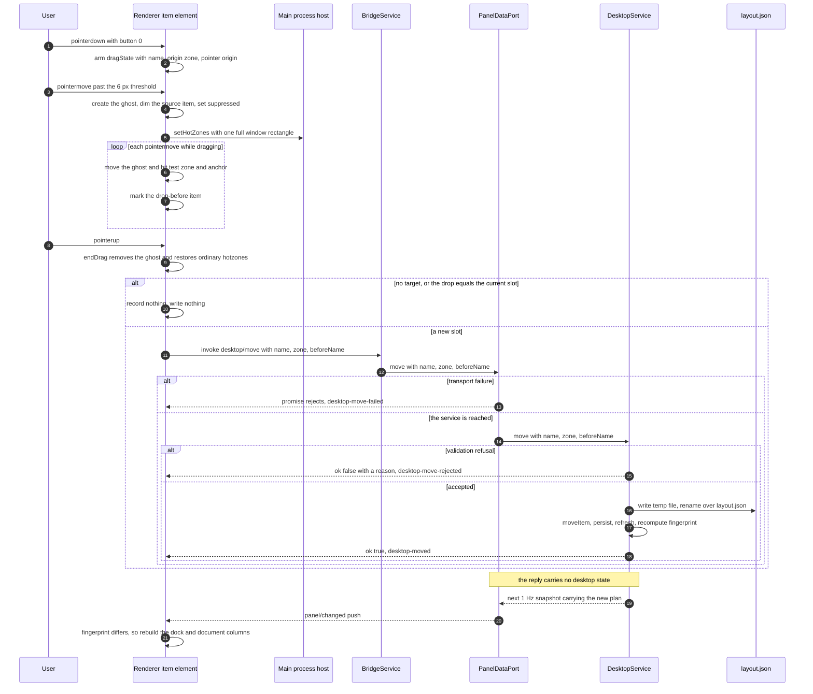
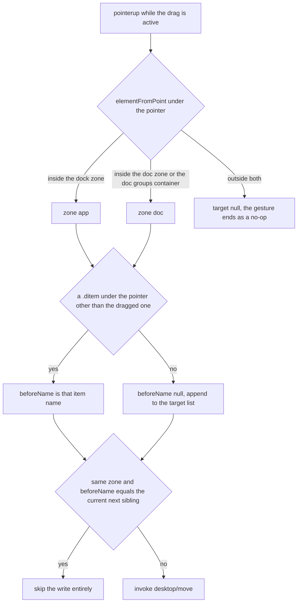

# Dragging a desktop item to a new layout position

The panel draws its own desktop, so moving an icon is not a file operation and not a Win32 position message: it is an ordering decision that has to survive a restart. The user-visible gesture is one pointer drag; the durable result is a name list in `userData/layout.json`; the visible result is a rebuild of the dock and the document columns driven by the next snapshot. This page follows that one gesture from `pointerdown` to redrawn DOM, including the paths where nothing is written at all.

Two halves own different parts of it, and the split explains most of the behaviour below:

| Half | Owns | Never does |
|---|---|---|
| Renderer (`app/src/renderer/main.ts`) | The gesture: arming, the threshold, the ghost, hit testing, the drop indicator, the ordinary vs full-window hotzone lists, and the evidence records | Decide whether the move is legal, or apply the result locally |
| Kernel (`DesktopService` via `desktop/move`) | Validation, the store mutation, the atomic write, the immediate re-plan and the fingerprint | Know anything about pixels, pointer coordinates or drop targets |

<!-- openwiki: broken internal link [/openwiki/workflows/snapshot-pipeline.md] file "/openwiki/workflows/snapshot-pipeline.md" does not exist. Fix the href or restore the target, then delete this comment. -->
Reading order for context: [desktop zone planning](/openwiki/architecture/desktop-zones-planning.md) for the plan and store semantics, [desktop carry runtime](/openwiki/architecture/desktop-zones-execution.md) for the service and its adapters, [renderer panel](/openwiki/architecture/renderer-panel.md) for the page this gesture lives in, and [snapshot pipeline](/openwiki/workflows/snapshot-pipeline.md) for the push that finally moves the pixels.

## Why the gesture is hand-rolled, and why hotzones expand

<!-- openwiki: broken internal link [/repo://app/src/renderer/main.ts#L134-L153] file "/repo://app/src/renderer/main.ts" does not exist. Fix the href or restore the target, then delete this comment. -->
The drag is plain pointer events attached to each item element, coordinated by one module-level `dragState` — not `draggable` and not HTML5 drag-and-drop. The source gives two reasons, and both are structural rather than stylistic ([main.ts](/repo://app/src/renderer/main.ts#L134-L153)):

- **Synthesized input cannot drive an OLE drag.** The panel's own acceptance battery drives real `SendInput` mouse motion, and an HTML5 drag-and-drop gesture needs the OS drag protocol that a synthetic press-and-move does not start. Pointer events are driven by exactly the events the battery produces.
<!-- openwiki: broken internal link [/repo://app/src/renderer/main.ts#L98-L108] file "/repo://app/src/renderer/main.ts" does not exist. Fix the href or restore the target, then delete this comment. -->
- **The self-drawn world needs "ordered before whom" semantics, not a drop payload.** There is no target element to receive a `DataTransfer`; the meaningful output of a drop is a name plus the name it should precede. That is also why the item's `` is created with `draggable = false`: a native image drag would otherwise compete with the gesture ([main.ts](/repo://app/src/renderer/main.ts#L98-L108)).

<!-- openwiki: broken internal link [/repo://app/src/main/panel-window.ts#L38-L43] file "/repo://app/src/main/panel-window.ts" does not exist. Fix the href or restore the target, then delete this comment. -->
<!-- openwiki: broken internal link [/repo://app/src/main/hotzone.ts#L4-L69] file "/repo://app/src/main/hotzone.ts" does not exist. Fix the href or restore the target, then delete this comment. -->
<!-- openwiki: broken internal link [/repo://app/src/renderer/main.ts#L192-L203] file "/repo://app/src/renderer/main.ts" does not exist. Fix the href or restore the target, then delete this comment. -->
<!-- openwiki: broken internal link [/repo://app/src/renderer/main.ts#L265-L279] file "/repo://app/src/renderer/main.ts" does not exist. Fix the href or restore the target, then delete this comment. -->
The hotzone expansion is the second non-obvious piece. The panel window is created click-through (`setIgnoreMouseEvents(true)`) and a main-process tracker flips it to accepting input only while the cursor is inside a declared rectangle, polling every 25 ms ([panel-window.ts](/repo://app/src/main/panel-window.ts#L38-L43), [hotzone.ts](/repo://app/src/main/hotzone.ts#L4-L69)). Ordinary declarations are the items' own bounding boxes, so **the gaps between cards and between zones are literally click-through**: a drag crossing one of those gaps would deliver no further mouse moves to the page, and the gesture would die with the pointer still down. Past the 6 px threshold the renderer therefore **replaces the whole list** with a single full-window rectangle `{id: 'drag', x: 0, y: 0, w: window.innerWidth, h: window.innerHeight}`, and `endDrag` re-declares the ordinary list ([main.ts](/repo://app/src/renderer/main.ts#L192-L203), [main.ts](/repo://app/src/renderer/main.ts#L265-L279)). The window stays interactive for the entire gesture, and normal click-through behaviour returns the moment the pointer is released.

Two smaller mechanisms support the gesture:

<!-- openwiki: broken internal link [/repo://app/src/renderer/main.ts#L181-L191] file "/repo://app/src/renderer/main.ts" does not exist. Fix the href or restore the target, then delete this comment. -->
- `pointerdown` records the name, the item's `zone` **as of the current snapshot**, and the pointer origin, and attempts `setPointerCapture` inside a `try` so an environment without pointer capture degrades to window-local dragging ([main.ts](/repo://app/src/renderer/main.ts#L181-L191)).
<!-- openwiki: broken internal link [/repo://app/src/renderer/main.ts#L192-L203] file "/repo://app/src/renderer/main.ts" does not exist. Fix the href or restore the target, then delete this comment. -->
<!-- openwiki: broken internal link [/repo://app/src/renderer/main.ts#L277-L278] file "/repo://app/src/renderer/main.ts" does not exist. Fix the href or restore the target, then delete this comment. -->
<!-- openwiki: broken internal link [/repo://app/src/renderer/main.ts#L114-L119] file "/repo://app/src/renderer/main.ts" does not exist. Fix the href or restore the target, then delete this comment. -->
- The threshold is 6 px of Euclidean distance, and `suppressed` is set when it is crossed so the `click` the browser still delivers after the `pointerup` cannot be mistaken for a selection; the flag is released on a `setTimeout(0)` ([main.ts](/repo://app/src/renderer/main.ts#L192-L203), [main.ts](/repo://app/src/renderer/main.ts#L277-L278), [main.ts](/repo://app/src/renderer/main.ts#L114-L119)).

## The flow: drag, persist, re-plan, redraw

*One gesture: the renderer produces `{name, zone, beforeName}`, the service refuses or durably records it, and only the next snapshot changes what is on screen.*

### What a drop resolves to

<!-- openwiki: broken internal link [/repo://app/src/renderer/main.ts#L155-L179] file "/repo://app/src/renderer/main.ts" does not exist. Fix the href or restore the target, then delete this comment. -->
<!-- openwiki: broken internal link [/repo://app/src/renderer/main.ts#L204-L214] file "/repo://app/src/renderer/main.ts" does not exist. Fix the href or restore the target, then delete this comment. -->
The renderer answers two questions on every move, both from the DOM rather than from a model of the layout ([main.ts](/repo://app/src/renderer/main.ts#L155-L179), [main.ts](/repo://app/src/renderer/main.ts#L204-L214)):

*Drop resolution is pure DOM hit testing: the ancestor chain decides the zone, the item under the pointer decides the anchor, and a drop on the current position never reaches the kernel.*

- **Zone** comes from `zoneOfContainer`, which walks up the ancestor chain looking for `#dock-zone` (`app`), `#doc-groups` or `#doc-zone` (`doc`), and otherwise returns `null`. A `null` zone clears the target, so releasing outside both zones sends nothing at all.
- **Anchor** comes from `itemUnder`, which takes `document.elementFromPoint` and the closest `.ditem`, excluding the dragged item itself. No item under the pointer means `beforeName: null`, which the store reads as "append to the end of the target list".
<!-- openwiki: broken internal link [/repo://app/src/renderer/main.ts#L174-L179] file "/repo://app/src/renderer/main.ts" does not exist. Fix the href or restore the target, then delete this comment. -->
<!-- openwiki: broken internal link [/repo://app/src/renderer/index.html#L289-L290] file "/repo://app/src/renderer/index.html" does not exist. Fix the href or restore the target, then delete this comment. -->
- **The drop indicator** is a `.drop-before` class on the item that would be displaced, cleared and re-applied on every move ([main.ts](/repo://app/src/renderer/main.ts#L174-L179)). It is styled only for the dock (`#dock-zone .ditem.drop-before`); in the document zone the class is applied but has no rule, so the document-zone drop target is not visible ([index.html](/repo://app/src/renderer/index.html#L289-L290)).
<!-- openwiki: broken internal link [/repo://app/src/renderer/main.ts#L216-L242] file "/repo://app/src/renderer/main.ts" does not exist. Fix the href or restore the target, then delete this comment. -->
- **An unchanged drop is never sent.** Before invoking, the page compares the target against `nextSiblingName(name)` and returns early when the item would land exactly where it already is ([main.ts](/repo://app/src/renderer/main.ts#L216-L242)). This is what keeps a click-like wobble from promoting an item into the persisted `dock` list.
<!-- openwiki: broken internal link [/repo://app/src/renderer/main.ts#L222-L229] file "/repo://app/src/renderer/main.ts" does not exist. Fix the href or restore the target, then delete this comment. -->
- **There is no optimistic reorder.** The page never writes DOM order locally; it records `desktop-move-clicked` and the outcome, and lets the next snapshot decide ([main.ts](/repo://app/src/renderer/main.ts#L222-L229)).

## The kernel side: validation first, exact refusals

<!-- openwiki: broken internal link [/repo://app/src/main/services/desktop.ts#L159-L178] file "/repo://app/src/main/services/desktop.ts" does not exist. Fix the href or restore the target, then delete this comment. -->
`move(name, zone, beforeName)` validates everything before touching the store, and every rejection is a distinct message rather than a dropped request ([services/desktop.ts](/repo://app/src/main/services/desktop.ts#L159-L178)):

| Check | Rejection | Why it exists |
|---|---|---|
| `name` appears in the current item pool | `桌面项不在当前扫描池内` | The renderer can be one snapshot ahead of the child's pool — the file was deleted or renamed since the render |
| `zone === 'app'` and `name` is in `store.pinned` | `手钉条目的应用区栏位由手钉清单决定（layout.json 的 pinned 列表）` | A pin's app-zone position comes from the pinned list, so the drop would visibly bounce back; an explicit refusal beats an inaudible no-op. Dragging a pinned item *out* of the app zone is not refused — that is a deliberate reclassification |
| `beforeName` is not `null` and not in the pool | `参照条目不在当前扫描池内` | Same staleness reason as the moved name |
| the anchor's `zone` differs from the target zone | `参照条目不在目标分区` | Compared against the zone *after* store overrides, so a cross-zone drag validates the zone the item is actually joining |
| `beforeName === name` | `不能以自身为参照` | No self-referential order |

<!-- openwiki: broken internal link [/repo://app/src/main/services/desktop.ts#L162-L177] file "/repo://app/src/main/services/desktop.ts" does not exist. Fix the href or restore the target, then delete this comment. -->
<!-- openwiki: broken internal link [/repo://app/tests/contract.spec.ts#L189-L221] file "/repo://app/tests/contract.spec.ts" does not exist. Fix the href or restore the target, then delete this comment. -->
<!-- openwiki: broken internal link [/repo://app/tests/desktop/service.spec.ts#L235-L246] file "/repo://app/tests/desktop/service.spec.ts" does not exist. Fix the href or restore the target, then delete this comment. -->
A refusal is a **resolved** `{ ok: false, error }`, not a rejected promise: the renderer records `desktop-move-rejected`, and the acceptance battery can assert the message ([services/desktop.ts](/repo://app/src/main/services/desktop.ts#L162-L177), [contract.spec.ts](/repo://app/tests/contract.spec.ts#L189-L221)). Because the store and the fingerprint are untouched, the same item is still in its old place and nothing re-renders — the failure is invisible on screen and visible only in the evidence log. The service test pins the whole table and asserts that a rejected move writes nothing ([service.spec.ts](/repo://app/tests/desktop/service.spec.ts#L235-L246)).

<!-- openwiki: broken internal link [/repo://app/src/main/services/dataplane.ts#L78-L88] file "/repo://app/src/main/services/dataplane.ts" does not exist. Fix the href or restore the target, then delete this comment. -->
<!-- openwiki: broken internal link [/repo://app/src/main/services/dataplane.ts#L124-L134] file "/repo://app/src/main/services/dataplane.ts" does not exist. Fix the href or restore the target, then delete this comment. -->
<!-- openwiki: broken internal link [/repo://app/src/main/services/dataplane.ts#L161-L183] file "/repo://app/src/main/services/dataplane.ts" does not exist. Fix the href or restore the target, then delete this comment. -->
<!-- openwiki: broken internal link [/repo://app/src/main/dataplane-protocol.ts#L15-L31] file "/repo://app/src/main/dataplane-protocol.ts" does not exist. Fix the href or restore the target, then delete this comment. -->
Transport failures are a different channel and produce different records. In the production assembly `desktop/move` is an RPC into the utilityProcess child; a missing child rejects with `数据面子进程不在场`, and a child exit rejects every pending request with `数据面子进程退出，请求失败` before the backoff respawn ([services/dataplane.ts](/repo://app/src/main/services/dataplane.ts#L78-L88), [services/dataplane.ts](/repo://app/src/main/services/dataplane.ts#L124-L134), [services/dataplane.ts](/repo://app/src/main/services/dataplane.ts#L161-L183), [dataplane-protocol.ts](/repo://app/src/main/dataplane-protocol.ts#L15-L31)). Those rejections mean the drag is simply lost (nothing was written) and the item stays where it was.

## What an accepted move writes

<!-- openwiki: broken internal link [/repo://app/src/main/services/desktop.ts#L174-L177] file "/repo://app/src/main/services/desktop.ts" does not exist. Fix the href or restore the target, then delete this comment. -->
A passing call does three things in one synchronous step ([services/desktop.ts](/repo://app/src/main/services/desktop.ts#L174-L177)):

<!-- openwiki: broken internal link [/repo://app/src/main/desktop/layout-store.ts#L48-L71] file "/repo://app/src/main/desktop/layout-store.ts" does not exist. Fix the href or restore the target, then delete this comment. -->
1. `moveItem(store, name, zone, beforeName)` builds a new store: the name is filtered out of **both** `dock` and `docs`, then inserted before the anchor in the target list, or appended when the anchor is `null` or absent from that list. `pinned` is copied through untouched ([layout-store.ts](/repo://app/src/main/desktop/layout-store.ts#L48-L71)).
<!-- openwiki: broken internal link [/repo://app/src/main/desktop/adapter.ts#L112-L126] file "/repo://app/src/main/desktop/adapter.ts" does not exist. Fix the href or restore the target, then delete this comment. -->
<!-- openwiki: broken internal link [/repo://app/src/main/services/desktop.ts#L194-L200] file "/repo://app/src/main/services/desktop.ts" does not exist. Fix the href or restore the target, then delete this comment. -->
2. `persist()` serializes and writes it through the atomic adapter: `mkdir`, write `<file>.tmp`, then `rename` over `layout.json`, so a crash mid-write cannot truncate the previous layout; a write failure is only `console.warn`-ed and the in-memory arrangement stays live ([adapter.ts](/repo://app/src/main/desktop/adapter.ts#L112-L126), [services/desktop.ts](/repo://app/src/main/services/desktop.ts#L194-L200)).
<!-- openwiki: broken internal link [/repo://app/src/main/services/desktop.ts#L95-L110] file "/repo://app/src/main/services/desktop.ts" does not exist. Fix the href or restore the target, then delete this comment. -->
3. `refresh()` re-runs the whole scan-to-plan pipeline immediately — it does not wait for the 1 Hz tick — so the service's own `state()` already carries the new order before the reply is sent; the panel learns it from the next snapshot, not from the response ([services/desktop.ts](/repo://app/src/main/services/desktop.ts#L95-L110)).

Two properties of that write are easy to miss and matter for anyone reasoning about the file:

<!-- openwiki: broken internal link [/repo://app/src/main/desktop/layout-store.ts#L53-L71] file "/repo://app/src/main/desktop/layout-store.ts" does not exist. Fix the href or restore the target, then delete this comment. -->
<!-- openwiki: broken internal link [/repo://app/tests/desktop/service.spec.ts#L194-L206] file "/repo://app/tests/desktop/service.spec.ts" does not exist. Fix the href or restore the target, then delete this comment. -->
- **Only the dragged name is recorded.** The anchor is not added to the list, so a reorder stores one name: the service test parses the written store text after dragging `c.lnk` before `a.lnk` and asserts `dock: ['c.lnk']`, with `a.lnk`/`b.lnk` remaining recommendations ([layout-store.ts](/repo://app/src/main/desktop/layout-store.ts#L53-L71), [service.spec.ts](/repo://app/tests/desktop/service.spec.ts#L194-L206)).
<!-- openwiki: broken internal link [/repo://app/src/main/index.ts#L95-L104] file "/repo://app/src/main/index.ts" does not exist. Fix the href or restore the target, then delete this comment. -->
<!-- openwiki: broken internal link [/repo://app/src/main/services/desktop.ts#L66-L70] file "/repo://app/src/main/services/desktop.ts" does not exist. Fix the href or restore the target, then delete this comment. -->
- **The store file lives under `userData`.** Its absolute path is resolved in the main process (`path.join(app.getPath('userData'), 'layout.json')`, or `userDataPath('layout.json')` in the in-process assembly) and shipped to the data-plane child in the init message, because the child owns the store in production ([index.ts](/repo://app/src/main/index.ts#L95-L104), [services/desktop.ts](/repo://app/src/main/services/desktop.ts#L66-L70)).

## Re-plan and redraw, and why the file is already durable

<!-- openwiki: broken internal link [/repo://app/src/main/services/bridge.ts#L37-L48] file "/repo://app/src/main/services/bridge.ts" does not exist. Fix the href or restore the target, then delete this comment. -->
<!-- openwiki: broken internal link [/repo://app/src/main/services/bridge.ts#L98-L107] file "/repo://app/src/main/services/bridge.ts" does not exist. Fix the href or restore the target, then delete this comment. -->
<!-- openwiki: broken internal link [/repo://app/src/main/kernel.ts#L85-L89] file "/repo://app/src/main/kernel.ts" does not exist. Fix the href or restore the target, then delete this comment. -->
<!-- openwiki: broken internal link [/repo://app/src/main/services/dataplane.ts#L90-L100] file "/repo://app/src/main/services/dataplane.ts" does not exist. Fix the href or restore the target, then delete this comment. -->
The plan is recomputed in the same call, but the response is not the channel that changes the screen. `DesktopState` travels inside `PanelSnapshot` on `panel/changed`, which the in-process assembly pushes from its 1 Hz bridge tick and the production assembly pushes from each snapshot the child sends ([bridge.ts](/repo://app/src/main/services/bridge.ts#L37-L48), [bridge.ts](/repo://app/src/main/services/bridge.ts#L98-L107), [kernel.ts](/repo://app/src/main/kernel.ts#L85-L89), [services/dataplane.ts](/repo://app/src/main/services/dataplane.ts#L90-L100)). So the visible reorder lags the drop by up to about one second, while the durability has already happened at the moment of the write.

<!-- openwiki: broken internal link [/repo://app/src/renderer/main.ts#L296-L300] file "/repo://app/src/renderer/main.ts" does not exist. Fix the href or restore the target, then delete this comment. -->
<!-- openwiki: broken internal link [/repo://app/src/main/desktop/scan.ts#L102-L117] file "/repo://app/src/main/desktop/scan.ts" does not exist. Fix the href or restore the target, then delete this comment. -->
<!-- openwiki: broken internal link [/repo://app/src/main/services/desktop.ts#L96-L110] file "/repo://app/src/main/services/desktop.ts" does not exist. Fix the href or restore the target, then delete this comment. -->
`renderDesktop` then rebuilds only when the fingerprint differs ([main.ts](/repo://app/src/renderer/main.ts#L296-L300)). The fingerprint is the item hash concatenated with the plan hash, and the split has a direct consequence for drags ([scan.ts](/repo://app/src/main/desktop/scan.ts#L102-L117), [services/desktop.ts](/repo://app/src/main/services/desktop.ts#L96-L110)):

- An **in-zone reorder** flips only the plan half. Item names, kinds and `iconKey`s are unchanged, so no icon is re-extracted — only the dock strip or a document column is rebuilt.
- A **cross-zone drop** also flips the item half, because `zone` is one of the hashed item fields. That is the mechanical reason a reclassification re-renders the whole desktop component rather than just a strip.
<!-- openwiki: broken internal link [/repo://app/tests/desktop/service.spec.ts#L318-L328] file "/repo://app/tests/desktop/service.spec.ts" does not exist. Fix the href or restore the target, then delete this comment. -->
- The service test pins the flip directly: after `move('b.lnk', 'app', 'a.lnk')` the fingerprint differs from the one before the move ([service.spec.ts](/repo://app/tests/desktop/service.spec.ts#L318-L328)).

## Cross-zone drops are reclassification, not a second layout

<!-- openwiki: broken internal link [/repo://app/src/main/desktop/layout-store.ts#L59-L65] file "/repo://app/src/main/desktop/layout-store.ts" does not exist. Fix the href or restore the target, then delete this comment. -->
<!-- openwiki: broken internal link [/repo://app/src/main/services/desktop.ts#L203-L210] file "/repo://app/src/main/services/desktop.ts" does not exist. Fix the href or restore the target, then delete this comment. -->
<!-- openwiki: broken internal link [/repo://app/src/main/desktop/plan.ts#L126-L137] file "/repo://app/src/main/desktop/plan.ts" does not exist. Fix the href or restore the target, then delete this comment. -->
A drop into the other zone does not add the item "to the document zone and also leave it in the app zone": `dock` and `docs` are mutually exclusive by construction, since `moveItem` removes the name from both lists before inserting it into one ([layout-store.ts](/repo://app/src/main/desktop/layout-store.ts#L59-L65)). The service then rewrites each item's `zone` from the store before planning, so the name in `dock` is forced to `app` and a name in `docs` to `doc`; `planDesktop` merely filters by the resulting zone and never classifies by itself ([services/desktop.ts](/repo://app/src/main/services/desktop.ts#L203-L210), [plan.ts](/repo://app/src/main/desktop/plan.ts#L126-L137)). If a hand-edited store lists one name in both lists, `dock` wins because its set is tested first.

<!-- openwiki: broken internal link [/repo://app/tests/desktop/service.spec.ts#L221-L233] file "/repo://app/tests/desktop/service.spec.ts" does not exist. Fix the href or restore the target, then delete this comment. -->
<!-- openwiki: broken internal link [/repo://app/src/main/services/desktop.ts#L165-L167] file "/repo://app/src/main/services/desktop.ts" does not exist. Fix the href or restore the target, then delete this comment. -->
<!-- openwiki: broken internal link [/repo://app/src/main/desktop/layout-store.ts#L73-L76] file "/repo://app/src/main/desktop/layout-store.ts" does not exist. Fix the href or restore the target, then delete this comment. -->
The service spec pins this as user-visible behaviour: dragging `note.docx` into the app zone flips the item's zone in the state, empties `plan.docs` and puts the file in the dock ([service.spec.ts](/repo://app/tests/desktop/service.spec.ts#L221-L233)). The mirror case is the pinned item dragged out of the app zone: the `pinned` list still contains it, but the `docs` override wins, so it renders in the document zone and the pin has no effect until a factory reset clears the override ([services/desktop.ts](/repo://app/src/main/services/desktop.ts#L165-L167), [layout-store.ts](/repo://app/src/main/desktop/layout-store.ts#L73-L76)).

## What the drop target cannot express

The store records order, not geometry, and the planner only consults that order *inside* one segment of one zone. Three consequences show up in real use, and all three are properties of the order-based model rather than bugs to be fixed in the renderer:

<!-- openwiki: broken internal link [/repo://app/src/main/desktop/plan.ts#L92-L120] file "/repo://app/src/main/desktop/plan.ts" does not exist. Fix the href or restore the target, then delete this comment. -->
<!-- openwiki: broken internal link [/repo://app/accept/battery.js#L1066-L1108] file "/repo://app/accept/battery.js" does not exist. Fix the href or restore the target, then delete this comment. -->
- **A drop can never land inside or ahead of the pinned segment.** `planDock` concatenates `pinned`, then `placed`, then `recommended`, so a dragged name joins the placed segment, which starts after every pin and before every recommendation ([plan.ts](/repo://app/src/main/desktop/plan.ts#L92-L120)). A pin is normally not in the `dock` list at all, so the anchor lookup misses and the name is appended. The acceptance battery encodes this deliberately: it drags the dock's *last* item to a position before the dock's **second** item, with the comment that the first item is the hand-pin ([battery.js](/repo://app/accept/battery.js#L1066-L1108)).
<!-- openwiki: broken internal link [/repo://app/src/main/desktop/plan.ts#L98-L120] file "/repo://app/src/main/desktop/plan.ts" does not exist. Fix the href or restore the target, then delete this comment. -->
<!-- openwiki: broken internal link [/repo://app/src/main/desktop/layout-store.ts#L66-L70] file "/repo://app/src/main/desktop/layout-store.ts" does not exist. Fix the href or restore the target, then delete this comment. -->
- **Dropping before a recommended item promotes the dragged item above the whole recommended block.** A recommended name is by definition not in the `dock` list, so the anchor lookup misses and the name is appended to the placed list — which precedes every recommendation. The result is still "dragged item before anchor", but it is not "inserted exactly at the anchor": it moves ahead of the recommendations the user expected to keep above it ([plan.ts](/repo://app/src/main/desktop/plan.ts#L98-L120), [layout-store.ts](/repo://app/src/main/desktop/layout-store.ts#L66-L70)).
<!-- openwiki: broken internal link [/repo://app/src/main/desktop/plan.ts#L25-L34] file "/repo://app/src/main/desktop/plan.ts" does not exist. Fix the href or restore the target, then delete this comment. -->
<!-- openwiki: broken internal link [/repo://app/src/main/desktop/plan.ts#L63-L80] file "/repo://app/src/main/desktop/plan.ts" does not exist. Fix the href or restore the target, then delete this comment. -->
- **A document lands at the head of its own extension group, not where the pointer was.** `planDocs` resolves each explicit `docs` name against the members of *that item's* group and puts the explicit members first, in store order; the group itself is decided by `docGroupOf` from the extension ([plan.ts](/repo://app/src/main/desktop/plan.ts#L25-L34), [plan.ts](/repo://app/src/main/desktop/plan.ts#L63-L80)). Dropping a `.docx` between two `.pdf` items therefore reorders nothing visible: the `.docx` leads the office group.

For context on the other side of the same model, "a recommendation never displaces a pin" is structural for the same reason — see [desktop zone planning](/openwiki/architecture/desktop-zones-planning.md).

## Reset to factory

<!-- openwiki: broken internal link [/repo://app/src/renderer/main.ts#L456-L462] file "/repo://app/src/renderer/main.ts" does not exist. Fix the href or restore the target, then delete this comment. -->
<!-- openwiki: broken internal link [/repo://app/src/renderer/index.html#L401-L409] file "/repo://app/src/renderer/index.html" does not exist. Fix the href or restore the target, then delete this comment. -->
<!-- openwiki: broken internal link [/repo://app/src/shared/contract.ts#L229-L230] file "/repo://app/src/shared/contract.ts" does not exist. Fix the href or restore the target, then delete this comment. -->
<!-- openwiki: broken internal link [/repo://app/src/main/services/desktop.ts#L180-L187] file "/repo://app/src/main/services/desktop.ts" does not exist. Fix the href or restore the target, then delete this comment. -->
<!-- openwiki: broken internal link [/repo://app/src/main/desktop/layout-store.ts#L73-L76] file "/repo://app/src/main/desktop/layout-store.ts" does not exist. Fix the href or restore the target, then delete this comment. -->
<!-- openwiki: broken internal link [/repo://app/tests/desktop/layout-store.spec.ts#L62-L69] file "/repo://app/tests/desktop/layout-store.spec.ts" does not exist. Fix the href or restore the target, then delete this comment. -->
<!-- openwiki: broken internal link [/repo://app/tests/desktop/service.spec.ts#L248-L271] file "/repo://app/tests/desktop/service.spec.ts" does not exist. Fix the href or restore the target, then delete this comment. -->
The one-way exit from a hand-arranged layout is the settings overlay's `RESET LAYOUT` entry, which notifies `desktop-reset-clicked` and invokes `desktop/reset-layout` with a `null` payload; the outcome is recorded as `desktop-layout-reset` with the number of cleared placements, or `desktop-reset-failed` ([main.ts](/repo://app/src/renderer/main.ts#L456-L462), [index.html](/repo://app/src/renderer/index.html#L401-L409), [contract.ts](/repo://app/src/shared/contract.ts#L229-L230)). On the kernel side `resetLayout()` counts `dock.length + docs.length`, replaces both lists with empty ones, **keeps `pinned`** — a pin is user intent, not layout — persists, and re-plans, so the arrangement returns to classification plus frequency recommendation in the same call ([services/desktop.ts](/repo://app/src/main/services/desktop.ts#L180-L187), [layout-store.ts](/repo://app/src/main/desktop/layout-store.ts#L73-L76)). `resetFactory` is idempotent on the factory state, and the service test asserts both the `cleared` count and the resulting `pinned`-first dock ([layout-store.spec.ts](/repo://app/tests/desktop/layout-store.spec.ts#L62-L69), [service.spec.ts](/repo://app/tests/desktop/service.spec.ts#L248-L271)).

The reset also undoes cross-zone drags: since a cross-zone drop is only a `docs`/`dock` override, clearing the lists gives the item back its classified zone (and, for a pinned name dragged out of the app zone, gives the pin its effect back).

<!-- openwiki: broken internal link [/repo://app/src/main/services/desktop.ts#L159-L167] file "/repo://app/src/main/services/desktop.ts" does not exist. Fix the href or restore the target, then delete this comment. -->
There is **no UI for creating a pin** in this revision. `pinned` is read by the plan and protected from drags, but nothing in the renderer writes it; a pinned list has to be hand-edited in `layout.json`, which is the reason the pinned refusal message names that file ([services/desktop.ts](/repo://app/src/main/services/desktop.ts#L159-L167)).

## Persistence, stale names and restart

<!-- openwiki: broken internal link [/repo://app/src/main/desktop/layout-store.ts#L7-L17] file "/repo://app/src/main/desktop/layout-store.ts" does not exist. Fix the href or restore the target, then delete this comment. -->
<!-- openwiki: broken internal link [/repo://app/src/main/desktop/layout-store.ts#L40-L46] file "/repo://app/src/main/desktop/layout-store.ts" does not exist. Fix the href or restore the target, then delete this comment. -->
`layout.json` is `{version: 1, pinned: [...], dock: [...], docs: [...]}` serialized with `JSON.stringify(store, null, 1)` plus a trailing newline — pretty enough to hand-edit, canonical enough that a round trip is lossless ([layout-store.ts](/repo://app/src/main/desktop/layout-store.ts#L7-L17), [layout-store.ts](/repo://app/src/main/desktop/layout-store.ts#L40-L46)).

Three robustness rules make a hand-edited or damaged store safe:

<!-- openwiki: broken internal link [/repo://app/src/main/desktop/layout-store.ts#L19-L38] file "/repo://app/src/main/desktop/layout-store.ts" does not exist. Fix the href or restore the target, then delete this comment. -->
- **`loadStore` is total.** `null` (no file), malformed JSON, a non-object root, or a wrong-typed field all degrade to the factory state instead of throwing, so a hand-edited store cannot break boot ([layout-store.ts](/repo://app/src/main/desktop/layout-store.ts#L19-L38)).
<!-- openwiki: broken internal link [/repo://app/src/main/desktop/layout-store.ts#L48-L53] file "/repo://app/src/main/desktop/layout-store.ts" does not exist. Fix the href or restore the target, then delete this comment. -->
<!-- openwiki: broken internal link [/repo://app/src/main/desktop/plan.ts#L98-L107] file "/repo://app/src/main/desktop/plan.ts" does not exist. Fix the href or restore the target, then delete this comment. -->
<!-- openwiki: broken internal link [/repo://app/tests/desktop/layout-store.spec.ts#L56-L59] file "/repo://app/tests/desktop/layout-store.spec.ts" does not exist. Fix the href or restore the target, then delete this comment. -->
- **Stale names are preserved verbatim.** Nothing in `layout-store.ts` validates a name against a pool, and the planner simply filters names that are absent from the item set; a deleted file's placement survives, and the file coming back returns to its recorded position ([layout-store.ts](/repo://app/src/main/desktop/layout-store.ts#L48-L53), [plan.ts](/repo://app/src/main/desktop/plan.ts#L98-L107), [layout-store.spec.ts](/repo://app/tests/desktop/layout-store.spec.ts#L56-L59)). The pool check lives in the service's `move`, which is why the drag's own validation is authoritative at drop time but not at load time.
<!-- openwiki: broken internal link [/repo://app/tests/desktop/service.spec.ts#L207-L219] file "/repo://app/tests/desktop/service.spec.ts" does not exist. Fix the href or restore the target, then delete this comment. -->
<!-- openwiki: broken internal link [/repo://app/accept/battery.js#L1111-L1127] file "/repo://app/accept/battery.js" does not exist. Fix the href or restore the target, then delete this comment. -->
- **The drag is durable before it is visible.** The store is written inside the call, so the arrangement survives a panel restart even though the redraw is still one tick away. The offline test proves the mechanism by rebuilding the service over the same store text and asserting the same dock order with `source: 'placed'` ([service.spec.ts](/repo://app/tests/desktop/service.spec.ts#L207-L219)); the acceptance battery proves it end to end by restarting the real panel and waiting for a `desktop-rendered` record whose dock order still shows the dragged item before its anchor ([battery.js](/repo://app/accept/battery.js#L1111-L1127)).

<!-- openwiki: broken internal link [/repo://app/src/main/services/dataplane.ts#L78-L88] file "/repo://app/src/main/services/dataplane.ts" does not exist. Fix the href or restore the target, then delete this comment. -->
<!-- openwiki: broken internal link [/repo://docs/adr/0005-no-input-hooks-dataplane-utility-process.md#L21] file "/repo://docs/adr/0005-no-input-hooks-dataplane-utility-process.md" does not exist. Fix the href or restore the target, then delete this comment. -->
In the production assembly the store is owned by the utilityProcess child, which is also why a crash does not lose the arrangement: the child is respawned with backoff, reloads `layout.json` from disk, and the next snapshot re-converges the desktop ([services/dataplane.ts](/repo://app/src/main/services/dataplane.ts#L78-L88), [ADR-0005](/repo://docs/adr/0005-no-input-hooks-dataplane-utility-process.md#L21)).

## Failure surfaces worth knowing before changing this flow

| Observation | Cause | Where to look |
|---|---|---|
| The drag silently does nothing, item back in place | a validation refusal — most often a stale name, or a drop onto the pinned item's slot; the promise resolved with `ok: false` | `desktop-move-rejected` in the evidence log carries `error`; the renderer never moved the item locally, so nothing on screen hints at the reason |
<!-- openwiki: broken internal link [/repo://app/src/renderer/main.ts#L196-L203] file "/repo://app/src/renderer/main.ts" does not exist. Fix the href or restore the target, then delete this comment. -->
<!-- openwiki: broken internal link [/repo://app/accept/battery.js#L1066-L1069] file "/repo://app/accept/battery.js" does not exist. Fix the href or restore the target, then delete this comment. -->
| The drag dies mid-gesture and the ghost stays | the window was click-through when a `pointermove` should have arrived, so the pointer stream stopped | the full-window `{id: 'drag'}` hotzone is the guard ([main.ts](/repo://app/src/renderer/main.ts#L196-L203)); a snapshot that re-renders items mid-drag moves them under the pointer, which is why the battery waits for a stable `desktop-rendered` record before computing its probe coordinates ([battery.js](/repo://app/accept/battery.js#L1066-L1069)) |
<!-- openwiki: broken internal link [/repo://app/src/main/services/desktop.ts#L194-L200] file "/repo://app/src/main/services/desktop.ts" does not exist. Fix the href or restore the target, then delete this comment. -->
| The drop lands, the panel closes, the layout is gone | `layout.json` was not written; the write is warning-only, so the in-memory arrangement held for the session | `deck-desktop: 摆位落盘失败…` on the console ([services/desktop.ts](/repo://app/src/main/services/desktop.ts#L194-L200)) |
<!-- openwiki: broken internal link [/repo://app/src/main/services/dataplane.ts#L78-L88] file "/repo://app/src/main/services/dataplane.ts" does not exist. Fix the href or restore the target, then delete this comment. -->
<!-- openwiki: broken internal link [/repo://app/src/main/services/dataplane.ts#L124-L134] file "/repo://app/src/main/services/dataplane.ts" does not exist. Fix the href or restore the target, then delete this comment. -->
| The drag fails with a transport error instead of a refusal | the data-plane child is missing or just exited, and every pending RPC was rejected | `desktop-move-failed` with `数据面子进程不在场` / `数据面子进程退出，请求失败`; retry after the respawn ([services/dataplane.ts](/repo://app/src/main/services/dataplane.ts#L78-L88), [services/dataplane.ts](/repo://app/src/main/services/dataplane.ts#L124-L134)) |
| The item moved somewhere other than the pointer | the drop target was recorded as an order, not a position; segments and extension groups reinterpret it | [What the drop target cannot express](#what-the-drop-target-cannot-express) |

## Verification

<!-- openwiki: broken internal link [/repo://app/tests/desktop/layout-store.spec.ts#L25-L60] file "/repo://app/tests/desktop/layout-store.spec.ts" does not exist. Fix the href or restore the target, then delete this comment. -->
<!-- openwiki: broken internal link [/repo://app/tests/desktop/service.spec.ts#L194-L246] file "/repo://app/tests/desktop/service.spec.ts" does not exist. Fix the href or restore the target, then delete this comment. -->
<!-- openwiki: broken internal link [/repo://app/tests/desktop/service.spec.ts#L318-L328] file "/repo://app/tests/desktop/service.spec.ts" does not exist. Fix the href or restore the target, then delete this comment. -->
<!-- openwiki: broken internal link [/repo://app/tests/contract.spec.ts#L189-L245] file "/repo://app/tests/contract.spec.ts" does not exist. Fix the href or restore the target, then delete this comment. -->
- **Offline (pure + service).** `layout-store.spec.ts` pins the store mutations, including cross-zone exclusivity, defensive append for an anchor that is not in the target list, pins surviving a drag, and stale names being insertable ([layout-store.spec.ts](/repo://app/tests/desktop/layout-store.spec.ts#L25-L60)). `service.spec.ts` pins the move validation table with zero writes on refusal, in-zone placement with immediate replanning and persistence, cross-zone reclassification, factory reset, damaged-store self-healing, and the fingerprint flip ([service.spec.ts](/repo://app/tests/desktop/service.spec.ts#L194-L246), [service.spec.ts](/repo://app/tests/desktop/service.spec.ts#L318-L328)). `contract.spec.ts` drives the same path through `bridge.invoke('desktop/move', …)` and `desktop/reset-layout`, which is the seam the renderer actually talks to ([contract.spec.ts](/repo://app/tests/contract.spec.ts#L189-L245)).
<!-- openwiki: broken internal link [/repo://app/tests/contract.spec.ts#L529-L534] file "/repo://app/tests/contract.spec.ts" does not exist. Fix the href or restore the target, then delete this comment. -->
<!-- openwiki: broken internal link [/repo://app/accept/battery.js#L1066-L1108] file "/repo://app/accept/battery.js" does not exist. Fix the href or restore the target, then delete this comment. -->
<!-- openwiki: broken internal link [/repo://app/accept/battery.js#L1129-L1166] file "/repo://app/accept/battery.js" does not exist. Fix the href or restore the target, then delete this comment. -->
- **Real machine.** The offline suite never imports or executes the page — its only renderer touch is a source-level guard that reads `plugins.ts` as text — so the gesture itself (the threshold, the ghost, the hotzone swap, the hit test) is verified only by `npm run accept` ([contract.spec.ts](/repo://app/tests/contract.spec.ts#L529-L534)). The battery moves the physical cursor to rectangles taken from the `desktop-rendered` evidence, presses, walks 12 steps of ~24 ms, releases, waits for `desktop-moved` with `ok: true`, then waits for a `desktop-rendered` record whose dock order shows the dragged item before the anchor ([battery.js](/repo://app/accept/battery.js#L1066-L1108)). The same phase restarts the panel to check persistence and drives the settings overlay's reset, asserting that `cleared` is non-zero and that no dock entry is still `source: 'placed'` while the first entry is still `source: 'pinned'` ([battery.js](/repo://app/accept/battery.js#L1129-L1166)).

<!-- openwiki: broken internal link [/repo://app/src/renderer/main.ts#L337-L353] file "/repo://app/src/renderer/main.ts" does not exist. Fix the href or restore the target, then delete this comment. -->
The two halves meet at the `desktop-rendered` record: its per-item rectangles are the battery's drag coordinates, so a CSS or layout change that moves items without updating the battery's expectations turns a passing drag probe into a false failure ([main.ts](/repo://app/src/renderer/main.ts#L337-L353)).

## Related pages

- [Desktop carry runtime](/openwiki/architecture/desktop-zones-execution.md) — `DesktopService`, the dependency bundle, the store adapter and the two assemblies.
- [Desktop zone planning](/openwiki/architecture/desktop-zones-planning.md) — the pool, dock segments, document columns, fingerprints and the store's pure mutations.
- [Renderer panel](/openwiki/architecture/renderer-panel.md) — the page that owns the gesture, the hotzone declaration contract and the evidence channel.
<!-- openwiki: broken internal link [/openwiki/workflows/snapshot-pipeline.md] file "/openwiki/workflows/snapshot-pipeline.md" does not exist. Fix the href or restore the target, then delete this comment. -->
- [Snapshot pipeline](/openwiki/workflows/snapshot-pipeline.md) — how the re-plan reaches the screen.
