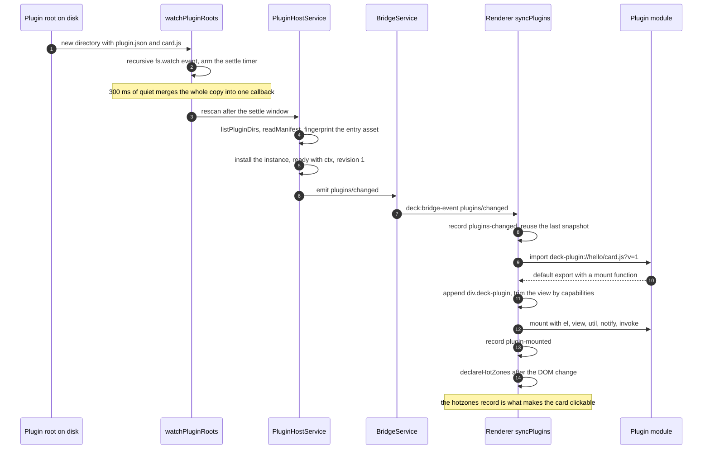
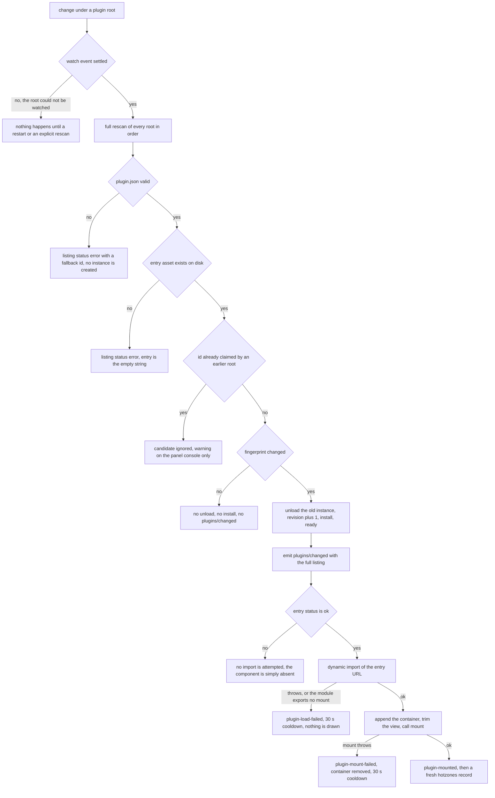

# Installing, editing and removing a desktop component

<!-- openwiki: broken internal link [/repo://app/src/main/plugins/service.ts#L10-L22] file "/repo://app/src/main/plugins/service.ts" does not exist. Fix the href or restore the target, then delete this comment. -->
<!-- openwiki: broken internal link [/repo://README.md#L92-L99] file "/repo://README.md" does not exist. Fix the href or restore the target, then delete this comment. -->
A desktop component has no installer, no registry entry and no "reload components" command. It is a directory containing `plugin.json` and an entry module, and the three verbs are plain filesystem operations: **drop the directory in to install, edit a file inside it to reload, delete the directory to uninstall** ([service.ts](/repo://app/src/main/plugins/service.ts#L10-L22), [README.md](/repo://README.md#L92-L99)). Because the panel's own information cards are the first plugin root, the same three verbs apply to a third-party component and to a built-in card — the difference is only which root the directory sits in.

Nothing in this path restarts the panel, and nothing in it asks the user anything. A change is picked up by a directory watcher, diffed by an asset fingerprint, pushed to the page out of band, and turned into an `import` + `mount` (or an `unmount`) by the renderer. This page follows that change from the filesystem to the pixels, and — because every interesting failure is silent — ends with what the evidence log can and cannot prove.

<!-- openwiki: broken internal link [/openwiki/operations/configuration-reference.md] file "/openwiki/operations/configuration-reference.md" does not exist. Fix the href or restore the target, then delete this comment. -->
<!-- openwiki: broken internal link [/openwiki/workflows/snapshot-pipeline.md] file "/openwiki/workflows/snapshot-pipeline.md" does not exist. Fix the href or restore the target, then delete this comment. -->
Where to read next: [plugin host](/openwiki/architecture/plugin-host.md) for the manifest contract, the `deck-plugin://` addressing rules and the security framing; [renderer panel](/openwiki/architecture/renderer-panel.md) for the page this runs in; [configuration reference](/openwiki/operations/configuration-reference.md) for `config.plugins.dir`; [snapshot pipeline](/openwiki/workflows/snapshot-pipeline.md) for the 1 Hz push the components ride on.

## The install location

| Item | Value | Source |
|---|---|---|
<!-- openwiki: broken internal link [/repo://app/src/main/index.ts#L91-L92] file "/repo://app/src/main/index.ts" does not exist. Fix the href or restore the target, then delete this comment. -->
<!-- openwiki: broken internal link [/repo://app/src/main/config.ts#L50-L58] file "/repo://app/src/main/config.ts" does not exist. Fix the href or restore the target, then delete this comment. -->
<!-- openwiki: broken internal link [/repo://app/src/main/paths.ts#L7-L14] file "/repo://app/src/main/paths.ts" does not exist. Fix the href or restore the target, then delete this comment. -->
| User install root | `config.plugins.dir`, or `userData/plugins` when the config value is the empty string | [index.ts](/repo://app/src/main/index.ts#L91-L92), [config.ts](/repo://app/src/main/config.ts#L50-L58), [paths.ts](/repo://app/src/main/paths.ts#L7-L14) |
<!-- openwiki: broken internal link [/repo://app/src/main/index.ts#L20-L26] file "/repo://app/src/main/index.ts" does not exist. Fix the href or restore the target, then delete this comment. -->
| Built-in root | `dist/renderer/cards`, scanned **first** | [index.ts](/repo://app/src/main/index.ts#L20-L26) |
<!-- openwiki: broken internal link [/repo://app/src/main/index.ts#L91-L92] file "/repo://app/src/main/index.ts" does not exist. Fix the href or restore the target, then delete this comment. -->
<!-- openwiki: broken internal link [/repo://app/src/main/plugins/service.ts#L99-L105] file "/repo://app/src/main/plugins/service.ts" does not exist. Fix the href or restore the target, then delete this comment. -->
| Root list lifetime | resolved once at boot; changing `config.plugins.dir` needs a panel restart | [index.ts](/repo://app/src/main/index.ts#L91-L92), [service.ts](/repo://app/src/main/plugins/service.ts#L99-L105) |
<!-- openwiki: broken internal link [/repo://app/src/main/plugins/manifest.ts#L19-L19] file "/repo://app/src/main/plugins/manifest.ts" does not exist. Fix the href or restore the target, then delete this comment. -->
| Components per directory | one: `plugin.json` plus the entry module it names | [manifest.ts](/repo://app/src/main/plugins/manifest.ts#L19-L19) |

<!-- openwiki: broken internal link [/repo://app/samples/hello-plugin/plugin.json#L1-L8] file "/repo://app/samples/hello-plugin/plugin.json" does not exist. Fix the href or restore the target, then delete this comment. -->
<!-- openwiki: broken internal link [/repo://app/samples/hello-plugin/card.js#L1-L45] file "/repo://app/samples/hello-plugin/card.js" does not exist. Fix the href or restore the target, then delete this comment. -->
The minimum working component is small enough to copy by hand — this is `samples/hello-plugin`, which is both the acceptance fixture and the readable reference for plugin authors ([plugin.json](/repo://app/samples/hello-plugin/plugin.json#L1-L8), [card.js](/repo://app/samples/hello-plugin/card.js#L1-L45)):

```json
{
  "id": "hello",
  "name": "HELLO 样例插件",
  "version": "1.0.0",
  "entry": "./card.js",
  "capabilities": ["clock"],
  "order": 900
}
```

<!-- openwiki: broken internal link [/repo://app/src/main/plugins/manifest.ts#L10-L32] file "/repo://app/src/main/plugins/manifest.ts" does not exist. Fix the href or restore the target, then delete this comment. -->
<!-- openwiki: broken internal link [/repo://app/src/shared/contract.ts#L137-L169] file "/repo://app/src/shared/contract.ts" does not exist. Fix the href or restore the target, then delete this comment. -->
`id` doubles as the `deck-plugin://` host name, so it is restricted to a lowercase hostname charset; `entry` must be a `.js`/`.mjs` file inside the directory; `capabilities` selects which snapshot sections the component may read; `order` places it in the mount sequence ([manifest.ts](/repo://app/src/main/plugins/manifest.ts#L10-L32), [contract.ts](/repo://app/src/shared/contract.ts#L137-L169)).

## The happy path: drop a directory in



*Installing one component: the watcher coalesces the copy, the host diffs the fingerprint and pushes, and the page imports and mounts the new entry URL — no restart anywhere in the sequence.*

Step by step, with the parts that matter operationally:

<!-- openwiki: broken internal link [/repo://app/src/main/plugins/watch.ts#L17-L49] file "/repo://app/src/main/plugins/watch.ts" does not exist. Fix the href or restore the target, then delete this comment. -->
1. **Watch.** Each root is created with `fs.mkdirSync(dir, { recursive: true })` *before* `fs.watch(dir, { recursive: true })` — an install location that does not exist yet is the normal first-run case, and a watcher on a missing directory can never see the first drop. Recursive watching is what makes editing the component's own `card.js` a reload trigger ([watch.ts](/repo://app/src/main/plugins/watch.ts#L17-L49)).
<!-- openwiki: broken internal link [/repo://app/src/main/plugins/watch.ts#L23-L30] file "/repo://app/src/main/plugins/watch.ts" does not exist. Fix the href or restore the target, then delete this comment. -->
<!-- openwiki: broken internal link [/repo://app/tests/plugins/service.spec.ts#L296-L313] file "/repo://app/tests/plugins/service.spec.ts" does not exist. Fix the href or restore the target, then delete this comment. -->
2. **Settle.** Every event re-arms a timer and the callback fires once, after the last event plus the settle window (default 300 ms; the offline watcher test passes `settleMs: 40` to keep the loop short). Copying a component in file by file therefore normally produces exactly one rescan ([watch.ts](/repo://app/src/main/plugins/watch.ts#L23-L30), [service.spec.ts](/repo://app/tests/plugins/service.spec.ts#L296-L313)).
<!-- openwiki: broken internal link [/repo://app/src/main/plugins/watch.ts#L52-L68] file "/repo://app/src/main/plugins/watch.ts" does not exist. Fix the href or restore the target, then delete this comment. -->
3. **Scan.** The rescan walks every root in order and, inside a root, the subdirectories sorted by name, so the scan order is stable across runs ([watch.ts](/repo://app/src/main/plugins/watch.ts#L52-L68)).
<!-- openwiki: broken internal link [/repo://app/src/main/plugins/service.ts#L53-L80] file "/repo://app/src/main/plugins/service.ts" does not exist. Fix the href or restore the target, then delete this comment. -->
4. **Fingerprint.** Each candidate carries a fingerprint: the serialized parsed manifest plus the entry file's `mtimeMs:size` (`missing` when the file is absent). A changed fingerprint is the only thing that means "this is a new generation of the asset" ([service.ts](/repo://app/src/main/plugins/service.ts#L53-L80)).
<!-- openwiki: broken internal link [/repo://app/src/main/plugins/service.ts#L134-L165] file "/repo://app/src/main/plugins/service.ts" does not exist. Fix the href or restore the target, then delete this comment. -->
<!-- openwiki: broken internal link [/repo://app/src/main/plugins/service.ts#L252-L261] file "/repo://app/src/main/plugins/service.ts" does not exist. Fix the href or restore the target, then delete this comment. -->
<!-- openwiki: broken internal link [/repo://app/src/main/plugins/service.ts#L270-L279] file "/repo://app/src/main/plugins/service.ts" does not exist. Fix the href or restore the target, then delete this comment. -->
5. **Install.** A new id gets an instance, `revision = 1`, and a `ready(ctx)` call; the default instance's hooks are deliberately empty because today's components own no main-process resource ([service.ts](/repo://app/src/main/plugins/service.ts#L134-L165), [service.ts](/repo://app/src/main/plugins/service.ts#L252-L261), [service.ts](/repo://app/src/main/plugins/service.ts#L270-L279)).
<!-- openwiki: broken internal link [/repo://app/src/main/plugins/service.ts#L82-L85] file "/repo://app/src/main/plugins/service.ts" does not exist. Fix the href or restore the target, then delete this comment. -->
<!-- openwiki: broken internal link [/repo://app/src/main/plugins/service.ts#L157-L165] file "/repo://app/src/main/plugins/service.ts" does not exist. Fix the href or restore the target, then delete this comment. -->
6. **Push.** The listing is rebuilt, sorted by `order` ascending with id as tie-break, and `plugins/changed` is emitted **only if the serialized listing actually changed** — an unchanged rescan is silent, which is what keeps the watcher and the 1 Hz snapshot from fighting ([service.ts](/repo://app/src/main/plugins/service.ts#L82-L85), [service.ts](/repo://app/src/main/plugins/service.ts#L157-L165)).
<!-- openwiki: broken internal link [/repo://app/src/main/panel-ipc.ts#L30-L36] file "/repo://app/src/main/panel-ipc.ts" does not exist. Fix the href or restore the target, then delete this comment. -->
<!-- openwiki: broken internal link [/repo://app/src/shared/contract.ts#L263-L267] file "/repo://app/src/shared/contract.ts" does not exist. Fix the href or restore the target, then delete this comment. -->
7. **Deliver.** `plugins/changed` is one of the forwarded bridge events, so it reaches the page over the ordinary event channel rather than the snapshot tick ([panel-ipc.ts](/repo://app/src/main/panel-ipc.ts#L30-L36), [contract.ts](/repo://app/src/shared/contract.ts#L263-L267)).
<!-- openwiki: broken internal link [/repo://app/src/renderer/main.ts#L756-L763] file "/repo://app/src/renderer/main.ts" does not exist. Fix the href or restore the target, then delete this comment. -->
<!-- openwiki: broken internal link [/repo://app/src/renderer/plugins.ts#L124-L163] file "/repo://app/src/renderer/plugins.ts" does not exist. Fix the href or restore the target, then delete this comment. -->
8. **Mount.** The page reuses its last snapshot (substituting the new list) and calls `syncPlugins`: unknown ids are imported, the container is appended, the view is trimmed by `capabilities`, and `mount(host)` runs. The component is now on screen and its container is in the hotzone declaration ([main.ts](/repo://app/src/renderer/main.ts#L756-L763), [plugins.ts](/repo://app/src/renderer/plugins.ts#L124-L163)).

Two details decide where a component ends up:

<!-- openwiki: broken internal link [/repo://app/src/main/plugins/service.ts#L24-L25] file "/repo://app/src/main/plugins/service.ts" does not exist. Fix the href or restore the target, then delete this comment. -->
<!-- openwiki: broken internal link [/repo://app/src/main/plugins/service.ts#L82-L85] file "/repo://app/src/main/plugins/service.ts" does not exist. Fix the href or restore the target, then delete this comment. -->
<!-- openwiki: broken internal link [/repo://app/src/renderer/cards/clock/plugin.json#L1-L8] file "/repo://app/src/renderer/cards/clock/plugin.json" does not exist. Fix the href or restore the target, then delete this comment. -->
<!-- openwiki: broken internal link [/repo://app/src/renderer/cards/sessions/plugin.json#L1-L8] file "/repo://app/src/renderer/cards/sessions/plugin.json" does not exist. Fix the href or restore the target, then delete this comment. -->
<!-- openwiki: broken internal link [/repo://app/samples/hello-plugin/plugin.json#L1-L8] file "/repo://app/samples/hello-plugin/plugin.json" does not exist. Fix the href or restore the target, then delete this comment. -->
- **Mount order is listing order.** The page iterates the sorted listing, so `order` (and id as tie-break) is the DOM append order for components without a `mount` anchor. Built-in cards declare 10 (clock), 20 (weather), 30 (sessions), 50 (hardware); the sample declares 900; an undeclared `order` defaults to 1000, which is why a plugin by default sorts last ([service.ts](/repo://app/src/main/plugins/service.ts#L24-L25), [service.ts](/repo://app/src/main/plugins/service.ts#L82-L85), [clock/plugin.json](/repo://app/src/renderer/cards/clock/plugin.json#L1-L8), [sessions/plugin.json](/repo://app/src/renderer/cards/sessions/plugin.json#L1-L8), [hello-plugin/plugin.json](/repo://app/samples/hello-plugin/plugin.json#L1-L8)).
- **`mount` names an anchor element by id; without it the container goes to `document.body`.** A `mount` id that does not exist falls back to `body` rather than failing.

<!-- openwiki: broken internal link [/repo://app/src/main/plugins/service.ts#L99-L111] file "/repo://app/src/main/plugins/service.ts" does not exist. Fix the href or restore the target, then delete this comment. -->
<!-- openwiki: broken internal link [/repo://app/src/main/services/bridge.ts#L37-L48] file "/repo://app/src/main/services/bridge.ts" does not exist. Fix the href or restore the target, then delete this comment. -->
<!-- openwiki: broken internal link [/repo://app/src/renderer/main.ts#L698-L710] file "/repo://app/src/renderer/main.ts" does not exist. Fix the href or restore the target, then delete this comment. -->
A cold start takes a different branch of the same code: the host scans inside its constructor, before the window exists, so the first `panel/snapshot` already carries the listing and the initial `render` mounts the built-ins. `plugins/changed` is what covers everything after that ([service.ts](/repo://app/src/main/plugins/service.ts#L99-L111), [bridge.ts](/repo://app/src/main/services/bridge.ts#L37-L48), [main.ts](/repo://app/src/renderer/main.ts#L698-L710)).

## Editing a component: reload, and the revision query string

<!-- openwiki: broken internal link [/repo://app/src/main/plugins/service.ts#L139-L152] file "/repo://app/src/main/plugins/service.ts" does not exist. Fix the href or restore the target, then delete this comment. -->
<!-- openwiki: broken internal link [/repo://app/src/renderer/plugins.ts#L181-L186] file "/repo://app/src/renderer/plugins.ts" does not exist. Fix the href or restore the target, then delete this comment. -->
Editing `plugin.json` or the entry module changes the fingerprint, and a changed fingerprint is treated as a **reload**: the host unloads the old instance (`dispose()`), increments the revision, installs a fresh instance, and the new listing reaches the page, where the changed entry URL forces `unmount` + `mount` ([service.ts](/repo://app/src/main/plugins/service.ts#L139-L152), [plugins.ts](/repo://app/src/renderer/plugins.ts#L181-L186)).

<!-- openwiki: broken internal link [/repo://app/src/main/plugins/service.ts#L221-L250] file "/repo://app/src/main/plugins/service.ts" does not exist. Fix the href or restore the target, then delete this comment. -->
The mechanism that makes the reload real is the query string. Every entry URL is built as `deck-plugin://<id>/<entry>?v=<revision>` ([service.ts](/repo://app/src/main/plugins/service.ts#L221-L250)):

<!-- openwiki: broken internal link [/repo://app/src/renderer/plugins.ts#L124-L133] file "/repo://app/src/renderer/plugins.ts" does not exist. Fix the href or restore the target, then delete this comment. -->
<!-- openwiki: broken internal link [/repo://app/src/main/plugins/protocol.ts#L48-L57] file "/repo://app/src/main/plugins/protocol.ts" does not exist. Fix the href or restore the target, then delete this comment. -->
- A dynamic `import()` is cached by **module specifier**, not by HTTP cacheability. Re-importing the same URL would return the module instance the page already has, so a reload would be a no-op. Serving the asset with `cache-control: no-store` does not help here — the cache that matters is the page's module map ([plugins.ts](/repo://app/src/renderer/plugins.ts#L124-L133), [protocol.ts](/repo://app/src/main/plugins/protocol.ts#L48-L57)).
<!-- openwiki: broken internal link [/repo://app/src/shared/contract.ts#L174-L189] file "/repo://app/src/shared/contract.ts" does not exist. Fix the href or restore the target, then delete this comment. -->
- Bumping the revision produces a URL that has never been imported, so the module is fetched and evaluated again. That is the whole trick: **the query string is the only lever available against the ESM module cache** ([contract.ts](/repo://app/src/shared/contract.ts#L174-L189)).
<!-- openwiki: broken internal link [/repo://app/src/renderer/plugins.ts#L51-L58] file "/repo://app/src/renderer/plugins.ts" does not exist. Fix the href or restore the target, then delete this comment. -->
<!-- openwiki: broken internal link [/repo://app/src/renderer/plugins.ts#L181-L186] file "/repo://app/src/renderer/plugins.ts" does not exist. Fix the href or restore the target, then delete this comment. -->
- The page's steady-state check is a plain string comparison of `info.entry` against the URL the current mount was based on, so a reload is decided by the URL and nothing else; a new generation therefore also retries immediately rather than waiting out a failure cooldown ([plugins.ts](/repo://app/src/renderer/plugins.ts#L51-L58), [plugins.ts](/repo://app/src/renderer/plugins.ts#L181-L186)).

What an edit does *not* do:

| Edit | Result |
|---|---|
| `card.js` content or `plugin.json` field change that survives parsing | new fingerprint → `dispose` + `ready`, revision +1, new entry URL, unmount + remount |
| `plugin.json` reformatting, or adding a key the parser discards | the fingerprint is the serialized **parsed** manifest, so these are invisible: no reload, no event |
| any other file in the plugin directory (a stylesheet, a sub-directory module) | a rescan happens, the fingerprint does not change, so no reload and no event — the page keeps the module instance it already imported |
| an edit that transiently leaves `plugin.json` invalid | a transient `status: 'error'` listing: the component unmounts, then mounts again when a later event shows a valid manifest |

<!-- openwiki: broken internal link [/repo://app/src/main/plugins/service.ts#L78-L80] file "/repo://app/src/main/plugins/service.ts" does not exist. Fix the href or restore the target, then delete this comment. -->
<!-- openwiki: broken internal link [/repo://app/src/main/plugins/manifest.ts#L39-L68] file "/repo://app/src/main/plugins/manifest.ts" does not exist. Fix the href or restore the target, then delete this comment. -->
<!-- openwiki: broken internal link [/repo://app/tests/plugins/service.spec.ts#L177-L201] file "/repo://app/tests/plugins/service.spec.ts" does not exist. Fix the href or restore the target, then delete this comment. -->
The first three rows follow from the fingerprint's shape; the middle row is worth internalizing because a plugin author may reasonably expect an arbitrary new manifest field to trigger a reload ([service.ts](/repo://app/src/main/plugins/service.ts#L78-L80), [manifest.ts](/repo://app/src/main/plugins/manifest.ts#L39-L68), [service.spec.ts](/repo://app/tests/plugins/service.spec.ts#L177-L201)). The last row is why a save that is not atomic can make a card blink.

<!-- openwiki: broken internal link [/repo://app/src/renderer/plugins.ts#L186-L194] file "/repo://app/src/renderer/plugins.ts" does not exist. Fix the href or restore the target, then delete this comment. -->
<!-- openwiki: broken internal link [/repo://app/src/renderer/plugins.ts#L87-L95] file "/repo://app/src/renderer/plugins.ts" does not exist. Fix the href or restore the target, then delete this comment. -->
A reload is a genuine teardown: the plugin's `unmount` hook runs, the container the host created is removed, and the component gets a brand-new container and a freshly trimmed view. Any state the component held in module scope is reinitialized, because the module is evaluated again. Data, on the other hand, is unaffected — the view arrives from the snapshot, and `update` is only called when a section the manifest declared has actually changed ([plugins.ts](/repo://app/src/renderer/plugins.ts#L186-L194), [plugins.ts](/repo://app/src/renderer/plugins.ts#L87-L95)).

## Removing a component

<!-- openwiki: broken internal link [/repo://app/src/main/plugins/service.ts#L154-L155] file "/repo://app/src/main/plugins/service.ts" does not exist. Fix the href or restore the target, then delete this comment. -->
<!-- openwiki: broken internal link [/repo://app/src/main/plugins/service.ts#L167-L178] file "/repo://app/src/main/plugins/service.ts" does not exist. Fix the href or restore the target, then delete this comment. -->
Deleting the directory is the uninstall. The watcher fires, the scan no longer sees the id, and the rescan calls `unload(id)`: the instance leaves the live map, `dispose()` runs (a throw is caught and warned so it cannot affect other components), and the generation record is dropped ([service.ts](/repo://app/src/main/plugins/service.ts#L154-L155), [service.ts](/repo://app/src/main/plugins/service.ts#L167-L178)).

Two consequences follow immediately in the main process:

<!-- openwiki: broken internal link [/repo://app/src/main/plugins/service.ts#L118-L128] file "/repo://app/src/main/plugins/service.ts" does not exist. Fix the href or restore the target, then delete this comment. -->
<!-- openwiki: broken internal link [/repo://app/src/main/plugins/protocol.ts#L40-L47] file "/repo://app/src/main/plugins/protocol.ts" does not exist. Fix the href or restore the target, then delete this comment. -->
- `dirOf` / `allDirs` no longer resolve the id, and the protocol handler rebuilds its asset roots per request, so the component's files stop being addressable at the same moment — `deck-plugin://hello/…` becomes a 404 rather than a stale read ([service.ts](/repo://app/src/main/plugins/service.ts#L118-L128), [protocol.ts](/repo://app/src/main/plugins/protocol.ts#L40-L47)).
<!-- openwiki: broken internal link [/repo://app/src/renderer/plugins.ts#L107-L122] file "/repo://app/src/renderer/plugins.ts" does not exist. Fix the href or restore the target, then delete this comment. -->
<!-- openwiki: broken internal link [/repo://app/src/renderer/plugins.ts#L169-L172] file "/repo://app/src/renderer/plugins.ts" does not exist. Fix the href or restore the target, then delete this comment. -->
- The listing changes, so `plugins/changed` fires and the page unmounts: the per-plugin generation token is bumped, the failure ledger is cleared, `unmount?.()` runs inside a `try`/`catch`, and **the host removes the container** — the component does not have to clean up its own frame ([plugins.ts](/repo://app/src/renderer/plugins.ts#L107-L122), [plugins.ts](/repo://app/src/renderer/plugins.ts#L169-L172)).

<!-- openwiki: broken internal link [/repo://app/src/renderer/main.ts#L688-L693] file "/repo://app/src/renderer/main.ts" does not exist. Fix the href or restore the target, then delete this comment. -->
<!-- openwiki: broken internal link [/repo://app/src/renderer/main.ts#L738-L753] file "/repo://app/src/renderer/main.ts" does not exist. Fix the href or restore the target, then delete this comment. -->
The click-through model is the reason the uninstall is really visible: the page re-declares hotzones from the DOM after the change, so the pixels the card occupied become pass-through again instead of leaving a dead clickable rectangle behind ([main.ts](/repo://app/src/renderer/main.ts#L688-L693), [main.ts](/repo://app/src/renderer/main.ts#L738-L753)).

## Failure branches, and what each one looks like



*A change under a plugin root: every failure exit degrades silently — the component is missing, and only the evidence log says why.*

| Branch | Mechanism | User sees | Proven by |
|---|---|---|---|
<!-- openwiki: broken internal link [/repo://app/src/main/plugins/service.ts#L63-L67] file "/repo://app/src/main/plugins/service.ts" does not exist. Fix the href or restore the target, then delete this comment. -->
<!-- openwiki: broken internal link [/repo://app/src/main/plugins/service.ts#L148-L151] file "/repo://app/src/main/plugins/service.ts" does not exist. Fix the href or restore the target, then delete this comment. -->
<!-- openwiki: broken internal link [/repo://app/src/main/plugins/service.ts#L221-L240] file "/repo://app/src/main/plugins/service.ts" does not exist. Fix the href or restore the target, then delete this comment. -->
<!-- openwiki: broken internal link [/repo://app/tests/plugins/service.spec.ts#L70-L79] file "/repo://app/tests/plugins/service.spec.ts" does not exist. Fix the href or restore the target, then delete this comment. -->
| `plugin.json` missing or invalid | no manifest → no instance at all; the directory enters the listing under a fallback id derived from its name (`broken` if nothing survives) with `status: 'error'`, `entry: ''` | nothing; no dialog, no interruption | [service.ts](/repo://app/src/main/plugins/service.ts#L63-L67), [service.ts](/repo://app/src/main/plugins/service.ts#L148-L151), [service.ts](/repo://app/src/main/plugins/service.ts#L221-L240), [service.spec.ts](/repo://app/tests/plugins/service.spec.ts#L70-L79) |
<!-- openwiki: broken internal link [/repo://app/src/main/plugins/service.ts#L231-L240] file "/repo://app/src/main/plugins/service.ts" does not exist. Fix the href or restore the target, then delete this comment. -->
<!-- openwiki: broken internal link [/repo://app/tests/plugins/service.spec.ts#L81-L90] file "/repo://app/tests/plugins/service.spec.ts" does not exist. Fix the href or restore the target, then delete this comment. -->
| manifest valid, entry asset missing | the manifest still claims its id, but the listing is `status: 'error'` with `入口资产不存在: ./card.js` and an empty entry — shipping a component that cannot open is worse than shipping nothing | nothing | [service.ts](/repo://app/src/main/plugins/service.ts#L231-L240), [service.spec.ts](/repo://app/tests/plugins/service.spec.ts#L81-L90) |
<!-- openwiki: broken internal link [/repo://app/src/main/plugins/service.ts#L180-L219] file "/repo://app/src/main/plugins/service.ts" does not exist. Fix the href or restore the target, then delete this comment. -->
<!-- openwiki: broken internal link [/repo://app/tests/plugins/service.spec.ts#L92-L101] file "/repo://app/tests/plugins/service.spec.ts" does not exist. Fix the href or restore the target, then delete this comment. -->
| duplicate id | valid manifests are admitted first, root order decides; a broken directory's fallback id also yields to a valid claim, and the loser is warned about on the console but never listed | only the winner — a user plugin that reuses a built-in id is invisible; a plugin dropped into a later root with an already-claimed id is invisible | [service.ts](/repo://app/src/main/plugins/service.ts#L180-L219), [service.spec.ts](/repo://app/tests/plugins/service.spec.ts#L92-L101) |
<!-- openwiki: broken internal link [/repo://app/src/renderer/plugins.ts#L82-L85] file "/repo://app/src/renderer/plugins.ts" does not exist. Fix the href or restore the target, then delete this comment. -->
<!-- openwiki: broken internal link [/repo://app/src/renderer/plugins.ts#L124-L138] file "/repo://app/src/renderer/plugins.ts" does not exist. Fix the href or restore the target, then delete this comment. -->
| entry import fails (protocol 404, syntax error, non-whitelisted sub-asset, a relative import pointing outside the directory) | `plugin-load-failed` is recorded and the id enters a 30 s cooldown ledger keyed by the entry URL | nothing, and a fix within the cooldown looks like it did nothing | [plugins.ts](/repo://app/src/renderer/plugins.ts#L82-L85), [plugins.ts](/repo://app/src/renderer/plugins.ts#L124-L138) |
<!-- openwiki: broken internal link [/repo://app/src/renderer/plugins.ts#L131-L138] file "/repo://app/src/renderer/plugins.ts" does not exist. Fix the href or restore the target, then delete this comment. -->
| module exports no `mount` | same path as an import failure: `模块未导出 mount（default 导出契约对象）` | nothing | [plugins.ts](/repo://app/src/renderer/plugins.ts#L131-L138) |
<!-- openwiki: broken internal link [/repo://app/src/renderer/plugins.ts#L151-L158] file "/repo://app/src/renderer/plugins.ts" does not exist. Fix the href or restore the target, then delete this comment. -->
| `mount(host)` throws | the container is removed, `plugin-mount-failed` is recorded, the id enters the same cooldown | nothing — no half-drawn card | [plugins.ts](/repo://app/src/renderer/plugins.ts#L151-L158) |
<!-- openwiki: broken internal link [/repo://app/src/renderer/plugins.ts#L186-L194] file "/repo://app/src/renderer/plugins.ts" does not exist. Fix the href or restore the target, then delete this comment. -->
| `update(host)` throws | `plugin-update-failed` is recorded and the component **stays mounted**; the host has already stored the new view key, so the failed state is not retried until the view changes again | a card that keeps showing stale content | [plugins.ts](/repo://app/src/renderer/plugins.ts#L186-L194) |
<!-- openwiki: broken internal link [/repo://app/src/main/plugins/service.ts#L252-L261] file "/repo://app/src/main/plugins/service.ts" does not exist. Fix the href or restore the target, then delete this comment. -->
<!-- openwiki: broken internal link [/repo://app/src/main/plugins/service.ts#L122-L128] file "/repo://app/src/main/plugins/service.ts" does not exist. Fix the href or restore the target, then delete this comment. -->
<!-- openwiki: broken internal link [/repo://app/src/main/plugins/protocol.ts#L40-L47] file "/repo://app/src/main/plugins/protocol.ts" does not exist. Fix the href or restore the target, then delete this comment. -->
| `ready(ctx)` throws in the host | the instance is dropped from the live map — which also removes its protocol asset root — while the listing still says `status: 'ok'`, so the page tries to import a URL that 404s; only a synchronous throw is caught, an async rejection is not | nothing, with a load failure rather than an `error` listing in the log | [service.ts](/repo://app/src/main/plugins/service.ts#L252-L261), [service.ts](/repo://app/src/main/plugins/service.ts#L122-L128), [protocol.ts](/repo://app/src/main/plugins/protocol.ts#L40-L47) |
<!-- openwiki: broken internal link [/repo://app/src/main/plugins/watch.ts#L32-L41] file "/repo://app/src/main/plugins/watch.ts" does not exist. Fix the href or restore the target, then delete this comment. -->
<!-- openwiki: broken internal link [/repo://app/src/main/services/bridge.ts#L37-L48] file "/repo://app/src/main/services/bridge.ts" does not exist. Fix the href or restore the target, then delete this comment. -->
<!-- openwiki: broken internal link [/repo://app/src/main/plugins/watch.ts#L13-L16] file "/repo://app/src/main/plugins/watch.ts" does not exist. Fix the href or restore the target, then delete this comment. -->
| root cannot be created or watched (permissions, exotic path) | the watcher skips it silently; there is no periodic rescan to fall back on, because the 1 Hz snapshot re-serves the cached listing | drops into that root are never noticed until the panel restarts | [watch.ts](/repo://app/src/main/plugins/watch.ts#L32-L41), [bridge.ts](/repo://app/src/main/services/bridge.ts#L37-L48), [watch.ts](/repo://app/src/main/plugins/watch.ts#L13-L16) |
<!-- openwiki: broken internal link [/repo://app/src/renderer/plugins.ts#L139-L140] file "/repo://app/src/renderer/plugins.ts" does not exist. Fix the href or restore the target, then delete this comment. -->
<!-- openwiki: broken internal link [/repo://app/src/renderer/plugins.ts#L107-L113] file "/repo://app/src/renderer/plugins.ts" does not exist. Fix the href or restore the target, then delete this comment. -->
| the component was removed while its `import` was in flight | the mount re-checks the per-plugin generation token after the `await` and discards the result | the card does not reappear after being deleted | [plugins.ts](/repo://app/src/renderer/plugins.ts#L139-L140), [plugins.ts](/repo://app/src/renderer/plugins.ts#L107-L113) |
<!-- openwiki: broken internal link [/repo://app/src/main/plugins/service.ts#L231-L240] file "/repo://app/src/main/plugins/service.ts" does not exist. Fix the href or restore the target, then delete this comment. -->
<!-- openwiki: broken internal link [/repo://app/src/main/plugins/watch.ts#L23-L30] file "/repo://app/src/main/plugins/watch.ts" does not exist. Fix the href or restore the target, then delete this comment. -->
<!-- openwiki: broken internal link [/repo://app/accept/battery.js#L2121-L2124] file "/repo://app/accept/battery.js" does not exist. Fix the href or restore the target, then delete this comment. -->
| a copy that lands file by file | a rescan between two files can see a valid manifest with the entry not yet written; the settle window normally merges the copies into one rescan, and a later event self-heals the transient `error` | at worst a flicker: absent, then present | [service.ts](/repo://app/src/main/plugins/service.ts#L231-L240), [watch.ts](/repo://app/src/main/plugins/watch.ts#L23-L30), [battery.js](/repo://app/accept/battery.js#L2121-L2124) |

Two properties are worth stating because they shape everything above.

<!-- openwiki: broken internal link [/repo://app/src/main/plugins/service.ts#L167-L178] file "/repo://app/src/main/plugins/service.ts" does not exist. Fix the href or restore the target, then delete this comment. -->
<!-- openwiki: broken internal link [/repo://app/src/main/plugins/service.ts#L263-L267] file "/repo://app/src/main/plugins/service.ts" does not exist. Fix the href or restore the target, then delete this comment. -->
**One bad component never blocks another.** Every failure exit above is per-id: an invalid manifest produces no instance, a throwing `dispose` is caught and the plugin still leaves the live map, and a throwing `mount` removes only its own container ([service.ts](/repo://app/src/main/plugins/service.ts#L167-L178), [service.ts](/repo://app/src/main/plugins/service.ts#L263-L267)).

<!-- openwiki: broken internal link [/repo://app/src/renderer/plugins.ts#L74-L86] file "/repo://app/src/renderer/plugins.ts" does not exist. Fix the href or restore the target, then delete this comment. -->
<!-- openwiki: broken internal link [/repo://app/src/renderer/plugins.ts#L124-L128] file "/repo://app/src/renderer/plugins.ts" does not exist. Fix the href or restore the target, then delete this comment. -->
<!-- openwiki: broken internal link [/repo://app/src/renderer/plugins.ts#L159-L159] file "/repo://app/src/renderer/plugins.ts" does not exist. Fix the href or restore the target, then delete this comment. -->
**The failure cooldown is not a blacklist.** Inside the 30 s window a failing entry URL is not retried, because retrying every 1 Hz tick turned one 404 card into dozens of log lines per second. But a changed entry URL — i.e. any new revision — retries at once, and a successful mount clears the ledger, so fixing the asset and touching the entry module is a legitimate way to retry immediately ([plugins.ts](/repo://app/src/renderer/plugins.ts#L74-L86), [plugins.ts](/repo://app/src/renderer/plugins.ts#L124-L128), [plugins.ts](/repo://app/src/renderer/plugins.ts#L159-L159)).

## What the evidence log can prove

<!-- openwiki: broken internal link [/repo://app/src/main/panel-ipc.ts#L9-L24] file "/repo://app/src/main/panel-ipc.ts" does not exist. Fix the href or restore the target, then delete this comment. -->
The evidence log is the JSONL file named by `DECK_EVENT_LOG`, one `{t, type, …}` object per line, written by the panel processes and read back by the acceptance battery ([panel-ipc.ts](/repo://app/src/main/panel-ipc.ts#L9-L24)). Hot-plug is one of the areas where the log is the only machine-readable trace, so it is worth being exact about which steps appear in it.

| Log line | Emitted by | Fires when | What it settles |
|---|---|---|---|
| `plugins-changed` (`ids`, `status`) | the page's `plugins/changed` handler | every listing push | which ids the host recognized, and each one's `id:status` |
| `plugin-mounted` (`id`, `name`, `capabilities`) | the renderer runtime | a component mounted successfully | the host delivered an entry and the page mounted it — the acceptance reads install, reload and reinstall from this record |
| `<the plugin's own notify>`, e.g. `hello-mounted` | the component itself, via `host.notify` | whenever the component decides | the module actually ran, not merely that it was delivered |
| `plugin-load-failed` (`id`, `message`) | the renderer runtime | the import threw or the module exports no `mount` | a 404 on the entry URL or a broken module |
| `plugin-mount-failed` (`id`, `message`) | the renderer runtime | `mount(host)` threw | the component's own code, not delivery |
| `plugin-update-failed` (`id`, `message`) | the renderer runtime | `update(host)` threw | stale content in an otherwise healthy card |
| `hotzones` (`rects`) | the host IPC channel | every hotzone declaration, including the one caused by mount/unmount | clickability (`<id>-card` present) **and** absence after uninstall |
| `boot` (`pid`) | `bootPanel` | once per panel process | that the whole sequence happened without a restart |

<!-- openwiki: broken internal link [/repo://app/src/main/plugins/service.ts#L175-L175] file "/repo://app/src/main/plugins/service.ts" does not exist. Fix the href or restore the target, then delete this comment. -->
<!-- openwiki: broken internal link [/repo://app/src/main/plugins/service.ts#L205-L212] file "/repo://app/src/main/plugins/service.ts" does not exist. Fix the href or restore the target, then delete this comment. -->
<!-- openwiki: broken internal link [/repo://app/src/main/plugins/service.ts#L256-L260] file "/repo://app/src/main/plugins/service.ts" does not exist. Fix the href or restore the target, then delete this comment. -->
<!-- openwiki: broken internal link [/repo://app/src/main/index.ts#L219-L223] file "/repo://app/src/main/index.ts" does not exist. Fix the href or restore the target, then delete this comment. -->
<!-- openwiki: broken internal link [/repo://app/src/renderer/plugins.ts#L107-L122] file "/repo://app/src/renderer/plugins.ts" does not exist. Fix the href or restore the target, then delete this comment. -->
<!-- openwiki: broken internal link [/repo://app/src/renderer/main.ts#L756-L763] file "/repo://app/src/renderer/main.ts" does not exist. Fix the href or restore the target, then delete this comment. -->
What is *not* in the log matters just as much. The plugin host's own scan, install, unload and dispose hooks write nothing: a throwing `dispose`, a throwing `ready` and a duplicate-id warning only reach the panel's console with the `deck-plugins:` prefix, which the battery's spawn chain passes through with `stdio: 'inherit'` rather than into the JSONL ([service.ts](/repo://app/src/main/plugins/service.ts#L175-L175), [service.ts](/repo://app/src/main/plugins/service.ts#L205-L212), [service.ts](/repo://app/src/main/plugins/service.ts#L256-L260), [index.ts](/repo://app/src/main/index.ts#L219-L223)). There is also **no unmount event at all**: an uninstall is proven by the newest `hotzones` record no longer containing the card's id, not by a "component gone" line ([plugins.ts](/repo://app/src/renderer/plugins.ts#L107-L122), [main.ts](/repo://app/src/renderer/main.ts#L756-L763)).

That is exactly how the acceptance battery asserts the workflow (phase P11). It filters events by panel generation, then requires:

<!-- openwiki: broken internal link [/repo://app/accept/battery.js#L2127-L2152] file "/repo://app/accept/battery.js" does not exist. Fix the href or restore the target, then delete this comment. -->
- **Install**: dropping `samples/hello-plugin` into `<userData>/plugins/hello` produces `plugin-mounted hello` (host delivered), `hello-mounted` (module ran) and a `hello-card` hotzone (clickable, not a painted dead zone) — with 15 s and 8 s budgets and a 300 ms poll for the hotzone ([battery.js](/repo://app/accept/battery.js#L2127-L2152)).
<!-- openwiki: broken internal link [/repo://app/accept/battery.js#L2154-L2162] file "/repo://app/accept/battery.js" does not exist. Fix the href or restore the target, then delete this comment. -->
<!-- openwiki: broken internal link [/repo://app/src/renderer/plugins.ts#L181-L186] file "/repo://app/src/renderer/plugins.ts" does not exist. Fix the href or restore the target, then delete this comment. -->
- **Reload**: rewriting `card.js` in place produces a *second* `plugin-mounted` for the same id within 15 s — the visible consequence of the revision bump changing the entry URL ([battery.js](/repo://app/accept/battery.js#L2154-L2162), [plugins.ts](/repo://app/src/renderer/plugins.ts#L181-L186)).
<!-- openwiki: broken internal link [/repo://app/accept/battery.js#L2164-L2175] file "/repo://app/accept/battery.js" does not exist. Fix the href or restore the target, then delete this comment. -->
- **Uninstall**: removing the directory removes `hello-card` from the newest `hotzones` record ([battery.js](/repo://app/accept/battery.js#L2164-L2175)).
<!-- openwiki: broken internal link [/repo://app/accept/battery.js#L2177-L2190] file "/repo://app/accept/battery.js" does not exist. Fix the href or restore the target, then delete this comment. -->
- **Reinstall**: putting the same directory back produces `plugin-mounted` and the hotzone again ([battery.js](/repo://app/accept/battery.js#L2177-L2190)).
<!-- openwiki: broken internal link [/repo://app/accept/battery.js#L2074-L2074] file "/repo://app/accept/battery.js" does not exist. Fix the href or restore the target, then delete this comment. -->
<!-- openwiki: broken internal link [/repo://app/accept/battery.js#L2148-L2151] file "/repo://app/accept/battery.js" does not exist. Fix the href or restore the target, then delete this comment. -->
- **"Without a restart" is not self-reported**: the phase counts `boot` records before and after all four steps and fails if the count moved ([battery.js](/repo://app/accept/battery.js#L2074-L2074), [battery.js](/repo://app/accept/battery.js#L2148-L2151)).

<!-- openwiki: broken internal link [/repo://app/accept/battery.js#L2076-L2099] file "/repo://app/accept/battery.js" does not exist. Fix the href or restore the target, then delete this comment. -->
The same phase asserts the built-in side of the contract — each of `clock`, `weather`, `sessions`, `hardware` has a `plugin-mounted` record and a `*-card` hotzone, with the `clock-card` rectangle compared to the battery's own geometry constant ([battery.js](/repo://app/accept/battery.js#L2076-L2099)).

### Timing, for reading that evidence

| Step | Budget | Source |
|---|---|---|
<!-- openwiki: broken internal link [/repo://app/src/main/plugins/watch.ts#L18-L18] file "/repo://app/src/main/plugins/watch.ts" does not exist. Fix the href or restore the target, then delete this comment. -->
<!-- openwiki: broken internal link [/repo://app/tests/plugins/service.spec.ts#L299-L299] file "/repo://app/tests/plugins/service.spec.ts" does not exist. Fix the href or restore the target, then delete this comment. -->
| Event storm settling | 300 ms of quiet (offline watcher test: 40 ms) | [watch.ts](/repo://app/src/main/plugins/watch.ts#L18-L18), [service.spec.ts](/repo://app/tests/plugins/service.spec.ts#L299-L299) |
<!-- openwiki: broken internal link [/repo://app/src/shared/contract.ts#L263-L267] file "/repo://app/src/shared/contract.ts" does not exist. Fix the href or restore the target, then delete this comment. -->
| Listing push | immediate; deliberately not tied to the 1 Hz snapshot | [contract.ts](/repo://app/src/shared/contract.ts#L263-L267) |
<!-- openwiki: broken internal link [/repo://app/accept/battery.js#L2127-L2133] file "/repo://app/accept/battery.js" does not exist. Fix the href or restore the target, then delete this comment. -->
| Import + mount | not measured directly; the battery allows 15 s for `plugin-mounted`, 8 s for the component's own event, and polls for the hotzone every 300 ms | [battery.js](/repo://app/accept/battery.js#L2127-L2133) |
<!-- openwiki: broken internal link [/repo://app/src/renderer/plugins.ts#L82-L85] file "/repo://app/src/renderer/plugins.ts" does not exist. Fix the href or restore the target, then delete this comment. -->
<!-- openwiki: broken internal link [/repo://app/src/renderer/plugins.ts#L124-L128] file "/repo://app/src/renderer/plugins.ts" does not exist. Fix the href or restore the target, then delete this comment. -->
| Failure retry | 30 s cooldown for the same entry URL; a new revision ignores the cooldown | [plugins.ts](/repo://app/src/renderer/plugins.ts#L82-L85), [plugins.ts](/repo://app/src/renderer/plugins.ts#L124-L128) |
<!-- openwiki: broken internal link [/repo://app/src/main/services/bridge.ts#L99-L107] file "/repo://app/src/main/services/bridge.ts" does not exist. Fix the href or restore the target, then delete this comment. -->
<!-- openwiki: broken internal link [/repo://app/src/main/kernel.ts#L85-L89] file "/repo://app/src/main/kernel.ts" does not exist. Fix the href or restore the target, then delete this comment. -->
| Snapshot subscription | 1 Hz; carries the cached listing, and drives `update` for declared capabilities | [bridge.ts](/repo://app/src/main/services/bridge.ts#L99-L107), [kernel.ts](/repo://app/src/main/kernel.ts#L85-L89) |

## Checklist for a component that keeps working

<!-- openwiki: broken internal link [/repo://app/src/renderer/plugins.ts#L13-L25] file "/repo://app/src/renderer/plugins.ts" does not exist. Fix the href or restore the target, then delete this comment. -->
<!-- openwiki: broken internal link [/repo://app/src/main/plugins/assets.ts#L12-L22] file "/repo://app/src/main/plugins/assets.ts" does not exist. Fix the href or restore the target, then delete this comment. -->
- **Single entry file, no relative imports into siblings.** A relative specifier resolves inside the component's own protocol host, so files belonging to another plugin or to the host page simply do not exist; shared helpers therefore arrive through `PluginHost.util` instead of an import ([plugins.ts](/repo://app/src/renderer/plugins.ts#L13-L25), [assets.ts](/repo://app/src/main/plugins/assets.ts#L12-L22)).
<!-- openwiki: broken internal link [/repo://app/src/main/plugins/manifest.ts#L25-L32] file "/repo://app/src/main/plugins/manifest.ts" does not exist. Fix the href or restore the target, then delete this comment. -->
<!-- openwiki: broken internal link [/repo://app/src/main/plugins/assets.ts#L24-L39] file "/repo://app/src/main/plugins/assets.ts" does not exist. Fix the href or restore the target, then delete this comment. -->
- **Entry is `.js` or `.mjs`, and every other delivered asset must be in the MIME whitelist** or it is a 404 rather than a download ([manifest.ts](/repo://app/src/main/plugins/manifest.ts#L25-L32), [assets.ts](/repo://app/src/main/plugins/assets.ts#L24-L39)).
<!-- openwiki: broken internal link [/repo://app/src/renderer/main.ts#L738-L753] file "/repo://app/src/renderer/main.ts" does not exist. Fix the href or restore the target, then delete this comment. -->
<!-- openwiki: broken internal link [/repo://app/samples/hello-plugin/card.js#L22-L31] file "/repo://app/samples/hello-plugin/card.js" does not exist. Fix the href or restore the target, then delete this comment. -->
<!-- openwiki: broken internal link [/repo://app/accept/battery.js#L2131-L2147] file "/repo://app/accept/battery.js" does not exist. Fix the href or restore the target, then delete this comment. -->
- **Draw into `host.el`, and carry the shared `card` class plus an id on your own element** if the component should be clickable: hotzones are derived from `.card` elements, and everything else is pass-through. That is why the sample's card carries `class="card" id="hello-card"` and the battery can find it ([main.ts](/repo://app/src/renderer/main.ts#L738-L753), [card.js](/repo://app/samples/hello-plugin/card.js#L22-L31), [battery.js](/repo://app/accept/battery.js#L2131-L2147)).
<!-- openwiki: broken internal link [/repo://app/src/renderer/plugins.ts#L87-L95] file "/repo://app/src/renderer/plugins.ts" does not exist. Fix the href or restore the target, then delete this comment. -->
<!-- openwiki: broken internal link [/repo://app/src/main/plugins/manifest.ts#L59-L63] file "/repo://app/src/main/plugins/manifest.ts" does not exist. Fix the href or restore the target, then delete this comment. -->
- **Read only what you declared.** `host.view` contains the snapshot sections named in `capabilities`; an undeclared section is an absent key rather than an empty value, and an unknown capability string is dropped from the manifest without invalidating it ([plugins.ts](/repo://app/src/renderer/plugins.ts#L87-L95), [manifest.ts](/repo://app/src/main/plugins/manifest.ts#L59-L63)).
<!-- openwiki: broken internal link [/repo://app/src/renderer/plugins.ts#L186-L194] file "/repo://app/src/renderer/plugins.ts" does not exist. Fix the href or restore the target, then delete this comment. -->
- **Do not expect `update` on every tick.** It fires only when the trimmed view's JSON changes ([plugins.ts](/repo://app/src/renderer/plugins.ts#L186-L194)).
<!-- openwiki: broken internal link [/repo://app/src/renderer/plugins.ts#L107-L122] file "/repo://app/src/renderer/plugins.ts" does not exist. Fix the href or restore the target, then delete this comment. -->
- **Release in `unmount` what you built in `mount`** — but not the container: the host removes it ([plugins.ts](/repo://app/src/renderer/plugins.ts#L107-L122)).
<!-- openwiki: broken internal link [/repo://app/src/main/plugins/service.ts#L24-L28] file "/repo://app/src/main/plugins/service.ts" does not exist. Fix the href or restore the target, then delete this comment. -->
<!-- openwiki: broken internal link [/repo://app/src/main/plugins/service.ts#L205-L212] file "/repo://app/src/main/plugins/service.ts" does not exist. Fix the href or restore the target, then delete this comment. -->
- **Do not reuse a built-in id**, and remember that ids are lowercase hostnames ([service.ts](/repo://app/src/main/plugins/service.ts#L24-L28), [service.ts](/repo://app/src/main/plugins/service.ts#L205-L212)).

## Focused tests

| Test | What it pins |
|---|---|
<!-- openwiki: broken internal link [/repo://app/tests/plugins/service.spec.ts#L43-L313] file "/repo://app/tests/plugins/service.spec.ts" does not exist. Fix the href or restore the target, then delete this comment. -->
| `app/tests/plugins/service.spec.ts` | Empty and missing roots, `error` listings, id precedence across roots, stable ordering, install/uninstall/reload with revision bumps, the silent unchanged rescan, kernel-stop unload, single-plugin uninstall plus reinstall without a restart, `error` → `ok` self-healing, and one real `fs.watch` round trip with a 40 ms settle window ([service.spec.ts](/repo://app/tests/plugins/service.spec.ts#L43-L313)) |
<!-- openwiki: broken internal link [/repo://app/tests/plugins/manifest.spec.ts#L29-L94] file "/repo://app/tests/plugins/manifest.spec.ts" does not exist. Fix the href or restore the target, then delete this comment. -->
| `app/tests/plugins/manifest.spec.ts` | Which manifest edits are rejected outright and which are dropped field by field — the difference between an `error` listing and a silently narrower plugin ([manifest.spec.ts](/repo://app/tests/plugins/manifest.spec.ts#L29-L94)) |
<!-- openwiki: broken internal link [/repo://app/tests/contract.spec.ts#L466-L534] file "/repo://app/tests/contract.spec.ts" does not exist. Fix the href or restore the target, then delete this comment. -->
| `app/tests/contract.spec.ts` | The `plugins` snapshot section appearing and disappearing without a restart, `plugins/changed` arriving out of band and unsubscribing cleanly, a broken plugin listed rather than swallowed, and the source guard that keeps `node:fs` out of the renderer runtime and the preload ([contract.spec.ts](/repo://app/tests/contract.spec.ts#L466-L534)) |
<!-- openwiki: broken internal link [/repo://app/accept/battery.js#L2065-L2196] file "/repo://app/accept/battery.js" does not exist. Fix the href or restore the target, then delete this comment. -->
| `app/accept/battery.js` (P11) | The real-machine path: built-in cards mounted through the plugin contract and present in the hotzones, then install → reload → uninstall → reinstall of the sample plugin with the `boot` count held constant ([battery.js](/repo://app/accept/battery.js#L2065-L2196)) |

<!-- openwiki: broken internal link [/repo://app/src/renderer/plugins.ts#L165-L196] file "/repo://app/src/renderer/plugins.ts" does not exist. Fix the href or restore the target, then delete this comment. -->
<!-- openwiki: broken internal link [/repo://app/accept/battery.js#L2127-L2162] file "/repo://app/accept/battery.js" does not exist. Fix the href or restore the target, then delete this comment. -->
The renderer runtime has no unit test of its own — that is precisely why the battery asserts mount, hotzone and reload records from a running panel ([plugins.ts](/repo://app/src/renderer/plugins.ts#L165-L196), [battery.js](/repo://app/accept/battery.js#L2127-L2162)).

## Related pages

- [Plugin host](/openwiki/architecture/plugin-host.md) — the manifest contract, `deck-plugin://` addressing and escape rules, and the full lifecycle model behind the three verbs.
- [Renderer panel](/openwiki/architecture/renderer-panel.md) — the page that owns `syncPlugins`, the hotzone declarations and the bridge event handler.
<!-- openwiki: broken internal link [/openwiki/operations/configuration-reference.md] file "/openwiki/operations/configuration-reference.md" does not exist. Fix the href or restore the target, then delete this comment. -->
- [Configuration reference](/openwiki/operations/configuration-reference.md) — `config.plugins.dir` and how invalid config sections fall back with a warning.
<!-- openwiki: broken internal link [/openwiki/workflows/snapshot-pipeline.md] file "/openwiki/workflows/snapshot-pipeline.md" does not exist. Fix the href or restore the target, then delete this comment. -->
- [Snapshot pipeline](/openwiki/workflows/snapshot-pipeline.md) — the 1 Hz push that carries the cached `plugins` section and drives `update`.
