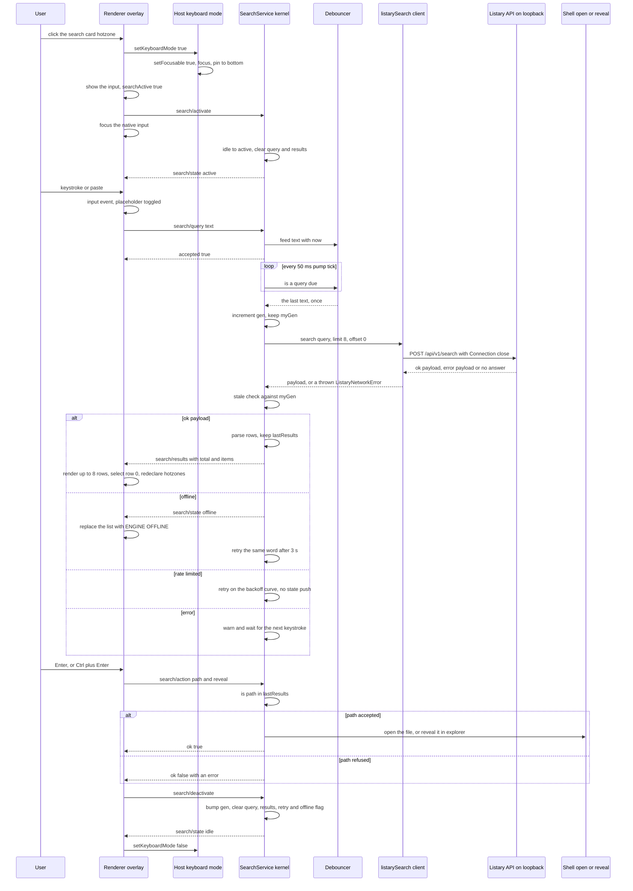
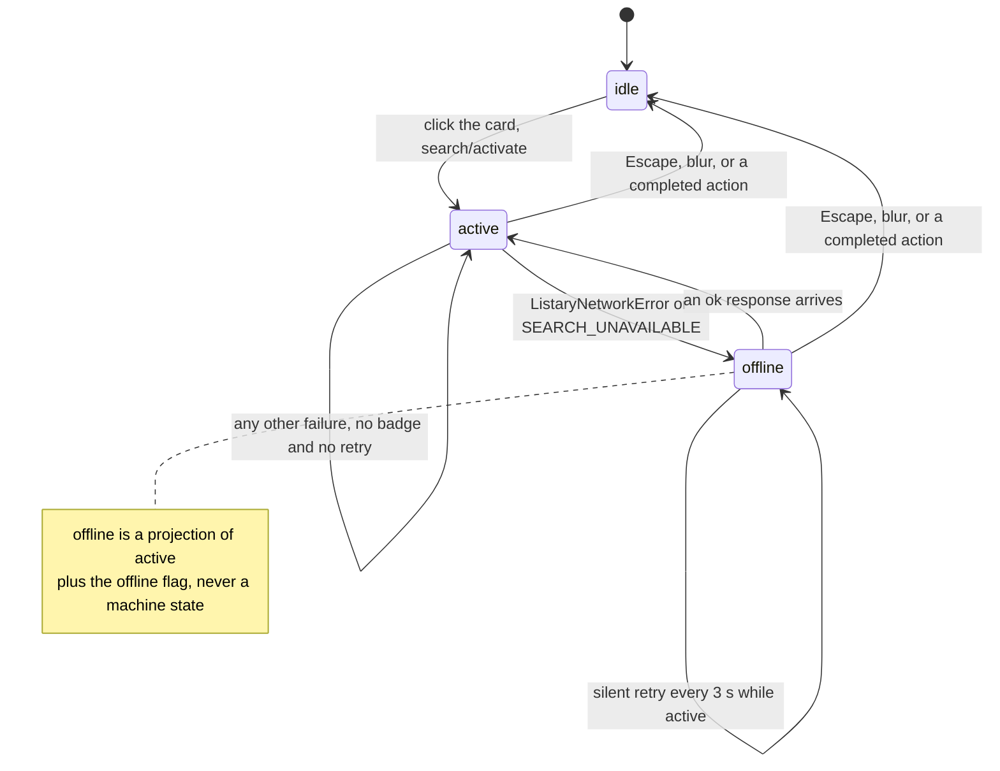

# Workflow: a search query from keystroke to opened file

This page follows one search from the click that wakes the card to the moment a file opens in another application. It is the trace view of the feature whose policy is documented on [search panel](/openwiki/architecture/search-panel.md), whose upstream contract lives on [Listary engine](/openwiki/integrations/listary-engine.md), and whose four methods and two events travel the channel described by [bridge contract and IPC](/openwiki/architecture/bridge-contract-and-ipc.md). Read this page when you need to know *who does what, in which order, and what breaks where*; read those for the contract details.

<!-- openwiki: broken internal link [/repo://app/src/renderer/index.html#L387-L396] file "/repo://app/src/renderer/index.html" does not exist. Fix the href or restore the target, then delete this comment. -->
<!-- openwiki: broken internal link [/repo://CONTEXT.md#L83-L96] file "/repo://CONTEXT.md" does not exist. Fix the href or restore the target, then delete this comment. -->
The whole feature is one overlay inside the standalone panel window — the card carrying `SEARCH` and `CLICK TO SEARCH_` at rest, a native `<input>` while active ([index.html](/repo://app/src/renderer/index.html#L387-L396)). The three state names are repository vocabulary: 待机态 (standby), 活动态 (active) and 引擎离线 (engine offline) ([CONTEXT.md](/repo://CONTEXT.md#L83-L96)).

## The split, stated once

There are two state models and two owners, and every rule below follows from this table.

| Piece | Owns | Never does |
|---|---|---|
<!-- openwiki: broken internal link [/repo://app/src/renderer/main.ts#L466-L485] file "/repo://app/src/renderer/main.ts" does not exist. Fix the href or restore the target, then delete this comment. -->
| Renderer (`app/src/renderer/main.ts`) | The click surface, temporary keyboard mode, keystroke semantics, the selection index, the rows, the `TOTAL` footer and the `ENGINE OFFLINE` badge, the local `searchActive` flag, and the three deactivation triggers. | No socket, no debounce, no retry, no path authorization ([main.ts](/repo://app/src/renderer/main.ts#L466-L485)). |
<!-- openwiki: broken internal link [/repo://app/src/main/services/search.ts#L49-L56] file "/repo://app/src/main/services/search.ts" does not exist. Fix the href or restore the target, then delete this comment. -->
| Kernel (`SearchService`) | The debounce window, the 50 ms pump, the single-flight generation, the only HTTP call, failure classification, both silent recoveries, and the action guard plus execution. | No drawing, no knowledge of what the overlay looks like ([search.ts](/repo://app/src/main/services/search.ts#L49-L56)). |
<!-- openwiki: broken internal link [/repo://app/src/shared/contract.ts#L231-L241] file "/repo://app/src/shared/contract.ts" does not exist. Fix the href or restore the target, then delete this comment. -->
<!-- openwiki: broken internal link [/repo://app/src/shared/contract.ts#L254-L261] file "/repo://app/src/shared/contract.ts" does not exist. Fix the href or restore the target, then delete this comment. -->
<!-- openwiki: broken internal link [/repo://app/src/main/services/bridge.ts#L68-L79] file "/repo://app/src/main/services/bridge.ts" does not exist. Fix the href or restore the target, then delete this comment. -->
| Bridge | Four request methods (`search/activate`, `search/query`, `search/deactivate`, `search/action`) and two pushes (`search/state`, `search/results`) ([contract.ts](/repo://app/src/shared/contract.ts#L231-L241), [contract.ts](/repo://app/src/shared/contract.ts#L254-L261)). | It only unwraps payloads; the dispatch is a four-case switch ([bridge.ts](/repo://app/src/main/services/bridge.ts#L68-L79)). |

Two consequences are worth carrying into any change: **the renderer can ask but cannot cause** (a `search/query` outside the active state is answered `accepted: false`, so a stray keystroke from a torn-down overlay never reaches the engine), and **the kernel can answer but cannot paint** (a path that is not in the most recent result set is refused no matter what index the page computed).

## The trace

*One click to one opened file: the page flips its own flag first in both directions, the kernel owns every decision in between, and the action exits through the same standby transition as `ESC`.*

### 1. The click has to reach the page at all

<!-- openwiki: broken internal link [/repo://app/src/renderer/main.ts#L738-L754] file "/repo://app/src/renderer/main.ts" does not exist. Fix the href or restore the target, then delete this comment. -->
<!-- openwiki: broken internal link [/repo://app/src/renderer/main.ts#L565-L577] file "/repo://app/src/renderer/main.ts" does not exist. Fix the href or restore the target, then delete this comment. -->
<!-- openwiki: broken internal link [/repo://app/src/main/hotzone.ts#L41-L69] file "/repo://app/src/main/hotzone.ts" does not exist. Fix the href or restore the target, then delete this comment. -->
The panel window is transparent and normally click-through; only declared hotzones take mouse input. The renderer declares them by mapping every `.card` element to a rectangle and re-declaring whenever the geometry changes — which for the search card happens on activation, on each result render, on the offline badge, and on deactivation ([main.ts](/repo://app/src/renderer/main.ts#L738-L754), [main.ts](/repo://app/src/renderer/main.ts#L565-L577)). The main process polls the cursor at 25 ms and toggles `setIgnoreMouseEvents` on hit, with a two-poll leave confirmation so a hovering cursor on the boundary cannot flap the window style ([hotzone.ts](/repo://app/src/main/hotzone.ts#L41-L69)).

<!-- openwiki: broken internal link [/repo://.scratch/standalone-app/issues/07-search-overlay.md#L40-L44] file "/repo://.scratch/standalone-app/issues/07-search-overlay.md" does not exist. Fix the href or restore the target, then delete this comment. -->
Because the card grows downward when rows appear, the hotzone grows with it — and so does the chance that a click lands on a row rather than the card body. That is a recorded acceptance pitfall, not a hypothesis: an activation probe that re-clicks the card centre while results are open opens whatever file is under the pointer. Probes must start from standby ([.scratch/standalone-app/issues/07-search-overlay.md](/repo://.scratch/standalone-app/issues/07-search-overlay.md#L40-L44)).

### 2. Activation, and where the keystrokes come from

<!-- openwiki: broken internal link [/repo://app/src/renderer/main.ts#L595-L612] file "/repo://app/src/renderer/main.ts" does not exist. Fix the href or restore the target, then delete this comment. -->
<!-- openwiki: broken internal link [/repo://app/src/main/panel-ipc.ts#L66-L82] file "/repo://app/src/main/panel-ipc.ts" does not exist. Fix the href or restore the target, then delete this comment. -->
The panel window is deliberately never activated, so a click cannot give it the keyboard. `searchActivate()` therefore sets the local `searchActive` flag, switches the host into keyboard mode (`setKeyboardMode(true)`, which the main process implements as `setFocusable(true)` + `focus()` + re-pin to the bottom), swaps the hint for the native input, fires `search/activate` without awaiting it, and then focuses the input ([main.ts](/repo://app/src/renderer/main.ts#L595-L612), [panel-ipc.ts](/repo://app/src/main/panel-ipc.ts#L66-L82)). Focusing the input is what makes the click produce an `input` caret and what lets an IME compose into the box.

<!-- openwiki: broken internal link [/repo://app/src/main/services/search.ts#L90-L98] file "/repo://app/src/main/services/search.ts" does not exist. Fix the href or restore the target, then delete this comment. -->
<!-- openwiki: broken internal link [/repo://app/src/renderer/main.ts#L595-L599] file "/repo://app/src/renderer/main.ts" does not exist. Fix the href or restore the target, then delete this comment. -->
The kernel side is one guarded transition: from `idle` it moves to `active`, clears the query and pushes the state; from `active` a repeated activation is a no-op that keeps the query and the visible list ([search.ts](/repo://app/src/main/services/search.ts#L90-L98)). The page mirrors that idempotence locally — a second click on an already active card only re-places the cursor ([main.ts](/repo://app/src/renderer/main.ts#L595-L599)).

### 3. Every keystroke, one method call

<!-- openwiki: broken internal link [/repo://app/src/renderer/main.ts#L643-L649] file "/repo://app/src/renderer/main.ts" does not exist. Fix the href or restore the target, then delete this comment. -->
<!-- openwiki: broken internal link [/repo://app/src/main/services/search.ts#L115-L122] file "/repo://app/src/main/services/search.ts" does not exist. Fix the href or restore the target, then delete this comment. -->
The input's `input` listener is the only feeder. It hides the `TYPE TO SEARCH FILES_` placeholder, drops the result list when the box goes empty, and calls `search/query` with the current text — on every event, with no debounce on the page side ([main.ts](/repo://app/src/renderer/main.ts#L643-L649)). The kernel answers `{ accepted: boolean }`: `setQuery` returns false unless the machine is active, and an empty text also clears `lastResults`, which closes the action guard ([search.ts](/repo://app/src/main/services/search.ts#L115-L122)).

Three input paths matter in practice and all of them end in that same event:

<!-- openwiki: broken internal link [/repo://app/src/renderer/main.ts#L466-L472] file "/repo://app/src/renderer/main.ts" does not exist. Fix the href or restore the target, then delete this comment. -->
- **Typing, including IME composition.** No `compositionstart`/`compositionend` handler exists; composition activities fire ordinary `input` events, so pinyin feeds the query in real time ([main.ts](/repo://app/src/renderer/main.ts#L466-L472)).
<!-- openwiki: broken internal link [/repo://app/accept/battery.js#L1255-L1263] file "/repo://app/accept/battery.js" does not exist. Fix the href or restore the target, then delete this comment. -->
- **Paste.** Clipboard + `Ctrl+V` produces `input` as well, which is why the acceptance battery pastes the probe word instead of synthesizing keystrokes through an IME ([battery.js](/repo://app/accept/battery.js#L1255-L1263)).
<!-- openwiki: broken internal link [/repo://app/src/renderer/main.ts#L643-L649] file "/repo://app/src/renderer/main.ts" does not exist. Fix the href or restore the target, then delete this comment. -->
<!-- openwiki: broken internal link [/repo://app/src/main/search/engine.ts#L38-L44] file "/repo://app/src/main/search/engine.ts" does not exist. Fix the href or restore the target, then delete this comment. -->
<!-- openwiki: broken internal link [/repo://app/src/main/services/search.ts#L115-L122] file "/repo://app/src/main/services/search.ts" does not exist. Fix the href or restore the target, then delete this comment. -->
- **Emptying the box.** The page clears its own DOM list and still calls `search/query` with the empty text; the kernel's `feed('')` drops the pending slot so no request can become due, and `lastResults` is cleared ([main.ts](/repo://app/src/renderer/main.ts#L643-L649), [engine.ts](/repo://app/src/main/search/engine.ts#L38-L44), [search.ts](/repo://app/src/main/services/search.ts#L115-L122)).

### 4. Debounce, pump, single flight

<!-- openwiki: broken internal link [/repo://app/src/main/services/search.ts#L124-L133] file "/repo://app/src/main/services/search.ts" does not exist. Fix the href or restore the target, then delete this comment. -->
<!-- openwiki: broken internal link [/repo://app/src/main/kernel.ts#L103-L108] file "/repo://app/src/main/kernel.ts" does not exist. Fix the href or restore the target, then delete this comment. -->
<!-- openwiki: broken internal link [/repo://app/tests/search/service.spec.ts#L91-L99] file "/repo://app/tests/search/service.spec.ts" does not exist. Fix the href or restore the target, then delete this comment. -->
<!-- openwiki: broken internal link [/repo://app/src/main/services/search.ts#L165-L178] file "/repo://app/src/main/services/search.ts" does not exist. Fix the href or restore the target, then delete this comment. -->
<!-- openwiki: broken internal link [/repo://app/src/main/services/search.ts#L85-L87] file "/repo://app/src/main/services/search.ts" does not exist. Fix the href or restore the target, then delete this comment. -->
From here the flow is entirely kernel, and it is documented in depth on [search panel](/openwiki/architecture/search-panel.md): `Debouncer.feed` stores the text with a timestamp, a 50 ms `setInterval` calls `tick()` as the single decision point for debounce expiry, rate-limit backoff and offline retry, and `tick()` returns immediately unless the machine is active — so a standby panel never polls the engine and a retry deadline that expires after `ESC` does nothing ([search.ts](/repo://app/src/main/services/search.ts#L124-L133), [kernel.ts](/repo://app/src/main/kernel.ts#L103-L108), [service.spec.ts](/repo://app/tests/search/service.spec.ts#L91-L99)). When a query is due, `runSearch` increments `gen` before awaiting and `stale(myGen)` drops any response whose generation was superseded, or that arrives after deactivation or kernel disposal ([search.ts](/repo://app/src/main/services/search.ts#L165-L178), [search.ts](/repo://app/src/main/services/search.ts#L85-L87)).

### 5. The response becomes a repaint — or a detour

<!-- openwiki: broken internal link [/repo://app/src/main/services/search.ts#L181-L207] file "/repo://app/src/main/services/search.ts" does not exist. Fix the href or restore the target, then delete this comment. -->
`onPayload` classifies before it parses, then branches exactly once ([search.ts](/repo://app/src/main/services/search.ts#L181-L207)):

| Kernel branch | What the user sees | What the kernel does next |
|---|---|---|
| `ok` | `search/results` → rows, row 0 selected, a `TOTAL` footer carrying the result total; the badge goes away and the derived state returns to `active`. | Clears the offline flag, the pending retry and the rate-limit counter; stores `lastResults`. |
| `offline` | `search/state offline` → the list is replaced by the inverted `ENGINE OFFLINE` badge. | Re-sends the current word after `OFFLINE_RETRY_MS = 3000`. |
| `rate_limited` | Nothing changes — the last good list stays, no state event. | Re-sends on `backoffDelay`: 500, 1000, 2000, 4000, 5000 ms. |
| `error` | Nothing changes — no badge, no retry. | Logs `deck-search: 引擎响应异常，等下次输入` and waits for the next keystroke. |

<!-- openwiki: broken internal link [/repo://app/src/renderer/main.ts#L670-L676] file "/repo://app/src/renderer/main.ts" does not exist. Fix the href or restore the target, then delete this comment. -->
<!-- openwiki: broken internal link [/repo://app/src/renderer/main.ts#L532-L566] file "/repo://app/src/renderer/main.ts" does not exist. Fix the href or restore the target, then delete this comment. -->
<!-- openwiki: broken internal link [/repo://app/tests/search/engine.spec.ts#L132-L135] file "/repo://app/tests/search/engine.spec.ts" does not exist. Fix the href or restore the target, then delete this comment. -->
<!-- openwiki: broken internal link [/repo://app/src/renderer/main.ts#L678-L684] file "/repo://app/src/renderer/main.ts" does not exist. Fix the href or restore the target, then delete this comment. -->
The render-side rules are as important as the kernel ones. `search/results` is dropped when the overlay is not active, so a late push cannot paint rows over a collapsed card ([main.ts](/repo://app/src/renderer/main.ts#L670-L676)). A render slices the incoming items to `SEARCH_LIMIT = 8`, resets the selection to the first row (or `-1` for `NO RESULTS`), redraws name and parent-directory halves with left/right elision, appends a `TOTAL` footer with the reported total, and re-declares hotzones because the card just changed size ([main.ts](/repo://app/src/renderer/main.ts#L532-L566)). The kernel never truncates its own parsed rows; eight rows is a presentation constant ([engine.spec.ts](/repo://app/tests/search/engine.spec.ts#L132-L135)). `search/state offline` is honoured only while active, and the recovery to `active` is left to the results push that follows it, which replaces the badge with rows ([main.ts](/repo://app/src/renderer/main.ts#L678-L684)).

<!-- openwiki: broken internal link [/repo://app/src/main/services/search.ts#L100-L113] file "/repo://app/src/main/services/search.ts" does not exist. Fix the href or restore the target, then delete this comment. -->
<!-- openwiki: broken internal link [/repo://app/tests/search/service.spec.ts#L71-L89] file "/repo://app/tests/search/service.spec.ts" does not exist. Fix the href or restore the target, then delete this comment. -->
The **offline badge is transient by construction**. `deactivate()` clears `offlineShown`, so an activation after an outage starts clean and cannot show `ENGINE OFFLINE` before any query has failed — a regression that review caught and that has its own test ([search.ts](/repo://app/src/main/services/search.ts#L100-L113), [service.spec.ts](/repo://app/tests/search/service.spec.ts#L71-L89)).

## The three-state machine and who drives each transition

<!-- openwiki: broken internal link [/repo://app/src/main/services/search.ts#L61-L66] file "/repo://app/src/main/services/search.ts" does not exist. Fix the href or restore the target, then delete this comment. -->
<!-- openwiki: broken internal link [/repo://app/src/main/services/search.ts#L153-L156] file "/repo://app/src/main/services/search.ts" does not exist. Fix the href or restore the target, then delete this comment. -->
`'idle' | 'active'` is the only machine variable; `offline` is what the kernel derives while the offline flag is set ([search.ts](/repo://app/src/main/services/search.ts#L61-L66), [search.ts](/repo://app/src/main/services/search.ts#L153-L156)).

*Three names the user sees, two states the kernel has; every way out of the feature passes through `deactivate`.*

| Transition | Trigger, and who fires it | Effect on both sides |
|---|---|---|
| `idle → active` | A card click in the renderer; the page flips its local flag, then sends `search/activate`. | Kernel clears the query, pushes `search/state active`. |
| `active → active` | A second click on the card, or another `input`. | Activation is idempotent; `setQuery` replaces the query and re-feeds the debouncer. |
| `active → offline` | A thrown `ListaryNetworkError` or a `SEARCH_UNAVAILABLE` payload; kernel only. | `search/state offline` once, badge painted, `retryAt` armed at +3 s. |
| `offline → active` | The next ok payload, typically from the silent retry. | Offline flag and retry cleared, `search/results` emitted; the badge is replaced by rows. |
| `active/offline → idle` | `ESC`, a lost focus, or a completed action; always initiated by the renderer. | Page clears input and list and leaves keyboard mode; kernel resets generation, debouncer, rate counter, retry deadline, query, results and offline flag. |

<!-- openwiki: broken internal link [/repo://app/tests/contract.spec.ts#L260-L267] file "/repo://app/tests/contract.spec.ts" does not exist. Fix the href or restore the target, then delete this comment. -->
**Both flags always agree, and the page flips first.** The renderer sets `searchActive` before it invokes `search/activate`, and clears it before it invokes `search/deactivate`, which is why the two guards on the renderer side (ignore results while inactive, send nothing while inactive) and the kernel's own gate produce the same answer. The kernel is the one that can refuse: the bridge contract test asserts `accepted: false` for a query sent from standby ([contract.spec.ts](/repo://app/tests/contract.spec.ts#L260-L267)).

### The keystroke map

<!-- openwiki: broken internal link [/repo://app/src/renderer/main.ts#L504-L510] file "/repo://app/src/renderer/main.ts" does not exist. Fix the href or restore the target, then delete this comment. -->
`searchDecideAction` is a four-case mapping, ported from the retired Python panel; every other key falls through to the browser's default text editing ([main.ts](/repo://app/src/renderer/main.ts#L504-L510)):

| Key | Local effect | IPC |
|---|---|---|
| `Escape` | No local action of its own; the handler calls `preventDefault()` and runs the shared exit path. | `search/deactivate` with reason `esc`. |
| `ArrowUp` / `ArrowDown` | Clamp `searchSel` within `0..len-1`, no wraparound, repaint the highlight, record `search-selection-moved`. `preventDefault` keeps the caret still. | None. |
| `Enter` | Act on the selected row index. | `search/action` with `reveal: false`. |
| `Ctrl+Enter` | Same, with reveal. | `search/action` with `reveal: true`. |
| Any other key | Left alone (including `Ctrl+V`). | None until `input` fires. |

<!-- openwiki: broken internal link [/repo://app/src/renderer/main.ts#L553-L555] file "/repo://app/src/renderer/main.ts" does not exist. Fix the href or restore the target, then delete this comment. -->
<!-- openwiki: broken internal link [/repo://app/src/renderer/main.ts#L637-L641] file "/repo://app/src/renderer/main.ts" does not exist. Fix the href or restore the target, then delete this comment. -->
Rows are also click targets: each row's `click` runs the same `searchAct(idx, false)`, and each row's `mousedown` is prevented so the click does not blur the input and collapse the overlay before it lands. The card body does the same for clicks that are not on the input ([main.ts](/repo://app/src/renderer/main.ts#L553-L555), [main.ts](/repo://app/src/renderer/main.ts#L637-L641)).

### Opening and revealing

<!-- openwiki: broken internal link [/repo://app/src/renderer/main.ts#L580-L593] file "/repo://app/src/renderer/main.ts" does not exist. Fix the href or restore the target, then delete this comment. -->
<!-- openwiki: broken internal link [/repo://app/src/main/services/search.ts#L135-L146] file "/repo://app/src/main/services/search.ts" does not exist. Fix the href or restore the target, then delete this comment. -->
`Enter` and `Ctrl+Enter` converge on one kernel call, `action(path, reveal)`, where the page sends the path of the row it rendered and the kernel decides whether that path may be acted upon ([main.ts](/repo://app/src/renderer/main.ts#L580-L593), [search.ts](/repo://app/src/main/services/search.ts#L135-L146)):

<!-- openwiki: broken internal link [/repo://app/tests/contract.spec.ts#L283-L305] file "/repo://app/tests/contract.spec.ts" does not exist. Fix the href or restore the target, then delete this comment. -->
<!-- openwiki: broken internal link [/repo://app/tests/search/service.spec.ts#L321-L343] file "/repo://app/tests/search/service.spec.ts" does not exist. Fix the href or restore the target, then delete this comment. -->
- **The guard is membership in the most recent result set.** Anything else is refused with `{ ok: false, error: '动作路径不在最近一次搜索结果内' }`. This is the search path's peer of the desktop item pool check: the page sends an identifier, the kernel validates it against state it owns, so a buggy or compromised renderer cannot make the panel execute an arbitrary path — the contract test offers `C:\Windows\System32\cmd.exe` and the call is rejected ([contract.spec.ts](/repo://app/tests/contract.spec.ts#L283-L305)). Clearing the query clears `lastResults`, which is why actions stop working when the box is empty ([service.spec.ts](/repo://app/tests/search/service.spec.ts#L321-L343)).
<!-- openwiki: broken internal link [/repo://app/src/main/services/search.ts#L79-L84] file "/repo://app/src/main/services/search.ts" does not exist. Fix the href or restore the target, then delete this comment. -->
- **`reveal: false` opens through the injected `open` port**, wired in production to `shellOpen` (`shell.openPath`, where `''` means success and any other string becomes the action's `error`) ([search.ts](/repo://app/src/main/services/search.ts#L79-L84)).
<!-- openwiki: broken internal link [/repo://app/src/main/services/search.ts#L30-L39] file "/repo://app/src/main/services/search.ts" does not exist. Fix the href or restore the target, then delete this comment. -->
- **`reveal: true` spawns Explorer detached** as `explorer` with the `/select,` switch followed by the path, with failures swallowed. The code records a measured reason for the absence of `windowsHide`: it travels through `STARTUPINFO` as `SW_HIDE` and hides the folder window too, producing `ok: true` while no `CabinetWClass` window ever appears ([search.ts](/repo://app/src/main/services/search.ts#L30-L39)).
<!-- openwiki: broken internal link [/repo://app/src/renderer/main.ts#L588-L593] file "/repo://app/src/renderer/main.ts" does not exist. Fix the href or restore the target, then delete this comment. -->
- **The kernel executes; the page collapses.** Neither branch returns the panel to standby by itself — after the invoke settles, `searchAct` calls `searchDeactivate('action')` regardless of the outcome, so the standby transition stays owned by the renderer's local model ([main.ts](/repo://app/src/renderer/main.ts#L588-L593)).

### Returning to idle: three triggers, one exit

<!-- openwiki: broken internal link [/repo://app/src/renderer/main.ts#L615-L635] file "/repo://app/src/renderer/main.ts" does not exist. Fix the href or restore the target, then delete this comment. -->
`ESC`, a lost focus, and a completed action all call `searchDeactivate(reason)` with `reason: 'esc' | 'blur' | 'action'`, which is both the transition and the evidence vocabulary the acceptance battery asserts on ([main.ts](/repo://app/src/renderer/main.ts#L615-L635)):

- `ESC` is handled in the input's `keydown`, with `preventDefault()` so the browser does not also act on it.
- A focus loss is handled by the input's `blur` listener, suppressed when `searchDeactivating` is set — that flag exists so the `blur()` that deactivation performs itself cannot re-enter the transition, and it is released on the next macrotask.
- A completed action deactivates from inside `searchAct`, after the bridge promise settles.

Order within the exit is deliberate: the host leaves keyboard mode, `search/deactivate` is sent fire-and-forget (`.catch(() => {})`), the input value and the result DOM are cleared, the input is blurred, and hotzones are re-declared for the collapsed card. The kernel response is not awaited, which is safe because the kernel's own guard also refuses anything sent after a fresh activation with no query.

## Privacy along this path

<!-- openwiki: broken internal link [/repo://app/src/main/search/engine.ts#L15-L18] file "/repo://app/src/main/search/engine.ts" does not exist. Fix the href or restore the target, then delete this comment. -->
<!-- openwiki: broken internal link [/repo://app/src/main/search/client.ts#L26-L37] file "/repo://app/src/main/search/client.ts" does not exist. Fix the href or restore the target, then delete this comment. -->
Query text exists in exactly three places: the input element, the service's `query` field together with the debouncer's pending slot, and the body of a loopback POST. The host is a module constant (`BASE_HOST = '127.0.0.1'`), never read from input or configuration, so retargeting a query off the machine is impossible by configuration ([engine.ts](/repo://app/src/main/search/engine.ts#L15-L18), [client.ts](/repo://app/src/main/search/client.ts#L26-L37)).

Two automated guards keep it that way, and they are the ones to extend if the path grows:

<!-- openwiki: broken internal link [/repo://app/tests/contract.spec.ts#L569-L593] file "/repo://app/tests/contract.spec.ts" does not exist. Fix the href or restore the target, then delete this comment. -->
- **Behavioural** — after a full search flow with the query `SECRET-QUERY-WORDS`, a usage-log collection cycle still leaves nothing containing that string in the usage directory ([contract.spec.ts](/repo://app/tests/contract.spec.ts#L569-L593)).
<!-- openwiki: broken internal link [/repo://app/tests/contract.spec.ts#L595-L609] file "/repo://app/tests/contract.spec.ts" does not exist. Fix the href or restore the target, then delete this comment. -->
- **Source-level** — the three search files may not reference the usage log (`usage/log`, `appendEvent`, `UsageService`), may not call `writeFileSync`/`appendFileSync`, and may not contain a hard-coded `http(s)://` URL; `client.ts` must obtain its host from `BASE_HOST` ([contract.spec.ts](/repo://app/tests/contract.spec.ts#L595-L609)).

<!-- openwiki: broken internal link [/repo://app/src/renderer/main.ts#L583-L588] file "/repo://app/src/renderer/main.ts" does not exist. Fix the href or restore the target, then delete this comment. -->
<!-- openwiki: broken internal link [/repo://app/src/renderer/main.ts#L670-L676] file "/repo://app/src/renderer/main.ts" does not exist. Fix the href or restore the target, then delete this comment. -->
<!-- openwiki: broken internal link [/repo://app/src/main/panel-ipc.ts#L57-L82] file "/repo://app/src/main/panel-ipc.ts" does not exist. Fix the href or restore the target, then delete this comment. -->
The renderer keeps its half of the rule in its evidence records: every search-related `notify` carries a query *length* (`qlen`) and never the text — `search-results-rendered` sends `qlen`, `total` and `count`, and `search-action` sends `index`, `reveal` and `qlen` ([main.ts](/repo://app/src/renderer/main.ts#L583-L588), [main.ts](/repo://app/src/renderer/main.ts#L670-L676)). Those records travel the host channel into `DECK_EVENT_LOG` ([panel-ipc.ts](/repo://app/src/main/panel-ipc.ts#L57-L82)).

## Testing this lifecycle

The lifecycle is testable because every external effect is an injected port and every timing decision is a value compared against an injected clock.

### The shared harness

`app/tests/search/harness.ts` is the cross-spec fixture, deliberately a non-`spec` file so importing it does not re-run another suite's `describe`s. It provides:

- a **synthetic clock**: `now: () => t` with `advance(ms)`, so debounce windows, the 3 s offline retry and the backoff curve are decided by arithmetic rather than by sleeping;
- **recording fakes**: `calls` (query, limit, offset), `opened`, `revealed`, plus `failOpen(message)` to make the open port report a failure;
- **gear-shifting responses** through `respondWith`, `goOffline()` (throws `ListaryNetworkError`), `goBroken()` (throws an ordinary `Error`), `goRateLimited()` (returns the `TOO_MANY_REQUESTS` envelope);
- `okPayload(items, total?)`, which builds a realistic success envelope;
<!-- openwiki: broken internal link [/repo://app/tests/search/harness.ts#L9-L70] file "/repo://app/tests/search/harness.ts" does not exist. Fix the href or restore the target, then delete this comment. -->
- `flush()`, a `setImmediate` promise that settles an in-flight async search, because the fake search resolves in the same tick ([harness.ts](/repo://app/tests/search/harness.ts#L9-L70)).

<!-- openwiki: broken internal link [/repo://app/tests/search/service.spec.ts#L11-L25] file "/repo://app/tests/search/service.spec.ts" does not exist. Fix the href or restore the target, then delete this comment. -->
<!-- openwiki: broken internal link [/repo://app/src/main/kernel.ts#L103-L108] file "/repo://app/src/main/kernel.ts" does not exist. Fix the href or restore the target, then delete this comment. -->
<!-- openwiki: broken internal link [/repo://app/tests/contract.spec.ts#L50-L50] file "/repo://app/tests/contract.spec.ts" does not exist. Fix the href or restore the target, then delete this comment. -->
`service.spec.ts` mounts the real `SearchService` on a `cordis` `Context`, subscribes to `search/state` and `search/results`, and drives the whole link with `h.advance(...)` + `svc.tick()`. That is only possible because the production pump is optional: the kernel assemblies install `setInterval(() => ctx.search?.tick(), searchIntervalMs)` unless `searchIntervalMs` is `0`, and the test assemblies pass `0` ([service.spec.ts](/repo://app/tests/search/service.spec.ts#L11-L25), [kernel.ts](/repo://app/src/main/kernel.ts#L103-L108), [contract.spec.ts](/repo://app/tests/contract.spec.ts#L50-L50)).

<!-- openwiki: broken internal link [/repo://app/tests/search/service.spec.ts#L102-L300] file "/repo://app/tests/search/service.spec.ts" does not exist. Fix the href or restore the target, then delete this comment. -->
The interesting cases are all ordering cases: the debounce boundary at 199 ms versus 200 ms, coalescing of three keystrokes into the last word, same-word suppression and its reset on deactivation, the offline retry firing at exactly 3000 ms and not at 2999 ms, the 500/1000/2000 ms backoff steps, the `error` branch producing no retry at all, and single-flight invalidation when the newer response resolves before the older one ([service.spec.ts](/repo://app/tests/search/service.spec.ts#L102-L300)).

### The fake API on a real socket

Two layers of fake engine exist, and the difference matters.

<!-- openwiki: broken internal link [/repo://app/tests/search/client.spec.ts#L20-L53] file "/repo://app/tests/search/client.spec.ts" does not exist. Fix the href or restore the target, then delete this comment. -->
<!-- openwiki: broken internal link [/repo://app/tests/search/client.spec.ts#L104-L126] file "/repo://app/tests/search/client.spec.ts" does not exist. Fix the href or restore the target, then delete this comment. -->
<!-- openwiki: broken internal link [/repo://app/src/main/services/search.ts#L74-L84] file "/repo://app/src/main/services/search.ts" does not exist. Fix the href or restore the target, then delete this comment. -->
**In-process (unit).** `client.spec.ts` starts a real `node:http` server bound to `127.0.0.1` on an ephemeral port (`listen(0)`), and runs the *real* `listarySearch` against it, swapping behaviour per test. That covers the request body with `offset`, empty results, `SEARCH_UNAVAILABLE`, `TOO_MANY_REQUESTS`, connection refused (port 1), a forced 120 ms timeout against a server that never answers, a non-JSON body, and the no-keep-alive behaviour of two back-to-back requests ([client.spec.ts](/repo://app/tests/search/client.spec.ts#L20-L53), [client.spec.ts](/repo://app/tests/search/client.spec.ts#L104-L126)). The port is injected, never read from configuration — production resolves it once, at service construction, from `config.search.port` ([search.ts](/repo://app/src/main/services/search.ts#L74-L84)).

<!-- openwiki: broken internal link [/repo://app/accept/battery.js#L441-L451] file "/repo://app/accept/battery.js" does not exist. Fix the href or restore the target, then delete this comment. -->
<!-- openwiki: broken internal link [/repo://app/accept/battery.js#L1416-L1449] file "/repo://app/accept/battery.js" does not exist. Fix the href or restore the target, then delete this comment. -->
<!-- openwiki: broken internal link [/repo://app/accept/battery.js#L411-L439] file "/repo://app/accept/battery.js" does not exist. Fix the href or restore the target, then delete this comment. -->
**End-to-end (acceptance).** The battery reproduces the offline state on a machine where Listary *is* running by making the port point at nothing: `freePort()` binds a loopback socket on port 0, reads the assigned port and immediately closes it, the battery writes that number as `search.port` into `config.json`, restarts the panel, activates the card, pastes the word, and waits for the renderer's `search-offline-shown` record; afterwards it restores `config.json` from its own backup and restarts again ([battery.js](/repo://app/accept/battery.js#L441-L451), [battery.js](/repo://app/accept/battery.js#L1416-L1449)). The same run pre-checks the real engine with a second, independent client that posts the same body to `127.0.0.1:38431` and requires a freshly created probe file to rank first, so "no results" can be told apart from "engine not ready" ([battery.js](/repo://app/accept/battery.js#L411-L439)).

### Probes and pitfalls worth copying

<!-- openwiki: broken internal link [/repo://app/accept/battery.js#L1237-L1268] file "/repo://app/accept/battery.js" does not exist. Fix the href or restore the target, then delete this comment. -->
<!-- openwiki: broken internal link [/repo://app/accept/battery.js#L1363-L1414] file "/repo://app/accept/battery.js" does not exist. Fix the href or restore the target, then delete this comment. -->
- **Drive the UI through its own evidence channel.** Every probe waits on a `notify` record: `search-activated`, `search-results-rendered` (asserting `count` and reading `qlen`), `search-selection-moved` (`index: 2`), `search-opened` / `search-revealed`, `search-deactivated` (`reason: 'esc'` versus `'blur'`), `search-offline-shown` ([battery.js](/repo://app/accept/battery.js#L1237-L1268), [battery.js](/repo://app/accept/battery.js#L1363-L1414)).
<!-- openwiki: broken internal link [/repo://.scratch/standalone-app/issues/07-search-overlay.md#L40-L44] file "/repo://.scratch/standalone-app/issues/07-search-overlay.md" does not exist. Fix the href or restore the target, then delete this comment. -->
- **Activation must start from standby.** While results are open, the card's geometric centre is inside the list, so a "click to activate" probe opens a file instead ([.scratch/standalone-app/issues/07-search-overlay.md](/repo://.scratch/standalone-app/issues/07-search-overlay.md#L40-L44)).
<!-- openwiki: broken internal link [/repo://app/accept/battery.js#L411-L439] file "/repo://app/accept/battery.js" does not exist. Fix the href or restore the target, then delete this comment. -->
<!-- openwiki: broken internal link [/repo://app/accept/battery.js#L1281-L1292] file "/repo://app/accept/battery.js" does not exist. Fix the href or restore the target, then delete this comment. -->
- **Index readiness is asynchronous.** The engine pre-check polls for up to 90 s, and compares paths through `realpath` + basename because `os.tmpdir()` can hand back an 8.3 short name while Listary reports the long one ([battery.js](/repo://app/accept/battery.js#L411-L439), [battery.js](/repo://app/accept/battery.js#L1281-L1292)).
<!-- openwiki: broken internal link [/repo://app/accept/battery.js#L1325-L1357] file "/repo://app/accept/battery.js" does not exist. Fix the href or restore the target, then delete this comment. -->
- **Assert the action by its side effect, not by the reply.** `Enter` is confirmed by a window whose title contains the probe token, and `Ctrl+Enter` by a `CabinetWClass` window — the second one is the only way to catch the `windowsHide` regression, since the bridge reports `ok: true` either way ([battery.js](/repo://app/accept/battery.js#L1325-L1357)).
<!-- openwiki: broken internal link [/repo://app/accept/battery.js#L1255-L1263] file "/repo://app/accept/battery.js" does not exist. Fix the href or restore the target, then delete this comment. -->
- **Paste, don't type.** `Ctrl+V` from a pre-set clipboard drives `input` without involving an IME, which keeps the probe deterministic ([battery.js](/repo://app/accept/battery.js#L1255-L1263)).

The generic patterns behind these techniques — injected dependency bundles, in-process kernel assemblies with manual pumps, harnesses shared from non-`spec` files — are described on [testing strategy](/openwiki/testing/testing-strategy.md).

## Invariants to keep when changing this path

<!-- openwiki: broken internal link [/repo://app/src/main/services/search.ts#L18-L28] file "/repo://app/src/main/services/search.ts" does not exist. Fix the href or restore the target, then delete this comment. -->
- **A new external effect belongs behind a `SearchDeps` port** (`search`, `open`, `reveal`, `now`), never inline in the service, so the harness keeps covering it ([search.ts](/repo://app/src/main/services/search.ts#L18-L28)).
<!-- openwiki: broken internal link [/repo://app/src/main/services/search.ts#L165-L178] file "/repo://app/src/main/services/search.ts" does not exist. Fix the href or restore the target, then delete this comment. -->
- **Every new asynchronous step in the kernel chain must capture `gen` before awaiting and pass `stale()` before emitting** ([search.ts](/repo://app/src/main/services/search.ts#L165-L178)).
- **Keep the action guard kernel-side and keep it keyed on the last result set.** The renderer's `searchSel` is a convenience, not an authorization.
<!-- openwiki: broken internal link [/repo://app/src/main/search/engine.ts#L109-L124] file "/repo://app/src/main/search/engine.ts" does not exist. Fix the href or restore the target, then delete this comment. -->
- **Keep the failure taxonomy in `classifyFailure`.** In particular, do not widen `offline` and do not add automatic retry to `error`: "reachable but weird" must stay distinguishable from "absent" ([engine.ts](/repo://app/src/main/search/engine.ts#L109-L124)).
- **Do not add persistence or logging of query text.** No disk writes in the search chain, no usage-log reference, and no evidence record carrying the query itself.
- **Keep the debounce in the kernel and the drawing in the page.** A renderer-side debounce would put a second policy in the layer that cannot see generations or retries.

## Related pages

- [Search panel](/openwiki/architecture/search-panel.md) — the kernel-side state machine, debounce, pump, retries and action guard in policy detail.
- [Listary engine](/openwiki/integrations/listary-engine.md) — the loopback HTTP contract this workflow calls, plus the dead-port technique.
- [Bridge contract and IPC](/openwiki/architecture/bridge-contract-and-ipc.md) — the four methods and two events, and the envelope they travel in.
- [Renderer panel](/openwiki/architecture/renderer-panel.md) — the overlay's markup, local transition model, row rendering and hotzone declaration.
- [Testing strategy](/openwiki/testing/testing-strategy.md) — the injected-dependency and manual-pump patterns this page's tests are built on.
- [Acceptance battery](/openwiki/testing/acceptance-battery.md) — the live machine run that exercises this workflow end to end.
