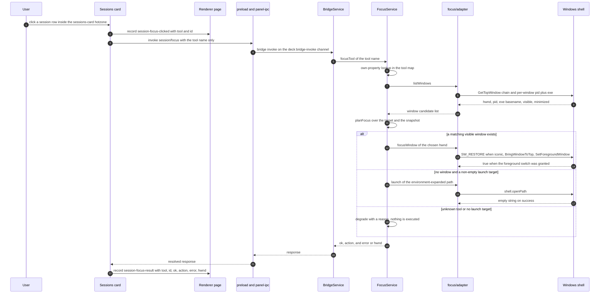
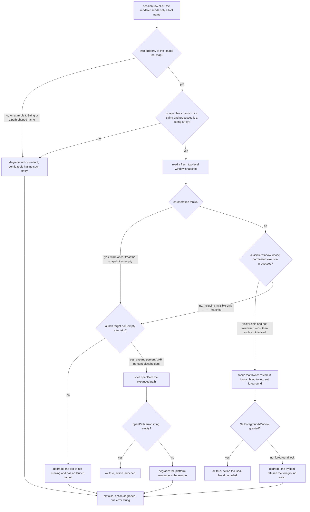

# Clicking a session row to reach the tool window

One click on a session row is a request to "go to where that agent is": if the tool is running, its window comes to the front; if it is not, the tool starts. The interesting part is not the two happy paths but the shape of the call. The renderer sends nothing but a tool name, the kernel owns the mapping to an executable, and *every* failure — unknown tool, refused foreground activation, missing executable, unreadable window list — ends as a resolved `degraded` response instead of an error the user would ever see.

This page follows that click from the DOM to `SetForegroundWindow`/`shell.openPath` and back into the evidence log. Three components own different halves of it:

| Component | Owns | Never does |
|---|---|---|
| Sessions card (`app/src/renderer/cards/sessions/card.ts`) | Turning one session record into a row with a two-letter tool tag, sending `{ tool }`, and recording the outcome | Send a path, decide whether the tool is running, show an error |
| `BridgeService` + transport (`app/src/main/services/bridge.ts`, `app/src/main/panel-ipc.ts`, `app/src/preload/index.ts`) | One contract method `session/focus`, the ok/error envelope, the conversion back into a rejecting promise | Validate the tool name or know about windows |
| `FocusService` (`app/src/main/services/focus.ts`) + decision kernel (`app/src/main/focus/plan.ts`) + Windows adapter (`app/src/main/focus/adapter.ts`) | The tool lookup, the window snapshot, window selection, launch-target expansion, and the three-state result | Read a window title, accept a target from the renderer |

Reading order for context: [agent session collection](/openwiki/architecture/agent-session-collection.md) for where the `tool` field and the rows come from, [domain model](/openwiki/concepts/domain-model.md) for the session vocabulary and the `config.json` sections, [bridge contract and IPC](/openwiki/architecture/bridge-contract-and-ipc.md) for the channel this call rides on, [Windows shell and system APIs](/openwiki/integrations/windows-shell-and-system-apis.md) for the FFI binding and enumeration details this page only summarizes, and [recovery and diagnostics](/openwiki/operations/recovery-and-diagnostics.md) for the evidence log itself.

## The click: one name, and a hotzone it has to land in

<!-- openwiki: broken internal link [/repo://app/src/renderer/cards/sessions/card.ts#L26-L47] file "/repo://app/src/renderer/cards/sessions/card.ts" does not exist. Fix the href or restore the target, then delete this comment. -->
A row is built from one `SessionInfo` record: `tool` becomes a two-letter tag (`QD`, `KC`, `KW`, `ZC`, `HM`, unknown → `??`), `state` a lowercase CSS class, `project` the visible name, and `tasks_done`/`tasks_total` the `NNN/NNN` counter only when both are non-null ([card.ts](/repo://app/src/renderer/cards/sessions/card.ts#L26-L47)). The row carries the tool name in `dataset.tool` and a click listener that sends exactly that name:

```ts
host.notify('session-focus-clicked', { tool, id })
void host.invoke('session/focus', { tool })
```

<!-- openwiki: broken internal link [/repo://app/src/renderer/cards/sessions/card.ts#L14-L24] file "/repo://app/src/renderer/cards/sessions/card.ts" does not exist. Fix the href or restore the target, then delete this comment. -->
Nothing else about the session travels in the request — not the project, not the session id, certainly not a path ([card.ts](/repo://app/src/renderer/cards/sessions/card.ts#L14-L24)). The id rides along only in the evidence records, so a result line can be joined with the click that caused it.

Two preconditions sit outside the card and are easy to miss:

<!-- openwiki: broken internal link [/repo://app/src/renderer/main.ts#L738-L754] file "/repo://app/src/renderer/main.ts" does not exist. Fix the href or restore the target, then delete this comment. -->
<!-- openwiki: broken internal link [/repo://app/accept/battery.js#L1896-L1919] file "/repo://app/accept/battery.js" does not exist. Fix the href or restore the target, then delete this comment. -->
- **The click has to land inside a declared hotzone.** The panel window is click-through (`setIgnoreMouseEvents(true)`) except where the page declares rectangles; `declareHotZones()` declares one rectangle per `.card` element, so `#sessions-card` is the addressable region and the rows inside it need no rectangles of their own ([main.ts](/repo://app/src/renderer/main.ts#L738-L754)). That is also why the real-machine battery clicks a row by computing a physical point from the published row rectangle and then verifies the row's own record arrived — a point that misses the card never reaches the page at all ([battery.js](/repo://app/accept/battery.js#L1896-L1919)).
<!-- openwiki: broken internal link [/repo://app/src/renderer/cards/sessions/card.ts#L30-L33] file "/repo://app/src/renderer/cards/sessions/card.ts" does not exist. Fix the href or restore the target, then delete this comment. -->
- **Only the first nine rows exist as DOM.** `sessions.slice(0, 9)` caps rendering, so a tenth session is visible nowhere and clickable nowhere; the header count still reports the full length ([card.ts](/repo://app/src/renderer/cards/sessions/card.ts#L30-L33)).

<!-- openwiki: broken internal link [/repo://app/src/renderer/cards/sessions/card.ts#L48-L62] file "/repo://app/src/renderer/cards/sessions/card.ts" does not exist. Fix the href or restore the target, then delete this comment. -->
The card also publishes the geometry it drew: on the first three renders after mount it emits `sessions-rendered { n, count, rows }` with `tool`, `project` and the row's client rectangle for every row ([card.ts](/repo://app/src/renderer/cards/sessions/card.ts#L48-L62)). That record is how an automated run locates a specific session row without any accessibility API — the acceptance battery seeds a session whose project name is a unique tag and finds its rectangle in the newest `sessions-rendered` payload.

<!-- openwiki: broken internal link [/repo://app/src/main/scanners/index.ts#L22-L28] file "/repo://app/src/main/scanners/index.ts" does not exist. Fix the href or restore the target, then delete this comment. -->
<!-- openwiki: broken internal link [/repo://app/src/main/config.ts#L214-L237] file "/repo://app/src/main/config.ts" does not exist. Fix the href or restore the target, then delete this comment. -->
Router of the whole feature is one string: `SessionInfo.tool`. The scanner keys and the `config.tools` keys are the same five names ([scanners/index.ts](/repo://app/src/main/scanners/index.ts#L22-L28), [config.ts](/repo://app/src/main/config.ts#L214-L237)), and the two maps never reference each other. Renaming a tool in one place only shows up as a `??` tag and a degraded click.

## The hop through the bridge

<!-- openwiki: broken internal link [/repo://app/src/shared/contract.ts#L244-L251] file "/repo://app/src/shared/contract.ts" does not exist. Fix the href or restore the target, then delete this comment. -->
<!-- openwiki: broken internal link [/repo://app/src/shared/contract.ts#L135-L135] file "/repo://app/src/shared/contract.ts" does not exist. Fix the href or restore the target, then delete this comment. -->
`session/focus` is a normal bridge method: request `{ tool: string }`, response `{ ok, action, error?, hwnd? }`, where `action` is the union `'focused' | 'launched' | 'degraded'` ([contract.ts](/repo://app/src/shared/contract.ts#L244-L251), [contract.ts](/repo://app/src/shared/contract.ts#L135-L135)). The dispatch is three lines and does no validation of its own:

```ts
case 'session/focus': {
  const { tool } = payload as { tool: string }
  return await this.ctx.focus.focusTool(String(tool ?? '')) as BridgeMethods[M]['response']
}
```

<!-- openwiki: broken internal link [/repo://app/src/main/services/bridge.ts#L84-L87] file "/repo://app/src/main/services/bridge.ts" does not exist. Fix the href or restore the target, then delete this comment. -->
<!-- openwiki: broken internal link [/repo://app/src/main/services/bridge.ts#L23-L23] file "/repo://app/src/main/services/bridge.ts" does not exist. Fix the href or restore the target, then delete this comment. -->
([bridge.ts](/repo://app/src/main/services/bridge.ts#L84-L87)) `BridgeService` declares `focus` in `static inject`, so the service exists before the bridge does and the panel cannot boot half-wired ([bridge.ts](/repo://app/src/main/services/bridge.ts#L23-L23)).

<!-- openwiki: broken internal link [/repo://app/src/main/panel-ipc.ts#L38-L48] file "/repo://app/src/main/panel-ipc.ts" does not exist. Fix the href or restore the target, then delete this comment. -->
<!-- openwiki: broken internal link [/repo://app/src/preload/index.ts#L10-L14] file "/repo://app/src/preload/index.ts" does not exist. Fix the href or restore the target, then delete this comment. -->
The transport matters for the failure taxonomy. `panel-ipc.ts` wraps every invoke in an ok/error envelope because IPC cannot serialize an `Error` faithfully, and the preload side converts an `ok: false` envelope back into a thrown error ([panel-ipc.ts](/repo://app/src/main/panel-ipc.ts#L38-L48), [preload/index.ts](/repo://app/src/preload/index.ts#L10-L14)). So there are two distinct failure channels:

- **In-band degradation** — the promise *resolves* with `ok: false` and a reason. This is every product-level failure described below.
<!-- openwiki: broken internal link [/repo://app/src/renderer/cards/sessions/card.ts#L16-L23] file "/repo://app/src/renderer/cards/sessions/card.ts" does not exist. Fix the href or restore the target, then delete this comment. -->
- **Out-of-band rejection** — the promise *rejects*: no kernel, a destroyed window, an unknown method name. The card's second callback records `session-focus-failed { tool, id, message }` and does nothing else ([card.ts](/repo://app/src/renderer/cards/sessions/card.ts#L16-L23)).

`session/focus` has no push event: the result travels only in the response, and nothing in `panel/changed` reflects it. The only durable trace of a click is the renderer's own evidence record.

## FocusService: guard first, then decide

<!-- openwiki: broken internal link [/repo://app/src/main/index.ts#L85-L90] file "/repo://app/src/main/index.ts" does not exist. Fix the href or restore the target, then delete this comment. -->
<!-- openwiki: broken internal link [/repo://app/src/main/services/focus.ts#L19-L59] file "/repo://app/src/main/services/focus.ts" does not exist. Fix the href or restore the target, then delete this comment. -->
`FocusService` is constructed with the loaded `config.tools` (production passes `focus: { tools: config.tools }` at boot) and a dependency bundle whose four entries are the seams unit tests replace: `listWindows`, `focusWindow`, `launch`, `env` ([index.ts](/repo://app/src/main/index.ts#L85-L90), [services/focus.ts](/repo://app/src/main/services/focus.ts#L19-L59)).



*One click: the tool name is resolved against the loaded mapping, the window list is re-read fresh, and the outcome comes back as a response plus one evidence record.*

The lookup is deliberately not a plain index. `focusTool` accepts only an **own** property of the tool map:

```ts
const target = Object.prototype.hasOwnProperty.call(this.tools, tool) ? this.tools[tool] : undefined
```

<!-- openwiki: broken internal link [/repo://app/src/main/services/focus.ts#L61-L66] file "/repo://app/src/main/services/focus.ts" does not exist. Fix the href or restore the target, then delete this comment. -->
([services/focus.ts](/repo://app/src/main/services/focus.ts#L61-L66)) Without it, a name like `toString`, `constructor` or `valueOf` would return the `Object.prototype` member — a truthy function, not a tool — and the lookup semantics of `config.tools` would silently include JavaScript's prototype chain. The guard is the first of two layers; the second lives in the decision kernel and is described below.

<!-- openwiki: broken internal link [/repo://app/src/main/services/focus.ts#L66-L73] file "/repo://app/src/main/services/focus.ts" does not exist. Fix the href or restore the target, then delete this comment. -->
Window enumeration failure is not fatal either. `listWindows()` is called inside a `try`; an FFI failure logs `deck-focus: 窗口枚举失败，降级为仅启动：…` and leaves the snapshot empty, which routes the click to the launch path — a tool that is not running can still be started ([services/focus.ts](/repo://app/src/main/services/focus.ts#L66-L73)). The window list is never cached: it is re-read on every click, so a tool started a second ago is found by the next click.

## The decision kernel: focus, launch, or degrade

<!-- openwiki: broken internal link [/repo://app/src/main/focus/plan.ts#L19-L23] file "/repo://app/src/main/focus/plan.ts" does not exist. Fix the href or restore the target, then delete this comment. -->
<!-- openwiki: broken internal link [/repo://app/src/main/focus/plan.ts#L67-L85] file "/repo://app/src/main/focus/plan.ts" does not exist. Fix the href or restore the target, then delete this comment. -->
`planFocus(raw, windows)` is pure — no FFI, no Electron, no I/O — and returns an exhaustive three-state result, so the caller has no fallback branch to forget ([plan.ts](/repo://app/src/main/focus/plan.ts#L19-L23), [plan.ts](/repo://app/src/main/focus/plan.ts#L67-L85)):



*The whole decision with its degrade branches: two guards run before any native call, the window snapshot decides focus versus launch, and each native call has its own refusal branch.*

### Selection rules

<!-- openwiki: broken internal link [/repo://app/src/main/focus/plan.ts#L25-L47] file "/repo://app/src/main/focus/plan.ts" does not exist. Fix the href or restore the target, then delete this comment. -->
`pickWindow` scores every candidate, skips the ones that cannot be focused at all, and keeps the best ([plan.ts](/repo://app/src/main/focus/plan.ts#L25-L47)):

| Candidate state | Score | Outcome |
|---|---|---|
| Not visible | −1 | Skipped — an invisible window is never focused, so a tray-resident tool goes down the launch path instead |
| Visible but minimized | 1 | Eligible; `nativeFocusWindow` restores it as part of focusing |
| Visible, not minimized | 2 | Preferred |

<!-- openwiki: broken internal link [/repo://app/src/main/focus/plan.ts#L31-L52] file "/repo://app/src/main/focus/plan.ts" does not exist. Fix the href or restore the target, then delete this comment. -->
<!-- openwiki: broken internal link [/repo://app/tests/focus/plan.spec.ts#L40-L43] file "/repo://app/tests/focus/plan.spec.ts" does not exist. Fix the href or restore the target, then delete this comment. -->
Ties are won by enumeration order, which is z-order from the top — the frontmost matching window. Matching is exact equality of the normalised image name against the set built from `target.processes`; there is no prefix, substring or fuzzy match, so `zcode-helper.exe` does not match a target listing `zcode` ([plan.ts](/repo://app/src/main/focus/plan.ts#L31-L52), [plan.spec.ts](/repo://app/tests/focus/plan.spec.ts#L40-L43)).

### The shape guard

<!-- openwiki: broken internal link [/repo://app/src/main/focus/plan.ts#L54-L65] file "/repo://app/src/main/focus/plan.ts" does not exist. Fix the href or restore the target, then delete this comment. -->
<!-- openwiki: broken internal link [/repo://app/tests/focus/service.spec.ts#L131-L142] file "/repo://app/tests/focus/service.spec.ts" does not exist. Fix the href or restore the target, then delete this comment. -->
<!-- openwiki: broken internal link [/repo://app/tests/focus/plan.spec.ts#L70-L84] file "/repo://app/tests/focus/plan.spec.ts" does not exist. Fix the href or restore the target, then delete this comment. -->
`asToolTarget` is the second ownership layer. It rejects anything that is not a non-null object carrying a string `launch` and an array of strings in `processes`, and it is what turns "the map lookup returned something odd" into the same silent degrade instead of a `TypeError` thrown from `target.processes.map` ([plan.ts](/repo://app/src/main/focus/plan.ts#L54-L65)). The two guards are separately tested: the service test drives prototype key names through the real lookup, and the plan test feeds the same prototype members straight into the kernel ([service.spec.ts](/repo://app/tests/focus/service.spec.ts#L131-L142), [plan.spec.ts](/repo://app/tests/focus/plan.spec.ts#L70-L84)).

### Environment expansion happens last, and in the service

<!-- openwiki: broken internal link [/repo://app/src/main/focus/plan.ts#L87-L90] file "/repo://app/src/main/focus/plan.ts" does not exist. Fix the href or restore the target, then delete this comment. -->
<!-- openwiki: broken internal link [/repo://app/src/main/services/focus.ts#L83-L86] file "/repo://app/src/main/services/focus.ts" does not exist. Fix the href or restore the target, then delete this comment. -->
<!-- openwiki: broken internal link [/repo://app/src/main/focus/plan.ts#L82-L84] file "/repo://app/src/main/focus/plan.ts" does not exist. Fix the href or restore the target, then delete this comment. -->
<!-- openwiki: broken internal link [/repo://app/tests/focus/service.spec.ts#L55-L63] file "/repo://app/tests/focus/service.spec.ts" does not exist. Fix the href or restore the target, then delete this comment. -->
`planFocus` returns the configured `launch` string **unexpanded**; `expandEnvVars` is applied by `focusTool` immediately before the launch call, using the injected `env` (production: `process.env`) ([plan.ts](/repo://app/src/main/focus/plan.ts#L87-L90), [services/focus.ts](/repo://app/src/main/services/focus.ts#L83-L86)). The split keeps the kernel pure: `planFocus` hands back the configured string exactly as written (trimmed), and only the service touches the environment, which is why the service test injects a fake `env` and asserts the expanded path at the launch seam ([plan.ts](/repo://app/src/main/focus/plan.ts#L82-L84), [service.spec.ts](/repo://app/tests/focus/service.spec.ts#L55-L63)). Unknown placeholders are left verbatim, so a typo surfaces as a `shell.openPath` error string rather than as an empty path.

## The adapter: enumeration, foreground, launch

<!-- openwiki: broken internal link [/repo://app/src/main/focus/adapter.ts#L31-L52] file "/repo://app/src/main/focus/adapter.ts" does not exist. Fix the href or restore the target, then delete this comment. -->
<!-- openwiki: broken internal link [/repo://app/src/main/services/focus.ts#L52-L58] file "/repo://app/src/main/services/focus.ts" does not exist. Fix the href or restore the target, then delete this comment. -->
`focus/adapter.ts` is the only place that touches `user32.dll`/`kernel32.dll`; it binds lazily and memoizes inside the first call, so a test that injects fake sources never loads native code ([adapter.ts](/repo://app/src/main/focus/adapter.ts#L31-L52)). Its three exports are what the service's dependencies default to ([services/focus.ts](/repo://app/src/main/services/focus.ts#L52-L58)):

<!-- openwiki: broken internal link [/repo://app/src/main/focus/adapter.ts#L76-L103] file "/repo://app/src/main/focus/adapter.ts" does not exist. Fix the href or restore the target, then delete this comment. -->
<!-- openwiki: broken internal link [/repo://app/src/main/focus/plan.ts#L9-L17] file "/repo://app/src/main/focus/plan.ts" does not exist. Fix the href or restore the target, then delete this comment. -->
- `nativeWindowCandidates()` walks the top-level window chain with `GetTopWindow`/`GetWindow(GW_HWNDNEXT)` — deliberately not an `EnumWindows` callback, to avoid FFI callback lifetime problems — under a 2048-iteration guard, and records `hwnd`, `pid`, the exe basename, `visible` and `minimized` for each window whose owning process image can be read ([adapter.ts](/repo://app/src/main/focus/adapter.ts#L76-L103)). Windows whose exe cannot be read (access denied, already exited) are skipped rather than reported; the comment notes that skipping cannot change the decision because matching needs only the exe. No window title is read anywhere on this path — the candidate shape carries no field for one ([plan.ts](/repo://app/src/main/focus/plan.ts#L9-L17)).
<!-- openwiki: broken internal link [/repo://app/src/main/focus/adapter.ts#L105-L119] file "/repo://app/src/main/focus/adapter.ts" does not exist. Fix the href or restore the target, then delete this comment. -->
- `nativeFocusWindow(hwnd)` restores a minimized window with `SW_RESTORE`, then calls `BringWindowToTop` and `SetForegroundWindow`, returning the latter's boolean. It catches its own exceptions and returns `false`, because the foreground lock can legitimately refuse the switch and a panel must not fall over because it could not raise somebody else's window ([adapter.ts](/repo://app/src/main/focus/adapter.ts#L105-L119)).
<!-- openwiki: broken internal link [/repo://app/src/main/focus/adapter.ts#L121-L124] file "/repo://app/src/main/focus/adapter.ts" does not exist. Fix the href or restore the target, then delete this comment. -->
<!-- openwiki: broken internal link [/repo://app/src/main/focus/plan.ts#L67-L75] file "/repo://app/src/main/focus/plan.ts" does not exist. Fix the href or restore the target, then delete this comment. -->
- `shellLaunch(exe)` is `shell.openPath`, i.e. ShellExecute semantics: for a single-instance application this means "raise the existing instance", which is why launching is the right verb even for a tool that is already resident without a visible window ([adapter.ts](/repo://app/src/main/focus/adapter.ts#L121-L124), [plan.ts](/repo://app/src/main/focus/plan.ts#L67-L75)).

## Silent degradation, and where it actually shows up

<!-- openwiki: broken internal link [/repo://app/src/main/services/focus.ts#L37-L45] file "/repo://app/src/main/services/focus.ts" does not exist. Fix the href or restore the target, then delete this comment. -->
<!-- openwiki: broken internal link [/repo://app/src/renderer/cards/sessions/card.ts#L1-L3] file "/repo://app/src/renderer/cards/sessions/card.ts" does not exist. Fix the href or restore the target, then delete this comment. -->
Everything that can go wrong resolves as `{ ok: false, action: 'degraded', error }` with a human-readable reason. That is a design decision stated in the service's own boundary comment: the session row is a "look and click" interaction, so a failure must not interrupt the desktop, pop a dialog, or break the panel ([services/focus.ts](/repo://app/src/main/services/focus.ts#L37-L45), [card.ts](/repo://app/src/renderer/cards/sessions/card.ts#L1-L3)). The renderer therefore has no toast, no red row, no retry — it does not even branch on the result beyond recording it.

| Trigger | Decided in | `error` carried back | User-visible effect |
|---|---|---|---|
| `tool` is not an own key of the tool map (unknown tool, a path-shaped payload, `toString`) | own-property guard, then `asToolTarget` | `未知工具（config.tools 无此条目）` | none; nothing is executed |
| Entry exists but is malformed (`launch` not a string, `processes` not a string array) | `asToolTarget` | same unknown-tool reason | none |
| No visible matching window and `launch` is blank or whitespace | `planFocus` | `工具未运行且无启动目标` | none |
| Window enumeration throws (native binding unavailable) | `focusTool` around `listWindows` | the launch or unknown-tool reason; a console warning is the only immediate signal | none; a tool that is not running can still be started |
| `SetForegroundWindow` returns false (foreground lock) | `focusTool` | `系统拒绝置前该窗口（前台锁）` | none; the window keeps its z-order |
| `focusWindow` throws | `focusTool` | `置前异常：…` | none |
| `shell.openPath` returns a non-empty error string (missing file, unexpanded placeholder) | `focusTool` | the platform message verbatim | none |
| `launch` rejects | `focusTool` | `启动失败：…` | none |
| Bridge or IPC layer fails | `panel-ipc.ts` envelope, preload rethrow | promise rejects | none; recorded as `session-focus-failed` |

<!-- openwiki: broken internal link [/repo://app/src/main/panel-ipc.ts#L9-L24] file "/repo://app/src/main/panel-ipc.ts" does not exist. Fix the href or restore the target, then delete this comment. -->
<!-- openwiki: broken internal link [/repo://app/src/main/panel-ipc.ts#L63-L65] file "/repo://app/src/main/panel-ipc.ts" does not exist. Fix the href or restore the target, then delete this comment. -->
Because nothing fails loudly, the evidence records are the whole observability story. The card writes three of them through the same renderer `notify` channel every other component uses, and the main process appends each to the JSONL event log when `DECK_EVENT_LOG` is set ([panel-ipc.ts](/repo://app/src/main/panel-ipc.ts#L9-L24), [panel-ipc.ts](/repo://app/src/main/panel-ipc.ts#L63-L65)):

- `session-focus-clicked { tool, id }` — the click arrived (the only trustworthy proof that a synthetic click reached a click-through window).
<!-- openwiki: broken internal link [/repo://app/src/renderer/cards/sessions/card.ts#L16-L22] file "/repo://app/src/renderer/cards/sessions/card.ts" does not exist. Fix the href or restore the target, then delete this comment. -->
- `session-focus-result { tool, id, ok, action, error, hwnd }` — the outcome, with `error` and `hwnd` explicitly `null` when absent and `ok` coerced with `Boolean(...)`; an absent or falsy `action` is recorded as the string `degraded`. `hwnd` is the raw handle as a decimal number in the log, while the acceptance report prints it as hex ([card.ts](/repo://app/src/renderer/cards/sessions/card.ts#L16-L22)).
- `session-focus-failed { tool, id, message }` — the out-of-band channel: the invoke itself rejected.

<!-- openwiki: broken internal link [/repo://app/accept/battery.js#L1984-L2057] file "/repo://app/accept/battery.js" does not exist. Fix the href or restore the target, then delete this comment. -->
<!-- openwiki: broken internal link [/repo://app/accept/battery.js#L1961-L1980] file "/repo://app/accept/battery.js" does not exist. Fix the href or restore the target, then delete this comment. -->
The acceptance battery is built entirely on those lines. It seeds one probe session, repoints `config.tools.qoder` at a harmless single-process Win32 program, and then asserts the three outcomes separately: `action: 'launched'` plus a new window owned by the probe exe, `action: 'focused'` with the same hwnd, the probe pid foreground and no longer iconic, and — with the mapping blanked — `ok: false` followed by a clock-card click proving the panel is still alive ([acceptance battery](/openwiki/testing/acceptance-battery.md), [battery.js](/repo://app/accept/battery.js#L1984-L2057)). The battery's own comment names the one risk no probe can cover: a wrong `launch` mapping is not observable as a failure, it is observable as "the launcher runs again on every click", which is why the run performs a read-only existence check on every explicitly configured `launch` path ([battery.js](/repo://app/accept/battery.js#L1961-L1980)).

## One normalisation, used on both sides of the match

<!-- openwiki: broken internal link [/repo://app/src/main/config.ts#L75-L82] file "/repo://app/src/main/config.ts" does not exist. Fix the href or restore the target, then delete this comment. -->
<!-- openwiki: broken internal link [/repo://app/src/main/focus/plan.ts#L6-L7] file "/repo://app/src/main/focus/plan.ts" does not exist. Fix the href or restore the target, then delete this comment. -->
Window matching compares a configured name against a live process image name, and those two strings reach the comparison from opposite directions: the config-side writer types `ZCode.exe` or a full path, while the enumeration side delivers a basename in whatever case the process actually has. `normalizeProcessName` — `basename → lowercase → strip .exe` — is the single implementation of that conversion, exported from `config.ts` and imported by `focus/plan.ts` rather than re-implemented there; the source comment states the reason directly: two copies would drift ([config.ts](/repo://app/src/main/config.ts#L75-L82), [plan.ts](/repo://app/src/main/focus/plan.ts#L6-L7)).

It is applied at two moments, which is what makes the invariant hold end to end:

<!-- openwiki: broken internal link [/repo://app/src/main/config.ts#L262-L270] file "/repo://app/src/main/config.ts" does not exist. Fix the href or restore the target, then delete this comment. -->
1. **At config load.** `mergeTools` normalises and de-duplicates every string in a user-supplied `processes` array, so a hand-written `ZCode.EXE` or `C:\…\ZCode.exe` is stored in canonical form and a blank entry drops out ([config.ts](/repo://app/src/main/config.ts#L262-L270)). The `defaultTools()` production values are already canonical.
<!-- openwiki: broken internal link [/repo://app/src/main/focus/plan.ts#L31-L52] file "/repo://app/src/main/focus/plan.ts" does not exist. Fix the href or restore the target, then delete this comment. -->
<!-- openwiki: broken internal link [/repo://app/src/main/focus/adapter.ts#L90-L96] file "/repo://app/src/main/focus/adapter.ts" does not exist. Fix the href or restore the target, then delete this comment. -->
2. **At match time.** `processNames(target)` normalises the target's list again, and `pickWindow` normalises each candidate's exe before the set membership test ([plan.ts](/repo://app/src/main/focus/plan.ts#L31-L52)). The adapter has already stripped the directory itself, so the second application is idempotent by construction ([adapter.ts](/repo://app/src/main/focus/adapter.ts#L90-L96)).

<!-- openwiki: broken internal link [/repo://app/src/main/config.ts#L205-L237] file "/repo://app/src/main/config.ts" does not exist. Fix the href or restore the target, then delete this comment. -->
The practical consequence for anyone editing `config.tools`: `processes` is a list of *image names* to match, not the launch target's file name. Launchers and the application's own process frequently differ — the default entry for Qoder lists both `qoder cn launcher` and `qoder cn` for exactly that reason — and listing only one name means windows owned by the other are missed, which silently converts "focus" into "launch" ([config.ts](/repo://app/src/main/config.ts#L205-L237)).

## Configuration and operations

<!-- openwiki: broken internal link [/repo://app/src/main/config.ts#L60-L73] file "/repo://app/src/main/config.ts" does not exist. Fix the href or restore the target, then delete this comment. -->
`config.tools` is the whole configuration surface of this workflow; it is the only thing that changes when a tool moves on the machine ([config.ts](/repo://app/src/main/config.ts#L60-L73)).

| Field | Meaning | Failure mode if wrong |
|---|---|---|
| `launch` | Absolute path of the executable to start, with `%VAR%` placeholders expanded at click time; empty means "focus only, never start" | A blank value degrades a click on a non-running tool; a wrong value silently starts the wrong program (or the launcher repeatedly) |
| `processes` | Image names (basename, case-insensitive, `.exe` optional) whose windows belong to this tool | A missing name makes running instances invisible → every click launches instead of focusing |

Operationally relevant properties of that surface:

<!-- openwiki: broken internal link [/repo://app/src/main/index.ts#L19-L19] file "/repo://app/src/main/index.ts" does not exist. Fix the href or restore the target, then delete this comment. -->
<!-- openwiki: broken internal link [/repo://app/src/main/index.ts#L34-L90] file "/repo://app/src/main/index.ts" does not exist. Fix the href or restore the target, then delete this comment. -->
<!-- openwiki: broken internal link [/repo://app/accept/battery.js#L1927-L1940] file "/repo://app/accept/battery.js" does not exist. Fix the href or restore the target, then delete this comment. -->
- **The map is read once at boot.** `bootPanel()` calls `loadConfig(CONFIG_FILE, fallback)` against `app.getAppPath()/config.json` and hands `config.tools` to the kernel at construction; nothing re-reads the file afterwards, so an edit to `tools` needs a panel restart to take effect ([index.ts](/repo://app/src/main/index.ts#L19-L19), [index.ts](/repo://app/src/main/index.ts#L34-L90)). The acceptance battery does exactly that: it patches `tools` and relaunches the panel ([battery.js](/repo://app/accept/battery.js#L1927-L1940)).
<!-- openwiki: broken internal link [/repo://app/src/main/services/settings.ts#L37-L52] file "/repo://app/src/main/services/settings.ts" does not exist. Fix the href or restore the target, then delete this comment. -->
<!-- openwiki: broken internal link [/repo://app/src/main/config.ts#L364-L372] file "/repo://app/src/main/config.ts" does not exist. Fix the href or restore the target, then delete this comment. -->
- **The settings slider rewrites the whole file.** `settings/set-card-opacity` persists by rewriting `config.json` from the in-memory config object — the same object holding `tools` — so a hand-edit made while the panel runs can be overwritten by the next opacity change ([services/settings.ts](/repo://app/src/main/services/settings.ts#L37-L52), [config.ts](/repo://app/src/main/config.ts#L364-L372)).
<!-- openwiki: broken internal link [/repo://app/src/main/config.ts#L239-L274] file "/repo://app/src/main/config.ts" does not exist. Fix the href or restore the target, then delete this comment. -->
<!-- openwiki: broken internal link [/repo://app/src/main/config.ts#L205-L237] file "/repo://app/src/main/config.ts" does not exist. Fix the href or restore the target, then delete this comment. -->
<!-- openwiki: broken internal link [/repo://app/src/main/services/focus.ts#L50-L59] file "/repo://app/src/main/services/focus.ts" does not exist. Fix the href or restore the target, then delete this comment. -->
- **A missing or partial `tools` section is not a failure.** `mergeTools` starts from `defaultTools()` and overlays the file, section by section, warning on each malformed field ([config.ts](/repo://app/src/main/config.ts#L239-L274)). The defaults are this machine's five production values, including one absolute `D:\programs\Kimi Code\Kimi Code.exe`; the comment records that document — a stored/relative-location tool is written literally and the user is expected to adjust it ([config.ts](/repo://app/src/main/config.ts#L205-L237)). If the whole config section is never dispatched, `FocusService` falls back to the same defaults, which is what keeps a config-less boot from degrading every click ([services/focus.ts](/repo://app/src/main/services/focus.ts#L50-L59)).

## The arbitrary-path defence, and why the renderer sends no paths

The feature's security property is that the renderer cannot cause an arbitrary program to run. Three facts combine:

<!-- openwiki: broken internal link [/repo://app/src/renderer/cards/sessions/card.ts#L44-L45] file "/repo://app/src/renderer/cards/sessions/card.ts" does not exist. Fix the href or restore the target, then delete this comment. -->
1. The card sends only `s.tool`, a value that came from the kernel's own scanner output ([card.ts](/repo://app/src/renderer/cards/sessions/card.ts#L44-L45)).
<!-- openwiki: broken internal link [/repo://app/src/main/services/focus.ts#L63-L65] file "/repo://app/src/main/services/focus.ts" does not exist. Fix the href or restore the target, then delete this comment. -->
<!-- openwiki: broken internal link [/repo://app/src/main/focus/plan.ts#L77-L85] file "/repo://app/src/main/focus/plan.ts" does not exist. Fix the href or restore the target, then delete this comment. -->
2. Even a hostile or mistaken payload cannot become an execution target, because the parameter is used as a *key*: the own-property guard and `asToolTarget` both miss when `config.tools` has no entry of that exact name, so `C:\Windows\System32\cmd.exe` or `../../evil.exe` degrades like any unknown tool ([services/focus.ts](/repo://app/src/main/services/focus.ts#L63-L65), [plan.ts](/repo://app/src/main/focus/plan.ts#L77-L85)).
<!-- openwiki: broken internal link [/repo://app/src/main/services/focus.ts#L83-L86] file "/repo://app/src/main/services/focus.ts" does not exist. Fix the href or restore the target, then delete this comment. -->
3. The only executable ever passed to the shell is the string stored under `config.tools.<tool>.launch`, after `%VAR%` expansion ([services/focus.ts](/repo://app/src/main/services/focus.ts#L83-L86)).

<!-- openwiki: broken internal link [/repo://app/tests/focus/plan.spec.ts#L86-L92] file "/repo://app/tests/focus/plan.spec.ts" does not exist. Fix the href or restore the target, then delete this comment. -->
<!-- openwiki: broken internal link [/repo://app/tests/focus/service.spec.ts#L144-L155] file "/repo://app/tests/focus/service.spec.ts" does not exist. Fix the href or restore the target, then delete this comment. -->
The tests pin all three: the plan test drives absolute paths and traversal names through the lookup and expects `degrade`, and the service test asserts that nothing was launched for the same inputs ([plan.spec.ts](/repo://app/tests/focus/plan.spec.ts#L86-L92), [service.spec.ts](/repo://app/tests/focus/service.spec.ts#L144-L155)). This is the same discipline as `desktop/launch`, which validates against the current desktop item pool, and `search/action`, which validates against the last result set — the guardrails live in the owning service, never in the bridge or in the IPC layer ([bridge-contract-and-ipc](/openwiki/architecture/bridge-contract-and-ipc.md)).

## Focused tests

<!-- openwiki: broken internal link [/repo://app/tests/focus/plan.spec.ts#L14-L107] file "/repo://app/tests/focus/plan.spec.ts" does not exist. Fix the href or restore the target, then delete this comment. -->
- **`app/tests/focus/plan.spec.ts`** exercises the pure kernel with hand-built windows: focus beats launch when a window exists, launch when only foreign windows do, degrade for an unknown tool or a blank `launch`, case-suffix insensitivity, the `zcode-helper` non-match, the three-tier ranking including "a minimized window is still focused", the invisible-window rule, the Electron multi-image-name case, the prototype key names, the malformed shapes, the path-shaped names, and the `normalizeProcessName`/`expandEnvVars` units ([plan.spec.ts](/repo://app/tests/focus/plan.spec.ts#L14-L107)).
<!-- openwiki: broken internal link [/repo://app/tests/focus/service.spec.ts#L14-L39] file "/repo://app/tests/focus/service.spec.ts" does not exist. Fix the href or restore the target, then delete this comment. -->
<!-- openwiki: broken internal link [/repo://app/tests/focus/service.spec.ts#L43-L167] file "/repo://app/tests/focus/service.spec.ts" does not exist. Fix the href or restore the target, then delete this comment. -->
<!-- openwiki: broken internal link [/repo://app/src/main/services/focus.ts#L92-L95] file "/repo://app/src/main/services/focus.ts" does not exist. Fix the href or restore the target, then delete this comment. -->
- **`app/tests/focus/service.spec.ts`** drives the state machine through `FocusDeps` fakes, so no native code and no real tool is touched: focused-versus-launched, `%VAR%` expansion observed at the launch seam, both degrade reasons, a refused foreground switch, a launch error string surfaced verbatim, enumeration throwing and still launching, prototype keys, path-shaped names, and the five-tool default map read back through `toolsForTest()` ([service.spec.ts](/repo://app/tests/focus/service.spec.ts#L14-L39), [service.spec.ts](/repo://app/tests/focus/service.spec.ts#L43-L167), [services/focus.ts](/repo://app/src/main/services/focus.ts#L92-L95)).
<!-- openwiki: broken internal link [/repo://app/tests/contract.spec.ts#L386-L441] file "/repo://app/tests/contract.spec.ts" does not exist. Fix the href or restore the target, then delete this comment. -->
- **`app/tests/contract.spec.ts`** verifies the hop the renderer actually makes: `session/focus` focusing an existing window without starting anything, launching when nothing matches, and — importantly — an unknown tool resolving to a degraded response rather than rejecting, with `panel/snapshot` still answering afterwards ([contract.spec.ts](/repo://app/tests/contract.spec.ts#L386-L441)).
<!-- openwiki: broken internal link [/repo://app/accept/battery.js#L1881-L2057] file "/repo://app/accept/battery.js" does not exist. Fix the href or restore the target, then delete this comment. -->
- **`app/accept/battery.js`** (P9) is the real-machine half: a probe executable, a seeded probe session, three asserted outcomes, and diagnostics that distinguish "row not found" from "click never arrived" ([battery.js](/repo://app/accept/battery.js#L1881-L2057)).

## Extension points

<!-- openwiki: broken internal link [/repo://app/src/renderer/cards/sessions/card.ts#L7-L7] file "/repo://app/src/renderer/cards/sessions/card.ts" does not exist. Fix the href or restore the target, then delete this comment. -->
<!-- openwiki: broken internal link [/repo://app/src/main/scanners/index.ts#L22-L39] file "/repo://app/src/main/scanners/index.ts" does not exist. Fix the href or restore the target, then delete this comment. -->
- **Add a tool** by adding one `config.tools` entry. To give it rows, a scanner key and a `TOOL_TAGS` entry are also needed; the tag is cosmetic, but the scanner key and the `config.tools` key must agree or every click degrades ([card.ts](/repo://app/src/renderer/cards/sessions/card.ts#L7-L7), [scanners/index.ts](/repo://app/src/main/scanners/index.ts#L22-L39)).
<!-- openwiki: broken internal link [/repo://app/src/main/services/focus.ts#L19-L35] file "/repo://app/src/main/services/focus.ts" does not exist. Fix the href or restore the target, then delete this comment. -->
- **Replace the native sources** through `FocusServiceOptions.deps` — this is the seam both test suites use, and how a non-Windows or headless environment keeps the service usable ([services/focus.ts](/repo://app/src/main/services/focus.ts#L19-L35)).
<!-- openwiki: broken internal link [/repo://app/src/main/focus/plan.ts#L25-L47] file "/repo://app/src/main/focus/plan.ts" does not exist. Fix the href or restore the target, then delete this comment. -->
- **Change the window choice policy** in `pickWindow`/`rank` only; the candidate shape and the three-state result are the contract the service and tests depend on ([plan.ts](/repo://app/src/main/focus/plan.ts#L25-L47)).
<!-- openwiki: broken internal link [/repo://app/src/main/focus/adapter.ts#L105-L119] file "/repo://app/src/main/focus/adapter.ts" does not exist. Fix the href or restore the target, then delete this comment. -->
- **Change how a tool is raised** (alternate activation APIs, elevated-integrity targets) belongs in `nativeFocusWindow`, which already converts every native outcome into a boolean ([adapter.ts](/repo://app/src/main/focus/adapter.ts#L105-L119)).

## Related pages

- [Agent session collection](/openwiki/architecture/agent-session-collection.md) — the scanner that produces `tool`, `id`, `project` and `state`, and the row rendering this click starts from.
- [Domain model](/openwiki/concepts/domain-model.md) — the session vocabulary and the `config.json` section-to-term table.
- [Bridge contract and IPC](/openwiki/architecture/bridge-contract-and-ipc.md) — the `session/focus` row in the method table, the ok/error envelope, and where failure tiers belong.
- [Windows shell and system APIs](/openwiki/integrations/windows-shell-and-system-apis.md) — lazy koffi binding, the window-chain enumeration, and the privacy boundary that keeps window titles out of the candidate shape.
- [Privacy and data boundaries](/openwiki/concepts/privacy-and-data-boundaries.md) — why the window title stays unread even though it would make matching easier.
- [Recovery and diagnostics](/openwiki/operations/recovery-and-diagnostics.md) — the `DECK_EVENT_LOG` JSONL file that carries the three `session-focus-*` records.
- [Testing strategy](/openwiki/testing/testing-strategy.md) and [acceptance battery](/openwiki/testing/acceptance-battery.md) — degradation-as-a-response, the path guardrails, and the P9 real-machine probes.
es.
